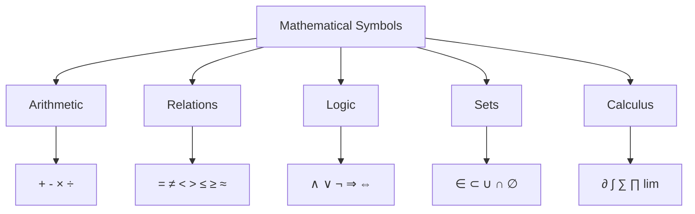

# Mathematical Language

## Intuition

Mathematics is a language--arguably the most precise language ever developed. Just as programming languages have syntax, keywords, and conventions, mathematics has its own vocabulary and grammar that has evolved over centuries.

**Real-world analogy**: Think of mathematical notation like code syntax. Just as `for i in range(10):` means something specific in Python, the symbol $\sum_{i=0}^{9}$ means the same thing mathematically. Both are shorthand for "do this repeatedly." The difference? Mathematical notation is language-agnostic and has been refined for centuries.

**Why this matters for ML**: Every ML paper, every library documentation, every algorithm description uses mathematical notation. Being fluent in this notation is like knowing English in an English-speaking country--you can function without it, but everything becomes harder.

## Visual Explanation

### Common Mathematical Symbols



### The Hierarchy of Equality

$$\text{Identity} \supset \text{Equality} \supset \text{Approximation}$$

| Symbol | Meaning | Example |
|--------|---------|---------|
| $\equiv$ | Identical by definition | $f(x) \equiv x^2$ (defining f) |
| $=$ | Equal in value | $2 + 2 = 4$ |
| $\approx$ | Approximately equal | $\pi \approx 3.14159$ |
| $\sim$ | Similar/proportional to | $f(n) \sim n^2$ (asymptotic) |

## Mathematical Foundation

### Symbols and Notation

Mathematical notation serves one purpose: **unambiguous communication**. Here are the essential symbols:

**Greek Letters** (used constantly in ML):
- $\alpha, \beta$ (alpha, beta): Learning rates, parameters
- $\theta$ (theta): Model parameters
- $\lambda$ (lambda): Regularization strength
- $\sigma$ (sigma): Standard deviation, sigmoid function
- $\mu$ (mu): Mean
- $\epsilon$ (epsilon): Small values, errors
- $\nabla$ (nabla): Gradient operator

**Common Operators**:
- $\sum_{i=1}^{n} x_i$ : Sum of $x_1 + x_2 + \cdots + x_n$
- $\prod_{i=1}^{n} x_i$ : Product of $x_1 \times x_2 \times \cdots \times x_n$
- $\forall$ : "For all" (universal quantifier)
- $\exists$ : "There exists" (existential quantifier)

### Equality vs Identity

**Equality** ($=$) states that two expressions have the same value:
$$2 + 3 = 5$$

**Identity** ($\equiv$) states that two expressions are the same by definition or are always equal:
$$\sin^2(x) + \cos^2(x) \equiv 1$$

This distinction matters in ML. When we write $\hat{y} = f(x; \theta)$, we're saying the prediction equals the function output. When we write $L(\theta) \equiv \frac{1}{n}\sum_{i=1}^{n}(y_i - \hat{y}_i)^2$, we're defining what the loss function is.

### Approximation vs Exactness

In computing, we rarely have exact values. Understanding approximation symbols helps:

- $\approx$ : Approximately equal (numerical approximation)
- $\sim$ : Asymptotically similar (behavior as values grow)
- $\propto$ : Proportional to (equal up to a constant)

Example: In gradient descent, we approximate:
$$\theta_{new} \approx \theta_{old} - \alpha \nabla L(\theta)$$

The approximation comes from using a finite learning rate $\alpha$ instead of infinitesimal steps.

### Order of Operations (PEMDAS Extended)

Mathematics follows strict precedence rules:

1. **Parentheses** (innermost first)
2. **Exponents** (including roots)
3. **Multiplication and Division** (left to right)
4. **Addition and Subtraction** (left to right)

But in mathematical notation, we also have:

5. **Function application** binds tighter than arithmetic: $\sin x + 1 = (\sin x) + 1$
6. **Subscripts and superscripts** are evaluated first: $x_i^2 = (x_i)^2$
7. **Summation** acts on the entire expression until a clear boundary

**Critical for ML**: The expression $\sum_{i=1}^{n} x_i \cdot w_i$ means $\sum_{i=1}^{n} (x_i \cdot w_i)$, not $(\sum_{i=1}^{n} x_i) \cdot w_i$.

### Mathematical Conventions

**Implicit multiplication**: $2x$ means $2 \times x$

**Function notation**:
- $f(x)$: Function f applied to x
- $f: A \to B$: Function f maps from set A to set B
- $f \circ g$: Function composition (apply g first, then f)

**Indexing conventions**:
- Mathematics traditionally uses 1-based indexing
- Computer science uses 0-based indexing
- Always check which convention a paper uses!

**Variable naming conventions**:
- $i, j, k$: Integer indices
- $n, m$: Sizes, counts
- $x, y, z$: Variables
- $a, b, c$: Constants
- $f, g, h$: Functions
- Capital letters often denote matrices or sets

## Code Example

```python
import numpy as np

# Demonstrating mathematical notation in code

# Summation: Σ
def summation_example():
    """
    Mathematical notation: Σᵢ₌₁ⁿ xᵢ
    """
    x = np.array([1, 2, 3, 4, 5])

    # Manual implementation
    total = 0
    for i in range(len(x)):
        total += x[i]

    # NumPy implementation (preferred)
    total_np = np.sum(x)

    print(f"Sum of {x}: {total_np}")
    return total_np

# Product: Π
def product_example():
    """
    Mathematical notation: Πᵢ₌₁ⁿ xᵢ
    """
    x = np.array([1, 2, 3, 4, 5])

    # NumPy implementation
    product = np.prod(x)

    print(f"Product of {x}: {product}")
    return product

# Equality vs Approximation
def approximation_example():
    """
    Demonstrating floating-point approximation issues
    """
    # Mathematically: 0.1 + 0.2 = 0.3
    # In floating point: 0.1 + 0.2 ≈ 0.3

    a = 0.1 + 0.2
    b = 0.3

    print(f"0.1 + 0.2 = {a}")
    print(f"0.3 = {b}")
    print(f"Are they equal? {a == b}")  # False!
    print(f"Are they approximately equal? {np.isclose(a, b)}")  # True

    # This is why ML uses tolerance-based comparisons
    tolerance = 1e-9
    print(f"Within tolerance? {abs(a - b) < tolerance}")

# Order of operations
def order_of_operations():
    """
    Demonstrating how math notation maps to code
    """
    x = np.array([1, 2, 3, 4, 5])
    w = np.array([0.1, 0.2, 0.3, 0.4, 0.5])

    # Σᵢ xᵢwᵢ (weighted sum - common in neural networks)
    weighted_sum = np.sum(x * w)
    print(f"Weighted sum Σxᵢwᵢ: {weighted_sum}")

    # (Σᵢ xᵢ) × (Σᵢ wᵢ) - different operation!
    product_of_sums = np.sum(x) * np.sum(w)
    print(f"Product of sums (Σxᵢ)(Σwᵢ): {product_of_sums}")

    # These are NOT the same!
    print(f"Are they equal? {weighted_sum == product_of_sums}")

# Greek letters in ML
def ml_notation_example():
    """
    Common ML notation translated to code
    """
    # θ (theta) - model parameters
    theta = np.array([0.5, -0.3, 0.8])

    # α (alpha) - learning rate
    alpha = 0.01

    # ε (epsilon) - small constant for numerical stability
    epsilon = 1e-8

    # λ (lambda) - regularization strength
    lambda_reg = 0.001

    # Simulated gradient
    gradient = np.array([0.1, -0.2, 0.05])

    # Gradient descent update: θ_new = θ_old - α∇L(θ)
    theta_new = theta - alpha * gradient

    print(f"Original θ: {theta}")
    print(f"Updated θ: {theta_new}")

    # L2 regularization term: λΣθᵢ²
    l2_penalty = lambda_reg * np.sum(theta ** 2)
    print(f"L2 penalty (λΣθᵢ²): {l2_penalty}")

if __name__ == "__main__":
    print("=== Summation Example ===")
    summation_example()
    print("\n=== Product Example ===")
    product_example()
    print("\n=== Approximation Example ===")
    approximation_example()
    print("\n=== Order of Operations ===")
    order_of_operations()
    print("\n=== ML Notation Example ===")
    ml_notation_example()
```

## ML Relevance

Mathematical notation appears everywhere in ML:

**Neural Network Forward Pass**:
$$\hat{y} = \sigma(W^{(L)} \cdot \sigma(W^{(L-1)} \cdots \sigma(W^{(1)} \cdot x)))$$

**Loss Functions**:
- MSE: $L = \frac{1}{n}\sum_{i=1}^{n}(y_i - \hat{y}_i)^2$
- Cross-entropy: $L = -\sum_{i=1}^{n}y_i\log(\hat{y}_i)$

**Gradient Descent**:
$$\theta := \theta - \alpha \nabla_\theta L(\theta)$$

**Regularization**:
- L1: $\lambda\sum_{i}|\theta_i|$
- L2: $\lambda\sum_{i}\theta_i^2$

Being able to read these expressions fluently will help you:
1. Understand research papers
2. Debug implementations
3. Modify algorithms for your specific needs

## When to Use / Ignore

### When to Pay Close Attention
- Reading research papers or textbooks
- Implementing algorithms from scratch
- Debugging numerical issues (approximation errors)
- Communicating with mathematicians or researchers

### Common Pitfalls
1. **Indexing confusion**: Math uses 1-based, code uses 0-based
2. **Implicit operations**: $2x$ in math needs explicit `2 * x` in code
3. **Floating-point equality**: Never use `==` for float comparison
4. **Order of operations**: When in doubt, use parentheses
5. **Greek letter confusion**: $\nu$ (nu) vs $v$ (v), $\rho$ (rho) vs $p$ (p)

### Best Practices
- Keep a reference sheet of notation as you learn
- When implementing formulas, add comments with the mathematical notation
- Test edge cases: $n=0$, $n=1$, empty arrays

## Exercises

### Exercise 1: Notation Translation
Translate this mathematical expression into Python code:
$$z = \sum_{i=1}^{n} w_i \cdot x_i + b$$

**Solution**:
```python
import numpy as np

def linear_combination(w, x, b):
    """
    Computes z = Σᵢ wᵢxᵢ + b (linear neuron)
    """
    return np.dot(w, x) + b

# Test
w = np.array([0.5, -0.3, 0.8])
x = np.array([1.0, 2.0, 3.0])
b = 0.1
z = linear_combination(w, x, b)
print(f"z = {z}")  # z = 2.0
```

### Exercise 2: Equality vs Approximation
Determine whether these should use `==` or `np.isclose()`:

a) Checking if an integer counter reached a limit
b) Checking if a loss value converged
c) Checking if two normalized vectors are equal

**Solution**:
```python
import numpy as np

# a) Integer counter - use ==
counter = 10
limit = 10
print(counter == limit)  # True - integers are exact

# b) Loss convergence - use np.isclose() or threshold
old_loss = 0.001234
new_loss = 0.001235
print(np.isclose(old_loss, new_loss, rtol=1e-3))  # True

# c) Normalized vectors - use np.allclose()
v1 = np.array([1, 0, 0])
v2 = np.array([1, 0, 0]) / np.linalg.norm([1, 0, 0])
print(np.allclose(v1, v2))  # True
```

### Exercise 3: Order of Operations
What is the value of each expression?

a) $2^{3^2}$
b) $\sum_{i=1}^{3} i^2$
c) $\frac{1}{2}x^2$ where $x = 4$

**Solution**:
```python
import numpy as np

# a) 2^(3^2) = 2^9 = 512 (exponents evaluate right to left)
result_a = 2 ** (3 ** 2)
print(f"2^(3^2) = {result_a}")  # 512

# b) 1² + 2² + 3² = 1 + 4 + 9 = 14
result_b = sum(i**2 for i in range(1, 4))
print(f"Σi² for i=1 to 3: {result_b}")  # 14

# c) (1/2) × 4² = 0.5 × 16 = 8
x = 4
result_c = 0.5 * x**2
print(f"(1/2)x² where x=4: {result_c}")  # 8.0
```

## Summary

- **Mathematical notation is a precise language** for communicating quantitative ideas unambiguously
- **Greek letters** are used extensively in ML ($\alpha, \theta, \sigma, \mu, \lambda$, etc.)
- **Equality ($=$) vs Identity ($\equiv$)**: Equality compares values; identity defines or asserts permanent equivalence
- **Approximation ($\approx$)** is essential in computing due to floating-point limitations
- **Order of operations** follows PEMDAS, with additional rules for function application and summation
- **Mathematical conventions** (1-based indexing, implicit multiplication) may differ from programming conventions
- **Always use tolerance-based comparison** for floating-point numbers in code
- **When in doubt, add parentheses** to make order of operations explicit

---

*Next: [Sets and Logic](./02-sets-and-logic.md)*
