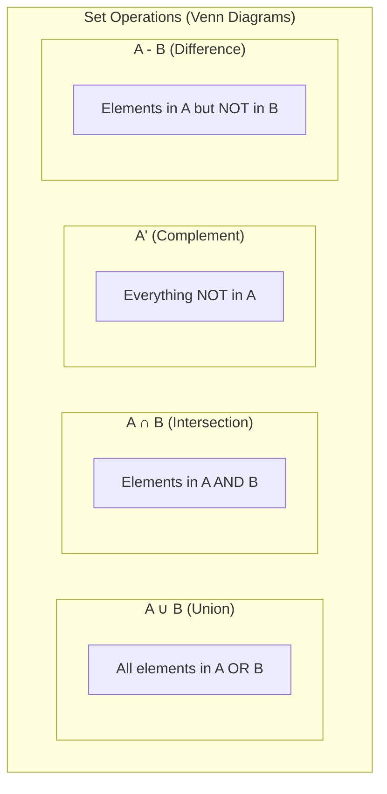

# Sets and Logic

## Intuition

Sets and logic form the bedrock of mathematical reasoning. A **set** is simply a collection of distinct objects--think of it as an unordered list with no duplicates. **Logic** provides the rules for reasoning about these collections and making valid conclusions.

**Real-world analogy**:
- A set is like a folder containing unique files. The folder "Animals" might contain {dog, cat, elephant}. The order doesn't matter, and you can't have duplicates.
- Logic is like the `if-then-else` statements in your code. Just as your program follows logical rules to make decisions, mathematics uses logic to derive conclusions from premises.

**Why this matters for ML**:
- Data is organized in sets (training set, test set, feature set)
- Filtering data uses set operations (intersection, union)
- Boolean masks in NumPy/PyTorch use logical operators
- Decision trees use logical conditions to split data
- Hypothesis testing relies on logical implications

## Visual Explanation

### Set Operations Visualized



### Set Relationships

$$\text{Universal Set } U$$
$$\downarrow$$
$$A \subseteq U \text{ (A is a subset of U)}$$
$$\downarrow$$
$$\mathcal{P}(A) \text{ (Power set: all subsets of A)}$$

### Logical Operators

| Operation | Symbol | Python | NumPy |
|-----------|--------|--------|-------|
| AND | $\land$ | `and` | `&` or `np.logical_and` |
| OR | $\lor$ | `or` | `\|` or `np.logical_or` |
| NOT | $\lnot$ | `not` | `~` or `np.logical_not` |
| XOR | $\oplus$ | `^` | `^` or `np.logical_xor` |

## Mathematical Foundation

### Sets: The Basics

A **set** is a well-defined collection of distinct objects. We denote sets with curly braces:

$$A = \{1, 2, 3\}$$

**Key properties**:
- **No duplicates**: $\{1, 1, 2\} = \{1, 2\}$
- **No order**: $\{1, 2, 3\} = \{3, 1, 2\}$
- **Can be infinite**: $\mathbb{N} = \{1, 2, 3, ...\}$ (natural numbers)

**Set membership**: $x \in A$ means "x is an element of A"
- $2 \in \{1, 2, 3\}$ is true
- $5 \in \{1, 2, 3\}$ is false ($5 \notin \{1, 2, 3\}$)

**Empty set**: $\emptyset = \{\}$ (the set with no elements)

### Subsets and Power Sets

**Subset**: $A \subseteq B$ means every element of A is also in B
$$A = \{1, 2\}, B = \{1, 2, 3\} \Rightarrow A \subseteq B$$

**Proper subset**: $A \subset B$ means $A \subseteq B$ and $A \neq B$

**Power set**: $\mathcal{P}(A)$ is the set of all subsets of A

For $A = \{1, 2\}$:
$$\mathcal{P}(A) = \{\emptyset, \{1\}, \{2\}, \{1, 2\}\}$$

The power set of a set with $n$ elements has $2^n$ elements. This is why feature subset selection is computationally expensive!

### Set Operations

**Union** ($\cup$): Elements in A OR B (or both)
$$A \cup B = \{x : x \in A \text{ or } x \in B\}$$

**Intersection** ($\cap$): Elements in A AND B
$$A \cap B = \{x : x \in A \text{ and } x \in B\}$$

**Complement** ($A^c$ or $\overline{A}$): Elements NOT in A (relative to universal set U)
$$A^c = \{x \in U : x \notin A\}$$

**Difference** ($A - B$ or $A \setminus B$): Elements in A but NOT in B
$$A - B = \{x : x \in A \text{ and } x \notin B\}$$

**Symmetric Difference** ($A \triangle B$): Elements in A or B, but not both (XOR)
$$A \triangle B = (A - B) \cup (B - A)$$

### Logical Operators

**AND** ($\land$): Both must be true
$$P \land Q \text{ is true only when both P and Q are true}$$

**OR** ($\lor$): At least one must be true
$$P \lor Q \text{ is true when P is true, Q is true, or both}$$

**NOT** ($\lnot$): Negation
$$\lnot P \text{ is true when P is false}$$

### Implication

**Implication** ($\Rightarrow$): If P then Q
$$P \Rightarrow Q$$

This is perhaps the most misunderstood logical operator. $P \Rightarrow Q$ is **only false** when P is true and Q is false. Otherwise, it's true!

| P | Q | P $\Rightarrow$ Q |
|---|---|-------------------|
| T | T | T |
| T | F | F |
| F | T | T |
| F | F | T |

**Why is "false implies anything" true?** Think of it as a promise: "If it rains, I'll bring an umbrella." If it doesn't rain (P is false), I haven't broken my promise regardless of whether I bring an umbrella.

**Biconditional** ($\Leftrightarrow$): P if and only if Q
$$P \Leftrightarrow Q \equiv (P \Rightarrow Q) \land (Q \Rightarrow P)$$

### Truth Tables

Truth tables exhaustively list all possible input combinations and their outputs. They're the foundation for understanding logical operations.

**Full truth table for common operations**:

| P | Q | $\lnot P$ | $P \land Q$ | $P \lor Q$ | $P \oplus Q$ | $P \Rightarrow Q$ | $P \Leftrightarrow Q$ |
|---|---|-----------|-------------|------------|--------------|-------------------|----------------------|
| T | T | F | T | T | F | T | T |
| T | F | F | F | T | T | F | F |
| F | T | T | F | T | T | T | F |
| F | F | T | F | F | F | T | T |

### De Morgan's Laws

These laws connect set operations with logical operators:

$$\lnot(P \land Q) \equiv \lnot P \lor \lnot Q$$
$$\lnot(P \lor Q) \equiv \lnot P \land \lnot Q$$

For sets:
$$(A \cap B)^c = A^c \cup B^c$$
$$(A \cup B)^c = A^c \cap B^c$$

These are incredibly useful for simplifying complex conditions!

## Code Example

```python
import numpy as np

# ============================================
# PART 1: Set Operations in Python
# ============================================

def set_operations_demo():
    """Demonstrating set operations"""

    # Define sets
    A = {1, 2, 3, 4, 5}
    B = {4, 5, 6, 7, 8}
    U = {1, 2, 3, 4, 5, 6, 7, 8, 9, 10}  # Universal set

    print("Set A:", A)
    print("Set B:", B)
    print("Universal set U:", U)
    print()

    # Union: A ∪ B
    union = A | B  # or A.union(B)
    print(f"A ∪ B (union): {union}")

    # Intersection: A ∩ B
    intersection = A & B  # or A.intersection(B)
    print(f"A ∩ B (intersection): {intersection}")

    # Difference: A - B
    difference = A - B  # or A.difference(B)
    print(f"A - B (difference): {difference}")

    # Symmetric Difference: A △ B
    sym_diff = A ^ B  # or A.symmetric_difference(B)
    print(f"A △ B (symmetric difference): {sym_diff}")

    # Complement: A^c (relative to U)
    complement = U - A
    print(f"A^c (complement): {complement}")

    # Subset check
    C = {1, 2}
    print(f"\n{C} ⊆ {A}? {C.issubset(A)}")
    print(f"{A} ⊆ {B}? {A.issubset(B)}")

def power_set_demo():
    """Demonstrating power set generation"""
    from itertools import combinations

    A = {1, 2, 3}

    # Generate power set
    power_set = []
    elements = list(A)
    for r in range(len(elements) + 1):
        for combo in combinations(elements, r):
            power_set.append(set(combo))

    print(f"Set A: {A}")
    print(f"Power set P(A): {power_set}")
    print(f"Number of subsets: {len(power_set)} = 2^{len(A)} = {2**len(A)}")

# ============================================
# PART 2: Logical Operations
# ============================================

def logical_operations_demo():
    """Demonstrating logical operations"""

    P = True
    Q = False

    print(f"P = {P}, Q = {Q}")
    print()

    # Basic operations
    print(f"NOT P (¬P): {not P}")
    print(f"P AND Q (P ∧ Q): {P and Q}")
    print(f"P OR Q (P ∨ Q): {P or Q}")
    print(f"P XOR Q (P ⊕ Q): {P ^ Q}")

    # Implication: P → Q is equivalent to (NOT P) OR Q
    implication = (not P) or Q
    print(f"P → Q (implication): {implication}")

    # Biconditional: P ↔ Q is equivalent to (P → Q) AND (Q → P)
    biconditional = ((not P) or Q) and ((not Q) or P)
    print(f"P ↔ Q (biconditional): {biconditional}")

def truth_table_demo():
    """Generate and display truth tables"""

    print("Complete Truth Table:")
    print("-" * 70)
    print(f"{'P':<6}{'Q':<6}{'¬P':<6}{'P∧Q':<6}{'P∨Q':<6}{'P⊕Q':<6}{'P→Q':<6}{'P↔Q':<6}")
    print("-" * 70)

    for P in [True, False]:
        for Q in [True, False]:
            not_P = not P
            and_op = P and Q
            or_op = P or Q
            xor_op = P ^ Q
            implies = (not P) or Q
            iff = P == Q

            print(f"{str(P):<6}{str(Q):<6}{str(not_P):<6}{str(and_op):<6}"
                  f"{str(or_op):<6}{str(xor_op):<6}{str(implies):<6}{str(iff):<6}")

# ============================================
# PART 3: NumPy Boolean Operations (ML-relevant)
# ============================================

def numpy_boolean_demo():
    """Boolean operations in NumPy - essential for ML"""

    # Sample data: array of values
    data = np.array([1, 5, 3, 8, 2, 9, 4, 7, 6])

    print("Data:", data)
    print()

    # Create boolean masks
    greater_than_5 = data > 5
    less_than_8 = data < 8

    print(f"Mask (data > 5): {greater_than_5}")
    print(f"Mask (data < 8): {less_than_8}")
    print()

    # AND: elements > 5 AND < 8
    mask_and = greater_than_5 & less_than_8
    print(f"AND mask (5 < x < 8): {mask_and}")
    print(f"Filtered data: {data[mask_and]}")
    print()

    # OR: elements > 5 OR < 3
    mask_or = (data > 5) | (data < 3)
    print(f"OR mask (x > 5 or x < 3): {mask_or}")
    print(f"Filtered data: {data[mask_or]}")
    print()

    # NOT: elements NOT > 5
    mask_not = ~greater_than_5
    print(f"NOT mask (not x > 5): {mask_not}")
    print(f"Filtered data: {data[mask_not]}")

def de_morgans_law_demo():
    """Demonstrating De Morgan's Laws in code"""

    data = np.array([1, 5, 3, 8, 2, 9, 4, 7, 6])

    # Condition: NOT (A AND B)
    A = data > 3
    B = data < 7

    # Method 1: Direct NOT (A AND B)
    result1 = ~(A & B)

    # Method 2: De Morgan's - (NOT A) OR (NOT B)
    result2 = (~A) | (~B)

    print("Data:", data)
    print(f"A (data > 3): {A}")
    print(f"B (data < 7): {B}")
    print()
    print(f"¬(A ∧ B): {result1}")
    print(f"¬A ∨ ¬B: {result2}")
    print(f"Are they equal? {np.array_equal(result1, result2)}")

# ============================================
# PART 4: ML Application - Data Filtering
# ============================================

def ml_data_filtering_example():
    """Practical ML example: filtering training data"""

    np.random.seed(42)

    # Simulated dataset
    n_samples = 1000
    ages = np.random.randint(18, 80, n_samples)
    incomes = np.random.exponential(50000, n_samples)
    has_degree = np.random.choice([True, False], n_samples, p=[0.3, 0.7])

    print("Dataset Statistics:")
    print(f"Total samples: {n_samples}")
    print(f"Age range: {ages.min()} - {ages.max()}")
    print(f"Income range: ${incomes.min():.0f} - ${incomes.max():.0f}")
    print(f"% with degree: {has_degree.mean() * 100:.1f}%")
    print()

    # Filter: Young professionals (25-35) with degree and income > 60k
    young = (ages >= 25) & (ages <= 35)
    high_income = incomes > 60000
    educated = has_degree

    # Intersection of all conditions
    target_segment = young & high_income & educated

    print("Filter: Young professionals (25-35) with degree and income > $60k")
    print(f"Matches: {target_segment.sum()} ({target_segment.mean()*100:.1f}%)")
    print()

    # Alternative segment: Either very young OR very old
    extreme_ages = (ages < 25) | (ages > 65)
    print(f"Extreme ages (< 25 or > 65): {extreme_ages.sum()} samples")

    # Complement: NOT target segment
    non_target = ~target_segment
    print(f"Non-target segment: {non_target.sum()} samples")

if __name__ == "__main__":
    print("=" * 50)
    print("SET OPERATIONS")
    print("=" * 50)
    set_operations_demo()

    print("\n" + "=" * 50)
    print("POWER SET")
    print("=" * 50)
    power_set_demo()

    print("\n" + "=" * 50)
    print("LOGICAL OPERATIONS")
    print("=" * 50)
    logical_operations_demo()

    print("\n" + "=" * 50)
    print("TRUTH TABLE")
    print("=" * 50)
    truth_table_demo()

    print("\n" + "=" * 50)
    print("NUMPY BOOLEAN OPERATIONS")
    print("=" * 50)
    numpy_boolean_demo()

    print("\n" + "=" * 50)
    print("DE MORGAN'S LAWS")
    print("=" * 50)
    de_morgans_law_demo()

    print("\n" + "=" * 50)
    print("ML DATA FILTERING EXAMPLE")
    print("=" * 50)
    ml_data_filtering_example()
```

## ML Relevance

### Sets in Machine Learning

1. **Data Splitting**: Training, validation, and test sets are disjoint sets
   $$D_{train} \cap D_{test} = \emptyset$$

2. **Feature Selection**: Choosing a subset of features from the power set of all features

3. **Ensemble Methods**: Different models trained on different subsets of data (bagging)

4. **Cross-Validation**: K-fold CV partitions data into K disjoint subsets

### Logic in Machine Learning

1. **Decision Trees**: Each split is a logical condition
   ```
   if (age > 30) AND (income > 50000):
       predict("high_value")
   ```

2. **Boolean Masks**: Filtering data in NumPy/Pandas
   ```python
   df[df['age'] > 30]  # Implicit logical operation
   ```

3. **Loss Functions**: Conditions determine how errors are calculated
   $$L = \begin{cases} 0 & \text{if } |y - \hat{y}| < \epsilon \\ (y - \hat{y})^2 & \text{otherwise} \end{cases}$$

4. **Attention Masks**: Transformers use boolean masks to ignore padding tokens

5. **Rule-Based Systems**: Expert systems and some interpretable ML models use logical rules

## When to Use / Ignore

### When to Pay Close Attention

- **Data preprocessing**: Filtering, selecting subsets
- **Feature engineering**: Creating boolean features
- **Model interpretation**: Understanding decision boundaries
- **Debugging**: Verifying data pipeline logic
- **Research papers**: Set notation is everywhere

### Common Pitfalls

1. **Confusing AND/OR**: `(A and B)` vs `(A or B)` - double-check your conditions
2. **Operator precedence**: In NumPy, `&` and `|` have higher precedence than `<`, `>`. Use parentheses!
   ```python
   # Wrong: data > 5 & data < 10  (evaluates as data > (5 & data) < 10)
   # Right: (data > 5) & (data < 10)
   ```
3. **Forgetting De Morgan's Laws**: Simplify complex conditions
4. **Empty set edge cases**: $A \cap \emptyset = \emptyset$, $A \cup \emptyset = A$
5. **Implication confusion**: "P implies Q" is NOT the same as "Q implies P"

### Best Practices

- Use meaningful variable names for boolean masks
- Comment complex logical conditions
- Test edge cases (empty sets, all True, all False)
- Use De Morgan's laws to simplify conditions

## Exercises

### Exercise 1: Set Operations
Given $A = \{1, 2, 3, 4\}$ and $B = \{3, 4, 5, 6\}$, compute:
- $A \cup B$
- $A \cap B$
- $A - B$
- $A \triangle B$

**Solution**:
```python
A = {1, 2, 3, 4}
B = {3, 4, 5, 6}

print(f"A ∪ B = {A | B}")       # {1, 2, 3, 4, 5, 6}
print(f"A ∩ B = {A & B}")       # {3, 4}
print(f"A - B = {A - B}")       # {1, 2}
print(f"A △ B = {A ^ B}")       # {1, 2, 5, 6}
```

### Exercise 2: Truth Table Construction
Construct the truth table for: $(P \lor Q) \land \lnot R$

**Solution**:
```python
print("P\tQ\tR\t(P∨Q)∧¬R")
print("-" * 32)
for P in [True, False]:
    for Q in [True, False]:
        for R in [True, False]:
            result = (P or Q) and (not R)
            print(f"{P}\t{Q}\t{R}\t{result}")
```

### Exercise 3: Data Filtering
Given a dataset with columns `age`, `salary`, and `department`, write boolean expressions to select:
a) Employees over 30 in Engineering
b) Employees under 25 OR with salary over 100k
c) Employees NOT in Sales

**Solution**:
```python
import numpy as np
import pandas as pd

# Sample data
np.random.seed(42)
df = pd.DataFrame({
    'age': np.random.randint(22, 60, 100),
    'salary': np.random.randint(40000, 150000, 100),
    'department': np.random.choice(['Engineering', 'Sales', 'Marketing'], 100)
})

# a) Over 30 in Engineering
mask_a = (df['age'] > 30) & (df['department'] == 'Engineering')
print(f"Over 30 in Engineering: {mask_a.sum()} employees")

# b) Under 25 OR salary > 100k
mask_b = (df['age'] < 25) | (df['salary'] > 100000)
print(f"Under 25 OR salary > 100k: {mask_b.sum()} employees")

# c) NOT in Sales
mask_c = df['department'] != 'Sales'  # or: ~(df['department'] == 'Sales')
print(f"Not in Sales: {mask_c.sum()} employees")
```

## Summary

- **Sets** are collections of unique elements; order doesn't matter
- **Subsets** ($\subseteq$) represent "contained within" relationships
- **Power sets** contain all possible subsets; size is $2^n$ for n elements
- **Union** ($\cup$) combines elements (OR)
- **Intersection** ($\cap$) finds common elements (AND)
- **Complement** finds elements NOT in a set
- **Logical operators** (AND, OR, NOT) follow strict truth tables
- **Implication** ($\Rightarrow$) is only false when P is true and Q is false
- **De Morgan's Laws** help simplify complex logical expressions
- **Boolean masking** in NumPy is essential for ML data manipulation
- **Always use parentheses** around comparison operators when using `&` and `|` in NumPy

---

*Previous: [Mathematical Language](./01-mathematical-language.md) | Next: [Mathematical Thinking](./03-mathematical-thinking.md)*
