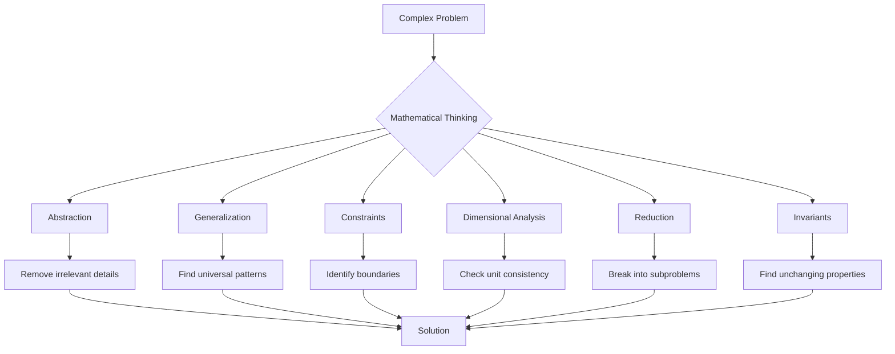

# Mathematical Thinking

## Intuition

Mathematical thinking is not about memorizing formulas or performing calculations. It's a set of mental tools for solving problems systematically. These tools are remarkably similar to software engineering principles--and that's no coincidence. Computer science emerged from mathematics, and the best programmers often think like mathematicians.

**Real-world analogy**: Mathematical thinking is like a Swiss Army knife for problem-solving. Each tool (abstraction, generalization, reduction) has its specific use. Just as an experienced developer knows when to use inheritance vs. composition, a mathematical thinker knows when to abstract vs. when to stay concrete.

**Why this matters for ML**: Machine learning is fundamentally about finding patterns. Mathematical thinking provides the framework for:
- Abstracting away irrelevant details to focus on what matters
- Generalizing from specific examples to universal rules
- Reducing complex problems to simpler, solvable ones
- Identifying properties that remain constant (invariants) during transformations

## Visual Explanation

### The Mathematical Thinking Toolkit



### The Abstraction Ladder

$$\text{Concrete} \xrightarrow{\text{abstraction}} \text{Abstract} \xrightarrow{\text{instantiation}} \text{Concrete}$$

| Level | Example |
|-------|---------|
| Most Concrete | "This image of a cat" |
| | "Images of cats" |
| | "Images of animals" |
| | "Images" |
| | "Tensors of shape (H, W, C)" |
| Most Abstract | "Multidimensional arrays" |

## Mathematical Foundation

### Abstraction

**Definition**: Abstraction is the process of removing irrelevant details to focus on essential properties.

In mathematics, we abstract constantly:
- A "number" abstracts away what we're counting
- A "function" abstracts the process of transformation
- A "vector" abstracts direction and magnitude from physical interpretation

**Levels of abstraction** in the same concept:
$$5 \text{ apples} \to 5 \to \text{natural number} \to \text{integer} \to \text{real number} \to \text{element of a field}$$

**The abstraction principle**: Work at the highest level of abstraction that still captures the essential features of your problem.

### Generalization

**Definition**: Generalization extends a specific result to a broader class of cases.

**The generalization process**:
1. Observe specific cases: $1+2=3$, $2+3=5$, $3+4=7$
2. Identify pattern: Sum of consecutive integers
3. Formulate general rule: $n + (n+1) = 2n + 1$
4. Prove the generalization holds

**Inductive generalization**: Moving from specific to general
$$\text{Case}_1, \text{Case}_2, \ldots, \text{Case}_n \Rightarrow \text{General Rule}$$

**Danger of over-generalization**: Just because a pattern holds for observed cases doesn't mean it holds universally. This is the core challenge of machine learning!

### Constraints

**Definition**: Constraints are conditions that limit the possible values or behaviors of a system.

In mathematics, constraints define the problem space:

$$\text{Minimize } f(x) \text{ subject to } g(x) \leq 0$$

**Types of constraints**:
- **Equality constraints**: $x + y = 10$
- **Inequality constraints**: $x \geq 0$
- **Implicit constraints**: Domain restrictions (can't divide by zero)

**Constraint satisfaction**: Finding values that satisfy all constraints simultaneously.

**The power of constraints**: Constraints make problems solvable. Without constraints, most optimization problems have no solution. With the right constraints, complex problems become tractable.

### Dimensional Analysis

**Definition**: Dimensional analysis is the study of relationships between physical quantities based on their units/dimensions.

**The fundamental principle**: Both sides of an equation must have the same dimensions.

$$\text{velocity} = \frac{\text{distance}}{\text{time}} \Rightarrow [v] = \frac{[L]}{[T]}$$

**Dimensional homogeneity**: An equation is only valid if all terms have consistent dimensions.

**Using dimensional analysis**:
1. Write down quantities involved and their dimensions
2. Find combinations that produce the desired dimension
3. Use this to check formulas or derive new ones

**Example**: What's the period $T$ of a pendulum?
- Relevant quantities: length $L$ [m], gravity $g$ [m/s$^2$], mass $m$ [kg]
- Period has dimension [s] = [T]
- Only combination that gives [T]: $\sqrt{L/g}$
- Therefore: $T \propto \sqrt{L/g}$

### Reduction

**Definition**: Reduction transforms a complex problem into simpler subproblems or into a known solvable problem.

**Types of reduction**:

1. **Decomposition**: Break problem into independent parts
   $$\text{Sort}(A) = \text{Merge}(\text{Sort}(A_1), \text{Sort}(A_2))$$

2. **Transformation**: Convert to a known problem
   $$\text{This problem} \xrightarrow{\text{reduction}} \text{Known problem with known solution}$$

3. **Relaxation**: Remove constraints to find an easier problem, then refine
   $$\text{Hard optimization} \to \text{Relaxed optimization} \to \text{Refinement}$$

**Reduction in ML**:
- Multiclass classification reduces to multiple binary classifications (one-vs-rest)
- Regression can be reduced to classification (quantile binning)
- High-dimensional problems reduce to lower dimensions (PCA)

### Invariants

**Definition**: An invariant is a property that remains unchanged under a specific transformation.

$$\text{If } T \text{ is a transformation, } I \text{ is an invariant if } I(x) = I(T(x))$$

**Common invariants**:
- **Geometric**: Distance, angle, area (under certain transformations)
- **Algebraic**: Trace of a matrix (under similarity transforms)
- **Topological**: Number of holes in a shape (under continuous deformation)

**Why invariants matter**:
1. They simplify problems (focus on what doesn't change)
2. They verify correctness (invariants should hold before and after operations)
3. They define equivalence (objects with the same invariants are "the same" in some sense)

**Loop invariants** (from CS): A condition that's true before and after each iteration--essential for proving algorithm correctness.

## Code Example

```python
import numpy as np
from typing import List, Callable, Tuple
from functools import reduce

# ============================================
# ABSTRACTION: From specific to general
# ============================================

def abstraction_demo():
    """
    Demonstrating levels of abstraction in computing distances
    """

    # Level 0: Specific calculation
    def euclidean_2d_specific(x1, y1, x2, y2):
        """Distance between two specific 2D points"""
        return np.sqrt((x2 - x1)**2 + (y2 - y1)**2)

    # Level 1: Abstracted to arrays
    def euclidean_2d_array(p1, p2):
        """Distance between two 2D points (as arrays)"""
        return np.sqrt(np.sum((p2 - p1)**2))

    # Level 2: Generalized to n dimensions
    def euclidean_nd(p1, p2):
        """Distance between two n-dimensional points"""
        return np.sqrt(np.sum((p2 - p1)**2))

    # Level 3: Abstracted to any distance metric
    def distance(p1, p2, metric='euclidean', p=2):
        """General distance function supporting multiple metrics"""
        diff = np.abs(p2 - p1)
        if metric == 'euclidean':
            return np.sqrt(np.sum(diff**2))
        elif metric == 'manhattan':
            return np.sum(diff)
        elif metric == 'minkowski':
            return np.sum(diff**p)**(1/p)
        elif metric == 'chebyshev':
            return np.max(diff)

    # Test at each level
    p1 = np.array([0, 0, 0])
    p2 = np.array([1, 1, 1])

    print("Abstraction Levels in Distance Calculation:")
    print(f"Specific (2D): {euclidean_2d_specific(0, 0, 1, 1):.4f}")
    print(f"Array (2D): {euclidean_2d_array(p1[:2], p2[:2]):.4f}")
    print(f"N-dimensional: {euclidean_nd(p1, p2):.4f}")
    print(f"General (Euclidean): {distance(p1, p2, 'euclidean'):.4f}")
    print(f"General (Manhattan): {distance(p1, p2, 'manhattan'):.4f}")
    print(f"General (Chebyshev): {distance(p1, p2, 'chebyshev'):.4f}")

# ============================================
# GENERALIZATION: Pattern recognition
# ============================================

def generalization_demo():
    """
    Demonstrating generalization from specific cases
    """

    # Specific observations
    observations = [
        (1, 1),   # 1^2 = 1
        (2, 4),   # 2^2 = 4
        (3, 9),   # 3^2 = 9
        (4, 16),  # 4^2 = 16
    ]

    print("Observations:")
    for x, y in observations:
        print(f"  f({x}) = {y}")

    # Hypothesis: f(x) = x^2
    def hypothesis(x):
        return x ** 2

    # Test generalization
    print("\nGeneralization test f(x) = x^2:")
    for x in range(1, 10):
        print(f"  f({x}) = {hypothesis(x)}")

    # The danger: does the pattern hold outside training data?
    print("\nWarning: Generalization may fail outside observed range!")
    print("What if the true pattern is: f(x) = x^2 for x <= 10, else 0?")

# ============================================
# CONSTRAINTS: Limiting the solution space
# ============================================

def constraints_demo():
    """
    Demonstrating how constraints make problems solvable
    """
    from scipy.optimize import minimize, LinearConstraint

    # Unconstrained optimization
    def unconstrained_min():
        # f(x) = x^2 has minimum at x = 0
        f = lambda x: x[0]**2
        result = minimize(f, x0=[5.0])
        return result.x[0], result.fun

    # Constrained optimization: x >= 2
    def constrained_min():
        f = lambda x: x[0]**2
        # x >= 2 means we need a lower bound
        result = minimize(f, x0=[5.0], bounds=[(2, None)])
        return result.x[0], result.fun

    # Multiple constraints: 2 <= x <= 3
    def multi_constrained_min():
        f = lambda x: x[0]**2
        result = minimize(f, x0=[5.0], bounds=[(2, 3)])
        return result.x[0], result.fun

    x_unc, f_unc = unconstrained_min()
    x_con, f_con = constrained_min()
    x_multi, f_multi = multi_constrained_min()

    print("Minimize f(x) = x^2:")
    print(f"  Unconstrained:      x = {x_unc:.4f}, f(x) = {f_unc:.4f}")
    print(f"  Constrained (x>=2): x = {x_con:.4f}, f(x) = {f_con:.4f}")
    print(f"  Constrained (2<=x<=3): x = {x_multi:.4f}, f(x) = {f_multi:.4f}")

# ============================================
# DIMENSIONAL ANALYSIS
# ============================================

def dimensional_analysis_demo():
    """
    Demonstrating dimensional analysis for formula verification
    """

    # Define units as dictionaries
    def create_unit(m=0, kg=0, s=0, A=0, K=0):
        """Create a unit with SI base dimensions"""
        return {'m': m, 'kg': kg, 's': s, 'A': A, 'K': K}

    def multiply_units(u1, u2):
        """Multiply two units"""
        return {k: u1[k] + u2[k] for k in u1}

    def divide_units(u1, u2):
        """Divide two units"""
        return {k: u1[k] - u2[k] for k in u1}

    def format_unit(u):
        """Format unit for display"""
        parts = [f"{k}^{v}" for k, v in u.items() if v != 0]
        return " * ".join(parts) if parts else "dimensionless"

    # Example: Verify kinetic energy formula E = 0.5 * m * v^2
    mass_unit = create_unit(kg=1)          # [kg]
    velocity_unit = create_unit(m=1, s=-1)  # [m/s]
    energy_unit = create_unit(m=2, kg=1, s=-2)  # [J] = [kg*m^2/s^2]

    # Check: m * v^2
    v_squared = multiply_units(velocity_unit, velocity_unit)
    kinetic_energy = multiply_units(mass_unit, v_squared)

    print("Dimensional Analysis: Kinetic Energy (E = 0.5 * m * v^2)")
    print(f"  [m] = {format_unit(mass_unit)}")
    print(f"  [v] = {format_unit(velocity_unit)}")
    print(f"  [v^2] = {format_unit(v_squared)}")
    print(f"  [m * v^2] = {format_unit(kinetic_energy)}")
    print(f"  [Energy] = {format_unit(energy_unit)}")
    print(f"  Match? {kinetic_energy == energy_unit}")

# ============================================
# REDUCTION: Breaking down problems
# ============================================

def reduction_demo():
    """
    Demonstrating problem reduction techniques
    """

    # Reduction 1: Multiclass to binary (one-vs-rest)
    def one_vs_rest(X, y, classes):
        """Reduce multiclass to multiple binary problems"""
        binary_problems = {}
        for cls in classes:
            # Create binary labels: 1 if class, 0 otherwise
            y_binary = (y == cls).astype(int)
            binary_problems[cls] = (X, y_binary)
            print(f"  Class {cls}: {sum(y_binary)} positive, {len(y_binary) - sum(y_binary)} negative")
        return binary_problems

    # Example data
    X = np.random.randn(100, 5)
    y = np.random.choice(['A', 'B', 'C'], 100)

    print("Reduction: Multiclass -> Binary (One-vs-Rest)")
    binary_problems = one_vs_rest(X, y, ['A', 'B', 'C'])

    # Reduction 2: High-dimensional to low-dimensional (PCA concept)
    print("\nReduction: High-dim -> Low-dim")
    X_high = np.random.randn(100, 50)  # 50 dimensions
    # In practice, use sklearn PCA
    # Here we just demonstrate the concept
    from numpy.linalg import svd
    U, S, Vt = svd(X_high, full_matrices=False)
    X_low = U[:, :3] @ np.diag(S[:3])  # Reduce to 3 dimensions
    print(f"  Original shape: {X_high.shape}")
    print(f"  Reduced shape: {X_low.shape}")
    print(f"  Variance retained: {(S[:3]**2).sum() / (S**2).sum() * 100:.1f}%")

# ============================================
# INVARIANTS: Properties that don't change
# ============================================

def invariants_demo():
    """
    Demonstrating invariants in transformations
    """

    # Invariant 1: Vector norm under rotation
    def rotation_2d(v, theta):
        """Rotate vector v by angle theta"""
        R = np.array([
            [np.cos(theta), -np.sin(theta)],
            [np.sin(theta), np.cos(theta)]
        ])
        return R @ v

    v = np.array([3.0, 4.0])
    angles = [0, np.pi/4, np.pi/2, np.pi]

    print("Invariant: Vector norm under rotation")
    print(f"  Original vector: {v}, norm = {np.linalg.norm(v):.4f}")
    for theta in angles:
        v_rotated = rotation_2d(v, theta)
        print(f"  Rotated by {theta:.2f} rad: {v_rotated}, norm = {np.linalg.norm(v_rotated):.4f}")

    # Invariant 2: Matrix trace under similarity transform
    print("\nInvariant: Matrix trace under similarity transform")
    A = np.array([[1, 2], [3, 4]])
    P = np.array([[2, 1], [1, 1]])  # Invertible matrix

    # Similarity transform: B = P^(-1) A P
    B = np.linalg.inv(P) @ A @ P

    print(f"  Matrix A:\n{A}")
    print(f"  Matrix B (similar to A):\n{B}")
    print(f"  Trace(A) = {np.trace(A):.4f}")
    print(f"  Trace(B) = {np.trace(B):.4f}")
    print(f"  Are traces equal? {np.isclose(np.trace(A), np.trace(B))}")

    # Invariant 3: Loop invariant example
    print("\nLoop Invariant: Sum calculation")

    def sum_with_invariant(arr):
        """
        Invariant: partial_sum = sum of elements from 0 to i-1
        """
        partial_sum = 0  # Invariant holds: sum of [] = 0
        for i, x in enumerate(arr):
            # Invariant: partial_sum = sum(arr[0:i])
            partial_sum += x
            # Invariant still holds: partial_sum = sum(arr[0:i+1])
            print(f"  After step {i}: partial_sum = {partial_sum} (= sum of first {i+1} elements)")
        return partial_sum

    arr = [3, 1, 4, 1, 5]
    total = sum_with_invariant(arr)
    print(f"  Final sum: {total}")

# ============================================
# ML APPLICATION: Translation Invariance in CNNs
# ============================================

def cnn_invariance_demo():
    """
    Demonstrating translation invariance concept
    """

    # Simplified 1D "image" with a feature
    def create_signal_with_feature(length, feature_pos):
        """Create a signal with a spike at feature_pos"""
        signal = np.zeros(length)
        signal[feature_pos] = 1.0
        return signal

    # Simple 1D convolution (without neural network framework)
    def convolve_1d(signal, kernel):
        """Simple 1D convolution"""
        kernel_size = len(kernel)
        output_size = len(signal) - kernel_size + 1
        output = np.zeros(output_size)
        for i in range(output_size):
            output[i] = np.sum(signal[i:i+kernel_size] * kernel)
        return output

    # Feature detector kernel
    kernel = np.array([0.25, 0.5, 0.25])  # Smoothing kernel

    print("Translation Invariance in Convolution:")
    print(f"Kernel: {kernel}")

    for pos in [2, 5, 8]:
        signal = create_signal_with_feature(12, pos)
        output = convolve_1d(signal, kernel)
        max_response_pos = np.argmax(output)
        print(f"  Feature at position {pos}: Max response at position {max_response_pos}")

    print("\nNote: The response pattern is the same regardless of position!")
    print("This is translation EQUIVARIANCE. Adding global max pooling gives INVARIANCE.")

if __name__ == "__main__":
    print("=" * 60)
    print("ABSTRACTION")
    print("=" * 60)
    abstraction_demo()

    print("\n" + "=" * 60)
    print("GENERALIZATION")
    print("=" * 60)
    generalization_demo()

    print("\n" + "=" * 60)
    print("CONSTRAINTS")
    print("=" * 60)
    constraints_demo()

    print("\n" + "=" * 60)
    print("DIMENSIONAL ANALYSIS")
    print("=" * 60)
    dimensional_analysis_demo()

    print("\n" + "=" * 60)
    print("REDUCTION")
    print("=" * 60)
    reduction_demo()

    print("\n" + "=" * 60)
    print("INVARIANTS")
    print("=" * 60)
    invariants_demo()

    print("\n" + "=" * 60)
    print("CNN INVARIANCE DEMO")
    print("=" * 60)
    cnn_invariance_demo()
```

## ML Relevance

### Abstraction in ML

1. **Feature abstraction**: Raw pixels -> edges -> shapes -> objects
2. **Model abstraction**: Specific weights -> general function class
3. **API abstraction**: `model.fit(X, y)` hides implementation details

### Generalization in ML

This is THE central concern of machine learning:
- **Training data** = specific observations
- **Model** = generalized rules
- **Test data** = validation of generalization

The bias-variance tradeoff is about controlling generalization:
$$\text{Error} = \text{Bias}^2 + \text{Variance} + \text{Irreducible Error}$$

### Constraints in ML

- **Regularization**: Constrains model complexity ($||\theta||_2 \leq C$)
- **Normalization**: Constrains values to specific ranges
- **Architectural constraints**: CNN locality, RNN sequential processing

### Dimensional Analysis in ML

- **Shape checking**: Ensuring tensor dimensions match
- **Unit testing**: Verifying outputs have correct dimensions
- **Debugging**: Dimension mismatches often reveal bugs

### Reduction in ML

- **Ensemble methods**: Combine simple models into complex ones
- **Transfer learning**: Reduce new problem to pre-trained model + fine-tuning
- **Dimensionality reduction**: PCA, autoencoders

### Invariants in ML

- **Data augmentation**: Encodes invariances (rotation, translation)
- **Equivariant networks**: CNNs are translation-equivariant
- **Contrastive learning**: Learn representations invariant to augmentations

## When to Use / Ignore

### When to Apply These Tools

- **Abstraction**: When implementation details distract from the core problem
- **Generalization**: When looking for patterns in data or results
- **Constraints**: When the problem has too many possible solutions
- **Dimensional analysis**: When debugging formula implementations
- **Reduction**: When a problem seems too complex to tackle directly
- **Invariants**: When verifying correctness or designing architectures

### Common Pitfalls

1. **Over-abstraction**: Losing important details
2. **Over-generalization**: Assuming patterns hold beyond their validity
3. **Missing constraints**: Ignoring implicit constraints (like positivity)
4. **Ignoring units**: Leading to subtle bugs in numerical code
5. **Incomplete reduction**: Not fully decomposing the problem
6. **Assuming invariants**: Not all expected invariants actually hold

### Best Practices

- Start concrete, then abstract once patterns emerge
- Always test generalizations on held-out data
- Make constraints explicit in your code (assertions)
- Document the dimensions/shapes of all tensors
- When stuck, look for a reduction to a known problem
- Identify and test invariants explicitly

## Exercises

### Exercise 1: Abstraction
Write a function that computes similarity between two vectors. Start specific (cosine similarity for 2D), then generalize to n-dimensions, then abstract to support multiple similarity metrics.

**Solution**:
```python
import numpy as np

def cosine_similarity_2d(v1, v2):
    """Level 0: Specific 2D cosine similarity"""
    dot = v1[0]*v2[0] + v1[1]*v2[1]
    norm1 = np.sqrt(v1[0]**2 + v1[1]**2)
    norm2 = np.sqrt(v2[0]**2 + v2[1]**2)
    return dot / (norm1 * norm2)

def cosine_similarity_nd(v1, v2):
    """Level 1: N-dimensional cosine similarity"""
    return np.dot(v1, v2) / (np.linalg.norm(v1) * np.linalg.norm(v2))

def similarity(v1, v2, metric='cosine'):
    """Level 2: Abstract similarity function"""
    if metric == 'cosine':
        return np.dot(v1, v2) / (np.linalg.norm(v1) * np.linalg.norm(v2))
    elif metric == 'euclidean':
        return 1 / (1 + np.linalg.norm(v1 - v2))  # Inverse distance
    elif metric == 'dot':
        return np.dot(v1, v2)

# Test
v1 = np.array([1, 2, 3])
v2 = np.array([4, 5, 6])
print(f"Cosine: {similarity(v1, v2, 'cosine'):.4f}")
print(f"Euclidean: {similarity(v1, v2, 'euclidean'):.4f}")
print(f"Dot: {similarity(v1, v2, 'dot'):.4f}")
```

### Exercise 2: Invariant Identification
Given a 2D rotation matrix, prove that the determinant is always 1 (an invariant).

**Solution**:
```python
import numpy as np

def rotation_matrix_2d(theta):
    return np.array([
        [np.cos(theta), -np.sin(theta)],
        [np.sin(theta), np.cos(theta)]
    ])

# Test invariant across many angles
angles = np.linspace(0, 2*np.pi, 100)
determinants = [np.linalg.det(rotation_matrix_2d(theta)) for theta in angles]

print("Rotation Matrix Determinant Invariant:")
print(f"  Min determinant: {min(determinants):.10f}")
print(f"  Max determinant: {max(determinants):.10f}")
print(f"  All equal to 1? {all(np.isclose(d, 1.0) for d in determinants)}")

# Mathematical proof:
# det(R) = cos(θ)·cos(θ) - (-sin(θ))·sin(θ)
#        = cos²(θ) + sin²(θ)
#        = 1  (by Pythagorean identity)
```

### Exercise 3: Reduction
Implement a function that reduces the problem of finding the k-th largest element to a simpler sorting problem, then implement a more efficient reduction using quickselect.

**Solution**:
```python
import numpy as np

def kth_largest_sort(arr, k):
    """Reduction 1: Reduce to sorting (O(n log n))"""
    sorted_arr = sorted(arr, reverse=True)
    return sorted_arr[k-1]

def kth_largest_quickselect(arr, k):
    """Reduction 2: Reduce to partitioning (O(n) average)"""
    arr = list(arr)  # Work with copy
    target_idx = k - 1  # 0-indexed position for k-th largest

    def partition(left, right, pivot_idx):
        pivot = arr[pivot_idx]
        arr[pivot_idx], arr[right] = arr[right], arr[pivot_idx]
        store_idx = left
        for i in range(left, right):
            if arr[i] > pivot:  # Descending order
                arr[store_idx], arr[i] = arr[i], arr[store_idx]
                store_idx += 1
        arr[store_idx], arr[right] = arr[right], arr[store_idx]
        return store_idx

    left, right = 0, len(arr) - 1
    while left <= right:
        pivot_idx = (left + right) // 2
        pivot_idx = partition(left, right, pivot_idx)
        if pivot_idx == target_idx:
            return arr[pivot_idx]
        elif pivot_idx < target_idx:
            left = pivot_idx + 1
        else:
            right = pivot_idx - 1

    return arr[left]

# Test
arr = [3, 1, 4, 1, 5, 9, 2, 6, 5, 3, 5]
k = 3
print(f"Array: {arr}")
print(f"3rd largest (sort method): {kth_largest_sort(arr, 3)}")
print(f"3rd largest (quickselect): {kth_largest_quickselect(arr, 3)}")
```

## Summary

- **Abstraction** removes irrelevant details to focus on essential properties; work at the highest useful level of abstraction
- **Generalization** extends specific observations to broader rules; be cautious of over-generalization
- **Constraints** limit the solution space, often making problems solvable; regularization is a form of constraint
- **Dimensional analysis** verifies formulas by checking unit consistency; use it to catch bugs early
- **Reduction** transforms complex problems into simpler ones; many ML techniques are reductions (multiclass -> binary, high-dim -> low-dim)
- **Invariants** are properties preserved under transformation; they simplify analysis and verify correctness
- These thinking tools are directly applicable to ML: generalization is the central goal, invariants inform architecture design, constraints enable optimization
- Mathematical thinking is a skill developed through practice--apply these tools deliberately until they become intuitive

---

*Previous: [Sets and Logic](./02-sets-and-logic.md) | Next Level: [Level 1 - Arithmetic and Number Theory](../01-level-1-arithmetic/README.md)*
