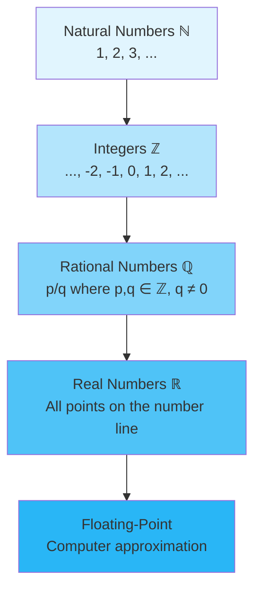

# Number Systems

## Intuition

Think of number systems as a hierarchy of increasingly powerful languages for describing quantities. Just as human languages evolved from simple grunts to complex grammar, number systems evolved to handle more sophisticated mathematical needs.

**Natural numbers** are like counting on your fingers: 1, 2, 3, and so on. They answer "how many?" but cannot express debt or temperature below zero.

**Integers** add the concept of "less than nothing" - essential for representing losses, debts, or movements in opposite directions.

**Rational numbers** let us divide things fairly. If you split a pizza among 3 people, each gets 1/3 - a number that cannot be expressed as a whole number.

**Real numbers** fill in all the gaps, including numbers like $\pi$ and $\sqrt{2}$ that cannot be written as fractions.

**Floating-point numbers** are how computers approximate all these numbers using a finite amount of memory - and understanding their limitations is crucial for ML practitioners.

### Why This Matters for ML

Every tensor in PyTorch, every array in NumPy, stores numbers in a specific format. Choosing the wrong format or ignoring precision limitations can cause:
- Training instability (gradients exploding or vanishing)
- Mysterious `NaN` values appearing
- Models that work on one machine but fail on another
- Subtle accuracy differences between training and inference

## Visual Explanation

### The Number System Hierarchy



### IEEE 754 Float Structure (32-bit)

```
┌─────┬──────────────┬───────────────────────────┐
│Sign │   Exponent   │        Mantissa           │
│ 1   │   8 bits     │        23 bits            │
└─────┴──────────────┴───────────────────────────┘
  ↓         ↓                    ↓
  ±     2^(exp-127)        1.xxxxx (binary)

Value = (-1)^sign × 2^(exponent-127) × (1 + mantissa)
```

## Mathematical Foundation

### Natural Numbers ($\mathbb{N}$)

$$\mathbb{N} = \{1, 2, 3, 4, 5, \ldots\}$$

Some definitions include 0. Natural numbers are closed under addition and multiplication:
- $a + b \in \mathbb{N}$ for all $a, b \in \mathbb{N}$
- $a \times b \in \mathbb{N}$ for all $a, b \in \mathbb{N}$

### Integers ($\mathbb{Z}$)

$$\mathbb{Z} = \{\ldots, -3, -2, -1, 0, 1, 2, 3, \ldots\}$$

Integers extend natural numbers to include zero and negatives. Now subtraction is always possible within the set.

### Rational Numbers ($\mathbb{Q}$)

$$\mathbb{Q} = \left\{\frac{p}{q} : p, q \in \mathbb{Z}, q \neq 0\right\}$$

Rational numbers can always be expressed as terminating or repeating decimals:
- $\frac{1}{4} = 0.25$ (terminating)
- $\frac{1}{3} = 0.333\ldots$ (repeating)

### Real Numbers ($\mathbb{R}$)

Real numbers include all rational numbers plus irrational numbers like:
- $\pi = 3.14159265\ldots$
- $e = 2.71828182\ldots$
- $\sqrt{2} = 1.41421356\ldots$

These cannot be expressed as fractions and have non-repeating, non-terminating decimal expansions.

### IEEE 754 Floating-Point

A 32-bit float represents numbers as:

$$(-1)^s \times 2^{e-127} \times (1 + m)$$

Where:
- $s$ = sign bit (0 or 1)
- $e$ = 8-bit exponent (0 to 255)
- $m$ = 23-bit mantissa (fractional part)

**Special values:**
- $e = 0, m = 0$: Zero (positive or negative based on sign)
- $e = 255, m = 0$: Infinity ($\pm\infty$)
- $e = 255, m \neq 0$: NaN (Not a Number)

**Precision:**
- float32: ~7 decimal digits of precision
- float64: ~15-16 decimal digits of precision

## Code Example

```python
import numpy as np
import sys

# Natural numbers - using unsigned integers
natural = np.array([1, 2, 3, 4, 5], dtype=np.uint32)
print(f"Natural numbers: {natural}")
print(f"Memory per element: {natural.itemsize} bytes")

# Integers - signed
integers = np.array([-3, -2, -1, 0, 1, 2, 3], dtype=np.int32)
print(f"\nIntegers: {integers}")

# Rational numbers - represented as floats (approximate)
rational = np.array([1/3, 1/4, 2/7], dtype=np.float64)
print(f"\nRational (as float64): {rational}")
print(f"1/3 exact? {rational[0] == 1/3}")  # True, but not exactly 1/3

# Demonstrating floating-point precision limits
print("\n--- Floating-Point Precision Demo ---")

# The classic 0.1 + 0.2 problem
result = 0.1 + 0.2
print(f"0.1 + 0.2 = {result}")
print(f"0.1 + 0.2 == 0.3? {result == 0.3}")  # False!
print(f"Difference: {result - 0.3}")

# Comparing float32 vs float64 precision
x_32 = np.float32(1.0000001)
x_64 = np.float64(1.0000001)
print(f"\nfloat32: {x_32:.10f}")
print(f"float64: {x_64:.16f}")

# Demonstrating accumulation of errors
print("\n--- Error Accumulation Demo ---")
total_32 = np.float32(0.0)
total_64 = np.float64(0.0)

for _ in range(1000000):
    total_32 += np.float32(0.1)
    total_64 += np.float64(0.1)

print(f"Sum of 0.1 million times:")
print(f"  float32: {total_32:.2f} (expected: 100000.00)")
print(f"  float64: {total_64:.2f}")
print(f"  float32 error: {abs(total_32 - 100000):.2f}")
print(f"  float64 error: {abs(total_64 - 100000):.10f}")

# Special floating-point values
print("\n--- Special Values ---")
print(f"Positive infinity: {np.inf}")
print(f"Negative infinity: {-np.inf}")
print(f"NaN: {np.nan}")
print(f"inf - inf = {np.inf - np.inf}")  # NaN
print(f"0 / 0 = {np.float64(0.0) / np.float64(0.0)}")  # NaN with warning

# Machine epsilon - smallest number where 1.0 + eps != 1.0
print("\n--- Machine Epsilon ---")
print(f"float32 epsilon: {np.finfo(np.float32).eps}")
print(f"float64 epsilon: {np.finfo(np.float64).eps}")

# Practical: checking equality with tolerance
def almost_equal(a, b, tol=1e-9):
    return abs(a - b) < tol

print(f"\n0.1 + 0.2 almost equal to 0.3? {almost_equal(0.1 + 0.2, 0.3)}")
```

## ML Relevance

### Where Number Systems Appear in ML

1. **Data Storage**: Datasets stored as int8, float32, etc. Wrong choice wastes memory or loses precision.

2. **Model Parameters**: Neural network weights are typically float32. Using float16 (half precision) can double training speed on modern GPUs.

3. **Loss Computation**: Cross-entropy loss involves log operations. Log of very small probabilities can underflow to $-\infty$.

4. **Gradient Computation**: Gradients can explode (overflow) or vanish (underflow) during backpropagation.

5. **Batch Normalization**: Involves computing means and variances - precision matters for stability.

### Specific Examples

```python
import numpy as np

# Example: Log probability underflow
prob = 1e-45  # Very small probability
log_prob_32 = np.log(np.float32(prob))  # Will be -inf
log_prob_64 = np.log(np.float64(prob))  # Works fine
print(f"log({prob}) in float32: {log_prob_32}")
print(f"log({prob}) in float64: {log_prob_64}")

# Example: Softmax numerical stability
def unstable_softmax(x):
    return np.exp(x) / np.sum(np.exp(x))

def stable_softmax(x):
    x_max = np.max(x)
    exp_x = np.exp(x - x_max)  # Subtract max for stability
    return exp_x / np.sum(exp_x)

large_values = np.array([1000, 1001, 1002])
print(f"\nUnstable softmax: {unstable_softmax(large_values)}")  # NaN or inf
print(f"Stable softmax: {stable_softmax(large_values)}")  # Works correctly
```

## When to Use / Ignore

### Data Type Selection Guide

| Scenario | Recommended Type | Reason |
|----------|-----------------|--------|
| Image pixels | uint8 or float32 | uint8 for storage, float32 for processing |
| Neural network training | float32 | Good balance of precision and speed |
| Scientific computation | float64 | Higher precision needed |
| Memory-constrained | float16 | Half the memory, works on modern GPUs |
| Integer labels | int32 or int64 | Avoid floating-point for class indices |
| Counting operations | int64 | Avoid overflow for large counts |

### Common Pitfalls

1. **Comparing floats with `==`**: Always use tolerance-based comparison
2. **Ignoring overflow in int operations**: Python ints have arbitrary precision, but NumPy ints overflow
3. **Using float32 for accumulation**: Error accumulates; consider float64 for sums
4. **Forgetting about NaN propagation**: Any operation with NaN produces NaN

## Exercises

### Exercise 1: Precision Investigation
**Problem**: Write code to find the smallest positive float32 number `x` such that `1.0 + x != 1.0`.

**Solution**:
```python
import numpy as np

x = np.float32(1.0)
while np.float32(1.0) + x != np.float32(1.0):
    last_x = x
    x = x / np.float32(2.0)

print(f"Smallest x where 1.0 + x != 1.0: {last_x}")
print(f"Machine epsilon: {np.finfo(np.float32).eps}")
```

### Exercise 2: Safe Logarithm
**Problem**: Implement a safe log function that handles zero and negative inputs gracefully.

**Solution**:
```python
import numpy as np

def safe_log(x, epsilon=1e-10):
    """Compute log safely, avoiding -inf and NaN."""
    return np.log(np.maximum(x, epsilon))

# Test
values = np.array([0.0, 1e-50, 0.5, 1.0, -1.0])
print(f"Input: {values}")
print(f"Safe log: {safe_log(values)}")
print(f"Regular log would give: {np.log(np.abs(values) + 1e-300)}")
```

### Exercise 3: Kahan Summation
**Problem**: Implement Kahan summation algorithm to reduce floating-point error accumulation.

**Solution**:
```python
import numpy as np

def naive_sum(arr):
    total = 0.0
    for x in arr:
        total += x
    return total

def kahan_sum(arr):
    """Kahan summation algorithm for reduced error."""
    total = 0.0
    compensation = 0.0  # Running compensation for lost low-order bits

    for x in arr:
        y = x - compensation       # Compensated value to add
        t = total + y              # New total
        compensation = (t - total) - y  # Recover what was lost
        total = t

    return total

# Test with many small numbers
n = 10000000
small_value = 0.1
arr = np.full(n, small_value, dtype=np.float64)

naive = naive_sum(arr)
kahan = kahan_sum(arr)
numpy_sum = np.sum(arr)
exact = n * small_value

print(f"Expected: {exact}")
print(f"Naive sum: {naive:.10f}, error: {abs(naive - exact):.10f}")
print(f"Kahan sum: {kahan:.10f}, error: {abs(kahan - exact):.10f}")
print(f"NumPy sum: {numpy_sum:.10f}, error: {abs(numpy_sum - exact):.10f}")
```

## Summary

- **Natural numbers** ($\mathbb{N}$): Positive counting numbers, used for indices and counts
- **Integers** ($\mathbb{Z}$): Include negatives, useful for labels and offsets
- **Rational numbers** ($\mathbb{Q}$): Fractions, approximated by floats in computers
- **Real numbers** ($\mathbb{R}$): Include irrationals like $\pi$, fundamental to calculus
- **Floating-point** (IEEE 754): Computer approximation with limited precision
  - float32: ~7 decimal digits, standard for ML training
  - float64: ~15 decimal digits, for scientific computing
- **Key insight**: Floating-point arithmetic is approximate; always account for precision limits
- **ML relevance**: Data types affect memory, speed, and numerical stability
- **Best practice**: Use tolerance-based comparison, implement numerically stable algorithms

---

*Next: [Chapter 2: Arithmetic Operations](./02-arithmetic-operations.md)*
