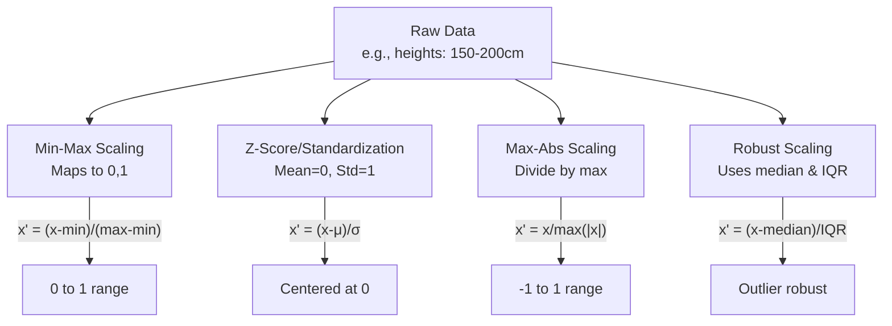

# Ratios and Scales

## Intuition

Ratios and scales are about relationships between quantities. While absolute numbers tell us "how much," ratios tell us "how much compared to something else."

**Ratios** compare two quantities: "For every 3 red balls, there are 2 blue balls" (3:2 ratio).

**Proportions** state that two ratios are equal: If a recipe serves 4 with 2 cups of flour, it serves 8 with 4 cups (same proportion).

**Percentages** are ratios with 100 as the reference: 75% means "75 out of 100" or 0.75 as a decimal.

**Growth rates** measure change relative to the starting point: A stock that goes from $100 to $120 has a 20% growth rate.

**Normalization** transforms data to a common scale: Converting test scores to 0-100 scale, or pixel values to 0-1 range.

### Why This Matters for ML

Machine learning is fundamentally about comparison and proportion:
- **Feature scaling**: Neural networks train better when features are on similar scales
- **Learning rates**: Too high relative to gradients causes divergence; too low causes slow learning
- **Probability outputs**: Softmax converts raw scores to proportions that sum to 1
- **Metrics**: Accuracy, precision, recall are all ratios
- **Batch normalization**: Normalizes activations to improve training stability

Understanding these concepts helps you:
- Preprocess data correctly
- Tune hyperparameters effectively
- Interpret model outputs properly
- Debug training issues related to scale

## Visual Explanation

### Normalization Techniques



### Percentage vs Percentage Point

```
Original: 20% market share
New: 25% market share

Percentage point increase: 25% - 20% = 5 percentage points
Percentage increase: (25-20)/20 = 25% increase

These are different!
- "Increased by 5 percentage points" ✓
- "Increased by 25%" ✓
- "Increased by 5%" ✗ (common mistake)
```

## Mathematical Foundation

### Ratios

A **ratio** compares two quantities $a$ and $b$:

$$a:b = \frac{a}{b}$$

**Properties:**
- Ratios can be simplified: $6:4 = 3:2$
- Equivalent ratios: $\frac{a}{b} = \frac{ka}{kb}$ for any $k \neq 0$

**Part-to-whole vs Part-to-part:**
- If red:blue = 3:2, then red:total = 3:5 and blue:total = 2:5

### Proportions

A **proportion** states that two ratios are equal:

$$\frac{a}{b} = \frac{c}{d}$$

**Cross-multiplication property:**
$$a \cdot d = b \cdot c$$

This is useful for solving unknown values:
If $\frac{x}{12} = \frac{3}{4}$, then $4x = 36$, so $x = 9$.

### Percentages

A **percentage** is a ratio per 100:

$$p\% = \frac{p}{100}$$

**Key conversions:**
- Decimal to percentage: multiply by 100 ($0.75 \rightarrow 75\%$)
- Percentage to decimal: divide by 100 ($75\% \rightarrow 0.75$)
- Fraction to percentage: $\frac{a}{b} \times 100\%$

**Percentage change:**
$$\text{Change} = \frac{\text{New} - \text{Old}}{\text{Old}} \times 100\%$$

### Growth Rates

**Simple growth rate:**
$$r = \frac{V_{\text{final}} - V_{\text{initial}}}{V_{\text{initial}}}$$

**Compound growth** over $n$ periods at rate $r$:
$$V_n = V_0 (1 + r)^n$$

**Continuous growth** at rate $r$ over time $t$:
$$V(t) = V_0 e^{rt}$$

**Compound Annual Growth Rate (CAGR):**
$$\text{CAGR} = \left(\frac{V_{\text{final}}}{V_{\text{initial}}}\right)^{1/n} - 1$$

### Normalization

**Min-Max Normalization** (scales to $[0, 1]$):
$$x' = \frac{x - x_{\min}}{x_{\max} - x_{\min}}$$

**Z-Score Standardization** (mean=0, std=1):
$$z = \frac{x - \mu}{\sigma}$$

**Max-Abs Scaling** (scales to $[-1, 1]$):
$$x' = \frac{x}{\max(|x|)}$$

**L2 Normalization** (unit vector):
$$\hat{x} = \frac{x}{\|x\|_2} = \frac{x}{\sqrt{\sum_i x_i^2}}$$

## Code Example

```python
import numpy as np
from sklearn.preprocessing import MinMaxScaler, StandardScaler, MaxAbsScaler

# ============================================
# Ratios and Proportions
# ============================================
print("=== Ratios and Proportions ===")

# Basic ratio calculation
wins = 75
losses = 25
win_ratio = wins / losses  # 3:1
win_rate = wins / (wins + losses)  # 0.75 (part to whole)

print(f"Wins: {wins}, Losses: {losses}")
print(f"Win:Loss ratio: {win_ratio}:1 or {wins}:{losses}")
print(f"Win rate: {win_rate:.2%}")

# Using proportion to scale
# If 2 cups flour makes 12 cookies, how much for 30 cookies?
flour_12 = 2
cookies_12 = 12
cookies_target = 30

flour_target = (flour_12 / cookies_12) * cookies_target
print(f"\nProportion: {flour_12} cups for {cookies_12} cookies")
print(f"For {cookies_target} cookies: {flour_target} cups")

# ============================================
# Percentages
# ============================================
print("\n=== Percentages ===")

original_price = 80
discount_percent = 25
discount_amount = original_price * (discount_percent / 100)
final_price = original_price - discount_amount

print(f"Original price: ${original_price}")
print(f"Discount: {discount_percent}% = ${discount_amount}")
print(f"Final price: ${final_price}")

# Percentage change
old_value = 50
new_value = 65
percent_change = ((new_value - old_value) / old_value) * 100
print(f"\nChange from {old_value} to {new_value}: {percent_change}% increase")

# Common mistake: percentage vs percentage points
old_rate = 0.20  # 20%
new_rate = 0.25  # 25%
pp_change = (new_rate - old_rate) * 100  # 5 percentage points
pct_change = ((new_rate - old_rate) / old_rate) * 100  # 25% relative increase

print(f"\nRate change: {old_rate:.0%} to {new_rate:.0%}")
print(f"Percentage points change: {pp_change}")
print(f"Percentage (relative) change: {pct_change}%")

# ============================================
# Growth Rates
# ============================================
print("\n=== Growth Rates ===")

# Simple growth
initial_users = 1000
final_users = 1500
simple_growth = (final_users - initial_users) / initial_users
print(f"Simple growth: {simple_growth:.1%}")

# Compound growth
principal = 1000
annual_rate = 0.05
years = 10

# Year-by-year compound growth
balance = principal
print(f"\nCompound growth at {annual_rate:.0%} annually:")
for year in range(1, years + 1):
    balance *= (1 + annual_rate)
    if year <= 3 or year == years:
        print(f"  Year {year}: ${balance:.2f}")
    elif year == 4:
        print("  ...")

# Formula version
final_balance = principal * (1 + annual_rate) ** years
print(f"Formula result: ${final_balance:.2f}")

# CAGR
start_value = 100
end_value = 200
num_years = 5
cagr = (end_value / start_value) ** (1 / num_years) - 1
print(f"\nCAGR from {start_value} to {end_value} over {num_years} years: {cagr:.2%}")

# ============================================
# Normalization Techniques
# ============================================
print("\n=== Normalization Techniques ===")

# Sample data with different scales
np.random.seed(42)
data = np.array([
    [1000, 0.5, 25],    # Feature 1: thousands, Feature 2: small decimals, Feature 3: tens
    [2000, 0.8, 30],
    [1500, 0.3, 28],
    [3000, 0.9, 35],
    [500, 0.1, 20],
])
print(f"Original data:\n{data}")
print(f"Original ranges: {data.min(axis=0)} to {data.max(axis=0)}")

# Min-Max Scaling
def min_max_scale(x):
    return (x - x.min(axis=0)) / (x.max(axis=0) - x.min(axis=0))

scaled_minmax = min_max_scale(data)
print(f"\nMin-Max scaled (0 to 1):\n{scaled_minmax}")

# Z-Score Standardization
def z_score_scale(x):
    return (x - x.mean(axis=0)) / x.std(axis=0)

scaled_zscore = z_score_scale(data)
print(f"\nZ-Score scaled (mean=0, std=1):\n{np.round(scaled_zscore, 3)}")
print(f"  Means: {scaled_zscore.mean(axis=0).round(10)}")
print(f"  Stds: {scaled_zscore.std(axis=0).round(3)}")

# L2 Normalization (row-wise)
def l2_normalize(x):
    norms = np.sqrt((x ** 2).sum(axis=1, keepdims=True))
    return x / norms

scaled_l2 = l2_normalize(data.astype(float))
print(f"\nL2 normalized (unit vectors):\n{np.round(scaled_l2, 4)}")
print(f"  Row norms: {np.sqrt((scaled_l2**2).sum(axis=1)).round(3)}")

# Using scikit-learn
print("\n=== Using scikit-learn ===")
scaler_minmax = MinMaxScaler()
scaler_standard = StandardScaler()

sklearn_minmax = scaler_minmax.fit_transform(data)
sklearn_standard = scaler_standard.fit_transform(data)

print(f"sklearn MinMax matches manual: {np.allclose(scaled_minmax, sklearn_minmax)}")
# Note: sklearn uses ddof=0 for std, so slight difference in standardization
print(f"sklearn Standard close to manual: {np.allclose(scaled_zscore, sklearn_standard, atol=0.1)}")

# ============================================
# ML-Specific Examples
# ============================================
print("\n=== ML-Specific Examples ===")

# Softmax: converting scores to probabilities (normalized ratios)
def softmax(x):
    exp_x = np.exp(x - np.max(x))  # Numerically stable
    return exp_x / exp_x.sum()

logits = np.array([2.0, 1.0, 0.5])
probs = softmax(logits)
print(f"Logits: {logits}")
print(f"Softmax probabilities: {probs.round(4)}")
print(f"Sum of probabilities: {probs.sum():.4f}")

# Precision, Recall, F1 - all ratios
TP, FP, FN, TN = 80, 20, 10, 90

precision = TP / (TP + FP)  # Of predicted positives, how many correct?
recall = TP / (TP + FN)     # Of actual positives, how many found?
f1 = 2 * precision * recall / (precision + recall)  # Harmonic mean
accuracy = (TP + TN) / (TP + FP + FN + TN)

print(f"\nConfusion matrix: TP={TP}, FP={FP}, FN={FN}, TN={TN}")
print(f"Precision: {precision:.2%}")
print(f"Recall: {recall:.2%}")
print(f"F1 Score: {f1:.2%}")
print(f"Accuracy: {accuracy:.2%}")

# Learning rate as a proportion of gradient
gradient = np.array([10.0, -5.0, 2.0])
learning_rates = [0.001, 0.01, 0.1]

print(f"\nGradient: {gradient}")
for lr in learning_rates:
    update = lr * gradient
    print(f"LR={lr}: update={update}, relative size={np.abs(update/gradient)[0]:.1%} of gradient")
```

## ML Relevance

### Where Ratios and Scales Appear in ML

| Concept | ML Application |
|---------|----------------|
| Ratios | Train/test split (80:20), class imbalance ratios |
| Proportions | Softmax outputs, probability calibration |
| Percentages | Accuracy, precision, recall, dropout rate |
| Growth rates | Learning rate decay, loss improvement |
| Normalization | Feature scaling, batch normalization, layer normalization |

### Critical Applications

```python
import numpy as np

# 1. Feature Scaling for Neural Networks
def demonstrate_scaling_importance():
    """Shows why scaling matters for gradient descent."""
    # Unscaled features
    features_unscaled = np.array([
        [1000, 0.1],
        [2000, 0.2],
        [1500, 0.15]
    ])

    # Gradient computation (simplified)
    # With unscaled data, gradients differ by orders of magnitude
    grad_unscaled = features_unscaled.mean(axis=0)

    # Scaled features
    features_scaled = (features_unscaled - features_unscaled.mean(axis=0)) / features_unscaled.std(axis=0)
    grad_scaled = features_scaled.mean(axis=0)

    print("Feature scaling importance:")
    print(f"  Unscaled gradient magnitudes: {np.abs(grad_unscaled)}")
    print(f"  Scaled gradient magnitudes: {np.abs(grad_scaled).round(4)}")
    print("  Scaled gradients are more balanced for optimization!")

demonstrate_scaling_importance()

# 2. Learning Rate as Proportion
def learning_rate_impact(initial_lr, decay_rate, epochs):
    """Show learning rate decay over time."""
    lrs = []
    lr = initial_lr
    for epoch in range(epochs):
        lrs.append(lr)
        lr *= (1 - decay_rate)  # Proportional decay
    return lrs

lrs = learning_rate_impact(0.01, 0.1, 10)
print(f"\nLearning rate decay (10% per epoch):")
for i, lr in enumerate(lrs):
    print(f"  Epoch {i}: {lr:.6f}")

# 3. Class Weight Ratios for Imbalanced Data
def compute_class_weights(y):
    """Compute inverse frequency weights."""
    classes, counts = np.unique(y, return_counts=True)
    total = len(y)
    weights = {cls: total / (len(classes) * count) for cls, count in zip(classes, counts)}
    return weights

# Imbalanced dataset: 900 negative, 100 positive
y_imbalanced = np.array([0]*900 + [1]*100)
weights = compute_class_weights(y_imbalanced)
print(f"\nClass weights for imbalanced data:")
print(f"  Class 0 (900 samples): {weights[0]:.3f}")
print(f"  Class 1 (100 samples): {weights[1]:.3f}")
```

## When to Use / Ignore

### Normalization Technique Selection

| Data Characteristic | Recommended Technique |
|--------------------|----------------------|
| Bounded features | Min-Max (0 to 1) |
| Gaussian-like distribution | Z-Score |
| Many outliers | Robust scaling (median/IQR) |
| Sparse data | MaxAbs (preserves zeros) |
| Comparing samples | L2 normalization |
| Neural networks | Usually Z-Score or Min-Max |
| Tree-based models | Often not needed |

### Common Pitfalls

1. **Fitting scaler on test data**: Always fit on training data only
   ```python
   # Correct
   scaler.fit(X_train)
   X_train_scaled = scaler.transform(X_train)
   X_test_scaled = scaler.transform(X_test)  # Use same parameters

   # Wrong
   X_test_scaled = scaler.fit_transform(X_test)  # Data leakage!
   ```

2. **Confusing percentage and percentage points**
   ```python
   # "Accuracy improved from 90% to 95%"
   # Correct: "5 percentage point improvement" or "5.6% relative improvement"
   # Wrong: "5% improvement"
   ```

3. **Not handling division by zero in normalization**
   ```python
   # If std = 0 (constant feature), z-score fails
   std = x.std()
   if std == 0:
       return np.zeros_like(x)  # Or handle appropriately
   return (x - x.mean()) / std
   ```

4. **Applying normalization to target variable incorrectly**
   ```python
   # For regression: normalize, then denormalize predictions
   # For classification: do NOT normalize class labels
   ```

5. **Forgetting to normalize at inference time**
   ```python
   # Save scaler parameters with model
   import joblib
   joblib.dump(scaler, 'scaler.pkl')
   # Load and apply at inference
   scaler = joblib.load('scaler.pkl')
   X_new_scaled = scaler.transform(X_new)
   ```

## Exercises

### Exercise 1: Implement Robust Scaling
**Problem**: Implement robust scaling using median and interquartile range (IQR).

**Solution**:
```python
import numpy as np

def robust_scale(x):
    """Scale using median and IQR (robust to outliers)."""
    median = np.median(x, axis=0)
    q75, q25 = np.percentile(x, [75, 25], axis=0)
    iqr = q75 - q25
    # Handle zero IQR
    iqr = np.where(iqr == 0, 1, iqr)
    return (x - median) / iqr

# Test with outliers
data = np.array([[1], [2], [3], [4], [5], [100]])  # 100 is outlier
print(f"Original: {data.flatten()}")
print(f"Z-Score scaled: {((data - data.mean()) / data.std()).flatten().round(2)}")
print(f"Robust scaled: {robust_scale(data).flatten().round(2)}")
# Robust scaling is less affected by the outlier
```

### Exercise 2: Compute CAGR from Time Series
**Problem**: Given monthly revenue data, compute the compound annual growth rate.

**Solution**:
```python
import numpy as np

def compute_cagr(values, periods_per_year=12):
    """Compute CAGR from a time series."""
    start_value = values[0]
    end_value = values[-1]
    num_periods = len(values) - 1
    num_years = num_periods / periods_per_year

    cagr = (end_value / start_value) ** (1 / num_years) - 1
    return cagr

# Monthly revenue over 2 years
np.random.seed(42)
months = 24
growth_per_month = 1.02  # 2% monthly growth
revenue = [100000]
for _ in range(months - 1):
    revenue.append(revenue[-1] * growth_per_month * (0.95 + 0.1 * np.random.random()))

revenue = np.array(revenue)
cagr = compute_cagr(revenue)

print(f"Starting revenue: ${revenue[0]:,.0f}")
print(f"Ending revenue: ${revenue[-1]:,.0f}")
print(f"CAGR: {cagr:.2%}")
print(f"Expected ~26.8% (1.02^12 - 1)")
```

### Exercise 3: Normalize Images for Neural Network
**Problem**: Normalize image pixel values using ImageNet statistics.

**Solution**:
```python
import numpy as np

def normalize_imagenet(images):
    """Normalize images using ImageNet mean and std.

    Args:
        images: Array of shape (N, H, W, C) with values in [0, 255]

    Returns:
        Normalized images with approximate mean=0, std=1
    """
    # ImageNet statistics (RGB)
    mean = np.array([0.485, 0.456, 0.406])
    std = np.array([0.229, 0.224, 0.225])

    # Convert to [0, 1] first
    images = images / 255.0

    # Apply ImageNet normalization
    normalized = (images - mean) / std

    return normalized

# Create dummy image batch
batch_size = 4
height, width, channels = 224, 224, 3
images = np.random.randint(0, 256, (batch_size, height, width, channels))

print(f"Original image stats:")
print(f"  Shape: {images.shape}")
print(f"  Range: [{images.min()}, {images.max()}]")
print(f"  Mean per channel: {images.mean(axis=(0,1,2)).round(1)}")

normalized = normalize_imagenet(images.astype(np.float32))
print(f"\nNormalized image stats:")
print(f"  Range: [{normalized.min():.2f}, {normalized.max():.2f}]")
print(f"  Mean per channel: {normalized.mean(axis=(0,1,2)).round(3)}")
print(f"  Std per channel: {normalized.std(axis=(0,1,2)).round(3)}")
```

## Summary

- **Ratios** compare quantities; use them for train/test splits, class balance analysis
- **Proportions** express equivalent relationships; useful for scaling recipes/formulas
- **Percentages** are ratios out of 100; distinguish from percentage points
- **Growth rates** measure relative change over time
  - Simple: $(V_{final} - V_{initial}) / V_{initial}$
  - Compound: $V_n = V_0(1+r)^n$
  - CAGR: $(V_{final}/V_{initial})^{1/n} - 1$
- **Normalization** transforms data to common scales:
  - Min-Max: [0, 1] range
  - Z-Score: mean=0, std=1
  - L2: unit vectors
- **ML applications**: Feature scaling, softmax, metrics, learning rate decay
- **Best practice**: Fit scalers on training data only; save and reuse for inference
- **Key insight**: Tree-based models often do not require normalization, but neural networks almost always do

---

*This completes Level 1: Arithmetic & Numbers. Proceed to [Level 2: Algebra](../02-level-2-algebra/README.md) to continue your journey.*
