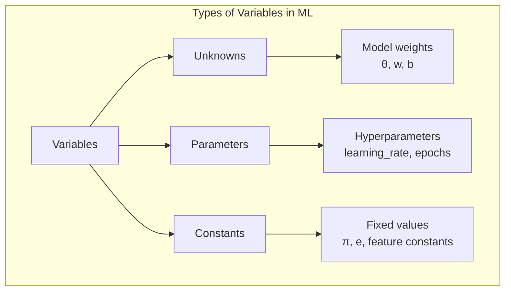
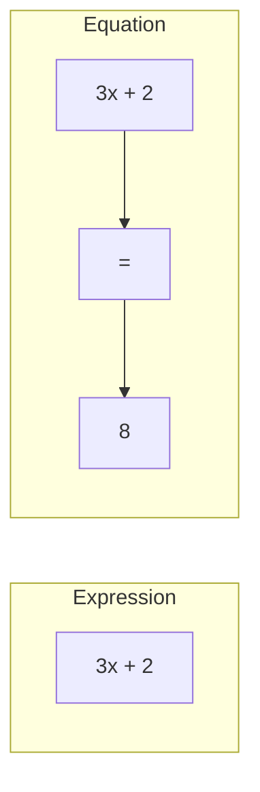

# Chapter 1: Variables and Expressions

## Intuition

Think of variables as labeled boxes that can hold different values. In programming, you're already familiar with this concept—a variable `x` can store any number. Algebra formalizes this idea and provides rules for manipulating these boxes even when we don't know what's inside them.

Consider this real-world scenario: You're calculating the total cost of items in a shopping cart. Each item has a price, but the quantity might vary. If we say "price times quantity equals total," we've created an algebraic relationship that works regardless of the specific numbers involved.

**Why this matters for ML**: In machine learning, we constantly work with unknowns. A neural network's weights start as unknowns that we solve for. Features are variables that change with each data point. Hyperparameters are values we set before training. Understanding the different roles variables can play helps you reason about ML systems more clearly.

## Visual Explanation



### Expression vs Equation

$$\text{Expression: } 3x + 2y - 5$$

$$\text{Equation: } 3x + 2y - 5 = 0$$

An **expression** is a mathematical phrase—it has no equals sign and doesn't make a claim. An **equation** makes an assertion that two things are equal, creating something we can solve.



## Mathematical Foundation

### Variables as Unknowns

An **unknown** is a variable whose value we're trying to find. In the equation:

$$2x + 3 = 7$$

The variable $x$ is an unknown. We solve to find $x = 2$.

**Formal Definition**: An unknown is a variable that satisfies some condition or equation. The goal is to determine which value(s) make the equation true.

### Variables as Parameters

A **parameter** is a variable that represents a fixed (but potentially adjustable) value within a system.

In the linear model:

$$y = mx + b$$

- $x$ and $y$ are variables (inputs/outputs)
- $m$ (slope) and $b$ (intercept) are **parameters**

Parameters define the model's behavior. Different parameter values create different models:

| $m$ | $b$ | Model |
|-----|-----|-------|
| 2 | 1 | $y = 2x + 1$ |
| -1 | 3 | $y = -x + 3$ |
| 0.5 | 0 | $y = 0.5x$ |

### Constants

**Constants** are values that never change. They're fixed by definition:

- $\pi \approx 3.14159...$ (ratio of circumference to diameter)
- $e \approx 2.71828...$ (base of natural logarithm)
- Physical constants like speed of light $c$

In ML contexts, constants might include:
- Feature values after standardization
- Fixed architecture parameters (like the 3 in RGB channels)

### Algebraic Expressions

An **expression** combines variables, constants, and operations:

$$3x^2 + 2xy - 5z + 7$$

**Components**:
- **Terms**: Parts separated by + or - signs ($3x^2$, $2xy$, $-5z$, $7$)
- **Coefficients**: Numbers multiplying variables ($3$, $2$, $-5$)
- **Variables**: Symbols representing quantities ($x$, $y$, $z$)
- **Constant term**: A term with no variable ($7$)

### Evaluating Expressions

To evaluate an expression, substitute values for variables:

$$f(x, y) = 3x^2 + 2y$$

When $x = 2$ and $y = 3$:

$$f(2, 3) = 3(2)^2 + 2(3) = 3(4) + 6 = 12 + 6 = 18$$

### Simplifying Expressions

**Like terms** have the same variable parts:
- $3x$ and $5x$ are like terms
- $3x$ and $3y$ are NOT like terms
- $2x^2$ and $5x^2$ are like terms
- $2x^2$ and $2x$ are NOT like terms

**Combining like terms**:
$$4x + 3y - 2x + 5y = (4x - 2x) + (3y + 5y) = 2x + 8y$$

## Code Example

```python
import numpy as np
from typing import Callable

# Variables as unknowns - solving for x in: 2x + 3 = 7
# Rearranging: x = (7 - 3) / 2
x_unknown = (7 - 3) / 2
print(f"Unknown x = {x_unknown}")  # x = 2.0

# Variables as parameters - defining a linear model
def linear_model(x: np.ndarray, m: float, b: float) -> np.ndarray:
    """
    Linear model: y = mx + b

    Args:
        x: Input variable (features)
        m: Slope parameter
        b: Intercept parameter

    Returns:
        y: Output predictions
    """
    return m * x + b

# Same input, different parameters = different outputs
x_data = np.array([1, 2, 3, 4, 5])

# Parameter set 1: steep positive slope
y1 = linear_model(x_data, m=2.0, b=1.0)
print(f"m=2, b=1: {y1}")  # [3. 5. 7. 9. 11.]

# Parameter set 2: gentle negative slope
y2 = linear_model(x_data, m=-0.5, b=10.0)
print(f"m=-0.5, b=10: {y2}")  # [9.5 9. 8.5 8. 7.5]


# Working with expressions
def evaluate_expression(x: float, y: float) -> float:
    """
    Evaluate: 3x^2 + 2xy - 5
    """
    return 3 * x**2 + 2 * x * y - 5

result = evaluate_expression(2, 3)
print(f"3(2)^2 + 2(2)(3) - 5 = {result}")  # 19


# Simplifying expressions programmatically using sympy
from sympy import symbols, simplify, expand

x, y = symbols('x y')

# Original expression
expr = 4*x + 3*y - 2*x + 5*y + x**2 - x**2

# Simplify
simplified = simplify(expr)
print(f"Simplified: {simplified}")  # 2*x + 8*y


# Expression vs Equation demonstration
from sympy import Eq, solve

# Expression (no equals sign - just a value)
expression = 3*x + 2

# Equation (assertion of equality - can be solved)
equation = Eq(3*x + 2, 8)

# Solve the equation
solution = solve(equation, x)
print(f"Solution to 3x + 2 = 8: x = {solution}")  # [2]


# Practical ML example: Cost function as an expression
def mse_loss_expression(y_true: np.ndarray, y_pred: np.ndarray) -> float:
    """
    Mean Squared Error - a common loss expression in ML

    MSE = (1/n) * Σ(y_true - y_pred)^2
    """
    n = len(y_true)
    return (1/n) * np.sum((y_true - y_pred)**2)

y_true = np.array([1.0, 2.0, 3.0, 4.0])
y_pred = np.array([1.1, 2.2, 2.8, 4.1])

loss = mse_loss_expression(y_true, y_pred)
print(f"MSE Loss: {loss:.4f}")  # 0.0225
```

## ML Relevance

### Features as Variables
In a dataset, each feature column is a variable:
```python
# Housing price prediction
# x1 = square_footage, x2 = num_bedrooms, x3 = age
price = w1*x1 + w2*x2 + w3*x3 + b
```

### Weights as Unknowns
The weights ($w_1, w_2, w_3$) and bias ($b$) are unknowns that training determines. This is the core of supervised learning—finding the parameter values that minimize prediction error.

### Hyperparameters as Parameters
Learning rate, batch size, and regularization strength are parameters you set:
```python
# These are parameters (fixed during training)
learning_rate = 0.01
batch_size = 32
lambda_reg = 0.001
```

### Loss Functions as Expressions
Loss functions like MSE, Cross-Entropy, and MAE are expressions we evaluate:

$$\mathcal{L}_{MSE} = \frac{1}{n}\sum_{i=1}^{n}(y_i - \hat{y}_i)^2$$

The loss value tells us how wrong our predictions are—a number with meaning but no equality assertion until we set up the optimization problem.

## When to Use / Ignore

### Use This Knowledge When:
- **Defining model architectures**: Understanding what's a variable vs parameter helps structure code
- **Debugging**: If outputs are wrong, check if you're treating a constant as a variable or vice versa
- **Reading papers**: Mathematical notation uses variables extensively; knowing types helps comprehension
- **Feature engineering**: Creating new features is building new expressions from existing variables

### Common Pitfalls:
1. **Confusing parameters and hyperparameters**: Parameters are learned; hyperparameters are set
2. **Treating expressions as equations**: An expression evaluates to a value; an equation can be solved
3. **Forgetting variable scope**: A variable `x` in one context may mean something different elsewhere
4. **Mixing up constants and variables**: Using magic numbers instead of named constants hurts readability

## Exercises

### Exercise 1: Identify Variable Types
In the neural network layer equation $y = \sigma(Wx + b)$, where $\sigma$ is the activation function:

**Question**: Classify each symbol as unknown, parameter, variable, constant, or function.

**Solution**:
- $y$: Output variable (computed from input)
- $W$: Weight matrix (unknown during training, parameter after)
- $x$: Input variable (changes with each data point)
- $b$: Bias (unknown during training, parameter after)
- $\sigma$: Activation function (constant—it doesn't change)

### Exercise 2: Simplify the Expression
Simplify: $5a + 3b - 2a + 4b - a + b$

**Solution**:
$$= (5a - 2a - a) + (3b + 4b + b)$$
$$= 2a + 8b$$

### Exercise 3: Evaluate and Implement
Given the expression $f(x, y, z) = 2x^2 - 3xy + z$

**Question**: Write Python code to evaluate this for $x=3$, $y=2$, $z=5$

**Solution**:
```python
def f(x, y, z):
    return 2*x**2 - 3*x*y + z

result = f(3, 2, 5)
# 2(9) - 3(3)(2) + 5 = 18 - 18 + 5 = 5
print(result)  # 5
```

## Summary

- **Variables** are symbols representing quantities; they come in different flavors:
  - **Unknowns**: Values we solve for (model weights during training)
  - **Parameters**: Fixed values that define behavior (hyperparameters, trained weights at inference)
  - **Constants**: Never-changing values ($\pi$, $e$, architectural constants)

- **Expressions** combine variables, constants, and operations without making equality claims

- **Equations** assert that two expressions are equal, creating something we can solve

- In ML, understanding variable types helps you:
  - Structure code appropriately
  - Distinguish what's learned vs what's set
  - Read mathematical notation fluently
  - Debug numerical issues

- **Key formula for evaluation**: Substitute values for variables and compute step by step

---

Next: [Chapter 2: Linear Equations](./02-linear-equations.md) →
