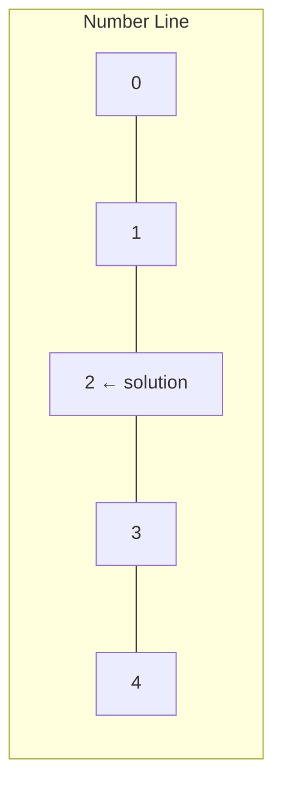
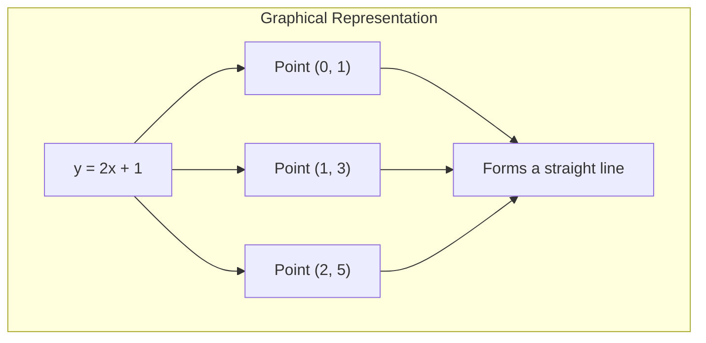
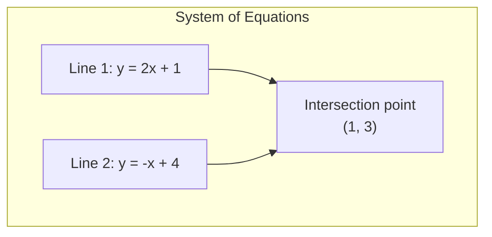

# Chapter 2: Linear Equations

## Intuition

A linear equation is a mathematical statement where variables appear only to the first power (no squares, cubes, or roots of variables). Think of it as a perfectly balanced scale—whatever you do to one side, you must do to the other to maintain balance.

**Real-world analogy**: Imagine you're splitting a restaurant bill. If three friends order meals costing the same amount and the total bill is $75, you're solving the linear equation $3x = 75$. The answer? Each meal costs $25.

**Why this matters for ML**: Linear regression—arguably the most fundamental ML algorithm—is all about finding the best linear equation that describes your data. Understanding how to solve linear equations and systems of equations gives you insight into how models find optimal parameters. The same principles scale up to neural networks, where we solve systems with millions of equations.

## Visual Explanation

### Single Variable Linear Equation

A linear equation in one variable represents a point on a number line:

$$2x + 3 = 7 \implies x = 2$$



### Two-Variable Linear Equation

A linear equation in two variables represents a line in 2D space:

$$y = 2x + 1$$



### Systems of Equations

Two linear equations = two lines. The solution is where they intersect:



## Mathematical Foundation

### Standard Form of Linear Equations

**Single variable**:
$$ax + b = c$$

where $a \neq 0$

**Two variables** (standard form):
$$ax + by = c$$

**Slope-intercept form**:
$$y = mx + b$$

where $m$ is slope and $b$ is y-intercept.

### Solving Single-Variable Equations

The goal: isolate the variable on one side.

**Example**: Solve $3x + 7 = 22$

**Step 1**: Subtract 7 from both sides
$$3x + 7 - 7 = 22 - 7$$
$$3x = 15$$

**Step 2**: Divide both sides by 3
$$\frac{3x}{3} = \frac{15}{3}$$
$$x = 5$$

**Verification**: $3(5) + 7 = 15 + 7 = 22$ ✓

### Systems of Linear Equations

A **system** is a set of equations we solve simultaneously.

**Two equations, two unknowns**:
$$\begin{cases} 2x + y = 5 \\ x - y = 1 \end{cases}$$

**Three possible outcomes**:
1. **One solution**: Lines intersect at exactly one point
2. **No solution**: Lines are parallel (inconsistent system)
3. **Infinite solutions**: Lines are the same (dependent system)

### Method 1: Substitution

**Idea**: Solve one equation for a variable, substitute into the other.

**Example**:
$$\begin{cases} 2x + y = 5 \\ x - y = 1 \end{cases}$$

**Step 1**: Solve equation 2 for $x$:
$$x = y + 1$$

**Step 2**: Substitute into equation 1:
$$2(y + 1) + y = 5$$
$$2y + 2 + y = 5$$
$$3y = 3$$
$$y = 1$$

**Step 3**: Back-substitute to find $x$:
$$x = 1 + 1 = 2$$

**Solution**: $(x, y) = (2, 1)$

### Method 2: Elimination

**Idea**: Add or subtract equations to eliminate a variable.

**Example** (same system):
$$\begin{cases} 2x + y = 5 \\ x - y = 1 \end{cases}$$

**Step 1**: Add the equations (y's cancel):
$$(2x + y) + (x - y) = 5 + 1$$
$$3x = 6$$
$$x = 2$$

**Step 2**: Substitute back:
$$2(2) + y = 5$$
$$y = 1$$

**Solution**: $(x, y) = (2, 1)$

### Matrix Form (Preview of Linear Algebra)

Systems can be written as $A\mathbf{x} = \mathbf{b}$:

$$\begin{bmatrix} 2 & 1 \\ 1 & -1 \end{bmatrix} \begin{bmatrix} x \\ y \end{bmatrix} = \begin{bmatrix} 5 \\ 1 \end{bmatrix}$$

This form is how computers solve large systems efficiently.

## Code Example

```python
import numpy as np
from typing import Tuple, Optional

# Solving single-variable linear equations
def solve_linear_1var(a: float, b: float, c: float) -> Optional[float]:
    """
    Solve ax + b = c for x

    Returns None if a = 0 (not a valid linear equation in x)
    """
    if a == 0:
        return None
    return (c - b) / a

# Example: 3x + 7 = 22
x = solve_linear_1var(a=3, b=7, c=22)
print(f"Solution to 3x + 7 = 22: x = {x}")  # x = 5.0


# Solving systems using substitution (manual approach)
def solve_system_substitution() -> Tuple[float, float]:
    """
    Solve:
    2x + y = 5
    x - y = 1

    Using substitution method
    """
    # From equation 2: x = y + 1
    # Substitute into equation 1: 2(y + 1) + y = 5
    # 3y + 2 = 5
    # y = 1
    y = (5 - 2) / 3

    # Back-substitute: x = y + 1
    x = y + 1

    return x, y

x, y = solve_system_substitution()
print(f"Substitution method: x = {x}, y = {y}")  # x = 2.0, y = 1.0


# Solving systems using NumPy (matrix method)
def solve_system_matrix(A: np.ndarray, b: np.ndarray) -> np.ndarray:
    """
    Solve Ax = b using NumPy's linear algebra solver

    This is how it's done in practice for larger systems.
    """
    return np.linalg.solve(A, b)

# Same system in matrix form
A = np.array([
    [2, 1],   # 2x + y = 5
    [1, -1]   # x - y = 1
])
b = np.array([5, 1])

solution = solve_system_matrix(A, b)
print(f"Matrix method: x = {solution[0]}, y = {solution[1]}")  # x = 2.0, y = 1.0


# Verifying the solution
def verify_solution(A: np.ndarray, x: np.ndarray, b: np.ndarray) -> bool:
    """Check if Ax = b (within floating point tolerance)"""
    result = A @ x  # Matrix multiplication
    return np.allclose(result, b)

print(f"Solution verified: {verify_solution(A, solution, b)}")  # True


# ML Example: Solving for linear regression coefficients (closed-form)
def linear_regression_closed_form(X: np.ndarray, y: np.ndarray) -> np.ndarray:
    """
    Find weights w that minimize ||Xw - y||^2

    Closed-form solution: w = (X^T X)^(-1) X^T y

    This is solving a system of linear equations called the "normal equations"
    """
    # X^T X
    XtX = X.T @ X

    # X^T y
    Xty = X.T @ y

    # Solve (X^T X) w = X^T y
    w = np.linalg.solve(XtX, Xty)

    return w

# Example: Simple linear regression
# Data points: (1, 2), (2, 4), (3, 5), (4, 4), (5, 5)
X = np.array([
    [1, 1],  # [1, x] format for y = w0 + w1*x
    [1, 2],
    [1, 3],
    [1, 4],
    [1, 5]
])
y = np.array([2, 4, 5, 4, 5])

weights = linear_regression_closed_form(X, y)
print(f"Linear regression weights: w0 = {weights[0]:.3f}, w1 = {weights[1]:.3f}")
# This gives us y = w0 + w1*x


# Checking for system consistency
def check_system_type(A: np.ndarray, b: np.ndarray) -> str:
    """
    Determine if a system has:
    - One solution (consistent, independent)
    - No solution (inconsistent)
    - Infinite solutions (consistent, dependent)
    """
    # Augmented matrix [A|b]
    augmented = np.column_stack([A, b])

    rank_A = np.linalg.matrix_rank(A)
    rank_aug = np.linalg.matrix_rank(augmented)
    n_vars = A.shape[1]

    if rank_A < rank_aug:
        return "No solution (inconsistent)"
    elif rank_A == rank_aug == n_vars:
        return "One unique solution"
    else:
        return "Infinite solutions (dependent)"

# Test cases
A1 = np.array([[1, 1], [2, 2]])  # Parallel lines
b1 = np.array([1, 3])
print(f"System 1: {check_system_type(A1, b1)}")

A2 = np.array([[1, 1], [1, -1]])  # Intersecting lines
b2 = np.array([2, 0])
print(f"System 2: {check_system_type(A2, b2)}")


# Iterative solution (preview of gradient descent concept)
def solve_iteratively(A: np.ndarray, b: np.ndarray,
                      learning_rate: float = 0.1,
                      iterations: int = 100) -> np.ndarray:
    """
    Solve Ax = b iteratively by minimizing ||Ax - b||^2

    This is conceptually similar to how neural networks learn!
    """
    x = np.zeros(A.shape[1])  # Initial guess

    for i in range(iterations):
        # Gradient of ||Ax - b||^2 with respect to x is 2*A^T(Ax - b)
        gradient = 2 * A.T @ (A @ x - b)
        x = x - learning_rate * gradient

        # Optional: print progress
        if i % 20 == 0:
            error = np.linalg.norm(A @ x - b)
            print(f"Iteration {i}: error = {error:.6f}")

    return x

print("\nIterative solution:")
A = np.array([[2, 1], [1, -1]], dtype=float)
b = np.array([5, 1], dtype=float)
x_iterative = solve_iteratively(A, b, learning_rate=0.1, iterations=100)
print(f"Final solution: x = {x_iterative[0]:.4f}, y = {x_iterative[1]:.4f}")
```

## ML Relevance

### Linear Regression
The most direct application. Given data points, find the line (or hyperplane) that best fits:

$$y = w_0 + w_1 x_1 + w_2 x_2 + \ldots + w_n x_n$$

The "normal equations" that solve for optimal weights are a system of linear equations.

### Neural Network Training
At each training step, we're solving (approximately) for weight updates:

$$W_{new} = W_{old} - \alpha \nabla L$$

The gradient $\nabla L$ involves solving linear equations at each layer during backpropagation.

### Feature Transformations
Standardization and normalization involve linear equations:

$$z = \frac{x - \mu}{\sigma}$$

### Support Vector Machines
The dual formulation of SVMs requires solving a system of linear equations with constraints.

### Principal Component Analysis
Finding principal components involves solving an eigenvalue problem, which reduces to systems of linear equations.

## When to Use / Ignore

### Use Direct Solving When:
- System is small (< 10,000 variables)
- You need exact solutions
- The system is well-conditioned (determinant not near zero)
- One-time computation (not repeated millions of times)

### Use Iterative Methods When:
- System is very large
- Matrix is sparse (mostly zeros)
- Approximate solution is acceptable
- You're already in a gradient-based optimization framework

### Common Pitfalls:
1. **Singular matrices**: If $\det(A) = 0$, the system has no unique solution. Always check!

2. **Numerical instability**: Very large or very small coefficients can cause precision issues. Scale your data.

3. **Overfitting in regression**: Just because you CAN fit a line through points doesn't mean you SHOULD. More on this in polynomial regression.

4. **Assuming linearity**: Real-world relationships are often non-linear. Linear models are a starting point, not always the answer.

## Exercises

### Exercise 1: Solve by Substitution
Solve the system:
$$\begin{cases} 3x + 2y = 12 \\ x - y = 1 \end{cases}$$

**Solution**:
From equation 2: $x = y + 1$

Substitute into equation 1:
$$3(y + 1) + 2y = 12$$
$$3y + 3 + 2y = 12$$
$$5y = 9$$
$$y = 1.8$$

Back-substitute:
$$x = 1.8 + 1 = 2.8$$

**Answer**: $(x, y) = (2.8, 1.8)$

### Exercise 2: Solve Using NumPy
Write code to solve:
$$\begin{cases} 4x + 3y - z = 1 \\ 2x - y + 2z = 8 \\ x + y + z = 6 \end{cases}$$

**Solution**:
```python
import numpy as np

A = np.array([
    [4, 3, -1],
    [2, -1, 2],
    [1, 1, 1]
])
b = np.array([1, 8, 6])

solution = np.linalg.solve(A, b)
print(f"x = {solution[0]:.2f}, y = {solution[1]:.2f}, z = {solution[2]:.2f}")
# x = 1.00, y = 2.00, z = 3.00
```

### Exercise 3: Identify System Type
Without solving, determine if this system has one, zero, or infinite solutions:
$$\begin{cases} 2x + 4y = 8 \\ x + 2y = 4 \end{cases}$$

**Solution**:
Notice that equation 1 is exactly 2 times equation 2:
$$2(x + 2y) = 2(4) \implies 2x + 4y = 8$$

The equations represent the same line, so there are **infinite solutions**. Any point $(x, y)$ where $x + 2y = 4$ is a solution.

## Summary

- **Linear equations** involve variables only to the first power

- **Single-variable equations** are solved by isolating the variable through inverse operations

- **Systems of equations** have three possible outcomes:
  - One unique solution (lines intersect)
  - No solution (parallel lines)
  - Infinite solutions (same line)

- **Substitution**: Solve one equation for a variable, substitute into other equations

- **Elimination**: Add/subtract equations to eliminate variables

- **Matrix form** $A\mathbf{x} = \mathbf{b}$ enables efficient computational solving

- **ML applications** include:
  - Linear regression (normal equations)
  - Neural network training (gradient computations)
  - Feature scaling
  - Many optimization algorithms

- **Key insight**: The concepts scale from 2 variables to millions—the methods remain fundamentally the same

---

Next: [Chapter 3: Polynomials](./03-polynomials.md) →
