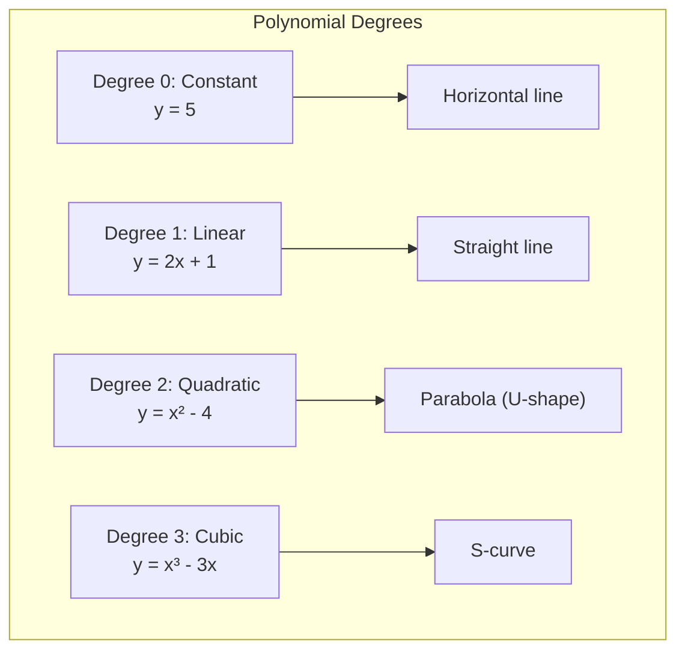
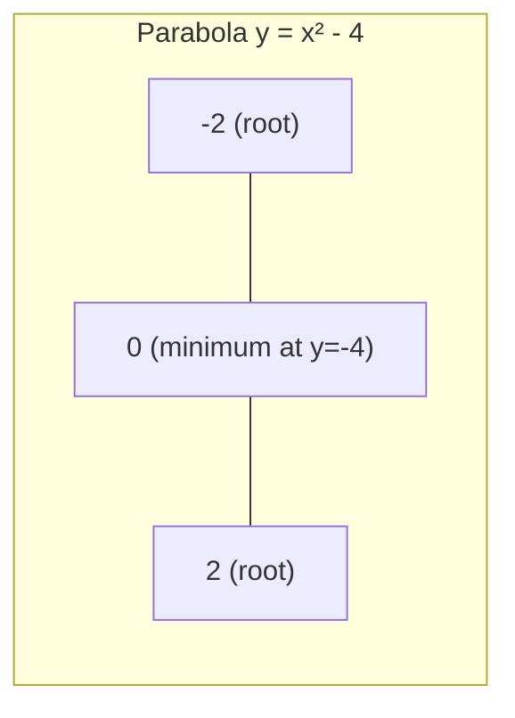
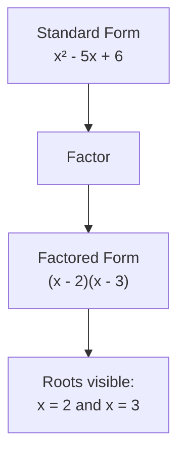

# Chapter 3: Polynomials

## Intuition

A polynomial is a mathematical expression built from variables and constants using only addition, subtraction, multiplication, and non-negative integer exponents. Think of polynomials as the "smooth curves" of mathematics—they can bend and twist, but never have sharp corners or breaks.

**Real-world analogy**: Imagine tracking a ball thrown into the air. Its height over time follows a parabola (a degree-2 polynomial). The ball rises, reaches a peak, then falls—creating that characteristic U-shape curve. Polynomials capture these kinds of smooth, continuous behaviors naturally.

**Why this matters for ML**: Polynomials appear everywhere in machine learning:
- **Polynomial regression** fits curves to non-linear data
- **Kernel methods** use polynomial kernels for non-linear classification
- **Activation function approximations** often use polynomial expansions
- **Model complexity** is directly related to polynomial degree
- **Feature engineering** often involves creating polynomial features ($x^2$, $x_1 x_2$, etc.)

## Visual Explanation

### Polynomial Shapes by Degree



### Roots and the x-axis

The **roots** of a polynomial are where it crosses the x-axis (where $y = 0$):

$$p(x) = x^2 - 4 = (x-2)(x+2)$$

Roots: $x = 2$ and $x = -2$



### Factored Form Reveals Structure

$$x^2 - 5x + 6 = (x - 2)(x - 3)$$



## Mathematical Foundation

### Definition and Terminology

A **polynomial** in variable $x$ is an expression of the form:

$$p(x) = a_n x^n + a_{n-1} x^{n-1} + \ldots + a_1 x + a_0$$

where:
- $a_n, a_{n-1}, \ldots, a_0$ are **coefficients** (constants)
- $a_n \neq 0$ (the leading coefficient)
- $n$ is a non-negative integer

### Degree

The **degree** of a polynomial is the highest power of the variable with a non-zero coefficient.

| Polynomial | Degree | Name |
|------------|--------|------|
| $7$ | 0 | Constant |
| $3x + 2$ | 1 | Linear |
| $x^2 - 4x + 4$ | 2 | Quadratic |
| $2x^3 - x$ | 3 | Cubic |
| $x^4 + x^2 + 1$ | 4 | Quartic |

**Key insight**: The degree determines:
- Maximum number of roots: A degree-$n$ polynomial has at most $n$ roots
- Maximum number of "turns": A degree-$n$ polynomial has at most $n-1$ local extrema
- Behavior at infinity: The leading term dominates for large $|x|$

### Roots (Zeros)

A **root** of polynomial $p(x)$ is a value $r$ such that $p(r) = 0$.

**Fundamental Theorem of Algebra**: Every polynomial of degree $n \geq 1$ has exactly $n$ roots in the complex numbers (counting multiplicity).

**Example**: $p(x) = x^2 - 5x + 6$

To find roots, set $p(x) = 0$:
$$x^2 - 5x + 6 = 0$$

Factor: $(x - 2)(x - 3) = 0$

Roots: $x = 2$ and $x = 3$

### Factoring Techniques

**1. Common Factor**
$$6x^2 + 9x = 3x(2x + 3)$$

**2. Difference of Squares**
$$a^2 - b^2 = (a+b)(a-b)$$

Example: $x^2 - 9 = (x+3)(x-3)$

**3. Quadratic Factoring** (trial and error or formula)
$$x^2 + 5x + 6 = (x + 2)(x + 3)$$

**4. Grouping** (for higher degrees)
$$x^3 + x^2 - x - 1 = x^2(x+1) - 1(x+1) = (x^2 - 1)(x + 1) = (x-1)(x+1)^2$$

### The Quadratic Formula

For $ax^2 + bx + c = 0$, the roots are:

$$x = \frac{-b \pm \sqrt{b^2 - 4ac}}{2a}$$

The **discriminant** $\Delta = b^2 - 4ac$ determines the nature of roots:
- $\Delta > 0$: Two distinct real roots
- $\Delta = 0$: One repeated real root
- $\Delta < 0$: Two complex conjugate roots (no real roots)

**Example**: Solve $2x^2 - 4x - 6 = 0$

$$x = \frac{4 \pm \sqrt{16 + 48}}{4} = \frac{4 \pm \sqrt{64}}{4} = \frac{4 \pm 8}{4}$$

$$x_1 = \frac{12}{4} = 3, \quad x_2 = \frac{-4}{4} = -1$$

### Polynomial Operations

**Addition/Subtraction**: Combine like terms
$$(3x^2 + 2x + 1) + (x^2 - 5x + 3) = 4x^2 - 3x + 4$$

**Multiplication**: Distribute (FOIL for binomials)
$$(x + 2)(x - 3) = x^2 - 3x + 2x - 6 = x^2 - x - 6$$

**Division**: Polynomial long division or synthetic division

## Code Example

```python
import numpy as np
import matplotlib.pyplot as plt
from numpy.polynomial import polynomial as P
from typing import List, Tuple

# Creating and evaluating polynomials
# Polynomial: 2x³ - 3x² + x - 5
coefficients = [-5, 1, -3, 2]  # NumPy uses [a0, a1, a2, ...] order

def evaluate_polynomial(coeffs: List[float], x: np.ndarray) -> np.ndarray:
    """Evaluate polynomial at given x values"""
    return np.polyval(coeffs[::-1], x)  # polyval uses [an, ..., a1, a0] order

x = np.linspace(-2, 3, 100)
y = evaluate_polynomial(coefficients, x)


# Finding roots of polynomials
def find_roots(coeffs: List[float]) -> np.ndarray:
    """
    Find all roots of a polynomial

    coeffs: [a0, a1, a2, ..., an] where polynomial is a0 + a1*x + ... + an*x^n
    """
    return np.roots(coeffs[::-1])  # np.roots expects [an, ..., a1, a0]

# Example: x² - 5x + 6 = 0
quadratic_coeffs = [6, -5, 1]  # 6 - 5x + x²
roots = find_roots(quadratic_coeffs)
print(f"Roots of x² - 5x + 6: {roots}")  # [3. 2.]


# Quadratic formula implementation
def quadratic_formula(a: float, b: float, c: float) -> Tuple[complex, complex]:
    """
    Solve ax² + bx + c = 0

    Returns both roots (may be complex)
    """
    discriminant = b**2 - 4*a*c

    if discriminant >= 0:
        sqrt_disc = np.sqrt(discriminant)
    else:
        sqrt_disc = np.sqrt(complex(discriminant))

    x1 = (-b + sqrt_disc) / (2*a)
    x2 = (-b - sqrt_disc) / (2*a)

    return x1, x2

# Examples with different discriminants
print("\nQuadratic formula examples:")
# Two real roots (Δ > 0)
x1, x2 = quadratic_formula(1, -5, 6)
print(f"x² - 5x + 6 = 0: x = {x1}, {x2}")

# One repeated root (Δ = 0)
x1, x2 = quadratic_formula(1, -4, 4)
print(f"x² - 4x + 4 = 0: x = {x1}, {x2}")

# Complex roots (Δ < 0)
x1, x2 = quadratic_formula(1, 2, 5)
print(f"x² + 2x + 5 = 0: x = {x1}, {x2}")


# Polynomial feature expansion for ML
def polynomial_features(X: np.ndarray, degree: int) -> np.ndarray:
    """
    Generate polynomial features up to specified degree

    Example: For X = [x] and degree = 3, returns [1, x, x², x³]
    """
    n_samples = len(X)
    features = np.ones((n_samples, degree + 1))

    for d in range(1, degree + 1):
        features[:, d] = X ** d

    return features

# Example: Creating polynomial features
X = np.array([1, 2, 3, 4, 5])
poly_features = polynomial_features(X, degree=3)
print(f"\nPolynomial features (degree 3):")
print(f"Original X: {X}")
print(f"Features:\n{poly_features}")


# Polynomial regression example
def polynomial_regression(X: np.ndarray, y: np.ndarray, degree: int) -> np.ndarray:
    """
    Fit polynomial regression using least squares

    Returns coefficients [a0, a1, ..., a_degree]
    """
    # Create polynomial features
    X_poly = polynomial_features(X, degree)

    # Solve normal equations: (X^T X) w = X^T y
    XtX = X_poly.T @ X_poly
    Xty = X_poly.T @ y

    coeffs = np.linalg.solve(XtX, Xty)
    return coeffs

# Generate sample data with quadratic relationship
np.random.seed(42)
X_data = np.linspace(0, 4, 20)
y_data = 2 * X_data**2 - 3 * X_data + 1 + np.random.randn(20) * 2

# Fit polynomials of different degrees
for deg in [1, 2, 3]:
    coeffs = polynomial_regression(X_data, y_data, deg)
    print(f"\nDegree {deg} coefficients: {coeffs}")


# Factoring demonstration using sympy
from sympy import symbols, factor, expand, solve, Poly

x = symbols('x')

# Factor a polynomial
poly = x**2 - 5*x + 6
factored = factor(poly)
print(f"\nFactor {poly} = {factored}")

# Expand factored form
expanded = expand((x - 2) * (x - 3))
print(f"Expand (x-2)(x-3) = {expanded}")

# Find roots symbolically
roots_symbolic = solve(x**2 - 5*x + 6, x)
print(f"Roots: {roots_symbolic}")


# Visualizing polynomial regression fits
def plot_polynomial_fits(X, y, degrees=[1, 2, 3, 5]):
    """Visualize different polynomial degree fits"""
    plt.figure(figsize=(12, 4))

    X_plot = np.linspace(X.min() - 0.5, X.max() + 0.5, 100)

    for i, deg in enumerate(degrees, 1):
        plt.subplot(1, len(degrees), i)

        # Fit polynomial
        coeffs = polynomial_regression(X, y, deg)

        # Predict
        X_poly_plot = polynomial_features(X_plot, deg)
        y_plot = X_poly_plot @ coeffs

        # Plot
        plt.scatter(X, y, alpha=0.7, label='Data')
        plt.plot(X_plot, y_plot, 'r-', linewidth=2, label=f'Degree {deg}')
        plt.title(f'Polynomial Degree {deg}')
        plt.xlabel('x')
        plt.ylabel('y')
        plt.legend()
        plt.grid(True, alpha=0.3)

    plt.tight_layout()
    plt.savefig('polynomial_fits.png', dpi=100)
    print("\nPlot saved as polynomial_fits.png")

# Uncomment to generate plot:
# plot_polynomial_fits(X_data, y_data)


# Demonstrating overfitting with high-degree polynomials
def demonstrate_overfitting():
    """Show how high-degree polynomials can overfit"""
    np.random.seed(0)

    # True relationship is quadratic
    X = np.linspace(0, 1, 10)
    y_true = 2*X**2 - X + 0.5
    y = y_true + np.random.randn(10) * 0.1

    # Fit degree 2 (appropriate) and degree 9 (overfit)
    coeffs_2 = polynomial_regression(X, y, 2)
    coeffs_9 = polynomial_regression(X, y, 9)

    # Evaluate on training data
    X_poly_2 = polynomial_features(X, 2)
    X_poly_9 = polynomial_features(X, 9)

    y_pred_2 = X_poly_2 @ coeffs_2
    y_pred_9 = X_poly_9 @ coeffs_9

    # Calculate training errors
    mse_2 = np.mean((y - y_pred_2)**2)
    mse_9 = np.mean((y - y_pred_9)**2)

    print(f"\nOverfitting demonstration:")
    print(f"Degree 2 MSE: {mse_2:.6f}")
    print(f"Degree 9 MSE: {mse_9:.6f}")
    print(f"Degree 9 has lower training error but would generalize poorly!")

demonstrate_overfitting()
```

## ML Relevance

### Polynomial Regression
Extends linear regression to capture non-linear relationships:

$$y = w_0 + w_1 x + w_2 x^2 + \ldots + w_n x^n$$

This is still "linear" in the weights $w_i$, making it solvable with the same techniques.

### Polynomial Kernel (SVM)
The polynomial kernel enables non-linear classification:

$$K(x, y) = (x \cdot y + c)^d$$

This implicitly maps data to a higher-dimensional space where linear separation is possible.

### Feature Engineering
Creating polynomial features is a common preprocessing step:

```python
from sklearn.preprocessing import PolynomialFeatures
poly = PolynomialFeatures(degree=2, include_bias=False)
X_poly = poly.fit_transform(X)
```

For $[x_1, x_2]$ with degree 2: $[x_1, x_2, x_1^2, x_1 x_2, x_2^2]$

### Taylor Series Approximations
Many functions (sigmoid, tanh, softmax) are approximated by polynomials in hardware implementations:

$$e^x \approx 1 + x + \frac{x^2}{2!} + \frac{x^3}{3!} + \ldots$$

### Model Complexity and Overfitting
Higher-degree polynomials can fit training data perfectly but generalize poorly. This illustrates the bias-variance tradeoff:
- Low degree: High bias, low variance (underfitting)
- High degree: Low bias, high variance (overfitting)

## When to Use / Ignore

### Use Polynomial Models When:
- The relationship is clearly non-linear but smooth
- You have enough data to support higher-degree terms
- You can validate against held-out data to check for overfitting
- Domain knowledge suggests a polynomial relationship (e.g., physics)

### Avoid When:
- Data is limited (polynomials overfit easily)
- Relationship has discontinuities or sharp changes
- Extrapolation is needed (polynomials behave wildly outside training range)
- Interpretability is crucial (high-degree polynomials are hard to explain)

### Common Pitfalls:
1. **Overfitting**: More degrees = more flexibility = more overfitting risk
2. **Numerical instability**: High-degree polynomials with large x values cause overflow
3. **Extrapolation disaster**: Polynomials diverge rapidly outside the training range
4. **Multicollinearity**: Polynomial features are highly correlated, causing unstable coefficients

## Exercises

### Exercise 1: Find Roots by Factoring
Factor and find roots of: $x^2 - 7x + 12$

**Solution**:
We need two numbers that:
- Multiply to give 12
- Add to give -7

Those numbers are -3 and -4:
$$x^2 - 7x + 12 = (x - 3)(x - 4)$$

Roots: $x = 3$ and $x = 4$

### Exercise 2: Apply the Quadratic Formula
Solve: $3x^2 + 2x - 5 = 0$

**Solution**:
$a = 3$, $b = 2$, $c = -5$

$$x = \frac{-2 \pm \sqrt{4 + 60}}{6} = \frac{-2 \pm \sqrt{64}}{6} = \frac{-2 \pm 8}{6}$$

$$x_1 = \frac{6}{6} = 1, \quad x_2 = \frac{-10}{6} = -\frac{5}{3}$$

### Exercise 3: Polynomial Feature Expansion
Write code to create polynomial features for two variables $x_1$ and $x_2$ up to degree 2.

**Solution**:
```python
import numpy as np
from itertools import combinations_with_replacement

def polynomial_features_2d(X, degree=2):
    """
    X: array of shape (n_samples, 2) with columns [x1, x2]
    Returns features: [1, x1, x2, x1², x1*x2, x2²]
    """
    x1, x2 = X[:, 0], X[:, 1]

    features = np.column_stack([
        np.ones(len(X)),  # 1
        x1,               # x1
        x2,               # x2
        x1**2,            # x1²
        x1 * x2,          # x1*x2
        x2**2             # x2²
    ])
    return features

# Test
X = np.array([[1, 2], [3, 4]])
print(polynomial_features_2d(X))
# [[1. 1. 2. 1. 2. 4.]
#  [1. 3. 4. 9. 12. 16.]]
```

## Summary

- **Polynomials** are expressions with non-negative integer exponents: $a_n x^n + \ldots + a_1 x + a_0$

- **Degree** determines:
  - Maximum number of roots
  - Shape complexity (number of turns)
  - Behavior at extreme values

- **Roots** are values where the polynomial equals zero; a degree-$n$ polynomial has at most $n$ real roots

- **Factoring** reveals roots: if $(x - r)$ is a factor, then $r$ is a root

- **Quadratic formula** solves $ax^2 + bx + c = 0$:
  $$x = \frac{-b \pm \sqrt{b^2 - 4ac}}{2a}$$

- **ML applications**:
  - Polynomial regression for curved relationships
  - Polynomial kernels for non-linear classification
  - Feature engineering with polynomial terms
  - Understanding model complexity and overfitting

- **Key warning**: Higher degree does NOT mean better. Polynomials overfit easily and extrapolate poorly.

---

Next: [Chapter 4: Exponentials and Logarithms](./04-exponentials-and-logarithms.md) →
