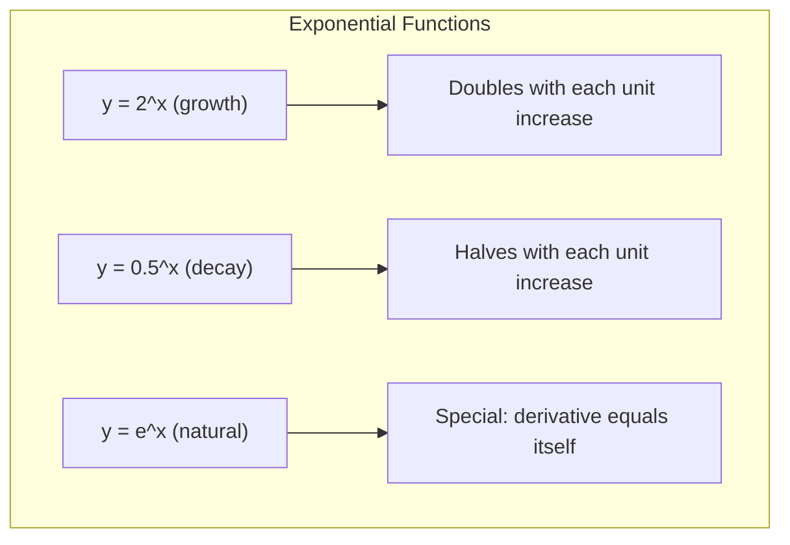
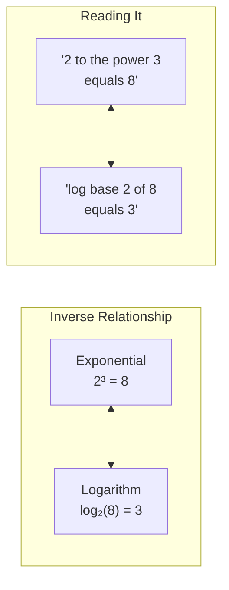
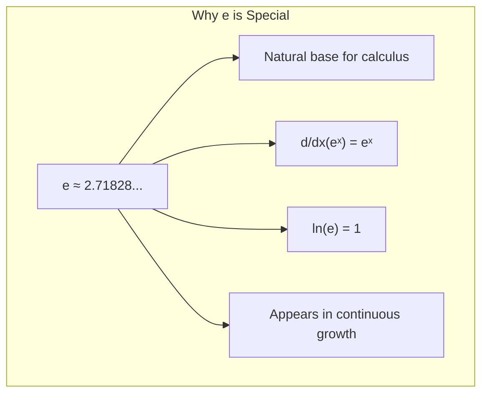

# Chapter 4: Exponentials and Logarithms

## Intuition

Exponentials and logarithms are inverse operations, like multiplication and division. The exponential $b^x$ asks "what do I get when I multiply $b$ by itself $x$ times?" The logarithm $\log_b(y)$ asks the reverse: "how many times must I multiply $b$ by itself to get $y$?"

**Real-world analogy**: Consider compound interest. If you invest $100 at 10% annual interest, after $n$ years you have $100 \times 1.1^n$. That's exponential growth. Now flip the question: "How many years until my money doubles?" That's a logarithm problem: $\log_{1.1}(2) \approx 7.27$ years.

**Why this matters for ML**: These functions are the backbone of modern machine learning:
- **Softmax** uses exponentials to convert raw scores to probabilities
- **Cross-entropy loss** uses logarithms to measure prediction errors
- **Learning rate decay** often follows exponential schedules
- **Information theory** (entropy, KL divergence) is built on logarithms
- **Probability distributions** (normal, exponential) use $e^x$ extensively
- **Gradient flow** in deep networks relies on exponential/log properties

## Visual Explanation

### Exponential Growth vs Decay



### Exponential and Logarithm as Inverses

$$2^3 = 8 \iff \log_2(8) = 3$$



### The Special Number e

$$e = \lim_{n \to \infty} \left(1 + \frac{1}{n}\right)^n \approx 2.71828...$$



## Mathematical Foundation

### Exponential Functions

An **exponential function** has the form:

$$f(x) = b^x$$

where $b > 0$ and $b \neq 1$ (the **base**).

**Key properties**:
- Domain: all real numbers
- Range: positive real numbers only ($b^x > 0$ always)
- $b^0 = 1$ for any valid base
- $b^1 = b$

### Laws of Exponents

These rules are essential for simplifying expressions:

| Law | Formula | Example |
|-----|---------|---------|
| Product | $b^m \cdot b^n = b^{m+n}$ | $2^3 \cdot 2^4 = 2^7 = 128$ |
| Quotient | $\frac{b^m}{b^n} = b^{m-n}$ | $\frac{3^5}{3^2} = 3^3 = 27$ |
| Power | $(b^m)^n = b^{mn}$ | $(2^3)^2 = 2^6 = 64$ |
| Zero | $b^0 = 1$ | $5^0 = 1$ |
| Negative | $b^{-n} = \frac{1}{b^n}$ | $2^{-3} = \frac{1}{8}$ |
| Fractional | $b^{1/n} = \sqrt[n]{b}$ | $8^{1/3} = 2$ |
| Distribution | $(ab)^n = a^n b^n$ | $(2 \cdot 3)^2 = 4 \cdot 9 = 36$ |

### The Natural Exponential: e

The number $e \approx 2.71828...$ is the base of the **natural exponential**:

$$f(x) = e^x$$

**Why $e$ is special**:
1. The derivative of $e^x$ is itself: $\frac{d}{dx}e^x = e^x$
2. It arises naturally in continuous growth/decay
3. It simplifies calculus enormously

### Logarithms

The **logarithm** base $b$ of $x$ is the exponent needed to produce $x$:

$$\log_b(x) = y \iff b^y = x$$

**Common bases**:
- $\log_{10}(x)$: Common logarithm (log)
- $\log_e(x) = \ln(x)$: Natural logarithm
- $\log_2(x)$: Binary logarithm (used in CS/information theory)

### Logarithmic Identities

| Identity | Formula | Example |
|----------|---------|---------|
| Product | $\log_b(xy) = \log_b(x) + \log_b(y)$ | $\log_2(8 \cdot 4) = 3 + 2 = 5$ |
| Quotient | $\log_b(x/y) = \log_b(x) - \log_b(y)$ | $\log_{10}(100/10) = 2 - 1 = 1$ |
| Power | $\log_b(x^n) = n \cdot \log_b(x)$ | $\ln(e^5) = 5 \cdot \ln(e) = 5$ |
| Identity | $\log_b(b) = 1$ | $\log_2(2) = 1$ |
| One | $\log_b(1) = 0$ | $\ln(1) = 0$ |
| Inverse | $b^{\log_b(x)} = x$ | $e^{\ln(5)} = 5$ |
| Inverse | $\log_b(b^x) = x$ | $\log_{10}(10^3) = 3$ |

### Change of Base Formula

Convert between logarithm bases:

$$\log_b(x) = \frac{\log_c(x)}{\log_c(b)} = \frac{\ln(x)}{\ln(b)}$$

**Example**: Calculate $\log_2(10)$

$$\log_2(10) = \frac{\ln(10)}{\ln(2)} = \frac{2.303}{0.693} \approx 3.322$$

### Exponential Growth and Decay

**Growth**: $N(t) = N_0 e^{kt}$ where $k > 0$
**Decay**: $N(t) = N_0 e^{-kt}$ where $k > 0$

The constant $k$ is the **rate constant**. The time to double (growth) or halve (decay):

$$t_{1/2} = \frac{\ln(2)}{k}$$

## Code Example

```python
import numpy as np
import matplotlib.pyplot as plt
from typing import Callable

# Basic exponential and logarithm operations
print("=== Basic Operations ===")
print(f"e = {np.e}")
print(f"e^2 = {np.exp(2)}")
print(f"ln(e) = {np.log(np.e)}")
print(f"log10(100) = {np.log10(100)}")
print(f"log2(8) = {np.log2(8)}")


# Laws of exponents demonstration
print("\n=== Laws of Exponents ===")
b, m, n = 2, 3, 4

# Product rule: b^m * b^n = b^(m+n)
print(f"{b}^{m} * {b}^{n} = {b**m * b**n} = {b}^{m+n} = {b**(m+n)}")

# Quotient rule: b^m / b^n = b^(m-n)
print(f"{b}^{m} / {b}^{n} = {b**m / b**n} = {b}^{m-n} = {b**(m-n)}")

# Power rule: (b^m)^n = b^(m*n)
print(f"({b}^{m})^{n} = {(b**m)**n} = {b}^{m*n} = {b**(m*n)}")


# Logarithmic identities
print("\n=== Logarithmic Identities ===")
x, y = 8, 4

# Product rule
print(f"log2({x}*{y}) = log2({x*y}) = {np.log2(x*y):.4f}")
print(f"log2({x}) + log2({y}) = {np.log2(x)} + {np.log2(y)} = {np.log2(x) + np.log2(y)}")

# Power rule
print(f"log2({x}^3) = {np.log2(x**3)}")
print(f"3 * log2({x}) = {3 * np.log2(x)}")


# Change of base formula
def log_base(x: float, base: float) -> float:
    """Calculate logarithm with arbitrary base using change of base formula"""
    return np.log(x) / np.log(base)

print("\n=== Change of Base ===")
print(f"log_5(125) = {log_base(125, 5)}")  # Should be 3
print(f"log_3(81) = {log_base(81, 3)}")    # Should be 4


# Softmax function - crucial in ML for converting scores to probabilities
def softmax(x: np.ndarray) -> np.ndarray:
    """
    Compute softmax probabilities

    softmax(x_i) = exp(x_i) / sum(exp(x_j))

    Numerically stable implementation subtracts max
    """
    # Subtract max for numerical stability (doesn't change result)
    exp_x = np.exp(x - np.max(x))
    return exp_x / np.sum(exp_x)

logits = np.array([2.0, 1.0, 0.1])
probs = softmax(logits)
print(f"\n=== Softmax ===")
print(f"Logits: {logits}")
print(f"Probabilities: {probs}")
print(f"Sum of probabilities: {np.sum(probs)}")  # Should be 1.0


# Cross-entropy loss - uses logarithms
def cross_entropy_loss(y_true: np.ndarray, y_pred: np.ndarray,
                       epsilon: float = 1e-15) -> float:
    """
    Compute cross-entropy loss

    L = -sum(y_true * log(y_pred))

    epsilon prevents log(0)
    """
    # Clip predictions to avoid log(0)
    y_pred = np.clip(y_pred, epsilon, 1 - epsilon)
    return -np.sum(y_true * np.log(y_pred))

# True label is class 0 (one-hot encoded)
y_true = np.array([1, 0, 0])

# Good prediction
y_pred_good = np.array([0.9, 0.05, 0.05])
loss_good = cross_entropy_loss(y_true, y_pred_good)

# Bad prediction
y_pred_bad = np.array([0.1, 0.5, 0.4])
loss_bad = cross_entropy_loss(y_true, y_pred_bad)

print(f"\n=== Cross-Entropy Loss ===")
print(f"Good prediction loss: {loss_good:.4f}")
print(f"Bad prediction loss: {loss_bad:.4f}")


# Log-sum-exp trick for numerical stability
def log_sum_exp(x: np.ndarray) -> float:
    """
    Compute log(sum(exp(x))) in a numerically stable way

    log(sum(exp(x))) = max(x) + log(sum(exp(x - max(x))))

    This prevents overflow when x contains large values
    """
    max_x = np.max(x)
    return max_x + np.log(np.sum(np.exp(x - max_x)))

# Without the trick, this would overflow
large_values = np.array([1000, 1001, 1002])
print(f"\n=== Log-Sum-Exp Trick ===")
print(f"Large values: {large_values}")
print(f"log_sum_exp result: {log_sum_exp(large_values):.4f}")
# Direct computation would give: inf


# Exponential moving average (common in ML)
def exponential_moving_average(data: np.ndarray, alpha: float = 0.1) -> np.ndarray:
    """
    Compute exponential moving average

    EMA_t = alpha * x_t + (1 - alpha) * EMA_{t-1}

    Used in optimizers (momentum), batch normalization, etc.
    """
    ema = np.zeros_like(data)
    ema[0] = data[0]

    for t in range(1, len(data)):
        ema[t] = alpha * data[t] + (1 - alpha) * ema[t-1]

    return ema

# Example: smoothing noisy data
np.random.seed(42)
noisy_signal = np.sin(np.linspace(0, 4*np.pi, 100)) + np.random.randn(100) * 0.3
smoothed = exponential_moving_average(noisy_signal, alpha=0.1)

print(f"\n=== Exponential Moving Average ===")
print(f"Original variance: {np.var(noisy_signal):.4f}")
print(f"Smoothed variance: {np.var(smoothed):.4f}")


# Learning rate decay schedules
def exponential_decay(initial_lr: float, decay_rate: float,
                      epoch: int, decay_steps: int = 1) -> float:
    """
    Exponential learning rate decay

    lr = initial_lr * decay_rate^(epoch / decay_steps)
    """
    return initial_lr * (decay_rate ** (epoch / decay_steps))

print(f"\n=== Learning Rate Decay ===")
initial_lr = 0.1
for epoch in [0, 10, 20, 50, 100]:
    lr = exponential_decay(initial_lr, decay_rate=0.95, epoch=epoch)
    print(f"Epoch {epoch:3d}: lr = {lr:.6f}")


# Sigmoid function (uses exponentials)
def sigmoid(x: np.ndarray) -> np.ndarray:
    """
    Sigmoid activation: σ(x) = 1 / (1 + exp(-x))

    Maps any real number to (0, 1)
    """
    return 1 / (1 + np.exp(-np.clip(x, -500, 500)))

print(f"\n=== Sigmoid Function ===")
test_values = np.array([-5, -1, 0, 1, 5])
print(f"x values:       {test_values}")
print(f"sigmoid(x):     {sigmoid(test_values)}")


# Information entropy
def entropy(probabilities: np.ndarray, epsilon: float = 1e-15) -> float:
    """
    Shannon entropy: H(p) = -sum(p * log2(p))

    Measures uncertainty/information content
    """
    p = np.clip(probabilities, epsilon, 1)
    return -np.sum(p * np.log2(p))

# High entropy (uncertain)
uniform_dist = np.array([0.25, 0.25, 0.25, 0.25])
# Low entropy (certain)
peaked_dist = np.array([0.97, 0.01, 0.01, 0.01])

print(f"\n=== Information Entropy ===")
print(f"Uniform distribution entropy: {entropy(uniform_dist):.4f} bits")
print(f"Peaked distribution entropy: {entropy(peaked_dist):.4f} bits")


# Solving exponential equations
def solve_exponential_time(final_value: float, initial_value: float,
                           rate: float) -> float:
    """
    Solve N = N0 * e^(kt) for t

    t = ln(N/N0) / k
    """
    return np.log(final_value / initial_value) / rate

# Example: How long for bacteria to triple with growth rate k=0.5?
doubling_time = solve_exponential_time(2, 1, 0.5)
tripling_time = solve_exponential_time(3, 1, 0.5)

print(f"\n=== Exponential Growth Time ===")
print(f"Time to double (k=0.5): {doubling_time:.4f}")
print(f"Time to triple (k=0.5): {tripling_time:.4f}")
```

## ML Relevance

### Softmax Activation
Converts raw network outputs (logits) to probabilities:

$$\text{softmax}(z_i) = \frac{e^{z_i}}{\sum_j e^{z_j}}$$

Properties:
- All outputs are positive (due to $e^x > 0$)
- Outputs sum to 1 (valid probability distribution)
- Larger inputs get exponentially more probability mass

### Cross-Entropy Loss
The standard loss for classification:

$$L = -\sum_i y_i \log(\hat{y}_i)$$

The logarithm:
- Penalizes confident wrong predictions heavily
- Creates well-behaved gradients for optimization
- Connects to information theory (surprisal)

### Sigmoid Activation
Binary classification output and hidden layer activation:

$$\sigma(x) = \frac{1}{1 + e^{-x}}$$

### Log-Likelihood and Probability
Maximum likelihood estimation uses log-probabilities:

$$\log P(D|\theta) = \sum_i \log P(x_i|\theta)$$

The logarithm converts products to sums, preventing numerical underflow.

### Batch Normalization
Uses exponential moving averages for running statistics:

$$\mu_{running} = (1 - \alpha)\mu_{running} + \alpha \mu_{batch}$$

### Information Theory
Entropy, KL divergence, and mutual information all use logarithms:

$$H(p) = -\sum_i p_i \log p_i$$

## When to Use / Ignore

### Use Exponentials/Logarithms When:
- Converting between additive and multiplicative scales
- Working with probabilities (log-probabilities are more stable)
- Modeling growth/decay processes
- Implementing softmax, sigmoid, or cross-entropy
- Needing to prevent numerical overflow/underflow

### Common Pitfalls:
1. **Numerical overflow**: $e^{1000}$ overflows. Use log-space computations.

2. **Log of zero**: $\log(0) = -\infty$. Always add small epsilon.

3. **Base confusion**: $\log$ in math often means $\ln$; in CS often means $\log_2$. Be explicit.

4. **Forgetting log rules**: Common error: $\log(a+b) \neq \log(a) + \log(b)$

5. **Gradient issues**: Sigmoid saturates for large $|x|$, causing vanishing gradients.

### Numerical Stability Tips:
```python
# BAD: Can overflow
probs = np.exp(logits) / np.sum(np.exp(logits))

# GOOD: Numerically stable softmax
logits_stable = logits - np.max(logits)
probs = np.exp(logits_stable) / np.sum(np.exp(logits_stable))

# BAD: log(0) = -inf
loss = -np.log(predictions)

# GOOD: Clipping prevents log(0)
loss = -np.log(np.clip(predictions, 1e-15, 1))
```

## Exercises

### Exercise 1: Simplify Using Laws
Simplify: $\frac{e^{3x} \cdot e^{2x}}{e^{x}}$

**Solution**:
Using the laws of exponents:
$$\frac{e^{3x} \cdot e^{2x}}{e^{x}} = \frac{e^{3x+2x}}{e^x} = \frac{e^{5x}}{e^x} = e^{5x-x} = e^{4x}$$

### Exercise 2: Solve for x
Solve: $5^{2x-1} = 125$

**Solution**:
First, recognize that $125 = 5^3$:
$$5^{2x-1} = 5^3$$

Since bases are equal, exponents must be equal:
$$2x - 1 = 3$$
$$2x = 4$$
$$x = 2$$

### Exercise 3: Implement Stable Cross-Entropy
Write a numerically stable cross-entropy loss function that handles edge cases.

**Solution**:
```python
import numpy as np

def stable_cross_entropy(y_true: np.ndarray, logits: np.ndarray) -> float:
    """
    Numerically stable cross-entropy from logits (not probabilities)

    Combines softmax and cross-entropy for stability
    """
    # Shift logits for numerical stability
    logits_stable = logits - np.max(logits)

    # log_softmax = logits - log(sum(exp(logits)))
    log_sum_exp = np.log(np.sum(np.exp(logits_stable)))
    log_softmax = logits_stable - log_sum_exp

    # Cross-entropy: -sum(y_true * log_softmax)
    return -np.sum(y_true * log_softmax)

# Test
y_true = np.array([1, 0, 0])
logits = np.array([10, 2, 1])  # High confidence correct
loss = stable_cross_entropy(y_true, logits)
print(f"Loss: {loss:.6f}")  # Should be small
```

## Summary

- **Exponential functions** $b^x$ model multiplicative growth/decay

- **Laws of exponents** enable simplification:
  - $b^m \cdot b^n = b^{m+n}$
  - $(b^m)^n = b^{mn}$
  - $b^{-n} = 1/b^n$

- **The natural base** $e \approx 2.718$ is special because $\frac{d}{dx}e^x = e^x$

- **Logarithms** are inverse exponentials: $\log_b(x) = y \iff b^y = x$

- **Logarithmic identities** convert products to sums:
  - $\log(xy) = \log(x) + \log(y)$
  - $\log(x^n) = n\log(x)$

- **Change of base**: $\log_b(x) = \frac{\ln(x)}{\ln(b)}$

- **ML applications are everywhere**:
  - Softmax: $e^{z_i}/\sum e^{z_j}$
  - Cross-entropy: $-\sum y_i \log(\hat{y}_i)$
  - Sigmoid: $1/(1+e^{-x})$
  - Learning rate decay, batch norm, information theory

- **Numerical stability** is crucial: use log-space, subtract max, clip values

---

Next: [Chapter 5: Inequalities](./05-inequalities.md) →
