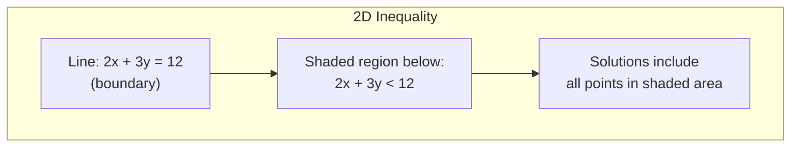
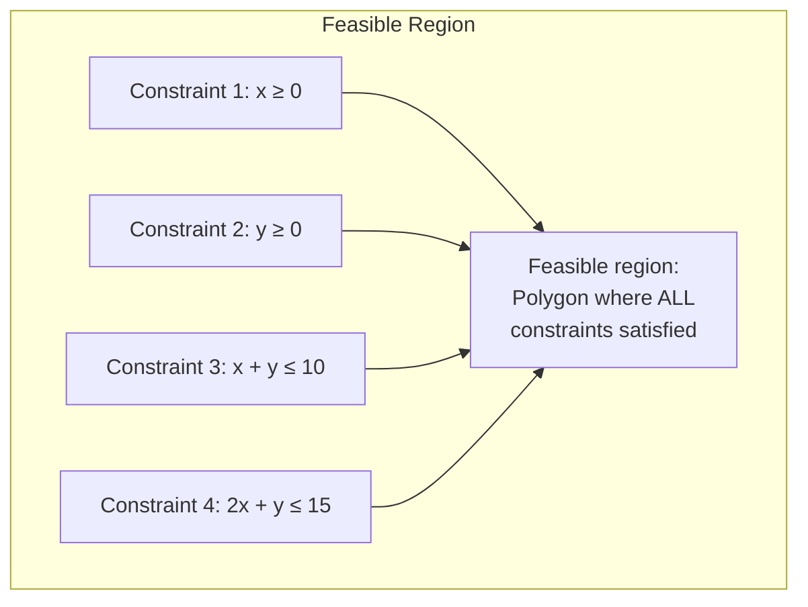

# Chapter 5: Inequalities

## Intuition

While equations ask "what values make two expressions equal?", inequalities ask "what values keep one expression larger (or smaller) than another?" Instead of finding exact points, we find regions—ranges of acceptable values.

**Real-world analogy**: Consider a budget constraint. If you have $100 to spend and each item costs $15, you're not asking "how many items cost exactly $100?" but "how many items can I afford without exceeding $100?" This is an inequality: $15n \leq 100$, giving $n \leq 6.67$, so you can buy at most 6 items.

**Why this matters for ML**: Inequalities define the boundaries of what's possible:
- **Constraint satisfaction**: Neural network outputs must be between 0 and 1 for probabilities
- **Optimization bounds**: Regularization adds constraints to prevent extreme weights
- **Support Vector Machines**: The margin constraint is an inequality
- **ReLU activation**: $\max(0, x)$ is defined by the inequality $x \geq 0$
- **Feasible regions**: In constrained optimization, inequalities define where solutions can exist

## Visual Explanation

### Linear Inequality Regions

A linear inequality in two variables defines a half-plane:

$$2x + 3y \leq 12$$



### Systems of Inequalities

Multiple inequalities create a **feasible region**:



### Inequality Notation

| Symbol | Meaning | Example | On Number Line |
|--------|---------|---------|----------------|
| $<$ | Less than | $x < 3$ | Open circle at 3, arrow left |
| $\leq$ | Less than or equal | $x \leq 3$ | Closed circle at 3, arrow left |
| $>$ | Greater than | $x > 3$ | Open circle at 3, arrow right |
| $\geq$ | Greater than or equal | $x \geq 3$ | Closed circle at 3, arrow right |

## Mathematical Foundation

### Solving Linear Inequalities

Solving inequalities is similar to solving equations, with one critical difference:

> **When multiplying or dividing by a negative number, flip the inequality sign.**

**Example**: Solve $-2x + 5 > 11$

**Step 1**: Subtract 5 from both sides
$$-2x > 6$$

**Step 2**: Divide by -2 (flip the sign!)
$$x < -3$$

**Solution**: All values less than $-3$, written as $(-\infty, -3)$

### Compound Inequalities

**AND (Intersection)**: Both conditions must be true
$$1 < x \leq 5$$
means $x > 1$ AND $x \leq 5$
**Solution**: $(1, 5]$

**OR (Union)**: At least one condition must be true
$$x < -2 \text{ OR } x > 3$$
**Solution**: $(-\infty, -2) \cup (3, \infty)$

### Systems of Linear Inequalities

A **system** of inequalities is a set that must all be satisfied simultaneously.

**Example**:
$$\begin{cases}
x + y \leq 10 \\
x \geq 0 \\
y \geq 0 \\
2x + y \leq 14
\end{cases}$$

The solution is the **feasible region**—the set of all $(x, y)$ points satisfying ALL inequalities.

### Graphical Solution Method

1. Graph each inequality's boundary line
2. Shade the correct side for each inequality
3. The feasible region is the intersection of all shaded areas
4. Identify corner points (vertices) of the feasible region

### Quadratic Inequalities

For inequalities involving $x^2$, find the roots first, then test intervals.

**Example**: Solve $x^2 - 5x + 6 < 0$

**Step 1**: Factor
$$(x - 2)(x - 3) < 0$$

**Step 2**: Find roots: $x = 2$ and $x = 3$

**Step 3**: Test intervals:
- $x < 2$: $(-)(-) = +$ (positive, not < 0)
- $2 < x < 3$: $(+)(-) = -$ (negative, satisfies < 0)
- $x > 3$: $(+)(+) = +$ (positive, not < 0)

**Solution**: $2 < x < 3$ or $(2, 3)$

### Absolute Value Inequalities

$$|x| < a \iff -a < x < a$$
$$|x| > a \iff x < -a \text{ OR } x > a$$

**Example**: Solve $|2x - 3| \leq 5$

$$-5 \leq 2x - 3 \leq 5$$
$$-2 \leq 2x \leq 8$$
$$-1 \leq x \leq 4$$

### Linear Programming Basics

**Linear programming** optimizes a linear objective function subject to linear inequality constraints.

**Standard form**:
$$\text{Maximize } c_1 x_1 + c_2 x_2 + \ldots + c_n x_n$$
$$\text{Subject to: } a_{i1}x_1 + a_{i2}x_2 + \ldots + a_{in}x_n \leq b_i$$

The optimal solution (if it exists) occurs at a vertex of the feasible region.

## Code Example

```python
import numpy as np
import matplotlib.pyplot as plt
from scipy.optimize import linprog
from typing import List, Tuple, Callable

# Checking if a point satisfies an inequality
def satisfies_inequality(x: float, y: float,
                         coeffs: Tuple[float, float, float],
                         inequality_type: str = "<=") -> bool:
    """
    Check if point (x, y) satisfies ax + by (inequality) c

    coeffs: (a, b, c) for ax + by ? c
    inequality_type: "<=", ">=", "<", ">"
    """
    a, b, c = coeffs
    lhs = a * x + b * y

    if inequality_type == "<=":
        return lhs <= c
    elif inequality_type == ">=":
        return lhs >= c
    elif inequality_type == "<":
        return lhs < c
    elif inequality_type == ">":
        return lhs > c
    else:
        raise ValueError(f"Unknown inequality type: {inequality_type}")

# Test
print("=== Single Inequality Check ===")
# 2x + 3y <= 12
print(f"(2, 2) satisfies 2x + 3y <= 12: {satisfies_inequality(2, 2, (2, 3, 12))}")  # True
print(f"(3, 3) satisfies 2x + 3y <= 12: {satisfies_inequality(3, 3, (2, 3, 12))}")  # False


# Solving linear inequalities in one variable
def solve_linear_inequality_1d(a: float, b: float, c: float,
                                inequality: str) -> str:
    """
    Solve ax + b (inequality) c for x

    Returns solution in interval notation
    """
    # Rearrange: ax (inequality) c - b
    rhs = c - b

    if a == 0:
        # No x term: just check if 0 (inequality) rhs
        return "All real numbers" if eval(f"0 {inequality} {rhs}") else "No solution"

    # Divide by a (flip sign if a < 0)
    boundary = rhs / a
    flip = a < 0

    # Determine solution based on inequality and whether we flipped
    if inequality in ["<", "<="]:
        if flip:
            op = ">=" if inequality == "<=" else ">"
        else:
            op = inequality
    else:  # > or >=
        if flip:
            op = "<=" if inequality == ">=" else "<"
        else:
            op = inequality

    # Format result
    if op == "<":
        return f"(-inf, {boundary})"
    elif op == "<=":
        return f"(-inf, {boundary}]"
    elif op == ">":
        return f"({boundary}, inf)"
    else:  # >=
        return f"[{boundary}, inf)"

print("\n=== Solving 1D Inequalities ===")
# Solve: 3x + 2 < 11
print(f"3x + 2 < 11: x in {solve_linear_inequality_1d(3, 2, 11, '<')}")  # (-inf, 3)

# Solve: -2x + 5 >= 1
print(f"-2x + 5 >= 1: x in {solve_linear_inequality_1d(-2, 5, 1, '>=')}")  # (-inf, 2]


# Feasible region checking for systems of inequalities
def is_feasible(point: np.ndarray, A: np.ndarray, b: np.ndarray) -> bool:
    """
    Check if point satisfies all constraints Ax <= b
    """
    return np.all(A @ point <= b)

# Define system of constraints: x >= 0, y >= 0, x + y <= 10, 2x + y <= 14
# Convert to standard form Ax <= b
# -x <= 0, -y <= 0, x + y <= 10, 2x + y <= 14
A = np.array([
    [-1, 0],    # -x <= 0 (i.e., x >= 0)
    [0, -1],    # -y <= 0 (i.e., y >= 0)
    [1, 1],     # x + y <= 10
    [2, 1]      # 2x + y <= 14
])
b = np.array([0, 0, 10, 14])

print("\n=== Feasibility Check ===")
test_points = [
    np.array([3, 4]),   # Should be feasible
    np.array([5, 5]),   # Should be feasible
    np.array([8, 4]),   # Should NOT be feasible (violates 2x + y <= 14)
    np.array([-1, 3])   # Should NOT be feasible (violates x >= 0)
]

for point in test_points:
    feasible = is_feasible(point, A, b)
    print(f"Point {point}: {'Feasible' if feasible else 'Not feasible'}")


# Finding vertices of feasible region
def find_vertices_2d(A: np.ndarray, b: np.ndarray) -> List[np.ndarray]:
    """
    Find vertices of a 2D feasible region defined by Ax <= b

    Vertices occur at intersections of constraint boundaries
    """
    n_constraints = len(b)
    vertices = []

    # Check all pairs of constraints
    for i in range(n_constraints):
        for j in range(i + 1, n_constraints):
            # Solve the 2x2 system of equalities
            A_pair = np.array([A[i], A[j]])
            b_pair = np.array([b[i], b[j]])

            try:
                # Check if system is solvable
                if np.linalg.matrix_rank(A_pair) == 2:
                    vertex = np.linalg.solve(A_pair, b_pair)

                    # Check if this vertex satisfies ALL constraints
                    if is_feasible(vertex, A, b + 1e-10):  # Small tolerance
                        vertices.append(vertex)
            except np.linalg.LinAlgError:
                continue

    return vertices

vertices = find_vertices_2d(A, b)
print("\n=== Vertices of Feasible Region ===")
for v in vertices:
    print(f"  ({v[0]:.2f}, {v[1]:.2f})")


# Linear Programming with scipy
def linear_programming_example():
    """
    Maximize: 3x + 2y
    Subject to:
        x >= 0, y >= 0
        x + y <= 10
        2x + y <= 14
    """
    # scipy.linprog minimizes, so we negate coefficients to maximize
    c = [-3, -2]  # Negative because we want to maximize

    # Inequality constraints: A_ub @ x <= b_ub
    A_ub = np.array([
        [1, 1],     # x + y <= 10
        [2, 1]      # 2x + y <= 14
    ])
    b_ub = np.array([10, 14])

    # Bounds for variables (x >= 0, y >= 0)
    bounds = [(0, None), (0, None)]

    result = linprog(c, A_ub=A_ub, b_ub=b_ub, bounds=bounds, method='highs')

    return result

result = linear_programming_example()
print("\n=== Linear Programming ===")
print(f"Optimal point: ({result.x[0]:.2f}, {result.x[1]:.2f})")
print(f"Maximum value of 3x + 2y: {-result.fun:.2f}")  # Negate because we negated c


# Quadratic inequality solver
def solve_quadratic_inequality(a: float, b: float, c: float,
                                inequality: str) -> str:
    """
    Solve ax^2 + bx + c (inequality) 0

    Returns solution in interval notation
    """
    discriminant = b**2 - 4*a*c

    if discriminant < 0:
        # No real roots
        if a > 0:
            # Parabola opens up, always positive
            return "No solution" if inequality in ["<", "<="] else "All real numbers"
        else:
            # Parabola opens down, always negative
            return "All real numbers" if inequality in ["<", "<="] else "No solution"

    # Calculate roots
    sqrt_disc = np.sqrt(discriminant)
    x1 = (-b - sqrt_disc) / (2 * a)
    x2 = (-b + sqrt_disc) / (2 * a)

    if x1 > x2:
        x1, x2 = x2, x1  # Ensure x1 < x2

    # Determine solution based on parabola direction and inequality
    if a > 0:  # Opens upward: negative between roots
        if inequality == "<":
            return f"({x1:.4f}, {x2:.4f})"
        elif inequality == "<=":
            return f"[{x1:.4f}, {x2:.4f}]"
        elif inequality == ">":
            return f"(-inf, {x1:.4f}) U ({x2:.4f}, inf)"
        else:  # >=
            return f"(-inf, {x1:.4f}] U [{x2:.4f}, inf)"
    else:  # Opens downward: positive between roots
        if inequality == "<":
            return f"(-inf, {x1:.4f}) U ({x2:.4f}, inf)"
        elif inequality == "<=":
            return f"(-inf, {x1:.4f}] U [{x2:.4f}, inf)"
        elif inequality == ">":
            return f"({x1:.4f}, {x2:.4f})"
        else:  # >=
            return f"[{x1:.4f}, {x2:.4f}]"

print("\n=== Quadratic Inequalities ===")
# x^2 - 5x + 6 < 0
print(f"x^2 - 5x + 6 < 0: x in {solve_quadratic_inequality(1, -5, 6, '<')}")

# x^2 - 4 >= 0
print(f"x^2 - 4 >= 0: x in {solve_quadratic_inequality(1, 0, -4, '>=')}")


# ML Application: ReLU as piecewise inequality
def relu(x: np.ndarray) -> np.ndarray:
    """
    ReLU activation: max(0, x)

    Defined by inequality: output = x if x >= 0, else 0
    """
    return np.maximum(0, x)

def relu_derivative(x: np.ndarray) -> np.ndarray:
    """
    ReLU derivative: 1 if x > 0, else 0

    The inequality x > 0 determines the gradient
    """
    return (x > 0).astype(float)

print("\n=== ReLU (Inequality-Based Activation) ===")
x_test = np.array([-2, -1, 0, 1, 2])
print(f"Input:      {x_test}")
print(f"ReLU:       {relu(x_test)}")
print(f"Derivative: {relu_derivative(x_test)}")


# Constraint handling in optimization
def project_onto_constraints(x: np.ndarray,
                              lower: np.ndarray,
                              upper: np.ndarray) -> np.ndarray:
    """
    Project x onto box constraints: lower <= x <= upper

    This is a common operation in constrained optimization
    """
    return np.clip(x, lower, upper)

print("\n=== Constraint Projection ===")
x = np.array([1.5, -0.5, 2.5])
lower = np.array([0, 0, 0])
upper = np.array([1, 1, 1])

projected = project_onto_constraints(x, lower, upper)
print(f"Original: {x}")
print(f"Lower bounds: {lower}")
print(f"Upper bounds: {upper}")
print(f"Projected: {projected}")


# Visualizing feasible regions
def plot_feasible_region():
    """Create a visualization of a 2D feasible region"""
    fig, ax = plt.subplots(figsize=(10, 8))

    # Create grid
    x = np.linspace(-1, 12, 400)
    y = np.linspace(-1, 12, 400)
    X, Y = np.meshgrid(x, y)

    # Define constraints
    # x >= 0, y >= 0, x + y <= 10, 2x + y <= 14
    feasible = (X >= 0) & (Y >= 0) & (X + Y <= 10) & (2*X + Y <= 14)

    # Plot feasible region
    ax.contourf(X, Y, feasible, levels=[0.5, 1.5], colors=['lightblue'], alpha=0.5)

    # Plot constraint lines
    ax.axvline(x=0, color='red', linestyle='--', label='x = 0')
    ax.axhline(y=0, color='green', linestyle='--', label='y = 0')
    ax.plot(x, 10 - x, 'b-', label='x + y = 10')
    ax.plot(x, 14 - 2*x, 'm-', label='2x + y = 14')

    # Mark vertices
    vertices = [(0, 0), (0, 10), (4, 6), (7, 0)]
    for v in vertices:
        ax.plot(*v, 'ko', markersize=10)
        ax.annotate(f'({v[0]}, {v[1]})', v, textcoords="offset points",
                   xytext=(5, 5), fontsize=10)

    ax.set_xlim(-1, 12)
    ax.set_ylim(-1, 12)
    ax.set_xlabel('x')
    ax.set_ylabel('y')
    ax.set_title('Feasible Region for Linear Programming Problem')
    ax.legend()
    ax.grid(True, alpha=0.3)
    ax.set_aspect('equal')

    plt.savefig('feasible_region.png', dpi=100)
    print("\nPlot saved as feasible_region.png")

# Uncomment to generate plot:
# plot_feasible_region()
```

## ML Relevance

### Constrained Optimization
Most ML training involves implicit or explicit constraints:

$$\min_{\theta} \mathcal{L}(\theta) \quad \text{subject to} \quad g_i(\theta) \leq 0$$

Examples:
- Weight clipping: $|w_i| \leq c$
- Probability constraints: $0 \leq p \leq 1$
- Norm constraints: $\|\theta\|_2 \leq \lambda$

### Support Vector Machines
SVM's core formulation uses inequality constraints:

$$\text{Maximize margin subject to } y_i(w \cdot x_i + b) \geq 1$$

The constraint ensures all points are on the correct side of the margin.

### ReLU Activation
The most common activation function is inequality-defined:

$$\text{ReLU}(x) = \max(0, x) = \begin{cases} x & \text{if } x \geq 0 \\ 0 & \text{otherwise} \end{cases}$$

### Regularization as Constraints
L1/L2 regularization can be viewed as inequality constraints:

$$\min \mathcal{L}(\theta) \quad \text{subject to} \quad \|\theta\|_p \leq t$$

### Batch Normalization Clipping
Gradient clipping prevents explosion:

$$g_{\text{clipped}} = \begin{cases} g & \text{if } \|g\| \leq \text{threshold} \\ \text{threshold} \cdot \frac{g}{\|g\|} & \text{otherwise} \end{cases}$$

### Linear Programming in ML
- Feature selection with budget constraints
- Optimal transport problems
- Sparse optimization

## When to Use / Ignore

### Use Inequality Reasoning When:
- Setting bounds on model parameters (weight clipping)
- Defining valid input/output ranges
- Implementing activation functions (ReLU, clipping)
- Solving constrained optimization problems
- Understanding SVM margins and feasibility

### Common Pitfalls:
1. **Forgetting to flip signs**: When multiplying/dividing inequalities by negative numbers

2. **Strict vs non-strict confusion**: $<$ vs $\leq$ matters for boundary inclusion

3. **Empty feasible regions**: Constraints can be contradictory (no solution)

4. **Unbounded regions**: Some constraint sets don't limit solutions sufficiently

5. **Numerical precision**: Boundary cases can cause issues ($x \leq 0$ vs $x < \epsilon$)

## Exercises

### Exercise 1: Solve the Inequality
Solve: $4 - 3x \geq 10$

**Solution**:
$$4 - 3x \geq 10$$
$$-3x \geq 6$$
$$x \leq -2 \quad \text{(flip sign when dividing by negative)}$$

Answer: $(-\infty, -2]$

### Exercise 2: Find the Feasible Region
For the constraints:
- $x \geq 0$
- $y \geq 0$
- $x + 2y \leq 8$
- $3x + y \leq 9$

Find all corner points (vertices) of the feasible region.

**Solution**:
1. Intersection of $x = 0$ and $y = 0$: $(0, 0)$
2. Intersection of $x = 0$ and $x + 2y = 8$: $(0, 4)$
3. Intersection of $y = 0$ and $3x + y = 9$: $(3, 0)$
4. Intersection of $x + 2y = 8$ and $3x + y = 9$:
   - From first: $x = 8 - 2y$
   - Substitute: $3(8 - 2y) + y = 9$
   - $24 - 6y + y = 9$
   - $y = 3$, $x = 2$
   - Point: $(2, 3)$

Vertices: $(0, 0)$, $(0, 4)$, $(3, 0)$, $(2, 3)$

### Exercise 3: Implement Constraint Checking
Write a function that checks if a neural network output satisfies softmax constraints.

**Solution**:
```python
import numpy as np

def check_softmax_constraints(output: np.ndarray, tolerance: float = 1e-6) -> dict:
    """
    Check if output satisfies softmax constraints:
    1. All values >= 0
    2. All values <= 1
    3. Sum equals 1

    Returns dict with constraint satisfaction status
    """
    results = {
        'all_non_negative': np.all(output >= -tolerance),
        'all_at_most_one': np.all(output <= 1 + tolerance),
        'sum_equals_one': np.abs(np.sum(output) - 1) < tolerance,
    }
    results['all_satisfied'] = all(results.values())
    return results

# Test
valid_output = np.array([0.7, 0.2, 0.1])
invalid_output = np.array([0.5, 0.3, 0.3])  # Sum != 1

print("Valid output:", check_softmax_constraints(valid_output))
print("Invalid output:", check_softmax_constraints(invalid_output))
```

## Summary

- **Inequalities** compare expressions using $<, \leq, >, \geq$

- **Key rule**: Flip the inequality sign when multiplying/dividing by negative numbers

- **Compound inequalities**:
  - AND: Both conditions must hold (intersection)
  - OR: At least one must hold (union)

- **Systems of inequalities** define **feasible regions** where all constraints are satisfied

- **Linear programming** optimizes over feasible regions; optimal solutions occur at vertices

- **Quadratic inequalities**: Factor, find roots, test intervals

- **ML applications**:
  - Constrained optimization (weight bounds, probability constraints)
  - SVM margins: $y_i(w \cdot x_i + b) \geq 1$
  - ReLU: $\max(0, x)$ defined by $x \geq 0$
  - Regularization as norm constraints
  - Gradient clipping

- **Practical tips**:
  - Always check feasibility before optimization
  - Handle boundary cases carefully
  - Visualize 2D constraint regions when debugging

---

[Back to Level 2 Overview](./README.md)
