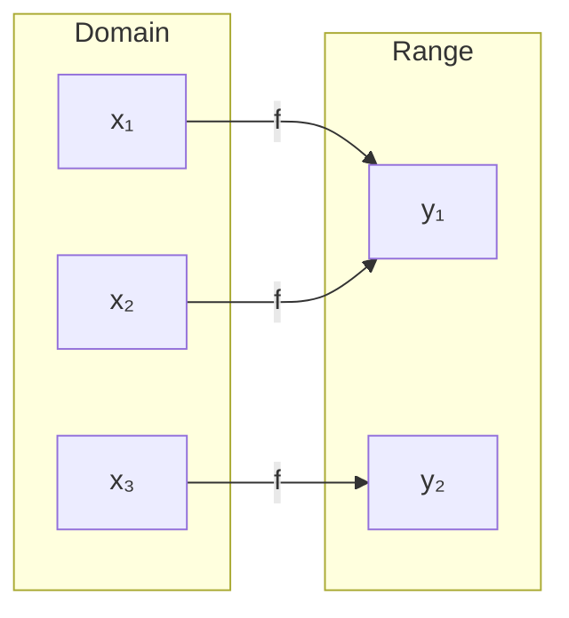
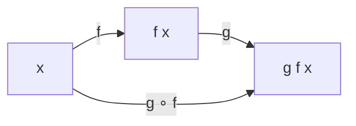

# Chapter 1: Functions Fundamentals

## Intuition

A **function** is a rule that assigns exactly one output to each input. Think of it as a machine: you put something in, and you get something out - consistently. The same input always produces the same output.

**Real-world analogies:**
- A vending machine: Input a code (A7), get exactly one product
- A dictionary: Input a word, get its definition
- GPS navigation: Input coordinates, get an address

**Why this matters for ML:**
Every ML model is fundamentally a function. When you train a neural network, you're defining a complex function. When you run inference, you're evaluating that function. Understanding function properties helps you:
- Design appropriate model architectures
- Debug unexpected behaviors
- Choose the right loss functions
- Understand model limitations

## Visual Explanation

### Function as a Mapping



The arrows show how inputs map to outputs. Notice that multiple inputs can map to the same output (many-to-one), but each input maps to exactly one output.

### Domain and Range Visualization

$$f: \text{Domain} \rightarrow \text{Range}$$

```
Domain (valid inputs)          Range (possible outputs)
┌──────────────────┐          ┌──────────────────┐
│  All real        │    f     │  Non-negative    │
│  numbers         │ ───────▶ │  real numbers    │
│  ℝ               │          │  [0, ∞)          │
└──────────────────┘          └──────────────────┘

Example: f(x) = x²
```

## Mathematical Foundation

### Domain and Range

**Definition**: For a function $f: A \rightarrow B$:
- **Domain** ($A$): The set of all valid inputs
- **Codomain** ($B$): The set where outputs live
- **Range** (or Image): The set of actual outputs $\{f(x) : x \in A\}$

**Examples in ML:**

| Function | Domain | Range |
|----------|--------|-------|
| Sigmoid $\sigma(x) = \frac{1}{1+e^{-x}}$ | $\mathbb{R}$ | $(0, 1)$ |
| ReLU $\max(0, x)$ | $\mathbb{R}$ | $[0, \infty)$ |
| Softmax | $\mathbb{R}^n$ | Probability simplex |
| Neural network classifier | $\mathbb{R}^d$ | $[0, 1]^k$ |

### One-to-One (Injective) Functions

**Definition**: A function $f$ is **one-to-one** (injective) if different inputs always produce different outputs:

$$f(x_1) = f(x_2) \implies x_1 = x_2$$

**Visual:**
```
One-to-One:                    Many-to-One:
x₁ ──▶ y₁                      x₁ ──┐
x₂ ──▶ y₂                      x₂ ──┼──▶ y₁
x₃ ──▶ y₃                      x₃ ──┘
```

**ML Relevance:**
- **Autoencoders**: The encoder is typically many-to-one (compresses information)
- **Invertible Neural Networks**: Require one-to-one mappings
- **Normalizing Flows**: Use bijective (one-to-one and onto) transformations

### Many-to-One Functions

Most ML models are many-to-one:
- Classification: Many inputs map to the same class
- Pooling operations: Multiple values become one
- Hashing: Many keys to same bucket

This is why you cannot perfectly "invert" a trained classifier - information is lost.

### Function Composition

**Definition**: Given functions $f: A \rightarrow B$ and $g: B \rightarrow C$, their composition is:

$$(g \circ f)(x) = g(f(x))$$

**Visual:**


**Deep Learning IS Composition:**

A neural network with layers $L_1, L_2, L_3$ is:

$$\text{Network}(x) = L_3(L_2(L_1(x)))$$

Each layer is a function, and the full network is their composition.

### Inverse Functions

**Definition**: For a bijective function $f: A \rightarrow B$, the inverse $f^{-1}: B \rightarrow A$ satisfies:

$$f^{-1}(f(x)) = x \quad \text{and} \quad f(f^{-1}(y)) = y$$

**Key insight**: Only one-to-one functions have true inverses.

**ML Applications:**
- **Encoder-Decoder**: Encoder encodes, decoder attempts to invert
- **VAEs/GANs**: Generator "inverts" the latent space mapping
- **Inverse Problems**: Recover inputs from observed outputs

## Code Example

```python
import numpy as np
import matplotlib.pyplot as plt

# =============================================================================
# Domain and Range Demonstration
# =============================================================================

def demonstrate_domain_range():
    """Show domain and range for common ML functions."""
    x = np.linspace(-5, 5, 1000)

    # Sigmoid: Domain = R, Range = (0, 1)
    sigmoid = 1 / (1 + np.exp(-x))

    # ReLU: Domain = R, Range = [0, inf)
    relu = np.maximum(0, x)

    # Tanh: Domain = R, Range = (-1, 1)
    tanh = np.tanh(x)

    print("Sigmoid - Domain: all real numbers, Range: (0, 1)")
    print(f"  Min value: {sigmoid.min():.6f}, Max value: {sigmoid.max():.6f}")

    print("\nReLU - Domain: all real numbers, Range: [0, infinity)")
    print(f"  Min value: {relu.min():.6f}, Max value: {relu.max():.6f}")

    print("\nTanh - Domain: all real numbers, Range: (-1, 1)")
    print(f"  Min value: {tanh.min():.6f}, Max value: {tanh.max():.6f}")

    return x, sigmoid, relu, tanh

# =============================================================================
# One-to-One vs Many-to-One
# =============================================================================

def check_injectivity():
    """Demonstrate one-to-one vs many-to-one functions."""

    # One-to-one: f(x) = 2x + 1
    def linear(x):
        return 2 * x + 1

    # Many-to-one: f(x) = x^2
    def square(x):
        return x ** 2

    # Many-to-one: ReLU
    def relu(x):
        return np.maximum(0, x)

    # Test: Do different inputs give same output?
    print("Testing One-to-One property:")
    print(f"Linear: f(2) = {linear(2)}, f(3) = {linear(3)}")
    print(f"  Different inputs -> Different outputs: ONE-TO-ONE")

    print(f"\nSquare: f(-2) = {square(-2)}, f(2) = {square(2)}")
    print(f"  Different inputs -> Same output: MANY-TO-ONE")

    print(f"\nReLU: f(-1) = {relu(-1)}, f(-2) = {relu(-2)}")
    print(f"  Different inputs -> Same output (0): MANY-TO-ONE")

# =============================================================================
# Function Composition (Deep Learning Perspective)
# =============================================================================

def neural_network_as_composition():
    """Show neural network as function composition."""

    # Define simple layer functions
    def layer1(x, W1, b1):
        """Linear transformation + ReLU"""
        return np.maximum(0, np.dot(x, W1) + b1)

    def layer2(x, W2, b2):
        """Linear transformation + ReLU"""
        return np.maximum(0, np.dot(x, W2) + b2)

    def output_layer(x, W3, b3):
        """Linear transformation + Sigmoid"""
        z = np.dot(x, W3) + b3
        return 1 / (1 + np.exp(-z))

    # Initialize random weights
    np.random.seed(42)
    W1 = np.random.randn(3, 4) * 0.5
    b1 = np.zeros(4)
    W2 = np.random.randn(4, 2) * 0.5
    b2 = np.zeros(2)
    W3 = np.random.randn(2, 1) * 0.5
    b3 = np.zeros(1)

    # Input
    x = np.array([1.0, 2.0, 3.0])

    # Composition: output_layer(layer2(layer1(x)))
    h1 = layer1(x, W1, b1)
    h2 = layer2(h1, W2, b2)
    output = output_layer(h2, W3, b3)

    print("Neural Network as Function Composition:")
    print(f"Input x: {x}")
    print(f"After Layer 1 (Linear + ReLU): {h1}")
    print(f"After Layer 2 (Linear + ReLU): {h2}")
    print(f"Final Output (Linear + Sigmoid): {output}")
    print(f"\nThis is: f_output(f_layer2(f_layer1(x)))")

# =============================================================================
# Inverse Functions
# =============================================================================

def inverse_function_demo():
    """Demonstrate inverse functions and their ML relevance."""

    # Logarithm is inverse of exponential
    x = np.array([1, 2, 3, 4, 5])

    exp_x = np.exp(x)
    log_exp_x = np.log(exp_x)  # Should return x

    print("Inverse Functions: exp and log")
    print(f"x:          {x}")
    print(f"exp(x):     {exp_x}")
    print(f"log(exp(x)): {log_exp_x}")
    print(f"Recovered original: {np.allclose(x, log_exp_x)}")

    # Sigmoid and its inverse (logit)
    def sigmoid(x):
        return 1 / (1 + np.exp(-x))

    def logit(p):
        """Inverse of sigmoid: logit(p) = log(p / (1-p))"""
        return np.log(p / (1 - p))

    z = np.array([-2, -1, 0, 1, 2])
    p = sigmoid(z)
    z_recovered = logit(p)

    print("\nInverse Functions: sigmoid and logit")
    print(f"z:                {z}")
    print(f"sigmoid(z):       {p}")
    print(f"logit(sigmoid(z)): {z_recovered}")
    print(f"Recovered original: {np.allclose(z, z_recovered)}")

# Run demonstrations
if __name__ == "__main__":
    print("=" * 60)
    print("DOMAIN AND RANGE")
    print("=" * 60)
    demonstrate_domain_range()

    print("\n" + "=" * 60)
    print("ONE-TO-ONE VS MANY-TO-ONE")
    print("=" * 60)
    check_injectivity()

    print("\n" + "=" * 60)
    print("FUNCTION COMPOSITION")
    print("=" * 60)
    neural_network_as_composition()

    print("\n" + "=" * 60)
    print("INVERSE FUNCTIONS")
    print("=" * 60)
    inverse_function_demo()
```

## ML Relevance

### Where These Concepts Appear

| Concept | ML Application |
|---------|----------------|
| **Domain** | Input space of your model (image dimensions, feature count) |
| **Range** | Output space (probabilities, regression values) |
| **One-to-one** | Invertible networks, normalizing flows |
| **Many-to-one** | Classification, pooling, dimensionality reduction |
| **Composition** | Deep learning layers, residual connections |
| **Inverse** | Autoencoders, generative models, inverse problems |

### Specific Algorithms

1. **Neural Networks**: Composition of layer functions
2. **Normalizing Flows**: Bijective transformations with tractable inverses
3. **Autoencoders**: Encoder (many-to-one) + Decoder (attempts inverse)
4. **Residual Networks**: $f(x) = x + g(x)$ (easier to learn identity)

## When to Use / Ignore

### Pay Attention When:
- Designing model architectures (what's your input/output space?)
- Debugging dimension mismatches (domain of next layer must match range of previous)
- Building generative models (need invertible or approximately invertible functions)
- Understanding information flow (what can and cannot be recovered?)

### Common Pitfalls:
- **Dimension mismatch**: Range of layer $n$ doesn't match domain of layer $n+1$
- **Expecting invertibility**: Classification loses information; you can't recover the exact input
- **Ignoring numerical domains**: Logarithm of negative numbers, division by zero

## Exercises

### Exercise 1: Domain and Range Analysis
**Problem**: For the function $f(x) = \ln(x^2 + 1)$, determine the domain and range.

**Solution**:
- Domain: All real numbers $\mathbb{R}$ (since $x^2 + 1 > 0$ for all $x$)
- Range: $[0, \infty)$ (minimum at $x=0$ gives $\ln(1) = 0$, no upper bound)

### Exercise 2: Composition in Neural Networks
**Problem**: A network has layers with dimensions: Input(10) -> Hidden(20) -> Hidden(15) -> Output(3). Write this as function composition and identify domain/range of each.

**Solution**:
$$\text{Network} = f_3 \circ f_2 \circ f_1$$
- $f_1: \mathbb{R}^{10} \rightarrow \mathbb{R}^{20}$
- $f_2: \mathbb{R}^{20} \rightarrow \mathbb{R}^{15}$
- $f_3: \mathbb{R}^{15} \rightarrow \mathbb{R}^{3}$
- Full network: $\mathbb{R}^{10} \rightarrow \mathbb{R}^{3}$

### Exercise 3: Inverse Functions
**Problem**: Given sigmoid $\sigma(x) = \frac{1}{1+e^{-x}}$, derive its inverse (the logit function).

**Solution**:
Let $y = \frac{1}{1+e^{-x}}$

Solve for $x$:
1. $y(1 + e^{-x}) = 1$
2. $y + ye^{-x} = 1$
3. $ye^{-x} = 1 - y$
4. $e^{-x} = \frac{1-y}{y}$
5. $-x = \ln\left(\frac{1-y}{y}\right)$
6. $x = \ln\left(\frac{y}{1-y}\right)$

Therefore: $\sigma^{-1}(y) = \text{logit}(y) = \ln\left(\frac{y}{1-y}\right)$

## Summary

- **Functions** are mappings from inputs to outputs; ML models are functions
- **Domain** is the set of valid inputs; **range** is the set of possible outputs
- **One-to-one** functions preserve information; **many-to-one** functions lose information
- **Composition** $g \circ f$ means applying $f$ then $g$; deep learning is composition
- **Inverse functions** reverse mappings; only bijective functions have true inverses
- Understanding these concepts helps design architectures and debug models

---

**Next**: [Chapter 2 - Common Function Types](02-common-function-types.md)
