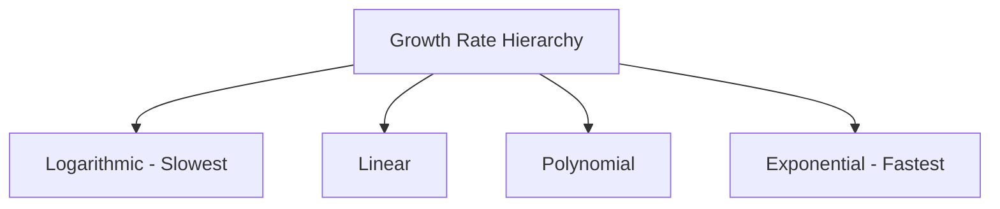

# Chapter 2: Common Function Types

## Intuition

Different function types have different "personalities" - they grow at different rates, have different shapes, and are suited for different tasks. Understanding these personalities helps you choose the right tool for each ML problem.

**Real-world analogies:**
- **Linear**: Constant rate of change (hourly wage)
- **Polynomial**: Accelerating change (compound effects)
- **Exponential**: Explosive growth (viral spread, compound interest)
- **Logarithmic**: Diminishing returns (perceived loudness)
- **Sigmoid**: S-curve transitions (technology adoption)
- **Step**: Binary decisions (pass/fail thresholds)

**Why this matters for ML:**
- Activation functions (sigmoid, ReLU, softmax) shape what networks can learn
- Loss functions (log loss, MSE) determine optimization landscapes
- Feature transformations (log, polynomial) help models capture patterns
- Output functions (softmax, sigmoid) produce interpretable predictions

## Visual Explanation

### Function Family Overview

```
        Linear          Polynomial        Exponential
        y = mx + b      y = x²           y = eˣ
           /               ∪                  /
          /               ∪                 /
         /               ∪                 .__
        /               ∪               __/

        Logarithmic     Sigmoid          Step
        y = ln(x)       σ(x)            H(x)
            ___          ___             ___
          _/           _/              |
        _/           _/                |___
       |           _/
```

### Growth Rate Comparison

$$\text{For large } x: \quad \log(x) \ll x \ll x^2 \ll e^x$$



## Mathematical Foundation

### 1. Linear Functions

$$f(x) = mx + b$$

**Properties:**
- Constant rate of change (slope $m$)
- Domain: $\mathbb{R}$, Range: $\mathbb{R}$
- One-to-one (if $m \neq 0$)

**In ML**: The foundation of everything. Neural networks without activations are just stacked linear functions.

### 2. Polynomial Functions

$$f(x) = a_n x^n + a_{n-1} x^{n-1} + \cdots + a_1 x + a_0$$

**Properties:**
- Degree $n$ determines complexity and number of turning points
- Can approximate any continuous function (Weierstrass theorem)
- Higher degrees risk overfitting

**Common cases:**
- Quadratic: $f(x) = ax^2 + bx + c$
- Cubic: $f(x) = ax^3 + bx^2 + cx + d$

### 3. Exponential Functions

$$f(x) = a \cdot b^x \quad \text{or} \quad f(x) = e^x$$

**Properties:**
- Domain: $\mathbb{R}$, Range: $(0, \infty)$
- Derivative of $e^x$ is itself: $\frac{d}{dx}e^x = e^x$
- $e^{a+b} = e^a \cdot e^b$

**In ML**: Appears in softmax, attention mechanisms, probability distributions.

### 4. Logarithmic Functions

$$f(x) = \log_b(x) \quad \text{or} \quad f(x) = \ln(x)$$

**Properties:**
- Domain: $(0, \infty)$, Range: $\mathbb{R}$
- Inverse of exponential: $\ln(e^x) = x$
- $\ln(ab) = \ln(a) + \ln(b)$ (products become sums)

**In ML**: Log loss, log probabilities, numerical stability tricks.

### 5. Sigmoid Function

$$\sigma(x) = \frac{1}{1 + e^{-x}}$$

**Properties:**
- Domain: $\mathbb{R}$, Range: $(0, 1)$
- S-shaped curve, smooth
- $\sigma(-x) = 1 - \sigma(x)$
- Derivative: $\sigma'(x) = \sigma(x)(1 - \sigma(x))$

**In ML**: Binary classification output, gates in LSTMs.

### 6. Softmax Function

$$\text{softmax}(x_i) = \frac{e^{x_i}}{\sum_{j=1}^{n} e^{x_j}}$$

**Properties:**
- Domain: $\mathbb{R}^n$, Range: Probability simplex
- Outputs sum to 1
- Differentiable version of argmax

**In ML**: Multi-class classification, attention weights.

### 7. Step Functions

$$H(x) = \begin{cases} 0 & \text{if } x < 0 \\ 1 & \text{if } x \geq 0 \end{cases}$$

**Properties:**
- Domain: $\mathbb{R}$, Range: $\{0, 1\}$
- Not differentiable at 0
- Binary decision boundary

**In ML**: Perceptron activation (historical), thresholding, quantization.

### Bonus: ReLU (Rectified Linear Unit)

$$\text{ReLU}(x) = \max(0, x)$$

**Properties:**
- Domain: $\mathbb{R}$, Range: $[0, \infty)$
- Piecewise linear
- Sparse activations (zeros for negative inputs)
- Derivative: 0 for $x < 0$, 1 for $x > 0$

**In ML**: The most popular activation function in deep learning.

## Code Example

```python
import numpy as np
import matplotlib.pyplot as plt

# =============================================================================
# LINEAR FUNCTIONS
# =============================================================================

def linear_function(x, m=2, b=1):
    """
    Linear function: f(x) = mx + b

    In ML: The basis of linear regression, neural network linear layers.
    """
    return m * x + b

def demonstrate_linear():
    """Show linear function properties."""
    x = np.linspace(-5, 5, 100)

    # Different slopes
    y1 = linear_function(x, m=1, b=0)    # Positive slope
    y2 = linear_function(x, m=-0.5, b=2) # Negative slope
    y3 = linear_function(x, m=0, b=1)    # Zero slope (constant)

    print("Linear Functions: f(x) = mx + b")
    print(f"  m=1, b=0:   f(2) = {linear_function(2, 1, 0)}")
    print(f"  m=-0.5, b=2: f(2) = {linear_function(2, -0.5, 2)}")
    print(f"  m=0, b=1:   f(2) = {linear_function(2, 0, 1)} (constant)")

    return x, [y1, y2, y3]

# =============================================================================
# POLYNOMIAL FUNCTIONS
# =============================================================================

def polynomial_function(x, coefficients):
    """
    Polynomial function: f(x) = a_n*x^n + ... + a_1*x + a_0

    coefficients: [a_0, a_1, ..., a_n] (lowest to highest degree)
    """
    result = np.zeros_like(x, dtype=float)
    for i, coef in enumerate(coefficients):
        result += coef * (x ** i)
    return result

def demonstrate_polynomial():
    """Show polynomial function properties."""
    x = np.linspace(-3, 3, 100)

    # Quadratic: x^2 - 1
    quad = polynomial_function(x, [-1, 0, 1])

    # Cubic: x^3 - x
    cubic = polynomial_function(x, [0, -1, 0, 1])

    print("\nPolynomial Functions:")
    print(f"  Quadratic x^2 - 1: f(2) = {polynomial_function(np.array([2.0]), [-1, 0, 1])[0]}")
    print(f"  Cubic x^3 - x:     f(2) = {polynomial_function(np.array([2.0]), [0, -1, 0, 1])[0]}")

    return x, quad, cubic

# =============================================================================
# EXPONENTIAL AND LOGARITHMIC
# =============================================================================

def demonstrate_exp_log():
    """Show exponential and logarithmic functions."""
    x_exp = np.linspace(-2, 3, 100)
    x_log = np.linspace(0.01, 5, 100)

    exp_x = np.exp(x_exp)
    log_x = np.log(x_log)

    print("\nExponential Function: e^x")
    print(f"  e^0 = {np.exp(0):.4f}")
    print(f"  e^1 = {np.exp(1):.4f}")
    print(f"  e^2 = {np.exp(2):.4f}")

    print("\nLogarithmic Function: ln(x)")
    print(f"  ln(1) = {np.log(1):.4f}")
    print(f"  ln(e) = {np.log(np.e):.4f}")
    print(f"  ln(10) = {np.log(10):.4f}")

    # Key relationship
    print("\nKey relationship (inverse functions):")
    print(f"  ln(e^5) = {np.log(np.exp(5)):.4f}")
    print(f"  e^(ln(5)) = {np.exp(np.log(5)):.4f}")

    return (x_exp, exp_x), (x_log, log_x)

# =============================================================================
# SIGMOID FUNCTION
# =============================================================================

def sigmoid(x):
    """
    Sigmoid function: sigma(x) = 1 / (1 + e^(-x))

    Properties:
    - Output range: (0, 1)
    - Smooth, differentiable
    - Squashes any real number to probability-like value

    In ML: Binary classification output, LSTM gates
    """
    return 1 / (1 + np.exp(-x))

def sigmoid_derivative(x):
    """Derivative of sigmoid: sigma'(x) = sigma(x) * (1 - sigma(x))"""
    s = sigmoid(x)
    return s * (1 - s)

def demonstrate_sigmoid():
    """Show sigmoid function properties."""
    x = np.linspace(-10, 10, 100)

    print("\nSigmoid Function: sigma(x) = 1 / (1 + e^(-x))")
    print(f"  sigma(-10) = {sigmoid(-10):.6f}  (approaches 0)")
    print(f"  sigma(0)   = {sigmoid(0):.6f}   (exactly 0.5)")
    print(f"  sigma(10)  = {sigmoid(10):.6f}  (approaches 1)")

    # Symmetry property
    print(f"\nSymmetry: sigma(-x) = 1 - sigma(x)")
    print(f"  sigma(-2) = {sigmoid(-2):.4f}")
    print(f"  1 - sigma(2) = {1 - sigmoid(2):.4f}")

    # Derivative
    print(f"\nDerivative at x=0: {sigmoid_derivative(0):.4f} (maximum)")

    return x, sigmoid(x), sigmoid_derivative(x)

# =============================================================================
# SOFTMAX FUNCTION
# =============================================================================

def softmax(x):
    """
    Softmax function: softmax(x_i) = e^(x_i) / sum(e^(x_j))

    Properties:
    - Outputs sum to 1 (probability distribution)
    - Differentiable version of argmax
    - Numerically stable version subtracts max

    In ML: Multi-class classification, attention mechanisms
    """
    # Numerical stability: subtract max to prevent overflow
    x_shifted = x - np.max(x, axis=-1, keepdims=True)
    exp_x = np.exp(x_shifted)
    return exp_x / np.sum(exp_x, axis=-1, keepdims=True)

def demonstrate_softmax():
    """Show softmax function properties."""
    # Single example: logits for 4-class classification
    logits = np.array([2.0, 1.0, 0.1, -1.0])
    probs = softmax(logits)

    print("\nSoftmax Function:")
    print(f"  Input logits: {logits}")
    print(f"  Output probs: {probs}")
    print(f"  Sum of probs: {probs.sum():.6f}")
    print(f"  Predicted class: {np.argmax(probs)}")

    # Temperature scaling
    print("\nTemperature Scaling (controls 'sharpness'):")
    for temp in [0.5, 1.0, 2.0, 5.0]:
        scaled_probs = softmax(logits / temp)
        print(f"  T={temp}: {scaled_probs} (max={scaled_probs.max():.3f})")

    # Batch processing
    batch_logits = np.array([
        [2.0, 1.0, 0.1],
        [0.5, 0.5, 3.0],
        [1.0, 1.0, 1.0]
    ])
    batch_probs = softmax(batch_logits)

    print("\nBatch Softmax:")
    for i, (log, prob) in enumerate(zip(batch_logits, batch_probs)):
        print(f"  Sample {i}: {log} -> {prob}")

    return logits, probs

# =============================================================================
# STEP FUNCTION AND RELU
# =============================================================================

def step_function(x):
    """Heaviside step function: H(x) = 0 if x < 0, else 1"""
    return np.where(x < 0, 0, 1)

def relu(x):
    """
    ReLU (Rectified Linear Unit): max(0, x)

    Properties:
    - Simple and fast to compute
    - Sparse activations (zeros for x < 0)
    - No vanishing gradient for x > 0
    - "Dying ReLU" problem for x < 0

    In ML: Most popular activation function in deep learning
    """
    return np.maximum(0, x)

def leaky_relu(x, alpha=0.01):
    """Leaky ReLU: x if x > 0, else alpha * x"""
    return np.where(x > 0, x, alpha * x)

def demonstrate_step_and_relu():
    """Show step function and ReLU."""
    x = np.linspace(-5, 5, 1000)

    print("\nStep Function: H(x)")
    print(f"  H(-2) = {step_function(-2)}")
    print(f"  H(0)  = {step_function(0)}")
    print(f"  H(2)  = {step_function(2)}")

    print("\nReLU: max(0, x)")
    print(f"  ReLU(-2) = {relu(-2)}")
    print(f"  ReLU(0)  = {relu(0)}")
    print(f"  ReLU(2)  = {relu(2)}")

    print("\nLeaky ReLU (alpha=0.01): x if x > 0 else 0.01*x")
    print(f"  LeakyReLU(-2) = {leaky_relu(-2)}")
    print(f"  LeakyReLU(0)  = {leaky_relu(0)}")
    print(f"  LeakyReLU(2)  = {leaky_relu(2)}")

    return x, step_function(x), relu(x), leaky_relu(x)

# =============================================================================
# COMPLETE COMPARISON
# =============================================================================

def activation_comparison():
    """Compare common activation functions used in neural networks."""
    x = np.linspace(-5, 5, 100)

    activations = {
        'Sigmoid': sigmoid(x),
        'Tanh': np.tanh(x),
        'ReLU': relu(x),
        'Leaky ReLU': leaky_relu(x, 0.1),
        'Step': step_function(x).astype(float)
    }

    print("\n" + "=" * 60)
    print("ACTIVATION FUNCTION COMPARISON")
    print("=" * 60)

    for name, values in activations.items():
        print(f"\n{name}:")
        print(f"  Range: [{values.min():.2f}, {values.max():.2f}]")
        print(f"  f(-2) = {activations[name][20]:.4f}")  # Approximate x=-2
        print(f"  f(0)  = {activations[name][50]:.4f}")  # x=0
        print(f"  f(2)  = {activations[name][80]:.4f}")  # Approximate x=2

    return x, activations

# Run all demonstrations
if __name__ == "__main__":
    print("=" * 60)
    print("COMMON FUNCTION TYPES IN MACHINE LEARNING")
    print("=" * 60)

    demonstrate_linear()
    demonstrate_polynomial()
    demonstrate_exp_log()
    demonstrate_sigmoid()
    demonstrate_softmax()
    demonstrate_step_and_relu()
    activation_comparison()
```

## ML Relevance

### Activation Functions Comparison

| Function | Range | Use Case | Pros | Cons |
|----------|-------|----------|------|------|
| Sigmoid | (0, 1) | Binary output, gates | Bounded, probabilistic | Vanishing gradients |
| Tanh | (-1, 1) | Hidden layers | Zero-centered | Vanishing gradients |
| ReLU | [0, inf) | Hidden layers | Fast, no vanishing gradient | Dying neurons |
| Softmax | (0, 1)^n, sum=1 | Multi-class output | Probability distribution | Expensive for large vocab |
| Step | {0, 1} | Hard decisions | Simple | Not differentiable |

### Where Each Function Type Appears

| Function Type | ML Application |
|---------------|----------------|
| **Linear** | Linear regression, neural network layers (before activation) |
| **Polynomial** | Polynomial regression, feature engineering |
| **Exponential** | Softmax, attention, probability distributions |
| **Logarithmic** | Cross-entropy loss, log probabilities, numerical stability |
| **Sigmoid** | Binary classification, LSTM/GRU gates |
| **Softmax** | Multi-class classification, transformer attention |
| **ReLU** | Hidden layer activation (most common) |

## When to Use / Ignore

### Choosing Activation Functions

| Scenario | Recommended Function |
|----------|---------------------|
| Hidden layers (default) | ReLU or variants |
| Binary classification output | Sigmoid |
| Multi-class classification | Softmax |
| Recurrent network gates | Sigmoid, Tanh |
| Output between -1 and 1 | Tanh |
| Avoiding vanishing gradients | ReLU, Leaky ReLU |

### Common Pitfalls

1. **Sigmoid in hidden layers**: Causes vanishing gradients in deep networks
2. **Softmax for binary**: Use sigmoid instead (simpler, equivalent)
3. **Forgetting numerical stability**: Always use the stable softmax implementation
4. **ReLU with large learning rates**: Can cause "dying ReLU" problem

## Exercises

### Exercise 1: Sigmoid vs Softmax
**Problem**: For a binary classification problem, show that sigmoid and 2-class softmax give the same result.

**Solution**:
For softmax with 2 classes and logits $[z_1, z_2]$:
$$P(\text{class 1}) = \frac{e^{z_1}}{e^{z_1} + e^{z_2}} = \frac{1}{1 + e^{z_2 - z_1}}$$

Let $z = z_1 - z_2$:
$$P(\text{class 1}) = \frac{1}{1 + e^{-z}} = \sigma(z)$$

This is exactly the sigmoid function applied to the difference of logits.

### Exercise 2: Temperature Scaling
**Problem**: Implement temperature-scaled softmax and explain what happens as temperature approaches 0 and infinity.

**Solution**:
```python
def temperature_softmax(logits, temperature):
    return softmax(logits / temperature)

# As T -> 0: Approaches argmax (one-hot)
# As T -> inf: Approaches uniform distribution
```
- Low temperature: More confident, sharper distribution
- High temperature: Less confident, more uniform

### Exercise 3: Numerical Stability
**Problem**: Why does `softmax([1000, 1001, 1002])` cause problems? How do you fix it?

**Solution**:
Direct computation: $e^{1000}$ overflows to infinity.

Fix: Subtract the maximum before exponentiating:
```python
def stable_softmax(x):
    x_shifted = x - np.max(x)  # Now [-2, -1, 0]
    exp_x = np.exp(x_shifted)   # Safe: [e^-2, e^-1, e^0]
    return exp_x / np.sum(exp_x)
```
This works because $\text{softmax}(x) = \text{softmax}(x - c)$ for any constant $c$.

## Summary

- **Linear functions** ($mx + b$): Foundation of ML, but limited expressiveness alone
- **Polynomial functions**: More expressive, risk overfitting with high degrees
- **Exponential functions** ($e^x$): Rapid growth, central to softmax and probabilities
- **Logarithmic functions**: Inverse of exponential, crucial for loss functions and stability
- **Sigmoid**: Squashes to $(0, 1)$, used for binary outputs and gates
- **Softmax**: Converts logits to probability distribution, used for multi-class
- **ReLU**: Simple, effective hidden layer activation; default choice in modern networks
- **Step functions**: Hard decisions, not differentiable; mostly historical
- Choose activation functions based on your layer's role (hidden vs output) and task requirements

---

**Next**: [Chapter 3 - Multivariable Functions](03-multivariable-functions.md)
