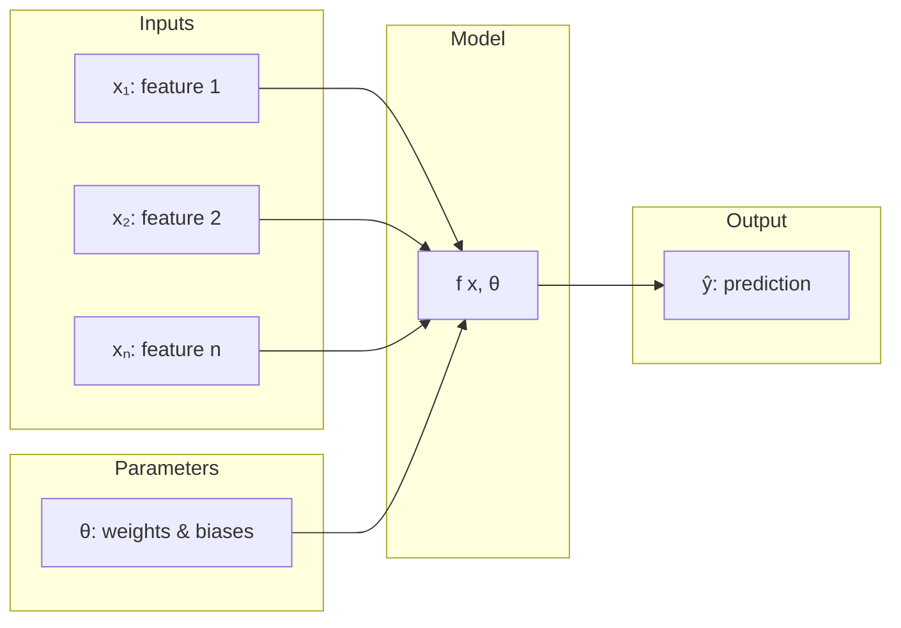

# Chapter 3: Multivariable Functions

## Intuition

Real-world problems rarely depend on just one variable. A house price depends on square footage, bedrooms, location, and age. An image classification depends on thousands of pixel values. Machine learning models must handle functions of many inputs simultaneously.

**Real-world analogies:**
- **Restaurant bill**: Depends on number of items, prices, tax rate, tip percentage
- **Weather**: Temperature depends on latitude, longitude, altitude, time of day, season
- **Health risk**: Depends on age, blood pressure, cholesterol, BMI, smoking status

**Why this matters for ML:**
- Every ML model takes multiple features as input
- Neural networks are functions with millions of parameters
- Understanding $f(x, \theta)$ notation separates "data" from "learnable weights"
- Partial derivatives (gradients) require understanding multivariable functions

## Visual Explanation

### Single Variable vs Multivariable

```
Single Variable:               Multivariable:
f: R → R                      f: R^n → R^m

    y                              z
    |     /                        |    ___
    |   /                          |  /    \
    | /                            |/      |\
    +-------→ x                    +-------→ y
                                  /
                                x
```

### The ML Function Signature



### Parameterized Function Visualization

$$y = f(x, \theta)$$

```
Fixed θ (trained model):     Varying θ (during training):
Different x → Different y    Fixed x → Different y

    y                            y
    |   • • •                    |     • (θ₁)
    |  •     •                   |   • (θ₂)
    | •       •                  | • (θ₃)
    +----------→ x               +----------→ θ
```

## Mathematical Foundation

### Functions of Many Inputs

**Definition**: A function $f: \mathbb{R}^n \rightarrow \mathbb{R}^m$ maps an $n$-dimensional input to an $m$-dimensional output.

**Notation**:
$$f(x_1, x_2, \ldots, x_n) \quad \text{or} \quad f(\mathbf{x}) \text{ where } \mathbf{x} \in \mathbb{R}^n$$

**Examples**:

1. **Linear regression** (many inputs, one output):
$$f(x_1, x_2, \ldots, x_n) = w_1 x_1 + w_2 x_2 + \cdots + w_n x_n + b$$

2. **Multi-output classifier** (many inputs, many outputs):
$$f: \mathbb{R}^{784} \rightarrow \mathbb{R}^{10} \quad \text{(MNIST: 784 pixels → 10 digit probabilities)}$$

3. **Vector form**:
$$f(\mathbf{x}) = \mathbf{W}\mathbf{x} + \mathbf{b}$$

### Parameterized Functions

**Key insight**: In ML, we separate inputs into two categories:

1. **Data inputs** ($\mathbf{x}$): The features we want to make predictions about
2. **Parameters** ($\theta$): The values we learn during training

**Notation**:
$$\hat{y} = f(\mathbf{x}; \theta) \quad \text{or} \quad \hat{y} = f_\theta(\mathbf{x})$$

The semicolon or subscript indicates that $\theta$ are parameters (fixed during inference), not data inputs.

### The $y = f(x, \theta)$ Notation

This is the fundamental equation of supervised learning:

$$\hat{y} = f(\mathbf{x}, \theta)$$

Where:
- $\mathbf{x} \in \mathbb{R}^n$: Input features
- $\theta \in \mathbb{R}^p$: Model parameters (weights, biases)
- $\hat{y} \in \mathbb{R}^m$: Predicted output
- $f$: The model architecture (how inputs and parameters combine)

**During training**: We fix $\mathbf{x}$ (training data) and adjust $\theta$
**During inference**: We fix $\theta$ (trained weights) and vary $\mathbf{x}$

### Common Parameterized Functions in ML

**Linear Model**:
$$f(\mathbf{x}, \theta) = \mathbf{W}\mathbf{x} + \mathbf{b}, \quad \theta = \{\mathbf{W}, \mathbf{b}\}$$

**Neural Network Layer**:
$$f(\mathbf{x}, \theta) = \sigma(\mathbf{W}\mathbf{x} + \mathbf{b}), \quad \theta = \{\mathbf{W}, \mathbf{b}\}$$

**Deep Neural Network**:
$$f(\mathbf{x}, \theta) = f_L \circ f_{L-1} \circ \cdots \circ f_1(\mathbf{x})$$
$$\theta = \{\mathbf{W}_1, \mathbf{b}_1, \mathbf{W}_2, \mathbf{b}_2, \ldots, \mathbf{W}_L, \mathbf{b}_L\}$$

### Surfaces and Level Sets

For $f: \mathbb{R}^2 \rightarrow \mathbb{R}$, we can visualize the function as a surface:

$$z = f(x, y)$$

**Level sets** (contour lines) show where the function has constant value:

$$\{(x, y) : f(x, y) = c\}$$

These are crucial for understanding:
- Loss landscapes in optimization
- Decision boundaries in classification
- Gradient directions

## Code Example

```python
import numpy as np

# =============================================================================
# FUNCTIONS OF MANY INPUTS
# =============================================================================

def linear_multivariable(x, weights, bias):
    """
    Linear function with multiple inputs.

    f(x) = w₁x₁ + w₂x₂ + ... + wₙxₙ + b = w·x + b

    This is the foundation of linear regression and neural network layers.
    """
    return np.dot(weights, x) + bias

def demonstrate_multivariable():
    """Show functions of many inputs."""
    # House price prediction example
    # Features: [square_feet, bedrooms, bathrooms, age_years]
    x = np.array([1500, 3, 2, 10])

    # Learned weights
    weights = np.array([100, 20000, 15000, -1000])  # Price contribution per unit
    bias = 50000  # Base price

    price = linear_multivariable(x, weights, bias)

    print("=" * 60)
    print("MULTIVARIABLE FUNCTION: House Price Prediction")
    print("=" * 60)
    print(f"Features: square_feet={x[0]}, bedrooms={x[1]}, "
          f"bathrooms={x[2]}, age={x[3]}")
    print(f"Weights: {weights}")
    print(f"Bias: {bias}")
    print(f"\nPrediction: ${price:,.2f}")
    print(f"\nBreakdown:")
    print(f"  Base price:        ${bias:>12,.2f}")
    print(f"  + Square feet:     ${weights[0] * x[0]:>12,.2f}")
    print(f"  + Bedrooms:        ${weights[1] * x[1]:>12,.2f}")
    print(f"  + Bathrooms:       ${weights[2] * x[2]:>12,.2f}")
    print(f"  + Age adjustment:  ${weights[3] * x[3]:>12,.2f}")
    print(f"  = Total:           ${price:>12,.2f}")

# =============================================================================
# PARAMETERIZED FUNCTIONS: y = f(x, θ)
# =============================================================================

class LinearModel:
    """
    Parameterized linear function: f(x, θ) = Wx + b

    This demonstrates the separation of data (x) and parameters (θ).
    """

    def __init__(self, input_dim, output_dim):
        """Initialize parameters θ = {W, b}."""
        # Random initialization
        self.W = np.random.randn(output_dim, input_dim) * 0.1
        self.b = np.zeros(output_dim)

    @property
    def parameters(self):
        """Return all parameters as a dictionary."""
        return {'W': self.W, 'b': self.b}

    @property
    def num_parameters(self):
        """Count total number of parameters."""
        return self.W.size + self.b.size

    def forward(self, x):
        """Compute f(x, θ) = Wx + b."""
        return np.dot(self.W, x) + self.b

    def __call__(self, x):
        return self.forward(x)


class NeuralNetwork:
    """
    Multi-layer parameterized function (neural network).

    f(x, θ) = f_L(f_{L-1}(...f_1(x)))

    Each layer has its own parameters, and θ is the collection of all.
    """

    def __init__(self, layer_dims):
        """
        Initialize network with given layer dimensions.

        layer_dims: [input_dim, hidden1_dim, hidden2_dim, ..., output_dim]
        """
        self.layers = []
        self.layer_dims = layer_dims

        for i in range(len(layer_dims) - 1):
            layer = {
                'W': np.random.randn(layer_dims[i+1], layer_dims[i]) * 0.1,
                'b': np.zeros(layer_dims[i+1])
            }
            self.layers.append(layer)

    @property
    def parameters(self):
        """Return all parameters."""
        return self.layers

    @property
    def num_parameters(self):
        """Count total parameters."""
        count = 0
        for layer in self.layers:
            count += layer['W'].size + layer['b'].size
        return count

    def forward(self, x):
        """Forward pass through all layers."""
        activation = x

        # All layers except last: linear + ReLU
        for i, layer in enumerate(self.layers[:-1]):
            z = np.dot(layer['W'], activation) + layer['b']
            activation = np.maximum(0, z)  # ReLU

        # Last layer: linear only (for regression) or apply softmax (for classification)
        last_layer = self.layers[-1]
        output = np.dot(last_layer['W'], activation) + last_layer['b']

        return output

    def __call__(self, x):
        return self.forward(x)


def demonstrate_parameterized_functions():
    """Show the y = f(x, θ) paradigm."""
    print("\n" + "=" * 60)
    print("PARAMETERIZED FUNCTIONS: y = f(x, θ)")
    print("=" * 60)

    # Simple linear model
    print("\n--- Linear Model ---")
    model = LinearModel(input_dim=4, output_dim=2)

    x = np.array([1.0, 2.0, 3.0, 4.0])
    y = model(x)

    print(f"Input x shape: {x.shape}")
    print(f"Output y shape: {y.shape}")
    print(f"Number of parameters: {model.num_parameters}")
    print(f"  W shape: {model.parameters['W'].shape} = {model.parameters['W'].size} params")
    print(f"  b shape: {model.parameters['b'].shape} = {model.parameters['b'].size} params")

    # Neural network
    print("\n--- Neural Network ---")
    # Architecture: 784 -> 256 -> 128 -> 10 (like MNIST classifier)
    nn = NeuralNetwork([784, 256, 128, 10])

    x_image = np.random.randn(784)  # Flattened 28x28 image
    y_logits = nn(x_image)

    print(f"Architecture: {nn.layer_dims}")
    print(f"Input x shape: {x_image.shape}")
    print(f"Output y shape: {y_logits.shape}")
    print(f"Total parameters: {nn.num_parameters:,}")

    print("\nParameter breakdown:")
    for i, layer in enumerate(nn.layers):
        w_params = layer['W'].size
        b_params = layer['b'].size
        print(f"  Layer {i+1}: W{layer['W'].shape} + b{layer['b'].shape} = {w_params + b_params:,} params")

# =============================================================================
# TRAINING VS INFERENCE PERSPECTIVE
# =============================================================================

def demonstrate_training_vs_inference():
    """
    Show how the same function is used differently:
    - Training: vary θ while x is fixed (from training data)
    - Inference: vary x while θ is fixed (from trained model)
    """
    print("\n" + "=" * 60)
    print("TRAINING vs INFERENCE")
    print("=" * 60)

    # Create a simple model
    np.random.seed(42)
    model = LinearModel(input_dim=3, output_dim=1)

    # Training data (fixed during training)
    X_train = np.array([
        [1.0, 2.0, 3.0],
        [4.0, 5.0, 6.0],
        [7.0, 8.0, 9.0]
    ])

    y_true = np.array([14.0, 32.0, 50.0])  # True outputs

    print("\n--- Training Phase ---")
    print("Fix X (training data), adjust θ (parameters)")

    # Simulate training: different θ values
    for iteration in range(3):
        # Randomly perturb weights (simulating gradient update)
        model.W = np.random.randn(1, 3)
        model.b = np.random.randn(1)

        predictions = np.array([model(x)[0] for x in X_train])
        mse = np.mean((predictions - y_true) ** 2)

        print(f"\nIteration {iteration + 1}:")
        print(f"  θ (weights): {model.W.flatten()}")
        print(f"  θ (bias): {model.b}")
        print(f"  Predictions: {predictions}")
        print(f"  MSE Loss: {mse:.2f}")

    # Set "trained" weights
    model.W = np.array([[2.0, 2.0, 2.0]])
    model.b = np.array([0.0])

    print("\n--- Inference Phase ---")
    print("Fix θ (trained parameters), vary x (new data)")
    print(f"Trained θ: W={model.W.flatten()}, b={model.b}")

    X_test = np.array([
        [0.0, 0.0, 0.0],
        [1.0, 1.0, 1.0],
        [2.0, 3.0, 4.0]
    ])

    for x in X_test:
        y_pred = model(x)[0]
        print(f"  f({x}, θ) = {y_pred:.2f}")

# =============================================================================
# BATCH PROCESSING
# =============================================================================

def batch_linear(X, W, b):
    """
    Process multiple inputs at once: Y = XW^T + b

    X: (batch_size, input_dim)
    W: (output_dim, input_dim)
    b: (output_dim,)
    Y: (batch_size, output_dim)

    This is how neural networks efficiently process many examples.
    """
    return np.dot(X, W.T) + b


def demonstrate_batch_processing():
    """Show efficient batch computation."""
    print("\n" + "=" * 60)
    print("BATCH PROCESSING")
    print("=" * 60)

    # Parameters
    W = np.array([
        [1.0, 2.0, 3.0],
        [4.0, 5.0, 6.0]
    ])  # 2 outputs, 3 inputs
    b = np.array([0.5, -0.5])

    # Batch of inputs
    X = np.array([
        [1.0, 0.0, 0.0],
        [0.0, 1.0, 0.0],
        [0.0, 0.0, 1.0],
        [1.0, 1.0, 1.0]
    ])  # 4 samples, 3 features each

    # Batch computation
    Y = batch_linear(X, W, b)

    print(f"Input batch X shape: {X.shape}")
    print(f"Weight matrix W shape: {W.shape}")
    print(f"Output batch Y shape: {Y.shape}")

    print("\nInput -> Output mapping:")
    for i in range(len(X)):
        print(f"  x={X[i]} -> y={Y[i]}")

    # Verify: same as processing one at a time
    print("\nVerification (one at a time):")
    for i in range(len(X)):
        y_single = np.dot(W, X[i]) + b
        print(f"  f(x[{i}]) = {y_single}")

# =============================================================================
# VISUALIZING MULTIVARIABLE FUNCTIONS
# =============================================================================

def demonstrate_2d_function():
    """
    Visualize a function of two variables.

    f(x, y) = x^2 + y^2 (paraboloid - like loss landscape)
    """
    print("\n" + "=" * 60)
    print("2D FUNCTION VISUALIZATION")
    print("=" * 60)

    # Create grid
    x = np.linspace(-2, 2, 5)
    y = np.linspace(-2, 2, 5)

    # Loss function (like MSE)
    def loss(x, y):
        return x**2 + y**2

    print("f(x, y) = x^2 + y^2 (loss surface)")
    print("\nFunction values (minimum at origin):")
    print("       y=-2    y=-1    y=0     y=1     y=2")

    for xi in x:
        row = [f"{loss(xi, yi):6.2f}" for yi in y]
        print(f"x={xi:4.1f}  " + "  ".join(row))

    print(f"\nMinimum at (0, 0): f(0, 0) = {loss(0, 0)}")
    print("This is what gradient descent tries to find!")


# Run all demonstrations
if __name__ == "__main__":
    demonstrate_multivariable()
    demonstrate_parameterized_functions()
    demonstrate_training_vs_inference()
    demonstrate_batch_processing()
    demonstrate_2d_function()
```

## ML Relevance

### The Universal ML Equation

Every supervised learning problem follows this pattern:

$$\text{Find } \theta^* = \arg\min_\theta \mathcal{L}(f(\mathbf{X}, \theta), \mathbf{y})$$

Where:
- $f(\mathbf{X}, \theta)$: Model predictions
- $\mathbf{y}$: True labels
- $\mathcal{L}$: Loss function
- $\theta^*$: Optimal parameters

### Parameter Counts in Modern Models

| Model | Parameters |
|-------|------------|
| Linear Regression (100 features) | 101 |
| Small CNN (MNIST) | ~100K |
| ResNet-50 | ~25M |
| BERT-base | ~110M |
| GPT-3 | 175B |
| GPT-4 | ~1.7T (estimated) |

### Where Multivariable Functions Appear

1. **Feature vectors**: Every ML input is typically a vector $\mathbf{x} \in \mathbb{R}^n$
2. **Weight matrices**: Every layer has $\mathbf{W} \in \mathbb{R}^{m \times n}$
3. **Loss landscapes**: Loss is a function of all parameters $\mathcal{L}(\theta)$
4. **Gradients**: Partial derivatives $\frac{\partial \mathcal{L}}{\partial \theta_i}$ for each parameter

## When to Use / Ignore

### Pay Attention When:
- Designing network architectures (dimension matching)
- Understanding parameter efficiency (how many params do you need?)
- Debugging shape mismatches (most common beginner error)
- Reasoning about model capacity (more params = more expressive)

### Common Pitfalls:
- **Dimension mismatch**: Matrix multiplication requires compatible dimensions
- **Forgetting bias**: The "+b" term is often crucial
- **Confusing x and θ**: Data flows forward, gradients flow to parameters
- **Ignoring batch dimension**: Real code processes batches, not single examples

## Exercises

### Exercise 1: Parameter Counting
**Problem**: A neural network has architecture [100, 64, 32, 10] (input to output). How many total parameters does it have?

**Solution**:
- Layer 1: $100 \times 64 + 64 = 6,464$ (W + b)
- Layer 2: $64 \times 32 + 32 = 2,080$
- Layer 3: $32 \times 10 + 10 = 330$
- **Total: 8,874 parameters**

### Exercise 2: Batch Dimensions
**Problem**: You have a batch of 32 images, each 28x28 pixels. After flattening, what are the dimensions of $\mathbf{X}$? If the first layer has 128 neurons, what are the dimensions of $\mathbf{W}$ and the output?

**Solution**:
- $\mathbf{X}$: $(32, 784)$ - 32 samples, 784 features each
- $\mathbf{W}$: $(128, 784)$ - 128 outputs, 784 inputs
- Output $\mathbf{Y} = \mathbf{X}\mathbf{W}^T + \mathbf{b}$: $(32, 128)$

### Exercise 3: The Training Objective
**Problem**: Write out the full optimization objective for training a neural network $f(\mathbf{x}, \theta)$ on a classification task with cross-entropy loss.

**Solution**:
$$\theta^* = \arg\min_\theta \frac{1}{N} \sum_{i=1}^{N} \mathcal{L}_{CE}(f(\mathbf{x}_i, \theta), y_i)$$

Where:
$$\mathcal{L}_{CE}(\hat{y}, y) = -\sum_{c=1}^{C} y_c \log(\hat{y}_c)$$

And $\hat{y} = \text{softmax}(f(\mathbf{x}, \theta))$

## Summary

- **Multivariable functions** map multiple inputs to outputs: $f: \mathbb{R}^n \rightarrow \mathbb{R}^m$
- **In ML, we separate data ($\mathbf{x}$) from parameters ($\theta$)**: $\hat{y} = f(\mathbf{x}, \theta)$
- **Training** adjusts $\theta$ while $\mathbf{x}$ comes from training data
- **Inference** uses fixed $\theta$ on new $\mathbf{x}$
- **Neural networks are compositions** of parameterized functions
- **Parameter count** affects model capacity and computational cost
- **Batch processing** efficiently handles multiple inputs via matrix operations
- **Understanding dimensions** is crucial for implementing and debugging models

---

**Congratulations!** You have completed Level 3: Functions. You now understand that machine learning models are parameterized functions, and training means finding the right parameters. This foundation will serve you throughout your ML journey.

**Next Level**: [Level 4 - Calculus I](../04-level-4-calculus-i/README.md)
