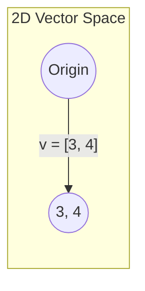

# Chapter 1: Vectors

## Intuition

A **vector** is simply an ordered list of numbers. Think of it as a container that holds multiple values in a specific order. While this sounds simple, vectors are the fundamental building blocks of machine learning - every piece of data you work with is ultimately represented as a vector.

**Real-world analogies:**
- **GPS coordinates**: Your location (latitude, longitude) is a 2D vector
- **RGB color**: A color like (255, 128, 0) is a 3D vector representing red, green, blue values
- **House features**: (2000 sqft, 3 bedrooms, 2 bathrooms, 15 years old) is a 4D vector
- **Word embeddings**: Words in NLP are represented as 300+ dimensional vectors

**Why this matters for ML:**
Every data point in machine learning is a vector. An image is a vector of pixel values. A user profile is a vector of features. Understanding vectors means understanding how ML "sees" data.

## Visual Explanation

### Scalar vs Vector

```
Scalar: A single number
         5

Vector: An ordered list of numbers
         [3, 4]  or  [1, 2, 3, 4, 5]
```

A 2D vector can be visualized as an arrow from the origin:



The vector $\mathbf{v} = [3, 4]$ points from $(0, 0)$ to $(3, 4)$.

### Vector Operations Visualized

**Vector Addition** (tip-to-tail method):
$$\mathbf{a} + \mathbf{b} = [a_1 + b_1, a_2 + b_2]$$

**Scalar Multiplication** (stretching/shrinking):
$$c \cdot \mathbf{v} = [c \cdot v_1, c \cdot v_2]$$

## Mathematical Foundation

### Scalars vs Vectors

A **scalar** is a single number: $x = 5$

A **vector** is an ordered collection of $n$ scalars:
$$\mathbf{v} = \begin{bmatrix} v_1 \\ v_2 \\ \vdots \\ v_n \end{bmatrix} \in \mathbb{R}^n$$

We denote vectors with bold lowercase letters ($\mathbf{v}$) and their dimension as $\mathbb{R}^n$ where $n$ is the number of elements.

### Vector Addition

Two vectors of the same dimension can be added element-wise:

$$\mathbf{a} + \mathbf{b} = \begin{bmatrix} a_1 \\ a_2 \\ \vdots \\ a_n \end{bmatrix} + \begin{bmatrix} b_1 \\ b_2 \\ \vdots \\ b_n \end{bmatrix} = \begin{bmatrix} a_1 + b_1 \\ a_2 + b_2 \\ \vdots \\ a_n + b_n \end{bmatrix}$$

**Properties:**
- Commutative: $\mathbf{a} + \mathbf{b} = \mathbf{b} + \mathbf{a}$
- Associative: $(\mathbf{a} + \mathbf{b}) + \mathbf{c} = \mathbf{a} + (\mathbf{b} + \mathbf{c})$
- Identity: $\mathbf{a} + \mathbf{0} = \mathbf{a}$

### Scalar Multiplication

Multiplying a vector by a scalar scales each component:

$$c \cdot \mathbf{v} = c \cdot \begin{bmatrix} v_1 \\ v_2 \\ \vdots \\ v_n \end{bmatrix} = \begin{bmatrix} c \cdot v_1 \\ c \cdot v_2 \\ \vdots \\ c \cdot v_n \end{bmatrix}$$

- $c > 1$: stretches the vector
- $0 < c < 1$: shrinks the vector
- $c < 0$: reverses direction and scales

### Dot Product (Inner Product)

The dot product of two vectors produces a scalar:

$$\mathbf{a} \cdot \mathbf{b} = \sum_{i=1}^{n} a_i b_i = a_1 b_1 + a_2 b_2 + \cdots + a_n b_n$$

**Geometric interpretation:**
$$\mathbf{a} \cdot \mathbf{b} = \|\mathbf{a}\| \|\mathbf{b}\| \cos(\theta)$$

where $\theta$ is the angle between the vectors.

**Key insights:**
- If $\mathbf{a} \cdot \mathbf{b} = 0$: vectors are perpendicular (orthogonal)
- If $\mathbf{a} \cdot \mathbf{b} > 0$: vectors point in similar directions
- If $\mathbf{a} \cdot \mathbf{b} < 0$: vectors point in opposite directions

### Vector Norms

A **norm** measures the "size" or "length" of a vector.

**L1 Norm (Manhattan distance):**
$$\|\mathbf{v}\|_1 = \sum_{i=1}^{n} |v_i| = |v_1| + |v_2| + \cdots + |v_n|$$

Think of walking along city blocks - you can only move horizontally or vertically.

**L2 Norm (Euclidean distance):**
$$\|\mathbf{v}\|_2 = \sqrt{\sum_{i=1}^{n} v_i^2} = \sqrt{v_1^2 + v_2^2 + \cdots + v_n^2}$$

This is the "straight-line" distance - what you'd measure with a ruler.

**General Lp Norm:**
$$\|\mathbf{v}\|_p = \left(\sum_{i=1}^{n} |v_i|^p\right)^{1/p}$$

### Unit Vectors

A **unit vector** has a norm of 1. Any vector can be normalized to a unit vector:

$$\hat{\mathbf{v}} = \frac{\mathbf{v}}{\|\mathbf{v}\|}$$

Unit vectors preserve direction but standardize magnitude.

## Code Example

```python
import numpy as np

# Creating vectors
v1 = np.array([3, 4])
v2 = np.array([1, 2])
scalar = 2.5

print("=== Vector Basics ===")
print(f"v1 = {v1}")
print(f"v2 = {v2}")
print(f"Dimension of v1: {v1.shape[0]}")

# Vector addition
print("\n=== Vector Addition ===")
v_sum = v1 + v2
print(f"v1 + v2 = {v_sum}")

# Scalar multiplication
print("\n=== Scalar Multiplication ===")
v_scaled = scalar * v1
print(f"{scalar} * v1 = {v_scaled}")

# Dot product
print("\n=== Dot Product ===")
dot_product = np.dot(v1, v2)  # or v1 @ v2
print(f"v1 · v2 = {dot_product}")

# Alternative: element-wise then sum
dot_manual = np.sum(v1 * v2)
print(f"Manual calculation: {dot_manual}")

# Norms
print("\n=== Vector Norms ===")
v = np.array([3, 4])

l1_norm = np.linalg.norm(v, ord=1)  # |3| + |4| = 7
l2_norm = np.linalg.norm(v, ord=2)  # sqrt(9 + 16) = 5
l2_norm_default = np.linalg.norm(v) # L2 is default

print(f"v = {v}")
print(f"L1 norm: {l1_norm}")
print(f"L2 norm: {l2_norm}")

# Unit vector
print("\n=== Unit Vector ===")
unit_v = v / np.linalg.norm(v)
print(f"Unit vector of v: {unit_v}")
print(f"Norm of unit vector: {np.linalg.norm(unit_v):.6f}")

# Practical example: Feature vector for ML
print("\n=== ML Example: Feature Vectors ===")
# Two houses with features: [sqft, bedrooms, bathrooms, age]
house1 = np.array([2000, 3, 2, 10])
house2 = np.array([1500, 2, 1, 25])

# Similarity via dot product (unnormalized)
similarity = np.dot(house1, house2)
print(f"House 1 features: {house1}")
print(f"House 2 features: {house2}")
print(f"Dot product similarity: {similarity}")

# Normalized similarity (cosine similarity preview)
cos_sim = np.dot(house1, house2) / (np.linalg.norm(house1) * np.linalg.norm(house2))
print(f"Cosine similarity: {cos_sim:.4f}")
```

**Output:**
```
=== Vector Basics ===
v1 = [3 4]
v2 = [1 2]
Dimension of v1: 2

=== Vector Addition ===
v1 + v2 = [4 6]

=== Scalar Multiplication ===
2.5 * v1 = [7.5 10. ]

=== Dot Product ===
v1 · v2 = 11
Manual calculation: 11

=== Vector Norms ===
v = [3 4]
L1 norm: 7.0
L2 norm: 5.0

=== Unit Vector ===
Unit vector of v: [0.6 0.8]
Norm of unit vector: 1.000000

=== ML Example: Feature Vectors ===
House 1 features: [2000    3    2   10]
House 2 features: [1500    2    1   25]
Dot product similarity: 3000256
Cosine similarity: 0.9999
```

## ML Relevance

### Where Vectors Appear in ML

| Application | Vector Representation |
|-------------|----------------------|
| Tabular data | Each row is a feature vector |
| Images | Flattened pixel values (28x28 image = 784D vector) |
| NLP | Word embeddings (Word2Vec, GloVe: 50-300D) |
| Recommenders | User/item embeddings |
| Time series | Sequence of values as a vector |

### Specific Algorithms Using Vectors

1. **k-Nearest Neighbors**: Finds k closest vectors using distance (norm)
2. **Support Vector Machines**: Operates in high-dimensional vector space
3. **Neural Networks**: Each layer transforms vectors via weights
4. **Word2Vec**: Learns vector representations of words where $\text{king} - \text{man} + \text{woman} \approx \text{queen}$

### Norms in Regularization

- **L1 regularization** (Lasso): Encourages sparse weights (many zeros)
- **L2 regularization** (Ridge): Encourages small weights (prevents overfitting)

$$\text{Loss} = \text{MSE} + \lambda \|\mathbf{w}\|_1 \quad \text{(L1)}$$
$$\text{Loss} = \text{MSE} + \lambda \|\mathbf{w}\|_2^2 \quad \text{(L2)}$$

## When to Use / Ignore

### When to Pay Attention to Vectors

- **Data preprocessing**: Understand how your data is structured
- **Feature engineering**: Combining features = vector operations
- **Similarity calculations**: Dot products power many algorithms
- **Debugging ML models**: Inspect weight vectors, embeddings

### Common Pitfalls

1. **Dimension mismatch**: Vectors must have same dimension for addition/dot product
2. **Scale issues**: Features with different scales dominate norms (normalize first!)
3. **Sparse vs dense**: High-dimensional sparse vectors need special handling
4. **Confusing row/column vectors**: NumPy 1D arrays are neither - be explicit when needed

## Exercises

### Exercise 1: Basic Operations
Given $\mathbf{a} = [1, 2, 3]$ and $\mathbf{b} = [4, 5, 6]$, compute:
- $\mathbf{a} + \mathbf{b}$
- $3\mathbf{a}$
- $\mathbf{a} \cdot \mathbf{b}$

**Solution:**
```python
a = np.array([1, 2, 3])
b = np.array([4, 5, 6])

print(f"a + b = {a + b}")           # [5, 7, 9]
print(f"3a = {3 * a}")              # [3, 6, 9]
print(f"a · b = {np.dot(a, b)}")    # 1*4 + 2*5 + 3*6 = 32
```

### Exercise 2: Norms
For the vector $\mathbf{v} = [3, -4, 0]$, compute the L1 and L2 norms.

**Solution:**
```python
v = np.array([3, -4, 0])

l1 = np.linalg.norm(v, ord=1)  # |3| + |-4| + |0| = 7
l2 = np.linalg.norm(v, ord=2)  # sqrt(9 + 16 + 0) = 5

print(f"L1 norm: {l1}")  # 7.0
print(f"L2 norm: {l2}")  # 5.0
```

### Exercise 3: Unit Vectors
Normalize the vector $\mathbf{u} = [1, 1, 1, 1]$ and verify it has unit length.

**Solution:**
```python
u = np.array([1, 1, 1, 1])

# L2 norm of u is sqrt(4) = 2
unit_u = u / np.linalg.norm(u)

print(f"Unit vector: {unit_u}")                    # [0.5, 0.5, 0.5, 0.5]
print(f"Norm of unit vector: {np.linalg.norm(unit_u)}")  # 1.0
```

## Summary

- **Scalars** are single numbers; **vectors** are ordered lists of numbers
- **Vector addition** is element-wise; vectors must have the same dimension
- **Scalar multiplication** scales each element uniformly
- The **dot product** multiplies corresponding elements and sums them; it measures alignment between vectors
- **L1 norm** sums absolute values; **L2 norm** is the Euclidean length
- **Unit vectors** have norm 1 and preserve only direction
- In ML, data points are vectors, and vector operations power similarity measures, neural networks, and regularization
- Always ensure vectors have compatible dimensions before operating on them
