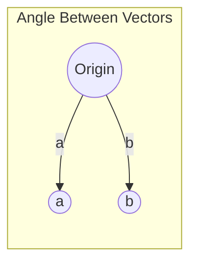

# Chapter 2: Geometry of Vectors

## Intuition

Vectors are not just lists of numbers - they have geometric meaning. When we think of a vector as an arrow in space, we unlock powerful ways to measure relationships between data points: How far apart are they? How similar are their directions? What does one vector "project" onto another?

**Real-world analogies:**
- **Distance**: How far is your house from the office? (Euclidean distance)
- **Angle**: Two roads diverge - the angle tells you how different their directions are
- **Similarity**: Two movie reviewers have similar tastes if their rating vectors point in similar directions
- **Projection**: Your shadow is a projection of you onto the ground (a lower-dimensional surface)

**Why this matters for ML:**
The geometry of vectors powers similarity-based algorithms. When Netflix recommends movies, it's finding users whose preference vectors point in similar directions. When search engines rank documents, they measure how well document vectors align with query vectors.

## Visual Explanation

### Distance Between Vectors

The distance between two points $\mathbf{a}$ and $\mathbf{b}$ is the length of the vector connecting them:

```
    b = (4, 3)
    *
   /|
  / |
 /  | distance = ||b - a||
a---+
(1, 1)
```

$$d(\mathbf{a}, \mathbf{b}) = \|\mathbf{b} - \mathbf{a}\|_2$$

### Angle Between Vectors



The angle $\theta$ between vectors reveals their alignment:
- $\theta = 0°$: Same direction (perfect alignment)
- $\theta = 90°$: Perpendicular (orthogonal, unrelated)
- $\theta = 180°$: Opposite directions (inverse relationship)

### Projection Visualization

```
        b
       /
      /
     /  projection of a onto b
    /------>
   O--------> a
```

The projection of $\mathbf{a}$ onto $\mathbf{b}$ is the "shadow" of $\mathbf{a}$ cast along $\mathbf{b}$.

## Mathematical Foundation

### Distance

The **Euclidean distance** between two vectors is the L2 norm of their difference:

$$d(\mathbf{a}, \mathbf{b}) = \|\mathbf{a} - \mathbf{b}\|_2 = \sqrt{\sum_{i=1}^{n}(a_i - b_i)^2}$$

For 2D vectors $\mathbf{a} = [a_1, a_2]$ and $\mathbf{b} = [b_1, b_2]$:
$$d(\mathbf{a}, \mathbf{b}) = \sqrt{(a_1 - b_1)^2 + (a_2 - b_2)^2}$$

This is the Pythagorean theorem generalized to $n$ dimensions.

**Other distance metrics:**
- **Manhattan (L1)**: $d_1(\mathbf{a}, \mathbf{b}) = \sum_{i=1}^{n}|a_i - b_i|$
- **Minkowski (Lp)**: $d_p(\mathbf{a}, \mathbf{b}) = \left(\sum_{i=1}^{n}|a_i - b_i|^p\right)^{1/p}$

### Angle Between Vectors

The angle $\theta$ between two vectors is derived from the dot product:

$$\cos(\theta) = \frac{\mathbf{a} \cdot \mathbf{b}}{\|\mathbf{a}\| \|\mathbf{b}\|}$$

Solving for $\theta$:
$$\theta = \arccos\left(\frac{\mathbf{a} \cdot \mathbf{b}}{\|\mathbf{a}\| \|\mathbf{b}\|}\right)$$

**Important values:**
| Angle $\theta$ | $\cos(\theta)$ | Meaning |
|----------------|----------------|---------|
| 0° | 1 | Identical direction |
| 90° | 0 | Orthogonal (perpendicular) |
| 180° | -1 | Opposite direction |

### Cosine Similarity

**Cosine similarity** measures how similar two vectors' directions are, ignoring magnitude:

$$\text{cosine\_similarity}(\mathbf{a}, \mathbf{b}) = \frac{\mathbf{a} \cdot \mathbf{b}}{\|\mathbf{a}\| \|\mathbf{b}\|} = \frac{\sum_{i=1}^{n} a_i b_i}{\sqrt{\sum_{i=1}^{n} a_i^2} \cdot \sqrt{\sum_{i=1}^{n} b_i^2}}$$

**Properties:**
- Range: $[-1, 1]$
- $+1$: Vectors point in the same direction
- $0$: Vectors are orthogonal
- $-1$: Vectors point in opposite directions

**Cosine distance** is defined as:
$$\text{cosine\_distance} = 1 - \text{cosine\_similarity}$$

### Projection

The **scalar projection** of $\mathbf{a}$ onto $\mathbf{b}$ is:
$$\text{comp}_{\mathbf{b}}\mathbf{a} = \frac{\mathbf{a} \cdot \mathbf{b}}{\|\mathbf{b}\|}$$

The **vector projection** of $\mathbf{a}$ onto $\mathbf{b}$ is:
$$\text{proj}_{\mathbf{b}}\mathbf{a} = \frac{\mathbf{a} \cdot \mathbf{b}}{\|\mathbf{b}\|^2} \mathbf{b} = \frac{\mathbf{a} \cdot \mathbf{b}}{\mathbf{b} \cdot \mathbf{b}} \mathbf{b}$$

This gives the component of $\mathbf{a}$ that lies along the direction of $\mathbf{b}$.

### Orthogonality

Two vectors are **orthogonal** (perpendicular) if their dot product is zero:
$$\mathbf{a} \perp \mathbf{b} \iff \mathbf{a} \cdot \mathbf{b} = 0$$

**Orthonormal vectors** are both orthogonal and unit length:
$$\mathbf{a} \cdot \mathbf{b} = 0 \quad \text{and} \quad \|\mathbf{a}\| = \|\mathbf{b}\| = 1$$

**Why orthogonality matters:**
- Orthogonal features are uncorrelated (provide independent information)
- Orthonormal bases simplify many calculations
- PCA finds orthogonal directions of maximum variance

## Code Example

```python
import numpy as np

# Define two vectors
a = np.array([3, 4])
b = np.array([4, 3])

print("=== Distance ===")
# Euclidean distance
euclidean_dist = np.linalg.norm(a - b)
print(f"a = {a}, b = {b}")
print(f"Euclidean distance: {euclidean_dist:.4f}")

# Manhattan distance
manhattan_dist = np.linalg.norm(a - b, ord=1)
print(f"Manhattan distance: {manhattan_dist:.4f}")

# Manual calculation
manual_euclidean = np.sqrt(np.sum((a - b)**2))
print(f"Manual Euclidean: {manual_euclidean:.4f}")


print("\n=== Angle Between Vectors ===")
# Cosine of angle
cos_angle = np.dot(a, b) / (np.linalg.norm(a) * np.linalg.norm(b))
print(f"cos(theta) = {cos_angle:.4f}")

# Angle in radians and degrees
angle_rad = np.arccos(cos_angle)
angle_deg = np.degrees(angle_rad)
print(f"Angle: {angle_rad:.4f} radians = {angle_deg:.2f} degrees")


print("\n=== Cosine Similarity ===")
# Cosine similarity (same as cos(angle) for non-zero vectors)
def cosine_similarity(v1, v2):
    return np.dot(v1, v2) / (np.linalg.norm(v1) * np.linalg.norm(v2))

# Example: Document similarity
doc1 = np.array([1, 2, 3, 0, 0])  # word counts
doc2 = np.array([1, 2, 0, 0, 0])  # word counts
doc3 = np.array([0, 0, 0, 5, 5])  # different topic

print(f"Doc1: {doc1}")
print(f"Doc2: {doc2}")
print(f"Doc3: {doc3}")
print(f"Similarity(doc1, doc2): {cosine_similarity(doc1, doc2):.4f}")
print(f"Similarity(doc1, doc3): {cosine_similarity(doc1, doc3):.4f}")
print(f"Similarity(doc2, doc3): {cosine_similarity(doc2, doc3):.4f}")


print("\n=== Projection ===")
a = np.array([3, 4])
b = np.array([5, 0])  # horizontal vector

# Scalar projection (length of shadow)
scalar_proj = np.dot(a, b) / np.linalg.norm(b)
print(f"Scalar projection of a onto b: {scalar_proj:.4f}")

# Vector projection (the actual shadow vector)
vector_proj = (np.dot(a, b) / np.dot(b, b)) * b
print(f"Vector projection of a onto b: {vector_proj}")

# Verify: projection + perpendicular component = original
perpendicular = a - vector_proj
print(f"Perpendicular component: {perpendicular}")
print(f"Projection + Perpendicular = {vector_proj + perpendicular}")


print("\n=== Orthogonality ===")
v1 = np.array([1, 0, 0])
v2 = np.array([0, 1, 0])
v3 = np.array([1, 1, 0])

print(f"v1 = {v1}, v2 = {v2}, v3 = {v3}")
print(f"v1 · v2 = {np.dot(v1, v2)} (orthogonal: {np.isclose(np.dot(v1, v2), 0)})")
print(f"v1 · v3 = {np.dot(v1, v3)} (orthogonal: {np.isclose(np.dot(v1, v3), 0)})")


print("\n=== ML Example: k-NN with Different Metrics ===")
# Query point and data points
query = np.array([2, 2])
points = np.array([
    [1, 1],
    [3, 3],
    [0, 4],
    [4, 0]
])

print(f"Query: {query}")
print("Points and their distances from query:")
for i, p in enumerate(points):
    euc_dist = np.linalg.norm(query - p)
    cos_sim = cosine_similarity(query, p)
    print(f"  Point {i} {p}: Euclidean={euc_dist:.3f}, CosSim={cos_sim:.3f}")
```

**Output:**
```
=== Distance ===
a = [3 4], b = [4 3]
Euclidean distance: 1.4142
Manhattan distance: 2.0000
Manual Euclidean: 1.4142

=== Angle Between Vectors ===
cos(theta) = 0.9600
Angle: 0.2838 radians = 16.26 degrees

=== Cosine Similarity ===
Doc1: [1 2 3 0 0]
Doc2: [1 2 0 0 0]
Doc3: [0 0 0 5 5]
Similarity(doc1, doc2): 0.6667
Similarity(doc1, doc3): 0.0000
Similarity(doc2, doc3): 0.0000

=== Projection ===
Scalar projection of a onto b: 3.0000
Vector projection of a onto b: [3. 0.]
Perpendicular component: [0. 4.]
Projection + Perpendicular = [3. 4.]

=== Orthogonality ===
v1 = [1 0 0], v2 = [0 1 0], v3 = [1 1 0]
v1 · v2 = 0 (orthogonal: True)
v1 · v3 = 1 (orthogonal: False)

=== ML Example: k-NN with Different Metrics ===
Query: [2 2]
Points and their distances from query:
  Point 0 [1 1]: Euclidean=1.414, CosSim=1.000
  Point 1 [3 3]: Euclidean=1.414, CosSim=1.000
  Point 2 [0 4]: Euclidean=2.828, CosSim=0.707
  Point 3 [4 0]: Euclidean=2.828, CosSim=0.707
```

## ML Relevance

### Where These Concepts Appear

| Concept | ML Application |
|---------|----------------|
| Euclidean distance | k-NN, k-means clustering, anomaly detection |
| Cosine similarity | Document similarity, word embeddings, recommendations |
| Projection | PCA, linear regression (least squares) |
| Orthogonality | Independent features, orthonormal weight initialization |

### Specific Algorithms

1. **k-Nearest Neighbors (k-NN)**: Classifies based on distance to nearest training points
2. **k-Means Clustering**: Minimizes distances within clusters
3. **Information Retrieval**: Documents and queries are vectors; cosine similarity ranks relevance
4. **Collaborative Filtering**: User and item embeddings; similarity finds recommendations
5. **Word2Vec / GloVe**: Word vectors where cosine similarity captures semantic meaning

### Distance vs Cosine Similarity: When to Use What?

| Use Euclidean Distance | Use Cosine Similarity |
|------------------------|----------------------|
| Features have similar scales | Features have different scales |
| Magnitude matters | Only direction matters |
| Physical measurements | Text/document similarity |
| Image pixel comparison | High-dimensional sparse data |

## When to Use / Ignore

### When to Use These Metrics

- **Distance**: When magnitude and position both matter (geographic data, sensor readings)
- **Cosine similarity**: When only the pattern/direction matters (text, preferences)
- **Projection**: When decomposing vectors into components (feature extraction, regression)

### Common Pitfalls

1. **Forgetting to normalize**: For cosine similarity, normalization is built-in. For distance, you may need to normalize features first.

2. **Curse of dimensionality**: In high dimensions, all points become approximately equidistant. Distance-based methods struggle.

3. **Zero vectors**: Cosine similarity is undefined for zero vectors (division by zero).

4. **Sparse vectors**: Use specialized sparse representations; dense computation is wasteful.

5. **Wrong metric for the task**: Using Euclidean distance on text data (where magnitude varies with document length) gives poor results.

## Exercises

### Exercise 1: Distance Calculation
Compute the Euclidean and Manhattan distances between $\mathbf{p} = [1, 2, 3]$ and $\mathbf{q} = [4, 0, 3]$.

**Solution:**
```python
p = np.array([1, 2, 3])
q = np.array([4, 0, 3])

euclidean = np.linalg.norm(p - q)  # sqrt((4-1)^2 + (0-2)^2 + (3-3)^2) = sqrt(13)
manhattan = np.linalg.norm(p - q, ord=1)  # |4-1| + |0-2| + |3-3| = 5

print(f"Euclidean distance: {euclidean:.4f}")  # 3.6056
print(f"Manhattan distance: {manhattan:.4f}")  # 5.0
```

### Exercise 2: Cosine Similarity
Find the cosine similarity between $\mathbf{a} = [1, 0, 1]$ and $\mathbf{b} = [0, 1, 1]$.

**Solution:**
```python
a = np.array([1, 0, 1])
b = np.array([0, 1, 1])

cos_sim = np.dot(a, b) / (np.linalg.norm(a) * np.linalg.norm(b))
# (1*0 + 0*1 + 1*1) / (sqrt(2) * sqrt(2)) = 1/2 = 0.5

print(f"Cosine similarity: {cos_sim:.4f}")  # 0.5
```

### Exercise 3: Projection
Project $\mathbf{v} = [4, 2]$ onto $\mathbf{u} = [3, 0]$.

**Solution:**
```python
v = np.array([4, 2])
u = np.array([3, 0])

# Vector projection of v onto u
proj = (np.dot(v, u) / np.dot(u, u)) * u
# (4*3 + 2*0) / (3*3 + 0*0) * [3, 0] = 12/9 * [3, 0] = [4, 0]

print(f"Projection of v onto u: {proj}")  # [4. 0.]

# Verify: the perpendicular component
perp = v - proj  # [0, 2]
print(f"Perpendicular component: {perp}")
print(f"Dot product (should be 0): {np.dot(proj, perp)}")  # 0
```

## Summary

- **Distance** measures how far apart two vectors are; Euclidean distance is the straight-line distance
- **Angle** between vectors indicates their directional alignment; derived from the dot product
- **Cosine similarity** measures directional similarity, ignoring magnitude; ranges from -1 to +1
- **Projection** decomposes a vector into components parallel and perpendicular to another vector
- **Orthogonal** vectors have zero dot product and are uncorrelated
- Euclidean distance is sensitive to scale; cosine similarity is scale-invariant
- Choose the right metric for your data: distance for magnitude-sensitive tasks, cosine for direction-sensitive tasks
- These geometric concepts directly power k-NN, document retrieval, recommendations, and PCA
