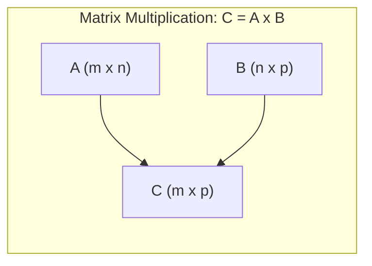

# Chapter 3: Matrices

## Intuition

A **matrix** is a 2D array of numbers arranged in rows and columns. If a vector is a list, a matrix is a table. Matrices are the workhorses of machine learning - they represent datasets, encode transformations, and enable efficient batch computations.

**Real-world analogies:**
- **Spreadsheet**: Each row is a data point, each column is a feature
- **Image**: A grayscale image is a matrix of pixel intensities
- **Weight table**: Neural network weights connecting two layers form a matrix
- **Transition table**: In Markov chains, transition probabilities form a matrix

**Why this matters for ML:**
Every dataset is a matrix. Every neural network layer is a matrix multiplication. Understanding matrices means understanding how ML algorithms process and transform data at scale.

## Visual Explanation

### Matrix Structure

A matrix $\mathbf{A}$ with $m$ rows and $n$ columns (an $m \times n$ matrix):

$$\mathbf{A} = \begin{bmatrix} a_{11} & a_{12} & \cdots & a_{1n} \\ a_{21} & a_{22} & \cdots & a_{2n} \\ \vdots & \vdots & \ddots & \vdots \\ a_{m1} & a_{m2} & \cdots & a_{mn} \end{bmatrix}$$

```
        n columns
       <-------->
  m    [1  2  3  4]
rows   [5  6  7  8]
       [9 10 11 12]

This is a 3x4 matrix (3 rows, 4 columns)
```

### Matrix Multiplication Visualization



The resulting matrix $\mathbf{C}$ has dimensions $m \times p$.

**Each element $c_{ij}$** is the dot product of row $i$ of $\mathbf{A}$ and column $j$ of $\mathbf{B}$:

```
A           B           C
[a b c]   [x . .]     [ax+by+cz  ...]
[d e f] x [y . .] =   [dx+ey+fz  ...]
          [z . .]
```

## Mathematical Foundation

### Matrix Representation

A matrix $\mathbf{A} \in \mathbb{R}^{m \times n}$ has $m$ rows and $n$ columns:

$$\mathbf{A}_{ij} = a_{ij}$$

where $i$ is the row index and $j$ is the column index.

**Special matrices:**
- **Row vector**: $1 \times n$ matrix
- **Column vector**: $m \times 1$ matrix
- **Square matrix**: $n \times n$ matrix

### Matrix Addition

Two matrices of the same dimension can be added element-wise:

$$(\mathbf{A} + \mathbf{B})_{ij} = a_{ij} + b_{ij}$$

**Properties:**
- Commutative: $\mathbf{A} + \mathbf{B} = \mathbf{B} + \mathbf{A}$
- Associative: $(\mathbf{A} + \mathbf{B}) + \mathbf{C} = \mathbf{A} + (\mathbf{B} + \mathbf{C})$

### Matrix Multiplication

For $\mathbf{A} \in \mathbb{R}^{m \times n}$ and $\mathbf{B} \in \mathbb{R}^{n \times p}$:

$$(\mathbf{AB})_{ij} = \sum_{k=1}^{n} a_{ik} b_{kj}$$

The result $\mathbf{C} = \mathbf{AB}$ has dimensions $m \times p$.

**Critical rule**: Inner dimensions must match!
- $\mathbf{A}$: $m \times \underline{n}$
- $\mathbf{B}$: $\underline{n} \times p$
- Result: $m \times p$

**Properties:**
- **NOT commutative**: $\mathbf{AB} \neq \mathbf{BA}$ in general
- Associative: $(\mathbf{AB})\mathbf{C} = \mathbf{A}(\mathbf{BC})$
- Distributive: $\mathbf{A}(\mathbf{B} + \mathbf{C}) = \mathbf{AB} + \mathbf{AC}$

### Transpose

The **transpose** $\mathbf{A}^T$ swaps rows and columns:

$$(\mathbf{A}^T)_{ij} = a_{ji}$$

If $\mathbf{A}$ is $m \times n$, then $\mathbf{A}^T$ is $n \times m$.

**Properties:**
- $(\mathbf{A}^T)^T = \mathbf{A}$
- $(\mathbf{A} + \mathbf{B})^T = \mathbf{A}^T + \mathbf{B}^T$
- $(\mathbf{AB})^T = \mathbf{B}^T\mathbf{A}^T$ (order reverses!)
- $(c\mathbf{A})^T = c\mathbf{A}^T$

**Symmetric matrix**: $\mathbf{A} = \mathbf{A}^T$ (common in covariance matrices)

### Identity Matrix

The **identity matrix** $\mathbf{I}_n$ is an $n \times n$ matrix with 1s on the diagonal and 0s elsewhere:

$$\mathbf{I}_n = \begin{bmatrix} 1 & 0 & \cdots & 0 \\ 0 & 1 & \cdots & 0 \\ \vdots & \vdots & \ddots & \vdots \\ 0 & 0 & \cdots & 1 \end{bmatrix}$$

**Property**: For any compatible matrix $\mathbf{A}$:
$$\mathbf{AI} = \mathbf{IA} = \mathbf{A}$$

The identity matrix is to matrix multiplication what 1 is to scalar multiplication.

### Inverse Matrix

The **inverse** $\mathbf{A}^{-1}$ of a square matrix $\mathbf{A}$ satisfies:

$$\mathbf{A}\mathbf{A}^{-1} = \mathbf{A}^{-1}\mathbf{A} = \mathbf{I}$$

**Properties:**
- Only square matrices can have inverses
- Not all square matrices have inverses (only **invertible** or **non-singular** matrices)
- $(\mathbf{A}^{-1})^{-1} = \mathbf{A}$
- $(\mathbf{AB})^{-1} = \mathbf{B}^{-1}\mathbf{A}^{-1}$ (order reverses!)
- $(\mathbf{A}^T)^{-1} = (\mathbf{A}^{-1})^T$

**When does a matrix have an inverse?**
- Determinant is non-zero: $\det(\mathbf{A}) \neq 0$
- Rows (or columns) are linearly independent
- Full rank: $\text{rank}(\mathbf{A}) = n$ for an $n \times n$ matrix

For a $2 \times 2$ matrix:
$$\mathbf{A} = \begin{bmatrix} a & b \\ c & d \end{bmatrix}, \quad \mathbf{A}^{-1} = \frac{1}{ad - bc}\begin{bmatrix} d & -b \\ -c & a \end{bmatrix}$$

## Code Example

```python
import numpy as np

print("=== Matrix Creation ===")
# Create matrices
A = np.array([[1, 2, 3],
              [4, 5, 6]])
B = np.array([[7, 8],
              [9, 10],
              [11, 12]])

print(f"A (2x3):\n{A}")
print(f"\nB (3x2):\n{B}")
print(f"\nA shape: {A.shape}")
print(f"B shape: {B.shape}")


print("\n=== Matrix Addition ===")
C = np.array([[1, 2, 3],
              [4, 5, 6]])
D = np.array([[10, 20, 30],
              [40, 50, 60]])

print(f"C + D:\n{C + D}")


print("\n=== Matrix Multiplication ===")
# A is 2x3, B is 3x2 -> result is 2x2
product = A @ B  # or np.matmul(A, B) or np.dot(A, B)
print(f"A @ B (2x2):\n{product}")

# Manual verification of element [0,0]
# Row 0 of A: [1, 2, 3]
# Col 0 of B: [7, 9, 11]
# Dot product: 1*7 + 2*9 + 3*11 = 7 + 18 + 33 = 58
print(f"\nVerification: [0,0] = 1*7 + 2*9 + 3*11 = {1*7 + 2*9 + 3*11}")

# Element-wise multiplication (different from matrix multiplication!)
E = np.array([[1, 2], [3, 4]])
F = np.array([[5, 6], [7, 8]])
print(f"\nElement-wise E * F:\n{E * F}")
print(f"Matrix E @ F:\n{E @ F}")


print("\n=== Transpose ===")
print(f"A:\n{A}")
print(f"A transpose:\n{A.T}")


print("\n=== Identity Matrix ===")
I3 = np.eye(3)
print(f"3x3 Identity matrix:\n{I3}")

G = np.array([[1, 2, 3],
              [4, 5, 6],
              [7, 8, 9]])
print(f"\nG @ I = G:\n{G @ I3}")


print("\n=== Inverse Matrix ===")
H = np.array([[4, 7],
              [2, 6]])
H_inv = np.linalg.inv(H)
print(f"H:\n{H}")
print(f"\nH inverse:\n{H_inv}")
print(f"\nH @ H_inv (should be identity):\n{H @ H_inv}")

# Check if result is identity (within floating point tolerance)
print(f"\nIs H @ H_inv close to identity? {np.allclose(H @ H_inv, np.eye(2))}")


print("\n=== Determinant ===")
det_H = np.linalg.det(H)
print(f"det(H) = {det_H}")  # 4*6 - 7*2 = 24 - 14 = 10

# Singular matrix (no inverse)
singular = np.array([[1, 2],
                     [2, 4]])
print(f"\nSingular matrix:\n{singular}")
print(f"det(singular) = {np.linalg.det(singular)}")  # Should be ~0


print("\n=== ML Example: Dataset as Matrix ===")
# Each row is a sample, each column is a feature
# Dataset: 4 houses with features [sqft, bedrooms, bathrooms]
X = np.array([
    [1500, 3, 2],
    [2000, 4, 3],
    [1200, 2, 1],
    [1800, 3, 2]
])

# Weights for each feature (learned by model)
w = np.array([[100],    # price per sqft
              [50000],  # price per bedroom
              [30000]]) # price per bathroom

# Predictions = X @ w
predictions = X @ w
print(f"Dataset X (4 samples, 3 features):\n{X}")
print(f"\nWeights w:\n{w.flatten()}")
print(f"\nPredictions (X @ w):\n{predictions.flatten()}")


print("\n=== Batch Operations in Neural Networks ===")
# Simulating a neural network layer
# Input: batch of 3 samples, 4 features each
batch_input = np.array([
    [0.1, 0.2, 0.3, 0.4],
    [0.5, 0.6, 0.7, 0.8],
    [0.9, 1.0, 1.1, 1.2]
])

# Weight matrix: 4 input features -> 2 output features
weights = np.array([
    [0.1, 0.2],
    [0.3, 0.4],
    [0.5, 0.6],
    [0.7, 0.8]
])

# Bias vector
bias = np.array([0.1, 0.2])

# Forward pass: output = input @ weights + bias
output = batch_input @ weights + bias

print(f"Input shape: {batch_input.shape}")
print(f"Weights shape: {weights.shape}")
print(f"Output shape: {output.shape}")
print(f"\nOutput:\n{output}")
```

**Output:**
```
=== Matrix Creation ===
A (2x3):
[[1 2 3]
 [4 5 6]]

B (3x2):
[[ 7  8]
 [ 9 10]
 [11 12]]

A shape: (2, 3)
B shape: (3, 2)

=== Matrix Addition ===
C + D:
[[11 22 33]
 [44 55 66]]

=== Matrix Multiplication ===
A @ B (2x2):
[[ 58  64]
 [139 154]]

Verification: [0,0] = 1*7 + 2*9 + 3*11 = 58

Element-wise E * F:
[[ 5 12]
 [21 32]]
Matrix E @ F:
[[19 22]
 [43 50]]

=== Transpose ===
A:
[[1 2 3]
 [4 5 6]]
A transpose:
[[1 4]
 [2 5]
 [3 6]]

=== Identity Matrix ===
3x3 Identity matrix:
[[1. 0. 0.]
 [0. 1. 0.]
 [0. 0. 1.]]

G @ I = G:
[[1. 2. 3.]
 [4. 5. 6.]
 [7. 8. 9.]]

=== Inverse Matrix ===
H:
[[4 7]
 [2 6]]

H inverse:
[[ 0.6 -0.7]
 [-0.2  0.4]]

H @ H_inv (should be identity):
[[1. 0.]
 [0. 1.]]

Is H @ H_inv close to identity? True

=== Determinant ===
det(H) = 10.0

Singular matrix:
[[1 2]
 [2 4]]
det(singular) = 0.0

=== ML Example: Dataset as Matrix ===
Dataset X (4 samples, 3 features):
[[1500    3    2]
 [2000    4    3]
 [1200    2    1]
 [1800    3    2]]

Weights w:
[  100 50000 30000]

Predictions (X @ w):
[360000 490000 250000 390000]

=== Batch Operations in Neural Networks ===
Input shape: (3, 4)
Weights shape: (4, 2)
Output shape: (3, 2)

Output:
[[0.6 0.8]
 [1.4 1.8]
 [2.2 2.8]]
```

## ML Relevance

### Where Matrices Appear in ML

| Matrix | ML Context |
|--------|------------|
| Data matrix $\mathbf{X}$ | $n$ samples with $d$ features ($n \times d$) |
| Weight matrix $\mathbf{W}$ | Neural network layer weights |
| Covariance matrix | Feature correlations (used in PCA) |
| Confusion matrix | Classification performance |
| Adjacency matrix | Graph neural networks |
| Attention matrix | Transformer models |

### Matrix Multiplication in Neural Networks

A single neural network layer performs:
$$\mathbf{y} = \sigma(\mathbf{Wx} + \mathbf{b})$$

where:
- $\mathbf{x}$: input vector
- $\mathbf{W}$: weight matrix
- $\mathbf{b}$: bias vector
- $\sigma$: activation function
- $\mathbf{y}$: output vector

**Batch processing** uses matrix multiplication:
$$\mathbf{Y} = \sigma(\mathbf{XW} + \mathbf{b})$$

where $\mathbf{X}$ is a batch of inputs (rows are samples).

### The Importance of Transpose

- **Gradient computation**: $\nabla_\mathbf{W} L$ often involves $\mathbf{X}^T$
- **Covariance matrix**: $\mathbf{X}^T\mathbf{X}$ for feature covariance
- **Gram matrix**: $\mathbf{XX}^T$ for sample similarity

## When to Use / Ignore

### When to Focus on Matrices

- **Data preprocessing**: Understand how your data is structured
- **Neural networks**: Every layer is a matrix operation
- **Debugging shapes**: Most bugs come from dimension mismatches
- **Performance optimization**: Matrix operations are highly parallelized

### Common Pitfalls

1. **Dimension mismatch**: Always check shapes before multiplication
   ```python
   # A is (m, n), B is (n, p) -> Result is (m, p)
   # If inner dimensions don't match, you'll get an error
   ```

2. **Confusing `*` and `@`**:
   - `*` is element-wise multiplication (Hadamard product)
   - `@` is matrix multiplication

3. **Assuming commutativity**: $\mathbf{AB} \neq \mathbf{BA}$ in general

4. **Numerical instability with inverses**: Use `np.linalg.solve()` instead of computing inverses explicitly

5. **Forgetting about broadcasting**: NumPy broadcasts lower-dimensional arrays, which can hide bugs

## Exercises

### Exercise 1: Matrix Multiplication
Given:
$$\mathbf{A} = \begin{bmatrix} 1 & 2 \\ 3 & 4 \end{bmatrix}, \quad \mathbf{B} = \begin{bmatrix} 5 & 6 \\ 7 & 8 \end{bmatrix}$$

Compute $\mathbf{AB}$ and $\mathbf{BA}$. Are they equal?

**Solution:**
```python
A = np.array([[1, 2], [3, 4]])
B = np.array([[5, 6], [7, 8]])

AB = A @ B
BA = B @ A

print(f"AB:\n{AB}")
# [[1*5+2*7, 1*6+2*8], [3*5+4*7, 3*6+4*8]]
# [[19, 22], [43, 50]]

print(f"\nBA:\n{BA}")
# [[5*1+6*3, 5*2+6*4], [7*1+8*3, 7*2+8*4]]
# [[23, 34], [31, 46]]

print(f"\nAB == BA? {np.array_equal(AB, BA)}")  # False
```

### Exercise 2: Transpose Properties
Verify that $(\mathbf{AB})^T = \mathbf{B}^T\mathbf{A}^T$ for the matrices above.

**Solution:**
```python
A = np.array([[1, 2], [3, 4]])
B = np.array([[5, 6], [7, 8]])

AB_T = (A @ B).T
BT_AT = B.T @ A.T

print(f"(AB)^T:\n{AB_T}")
print(f"\nB^T @ A^T:\n{BT_AT}")
print(f"\nAre they equal? {np.array_equal(AB_T, BT_AT)}")  # True
```

### Exercise 3: Inverse Verification
Find the inverse of $\mathbf{M} = \begin{bmatrix} 2 & 1 \\ 5 & 3 \end{bmatrix}$ and verify $\mathbf{MM}^{-1} = \mathbf{I}$.

**Solution:**
```python
M = np.array([[2, 1], [5, 3]])
M_inv = np.linalg.inv(M)

# Analytical: M_inv = 1/(2*3 - 1*5) * [[3, -1], [-5, 2]] = 1/1 * [[3, -1], [-5, 2]]
print(f"M:\n{M}")
print(f"\nM_inv:\n{M_inv}")  # [[3, -1], [-5, 2]]
print(f"\nM @ M_inv:\n{M @ M_inv}")  # Identity matrix
print(f"\nClose to identity? {np.allclose(M @ M_inv, np.eye(2))}")
```

## Summary

- A **matrix** is a 2D array with $m$ rows and $n$ columns
- **Matrix addition** is element-wise; matrices must have the same dimensions
- **Matrix multiplication** requires inner dimensions to match; result has outer dimensions
- Matrix multiplication is **NOT commutative**: $\mathbf{AB} \neq \mathbf{BA}$
- The **transpose** swaps rows and columns
- The **identity matrix** $\mathbf{I}$ satisfies $\mathbf{AI} = \mathbf{IA} = \mathbf{A}$
- The **inverse** $\mathbf{A}^{-1}$ satisfies $\mathbf{AA}^{-1} = \mathbf{I}$; only some square matrices have inverses
- In ML, datasets are matrices, neural network layers are matrix multiplications
- Use `@` for matrix multiplication and `*` for element-wise multiplication in NumPy
