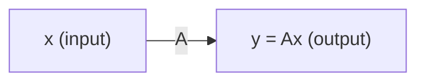

# Chapter 4: Matrices as Transformations

## Intuition

A matrix is not just a table of numbers - it's a **function** that transforms vectors. When you multiply a matrix by a vector, you're applying a transformation: stretching, rotating, reflecting, or projecting that vector into a new position. This perspective unlocks deep understanding of what neural networks actually do to your data.

**Real-world analogies:**
- **Camera lens**: Transforms 3D world into 2D image (projection)
- **Funhouse mirror**: Stretches and distorts reflections (scaling + shearing)
- **GPS rotation**: Rotating a map to match your heading (rotation)
- **Photo filter**: Transforms color values (linear color transformation)

**Why this matters for ML:**
Every layer in a neural network applies a linear transformation via matrix multiplication. Understanding transformations helps you visualize what each layer does to your data and why deep networks can learn complex patterns.

## Visual Explanation

### Linear Transformation

A matrix $\mathbf{A}$ transforms input vector $\mathbf{x}$ to output vector $\mathbf{y}$:



**Key insight**: A linear transformation preserves:
- **Lines**: Straight lines remain straight
- **Origin**: The origin stays fixed
- **Parallelism**: Parallel lines remain parallel

### Transformation Examples in 2D

```
Original          Scaled (2x, 0.5y)    Rotated 90°        Sheared
    |                   |                   |                  /|
    |                   |              -----|              ---|
----|----           ----|----          -----|            -----|----
    |                   |                   |                  |
    |                   |                   |                  |
```

## Mathematical Foundation

### Linear Transformations

A function $T: \mathbb{R}^n \rightarrow \mathbb{R}^m$ is a **linear transformation** if:

1. $T(\mathbf{u} + \mathbf{v}) = T(\mathbf{u}) + T(\mathbf{v})$ (additivity)
2. $T(c\mathbf{u}) = cT(\mathbf{u})$ (homogeneity)

Every linear transformation can be represented by a matrix:
$$T(\mathbf{x}) = \mathbf{Ax}$$

### Standard Transformations

**Scaling** (stretch/shrink along axes):
$$\mathbf{S} = \begin{bmatrix} s_x & 0 \\ 0 & s_y \end{bmatrix}$$

- $s_x > 1$: stretch horizontally
- $0 < s_x < 1$: shrink horizontally
- $s_x < 0$: reflect and scale

**Rotation** (counterclockwise by angle $\theta$):
$$\mathbf{R} = \begin{bmatrix} \cos\theta & -\sin\theta \\ \sin\theta & \cos\theta \end{bmatrix}$$

**Reflection** (across x-axis):
$$\mathbf{F}_x = \begin{bmatrix} 1 & 0 \\ 0 & -1 \end{bmatrix}$$

**Shear** (horizontal shear):
$$\mathbf{H} = \begin{bmatrix} 1 & k \\ 0 & 1 \end{bmatrix}$$

### Change of Basis

A **basis** is a set of linearly independent vectors that span a space. The standard basis in 2D is:
$$\mathbf{e}_1 = \begin{bmatrix} 1 \\ 0 \end{bmatrix}, \quad \mathbf{e}_2 = \begin{bmatrix} 0 \\ 1 \end{bmatrix}$$

**Change of basis** transforms coordinates from one basis to another:

If $\mathbf{P}$ contains new basis vectors as columns, then:
- $\mathbf{x}_{new} = \mathbf{P}^{-1}\mathbf{x}_{old}$ (convert to new basis)
- $\mathbf{x}_{old} = \mathbf{P}\mathbf{x}_{new}$ (convert back to standard basis)

**Why this matters**: Different bases reveal different structure. PCA finds a basis that aligns with the directions of maximum variance.

### Projection

**Projection onto a line** (through origin, direction $\mathbf{u}$):
$$\mathbf{P} = \frac{\mathbf{u}\mathbf{u}^T}{\mathbf{u}^T\mathbf{u}}$$

For a unit vector $\hat{\mathbf{u}}$:
$$\mathbf{P} = \hat{\mathbf{u}}\hat{\mathbf{u}}^T$$

**Properties of projection matrices**:
- Symmetric: $\mathbf{P} = \mathbf{P}^T$
- Idempotent: $\mathbf{P}^2 = \mathbf{P}$ (projecting twice = projecting once)

### Composition of Transformations

Applying transformation $\mathbf{A}$ then $\mathbf{B}$ equals applying $\mathbf{BA}$:
$$\mathbf{y} = \mathbf{B}(\mathbf{Ax}) = (\mathbf{BA})\mathbf{x}$$

**Order matters!** Rotating then scaling differs from scaling then rotating.

## Code Example

```python
import numpy as np
import matplotlib.pyplot as plt

# Helper function to visualize 2D transformations
def plot_transformation(original, transformed, title, ax):
    """Plot original and transformed unit square"""
    ax.fill(original[0], original[1], alpha=0.3, color='blue', label='Original')
    ax.fill(transformed[0], transformed[1], alpha=0.3, color='red', label='Transformed')
    ax.axhline(y=0, color='k', linewidth=0.5)
    ax.axvline(x=0, color='k', linewidth=0.5)
    ax.set_xlim(-3, 3)
    ax.set_ylim(-3, 3)
    ax.set_aspect('equal')
    ax.legend()
    ax.set_title(title)
    ax.grid(True, alpha=0.3)

# Unit square vertices
square = np.array([
    [0, 1, 1, 0, 0],  # x coordinates
    [0, 0, 1, 1, 0]   # y coordinates
])


print("=== Scaling Transformation ===")
# Scale: 2x horizontal, 0.5x vertical
S = np.array([[2, 0],
              [0, 0.5]])

print(f"Scaling matrix:\n{S}")
scaled_square = S @ square
print(f"\nOriginal point (1,1) -> Scaled: {S @ np.array([1, 1])}")


print("\n=== Rotation Transformation ===")
# Rotate 45 degrees counterclockwise
theta = np.pi / 4  # 45 degrees
R = np.array([[np.cos(theta), -np.sin(theta)],
              [np.sin(theta), np.cos(theta)]])

print(f"Rotation matrix (45 degrees):\n{R}")
rotated_square = R @ square
print(f"\nOriginal point (1,0) -> Rotated: {R @ np.array([1, 0])}")


print("\n=== Reflection Transformation ===")
# Reflect across x-axis
F = np.array([[1, 0],
              [0, -1]])

print(f"Reflection matrix (across x-axis):\n{F}")
print(f"\nOriginal point (1,1) -> Reflected: {F @ np.array([1, 1])}")


print("\n=== Shear Transformation ===")
# Horizontal shear with factor k=0.5
k = 0.5
H = np.array([[1, k],
              [0, 1]])

print(f"Shear matrix (k={k}):\n{H}")
sheared_square = H @ square
print(f"\nOriginal point (0,1) -> Sheared: {H @ np.array([0, 1])}")


print("\n=== Composition of Transformations ===")
# First rotate 45 degrees, then scale
composed = S @ R  # Apply R first, then S
print(f"Composed transformation (Scale after Rotate):\n{composed}")

# Compare with rotating after scaling
composed2 = R @ S
print(f"\nComposed transformation (Rotate after Scale):\n{composed2}")
print(f"\nSame result? {np.allclose(composed, composed2)}")  # False - order matters!


print("\n=== Projection onto a Line ===")
# Project onto the line y = x (direction [1, 1])
u = np.array([1, 1])
u_normalized = u / np.linalg.norm(u)

# Projection matrix
P = np.outer(u_normalized, u_normalized)
print(f"Projection matrix onto y=x:\n{P}")

# Project a point
point = np.array([2, 0])
projected = P @ point
print(f"\nOriginal point: {point}")
print(f"Projected point: {projected}")

# Verify: projecting twice gives same result (idempotent)
print(f"P @ P @ point: {P @ P @ point}")


print("\n=== Change of Basis ===")
# New basis vectors (45 degree rotated basis)
b1 = np.array([1, 1]) / np.sqrt(2)   # normalized
b2 = np.array([-1, 1]) / np.sqrt(2)  # normalized, perpendicular to b1

# Matrix with new basis as columns
B = np.column_stack([b1, b2])
print(f"New basis matrix B:\n{B}")

# Original coordinates (in standard basis)
x_standard = np.array([1, 0])

# Convert to new basis
x_new = np.linalg.inv(B) @ x_standard
print(f"\nPoint {x_standard} in standard basis")
print(f"Same point in new basis: {x_new}")

# Convert back
x_back = B @ x_new
print(f"Converted back to standard: {x_back}")


print("\n=== ML Example: Neural Network Layer ===")
# A neural network layer is a linear transformation + activation
# Input: batch of 3 points in 2D
X = np.array([[1, 0],
              [0, 1],
              [1, 1]])

# Weight matrix: 2D input -> 3D output
W = np.array([[1, 0],
              [0, 1],
              [1, 1]])

# Linear transformation
Z = X @ W.T  # Each row of X transformed by W

print(f"Input X (3 samples, 2D):\n{X}")
print(f"\nWeight matrix W (2D -> 3D):\n{W}")
print(f"\nLinear transformation Z = XW^T:\n{Z}")

# With ReLU activation
Z_relu = np.maximum(0, Z)
print(f"\nAfter ReLU activation:\n{Z_relu}")


print("\n=== Understanding What Transformations Do ===")
# Let's trace what happens to basis vectors
I = np.eye(2)  # Standard basis as columns

print("Standard basis vectors:")
print(f"e1 = {I[:, 0]}, e2 = {I[:, 1]}")

# After scaling
print(f"\nAfter scaling by S:")
print(f"S @ e1 = {S @ I[:, 0]}")  # First column of S
print(f"S @ e2 = {S @ I[:, 1]}")  # Second column of S
print("-> Matrix columns show where basis vectors go!")

# After rotation
print(f"\nAfter rotation by R:")
print(f"R @ e1 = {R @ I[:, 0]}")  # First column of R
print(f"R @ e2 = {R @ I[:, 1]}")  # Second column of R
```

**Output:**
```
=== Scaling Transformation ===
Scaling matrix:
[[2.  0. ]
 [0.  0.5]]

Original point (1,1) -> Scaled: [2.  0.5]

=== Rotation Transformation ===
Rotation matrix (45 degrees):
[[ 0.70710678 -0.70710678]
 [ 0.70710678  0.70710678]]

Original point (1,0) -> Rotated: [0.70710678 0.70710678]

=== Reflection Transformation ===
Reflection matrix (across x-axis):
[[ 1  0]
 [ 0 -1]]

Original point (1,1) -> Reflected: [ 1 -1]

=== Shear Transformation ===
Shear matrix (k=0.5):
[[1.  0.5]
 [0.  1. ]]

Original point (0,1) -> Sheared: [0.5 1. ]

=== Composition of Transformations ===
Composed transformation (Scale after Rotate):
[[ 1.41421356 -1.41421356]
 [ 0.35355339  0.35355339]]

Composed transformation (Rotate after Scale):
[[ 1.41421356 -0.35355339]
 [ 1.41421356  0.35355339]]

Same result? False

=== Projection onto a Line ===
Projection matrix onto y=x:
[[0.5 0.5]
 [0.5 0.5]]

Original point: [2 0]
Projected point: [1. 1.]
P @ P @ point: [1. 1.]

=== Change of Basis ===
New basis matrix B:
[[ 0.70710678 -0.70710678]
 [ 0.70710678  0.70710678]]

Point [1 0] in standard basis
Same point in new basis: [0.70710678 0.70710678]
Converted back to standard: [1. 0.]

=== ML Example: Neural Network Layer ===
Input X (3 samples, 2D):
[[1 0]
 [0 1]
 [1 1]]

Weight matrix W (2D -> 3D):
[[1 0]
 [0 1]
 [1 1]]

Linear transformation Z = XW^T:
[[1 0 1]
 [0 1 1]
 [1 1 2]]

After ReLU activation:
[[1 0 1]
 [0 1 1]
 [1 1 2]]

=== Understanding What Transformations Do ===
Standard basis vectors:
e1 = [1. 0.], e2 = [0. 1.]

After scaling by S:
S @ e1 = [2. 0.]
S @ e2 = [0.  0.5]
-> Matrix columns show where basis vectors go!

After rotation by R:
R @ e1 = [0.70710678 0.70710678]
R @ e2 = [-0.70710678  0.70710678]
```

## ML Relevance

### Where Transformations Appear in ML

| Transformation | ML Application |
|----------------|----------------|
| Scaling | Feature normalization, batch normalization |
| Rotation | Data augmentation, PCA (finding new axes) |
| Projection | Dimensionality reduction, attention mechanisms |
| Composition | Deep networks (stacking layers) |
| Change of basis | PCA, whitening, diagonalization |

### Neural Networks as Composed Transformations

A deep neural network is a composition of transformations:

$$\mathbf{y} = f_L(f_{L-1}(\cdots f_2(f_1(\mathbf{x}))\cdots))$$

Each layer $f_i$ is:
$$f_i(\mathbf{x}) = \sigma(\mathbf{W}_i\mathbf{x} + \mathbf{b}_i)$$

- Linear transformation: $\mathbf{W}_i\mathbf{x}$ (rotate, scale, project)
- Translation: $+ \mathbf{b}_i$ (shift)
- Non-linearity: $\sigma(\cdot)$ (allows non-linear decision boundaries)

### Why Depth Matters

Without non-linearities:
$$\mathbf{W}_2(\mathbf{W}_1\mathbf{x}) = (\mathbf{W}_2\mathbf{W}_1)\mathbf{x} = \mathbf{W}_{combined}\mathbf{x}$$

Multiple linear layers collapse to one! Non-linearities allow networks to learn complex transformations that can't be represented by a single matrix.

## When to Use / Ignore

### When to Focus on Transformations

- **Visualizing neural networks**: Understand what layers do to data
- **Data augmentation**: Apply known transformations to training data
- **Feature engineering**: Basis changes can reveal structure
- **Debugging models**: Trace how data flows through transformations

### Common Pitfalls

1. **Forgetting that transformations are compositions**: Order matters! $\mathbf{AB} \neq \mathbf{BA}$

2. **Confusing row vs column vectors**: Convention varies; be consistent

3. **Ignoring numerical stability**: Avoid computing inverses when possible

4. **Neglecting the origin**: Linear transformations fix the origin; use affine transformations (add bias) for translations

5. **Not visualizing**: 2D examples build intuition that transfers to high dimensions

## Exercises

### Exercise 1: Rotation Matrix
Create a matrix that rotates vectors by 90 degrees counterclockwise. Apply it to the vector $[1, 0]$.

**Solution:**
```python
import numpy as np

theta = np.pi / 2  # 90 degrees
R = np.array([[np.cos(theta), -np.sin(theta)],
              [np.sin(theta), np.cos(theta)]])

v = np.array([1, 0])
rotated = R @ v

print(f"Rotation matrix:\n{R}")
print(f"[1, 0] rotated 90 degrees: {rotated}")  # Should be [0, 1]
```

### Exercise 2: Projection Matrix
Create a projection matrix onto the x-axis. Project the vector $[3, 4]$.

**Solution:**
```python
# Direction of x-axis is [1, 0]
u = np.array([1, 0])

# Projection matrix
P = np.outer(u, u)  # u @ u.T for unit vector
print(f"Projection matrix onto x-axis:\n{P}")

v = np.array([3, 4])
projected = P @ v
print(f"[3, 4] projected onto x-axis: {projected}")  # Should be [3, 0]

# Verify idempotent
print(f"P @ P @ v: {P @ P @ v}")  # Same as projected
```

### Exercise 3: Composition
Apply scaling by 2 in both directions, then rotate 45 degrees. What happens to $[1, 0]$?

**Solution:**
```python
# Scaling matrix
S = np.array([[2, 0],
              [0, 2]])

# Rotation matrix (45 degrees)
theta = np.pi / 4
R = np.array([[np.cos(theta), -np.sin(theta)],
              [np.sin(theta), np.cos(theta)]])

# Composition: first scale, then rotate
T = R @ S

v = np.array([1, 0])
result = T @ v

print(f"Scaling matrix:\n{S}")
print(f"Rotation matrix:\n{R}")
print(f"Composed T = R @ S:\n{T}")
print(f"[1, 0] after scaling then rotating: {result}")
# [1, 0] -> [2, 0] -> [sqrt(2), sqrt(2)] ≈ [1.414, 1.414]
```

## Summary

- Matrices represent **linear transformations** that map vectors to new positions
- **Scaling** stretches or shrinks along axes; **rotation** turns vectors; **projection** maps onto subspaces
- The **columns of a matrix** show where the standard basis vectors go after transformation
- **Composition** of transformations is matrix multiplication (order matters!)
- **Change of basis** transforms coordinates between different coordinate systems
- **Neural network layers** are linear transformations followed by non-linear activations
- Without non-linearities, multiple layers collapse into one matrix
- Visualizing transformations in 2D builds intuition for high-dimensional ML operations
- Understanding transformations helps you debug shape mismatches and visualize what models learn
