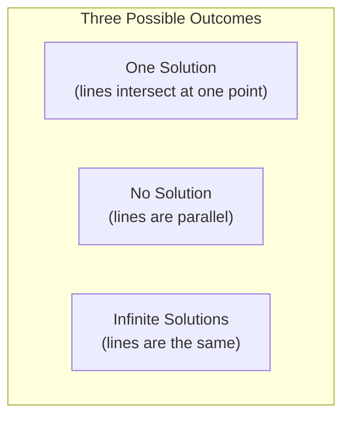

# Chapter 5: Systems of Linear Equations

## Intuition

A **system of linear equations** is a set of equations that must all be satisfied simultaneously. These systems are everywhere in ML: fitting a line to data points, solving for neural network weights, and finding optimal solutions. The key insight is that we can represent any such system as a single matrix equation.

**Real-world analogies:**
- **Balancing a budget**: Income from multiple sources must equal expenses across categories
- **Recipe scaling**: Ingredients must combine in fixed ratios to make the final dish
- **Navigation**: Multiple GPS satellites give constraints that pinpoint your location
- **Linear regression**: Find weights that minimize prediction error across all data points

**Why this matters for ML:**
Training a linear model means solving a system of linear equations. Understanding when solutions exist, whether they're unique, and how to find them efficiently is fundamental to machine learning.

## Visual Explanation

### Geometric Interpretation (2D)

Each linear equation defines a line. The solution is where all lines intersect.



```
One Solution:        No Solution:         Infinite Solutions:
      |                    |                     |
   \  |  /              \  |                  \  |  /
    \ | /                \ |                   \/\/
-----*-----            ---\---               ----*----
    / | \                  \                    /\/\
   /  |  \                  \                  /  |  \
```

### Matrix Form

The system:
$$\begin{align}
2x + 3y &= 8 \\
x - y &= 1
\end{align}$$

becomes:
$$\begin{bmatrix} 2 & 3 \\ 1 & -1 \end{bmatrix} \begin{bmatrix} x \\ y \end{bmatrix} = \begin{bmatrix} 8 \\ 1 \end{bmatrix}$$

or simply: $\mathbf{Ax} = \mathbf{b}$

## Mathematical Foundation

### Matrix Form of Linear Systems

A system of $m$ equations with $n$ unknowns:
$$\begin{align}
a_{11}x_1 + a_{12}x_2 + \cdots + a_{1n}x_n &= b_1 \\
a_{21}x_1 + a_{22}x_2 + \cdots + a_{2n}x_n &= b_2 \\
&\vdots \\
a_{m1}x_1 + a_{m2}x_2 + \cdots + a_{mn}x_n &= b_m
\end{align}$$

Can be written as:
$$\mathbf{Ax} = \mathbf{b}$$

where:
- $\mathbf{A} \in \mathbb{R}^{m \times n}$ is the **coefficient matrix**
- $\mathbf{x} \in \mathbb{R}^n$ is the **unknown vector**
- $\mathbf{b} \in \mathbb{R}^m$ is the **right-hand side vector**

### Rank

The **rank** of a matrix is the number of linearly independent rows (or equivalently, columns):

$$\text{rank}(\mathbf{A}) = \dim(\text{column space of } \mathbf{A})$$

**Properties:**
- $\text{rank}(\mathbf{A}) \leq \min(m, n)$
- **Full row rank**: $\text{rank}(\mathbf{A}) = m$
- **Full column rank**: $\text{rank}(\mathbf{A}) = n$
- **Full rank** (square matrix): $\text{rank}(\mathbf{A}) = n$ (invertible)

### Solvability: The Rouche-Capelli Theorem

Let $[\mathbf{A}|\mathbf{b}]$ be the **augmented matrix** (matrix $\mathbf{A}$ with column $\mathbf{b}$ appended).

| Condition | Result |
|-----------|--------|
| $\text{rank}(\mathbf{A}) < \text{rank}([\mathbf{A}\|\mathbf{b}])$ | No solution (inconsistent) |
| $\text{rank}(\mathbf{A}) = \text{rank}([\mathbf{A}\|\mathbf{b}]) = n$ | Unique solution |
| $\text{rank}(\mathbf{A}) = \text{rank}([\mathbf{A}\|\mathbf{b}]) < n$ | Infinite solutions |

### Solving Square Systems

For a square system where $\mathbf{A}$ is $n \times n$ and invertible:
$$\mathbf{x} = \mathbf{A}^{-1}\mathbf{b}$$

**Warning**: Computing the inverse is numerically unstable and slow. Use `np.linalg.solve()` instead.

### Overdetermined Systems

When $m > n$ (more equations than unknowns), the system is **overdetermined**. Usually, no exact solution exists.

**Least Squares Solution**: Find $\mathbf{x}$ that minimizes the residual:
$$\min_\mathbf{x} \|\mathbf{Ax} - \mathbf{b}\|_2^2$$

The solution satisfies the **normal equations**:
$$\mathbf{A}^T\mathbf{A}\mathbf{x} = \mathbf{A}^T\mathbf{b}$$

If $\mathbf{A}$ has full column rank:
$$\mathbf{x} = (\mathbf{A}^T\mathbf{A})^{-1}\mathbf{A}^T\mathbf{b}$$

The matrix $(\mathbf{A}^T\mathbf{A})^{-1}\mathbf{A}^T$ is called the **Moore-Penrose pseudoinverse** and is denoted $\mathbf{A}^+$.

### Underdetermined Systems

When $m < n$ (fewer equations than unknowns), infinitely many solutions exist. The **minimum norm solution** minimizes $\|\mathbf{x}\|_2$:
$$\mathbf{x} = \mathbf{A}^T(\mathbf{AA}^T)^{-1}\mathbf{b}$$

## Code Example

```python
import numpy as np

print("=== Solving a Square System ===")
# System: 2x + 3y = 8
#         x - y = 1
A = np.array([[2, 3],
              [1, -1]])
b = np.array([8, 1])

# Method 1: Using solve (preferred - more numerically stable)
x = np.linalg.solve(A, b)
print(f"Coefficient matrix A:\n{A}")
print(f"Right-hand side b: {b}")
print(f"Solution x: {x}")
print(f"Verification A @ x = {A @ x}")

# Method 2: Using inverse (not recommended for large systems)
x_inv = np.linalg.inv(A) @ b
print(f"\nUsing inverse: {x_inv}")


print("\n=== Checking Rank ===")
# Full rank matrix
A_full = np.array([[1, 2],
                   [3, 4]])
print(f"Full rank matrix:\n{A_full}")
print(f"Rank: {np.linalg.matrix_rank(A_full)}")  # 2

# Rank-deficient matrix (rows are linearly dependent)
A_deficient = np.array([[1, 2],
                        [2, 4]])  # Second row = 2 * first row
print(f"\nRank-deficient matrix:\n{A_deficient}")
print(f"Rank: {np.linalg.matrix_rank(A_deficient)}")  # 1


print("\n=== No Solution (Inconsistent System) ===")
# Parallel lines: x + y = 1 and x + y = 3 (no intersection)
A_inc = np.array([[1, 1],
                  [1, 1]])
b_inc = np.array([1, 3])

print(f"Matrix A:\n{A_inc}")
print(f"Vector b: {b_inc}")
print(f"Rank of A: {np.linalg.matrix_rank(A_inc)}")
print(f"Rank of [A|b]: {np.linalg.matrix_rank(np.column_stack([A_inc, b_inc]))}")
print("Rank(A) < Rank([A|b]) -> No solution exists")

# Least squares finds the "best" approximation
x_ls, residuals, rank, s = np.linalg.lstsq(A_inc, b_inc, rcond=None)
print(f"\nLeast squares approximation: {x_ls}")


print("\n=== Overdetermined System (Linear Regression) ===")
# More equations than unknowns - find best fit line
# Points: (1, 2), (2, 3), (3, 5), (4, 4)
# Model: y = ax + b

# Set up the system
X_points = np.array([1, 2, 3, 4])
y_points = np.array([2, 3, 5, 4])

# Design matrix [x, 1] for each point
A_over = np.column_stack([X_points, np.ones(len(X_points))])
print(f"Design matrix A:\n{A_over}")
print(f"Target values y: {y_points}")

# Solve using least squares
coeffs, residuals, rank, s = np.linalg.lstsq(A_over, y_points, rcond=None)
a, b_coeff = coeffs
print(f"\nBest fit line: y = {a:.3f}x + {b_coeff:.3f}")

# Predictions
predictions = A_over @ coeffs
print(f"Predictions: {predictions}")
print(f"Residuals: {y_points - predictions}")


print("\n=== Using Normal Equations ===")
# Alternative: solve normal equations explicitly
# (A^T A) x = A^T b
ATA = A_over.T @ A_over
ATb = A_over.T @ y_points
coeffs_normal = np.linalg.solve(ATA, ATb)
print(f"Using normal equations: y = {coeffs_normal[0]:.3f}x + {coeffs_normal[1]:.3f}")


print("\n=== Pseudoinverse ===")
# Moore-Penrose pseudoinverse handles all cases
A_pinv = np.linalg.pinv(A_over)
coeffs_pinv = A_pinv @ y_points
print(f"Using pseudoinverse: y = {coeffs_pinv[0]:.3f}x + {coeffs_pinv[1]:.3f}")


print("\n=== Underdetermined System ===")
# Fewer equations than unknowns - infinitely many solutions
# x + y + z = 6 (one equation, three unknowns)
A_under = np.array([[1, 1, 1]])
b_under = np.array([6])

# Minimum norm solution
x_min_norm = np.linalg.pinv(A_under) @ b_under
print(f"Underdetermined system: x + y + z = 6")
print(f"Minimum norm solution: {x_min_norm}")
print(f"Verification: sum = {np.sum(x_min_norm)}")
print(f"Norm of solution: {np.linalg.norm(x_min_norm):.4f}")


print("\n=== ML Example: Linear Regression from Scratch ===")
# Generate synthetic data
np.random.seed(42)
n_samples = 100
X = np.random.randn(n_samples, 3)  # 3 features
true_weights = np.array([2, -1, 0.5])
true_bias = 3
y = X @ true_weights + true_bias + 0.1 * np.random.randn(n_samples)

# Add bias column
X_with_bias = np.column_stack([X, np.ones(n_samples)])

# Solve using least squares
weights = np.linalg.lstsq(X_with_bias, y, rcond=None)[0]

print(f"True weights: {true_weights}, bias: {true_bias}")
print(f"Learned weights: {weights[:3]}, bias: {weights[3]:.4f}")

# Compute R-squared
predictions = X_with_bias @ weights
ss_res = np.sum((y - predictions)**2)
ss_tot = np.sum((y - np.mean(y))**2)
r_squared = 1 - ss_res / ss_tot
print(f"R-squared: {r_squared:.4f}")
```

**Output:**
```
=== Solving a Square System ===
Coefficient matrix A:
[[ 2  3]
 [ 1 -1]]
Right-hand side b: [8 1]
Solution x: [2.2 1.2]
Verification A @ x = [8. 1.]

Using inverse: [2.2 1.2]

=== Checking Rank ===
Full rank matrix:
[[1 2]
 [3 4]]
Rank: 2

Rank-deficient matrix:
[[1 2]
 [2 4]]
Rank: 1

=== No Solution (Inconsistent System) ===
Matrix A:
[[1 1]
 [1 1]]
Vector b: [1 3]
Rank of A: 1
Rank of [A|b]: 2
Rank(A) < Rank([A|b]) -> No solution exists

Least squares approximation: [1. 1.]

=== Overdetermined System (Linear Regression) ===
Design matrix A:
[[1. 1.]
 [2. 1.]
 [3. 1.]
 [4. 1.]]
Target values y: [2 3 5 4]

Best fit line: y = 0.700x + 1.500
Predictions: [2.2 2.9 3.6 4.3]
Residuals: [-0.2  0.1  1.4 -0.3]

=== Using Normal Equations ===
Using normal equations: y = 0.700x + 1.500

=== Pseudoinverse ===
Using pseudoinverse: y = 0.700x + 1.500

=== Underdetermined System ===
Underdetermined system: x + y + z = 6
Minimum norm solution: [2. 2. 2.]
Verification: sum = 6.0
Norm of solution: 3.4641

=== ML Example: Linear Regression from Scratch ===
True weights: [ 2.  -1.   0.5], bias: 3
Learned weights: [ 2.00816062 -0.98662409  0.49665122], bias: 2.9873
R-squared: 0.9975
```

## ML Relevance

### Where Systems of Equations Appear

| ML Problem | Linear System Formulation |
|------------|---------------------------|
| Linear regression | Find weights minimizing squared error |
| Ridge regression | $(X^TX + \lambda I)w = X^Ty$ |
| Neural network training | Gradient = 0 for optimal weights (at convergence) |
| Gaussian processes | Solve for posterior mean |
| Sparse coding | Find sparse representation of data |

### Linear Regression as Least Squares

Training a linear model $y = \mathbf{Xw}$ with $n$ samples and $d$ features:
- Design matrix $\mathbf{X}$: $n \times d$
- Weights $\mathbf{w}$: $d \times 1$
- Targets $\mathbf{y}$: $n \times 1$

The normal equations give:
$$\mathbf{w} = (\mathbf{X}^T\mathbf{X})^{-1}\mathbf{X}^T\mathbf{y}$$

### Regularization and Rank

When $\mathbf{X}^T\mathbf{X}$ is not invertible (rank-deficient features):
- **Ridge regression** adds $\lambda\mathbf{I}$: $\mathbf{w} = (\mathbf{X}^T\mathbf{X} + \lambda\mathbf{I})^{-1}\mathbf{X}^T\mathbf{y}$
- This makes the matrix invertible and improves stability

## When to Use / Ignore

### When to Focus on Linear Systems

- **Building regression models**: Understanding the math behind sklearn's `LinearRegression`
- **Debugging ill-conditioned problems**: When your model gives unstable results
- **Feature engineering**: Detecting redundant (linearly dependent) features
- **Interpreting regularization**: Understanding why L2 regularization helps

### Common Pitfalls

1. **Computing inverses explicitly**: Use `np.linalg.solve()` instead of `np.linalg.inv() @ b`

2. **Ignoring numerical stability**: Near-singular matrices amplify floating-point errors

3. **Rank deficiency**: If features are linearly dependent, solutions are unstable
   ```python
   # Check condition number - high values indicate problems
   cond = np.linalg.cond(A)
   if cond > 1e10:
       print("Warning: ill-conditioned matrix!")
   ```

4. **Forgetting about regularization**: When exact solutions are unstable, regularize

5. **Misunderstanding overdetermined systems**: No exact solution exists; least squares gives the best approximation

## Exercises

### Exercise 1: Solve a System
Solve the system:
$$\begin{align}
x + 2y + z &= 9 \\
2x - y + 3z &= 8 \\
x + y + z &= 6
\end{align}$$

**Solution:**
```python
A = np.array([[1, 2, 1],
              [2, -1, 3],
              [1, 1, 1]])
b = np.array([9, 8, 6])

x = np.linalg.solve(A, b)
print(f"Solution: x={x[0]:.1f}, y={x[1]:.1f}, z={x[2]:.1f}")
# Solution: x=1.0, y=2.0, z=3.0

# Verify
print(f"Verification: {A @ x}")  # Should equal b
```

### Exercise 2: Least Squares Fit
Fit a line $y = mx + c$ to points: (0, 1), (1, 3), (2, 4), (3, 5), (4, 6).

**Solution:**
```python
X_points = np.array([0, 1, 2, 3, 4])
y_points = np.array([1, 3, 4, 5, 6])

A = np.column_stack([X_points, np.ones(len(X_points))])
coeffs, *_ = np.linalg.lstsq(A, y_points, rcond=None)

print(f"Best fit: y = {coeffs[0]:.2f}x + {coeffs[1]:.2f}")
# y = 1.20x + 1.20
```

### Exercise 3: Check Solvability
Determine if this system has a solution:
$$\begin{align}
x + y &= 2 \\
2x + 2y &= 5
\end{align}$$

**Solution:**
```python
A = np.array([[1, 1],
              [2, 2]])
b = np.array([2, 5])

rank_A = np.linalg.matrix_rank(A)
rank_Ab = np.linalg.matrix_rank(np.column_stack([A, b]))

print(f"Rank of A: {rank_A}")      # 1
print(f"Rank of [A|b]: {rank_Ab}")  # 2
print(f"Solvable? {rank_A == rank_Ab}")  # False - no solution

# The lines x+y=2 and x+y=2.5 are parallel -> no intersection
```

## Summary

- Any system of linear equations can be written as $\mathbf{Ax} = \mathbf{b}$
- **Rank** determines solvability: compare rank of $\mathbf{A}$ with rank of augmented matrix
- **Square invertible systems** have exactly one solution: $\mathbf{x} = \mathbf{A}^{-1}\mathbf{b}$
- **Overdetermined systems** (more equations than unknowns) typically have no exact solution; use **least squares**
- **Underdetermined systems** (fewer equations than unknowns) have infinitely many solutions; the **pseudoinverse** gives the minimum norm solution
- **Linear regression** is solving an overdetermined system via least squares
- Use `np.linalg.solve()` for square systems and `np.linalg.lstsq()` for overdetermined systems
- **Regularization** (like Ridge) helps when systems are ill-conditioned or rank-deficient
