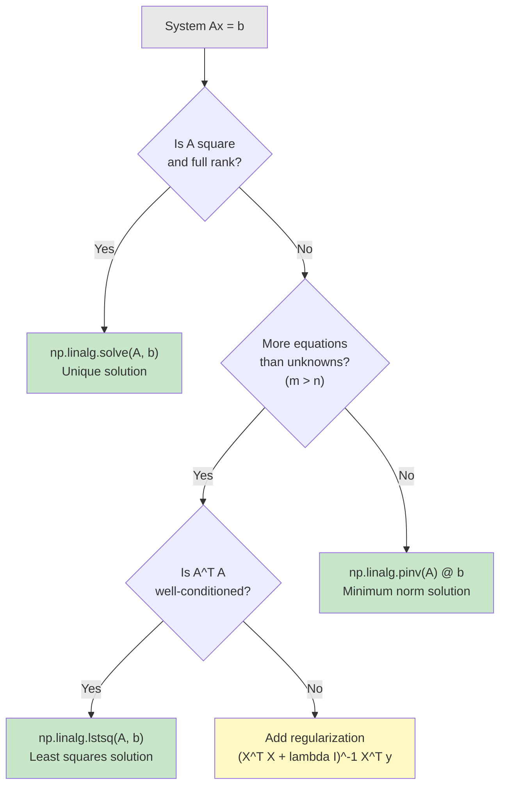

# Chapter 5: Systems of Linear Equations

> **Building On** -- You've seen matrices as transformations: multiply a matrix by a vector and you get a new vector. Now flip the question: given the output, can you find the input? Given data and predictions, can you find the weights? That's solving a system of linear equations.

## The Problem That Starts Everything

Your linear regression model has 100 features and 10,000 data points. Finding the optimal weights means solving a system of 100 equations simultaneously. How do you do that efficiently?

Your first instinct might be substitution -- solve equation 1 for w_1, plug it into equation 2, solve for w_2, and so on. That works fine for 2 equations. With 100 equations, you'd be drowning in algebraic spaghetti. And with 10,000 data points generating those equations? Forget about it.

This is where linear algebra earns its keep. Instead of wrestling with individual equations, you stack everything into a matrix equation and let algorithms do the heavy lifting. The core insight: **every system of linear equations is just one matrix equation, Ax = b**, and decades of numerical methods exist to solve it fast.

### The Running Example: Linear Regression's Normal Equation

Here is the thread that ties this entire chapter together. When you train a linear regression model, you are looking for weights **w** that minimize the squared error between your predictions X**w** and the actual targets **y**. Calculus says the minimum occurs when:

$$\mathbf{X}^T\mathbf{X}\mathbf{w} = \mathbf{X}^T\mathbf{y}$$

This is called the **normal equation**. Read it carefully: it is literally a system of linear equations in the form A**x** = **b**, where A = X^T X, the unknown vector is **w**, and the right-hand side is X^T **y**. Solving it gives you the optimal weights. Everything in this chapter -- rank, solvability, Gaussian elimination, least squares -- is the machinery that makes this work.

---

## From Equations to Matrix Form

Let's start with something small and concrete. Two equations, two unknowns:

$$\begin{align}
2x + 3y &= 8 \\
x - y &= 1
\end{align}$$

You could solve this by substitution or elimination by hand. But watch what happens when you write it as a matrix equation:

$$\begin{bmatrix} 2 & 3 \\ 1 & -1 \end{bmatrix} \begin{bmatrix} x \\ y \end{bmatrix} = \begin{bmatrix} 8 \\ 1 \end{bmatrix}$$

That's **Ax = b**. The matrix A holds all the coefficients, **x** holds the unknowns, and **b** holds the right-hand sides. This isn't just notational convenience -- it lets you use the same algorithm whether you have 2 unknowns or 2,000.

**Translation:** Think of A as the "recipe" matrix. Each row says "combine the unknowns in these proportions and you should get this result." Solving the system means finding the unknowns that satisfy every row simultaneously.

> **You Already Know This: Dependency Resolution**
>
> Solving Ax = b is like what a package manager does when it resolves dependencies. You have a set of constraints (each equation) that must all be satisfied at once. The "solution" is an assignment of values (package versions) that makes every constraint happy. Sometimes there is exactly one valid assignment, sometimes there are many, and sometimes the constraints are contradictory and no solution exists.

### The General Form

A system of m equations with n unknowns:

$$\begin{align}
a_{11}x_1 + a_{12}x_2 + \cdots + a_{1n}x_n &= b_1 \\
a_{21}x_1 + a_{22}x_2 + \cdots + a_{2n}x_n &= b_2 \\
&\vdots \\
a_{m1}x_1 + a_{m2}x_2 + \cdots + a_{mn}x_n &= b_m
\end{align}$$

compresses into:

$$\mathbf{Ax} = \mathbf{b}$$

where:
- **A** is in R^{m x n} -- the **coefficient matrix** (m rows of constraints, n columns of unknowns)
- **x** is in R^n -- the **unknown vector** (what you are solving for)
- **b** is in R^m -- the **right-hand side** (the target values)

**Translation:** m is the number of constraints (data points, equations). n is the number of unknowns (features, weights). When m = n and A is "well-behaved," you get exactly one solution. When m != n, things get interesting -- and that is where ML lives.

### Code: Your First System

```python
import numpy as np

# System: 2x + 3y = 8, x - y = 1
A = np.array([[2, 3],
              [1, -1]])
b = np.array([8, 1])

# np.linalg.solve is the go-to for square systems
x = np.linalg.solve(A, b)
print(f"Solution: x = {x[0]:.1f}, y = {x[1]:.1f}")
# Solution: x = 2.2, y = 1.2

# Always verify: does Ax actually equal b?
print(f"Verification: A @ x = {A @ x}")
# Verification: A @ x = [8. 1.]
```

Why `np.linalg.solve` instead of computing the inverse? Two reasons: it is faster (O(n^3) vs a larger constant for inversion), and it is more numerically stable. Under the hood, it uses LU decomposition, not matrix inversion.

```python
# DON'T do this (slower, less stable):
x_bad = np.linalg.inv(A) @ b

# DO this:
x_good = np.linalg.solve(A, b)

# Same answer, but solve() is the professional choice
print(f"Inverse method:  {x_bad}")
print(f"Solve method:    {x_good}")
```

---

## Three Possible Outcomes: A Geometric View

Each linear equation in 2D defines a line. The solution is where lines intersect. There are exactly three possible outcomes:

```
  UNIQUE SOLUTION           NO SOLUTION            INFINITE SOLUTIONS
  (lines cross)            (lines parallel)         (lines overlap)

        y                      y                        y
        |    /                 |                         |
        |   /                  |  / /                    |
        |  /                   | / /                     |
        | /                    |/ /                      |
  ------*--------x       ----//-/------x         ========*========x
       /|                    / /                         |
      / |                   / /                          |
     /  |                  / /                           |
    /   |                                                |

  rank(A) = rank([A|b]) = n    rank(A) < rank([A|b])    rank(A) = rank([A|b]) < n
  One exact answer.            Constraints contradict    Constraints are redundant.
                               each other.              Many answers work.
```

**Translation:** In 3D, each equation defines a plane. Three planes can meet at a single point (unique solution), form a line of intersection (infinite solutions), or never all meet at once (no solution). The pattern generalizes to any number of dimensions.

### How This Maps to ML

- **Unique solution:** Your system has exactly enough independent equations to pin down every unknown. This is the ideal case for a square, invertible system.
- **No solution:** You have contradictory constraints. In ML, this is the typical case -- you have more data points than parameters, and the data does not lie perfectly on a line/plane. That is why we use least squares.
- **Infinite solutions:** You have redundant constraints or more unknowns than equations. Your model is underspecified -- multiple weight vectors fit equally well. This is where regularization comes in.

---

## Rank: How Many Constraints Actually Matter

Not all equations in your system carry independent information. If one equation is just a multiple of another, it does not add a new constraint. The **rank** of a matrix counts how many linearly independent rows (or equivalently, columns) it has:

$$\text{rank}(\mathbf{A}) = \dim(\text{column space of } \mathbf{A})$$

> **You Already Know This: Degrees of Freedom**
>
> Rank is like the number of independent configuration variables in a system. If you have a struct with 5 fields, but 2 of them are always derived from the other 3, your system really has 3 degrees of freedom, not 5. Rank tells you the same thing about your equations: how many of them are genuinely independent constraints.

**Key properties:**
- rank(A) <= min(m, n) -- you can't have more independent equations than you have equations or unknowns
- **Full row rank:** rank(A) = m (every equation adds information)
- **Full column rank:** rank(A) = n (every unknown is constrained)
- **Full rank** (square matrix): rank(A) = n, meaning A is invertible and the system has a unique solution

### The Rank Test for Solvability (Rouche-Capelli Theorem)

Form the **augmented matrix** [A|b] by appending the right-hand side column to A. Then:

| Condition | What It Means | Result |
|-----------|---------------|--------|
| rank(A) < rank([A\|b]) | b introduces new information not in A's column space | **No solution** |
| rank(A) = rank([A\|b]) = n | All unknowns are pinned down | **Unique solution** |
| rank(A) = rank([A\|b]) < n | Some unknowns are free | **Infinite solutions** |

**Translation:** If b lies in the column space of A, a solution exists. If b also fully constrains all n unknowns (rank = n), the solution is unique.

### Code: Checking Rank and Solvability

```python
import numpy as np

# Full rank -- unique solution exists
A_full = np.array([[1, 2],
                   [3, 4]])
print(f"Full rank matrix rank: {np.linalg.matrix_rank(A_full)}")  # 2

# Rank-deficient -- rows are linearly dependent
A_deficient = np.array([[1, 2],
                        [2, 4]])  # Row 2 = 2 * Row 1
print(f"Rank-deficient matrix rank: {np.linalg.matrix_rank(A_deficient)}")  # 1

# Inconsistent system: x + y = 1 AND x + y = 3 (parallel lines)
A_inc = np.array([[1, 1],
                  [1, 1]])
b_inc = np.array([1, 3])

rank_A = np.linalg.matrix_rank(A_inc)
rank_Ab = np.linalg.matrix_rank(np.column_stack([A_inc, b_inc]))
print(f"\nInconsistent system:")
print(f"  rank(A) = {rank_A}, rank([A|b]) = {rank_Ab}")
print(f"  Solvable? {rank_A == rank_Ab}")  # False
# The system says x + y must equal both 1 and 3. Contradiction.
```

---

## Gaussian Elimination: The Algorithm Behind Solving Systems

You've been using `np.linalg.solve`, but what is it actually doing? Under the hood, the workhorse algorithm is **Gaussian elimination** -- systematically applying row operations to transform the system into a simple triangular form that you can solve by back-substitution.

> **You Already Know This: Divide and Conquer**
>
> Gaussian elimination follows the same strategy as merge sort. You take a messy problem (unsorted array / tangled system of equations) and progressively break it into simpler subproblems. Each row operation "eliminates" one variable from one equation, just as each merge step puts elements in order. By the time you're done, the answer practically reads itself off the result.

### The Three Row Operations

These are the legal moves. They change the form of the system without changing its solution:

1. **Swap two rows** -- reorder the equations
2. **Multiply a row by a nonzero scalar** -- rescale an equation
3. **Add a multiple of one row to another** -- the elimination step

### Step-by-Step Example

Solve the system:
$$\begin{align}
x + 2y + z &= 9 \\
2x - y + 3z &= 8 \\
x + y + z &= 6
\end{align}$$

Write the augmented matrix and apply row operations to get upper triangular form:

```
Step 0: Starting augmented matrix [A|b]

    [ 1   2   1 |  9 ]
    [ 2  -1   3 |  8 ]
    [ 1   1   1 |  6 ]

Step 1: Eliminate x from rows 2 and 3
    R2 <- R2 - 2*R1
    R3 <- R3 - 1*R1

    [ 1   2   1 |  9 ]
    [ 0  -5   1 |-10 ]
    [ 0  -1   0 | -3 ]

Step 2: Eliminate y from row 3
    R3 <- R3 - (1/5)*R2

    R3 = [0, -1, 0 | -3] - (1/5)*[0, -5, 1 | -10]
       = [0, -1, 0 | -3] - [0, -1, 1/5 | -2]
       = [0,  0, -1/5 | -1]

    [ 1   2     1   |  9 ]
    [ 0  -5     1   |-10 ]
    [ 0   0   -1/5  | -1 ]

Step 3: Back-substitution (read from bottom up)
    z:  (-1/5)z = -1        =>  z = 5
    y:  -5y + (1)(5) = -10  =>  -5y = -15  =>  y = 3
    x:  x + 2(3) + 5 = 9   =>  x = 9 - 6 - 5 = -2
```

Does x = -2 seem surprising? Verify: 1(-2) + 2(3) + 1(5) = -2 + 6 + 5 = 9. Check. 2(-2) - 1(3) + 3(5) = -4 - 3 + 15 = 8. Check. (-2) + 3 + 5 = 6. Check. The math works -- trust the algorithm, not your gut.

Now confirm with code:

```python
import numpy as np

A = np.array([[1, 2, 1],
              [2, -1, 3],
              [1, 1, 1]], dtype=float)
b = np.array([9, 8, 6], dtype=float)

x = np.linalg.solve(A, b)
print(f"Solution: x={x[0]:.1f}, y={x[1]:.1f}, z={x[2]:.1f}")
# Solution: x=-2.0, y=3.0, z=5.0

print(f"Verification: A @ x = {A @ x}")
# Verification: A @ x = [9. 8. 6.]
```

The hand calculation and NumPy agree. But notice how even this small 3x3 example required careful bookkeeping. With 100 unknowns, you would never do this by hand. You call `np.linalg.solve` and let LAPACK's battle-tested implementation handle it.

Here is what matters conceptually:

```
Gaussian Elimination Flow:

    Full system              Triangular form          Solution
    +-----------+            +-----------+           +-------+
    | * * * | * |  row ops   | * * * | * |  back     | x = ? |
    | * * * | * |  ------->  | 0 * * | * |  sub      | y = ? |
    | * * * | * |            | 0 0 * | * |  ------>  | z = ? |
    +-----------+            +-----------+           +-------+

    O(n^3) operations -- same complexity as matrix multiplication
```

The key ideas:
1. Use row operations to create zeros below the diagonal
2. The result is an **upper triangular** system
3. Solve from the bottom up (back-substitution)
4. Total cost: O(n^3) -- not O(n!) as you'd get from Cramer's rule

---

## Overdetermined Systems: The ML Workhorse

Here is where it gets real for ML. In practice, you almost never have a square system with exactly one solution. You have **more equations than unknowns** -- thousands of data points, but only dozens of parameters.

> **You Already Know This: Overconstrained Layouts**
>
> An overdetermined system is like an overconstrained UI layout. You have a view that must be 100px from the left, 100px from the right, AND exactly 500px wide -- but the screen is 800px. You can't satisfy all three constraints exactly. Instead, the layout engine finds the "best compromise." That's exactly what least squares does for linear equations.

### Why No Exact Solution Exists

With 4 data points and 2 parameters (slope and intercept), you are asking a line to pass through all 4 points. Unless those points are perfectly collinear, no line does this:

```
    y
    |           x (3, 5)
    |        .
    |      x (2, 3)         <-- best fit line doesn't
    |    .                       hit any point exactly
    |  x (1, 2)
    | .
    x (0, 1)
    +------------------x
```

> **Common Mistake:** "An overdetermined system (more equations than unknowns) usually has NO exact solution -- that's why we minimize error instead (least squares)." Many beginners assume that more equations means a better-determined system. It does mean more information, but it also means you almost certainly can't satisfy every equation exactly.

### Least Squares: Minimizing the Error

When you can't solve Ax = b exactly, find the x that gets as close as possible:

$$\min_\mathbf{x} \|\mathbf{Ax} - \mathbf{b}\|_2^2$$

**Translation:** "Find the x that minimizes the sum of squared differences between what the system predicts (Ax) and what you actually observed (b)." This is precisely the objective function of linear regression.

Taking the derivative and setting it to zero gives the **normal equations**:

$$\mathbf{A}^T\mathbf{A}\mathbf{x} = \mathbf{A}^T\mathbf{b}$$

If A has full column rank (all your features are independent), the solution is:

$$\mathbf{x} = (\mathbf{A}^T\mathbf{A})^{-1}\mathbf{A}^T\mathbf{b}$$

The matrix (A^T A)^{-1} A^T is called the **Moore-Penrose pseudoinverse**, denoted A^+. It generalizes the concept of "dividing by a matrix" to non-square matrices.

### Code: Linear Regression as Least Squares

```python
import numpy as np

# 4 data points: (1, 2), (2, 3), (3, 5), (4, 4)
# Model: y = ax + c  (2 unknowns: slope a, intercept c)
X_points = np.array([1, 2, 3, 4])
y_points = np.array([2, 3, 5, 4])

# Design matrix: each row is [x_i, 1]
A = np.column_stack([X_points, np.ones(len(X_points))])
print(f"Design matrix A (4 equations, 2 unknowns):\n{A}")
# [[1. 1.]
#  [2. 1.]
#  [3. 1.]
#  [4. 1.]]

# --- Method 1: np.linalg.lstsq (recommended) ---
coeffs, residuals, rank, s = np.linalg.lstsq(A, y_points, rcond=None)
print(f"\nBest fit: y = {coeffs[0]:.3f}x + {coeffs[1]:.3f}")
# Best fit: y = 0.800x + 1.500

# --- Method 2: Normal equations (A^T A)x = A^T b ---
ATA = A.T @ A
ATb = A.T @ y_points
coeffs_normal = np.linalg.solve(ATA, ATb)
print(f"Normal eqns: y = {coeffs_normal[0]:.3f}x + {coeffs_normal[1]:.3f}")
# Same answer: y = 0.800x + 1.500

# --- Method 3: Pseudoinverse ---
A_pinv = np.linalg.pinv(A)
coeffs_pinv = A_pinv @ y_points
print(f"Pseudoinverse: y = {coeffs_pinv[0]:.3f}x + {coeffs_pinv[1]:.3f}")
# Same answer: y = 0.800x + 1.500

# Show the residuals (errors)
predictions = A @ coeffs
print(f"\nPredictions: {predictions}")
print(f"Residuals:   {y_points - predictions}")
```

### The Running Example: Full Linear Regression

Now let's connect it all the way back to our running example with the normal equation. Here is linear regression from scratch with multiple features:

```python
import numpy as np

# --- Generate synthetic data ---
np.random.seed(42)
n_samples = 100
n_features = 3

X = np.random.randn(n_samples, n_features)
true_weights = np.array([2.0, -1.0, 0.5])
true_bias = 3.0
y = X @ true_weights + true_bias + 0.1 * np.random.randn(n_samples)

# Add bias column: X becomes [X | 1]
X_with_bias = np.column_stack([X, np.ones(n_samples)])

# --- This is the normal equation: (X^T X)w = X^T y ---
XTX = X_with_bias.T @ X_with_bias
XTy = X_with_bias.T @ y
w = np.linalg.solve(XTX, XTy)

print(f"True weights: {true_weights}, bias: {true_bias}")
print(f"Learned weights: {w[:3].round(4)}, bias: {w[3]:.4f}")
# Very close to true values!

# R-squared
predictions = X_with_bias @ w
ss_res = np.sum((y - predictions) ** 2)
ss_tot = np.sum((y - np.mean(y)) ** 2)
r_squared = 1 - ss_res / ss_tot
print(f"R-squared: {r_squared:.4f}")
# R-squared: ~0.998 (very close to 1 -- the model recovers the true weights)
```

**Translation:** X^T X is a (n_features x n_features) matrix -- much smaller than the original (n_samples x n_features) data matrix. The normal equation reduces a problem with 100 x 10,000 entries down to a 100 x 100 system. That's the power of the matrix formulation.

---

## Underdetermined Systems: More Unknowns Than Equations

When m < n (fewer equations than unknowns), you have **infinitely many solutions**. Think of fitting 10 parameters with only 3 data points -- many different parameter vectors will fit perfectly.

Among all the solutions, the **minimum norm solution** picks the one with the smallest magnitude:

$$\mathbf{x} = \mathbf{A}^T(\mathbf{AA}^T)^{-1}\mathbf{b}$$

```python
import numpy as np

# One equation, three unknowns: x + y + z = 6
A = np.array([[1, 1, 1]])
b = np.array([6])

# Infinitely many solutions: (6,0,0), (0,6,0), (2,2,2), ...
# The pseudoinverse picks the one with minimum norm
x_min = np.linalg.pinv(A) @ b
print(f"Minimum norm solution: {x_min}")      # [2. 2. 2.]
print(f"Verification: sum = {np.sum(x_min)}")  # 6.0
print(f"Norm: {np.linalg.norm(x_min):.4f}")    # 3.4641
```

**Translation:** Among all the solutions, (2, 2, 2) has the smallest length. The pseudoinverse distributes the "load" as evenly as possible. In ML terms, this is a form of implicit regularization -- preferring "simpler" (lower-norm) models.

---

## When Things Go Wrong: Rank Deficiency and Conditioning

Sometimes your system is technically solvable, but practically unstable. Two concepts help you diagnose this:

### The Condition Number

The **condition number** measures how sensitive the solution is to small perturbations in the input. A condition number near 1 is great; above 10^10 is a red flag.

```python
import numpy as np

# Well-conditioned matrix
A_good = np.array([[1, 0],
                    [0, 1]])
print(f"Identity condition number: {np.linalg.cond(A_good):.1f}")
# 1.0 -- perfect

# Ill-conditioned matrix
A_bad = np.array([[1, 1],
                   [1, 1.0001]])
print(f"Nearly singular condition number: {np.linalg.cond(A_bad):.0f}")
# ~40000 -- tiny input changes cause huge output changes

# Practical check
def check_system_health(A):
    cond = np.linalg.cond(A)
    rank = np.linalg.matrix_rank(A)
    n = min(A.shape)
    print(f"  Shape: {A.shape}, Rank: {rank}/{n}, Condition: {cond:.2e}")
    if cond > 1e10:
        print("  WARNING: Ill-conditioned! Consider regularization.")
    if rank < n:
        print("  WARNING: Rank-deficient! System may not have a unique solution.")

check_system_health(A_good)
check_system_health(A_bad)
```

### Regularization: The Fix for Ill-Conditioned Systems

When X^T X is nearly singular (high condition number or rank-deficient), the normal equation solution is unstable. **Ridge regression** adds a small identity matrix to guarantee invertibility:

$$\mathbf{w} = (\mathbf{X}^T\mathbf{X} + \lambda\mathbf{I})^{-1}\mathbf{X}^T\mathbf{y}$$

**Translation:** Adding lambda * I to X^T X is like adding a small positive number to every diagonal entry. This bumps the smallest eigenvalues away from zero, making the matrix safely invertible. The trade-off: you introduce a small bias in exchange for dramatically reducing variance.

```python
import numpy as np

# Simulate a rank-deficient feature matrix
np.random.seed(42)
X = np.random.randn(50, 3)
X[:, 2] = X[:, 0] + X[:, 1] + 0.001 * np.random.randn(50)  # Feature 3 ~ Feature 1 + Feature 2
y = np.random.randn(50)

X_bias = np.column_stack([X, np.ones(50)])

# Normal equation: unstable
XTX = X_bias.T @ X_bias
print(f"Condition number (no regularization): {np.linalg.cond(XTX):.2e}")

# Ridge regularization
lam = 1.0
XTX_ridge = XTX + lam * np.eye(XTX.shape[0])
print(f"Condition number (with ridge, lambda={lam}): {np.linalg.cond(XTX_ridge):.2e}")

w_ridge = np.linalg.solve(XTX_ridge, X_bias.T @ y)
print(f"Ridge weights: {w_ridge.round(4)}")
```

---

## Choosing Your Solver: A Decision Flowchart



**Quick reference:**

| Situation | Method | NumPy Function |
|-----------|--------|----------------|
| Square, invertible | Direct solve | `np.linalg.solve(A, b)` |
| Overdetermined (m > n) | Least squares | `np.linalg.lstsq(A, b)` |
| Underdetermined (m < n) | Minimum norm | `np.linalg.pinv(A) @ b` |
| Ill-conditioned | Regularized solve | `np.linalg.solve(ATA + lam*I, ATb)` |
| Any case | Pseudoinverse | `np.linalg.pinv(A) @ b` |

---

## ML Connections: Where Systems of Equations Appear

| ML Problem | Linear System | What You're Solving For |
|------------|---------------|------------------------|
| Linear regression | (X^T X)w = X^T y | Optimal weights |
| Ridge regression | (X^T X + lambda I)w = X^T y | Regularized weights |
| Gaussian processes | K * alpha = y | Posterior mean coefficients |
| Neural networks (at convergence) | Gradient = 0 | Optimal parameters |
| Sparse coding | Ax = b with sparsity on x | Sparse representation |

Every one of these boils down to some form of "solve Ax = b." The differences are in what A looks like, whether you need regularization, and how large the system is.

---

## Common Mistakes

1. **Computing inverses explicitly.** Use `np.linalg.solve()` instead of `np.linalg.inv(A) @ b`. The inverse is slower, less stable, and you almost never need the actual inverse matrix.

2. **Ignoring numerical stability.** Near-singular matrices amplify floating-point errors. Always check the condition number before trusting your solution.

3. **Confusing "overdetermined" with "well-determined."** An overdetermined system (more equations than unknowns) usually has NO exact solution. That's why we minimize error instead. More data is better, but it means you need least squares, not direct solve.

4. **Forgetting to add the bias term.** When setting up the design matrix for regression, remember to append a column of ones for the intercept. Without it, you're forcing the line through the origin.

5. **Ignoring rank deficiency.** If features are linearly dependent (or nearly so), your solution will be unstable. Check rank and condition number, and use regularization when needed.

---

## Exercises

### Exercise 1: Solve a Square System

Solve the system using `np.linalg.solve` and verify your answer:

$$\begin{align}
x + 2y + z &= 9 \\
2x - y + 3z &= 8 \\
x + y + z &= 6
\end{align}$$

**Solution:**
```python
import numpy as np

A = np.array([[1, 2, 1],
              [2, -1, 3],
              [1, 1, 1]])
b = np.array([9, 8, 6])

x = np.linalg.solve(A, b)
print(f"Solution: x={x[0]:.1f}, y={x[1]:.1f}, z={x[2]:.1f}")
# Solution: x=-2.0, y=3.0, z=5.0

# Verify
print(f"Verification: {A @ x}")  # Should equal [9, 8, 6]
```

### Exercise 2: Fit a Line with Least Squares

Fit a line y = mx + c to points: (0, 1), (1, 3), (2, 4), (3, 5), (4, 6). Use both `lstsq` and the normal equations.

**Solution:**
```python
import numpy as np

X_points = np.array([0, 1, 2, 3, 4])
y_points = np.array([1, 3, 4, 5, 6])

A = np.column_stack([X_points, np.ones(len(X_points))])

# Method 1: lstsq
coeffs, *_ = np.linalg.lstsq(A, y_points, rcond=None)
print(f"lstsq:          y = {coeffs[0]:.2f}x + {coeffs[1]:.2f}")

# Method 2: Normal equations
ATA = A.T @ A
ATb = A.T @ y_points
coeffs_ne = np.linalg.solve(ATA, ATb)
print(f"Normal eqns:    y = {coeffs_ne[0]:.2f}x + {coeffs_ne[1]:.2f}")
# Both give: y = 1.20x + 1.40
```

### Exercise 3: Diagnose a System

Determine if this system has a solution, and if not, find the least squares approximation:

$$\begin{align}
x + y &= 2 \\
2x + 2y &= 5
\end{align}$$

**Solution:**
```python
import numpy as np

A = np.array([[1, 1],
              [2, 2]])
b = np.array([2, 5])

rank_A = np.linalg.matrix_rank(A)
rank_Ab = np.linalg.matrix_rank(np.column_stack([A, b]))

print(f"rank(A) = {rank_A}")      # 1
print(f"rank([A|b]) = {rank_Ab}") # 2
print(f"Solvable? {rank_A == rank_Ab}")  # False

# The lines x+y=2 and x+y=2.5 are parallel -- no intersection
# But we can find the best approximation:
x_ls, *_ = np.linalg.lstsq(A, b, rcond=None)
print(f"Least squares approximation: {x_ls}")
# Finds the x that minimizes ||Ax - b||^2
```

### Exercise 4: Regularization Experiment

Create a design matrix with near-collinear features. Compare the condition number and solution stability with and without ridge regularization.

**Solution:**
```python
import numpy as np

np.random.seed(0)
X = np.random.randn(50, 2)
X = np.column_stack([X, X[:, 0] + 0.001 * np.random.randn(50)])  # Nearly collinear
y = np.random.randn(50)

XTX = X.T @ X
print(f"Condition number (raw): {np.linalg.cond(XTX):.2e}")

for lam in [0.001, 0.01, 0.1, 1.0]:
    XTX_reg = XTX + lam * np.eye(3)
    w = np.linalg.solve(XTX_reg, X.T @ y)
    print(f"lambda={lam:.3f}  cond={np.linalg.cond(XTX_reg):.2e}  w={w.round(3)}")
```

---

## Summary

- Every system of linear equations compresses into **Ax = b**. This is not just notation -- it unlocks matrix algorithms that scale.
- **Rank** tells you how many of your equations are genuinely independent. It determines whether a solution exists and whether it's unique.
- **Gaussian elimination** transforms the system to triangular form in O(n^3). Use `np.linalg.solve()`, never hand computation.
- **Overdetermined systems** (m > n) typically have no exact solution. **Least squares** finds the best approximation by minimizing ||Ax - b||^2.
- **The normal equation** (X^T X)w = X^T y is the mathematical core of linear regression. Solving it gives you optimal weights.
- **Underdetermined systems** (m < n) have infinitely many solutions. The **pseudoinverse** picks the minimum-norm one.
- **Condition number** tells you if your system is numerically stable. When it's not, **regularization** (ridge regression) saves you.
- Use `np.linalg.solve()` for square systems, `np.linalg.lstsq()` for overdetermined, and `np.linalg.pinv()` as a universal fallback.

---

> **What's Next** -- Systems of equations have special solutions. Some directions in the data resist change, staying fixed even after transformation. These are eigenvectors -- and they're the key to understanding PCA and many other ML techniques.
