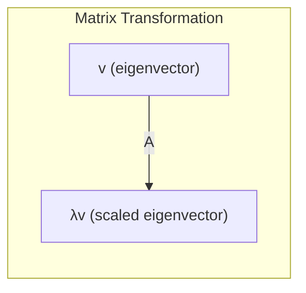

# Chapter 6: Eigenvalues and Eigenvectors

## Intuition

**Eigenvectors** are special directions that a matrix transformation simply stretches or shrinks, without rotating. **Eigenvalues** tell you by how much. When you multiply a matrix by one of its eigenvectors, the result points in the same direction (or exactly opposite) - it just gets scaled.

**Real-world analogies:**
- **Spinning top**: The axis of rotation is an eigenvector - it doesn't change direction when the top spins
- **Stress on a beam**: Principal stress directions are eigenvectors; the beam stretches/compresses along these axes
- **Population dynamics**: The dominant eigenvalue determines long-term population growth or decay
- **PageRank**: The principal eigenvector of the web graph determines page importance

**Why this matters for ML:**
Eigenanalysis reveals the fundamental structure of data. PCA finds eigenvectors of the covariance matrix to identify directions of maximum variance. Eigenvalues determine if optimization converges and how fast.

## Visual Explanation

### What Makes Eigenvectors Special

Most vectors get both rotated and scaled by a matrix. Eigenvectors only get scaled:

```
Regular vector:              Eigenvector:
    v                            v
   /                             |
  /   A                          |  A
 /    ->   rotated              |  ->  same direction,
                                |       just scaled
    Av                          Av
     \                           |
      \                          |
```

### Geometric Interpretation



For an eigenvector $\mathbf{v}$ with eigenvalue $\lambda$:
$$\mathbf{Av} = \lambda\mathbf{v}$$

The matrix $\mathbf{A}$ acts like scalar multiplication by $\lambda$ along the direction of $\mathbf{v}$.

### Effect of Eigenvalue Sign and Magnitude

| Eigenvalue $\lambda$ | Effect on Eigenvector |
|----------------------|----------------------|
| $\lambda > 1$ | Stretches (expands) |
| $0 < \lambda < 1$ | Shrinks (contracts) |
| $\lambda = 1$ | No change |
| $\lambda = 0$ | Collapses to zero |
| $\lambda < 0$ | Reverses direction and scales |
| Complex $\lambda$ | Rotation (won't cover in detail) |

## Mathematical Foundation

### Definition

A non-zero vector $\mathbf{v}$ is an **eigenvector** of matrix $\mathbf{A}$ if:
$$\mathbf{Av} = \lambda\mathbf{v}$$

where $\lambda$ is the corresponding **eigenvalue**.

**Rewriting:**
$$(\mathbf{A} - \lambda\mathbf{I})\mathbf{v} = \mathbf{0}$$

For non-zero solutions, the matrix $(\mathbf{A} - \lambda\mathbf{I})$ must be singular:
$$\det(\mathbf{A} - \lambda\mathbf{I}) = 0$$

This is the **characteristic equation**. Its solutions are the eigenvalues.

### Computing Eigenvalues and Eigenvectors

For a $2 \times 2$ matrix:
$$\mathbf{A} = \begin{bmatrix} a & b \\ c & d \end{bmatrix}$$

The characteristic equation is:
$$\det\begin{bmatrix} a-\lambda & b \\ c & d-\lambda \end{bmatrix} = (a-\lambda)(d-\lambda) - bc = 0$$

$$\lambda^2 - (a+d)\lambda + (ad-bc) = 0$$

$$\lambda^2 - \text{trace}(\mathbf{A})\lambda + \det(\mathbf{A}) = 0$$

Use the quadratic formula to find $\lambda$, then solve $(\mathbf{A} - \lambda\mathbf{I})\mathbf{v} = \mathbf{0}$ for each $\lambda$.

### Spectral Decomposition (Eigendecomposition)

For a **diagonalizable** matrix with $n$ linearly independent eigenvectors:
$$\mathbf{A} = \mathbf{V}\boldsymbol{\Lambda}\mathbf{V}^{-1}$$

where:
- $\mathbf{V}$ has eigenvectors as columns
- $\boldsymbol{\Lambda}$ is diagonal with eigenvalues on the diagonal

For **symmetric** matrices (common in ML), eigenvectors are orthogonal:
$$\mathbf{A} = \mathbf{V}\boldsymbol{\Lambda}\mathbf{V}^T$$

This is the **spectral theorem**.

### Properties of Eigenvalues

For an $n \times n$ matrix $\mathbf{A}$:
- Sum of eigenvalues = trace of $\mathbf{A}$: $\sum_i \lambda_i = \text{trace}(\mathbf{A})$
- Product of eigenvalues = determinant of $\mathbf{A}$: $\prod_i \lambda_i = \det(\mathbf{A})$
- Eigenvalues of $\mathbf{A}^k$ are $\lambda^k$
- Eigenvalues of $\mathbf{A}^{-1}$ (if it exists) are $1/\lambda$

### Stability Interpretation

Eigenvalues determine the behavior of iterative systems:

Consider repeated application $\mathbf{x}_{n+1} = \mathbf{Ax}_n$:
- $|\lambda| < 1$ for all eigenvalues: system **converges** to zero
- $|\lambda| > 1$ for any eigenvalue: system **diverges**
- $|\lambda| = 1$: system is **stable** (neither grows nor shrinks)

This is crucial for:
- Checking if gradient descent will converge
- Analyzing recurrent neural network stability
- Understanding Markov chain convergence

## Code Example

```python
import numpy as np

print("=== Basic Eigenvalue Computation ===")
# Simple 2x2 matrix
A = np.array([[4, 2],
              [1, 3]])

eigenvalues, eigenvectors = np.linalg.eig(A)

print(f"Matrix A:\n{A}")
print(f"\nEigenvalues: {eigenvalues}")
print(f"\nEigenvectors (as columns):\n{eigenvectors}")


print("\n=== Verifying Av = λv ===")
for i in range(len(eigenvalues)):
    lam = eigenvalues[i]
    v = eigenvectors[:, i]

    Av = A @ v
    lambda_v = lam * v

    print(f"\nEigenvector {i+1}: v = {v}")
    print(f"Eigenvalue {i+1}: λ = {lam:.4f}")
    print(f"A @ v = {Av}")
    print(f"λ * v = {lambda_v}")
    print(f"Are they equal? {np.allclose(Av, lambda_v)}")


print("\n=== Symmetric Matrix (Orthogonal Eigenvectors) ===")
# Symmetric matrices have real eigenvalues and orthogonal eigenvectors
S = np.array([[4, 2],
              [2, 3]])

eigenvalues_S, eigenvectors_S = np.linalg.eigh(S)  # Use eigh for symmetric

print(f"Symmetric matrix S:\n{S}")
print(f"Eigenvalues: {eigenvalues_S}")
print(f"Eigenvectors:\n{eigenvectors_S}")

# Check orthogonality
v1, v2 = eigenvectors_S[:, 0], eigenvectors_S[:, 1]
print(f"\nv1 · v2 = {np.dot(v1, v2):.10f} (should be ~0)")
print(f"||v1|| = {np.linalg.norm(v1):.4f}, ||v2|| = {np.linalg.norm(v2):.4f}")


print("\n=== Spectral Decomposition ===")
# Reconstruct A from its eigendecomposition
V = eigenvectors
Lambda = np.diag(eigenvalues)
V_inv = np.linalg.inv(V)

A_reconstructed = V @ Lambda @ V_inv
print(f"Original A:\n{A}")
print(f"\nReconstructed A = V @ Λ @ V^(-1):\n{np.real(A_reconstructed)}")
print(f"\nAre they equal? {np.allclose(A, A_reconstructed)}")


print("\n=== Matrix Powers via Eigendecomposition ===")
# Computing A^10 efficiently
# A^k = V @ Λ^k @ V^(-1)
k = 10

# Direct computation
A_power_direct = np.linalg.matrix_power(A, k)

# Via eigendecomposition
Lambda_power = np.diag(eigenvalues**k)
A_power_eigen = V @ Lambda_power @ V_inv

print(f"A^{k} (direct):\n{A_power_direct}")
print(f"\nA^{k} (via eigendecomposition):\n{np.real(A_power_eigen).astype(int)}")


print("\n=== Stability Analysis ===")
# Check if repeated multiplication converges
def analyze_stability(matrix, name):
    eigenvalues = np.linalg.eigvals(matrix)
    max_abs_eigenvalue = np.max(np.abs(eigenvalues))

    print(f"\n{name}:")
    print(f"  Eigenvalues: {eigenvalues}")
    print(f"  Max |λ|: {max_abs_eigenvalue:.4f}")

    if max_abs_eigenvalue < 1:
        print("  Status: CONVERGES (all |λ| < 1)")
    elif max_abs_eigenvalue > 1:
        print("  Status: DIVERGES (some |λ| > 1)")
    else:
        print("  Status: STABLE (max |λ| = 1)")

# Converging system
A_converge = np.array([[0.5, 0.2],
                       [0.1, 0.3]])
analyze_stability(A_converge, "Converging system")

# Diverging system
A_diverge = np.array([[1.2, 0.3],
                      [0.1, 0.9]])
analyze_stability(A_diverge, "Diverging system")


print("\n=== ML Example: PCA Connection ===")
# Eigendecomposition of covariance matrix
np.random.seed(42)

# Generate correlated 2D data
mean = [0, 0]
cov = [[3, 1.5],
       [1.5, 1]]
data = np.random.multivariate_normal(mean, cov, 200)

# Compute covariance matrix from data
data_centered = data - np.mean(data, axis=0)
cov_matrix = (data_centered.T @ data_centered) / (len(data) - 1)

print(f"Covariance matrix:\n{cov_matrix}")

# Eigendecomposition
eigenvalues_cov, eigenvectors_cov = np.linalg.eigh(cov_matrix)

# Sort by eigenvalue (descending)
idx = np.argsort(eigenvalues_cov)[::-1]
eigenvalues_cov = eigenvalues_cov[idx]
eigenvectors_cov = eigenvectors_cov[:, idx]

print(f"\nPrincipal components (eigenvectors):\n{eigenvectors_cov}")
print(f"Variance explained (eigenvalues): {eigenvalues_cov}")
print(f"Total variance: {np.sum(eigenvalues_cov):.4f}")
print(f"Variance ratio: {eigenvalues_cov / np.sum(eigenvalues_cov)}")


print("\n=== Gradient Descent Learning Rate ===")
# The Hessian's eigenvalues determine optimal learning rate
# For quadratic loss: f(x) = 0.5 * x^T @ H @ x
# Optimal learning rate: 2 / (λ_max + λ_min)
# Maximum stable learning rate: 2 / λ_max

H = np.array([[10, 1],
              [1, 1]])  # Hessian (symmetric positive definite)

eigenvalues_H = np.linalg.eigvalsh(H)
lambda_max = np.max(eigenvalues_H)
lambda_min = np.min(eigenvalues_H)

optimal_lr = 2 / (lambda_max + lambda_min)
max_stable_lr = 2 / lambda_max
condition_number = lambda_max / lambda_min

print(f"Hessian eigenvalues: {eigenvalues_H}")
print(f"Optimal learning rate: {optimal_lr:.4f}")
print(f"Max stable learning rate: {max_stable_lr:.4f}")
print(f"Condition number: {condition_number:.2f} (higher = slower convergence)")
```

**Output:**
```
=== Basic Eigenvalue Computation ===
Matrix A:
[[4 2]
 [1 3]]

Eigenvalues: [5. 2.]

Eigenvectors (as columns):
[[ 0.89442719 -0.70710678]
 [ 0.4472136   0.70710678]]

=== Verifying Av = λv ===

Eigenvector 1: v = [0.89442719 0.4472136 ]
Eigenvalue 1: λ = 5.0000
A @ v = [4.47213595 2.23606798]
λ * v = [4.47213595 2.23606798]
Are they equal? True

Eigenvector 2: v = [-0.70710678  0.70710678]
Eigenvalue 2: λ = 2.0000
A @ v = [-1.41421356  1.41421356]
λ * v = [-1.41421356  1.41421356]
Are they equal? True

=== Symmetric Matrix (Orthogonal Eigenvectors) ===
Symmetric matrix S:
[[4 2]
 [2 3]]
Eigenvalues: [1.43844719 5.56155281]
Eigenvectors:
[[-0.61541221 -0.78820544]
 [ 0.78820544 -0.61541221]]

v1 · v2 = 0.0000000000 (should be ~0)
||v1|| = 1.0000, ||v2|| = 1.0000

=== Spectral Decomposition ===
Original A:
[[4 2]
 [1 3]]

Reconstructed A = V @ Λ @ V^(-1):
[[4. 2.]
 [1. 3.]]

Are they equal? True

=== Matrix Powers via Eigendecomposition ===
A^10 (direct):
[[1864134  1242756]
 [ 621378  1242756]]

A^10 (via eigendecomposition):
[[1864134 1242756]
 [ 621378 1242756]]

=== Stability Analysis ===

Converging system:
  Eigenvalues: [0.6 0.2]
  Max |λ|: 0.6000
  Status: CONVERGES (all |λ| < 1)

Diverging system:
  Eigenvalues: [1.24494897 0.85505103]
  Max |λ|: 1.2449
  Status: DIVERGES (some |λ| > 1)

=== ML Example: PCA Connection ===
Covariance matrix:
[[2.82925095 1.42494393]
 [1.42494393 0.94612961]]

Principal components (eigenvectors):
[[ 0.89129623 -0.45347384]
 [ 0.45347384  0.89129623]]
Variance explained (eigenvalues): [3.31606067 0.45931989]
Total variance: 3.7754
Variance ratio: [0.87831696 0.12168304]

=== Gradient Descent Learning Rate ===
Hessian eigenvalues: [ 0.90192379 10.09807621]
Optimal learning rate: 0.1818
Max stable learning rate: 0.1981
Condition number: 11.20 (higher = slower convergence)
```

## ML Relevance

### Where Eigenvalues/Eigenvectors Appear

| Application | Usage |
|-------------|-------|
| PCA | Eigenvectors of covariance matrix = principal components |
| Spectral clustering | Eigenvectors of graph Laplacian define clusters |
| PageRank | Principal eigenvector of web graph |
| Neural network init | Xavier/He initialization considers eigenvalue distribution |
| Recurrent networks | Eigenvalues determine gradient flow (vanishing/exploding) |
| Optimization | Hessian eigenvalues determine convergence rate |

### PCA: Principal Component Analysis

PCA finds the directions of maximum variance in data:

1. Center the data: $\mathbf{X}_c = \mathbf{X} - \bar{\mathbf{X}}$
2. Compute covariance matrix: $\mathbf{C} = \frac{1}{n-1}\mathbf{X}_c^T\mathbf{X}_c$
3. Find eigenvectors of $\mathbf{C}$: these are the **principal components**
4. Eigenvalues give the **variance explained** by each component

### Condition Number and Optimization

The **condition number** of a matrix:
$$\kappa(\mathbf{A}) = \frac{\lambda_{max}}{\lambda_{min}}$$

- High condition number = **ill-conditioned** = slow convergence
- This is why feature scaling is important!

## When to Use / Ignore

### When to Focus on Eigenanalysis

- **Dimensionality reduction**: PCA, spectral methods
- **Debugging optimization**: Checking if loss landscape is well-conditioned
- **Stability analysis**: Will iterative algorithms converge?
- **Feature importance**: Principal components rank feature relevance

### Common Pitfalls

1. **Expecting real eigenvalues**: Non-symmetric matrices can have complex eigenvalues

2. **Numerical issues with repeated eigenvalues**: Eigenvectors may not be unique

3. **Using `eig` for symmetric matrices**: Use `eigh` instead (more stable, guarantees real results)

4. **Confusing eigenvector columns vs rows**: NumPy returns eigenvectors as columns

5. **Forgetting to sort eigenvalues**: They're not automatically ordered by magnitude

## Exercises

### Exercise 1: Compute Eigenvalues
Find the eigenvalues and eigenvectors of:
$$\mathbf{A} = \begin{bmatrix} 3 & 1 \\ 0 & 2 \end{bmatrix}$$

**Solution:**
```python
A = np.array([[3, 1],
              [0, 2]])

eigenvalues, eigenvectors = np.linalg.eig(A)

print(f"Eigenvalues: {eigenvalues}")  # [3, 2]
print(f"Eigenvectors:\n{eigenvectors}")

# For triangular matrices, eigenvalues are the diagonal elements!
```

### Exercise 2: Verify Spectral Decomposition
For a symmetric matrix, verify that $\mathbf{A} = \mathbf{V}\boldsymbol{\Lambda}\mathbf{V}^T$.

**Solution:**
```python
A = np.array([[2, 1],
              [1, 2]])

eigenvalues, V = np.linalg.eigh(A)
Lambda = np.diag(eigenvalues)

# Reconstruct
A_reconstructed = V @ Lambda @ V.T

print(f"Original:\n{A}")
print(f"Reconstructed:\n{A_reconstructed}")
print(f"Equal? {np.allclose(A, A_reconstructed)}")  # True
```

### Exercise 3: Stability Check
Determine if the system $\mathbf{x}_{n+1} = \mathbf{Ax}_n$ converges, where:
$$\mathbf{A} = \begin{bmatrix} 0.8 & 0.1 \\ 0.2 & 0.7 \end{bmatrix}$$

**Solution:**
```python
A = np.array([[0.8, 0.1],
              [0.2, 0.7]])

eigenvalues = np.linalg.eigvals(A)
max_abs = np.max(np.abs(eigenvalues))

print(f"Eigenvalues: {eigenvalues}")  # [0.9, 0.6]
print(f"Max |λ|: {max_abs}")  # 0.9
print(f"Converges? {max_abs < 1}")  # True - system converges
```

## Summary

- **Eigenvectors** are special directions that matrices only scale (not rotate)
- **Eigenvalues** indicate the scaling factor: stretch ($|\lambda| > 1$), shrink ($|\lambda| < 1$), or reverse ($\lambda < 0$)
- The **characteristic equation** $\det(\mathbf{A} - \lambda\mathbf{I}) = 0$ gives eigenvalues
- **Spectral decomposition**: $\mathbf{A} = \mathbf{V}\boldsymbol{\Lambda}\mathbf{V}^{-1}$ factors a matrix into its eigenstructure
- **Symmetric matrices** have real eigenvalues and orthogonal eigenvectors
- **Stability**: $|\lambda| < 1$ for all eigenvalues means iterative systems converge
- **PCA** uses eigenvectors of the covariance matrix to find principal components
- The **condition number** (ratio of largest to smallest eigenvalue) affects optimization speed
- Use `np.linalg.eigh()` for symmetric matrices (more stable and faster)
