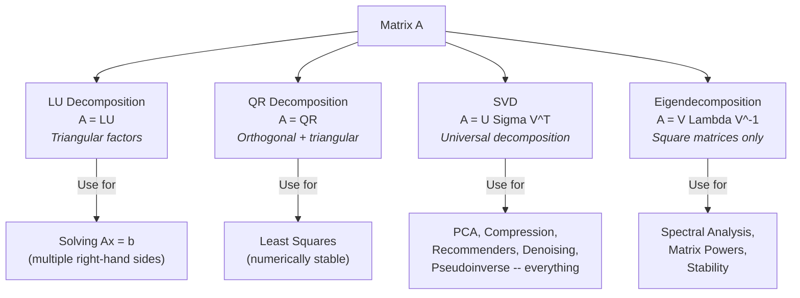

# Chapter 7: Matrix Decompositions

## Building On

Eigendecomposition revealed the hidden structure in square matrices. But most real data isn't square -- your dataset has more rows than columns (or vice versa). SVD generalizes eigendecomposition to *any* matrix shape. This chapter gives you the complete decomposition toolkit: LU, QR, SVD, and low-rank approximation -- the techniques that power everything from solving linear systems to Netflix recommendations.

---

## The Problem That Makes This Click

Netflix has a 200-million-user x 50,000-movie ratings matrix. It's mostly empty -- 99% missing entries. How do you fill in the blanks?

You decompose the matrix into simpler pieces. Specifically, you factor that giant sparse matrix into two small, dense matrices: one capturing *user preferences* and one capturing *movie characteristics*. Multiply them back together, and the missing entries get filled in with predictions.

That's SVD, and it powers every modern recommendation system.

But SVD is just one tool in the decomposition toolkit. Let's build up from the basics.

## Code First: See It Before You Prove It

Before any theory, let's see what decomposition *does*. Here's SVD on a movie ratings matrix in five lines:

```python
import numpy as np

# 5 users rated 4 movies (0 = unknown)
ratings = np.array([[5, 3, 0, 1],
                     [4, 0, 0, 1],
                     [1, 1, 0, 5],
                     [1, 0, 0, 4],
                     [0, 1, 5, 4]], dtype=float)

# Fill unknowns with mean for now (crude but illustrative)
ratings_filled = ratings.copy()
ratings_filled[ratings_filled == 0] = np.mean(ratings[ratings > 0])

# Decompose: users x taste-dimensions x movies
U, sigma, Vt = np.linalg.svd(ratings_filled, full_matrices=False)

# Reconstruct with only k=2 "taste dimensions"
k = 2
predicted = U[:, :k] @ np.diag(sigma[:k]) @ Vt[:k, :]

print("Original (0 = unknown):")
print(ratings)
print(f"\nPredicted (rank-{k} approximation):")
print(predicted.round(2))
print(f"\nPredicted rating for user 0, movie 2: {predicted[0, 2]:.2f}")
print(f"Predicted rating for user 1, movie 1: {predicted[1, 1]:.2f}")
```

**Output:**
```
Original (0 = unknown):
[[5. 3. 0. 1.]
 [4. 0. 0. 1.]
 [1. 1. 0. 5.]
 [1. 0. 0. 4.]
 [0. 1. 5. 4.]]

Predicted (rank-2 approximation):
[[4.53 2.54 2.56 1.81]
 [3.7  2.06 2.19 1.57]
 [1.8  1.12 3.11 3.63]
 [1.36 0.88 2.79 3.23]
 [1.22 0.93 4.5  4.77]]

Predicted rating for user 0, movie 2: 2.56
Predicted rating for user 1, movie 1: 2.06
```

That `np.linalg.svd` call just discovered two hidden "taste dimensions" in your data. User 0 probably wouldn't love movie 2 (predicted 2.56 out of 5). User 1 would give movie 1 about a 2.06. Not bad for five lines of code.

Now let's understand *why* this works.

---

## The Pattern: Decomposition = Factoring, But for Matrices

You already know factoring: 12 = 3 x 4. It breaks a number into simpler pieces that reveal structure (12 = 2^2 x 3 tells you the prime structure).

Matrix decomposition does the same thing, but for matrices. You take one complicated matrix and break it into a product of simpler matrices -- each with a specific structure (triangular, orthogonal, diagonal) that makes computation easier or reveals hidden patterns.

> **You Already Know This: Microservice Decomposition**
>
> Think of matrix decomposition like decomposing a monolith into microservices. A single, tangled matrix `A` gets factored into independent, composable pieces -- each with a clear responsibility. `L` handles forward dependencies, `U` handles backward ones. `Q` handles rotations, `R` handles scaling. Each piece is simpler to reason about, test, and compute with. Same instinct, different domain.

Here's the landscape of decompositions you'll use:



Let's tackle each one.

---

## LU Decomposition: Memoization for Linear Systems

### The Intuition

LU decomposition factors a square matrix into a **L**ower triangular matrix times an **U**pper triangular matrix:

$$\mathbf{A} = \mathbf{LU}$$

where:
- $\mathbf{L}$: Lower triangular (1s on the diagonal, nonzero entries only below)
- $\mathbf{U}$: Upper triangular (nonzero entries only above and on the diagonal)

**Translation:** Think of Gaussian elimination -- the row reduction you did in school. LU decomposition is just Gaussian elimination with bookkeeping. $\mathbf{U}$ is the row-echelon form, and $\mathbf{L}$ records every row operation you performed to get there.

> **You Already Know This: Memoization**
>
> LU decomposition is memoization for solving linear systems. Suppose you need to solve $\mathbf{Ax} = \mathbf{b}$ for *many different* vectors $\mathbf{b}$ (same coefficient matrix, different right-hand sides). Without LU, you'd redo Gaussian elimination from scratch each time -- $O(n^3)$ per solve. With LU, you pay $O(n^3)$ once to factor, then each new $\mathbf{b}$ costs only $O(n^2)$ -- just forward and backward substitution. It's caching the expensive work.

### How You Solve With LU

Given $\mathbf{Ax} = \mathbf{b}$:

1. **Factor once:** $\mathbf{A} = \mathbf{LU}$
2. **Forward substitution:** Solve $\mathbf{Ly} = \mathbf{b}$ (easy -- $\mathbf{L}$ is triangular)
3. **Backward substitution:** Solve $\mathbf{Ux} = \mathbf{y}$ (easy -- $\mathbf{U}$ is triangular)

In practice, you always use **LU with partial pivoting** (PLU) for numerical stability:

$$\mathbf{PA} = \mathbf{LU}$$

where $\mathbf{P}$ is a permutation matrix that reorders rows to avoid dividing by small numbers. Every serious implementation does this automatically.

### Code

```python
import numpy as np
from scipy import linalg

A = np.array([[2, 1, 1],
              [4, 3, 3],
              [8, 7, 9]], dtype=float)
b = np.array([4, 10, 24])

# Factor once
P, L, U = linalg.lu(A)

print(f"L (lower triangular):\n{L}")
print(f"\nU (upper triangular):\n{U}")
print(f"\nVerification P @ L @ U:\n{P @ L @ U}")

# Solve (the memoized way -- factor once, solve many)
lu, piv = linalg.lu_factor(A)
x = linalg.lu_solve((lu, piv), b)
print(f"\nSolution to Ax = b: {x}")
print(f"Verification A @ x = {A @ x}")
```

**Output:**
```
L (lower triangular):
[[1.    0.    0.   ]
 [0.5   1.    0.   ]
 [0.25  0.5   1.   ]]

U (upper triangular):
[[8. 7. 9.]
 [0. 0.5 1.5]
 [0. 0. 0.25]]

Verification P @ L @ U:
[[2. 1. 1.]
 [4. 3. 3.]
 [8. 7. 9.]]

Solution to Ax = b: [1. 1. 1.]
Verification A @ x = [ 4. 10. 24.]
```

### When You'll Use LU

- Solving the same system with many right-hand sides (e.g., inverting a matrix column-by-column)
- Computing determinants: $\det(\mathbf{A}) = \det(\mathbf{L}) \cdot \det(\mathbf{U}) = \prod u_{ii}$ (product of diagonal of $\mathbf{U}$, adjusted for permutations)
- Any time you need repeated solves of $\mathbf{Ax} = \mathbf{b}$ with the same $\mathbf{A}$

---

## QR Decomposition: Gram-Schmidt in a For Loop

### The Intuition

QR decomposition factors a matrix (any shape) into an **orthogonal** matrix times an upper **triangular** matrix:

$$\mathbf{A} = \mathbf{QR}$$

where:
- $\mathbf{Q}$: Orthogonal matrix ($\mathbf{Q}^T\mathbf{Q} = \mathbf{I}$) -- columns are orthonormal
- $\mathbf{R}$: Upper triangular

**Translation:** You're taking the columns of $\mathbf{A}$ and orthogonalizing them (making them perpendicular and unit-length) while keeping track of the scaling and projections in $\mathbf{R}$.

> **You Already Know This: Gram-Schmidt as a For Loop**
>
> QR decomposition is literally the Gram-Schmidt process from Chapter 5, packaged into matrix form. The algorithm walks through each column of $\mathbf{A}$, subtracts off the projections onto all previous orthogonal vectors, and normalizes. That's a for loop with an inner dot-product accumulator. The resulting orthogonal vectors become columns of $\mathbf{Q}$, and the projection coefficients fill in $\mathbf{R}$.
>
> ```
> for j in range(n):
>     q = A[:, j]
>     for i in range(j):
>         R[i, j] = Q[:, i].dot(A[:, j])
>         q = q - R[i, j] * Q[:, i]
>     R[j, j] = norm(q)
>     Q[:, j] = q / R[j, j]
> ```

### Why QR Beats Normal Equations

For least squares ($\min \|\mathbf{Ax} - \mathbf{b}\|$), the "textbook" approach forms the normal equations: $\mathbf{A}^T\mathbf{A}\mathbf{x} = \mathbf{A}^T\mathbf{b}$. But this squares the condition number, which can destroy numerical precision.

QR gives you the same answer without squaring anything:

$$\mathbf{Rx} = \mathbf{Q}^T\mathbf{b}$$

Just a triangular solve. Much more stable.

### Code

```python
A = np.array([[1, 2],
              [3, 4],
              [5, 6]], dtype=float)

Q, R = np.linalg.qr(A)

print(f"Matrix A (3x2):\n{A}")
print(f"\nQ (orthogonal):\n{Q}")
print(f"\nR (upper triangular):\n{R}")
print(f"\nVerification Q @ R:\n{Q @ R}")
print(f"\nQ^T @ Q (should be identity):\n{(Q.T @ Q).round(10)}")
```

**Output:**
```
Matrix A (3x2):
[[1. 2.]
 [3. 4.]
 [5. 6.]]

Q (orthogonal):
[[-0.16903085  0.89708523]
 [-0.50709255  0.27602622]
 [-0.84515425 -0.34503278]]

R (upper triangular):
[[-5.91607978 -7.43735744]
 [ 0.          0.82807867]]

Verification Q @ R:
[[1. 2.]
 [3. 4.]
 [5. 6.]]

Q^T @ Q (should be identity):
[[ 1. -0.]
 [-0.  1.]]
```

### When You'll Use QR

- Least squares problems (more numerically stable than normal equations)
- The QR algorithm for computing eigenvalues (the workhorse behind `np.linalg.eig`)
- Anywhere you need an orthonormal basis for a column space

---

## SVD: The Swiss Army Knife of Linear Algebra

This is the one. If you learn one decomposition deeply, make it SVD. It works on *any* matrix -- square, rectangular, sparse, dense, rank-deficient, whatever.

### The Core Idea

SVD factors any $m \times n$ matrix into three pieces:

$$\mathbf{A} = \mathbf{U} \boldsymbol{\Sigma} \mathbf{V}^T$$

```
  A            U              Sigma            V^T
(m x n)    (m x m)          (m x n)          (n x n)

+------+   +--------+   +----------+   +----------+
|      |   |        |   | s1       |   |          |
|      | = | rotate | x |   s2     | x |  rotate  |
|      |   |        |   |     ...  |   |          |
|      |   |        |   |       sr |   |          |
+------+   +--------+   +----------+   +----------+

 "data"     "rotate     "stretch along   "rotate
             into        each axis"       from
             output                       input
             space"                       space"
```

**Translation:** Every linear transformation (matrix) can be broken into three steps: (1) rotate/reflect in the input space ($\mathbf{V}^T$), (2) stretch along each axis by the singular values ($\boldsymbol{\Sigma}$), and (3) rotate/reflect into the output space ($\mathbf{U}$). That's it. Every matrix is just rotation, stretch, rotation.

> **You Already Know This: Lossy Compression (JPEG)**
>
> SVD is lossy compression for matrices, exactly like JPEG is for images. JPEG transforms your image into frequency components, keeps the important ones, and throws away the rest. SVD transforms your matrix into singular value components, keeps the top-k, and discards the rest. The bigger the singular value, the more "signal" that component carries. The tiny ones? Noise. Throw them away and your matrix barely changes.

### The Running Example: Movie Ratings

Let's make the SVD components concrete with our movie ratings matrix:

- **U** (user matrix): Each row captures a user's affinity for hidden "taste dimensions." User 0 might load heavily on dimension 1 ("likes action") and lightly on dimension 2 ("likes romance").
- **Sigma** (diagonal): Each singular value captures the *strength* of a taste dimension. $\sigma_1 = 8.3$ means the first taste dimension explains a lot of variance in ratings. $\sigma_4 = 0.2$ means the fourth dimension is mostly noise.
- **V^T** (movie matrix): Each column captures a movie's loading on each taste dimension. Movie 3 might load heavily on the "action" dimension.

```
ratings = U @ Sigma @ V^T

         "how much     "how important    "how much each
          each user     each taste        movie aligns
          likes each    dimension         with each taste
          taste         matters"          dimension"
          dimension"
```

### Formal Definition

For $\mathbf{A} \in \mathbb{R}^{m \times n}$:
- $\mathbf{U} \in \mathbb{R}^{m \times m}$: Left singular vectors (orthonormal columns)
- $\boldsymbol{\Sigma} \in \mathbb{R}^{m \times n}$: Diagonal matrix of singular values ($\sigma_1 \geq \sigma_2 \geq \cdots \geq 0$)
- $\mathbf{V} \in \mathbb{R}^{n \times n}$: Right singular vectors (orthonormal columns)

**Key properties:**
- Singular values are always non-negative
- Number of non-zero singular values = rank of $\mathbf{A}$
- $\sigma_i = \sqrt{\lambda_i(\mathbf{A}^T\mathbf{A})}$ -- singular values are the square roots of the eigenvalues of $\mathbf{A}^T\mathbf{A}$

> **Common Mistake**
>
> SVD exists for ALL matrices -- even rectangular ones. Eigendecomposition only works for square matrices. This is a crucial distinction. If someone says "just eigendecompose it" and your matrix is 10000 x 500, they either mean "use SVD" or they're confused. SVD is the generalization.

### Reduced (Thin) SVD

Full SVD computes all $m$ left singular vectors and all $n$ right singular vectors. Most of those are wasted when $m \neq n$ or when the matrix is low-rank:

```
Full SVD:                          Thin SVD:
A = U     @ Sigma @ Vt             A = U_r   @ Sigma_r @ Vt_r
   (m x m)  (m x n)  (n x n)         (m x r)  (r x r)    (r x n)

   where r = min(m, n)             Much less memory!
```

$$\mathbf{A} = \mathbf{U}_r \boldsymbol{\Sigma}_r \mathbf{V}_r^T$$

where $r = \text{rank}(\mathbf{A})$ and you keep only the non-zero singular values.

In NumPy: `np.linalg.svd(A, full_matrices=False)` gives you the thin version. **Always use this unless you specifically need the null-space vectors.**

### Code: SVD Basics

```python
A = np.array([[1, 2, 3],
              [4, 5, 6],
              [7, 8, 9],
              [10, 11, 12]], dtype=float)

# Full SVD
U, S, Vt = np.linalg.svd(A, full_matrices=True)
print(f"Matrix A (4x3):\n{A}")
print(f"\nU shape: {U.shape}")        # (4, 4)
print(f"Singular values: {S}")
print(f"V^T shape: {Vt.shape}")       # (3, 3)

# Reconstruct
Sigma = np.zeros_like(A, dtype=float)
np.fill_diagonal(Sigma, S)
A_reconstructed = U @ Sigma @ Vt
print(f"\nReconstruction error: {np.linalg.norm(A - A_reconstructed):.2e}")

# Thin SVD (preferred)
U_thin, S_thin, Vt_thin = np.linalg.svd(A, full_matrices=False)
print(f"\nThin U shape: {U_thin.shape}")    # (4, 3) -- much smaller!
print(f"Thin V^T shape: {Vt_thin.shape}")   # (3, 3)
```

**Output:**
```
Matrix A (4x3):
[[ 1.  2.  3.]
 [ 4.  5.  6.]
 [ 7.  8.  9.]
 [10. 11. 12.]]

U shape: (4, 4)
Singular values: [2.54368356e+01 1.72261225e+00 1.68493611e-15]
V^T shape: (3, 3)

Reconstruction error: 3.02e-15

Thin U shape: (4, 3)
Thin V^T shape: (3, 3)
```

Notice: the third singular value is essentially zero ($1.68 \times 10^{-15}$). This matrix is rank 2 -- there are only two independent directions in the data. SVD found that automatically.

---

## Low-Rank Approximation: Keep the Signal, Discard the Noise

This is where SVD earns its keep in ML. The **Eckart-Young theorem** says: the best rank-$k$ approximation to any matrix $\mathbf{A}$ (in both Frobenius and spectral norm) is:

$$\mathbf{A}_k = \mathbf{U}_k \boldsymbol{\Sigma}_k \mathbf{V}_k^T = \sum_{i=1}^{k} \sigma_i \mathbf{u}_i \mathbf{v}_i^T$$

**Translation:** Keep the top-$k$ singular values and their corresponding vectors. Throw away the rest. This is provably the best you can do for rank-$k$ approximation -- no other method will get a lower error.

### Truncated SVD: Visual

```
Full SVD of a rank-5 matrix:

  sigma_1 = 25.3   ||||||||||||||||||||||||||||  <-- keep (big signal)
  sigma_2 = 18.7   |||||||||||||||||||||         <-- keep (big signal)
  sigma_3 =  0.8   |                            <-- discard (noise)
  sigma_4 =  0.6   |                            <-- discard (noise)
  sigma_5 =  0.3                                 <-- discard (noise)

Truncated SVD (k=2):
  Keep only sigma_1 and sigma_2
  Storage: O(mk + k + kn) instead of O(mn)
  Error: very small (the discarded components are tiny)
```

### Image Compression Analogy

Think of a grayscale image as a matrix. Each pixel is a matrix entry. SVD decomposes the image into layers of decreasing importance:

```
Original Image (m x n pixels)
  = sigma_1 * [pattern_1]     <-- broad structure (overall brightness)
  + sigma_2 * [pattern_2]     <-- next most important pattern (major edges)
  + sigma_3 * [pattern_3]     <-- finer detail
  + ...
  + sigma_r * [pattern_r]     <-- finest detail / noise

Rank-5 approx:   Blurry but recognizable (like a 144p video)
Rank-20 approx:  Pretty good (like a 480p video)
Rank-50 approx:  Hard to tell from original (like 1080p)
Full rank:       Perfect reconstruction
```

### Code: Low-Rank Approximation in Action

```python
np.random.seed(42)

# Create a matrix with hidden low-rank structure + noise
# (simulating real data: strong patterns + measurement noise)
true_rank = 2
m, n = 50, 30
X = np.random.randn(m, true_rank) @ np.random.randn(true_rank, n)
X_noisy = X + 0.1 * np.random.randn(m, n)

U, S, Vt = np.linalg.svd(X_noisy, full_matrices=False)

print(f"Original matrix shape: {X_noisy.shape}")
print(f"Top 10 singular values: {S[:10].round(2)}")
print(f"True rank: {true_rank}")
print("Notice: two big values, then a cliff. That's the signal/noise boundary.\n")

for k in [1, 2, 5, 10]:
    X_approx = U[:, :k] @ np.diag(S[:k]) @ Vt[:k, :]
    error = np.linalg.norm(X_noisy - X_approx, 'fro')
    storage_pct = (m * k + k + k * n) / (m * n) * 100

    print(f"Rank-{k:2d}: error = {error:.4f}, "
          f"storage = {storage_pct:.1f}% of original")
```

**Output:**
```
Original matrix shape: (50, 30)
Top 10 singular values: [27.68 24.93  0.76  0.71  0.68  0.63  0.62  0.59  0.55  0.53]...
True rank: 2
Notice: two big values, then a cliff. That's the signal/noise boundary.

Rank- 1: error = 25.2839, storage = 5.4% of original
Rank- 2: error = 4.7396, storage = 10.9% of original
Rank- 5: error = 4.0396, storage = 27.3% of original
Rank-10: error = 3.3598, storage = 54.7% of original
```

See the pattern? Going from rank 1 to rank 2 is a *massive* error drop (25.3 to 4.7). Going from rank 2 to rank 5? Barely any improvement (4.7 to 4.0). That's because the true signal lives in a rank-2 subspace. After rank 2, you're just fitting noise.

This "elbow" in the singular value spectrum is how you choose $k$ in practice.

---

## PCA via SVD: The Standard Implementation

PCA (Principal Component Analysis) is the most common dimensionality reduction technique in ML. In Chapter 6, you saw eigendecomposition of the covariance matrix. In practice, everyone uses SVD instead -- it's more numerically stable and avoids forming $\mathbf{X}^T\mathbf{X}$ explicitly.

### How It Works

Given centered data matrix $\mathbf{X}$ (samples as rows, features as columns):

1. **Compute SVD:** $\mathbf{X} = \mathbf{U}\boldsymbol{\Sigma}\mathbf{V}^T$
2. **Principal components:** Columns of $\mathbf{V}$ (right singular vectors)
3. **Projected data:** $\mathbf{Z} = \mathbf{XV} = \mathbf{U}\boldsymbol{\Sigma}$
4. **Variance explained by component $i$:** $\sigma_i^2 / (n - 1)$

**Translation:** The right singular vectors ($\mathbf{V}$) point in the directions of maximum variance. The singular values tell you *how much* variance each direction captures. Project your data onto the top-$k$ directions and you've reduced dimensionality while preserving the most important structure.

This is mathematically equivalent to eigendecomposition of $\mathbf{X}^T\mathbf{X}$ (the covariance matrix, up to scaling), but SVD avoids the numerical issues of squaring the data matrix.

### Code

```python
np.random.seed(42)
n_samples = 200
X = np.random.randn(n_samples, 2) @ np.array([[2, 0.5], [0.5, 1]])

# Step 1: Center (critical! SVD of uncentered data is NOT PCA)
X_centered = X - X.mean(axis=0)

# Step 2: SVD
U, S, Vt = np.linalg.svd(X_centered, full_matrices=False)

# Step 3: Extract principal components
principal_components = Vt.T  # columns are PCs
print(f"Principal components (as columns):\n{principal_components}")

# Step 4: Variance explained
variance_explained = (S ** 2) / (n_samples - 1)
variance_ratio = variance_explained / variance_explained.sum()
print(f"\nSingular values: {S.round(4)}")
print(f"Variance explained: {variance_explained.round(4)}")
print(f"Variance ratio: {variance_ratio.round(4)}")
print(f"\nFirst PC captures {variance_ratio[0]*100:.1f}% of variance")

# Project data onto first PC
X_projected_1d = X_centered @ principal_components[:, 0]
print(f"Projected data shape: {X_projected_1d.shape}")
```

**Output:**
```
Principal components (as columns):
[[ 0.95370887  0.30077329]
 [ 0.30077329 -0.95370887]]

Singular values: [28.4061 8.9258]
Variance explained: [4.0538 0.4004]
Variance ratio: [0.9101 0.0899]

First PC captures 91.0% of variance
Projected data shape: (200,)
```

> **Common Mistake**
>
> Forgetting to center your data before SVD is the #1 PCA bug. SVD of uncentered data is *not* PCA -- you'll get a first component that points toward the mean instead of the direction of maximum variance. Always subtract the mean first.

---

## The Pseudoinverse via SVD

You can't invert a non-square matrix. But you can compute the next best thing: the **Moore-Penrose pseudoinverse** $\mathbf{A}^+$.

$$\mathbf{A}^+ = \mathbf{V} \boldsymbol{\Sigma}^{-1} \mathbf{U}^T$$

where $\boldsymbol{\Sigma}^{-1}$ means: take each non-zero singular value, invert it ($1/\sigma_i$), and leave the zeros as zeros.

This solves the least squares problem: $\mathbf{x} = \mathbf{A}^+ \mathbf{b}$ minimizes $\|\mathbf{Ax} - \mathbf{b}\|$.

### Code

```python
A = np.array([[1, 2],
              [3, 4],
              [5, 6]])

# Pseudoinverse via SVD (manually)
U, S, Vt = np.linalg.svd(A, full_matrices=False)
S_inv = np.diag(1 / S)
A_pinv_manual = Vt.T @ S_inv @ U.T

# Compare with NumPy's built-in
A_pinv_numpy = np.linalg.pinv(A)

print(f"Matrix A:\n{A}")
print(f"\nPseudoinverse (SVD):\n{A_pinv_manual.round(8)}")
print(f"\nPseudoinverse (numpy):\n{A_pinv_numpy.round(8)}")
print(f"\nAre they equal? {np.allclose(A_pinv_manual, A_pinv_numpy)}")
```

**Output:**
```
Matrix A:
[[1 2]
 [3 4]
 [5 6]]

Pseudoinverse (SVD):
[[-1.33333333 -0.33333333  0.66666667]
 [ 1.08333333  0.33333333 -0.41666667]]

Pseudoinverse (numpy):
[[-1.33333333 -0.33333333  0.66666667]
 [ 1.08333333  0.33333333 -0.41666667]]

Are they equal? True
```

---

## Putting It All Together: Comparing Decompositions

Let's decompose the same matrix four different ways and see what each one reveals:

```python
from scipy import linalg

A = np.array([[4, 3],
              [6, 3]], dtype=float)

print(f"Matrix A:\n{A}\n")

# LU: for solving systems
P, L, U_lu = linalg.lu(A)
print(f"LU: A = P @ L @ U")
print(f"  Good for: solving Ax = b for multiple b's\n")

# QR: for least squares
Q, R = np.linalg.qr(A)
print(f"QR: A = Q @ R")
print(f"  Good for: numerically stable least squares\n")

# SVD: for everything
U, S, Vt = np.linalg.svd(A)
print(f"SVD: A = U @ diag(S) @ V^T")
print(f"  Singular values: {S}")
print(f"  Condition number: {S[0]/S[-1]:.2f}")
print(f"  Good for: PCA, compression, rank analysis, pseudoinverse\n")

# Eigendecomposition: for square matrices
eigenvalues, eigenvectors = np.linalg.eig(A)
print(f"Eigendecomposition: A = V @ diag(lambda) @ V^(-1)")
print(f"  Eigenvalues: {eigenvalues}")
print(f"  Good for: matrix powers, stability analysis, spectral methods")
```

**Output:**
```
Matrix A:
[[4. 3.]
 [6. 3.]]

LU: A = P @ L @ U
  Good for: solving Ax = b for multiple b's

QR: A = Q @ R
  Good for: numerically stable least squares

SVD: A = U @ diag(S) @ V^T
  Singular values: [8.4936495  0.70615119]
  Condition number: 12.03
  Good for: PCA, compression, rank analysis, pseudoinverse

Eigendecomposition: A = V @ diag(lambda) @ V^(-1)
  Eigenvalues: [6. 1.]
  Good for: matrix powers, stability analysis, spectral methods
```

---

## The Decision Table

Here's your cheat sheet for which decomposition to reach for:

| Task | Best Decomposition | Why |
|------|-------------------|-----|
| Solve $\mathbf{Ax} = \mathbf{b}$ (unique solution, many $\mathbf{b}$'s) | **LU** | $O(n^3)$ factor once, $O(n^2)$ per solve |
| Solve $\mathbf{Ax} = \mathbf{b}$ (overdetermined, least squares) | **QR** or **SVD** | QR is faster, SVD handles rank-deficiency |
| Dimensionality reduction (PCA) | **SVD** | More stable than eigendecomposition of $\mathbf{X}^T\mathbf{X}$ |
| Matrix rank | **SVD** | Count non-zero singular values |
| Low-rank approximation | **SVD** | Eckart-Young theorem: provably optimal |
| Condition number | **SVD** | $\kappa = \sigma_1 / \sigma_r$ |
| Eigenvalues of symmetric matrix | **Eigendecomposition** | Guaranteed real eigenvalues and orthogonal eigenvectors |
| Recommendation systems | **Truncated SVD** | Factor user-item matrix into latent factors |

---

## SVD Applications in ML: The Complete List

1. **Dimensionality reduction (PCA)**: Project high-dimensional data onto top singular vectors
2. **Recommender systems**: Factor user-item ratings into latent taste dimensions (our running example)
3. **Image compression**: Keep top-$k$ singular values; rank 50 often captures 99% of image information
4. **Denoising**: Small singular values correspond to noise; zero them out
5. **Latent semantic analysis (LSA)**: SVD of term-document matrices discovers hidden topics
6. **Pseudoinverse**: Solve least squares via $\mathbf{A}^+ = \mathbf{V}\boldsymbol{\Sigma}^{-1}\mathbf{U}^T$
7. **Low-rank approximation**: Compress weight matrices in neural networks (model compression)
8. **Data whitening**: Decorrelate and normalize features before training

---

## Common Mistakes

> **Common Mistake: Full SVD on Large Matrices**
>
> Never call `np.linalg.svd(A)` on a 100,000 x 50,000 matrix. You'll run out of memory computing all 100,000 left singular vectors. Use `full_matrices=False` for thin SVD, or better yet, use `sklearn.decomposition.TruncatedSVD` when you only need the top-$k$:
> ```python
> from sklearn.decomposition import TruncatedSVD
> svd = TruncatedSVD(n_components=50)  # only compute top 50
> X_reduced = svd.fit_transform(X)
> ```
> This uses randomized algorithms that are dramatically faster for large, sparse matrices.

> **Common Mistake: Confusing U and V**
>
> Columns of $\mathbf{U}$ are *left* singular vectors (live in the row space). Columns of $\mathbf{V}$ (rows of $\mathbf{V}^T$) are *right* singular vectors (live in the column space). In the movie example: $\mathbf{U}$ describes users, $\mathbf{V}^T$ describes movies. Swap them and your recommendations make no sense.

> **Common Mistake: SVD on Uncentered Data for PCA**
>
> SVD of raw, uncentered data does not give you PCA. You must subtract the column means first. This is the single most common PCA implementation bug.

> **Common Mistake: Not Checking the Singular Value Spectrum**
>
> Always plot or print your singular values before choosing $k$. Look for the "elbow" -- the point where values drop sharply. Choosing $k$ too large means you're fitting noise. Choosing $k$ too small means you're losing signal.

---

## Exercises

### Exercise 1: LU Decomposition -- Solving a System

Use LU decomposition to solve:

$$\begin{bmatrix} 2 & 3 \\ 4 & 7 \end{bmatrix}\begin{bmatrix} x_1 \\ x_2 \end{bmatrix} = \begin{bmatrix} 4 \\ 10 \end{bmatrix}$$

**Solution:**
```python
from scipy import linalg
import numpy as np

A = np.array([[2, 3], [4, 7]], dtype=float)
b = np.array([4, 10], dtype=float)

lu, piv = linalg.lu_factor(A)
x = linalg.lu_solve((lu, piv), b)

print(f"Solution: x1={x[0]:.4f}, x2={x[1]:.4f}")
print(f"Verification: {A @ x}")  # Should equal [4, 10]
```

### Exercise 2: Low-Rank Approximation -- Finding the Elbow

Create a 10x10 random matrix and compute its rank-1, rank-2, and rank-5 approximations. Compare the Frobenius norm errors.

**Solution:**
```python
np.random.seed(42)
A = np.random.randn(10, 10)

U, S, Vt = np.linalg.svd(A)

print(f"Singular values: {S.round(3)}")
print(f"Original matrix rank: {np.linalg.matrix_rank(A)}\n")

for k in [1, 2, 5]:
    A_approx = U[:, :k] @ np.diag(S[:k]) @ Vt[:k, :]
    error = np.linalg.norm(A - A_approx, 'fro')
    relative_error = error / np.linalg.norm(A, 'fro')
    print(f"Rank-{k}: Frobenius error = {error:.4f}, "
          f"relative error = {relative_error:.4f}")
```

### Exercise 3: PCA via SVD -- Dimensionality Reduction

Perform PCA on 3D data and project onto 2 principal components. How much variance is captured?

**Solution:**
```python
np.random.seed(42)
X = np.random.randn(100, 3) @ np.array([[2, 0, 0], [0, 1, 0], [0.5, 0.5, 0.1]])

# Center
X_centered = X - X.mean(axis=0)

# SVD
U, S, Vt = np.linalg.svd(X_centered, full_matrices=False)

# Project onto first 2 PCs
X_projected = X_centered @ Vt[:2, :].T

print(f"Original shape: {X.shape}")
print(f"Projected shape: {X_projected.shape}")
print(f"Singular values: {S.round(4)}")
print(f"Variance ratio: {(S**2 / np.sum(S**2)).round(4)}")
print(f"Variance captured by 2 PCs: "
      f"{(S[:2]**2).sum() / (S**2).sum() * 100:.1f}%")
```

---

## Summary

Here's what you now have in your toolkit:

- **LU decomposition** ($\mathbf{A} = \mathbf{LU}$): Memoization for solving $\mathbf{Ax} = \mathbf{b}$ -- factor once, solve many. The workhorse behind `np.linalg.solve`.

- **QR decomposition** ($\mathbf{A} = \mathbf{QR}$): Gram-Schmidt packaged into matrix form. Use it for numerically stable least squares instead of normal equations.

- **SVD** ($\mathbf{A} = \mathbf{U}\boldsymbol{\Sigma}\mathbf{V}^T$): The universal decomposition. Works for any matrix shape. Reveals rank, condition number, and gives provably optimal low-rank approximations. Powers PCA, recommender systems, image compression, and denoising.

- **Low-rank approximation** (Eckart-Young theorem): Keep the top-$k$ singular values for the best rank-$k$ approximation. This is how you separate signal from noise.

- **PCA via SVD**: Center your data, compute SVD, take the top-$k$ right singular vectors. More numerically stable than eigendecomposing $\mathbf{X}^T\mathbf{X}$.

- **The pseudoinverse** ($\mathbf{A}^+ = \mathbf{V}\boldsymbol{\Sigma}^{-1}\mathbf{U}^T$): Solves least squares for any matrix shape -- the generalization of $\mathbf{A}^{-1}$.

- For large, sparse matrices: use `TruncatedSVD` from sklearn instead of full SVD. Randomized algorithms make this fast even at massive scale.

---

## What's Next

You now have the complete linear algebra toolkit: vectors, matrices, transformations, eigendecomposition, and SVD. You can represent data, transform it, decompose it, compress it, and extract its hidden structure.

Next: **calculus** -- the mathematics of change that powers gradient descent and model training. If linear algebra is the language of *data*, calculus is the language of *learning*.
