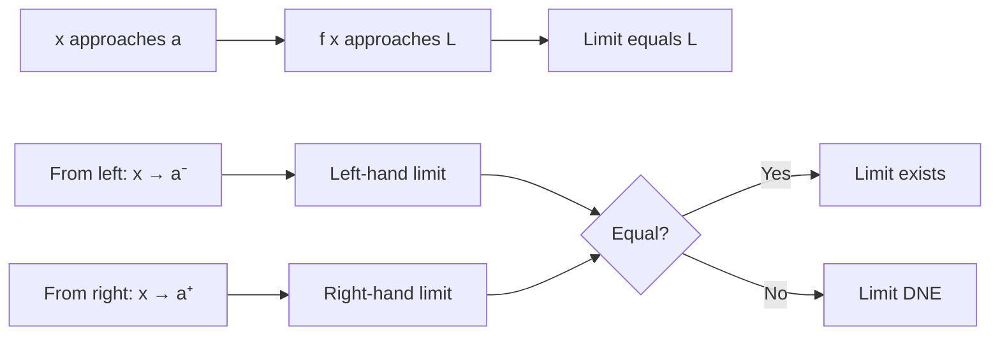

# Chapter 1: Limits - The Foundation of Change

## Intuition

Imagine walking toward a wall. You take a step that covers half the remaining distance. Then another half. Then another. You never actually *touch* the wall, but you get arbitrarily close to it. This is the essence of a **limit**—describing what happens as we approach something, even if we never quite reach it.

In calculus, limits answer the question: "What value does a function approach as its input approaches some value?" This seemingly simple concept is the foundation upon which all of calculus is built.

**Real-world analogy**: Think of a speedometer in your car. It shows your speed at an instant, but "instant speed" is actually a limit—the speed you approach as the time interval shrinks toward zero.

**Why this matters for ML**: Limits enable us to define derivatives, which measure how model predictions change as we adjust weights. Without limits, we couldn't formalize the concept of "instantaneous rate of change" that powers gradient descent.

## Visual Explanation

```
        Approaching a Limit

    f(x) ↑
         |
         |       ○───────  f(x) = 3 (hole at x=2)
         |      /
         |     /
         |    /
         |   /
         |  /
         | /
         |/
         +----------------→ x
                2

    As x → 2, f(x) → 3
    (even though f(2) might be undefined)
```

The limit $\lim_{x \to a} f(x) = L$ means that $f(x)$ gets arbitrarily close to $L$ as $x$ gets arbitrarily close to $a$.



## Mathematical Foundation

### Formal Definition (Epsilon-Delta)

The limit $\lim_{x \to a} f(x) = L$ exists if and only if:

$$\forall \epsilon > 0, \exists \delta > 0 \text{ such that } 0 < |x - a| < \delta \implies |f(x) - L| < \epsilon$$

**Translation**: No matter how small a tolerance ($\epsilon$) you demand around $L$, I can find a neighborhood ($\delta$) around $a$ where all function values stay within that tolerance.

### Key Limit Laws

For limits $\lim_{x \to a} f(x) = L$ and $\lim_{x \to a} g(x) = M$:

| Law | Formula |
|-----|---------|
| Sum | $\lim_{x \to a} [f(x) + g(x)] = L + M$ |
| Product | $\lim_{x \to a} [f(x) \cdot g(x)] = L \cdot M$ |
| Quotient | $\lim_{x \to a} \frac{f(x)}{g(x)} = \frac{L}{M}$ (if $M \neq 0$) |
| Power | $\lim_{x \to a} [f(x)]^n = L^n$ |
| Composition | $\lim_{x \to a} g(f(x)) = g(L)$ (if $g$ is continuous at $L$) |

### Important Limits

$$\lim_{x \to 0} \frac{\sin x}{x} = 1$$

$$\lim_{x \to 0} \frac{e^x - 1}{x} = 1$$

$$\lim_{n \to \infty} \left(1 + \frac{1}{n}\right)^n = e$$

## Continuity

A function $f$ is **continuous** at point $a$ if three conditions hold:

1. $f(a)$ is defined
2. $\lim_{x \to a} f(x)$ exists
3. $\lim_{x \to a} f(x) = f(a)$

**Intuition**: You can draw the function without lifting your pen.

### Types of Continuity

- **Continuous everywhere**: Polynomials, $e^x$, $\sin x$, $\cos x$
- **Continuous on domain**: $\ln x$ (for $x > 0$), $\sqrt{x}$ (for $x \geq 0$)
- **Piecewise continuous**: Functions with jump discontinuities

## Discontinuity

When continuity fails, we have a **discontinuity**. Understanding discontinuities helps identify where functions behave unexpectedly.

### Types of Discontinuities

```
    Removable              Jump                 Infinite

    f(x) ↑                f(x) ↑               f(x) ↑
         |    ○                |  ●──               |    |
         |   /|                | /                  |    |
         |  / |                |/                   |   /|
         | /  |                |                    |  / |
         |/   |           ──●  |                    | /  |
         +----+→ x             +----→ x             +/---+→ x
           a                     a                    a
```

| Type | Description | Example |
|------|-------------|---------|
| **Removable** | Limit exists but $f(a)$ is undefined or different | $\frac{x^2-1}{x-1}$ at $x=1$ |
| **Jump** | Left and right limits exist but differ | Step functions |
| **Infinite** | Function approaches $\pm\infty$ | $\frac{1}{x}$ at $x=0$ |

## Code Example

```python
import numpy as np
import matplotlib.pyplot as plt

def numerical_limit(f, a, tolerances=[0.1, 0.01, 0.001, 0.0001]):
    """
    Numerically estimate limit of f(x) as x approaches a
    by evaluating f at points increasingly close to a.
    """
    print(f"Estimating limit as x → {a}")
    print("-" * 40)

    results = []
    for h in tolerances:
        # Approach from left and right
        left_val = f(a - h)
        right_val = f(a + h)
        avg = (left_val + right_val) / 2

        print(f"h = {h:8.5f}: f({a}-h) = {left_val:.6f}, f({a}+h) = {right_val:.6f}")
        results.append(avg)

    # Estimate limit as average of closest approaches
    estimated_limit = results[-1]
    print(f"\nEstimated limit: {estimated_limit:.6f}")
    return estimated_limit

# Example 1: lim (sin(x)/x) as x → 0
print("Example 1: lim_{x→0} sin(x)/x")
f1 = lambda x: np.sin(x) / x
limit1 = numerical_limit(f1, 0)
print(f"Actual limit: 1.0\n")

# Example 2: lim (x^2 - 1)/(x - 1) as x → 1
print("Example 2: lim_{x→1} (x² - 1)/(x - 1)")
f2 = lambda x: (x**2 - 1) / (x - 1)
limit2 = numerical_limit(f2, 1)
print(f"Actual limit: 2.0 (since (x²-1)/(x-1) = x+1)\n")

# Demonstrating continuity check
def check_continuity(f, a, epsilon=1e-6):
    """Check if function f is continuous at point a."""
    try:
        f_a = f(a)  # Check if f(a) is defined
    except:
        return False, "f(a) is undefined"

    # Check if limit exists (left ≈ right)
    left_limit = f(a - epsilon)
    right_limit = f(a + epsilon)

    if not np.isclose(left_limit, right_limit, rtol=1e-3):
        return False, f"Jump discontinuity: left={left_limit:.4f}, right={right_limit:.4f}"

    limit = (left_limit + right_limit) / 2

    if not np.isclose(f_a, limit, rtol=1e-3):
        return False, f"Limit ({limit:.4f}) ≠ f(a) ({f_a:.4f})"

    return True, f"Continuous: f({a}) = {f_a:.4f}"

# Test continuity
print("Continuity Tests:")
print("-" * 40)

# Continuous function
g1 = lambda x: x**2
print(f"f(x) = x² at x=2: {check_continuity(g1, 2)}")

# Function with removable discontinuity (will fail at x=1)
def g2(x):
    if x == 1:
        return 0  # "Wrong" value
    return (x**2 - 1) / (x - 1)

print(f"f(x) = (x²-1)/(x-1) at x=1: {check_continuity(g2, 1)}")

# Visualizing limits
def plot_limit_approach(f, a, title):
    """Visualize approaching a limit."""
    x_left = np.linspace(a - 1, a - 0.01, 100)
    x_right = np.linspace(a + 0.01, a + 1, 100)

    plt.figure(figsize=(10, 6))

    # Plot function approaching from both sides
    plt.plot(x_left, f(x_left), 'b-', linewidth=2, label='f(x)')
    plt.plot(x_right, f(x_right), 'b-', linewidth=2)

    # Mark the limit point
    limit_val = (f(a - 0.01) + f(a + 0.01)) / 2
    plt.plot(a, limit_val, 'ro', markersize=10, fillstyle='none',
             linewidth=2, label=f'Limit = {limit_val:.2f}')

    plt.axvline(x=a, color='gray', linestyle='--', alpha=0.5)
    plt.xlabel('x')
    plt.ylabel('f(x)')
    plt.title(title)
    plt.legend()
    plt.grid(True, alpha=0.3)
    plt.savefig('limit_visualization.png', dpi=150, bbox_inches='tight')
    plt.close()
    print(f"Plot saved as 'limit_visualization.png'")

# Create visualization
plot_limit_approach(f1, 0, r'$\lim_{x \to 0} \frac{\sin(x)}{x} = 1$')
```

## ML Relevance

### Connection to Derivatives
The derivative is defined as a limit:

$$f'(x) = \lim_{h \to 0} \frac{f(x+h) - f(x)}{h}$$

This formula is the foundation of **numerical differentiation** used in automatic differentiation libraries.

### Gradient Descent Step Size
When choosing learning rates, we're implicitly reasoning about limits. Too large a step overshoots; too small converges slowly. The optimal learning rate approaches a limit as we refine our understanding of the loss landscape.

### Neural Network Activation Functions
Many activation functions (sigmoid, tanh) are continuous everywhere, while ReLU has a non-differentiable point at zero. Understanding continuity helps explain why some activations train better than others.

### Convergence of Training
When we say a model "converges," we mean the loss approaches a limit:

$$\lim_{t \to \infty} \mathcal{L}(\theta_t) = \mathcal{L}^*$$

## When to Use / Ignore

### When Limits Matter
- Understanding derivative definitions
- Analyzing function behavior at boundaries
- Proving convergence of algorithms
- Working with sequences and series

### When to Abstract Away
- Day-to-day ML implementation (frameworks handle this)
- When using automatic differentiation
- For most practical optimization tasks

### Common Pitfalls
1. **Assuming limits always exist**: Not every function has a limit at every point
2. **Confusing limit with function value**: $\lim_{x \to a} f(x)$ may differ from $f(a)$
3. **Numerical precision issues**: Computers can't take true limits; we approximate

## Exercises

### Exercise 1: Numerical Limit Estimation
**Problem**: Use the numerical approach to estimate $\lim_{x \to 0} \frac{e^x - 1}{x}$

**Solution**:
```python
import numpy as np

f = lambda x: (np.exp(x) - 1) / x
for h in [0.1, 0.01, 0.001, 0.0001]:
    print(f"h = {h}: f({h}) = {f(h):.6f}")

# Output shows convergence to 1.0
```

### Exercise 2: Identifying Discontinuities
**Problem**: Classify the discontinuity of $f(x) = \frac{|x|}{x}$ at $x = 0$

**Solution**: This is a **jump discontinuity**.
- $\lim_{x \to 0^-} \frac{|x|}{x} = \frac{-x}{x} = -1$
- $\lim_{x \to 0^+} \frac{|x|}{x} = \frac{x}{x} = 1$
- Left limit $\neq$ Right limit, so the limit doesn't exist

### Exercise 3: Continuity Condition
**Problem**: For what value of $k$ is $f(x) = \begin{cases} x^2 & x < 2 \\ k & x = 2 \\ 4x - 4 & x > 2 \end{cases}$ continuous at $x = 2$?

**Solution**:
- Left limit: $\lim_{x \to 2^-} x^2 = 4$
- Right limit: $\lim_{x \to 2^+} (4x - 4) = 4$
- For continuity: $k = 4$

## Summary

- **Limits** describe what value a function approaches as its input approaches some target
- **Continuity** means the limit equals the function value—no gaps, jumps, or holes
- **Discontinuities** come in three flavors: removable, jump, and infinite
- Limits are **foundational** for defining derivatives, which power all of gradient-based optimization
- **Numerical estimation** of limits is straightforward but subject to precision limitations
- In ML, limits underpin the mathematical theory but are usually handled automatically by frameworks

---

*Next: Chapter 2 - Derivatives, where we use limits to measure instantaneous rates of change.*
