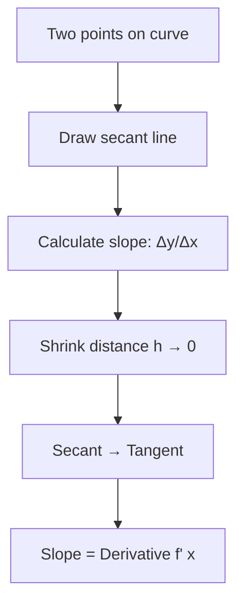

# Chapter 2: Derivatives - Measuring Change

## Intuition

Imagine you're driving a car and glance at your speedometer. It shows 60 mph—but what does that really mean? You're not actually traveling 60 miles in this instant (that would take an hour). The speedometer shows your **instantaneous rate of change** of position—how fast your position is changing at this exact moment.

This is precisely what a derivative measures: the instantaneous rate at which one quantity changes with respect to another.

**Real-world analogy**: Temperature rising at 2 degrees per hour, stock prices changing at $5 per day, or water filling a tank at 3 gallons per minute—all are derivatives describing rates of change.

**Why this matters for ML**: Derivatives tell us how the loss function changes when we adjust model parameters. If increasing a weight by a tiny amount decreases the loss, the derivative is negative, and we should increase that weight. This is the heart of training neural networks.

## Visual Explanation

```
    The Derivative as Slope

    f(x) ↑
         |               /
         |              /
         |             ● P
         |            /|
         |           / |  Δy = f(x+h) - f(x)
         |          /  |
         |         ●---|
         |        /    Δx = h
         |       /
         +------------------→ x

    Derivative = lim(h→0) Δy/Δx = slope of tangent line at P
```

The derivative transforms a "secant line" (connecting two points) into a "tangent line" (touching exactly one point) as we let the distance between points shrink to zero.



## Mathematical Foundation

### Definition of the Derivative

The derivative of $f$ at point $x$ is:

$$f'(x) = \lim_{h \to 0} \frac{f(x+h) - f(x)}{h}$$

Alternative notations:
- **Lagrange**: $f'(x)$
- **Leibniz**: $\frac{df}{dx}$ or $\frac{d}{dx}f(x)$
- **Newton**: $\dot{f}$ (for time derivatives)

### Geometric Meaning

The derivative $f'(a)$ represents:
1. **Slope** of the tangent line to $f$ at point $a$
2. **Rate of change** of $f$ at point $a$
3. **Best linear approximation**: $f(a + h) \approx f(a) + f'(a) \cdot h$

### Basic Derivative Rules

| Function | Derivative | Example |
|----------|------------|---------|
| Constant: $c$ | $0$ | $(5)' = 0$ |
| Power: $x^n$ | $nx^{n-1}$ | $(x^3)' = 3x^2$ |
| Exponential: $e^x$ | $e^x$ | $(e^x)' = e^x$ |
| Natural log: $\ln x$ | $\frac{1}{x}$ | $(\ln x)' = \frac{1}{x}$ |
| Sine: $\sin x$ | $\cos x$ | $(\sin x)' = \cos x$ |
| Cosine: $\cos x$ | $-\sin x$ | $(\cos x)' = -\sin x$ |

### Combination Rules

**Sum Rule**: $(f + g)' = f' + g'$

**Product Rule**: $(f \cdot g)' = f' \cdot g + f \cdot g'$

**Quotient Rule**: $\left(\frac{f}{g}\right)' = \frac{f' \cdot g - f \cdot g'}{g^2}$

### The Chain Rule

The chain rule is arguably the most important derivative rule for machine learning. It tells us how to differentiate composite functions:

$$\frac{d}{dx}[f(g(x))] = f'(g(x)) \cdot g'(x)$$

**In Leibniz notation**: If $y = f(u)$ and $u = g(x)$, then:

$$\frac{dy}{dx} = \frac{dy}{du} \cdot \frac{du}{dx}$$

**Why this matters**: Neural networks are compositions of functions (layers). The chain rule lets us compute how the final output changes with respect to any parameter, layer by layer—this is **backpropagation**.

**Example**: Differentiate $y = (3x + 1)^5$

Let $u = 3x + 1$, so $y = u^5$

$$\frac{dy}{dx} = \frac{dy}{du} \cdot \frac{du}{dx} = 5u^4 \cdot 3 = 15(3x+1)^4$$

### Partial Derivatives

When a function has multiple inputs, we take **partial derivatives**—derivatives with respect to one variable while holding others constant.

For $f(x, y)$:

$$\frac{\partial f}{\partial x} = \lim_{h \to 0} \frac{f(x+h, y) - f(x, y)}{h}$$

$$\frac{\partial f}{\partial y} = \lim_{h \to 0} \frac{f(x, y+h) - f(x, y)}{h}$$

**Example**: For $f(x, y) = x^2y + 3xy^2$:

$$\frac{\partial f}{\partial x} = 2xy + 3y^2$$

$$\frac{\partial f}{\partial y} = x^2 + 6xy$$

## Code Example

```python
import numpy as np
import matplotlib.pyplot as plt

# =============================================================================
# Numerical Differentiation
# =============================================================================

def numerical_derivative(f, x, h=1e-5):
    """
    Compute derivative using central difference method.
    More accurate than forward/backward difference.
    """
    return (f(x + h) - f(x - h)) / (2 * h)

def forward_difference(f, x, h=1e-5):
    """Forward difference: f'(x) ≈ (f(x+h) - f(x)) / h"""
    return (f(x + h) - f(x)) / h

def backward_difference(f, x, h=1e-5):
    """Backward difference: f'(x) ≈ (f(x) - f(x-h)) / h"""
    return (f(x) - f(x - h)) / h

def central_difference(f, x, h=1e-5):
    """Central difference: f'(x) ≈ (f(x+h) - f(x-h)) / (2h)"""
    return (f(x + h) - f(x - h)) / (2 * h)

# Example: Derivative of f(x) = x^3
f = lambda x: x**3
f_prime_exact = lambda x: 3 * x**2  # Analytical derivative

x = 2.0
print("Derivative of f(x) = x³ at x = 2")
print(f"Exact:              {f_prime_exact(x):.10f}")
print(f"Forward difference: {forward_difference(f, x):.10f}")
print(f"Backward difference:{backward_difference(f, x):.10f}")
print(f"Central difference: {central_difference(f, x):.10f}")

# =============================================================================
# Demonstrating the Chain Rule
# =============================================================================

print("\n" + "="*50)
print("Chain Rule Demonstration")
print("="*50)

# f(x) = sin(x²) → f'(x) = cos(x²) · 2x
def f_composite(x):
    return np.sin(x**2)

def f_composite_derivative_exact(x):
    return np.cos(x**2) * 2 * x

x_test = 1.5
print(f"\nf(x) = sin(x²)")
print(f"f'(x) = cos(x²) · 2x   [by chain rule]")
print(f"\nAt x = {x_test}:")
print(f"Exact derivative:     {f_composite_derivative_exact(x_test):.10f}")
print(f"Numerical derivative: {numerical_derivative(f_composite, x_test):.10f}")

# =============================================================================
# Partial Derivatives
# =============================================================================

print("\n" + "="*50)
print("Partial Derivatives")
print("="*50)

def f_multivar(x, y):
    """f(x,y) = x²y + 3xy²"""
    return x**2 * y + 3 * x * y**2

def partial_x_exact(x, y):
    """∂f/∂x = 2xy + 3y²"""
    return 2 * x * y + 3 * y**2

def partial_y_exact(x, y):
    """∂f/∂y = x² + 6xy"""
    return x**2 + 6 * x * y

def numerical_partial_x(f, x, y, h=1e-5):
    """Numerical partial derivative with respect to x"""
    return (f(x + h, y) - f(x - h, y)) / (2 * h)

def numerical_partial_y(f, x, y, h=1e-5):
    """Numerical partial derivative with respect to y"""
    return (f(x, y + h) - f(x, y - h)) / (2 * h)

x, y = 2.0, 3.0
print(f"\nf(x,y) = x²y + 3xy²")
print(f"At point ({x}, {y}):")
print(f"\n∂f/∂x:")
print(f"  Exact:     {partial_x_exact(x, y):.6f}")
print(f"  Numerical: {numerical_partial_x(f_multivar, x, y):.6f}")
print(f"\n∂f/∂y:")
print(f"  Exact:     {partial_y_exact(x, y):.6f}")
print(f"  Numerical: {numerical_partial_y(f_multivar, x, y):.6f}")

# =============================================================================
# Visualizing Derivatives
# =============================================================================

def plot_derivative():
    """Visualize function and its derivative"""
    fig, axes = plt.subplots(1, 2, figsize=(14, 5))

    x = np.linspace(-2, 2, 200)

    # Function and tangent line
    f = lambda x: x**3 - x
    f_prime = lambda x: 3*x**2 - 1

    ax1 = axes[0]
    ax1.plot(x, f(x), 'b-', linewidth=2, label=r'$f(x) = x^3 - x$')

    # Tangent line at x = 1
    x0 = 1
    tangent = f(x0) + f_prime(x0) * (x - x0)
    ax1.plot(x, tangent, 'r--', linewidth=2, label=f'Tangent at x={x0}')
    ax1.plot(x0, f(x0), 'ko', markersize=8)

    ax1.set_xlim(-2, 2)
    ax1.set_ylim(-2, 2)
    ax1.set_xlabel('x')
    ax1.set_ylabel('f(x)')
    ax1.set_title('Function and Tangent Line')
    ax1.legend()
    ax1.grid(True, alpha=0.3)
    ax1.axhline(y=0, color='k', linewidth=0.5)
    ax1.axvline(x=0, color='k', linewidth=0.5)

    # Function and its derivative
    ax2 = axes[1]
    ax2.plot(x, f(x), 'b-', linewidth=2, label=r'$f(x) = x^3 - x$')
    ax2.plot(x, f_prime(x), 'r-', linewidth=2, label=r"$f'(x) = 3x^2 - 1$")

    ax2.set_xlim(-2, 2)
    ax2.set_ylim(-2, 4)
    ax2.set_xlabel('x')
    ax2.set_ylabel('y')
    ax2.set_title('Function and Its Derivative')
    ax2.legend()
    ax2.grid(True, alpha=0.3)
    ax2.axhline(y=0, color='k', linewidth=0.5)
    ax2.axvline(x=0, color='k', linewidth=0.5)

    plt.tight_layout()
    plt.savefig('derivative_visualization.png', dpi=150, bbox_inches='tight')
    plt.close()
    print("\nPlot saved as 'derivative_visualization.png'")

plot_derivative()

# =============================================================================
# Neural Network Backpropagation Example (Mini)
# =============================================================================

print("\n" + "="*50)
print("Mini Backpropagation Example")
print("="*50)

def sigmoid(x):
    return 1 / (1 + np.exp(-x))

def sigmoid_derivative(x):
    s = sigmoid(x)
    return s * (1 - s)

# Simple network: input -> weight -> sigmoid -> output
# Loss = (output - target)²

x_input = 1.0
w = 0.5
target = 0.8

# Forward pass
z = w * x_input
a = sigmoid(z)
loss = (a - target)**2

print(f"Input: {x_input}, Weight: {w}, Target: {target}")
print(f"Forward pass: z={z:.4f}, a=sigmoid(z)={a:.4f}, loss={loss:.4f}")

# Backward pass (chain rule in action)
dL_da = 2 * (a - target)           # ∂Loss/∂a
da_dz = sigmoid_derivative(z)       # ∂a/∂z = sigmoid'(z)
dz_dw = x_input                     # ∂z/∂w = x

# Chain rule: ∂Loss/∂w = ∂Loss/∂a · ∂a/∂z · ∂z/∂w
dL_dw = dL_da * da_dz * dz_dw

print(f"\nBackward pass (Chain Rule):")
print(f"∂Loss/∂a = {dL_da:.4f}")
print(f"∂a/∂z    = {da_dz:.4f}")
print(f"∂z/∂w    = {dz_dw:.4f}")
print(f"∂Loss/∂w = {dL_dw:.4f}")

# Verify numerically
h = 1e-5
loss_plus = (sigmoid((w + h) * x_input) - target)**2
loss_minus = (sigmoid((w - h) * x_input) - target)**2
numerical_grad = (loss_plus - loss_minus) / (2 * h)

print(f"\nNumerical gradient: {numerical_grad:.4f}")
print(f"Analytical gradient: {dL_dw:.4f}")
print(f"Difference: {abs(numerical_grad - dL_dw):.2e}")
```

## ML Relevance

### Gradient Descent
The fundamental optimization algorithm updates parameters using derivatives:

$$\theta_{new} = \theta_{old} - \eta \cdot \frac{\partial \mathcal{L}}{\partial \theta}$$

The derivative $\frac{\partial \mathcal{L}}{\partial \theta}$ tells us how the loss changes when we tweak $\theta$.

### Backpropagation
Neural network training relies entirely on the chain rule. For a network with layers:

$$\text{input} \xrightarrow{W_1} h_1 \xrightarrow{W_2} h_2 \xrightarrow{W_3} \text{output} \rightarrow \text{loss}$$

The chain rule computes:

$$\frac{\partial \text{loss}}{\partial W_1} = \frac{\partial \text{loss}}{\partial h_2} \cdot \frac{\partial h_2}{\partial h_1} \cdot \frac{\partial h_1}{\partial W_1}$$

### Common Derivatives in ML

| Function | Derivative | Where Used |
|----------|------------|------------|
| $\sigma(x) = \frac{1}{1+e^{-x}}$ | $\sigma(x)(1-\sigma(x))$ | Sigmoid activation |
| $\tanh(x)$ | $1 - \tanh^2(x)$ | Tanh activation |
| $\text{ReLU}(x) = \max(0,x)$ | $\begin{cases}1 & x>0\\0 & x<0\end{cases}$ | ReLU activation |
| $\text{softmax}_i$ | $s_i(\delta_{ij} - s_j)$ | Output layer |

## When to Use / Ignore

### When Derivatives Matter
- Implementing custom layers or loss functions
- Understanding why training is slow or unstable
- Debugging gradient issues (vanishing/exploding)
- Optimizing performance-critical code

### When to Abstract Away
- Using standard layers in frameworks (autograd handles this)
- Prototyping models quickly
- Most practical ML development

### Common Pitfalls
1. **Numerical instability**: Very small or large derivatives cause problems
2. **Vanishing gradients**: Deep networks with saturating activations
3. **Exploding gradients**: Derivatives compound to huge values
4. **Non-differentiable points**: Functions like ReLU need special handling

## Exercises

### Exercise 1: Compute Derivative
**Problem**: Find $\frac{d}{dx}[\ln(x^2 + 1)]$

**Solution**: Using the chain rule with $u = x^2 + 1$:

$$\frac{d}{dx}[\ln(x^2 + 1)] = \frac{1}{x^2 + 1} \cdot 2x = \frac{2x}{x^2 + 1}$$

### Exercise 2: Partial Derivatives
**Problem**: For $f(x, y, z) = xy^2z^3$, find all partial derivatives.

**Solution**:
- $\frac{\partial f}{\partial x} = y^2z^3$
- $\frac{\partial f}{\partial y} = 2xyz^3$
- $\frac{\partial f}{\partial z} = 3xy^2z^2$

### Exercise 3: Chain Rule Application
**Problem**: A neural network computes $y = \text{ReLU}(wx + b)$. If $\frac{\partial L}{\partial y} = -0.5$ and $wx + b = 2$ (positive), find $\frac{\partial L}{\partial w}$ given $x = 3$.

**Solution**:
- Since $wx + b > 0$, $\frac{\partial \text{ReLU}}{\partial (wx+b)} = 1$
- $\frac{\partial (wx+b)}{\partial w} = x = 3$
- By chain rule: $\frac{\partial L}{\partial w} = \frac{\partial L}{\partial y} \cdot 1 \cdot 3 = -0.5 \cdot 3 = -1.5$

## Summary

- **Derivatives** measure instantaneous rates of change—the slope of a function at a point
- The **chain rule** enables computing derivatives of composite functions and is the foundation of backpropagation
- **Partial derivatives** extend the concept to functions of multiple variables
- Derivatives are computed **numerically** using finite differences, with central difference being most accurate
- In ML, derivatives guide **parameter updates** to minimize loss functions
- Understanding derivatives helps debug training issues and implement custom components

---

*Next: Chapter 3 - Gradients, where we combine partial derivatives into vectors that point toward steepest change.*
