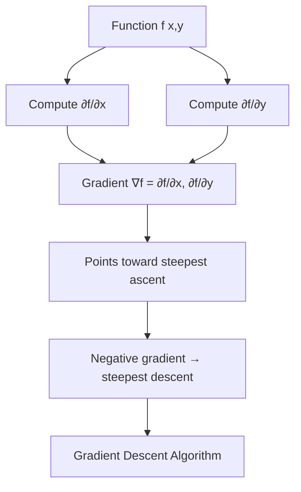

# Chapter 3: Gradients - Navigating Multi-dimensional Landscapes

## Intuition

Imagine you're standing on a hillside in complete fog, unable to see anything. You want to reach the valley floor (the minimum). What would you do? You'd feel the ground beneath your feet, determine which direction slopes downward most steeply, and take a step in that direction.

The **gradient** is exactly that directional information, but mathematically precise. It's a vector that points in the direction of steepest *ascent*. To descend (minimize), you go opposite the gradient.

**Real-world analogy**: Think of a topographical map showing elevation. The gradient at any point is a compass arrow pointing directly uphill with a length proportional to the steepness.

**Why this matters for ML**: Neural networks have millions of parameters. The loss function is a surface in million-dimensional space. The gradient tells us how to adjust all parameters simultaneously to reduce the loss most efficiently. Without gradients, training deep networks would be impossible.

## Visual Explanation

```
    Gradient as Direction of Steepest Ascent

    y ↑
      |     ↗ ↑ ↖
      |    → ● ←     ● = point (x, y)
      |     ↘ ↓ ↙    Arrows show gradient directions
      |              at different points
      |
      +------------------→ x

    At each point, the gradient vector ∇f points
    toward the steepest increase of f(x, y)
```



### Contour Plot Visualization

```
    Contour lines (level sets) of f(x,y)

    y ↑
      |    ___________
      |   /           \
      |  /   _______   \
      | /   /       \   \
      ||   |   *→    |   |    * = current point
      | \   \_______/   /     → = gradient direction
      |  \             /          (perpendicular to contours)
      |   \___________/
      +----------------------→ x

    Gradient is always perpendicular to contour lines,
    pointing toward higher values.
```

## Mathematical Foundation

### Gradient Vector Definition

For a scalar function $f: \mathbb{R}^n \to \mathbb{R}$, the gradient is the vector of all partial derivatives:

$$\nabla f = \begin{bmatrix} \frac{\partial f}{\partial x_1} \\ \frac{\partial f}{\partial x_2} \\ \vdots \\ \frac{\partial f}{\partial x_n} \end{bmatrix}$$

**Example**: For $f(x, y) = x^2 + 3xy + y^2$:

$$\nabla f = \begin{bmatrix} 2x + 3y \\ 3x + 2y \end{bmatrix}$$

### Properties of the Gradient

1. **Direction**: Points toward the steepest increase of $f$
2. **Magnitude**: Equals the rate of increase in that direction: $|\nabla f|$
3. **Perpendicular to level sets**: $\nabla f$ is orthogonal to contour lines

### Directional Derivative

The rate of change of $f$ in direction $\mathbf{u}$ (unit vector):

$$D_\mathbf{u} f = \nabla f \cdot \mathbf{u} = |\nabla f| \cos \theta$$

where $\theta$ is the angle between $\nabla f$ and $\mathbf{u}$.

- **Maximum** when $\mathbf{u} \parallel \nabla f$ (moving with gradient): $D_\mathbf{u} f = |\nabla f|$
- **Minimum** when $\mathbf{u} \parallel -\nabla f$ (moving against gradient): $D_\mathbf{u} f = -|\nabla f|$
- **Zero** when $\mathbf{u} \perp \nabla f$ (moving along contour)

### The Jacobian Matrix

When we have a **vector-valued function** $\mathbf{f}: \mathbb{R}^n \to \mathbb{R}^m$, we need the **Jacobian matrix**—a matrix of all partial derivatives:

$$\mathbf{J} = \begin{bmatrix}
\frac{\partial f_1}{\partial x_1} & \frac{\partial f_1}{\partial x_2} & \cdots & \frac{\partial f_1}{\partial x_n} \\
\frac{\partial f_2}{\partial x_1} & \frac{\partial f_2}{\partial x_2} & \cdots & \frac{\partial f_2}{\partial x_n} \\
\vdots & \vdots & \ddots & \vdots \\
\frac{\partial f_m}{\partial x_1} & \frac{\partial f_m}{\partial x_2} & \cdots & \frac{\partial f_m}{\partial x_n}
\end{bmatrix}$$

**Shape**: $m \times n$ (outputs $\times$ inputs)

**Example**: For $\mathbf{f}(x, y) = \begin{bmatrix} x^2 + y \\ xy \end{bmatrix}$:

$$\mathbf{J} = \begin{bmatrix}
2x & 1 \\
y & x
\end{bmatrix}$$

**ML Relevance**: The Jacobian appears when a layer transforms a vector input to a vector output. Each row tells how one output component depends on all inputs.

### The Hessian Matrix (Conceptual)

The **Hessian** is the matrix of second-order partial derivatives:

$$\mathbf{H} = \begin{bmatrix}
\frac{\partial^2 f}{\partial x_1^2} & \frac{\partial^2 f}{\partial x_1 \partial x_2} & \cdots \\
\frac{\partial^2 f}{\partial x_2 \partial x_1} & \frac{\partial^2 f}{\partial x_2^2} & \cdots \\
\vdots & \vdots & \ddots
\end{bmatrix}$$

**Intuition**: The Hessian tells us about the *curvature* of the function:
- How does the slope itself change as we move?
- Is the surface bowl-shaped (convex) or saddle-shaped?

**Key Properties**:
- **Symmetric**: $\frac{\partial^2 f}{\partial x_i \partial x_j} = \frac{\partial^2 f}{\partial x_j \partial x_i}$ (under mild conditions)
- **Eigenvalues** determine local shape:
  - All positive → local minimum (bowl up)
  - All negative → local maximum (bowl down)
  - Mixed signs → saddle point

**ML Relevance**: Second-order optimization methods (Newton's method, L-BFGS) use the Hessian for faster convergence, but computing it is expensive for large networks.

## Code Example

```python
import numpy as np
import matplotlib.pyplot as plt
from mpl_toolkits.mplot3d import Axes3D

# =============================================================================
# Gradient Computation
# =============================================================================

def numerical_gradient(f, x, h=1e-5):
    """
    Compute gradient of f at point x using central differences.

    Parameters:
        f: scalar function that takes a numpy array
        x: point at which to compute gradient (numpy array)
        h: step size for finite differences

    Returns:
        gradient vector (same shape as x)
    """
    grad = np.zeros_like(x, dtype=float)
    for i in range(len(x)):
        x_plus = x.copy()
        x_minus = x.copy()
        x_plus[i] += h
        x_minus[i] -= h
        grad[i] = (f(x_plus) - f(x_minus)) / (2 * h)
    return grad

# Example function: f(x, y) = x² + 3xy + y²
def f(point):
    x, y = point
    return x**2 + 3*x*y + y**2

def analytical_gradient(point):
    """Analytical gradient: [2x + 3y, 3x + 2y]"""
    x, y = point
    return np.array([2*x + 3*y, 3*x + 2*y])

# Test at point (1, 2)
point = np.array([1.0, 2.0])
print("Gradient of f(x,y) = x² + 3xy + y²")
print(f"At point {point}:")
print(f"  Analytical: {analytical_gradient(point)}")
print(f"  Numerical:  {numerical_gradient(f, point)}")

# =============================================================================
# Direction of Steepest Ascent/Descent
# =============================================================================

print("\n" + "="*50)
print("Direction of Steepest Descent")
print("="*50)

grad = analytical_gradient(point)
grad_magnitude = np.linalg.norm(grad)
steepest_descent = -grad / grad_magnitude  # Normalize and negate

print(f"Gradient: {grad}")
print(f"Gradient magnitude: {grad_magnitude:.4f}")
print(f"Steepest descent direction (unit vector): {steepest_descent}")

# Verify: directional derivative in steepest descent direction
directional_deriv = np.dot(grad, steepest_descent)
print(f"Rate of decrease in steepest descent direction: {directional_deriv:.4f}")

# =============================================================================
# Jacobian Computation
# =============================================================================

print("\n" + "="*50)
print("Jacobian Matrix")
print("="*50)

def vector_function(point):
    """f(x,y) = [x² + y, xy]"""
    x, y = point
    return np.array([x**2 + y, x * y])

def analytical_jacobian(point):
    """
    Jacobian of [x² + y, xy]:
    [[2x, 1],
     [y,  x]]
    """
    x, y = point
    return np.array([
        [2*x, 1],
        [y, x]
    ])

def numerical_jacobian(f, x, h=1e-5):
    """Compute Jacobian matrix numerically."""
    n = len(x)
    f_x = f(x)
    m = len(f_x)
    J = np.zeros((m, n))

    for j in range(n):
        x_plus = x.copy()
        x_minus = x.copy()
        x_plus[j] += h
        x_minus[j] -= h
        J[:, j] = (f(x_plus) - f(x_minus)) / (2 * h)

    return J

point = np.array([2.0, 3.0])
print(f"Vector function: f(x,y) = [x² + y, xy]")
print(f"At point {point}:")
print(f"\nAnalytical Jacobian:\n{analytical_jacobian(point)}")
print(f"\nNumerical Jacobian:\n{numerical_jacobian(vector_function, point)}")

# =============================================================================
# Hessian Computation
# =============================================================================

print("\n" + "="*50)
print("Hessian Matrix")
print("="*50)

def hessian_numerical(f, x, h=1e-5):
    """Compute Hessian matrix numerically."""
    n = len(x)
    H = np.zeros((n, n))

    for i in range(n):
        for j in range(n):
            # Second partial derivative using finite differences
            x_pp = x.copy(); x_pp[i] += h; x_pp[j] += h
            x_pm = x.copy(); x_pm[i] += h; x_pm[j] -= h
            x_mp = x.copy(); x_mp[i] -= h; x_mp[j] += h
            x_mm = x.copy(); x_mm[i] -= h; x_mm[j] -= h

            H[i, j] = (f(x_pp) - f(x_pm) - f(x_mp) + f(x_mm)) / (4 * h * h)

    return H

# f(x,y) = x² + 3xy + y² → Hessian = [[2, 3], [3, 2]]
point = np.array([1.0, 2.0])
print(f"Function: f(x,y) = x² + 3xy + y²")
print(f"At point {point}:")
print(f"\nNumerical Hessian:\n{hessian_numerical(f, point)}")
print(f"\nAnalytical Hessian:\n[[2, 3],\n [3, 2]]")

# Analyze eigenvalues to determine local shape
H = hessian_numerical(f, point)
eigenvalues = np.linalg.eigvals(H)
print(f"\nEigenvalues of Hessian: {eigenvalues}")
if all(eigenvalues > 0):
    print("All positive → Convex (bowl-shaped minimum)")
elif all(eigenvalues < 0):
    print("All negative → Concave (bowl-shaped maximum)")
else:
    print("Mixed signs → Saddle point")

# =============================================================================
# Gradient Descent Visualization
# =============================================================================

def plot_gradient_descent():
    """Visualize gradient descent on a 2D function."""

    # Function: f(x,y) = x² + y² (simple bowl)
    def f_bowl(point):
        return point[0]**2 + point[1]**2

    def grad_bowl(point):
        return 2 * point

    # Gradient descent
    x = np.array([3.0, 4.0])  # Starting point
    learning_rate = 0.1
    path = [x.copy()]

    for _ in range(20):
        grad = grad_bowl(x)
        x = x - learning_rate * grad
        path.append(x.copy())

    path = np.array(path)

    # Create plot
    fig, ax = plt.subplots(figsize=(10, 8))

    # Contour plot
    X, Y = np.meshgrid(np.linspace(-4, 4, 100), np.linspace(-5, 5, 100))
    Z = X**2 + Y**2
    contours = ax.contour(X, Y, Z, levels=20, cmap='viridis')
    ax.clabel(contours, inline=True, fontsize=8)

    # Gradient descent path
    ax.plot(path[:, 0], path[:, 1], 'ro-', markersize=5, linewidth=2,
            label='Gradient descent path')
    ax.plot(path[0, 0], path[0, 1], 'go', markersize=12, label='Start')
    ax.plot(path[-1, 0], path[-1, 1], 'b*', markersize=15, label='End')

    # Gradient arrows at some points
    for i in [0, 5, 10]:
        grad = grad_bowl(path[i])
        ax.arrow(path[i, 0], path[i, 1], -grad[0]*0.2, -grad[1]*0.2,
                head_width=0.15, head_length=0.1, fc='red', ec='red')

    ax.set_xlabel('x')
    ax.set_ylabel('y')
    ax.set_title('Gradient Descent: Following Negative Gradient')
    ax.legend()
    ax.set_aspect('equal')
    ax.grid(True, alpha=0.3)

    plt.savefig('gradient_descent_visualization.png', dpi=150, bbox_inches='tight')
    plt.close()
    print("\nPlot saved as 'gradient_descent_visualization.png'")

plot_gradient_descent()

# =============================================================================
# Practical Example: Computing Gradients for a Simple Neural Network
# =============================================================================

print("\n" + "="*50)
print("Neural Network Gradient Example")
print("="*50)

def simple_nn(params, x):
    """
    Simple 2-layer network: input -> hidden -> output
    params = [W1, b1, W2, b2] flattened
    """
    W1 = params[:4].reshape(2, 2)  # 2x2 weights
    b1 = params[4:6]               # 2 biases
    W2 = params[6:8]               # 2 weights
    b2 = params[8]                 # 1 bias

    # Forward pass
    h = np.tanh(W1 @ x + b1)       # Hidden layer
    y = W2 @ h + b2                # Output
    return y

def loss_fn(params, x, target):
    """Mean squared error loss."""
    pred = simple_nn(params, x)
    return (pred - target)**2

# Initialize
np.random.seed(42)
params = np.random.randn(9) * 0.1
x = np.array([1.0, 2.0])
target = 0.5

# Compute gradient
grad = numerical_gradient(lambda p: loss_fn(p, x, target), params)

print(f"Input: {x}")
print(f"Target: {target}")
print(f"Prediction: {simple_nn(params, x):.4f}")
print(f"Loss: {loss_fn(params, x, target):.4f}")
print(f"\nGradient shape: {grad.shape}")
print(f"Gradient (first 5 elements): {grad[:5]}")
print(f"Gradient magnitude: {np.linalg.norm(grad):.4f}")
```

## ML Relevance

### Gradient Descent
The core optimization algorithm:

$$\theta_{t+1} = \theta_t - \eta \nabla_\theta \mathcal{L}(\theta_t)$$

The gradient $\nabla_\theta \mathcal{L}$ contains the partial derivative of loss with respect to every parameter.

### Backpropagation
Computing gradients through layers uses the chain rule with Jacobians:

$$\frac{\partial \mathcal{L}}{\partial \mathbf{x}} = \mathbf{J}^\top \frac{\partial \mathcal{L}}{\partial \mathbf{y}}$$

where $\mathbf{J}$ is the Jacobian of the layer.

### Batch Gradients
In practice, we compute gradients over mini-batches:

$$\nabla_\theta \mathcal{L} = \frac{1}{|B|} \sum_{i \in B} \nabla_\theta \ell_i$$

### Second-Order Methods
Methods like Newton's method use the Hessian:

$$\theta_{t+1} = \theta_t - \mathbf{H}^{-1} \nabla_\theta \mathcal{L}$$

This converges faster but is expensive for large networks.

### Gradient Clipping
To prevent exploding gradients:

$$\mathbf{g}_{clipped} = \min\left(1, \frac{c}{|\nabla \mathcal{L}|}\right) \nabla \mathcal{L}$$

## When to Use / Ignore

### When Gradients Matter
- Implementing custom loss functions
- Debugging training issues
- Understanding model behavior
- Research and novel architectures

### When to Abstract Away
- Using standard PyTorch/TensorFlow operations
- Autograd handles gradient computation automatically
- Most practical ML engineering

### Common Pitfalls
1. **Vanishing gradients**: Deep networks with saturating activations
2. **Exploding gradients**: Gradients grow exponentially through layers
3. **Gradient noise**: Stochastic gradients can be high-variance
4. **Saddle points**: High-dimensional spaces have many saddle points

## Exercises

### Exercise 1: Compute the Gradient
**Problem**: Find $\nabla f$ for $f(x, y, z) = x^2y + e^{yz}$

**Solution**:
$$\nabla f = \begin{bmatrix} 2xy \\ x^2 + ze^{yz} \\ ye^{yz} \end{bmatrix}$$

### Exercise 2: Jacobian Matrix
**Problem**: Compute the Jacobian of $\mathbf{f}(x, y) = \begin{bmatrix} \sin(xy) \\ x + y^2 \end{bmatrix}$

**Solution**:
$$\mathbf{J} = \begin{bmatrix}
y\cos(xy) & x\cos(xy) \\
1 & 2y
\end{bmatrix}$$

### Exercise 3: Gradient Descent Step
**Problem**: Given $f(x, y) = x^2 + 4y^2$ and starting point $(2, 1)$ with learning rate $\eta = 0.1$, compute one gradient descent step.

**Solution**:
- $\nabla f = (2x, 8y) = (4, 8)$ at $(2, 1)$
- Update: $(x', y') = (2, 1) - 0.1 \cdot (4, 8) = (1.6, 0.2)$

## Summary

- The **gradient** $\nabla f$ is a vector of partial derivatives pointing toward steepest ascent
- **Gradient descent** follows the negative gradient to minimize functions
- The **Jacobian** generalizes gradients to vector-valued functions
- The **Hessian** captures second-order curvature information
- Gradients are **computed numerically** using finite differences or **analytically** via automatic differentiation
- In ML, gradients drive **all parameter updates** during training
- Understanding gradients helps debug issues like **vanishing/exploding gradients**

---

*Next: Chapter 4 - Optimization, where we explore the landscape of loss functions and how to navigate them.*
