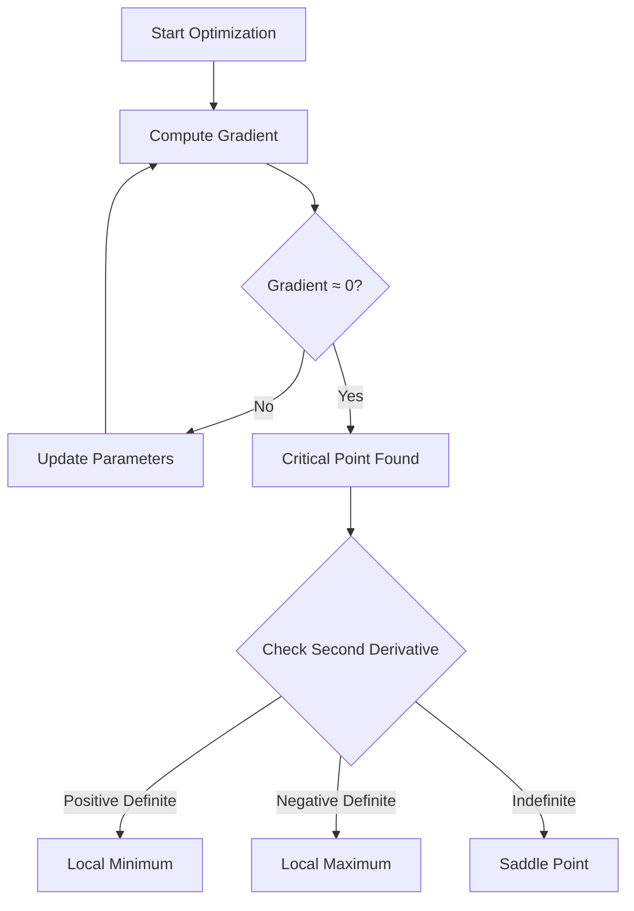

# Chapter 4: Optimization - Finding the Best Solution

## Intuition

Imagine you're a hiker trying to find the lowest point in a vast, foggy mountain range. You can only feel the ground immediately around you, not see the entire landscape. You follow the slope downhill (gradient descent), but you might end up in a small valley that isn't the lowest point overall—you found a **local minimum** rather than the **global minimum**.

This is the fundamental challenge of optimization in machine learning: navigating complex loss landscapes to find good solutions, even when we can't see the whole picture.

**Real-world analogy**: Finding the best settings for a recipe by adjusting ingredients slightly and tasting the result. You might find a delicious combination (local minimum), but there could be an even better one you haven't discovered (global minimum).

**Why this matters for ML**: Training neural networks means minimizing a loss function over millions of parameters. Understanding the optimization landscape—its minima, maxima, and saddle points—helps us design better training algorithms and diagnose training problems.

## Visual Explanation

```
    Loss Landscape Types

    1D Function:
    Loss ↑
         |  *                    *
         | * *        *        * *
         |*   *      * *      *   *
         |     *    *   *    *
         |      *  *     *  *
         |       **       **
         |  local          global
         | minimum        minimum
         +---------------------------→ Parameter


    2D Function (bird's eye view):
         ___________________________
        /                           \
       /    (saddle)                 \
      |        X                      |
      |    ___________                |
      |   /  local    \     global    |
      |  |   min  O    |      min     |
      |   \___________/       *       |
       \                             /
        \___________________________/

    O = local minimum (trapped!)
    * = global minimum (goal!)
    X = saddle point (gradient = 0, but not a minimum)
```



## Mathematical Foundation

### Critical Points

A **critical point** is where the gradient equals zero:

$$\nabla f(\mathbf{x}^*) = \mathbf{0}$$

At critical points, the function is "flat"—no direction leads to immediate increase or decrease. But this doesn't mean we've found a minimum!

### Classifying Critical Points

Using the **Hessian matrix** $\mathbf{H}$ at a critical point $\mathbf{x}^*$:

| Hessian Eigenvalues | Classification | Description |
|---------------------|----------------|-------------|
| All positive | **Local minimum** | Bowl-shaped (convex locally) |
| All negative | **Local maximum** | Inverted bowl (concave locally) |
| Mixed signs | **Saddle point** | Curves up in some directions, down in others |
| Some zero | **Degenerate** | Need higher-order analysis |

### Local vs Global Minima

**Local minimum**: $f(\mathbf{x}^*) \leq f(\mathbf{x})$ for all $\mathbf{x}$ in some neighborhood of $\mathbf{x}^*$

**Global minimum**: $f(\mathbf{x}^*) \leq f(\mathbf{x})$ for all $\mathbf{x}$ in the entire domain

$$f(\mathbf{x}_{global}^*) = \min_{\mathbf{x}} f(\mathbf{x})$$

### Saddle Points

A **saddle point** has zero gradient but is neither a minimum nor maximum:
- Some eigenvalues of the Hessian are positive (curves up)
- Some eigenvalues are negative (curves down)

**Why saddle points matter in deep learning**: In high-dimensional spaces, saddle points are far more common than local minima. A random critical point in a 1000-dimensional space is almost certainly a saddle point, not a local minimum.

### Convexity

A function is **convex** if any line segment between two points lies above or on the graph:

$$f(\lambda \mathbf{x} + (1-\lambda)\mathbf{y}) \leq \lambda f(\mathbf{x}) + (1-\lambda)f(\mathbf{y}) \quad \forall \lambda \in [0,1]$$

**Key property**: Convex functions have a **unique global minimum** (if it exists). Any local minimum is the global minimum.

**Reality check**: Neural network loss functions are typically **non-convex**, making optimization challenging.

### Second-Order Conditions

**Necessary condition** for local minimum at $\mathbf{x}^*$:
- $\nabla f(\mathbf{x}^*) = \mathbf{0}$
- $\mathbf{H}(\mathbf{x}^*)$ is positive semi-definite

**Sufficient condition** for strict local minimum:
- $\nabla f(\mathbf{x}^*) = \mathbf{0}$
- $\mathbf{H}(\mathbf{x}^*)$ is positive definite (all eigenvalues $> 0$)

## Code Example

```python
import numpy as np
import matplotlib.pyplot as plt
from mpl_toolkits.mplot3d import Axes3D

# =============================================================================
# Finding Critical Points
# =============================================================================

def numerical_gradient(f, x, h=1e-5):
    """Compute gradient numerically."""
    grad = np.zeros_like(x, dtype=float)
    for i in range(len(x)):
        x_plus = x.copy(); x_plus[i] += h
        x_minus = x.copy(); x_minus[i] -= h
        grad[i] = (f(x_plus) - f(x_minus)) / (2 * h)
    return grad

def numerical_hessian(f, x, h=1e-5):
    """Compute Hessian matrix numerically."""
    n = len(x)
    H = np.zeros((n, n))
    for i in range(n):
        for j in range(n):
            x_pp = x.copy(); x_pp[i] += h; x_pp[j] += h
            x_pm = x.copy(); x_pm[i] += h; x_pm[j] -= h
            x_mp = x.copy(); x_mp[i] -= h; x_mp[j] += h
            x_mm = x.copy(); x_mm[i] -= h; x_mm[j] -= h
            H[i, j] = (f(x_pp) - f(x_pm) - f(x_mp) + f(x_mm)) / (4 * h * h)
    return H

def classify_critical_point(f, x):
    """Classify a critical point using eigenvalues of Hessian."""
    grad = numerical_gradient(f, x)
    if np.linalg.norm(grad) > 1e-3:
        return "Not a critical point (gradient ≠ 0)"

    H = numerical_hessian(f, x)
    eigenvalues = np.linalg.eigvals(H)
    eigenvalues = eigenvalues.real  # Take real parts

    print(f"Hessian:\n{H}")
    print(f"Eigenvalues: {eigenvalues}")

    if all(eigenvalues > 1e-6):
        return "Local MINIMUM (all eigenvalues positive)"
    elif all(eigenvalues < -1e-6):
        return "Local MAXIMUM (all eigenvalues negative)"
    elif any(eigenvalues > 1e-6) and any(eigenvalues < -1e-6):
        return "SADDLE POINT (mixed eigenvalues)"
    else:
        return "DEGENERATE (some eigenvalues near zero)"

# =============================================================================
# Example: Function with Multiple Critical Points
# =============================================================================

print("="*60)
print("Classifying Critical Points")
print("="*60)

# f(x, y) = x⁴ + y⁴ - 4xy + 1
# Critical points at (0,0), (1,1), (-1,-1)
def f1(point):
    x, y = point
    return x**4 + y**4 - 4*x*y + 1

print("\nFunction: f(x,y) = x⁴ + y⁴ - 4xy + 1")
print("\nCritical point at (0, 0):")
print(classify_critical_point(f1, np.array([0.0, 0.0])))

print("\nCritical point at (1, 1):")
print(classify_critical_point(f1, np.array([1.0, 1.0])))

print("\nCritical point at (-1, -1):")
print(classify_critical_point(f1, np.array([-1.0, -1.0])))

# =============================================================================
# Saddle Point Example (Common in Deep Learning)
# =============================================================================

print("\n" + "="*60)
print("Classic Saddle Point Example")
print("="*60)

# f(x, y) = x² - y² (saddle at origin)
def saddle_func(point):
    x, y = point
    return x**2 - y**2

print("\nFunction: f(x,y) = x² - y²")
print("At origin (0, 0):")
print(classify_critical_point(saddle_func, np.array([0.0, 0.0])))

# =============================================================================
# Gradient Descent with Multiple Starting Points
# =============================================================================

print("\n" + "="*60)
print("Gradient Descent: Local vs Global Minima")
print("="*60)

# Rastrigin-like function with many local minima
def rastrigin_2d(point):
    x, y = point
    return 20 + (x**2 - 10*np.cos(2*np.pi*x)) + (y**2 - 10*np.cos(2*np.pi*y))

def gradient_descent(f, x0, learning_rate=0.01, max_iters=1000, tol=1e-6):
    """Simple gradient descent."""
    x = x0.copy()
    path = [x.copy()]

    for i in range(max_iters):
        grad = numerical_gradient(f, x)
        if np.linalg.norm(grad) < tol:
            break
        x = x - learning_rate * grad
        path.append(x.copy())

    return x, np.array(path)

# Try multiple starting points
np.random.seed(42)
starting_points = [
    np.array([0.1, 0.1]),
    np.array([1.5, 1.5]),
    np.array([-0.5, 2.0]),
    np.array([2.5, -1.0]),
]

print("\nRastrigin function: Many local minima, global at (0,0)")
print("-"*50)

for i, start in enumerate(starting_points):
    final, path = gradient_descent(rastrigin_2d, start, learning_rate=0.001)
    print(f"Start {start} → Final {final.round(4)}, Loss = {rastrigin_2d(final):.4f}")

# =============================================================================
# Escaping Saddle Points: Adding Noise
# =============================================================================

print("\n" + "="*60)
print("Escaping Saddle Points with Noise (SGD-like)")
print("="*60)

def noisy_gradient_descent(f, x0, learning_rate=0.01, noise_scale=0.1,
                          max_iters=1000, tol=1e-6):
    """Gradient descent with noise to escape saddle points."""
    x = x0.copy()
    path = [x.copy()]

    for i in range(max_iters):
        grad = numerical_gradient(f, x)
        if np.linalg.norm(grad) < tol:
            break
        # Add noise (like stochastic gradient descent)
        noise = np.random.randn(*x.shape) * noise_scale
        x = x - learning_rate * (grad + noise)
        path.append(x.copy())

    return x, np.array(path)

# Start exactly at saddle point
start_at_saddle = np.array([0.0, 0.0])

print(f"\nStarting at saddle point {start_at_saddle} for f(x,y) = x² - y²")

# Pure gradient descent (gets stuck)
final_pure, _ = gradient_descent(saddle_func, start_at_saddle + 1e-10)
print(f"Pure GD final: {final_pure} (stuck near saddle)")

# Noisy gradient descent (escapes)
final_noisy, path_noisy = noisy_gradient_descent(saddle_func, start_at_saddle,
                                                  noise_scale=0.1)
print(f"Noisy GD final: {final_noisy} (escaped saddle)")

# =============================================================================
# Visualization
# =============================================================================

def plot_optimization_landscape():
    """Visualize loss landscape with critical points."""
    fig = plt.figure(figsize=(15, 5))

    # Function with local and global minima
    def f(x, y):
        return x**4 + y**4 - 4*x*y + 1

    X, Y = np.meshgrid(np.linspace(-2, 2, 100), np.linspace(-2, 2, 100))
    Z = f(X, Y)

    # 3D surface plot
    ax1 = fig.add_subplot(131, projection='3d')
    ax1.plot_surface(X, Y, Z, cmap='viridis', alpha=0.8)
    ax1.scatter([0, 1, -1], [0, 1, -1], [f(0,0), f(1,1), f(-1,-1)],
               color='red', s=100, label='Critical points')
    ax1.set_xlabel('x')
    ax1.set_ylabel('y')
    ax1.set_zlabel('f(x,y)')
    ax1.set_title('3D Loss Landscape')

    # Contour plot with critical points
    ax2 = fig.add_subplot(132)
    contours = ax2.contour(X, Y, Z, levels=20, cmap='viridis')
    ax2.clabel(contours, inline=True, fontsize=8)
    ax2.scatter([0], [0], color='red', s=100, marker='x', label='Saddle (0,0)')
    ax2.scatter([1, -1], [1, -1], color='green', s=100, marker='o',
               label='Minima (±1,±1)')
    ax2.set_xlabel('x')
    ax2.set_ylabel('y')
    ax2.set_title('Contour Plot')
    ax2.legend()

    # Saddle point detail
    ax3 = fig.add_subplot(133, projection='3d')
    X_s, Y_s = np.meshgrid(np.linspace(-1, 1, 50), np.linspace(-1, 1, 50))
    Z_s = X_s**2 - Y_s**2  # Saddle function
    ax3.plot_surface(X_s, Y_s, Z_s, cmap='coolwarm', alpha=0.8)
    ax3.scatter([0], [0], [0], color='black', s=100, label='Saddle point')
    ax3.set_xlabel('x')
    ax3.set_ylabel('y')
    ax3.set_zlabel('f(x,y)')
    ax3.set_title('Saddle Point: f(x,y) = x² - y²')

    plt.tight_layout()
    plt.savefig('optimization_landscape.png', dpi=150, bbox_inches='tight')
    plt.close()
    print("\nPlot saved as 'optimization_landscape.png'")

plot_optimization_landscape()

# =============================================================================
# Learning Rate Effects
# =============================================================================

print("\n" + "="*60)
print("Learning Rate Effects")
print("="*60)

def simple_quadratic(x):
    return np.sum(x**2)

start = np.array([5.0, 5.0])
learning_rates = [0.01, 0.1, 0.5, 0.9, 1.1]

print("\nf(x) = ||x||² starting from (5, 5)")
print("-"*50)

for lr in learning_rates:
    try:
        final, path = gradient_descent(simple_quadratic, start,
                                       learning_rate=lr, max_iters=100)
        if np.any(np.isnan(final)) or np.any(np.abs(final) > 1000):
            status = "DIVERGED"
        else:
            status = f"Converged to {final.round(4)}"
        print(f"LR = {lr}: {status} in {len(path)} steps")
    except:
        print(f"LR = {lr}: DIVERGED (numerical overflow)")
```

## ML Relevance

### Loss Landscape of Neural Networks

Neural network loss functions are highly non-convex with:
- Many local minima (though often similar in quality)
- Many saddle points (exponentially more in high dimensions)
- Flat regions (plateaus)
- Sharp valleys and ridges

### Why SGD Works

Stochastic Gradient Descent adds noise that helps:
1. **Escape saddle points**: Random perturbations push away from unstable equilibria
2. **Avoid sharp minima**: Noise prevents settling into narrow, sharp valleys
3. **Find flatter minima**: These often generalize better to test data

### Momentum and Adaptive Methods

**Momentum** helps escape local minima and saddle points by accumulating velocity:

$$\mathbf{v}_t = \beta \mathbf{v}_{t-1} + \nabla \mathcal{L}$$
$$\theta_{t+1} = \theta_t - \eta \mathbf{v}_t$$

**Adam** adapts learning rates per-parameter based on gradient history.

### The Lottery Ticket Hypothesis Connection

Understanding optimization landscapes helps explain why:
- Different initializations lead to different solutions
- Some subnetworks ("winning tickets") train faster
- Overparameterization can help optimization

## When to Use / Ignore

### When Optimization Theory Matters
- Debugging training that won't converge
- Choosing and tuning optimizers
- Understanding why certain architectures train better
- Research on new optimization methods

### When to Abstract Away
- Using well-tested architectures and optimizers
- Standard training pipelines
- Most practical ML development

### Common Pitfalls
1. **Learning rate too high**: Overshooting minima, divergence
2. **Learning rate too low**: Extremely slow convergence
3. **Poor initialization**: Starting in bad regions
4. **Ignoring scale**: Features with different scales cause elongated landscapes

## Exercises

### Exercise 1: Classify Critical Points
**Problem**: For $f(x, y) = x^3 - 3xy^2$, find and classify all critical points.

**Solution**:
- $\nabla f = (3x^2 - 3y^2, -6xy) = (0, 0)$
- From $-6xy = 0$: either $x = 0$ or $y = 0$
- If $x = 0$: $-3y^2 = 0 \Rightarrow y = 0$
- If $y = 0$: $3x^2 = 0 \Rightarrow x = 0$
- Only critical point: $(0, 0)$
- Hessian: $H = \begin{bmatrix} 6x & -6y \\ -6y & -6x \end{bmatrix}$
- At origin: $H = \begin{bmatrix} 0 & 0 \\ 0 & 0 \end{bmatrix}$ (degenerate)

### Exercise 2: Convexity Check
**Problem**: Is $f(x) = e^x$ convex? Prove it.

**Solution**:
- $f''(x) = e^x > 0$ for all $x$
- Second derivative always positive implies convex
- Yes, $f(x) = e^x$ is convex.

### Exercise 3: Gradient Descent Convergence
**Problem**: Given $f(x) = x^2$ starting at $x_0 = 10$ with learning rate $\eta = 0.1$, how many iterations to reach $|x| < 0.01$?

**Solution**:
- Update rule: $x_{t+1} = x_t - 0.1 \cdot 2x_t = 0.8x_t$
- After $n$ iterations: $x_n = 0.8^n \cdot 10$
- Need: $0.8^n \cdot 10 < 0.01$
- $0.8^n < 0.001$
- $n > \frac{\ln(0.001)}{\ln(0.8)} \approx 31$ iterations

## Summary

- **Critical points** have zero gradient; they can be minima, maxima, or saddle points
- **Local minima** are low points in a neighborhood; **global minimum** is the lowest overall
- **Saddle points** have zero gradient but are not extrema—common in high dimensions
- The **Hessian eigenvalues** determine the type of critical point
- **Convex functions** have unique global minima; neural network losses are non-convex
- **SGD noise** helps escape saddle points and find better solutions
- **Learning rate** critically affects convergence: too high diverges, too low is slow

---

*Next: Chapter 5 - Integral Calculus, where we explore accumulation, areas, and expectations.*
