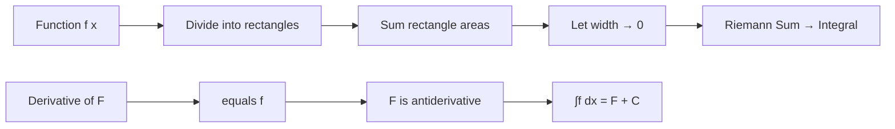

# Chapter 5: Integral Calculus - Accumulation and Expectation

## Intuition

If derivatives tell us about **rates of change** (how fast something changes at an instant), integrals tell us about **accumulation** (how much total quantity over an interval).

Imagine filling a swimming pool with a hose where the water flow rate varies over time. The derivative would tell you the current flow rate; the integral tells you the total amount of water added over a time period.

**Real-world analogy**: Your car's speedometer shows velocity (derivative of position). The odometer shows total distance traveled (integral of velocity). If you know how fast you were going at every moment, integrating gives you how far you went.

**Why this matters for ML**: Integrals appear everywhere in machine learning:
- Computing **probabilities** (area under probability density curves)
- Calculating **expectations** (average values of random variables)
- Defining **loss functions** in continuous settings
- Understanding **information theory** (entropy involves integrals)

## Visual Explanation

```
    Integration: Area Under the Curve

    f(x) ↑
         |      ________
         |     /        \
         |    /          \
         |   /            \
         |  /              \
         | /    AREA = ∫f   \
         |/                  \
         +--------------------+----→ x
              a              b

    ∫[a to b] f(x) dx = Total area between curve and x-axis
```



### Connection Between Derivative and Integral

```
    The Fundamental Theorem of Calculus

    Differentiation
    F(x) ─────────────→ f(x) = F'(x)

              ↑              ↓

    Integration
    F(x) ←───────────── f(x)
           ∫f(x)dx

    These operations are inverses!
```

## Mathematical Foundation

### Definite Integral Definition

The **definite integral** of $f$ from $a$ to $b$:

$$\int_a^b f(x)\,dx = \lim_{n \to \infty} \sum_{i=1}^{n} f(x_i^*) \Delta x$$

where $\Delta x = \frac{b-a}{n}$ and $x_i^*$ is a sample point in each subinterval.

**Interpretation**: Sum of infinitely many infinitesimally thin rectangles.

### The Fundamental Theorem of Calculus

**Part 1**: If $F(x) = \int_a^x f(t)\,dt$, then $F'(x) = f(x)$

**Part 2**: If $F'(x) = f(x)$, then $\int_a^b f(x)\,dx = F(b) - F(a)$

This connects differentiation and integration as inverse operations.

### Common Integrals

| Function | Integral | Example |
|----------|----------|---------|
| $x^n$ | $\frac{x^{n+1}}{n+1} + C$ | $\int x^2\,dx = \frac{x^3}{3} + C$ |
| $e^x$ | $e^x + C$ | $\int e^x\,dx = e^x + C$ |
| $\frac{1}{x}$ | $\ln|x| + C$ | $\int \frac{1}{x}\,dx = \ln|x| + C$ |
| $\sin x$ | $-\cos x + C$ | $\int \sin x\,dx = -\cos x + C$ |
| $\cos x$ | $\sin x + C$ | $\int \cos x\,dx = \sin x + C$ |

### Integration Rules

**Linearity**:
$$\int [af(x) + bg(x)]\,dx = a\int f(x)\,dx + b\int g(x)\,dx$$

**Substitution** (reverse chain rule): If $u = g(x)$:
$$\int f(g(x))g'(x)\,dx = \int f(u)\,du$$

**Integration by Parts**:
$$\int u\,dv = uv - \int v\,du$$

### Multiple Integrals

For functions of multiple variables:

$$\iint_R f(x,y)\,dA = \int_a^b \int_c^d f(x,y)\,dy\,dx$$

This computes the "volume" under a surface.

## Probability Interpretation

### Continuous Probability Distributions

For a **probability density function** (PDF) $p(x)$:

$$P(a \leq X \leq b) = \int_a^b p(x)\,dx$$

**Key properties**:
- $p(x) \geq 0$ for all $x$
- $\int_{-\infty}^{\infty} p(x)\,dx = 1$ (total probability)

```
    Probability as Area Under PDF

    p(x) ↑
         |     ___
         |    /   \
         |   /     \
         |  / ████  \     ████ = P(a ≤ X ≤ b)
         | /  ████   \
         |/   ████    \
         +----████------→ x
              a  b
```

### Expected Value (Expectation)

The **expected value** of a continuous random variable:

$$\mathbb{E}[X] = \int_{-\infty}^{\infty} x \cdot p(x)\,dx$$

**Interpretation**: The "weighted average" of all possible values, where the weight is the probability density.

**For a function of X**:

$$\mathbb{E}[g(X)] = \int_{-\infty}^{\infty} g(x) \cdot p(x)\,dx$$

### Variance

$$\text{Var}(X) = \mathbb{E}[(X - \mu)^2] = \int_{-\infty}^{\infty} (x - \mu)^2 p(x)\,dx$$

where $\mu = \mathbb{E}[X]$.

## Code Example

```python
import numpy as np
import matplotlib.pyplot as plt
from scipy import integrate
from scipy.stats import norm

# =============================================================================
# Numerical Integration Methods
# =============================================================================

def riemann_sum(f, a, b, n=1000, method='midpoint'):
    """
    Compute Riemann sum approximation to integral.

    Parameters:
        f: function to integrate
        a, b: integration bounds
        n: number of rectangles
        method: 'left', 'right', or 'midpoint'
    """
    dx = (b - a) / n
    x = np.linspace(a, b, n, endpoint=False)

    if method == 'left':
        return np.sum(f(x)) * dx
    elif method == 'right':
        return np.sum(f(x + dx)) * dx
    elif method == 'midpoint':
        return np.sum(f(x + dx/2)) * dx

def trapezoidal(f, a, b, n=1000):
    """Trapezoidal rule integration."""
    x = np.linspace(a, b, n)
    y = f(x)
    dx = (b - a) / (n - 1)
    return np.trapz(y, dx=dx)

def simpsons_rule(f, a, b, n=1000):
    """Simpson's rule integration (n must be even)."""
    if n % 2 == 1:
        n += 1
    x = np.linspace(a, b, n + 1)
    y = f(x)
    dx = (b - a) / n
    return dx / 3 * (y[0] + 4*np.sum(y[1::2]) + 2*np.sum(y[2:-1:2]) + y[-1])

# Test: ∫[0 to 1] x² dx = 1/3
print("="*60)
print("Numerical Integration of ∫[0 to 1] x² dx")
print("="*60)

f = lambda x: x**2
exact = 1/3

print(f"Exact value: {exact:.10f}")
print(f"Riemann (left):     {riemann_sum(f, 0, 1, method='left'):.10f}")
print(f"Riemann (right):    {riemann_sum(f, 0, 1, method='right'):.10f}")
print(f"Riemann (midpoint): {riemann_sum(f, 0, 1, method='midpoint'):.10f}")
print(f"Trapezoidal:        {trapezoidal(f, 0, 1):.10f}")
print(f"Simpson's rule:     {simpsons_rule(f, 0, 1):.10f}")
print(f"scipy.integrate:    {integrate.quad(f, 0, 1)[0]:.10f}")

# =============================================================================
# Visualizing Integration
# =============================================================================

def plot_riemann_sum():
    """Visualize Riemann sum approximation."""
    f = lambda x: np.sin(x) + 1
    a, b = 0, np.pi
    n = 10

    fig, axes = plt.subplots(1, 3, figsize=(15, 4))

    x_smooth = np.linspace(a, b, 200)

    for ax, method, title in zip(axes,
                                  ['left', 'midpoint', 'right'],
                                  ['Left Riemann Sum', 'Midpoint Rule', 'Right Riemann Sum']):
        ax.plot(x_smooth, f(x_smooth), 'b-', linewidth=2, label='f(x)')

        dx = (b - a) / n
        for i in range(n):
            x_left = a + i * dx
            x_right = x_left + dx

            if method == 'left':
                height = f(x_left)
            elif method == 'right':
                height = f(x_right)
            else:  # midpoint
                height = f((x_left + x_right) / 2)

            rect = plt.Rectangle((x_left, 0), dx, height,
                                 fill=True, facecolor='lightblue',
                                 edgecolor='blue', alpha=0.7)
            ax.add_patch(rect)

        approx = riemann_sum(f, a, b, n, method)
        exact = integrate.quad(f, a, b)[0]

        ax.set_xlim(a - 0.2, b + 0.2)
        ax.set_ylim(0, 2.5)
        ax.set_xlabel('x')
        ax.set_ylabel('f(x)')
        ax.set_title(f'{title}\nApprox: {approx:.4f}, Exact: {exact:.4f}')
        ax.legend()
        ax.grid(True, alpha=0.3)

    plt.tight_layout()
    plt.savefig('riemann_sum_visualization.png', dpi=150, bbox_inches='tight')
    plt.close()
    print("\nPlot saved as 'riemann_sum_visualization.png'")

plot_riemann_sum()

# =============================================================================
# Probability Interpretation: Normal Distribution
# =============================================================================

print("\n" + "="*60)
print("Probability as Area Under PDF")
print("="*60)

# Standard normal distribution
mu, sigma = 0, 1

# PDF of normal distribution
def normal_pdf(x):
    return (1 / (sigma * np.sqrt(2 * np.pi))) * np.exp(-0.5 * ((x - mu) / sigma)**2)

# P(-1 < X < 1) for standard normal
prob_1sigma, _ = integrate.quad(normal_pdf, -1, 1)
print(f"P(-1 < X < 1) = {prob_1sigma:.4f} (≈68%)")

# P(-2 < X < 2)
prob_2sigma, _ = integrate.quad(normal_pdf, -2, 2)
print(f"P(-2 < X < 2) = {prob_2sigma:.4f} (≈95%)")

# P(-3 < X < 3)
prob_3sigma, _ = integrate.quad(normal_pdf, -3, 3)
print(f"P(-3 < X < 3) = {prob_3sigma:.4f} (≈99.7%)")

# Verify total probability = 1
total_prob, _ = integrate.quad(normal_pdf, -np.inf, np.inf)
print(f"Total probability: {total_prob:.6f}")

# =============================================================================
# Expected Value Computation
# =============================================================================

print("\n" + "="*60)
print("Expected Value (Expectation)")
print("="*60)

# E[X] for standard normal
def x_times_pdf(x):
    return x * normal_pdf(x)

expected_value, _ = integrate.quad(x_times_pdf, -np.inf, np.inf)
print(f"E[X] for standard normal: {expected_value:.6f} (should be 0)")

# E[X²] (second moment)
def x2_times_pdf(x):
    return x**2 * normal_pdf(x)

second_moment, _ = integrate.quad(x2_times_pdf, -np.inf, np.inf)
print(f"E[X²] for standard normal: {second_moment:.6f} (should be 1 = σ²)")

# Var(X) = E[X²] - E[X]²
variance = second_moment - expected_value**2
print(f"Var(X) = E[X²] - E[X]²: {variance:.6f}")

# Example with different distribution: Exponential
print("\n--- Exponential Distribution (λ=2) ---")
lambda_param = 2

def exp_pdf(x):
    if x < 0:
        return 0
    return lambda_param * np.exp(-lambda_param * x)

exp_pdf_vec = np.vectorize(exp_pdf)

# E[X] = 1/λ for exponential
def x_times_exp_pdf(x):
    return x * exp_pdf(x)

exp_expected, _ = integrate.quad(x_times_exp_pdf, 0, np.inf)
print(f"E[X] for Exp(λ=2): {exp_expected:.4f} (should be 1/λ = 0.5)")

# =============================================================================
# ML Application: Computing Loss as Expectation
# =============================================================================

print("\n" + "="*60)
print("ML Application: Expected Loss")
print("="*60)

# Suppose X ~ Uniform[0, 1] and we predict ŷ = 0.3
# Loss = (X - ŷ)²
# Expected Loss = E[(X - 0.3)²]

y_pred = 0.3

def squared_loss_times_pdf(x):
    loss = (x - y_pred)**2
    pdf = 1.0  # Uniform[0,1] has PDF = 1
    return loss * pdf

expected_loss, _ = integrate.quad(squared_loss_times_pdf, 0, 1)
print(f"Prediction: ŷ = {y_pred}")
print(f"Expected Squared Loss: {expected_loss:.6f}")

# What's the optimal prediction? (Should be E[X] = 0.5 for MSE)
predictions = np.linspace(0, 1, 50)
losses = []
for pred in predictions:
    loss_func = lambda x, p=pred: (x - p)**2
    exp_loss, _ = integrate.quad(loss_func, 0, 1)
    losses.append(exp_loss)

optimal_pred = predictions[np.argmin(losses)]
print(f"Optimal prediction (minimizes expected loss): {optimal_pred:.4f}")
print(f"This equals E[X] = 0.5 for Uniform[0,1]")

# =============================================================================
# Monte Carlo Integration
# =============================================================================

print("\n" + "="*60)
print("Monte Carlo Integration")
print("="*60)

def monte_carlo_integrate(f, a, b, n_samples=10000):
    """
    Monte Carlo integration: approximate ∫f(x)dx using random samples.

    E[f(X)] ≈ (1/n) Σ f(xᵢ) where xᵢ ~ Uniform[a,b]
    ∫f(x)dx = (b-a) * E[f(X)]
    """
    x_samples = np.random.uniform(a, b, n_samples)
    return (b - a) * np.mean(f(x_samples))

# Test on a harder integral: ∫[0 to π] sin(x)² dx = π/2
f_hard = lambda x: np.sin(x)**2

print("∫[0 to π] sin²(x) dx")
print(f"Exact: {np.pi/2:.6f}")
print(f"Monte Carlo (1000):   {monte_carlo_integrate(f_hard, 0, np.pi, 1000):.6f}")
print(f"Monte Carlo (10000):  {monte_carlo_integrate(f_hard, 0, np.pi, 10000):.6f}")
print(f"Monte Carlo (100000): {monte_carlo_integrate(f_hard, 0, np.pi, 100000):.6f}")

# =============================================================================
# Visualization: PDF, CDF, and Probability
# =============================================================================

def plot_probability_interpretation():
    """Visualize probability as area under PDF."""
    fig, axes = plt.subplots(1, 2, figsize=(14, 5))

    x = np.linspace(-4, 4, 1000)

    # PDF with shaded region
    ax1 = axes[0]
    pdf = norm.pdf(x, 0, 1)
    ax1.plot(x, pdf, 'b-', linewidth=2, label='PDF')

    # Shade P(-1 < X < 1)
    x_fill = np.linspace(-1, 1, 100)
    ax1.fill_between(x_fill, norm.pdf(x_fill), alpha=0.3, color='blue',
                     label=f'P(-1 < X < 1) ≈ {norm.cdf(1) - norm.cdf(-1):.3f}')

    ax1.set_xlabel('x')
    ax1.set_ylabel('Probability Density')
    ax1.set_title('Standard Normal PDF\nProbability = Area Under Curve')
    ax1.legend()
    ax1.grid(True, alpha=0.3)

    # CDF
    ax2 = axes[1]
    cdf = norm.cdf(x, 0, 1)
    ax2.plot(x, cdf, 'r-', linewidth=2, label='CDF')
    ax2.axhline(y=0.5, color='gray', linestyle='--', alpha=0.5)
    ax2.axvline(x=0, color='gray', linestyle='--', alpha=0.5)
    ax2.scatter([0], [0.5], color='red', s=100, zorder=5)
    ax2.annotate('Median', (0, 0.5), xytext=(0.5, 0.6),
                arrowprops=dict(arrowstyle='->', color='black'))

    ax2.set_xlabel('x')
    ax2.set_ylabel('Cumulative Probability')
    ax2.set_title('CDF = ∫ PDF from -∞ to x')
    ax2.legend()
    ax2.grid(True, alpha=0.3)

    plt.tight_layout()
    plt.savefig('probability_interpretation.png', dpi=150, bbox_inches='tight')
    plt.close()
    print("\nPlot saved as 'probability_interpretation.png'")

plot_probability_interpretation()
```

## ML Relevance

### Computing Probabilities

Many ML tasks involve computing probabilities:

$$P(\text{class}=k | \mathbf{x}) = \frac{p(\mathbf{x} | k) P(k)}{\int p(\mathbf{x} | k') P(k') dk'}$$

The denominator is an integral that normalizes the probabilities.

### Expected Loss and Risk

The true **risk** of a model is an expectation:

$$R(h) = \mathbb{E}_{(x,y) \sim P}[\ell(h(x), y)] = \int \ell(h(x), y) p(x, y) \, dx \, dy$$

We approximate this with **empirical risk** (sample average):

$$\hat{R}(h) = \frac{1}{n} \sum_{i=1}^{n} \ell(h(x_i), y_i)$$

### Information Theory

**Entropy** involves an integral (or sum):

$$H(X) = -\int p(x) \log p(x) \, dx$$

**KL Divergence**:

$$D_{KL}(P || Q) = \int p(x) \log \frac{p(x)}{q(x)} \, dx$$

### Variational Inference

VAEs and other generative models compute **evidence lower bounds** (ELBO) involving intractable integrals:

$$\log p(x) \geq \mathbb{E}_{q(z|x)}[\log p(x|z)] - D_{KL}(q(z|x) || p(z))$$

### Monte Carlo Methods

When integrals are intractable, we use **Monte Carlo approximation**:

$$\int f(x) p(x) \, dx \approx \frac{1}{N} \sum_{i=1}^{N} f(x_i), \quad x_i \sim p(x)$$

This is fundamental to:
- Dropout (approximate Bayesian inference)
- Policy gradient methods in RL
- Stochastic variational inference

## When to Use / Ignore

### When Integrals Matter
- Understanding probability distributions
- Deriving loss functions and their properties
- Information theory applications
- Bayesian methods

### When to Abstract Away
- Most neural network training (automatic differentiation)
- Using standard loss functions
- Practical implementation work

### Common Pitfalls
1. **Confusing PDF with probability**: $p(x)$ is density, not probability; need to integrate
2. **Numerical precision**: Integrals over infinite ranges need care
3. **Dimensionality**: High-dimensional integrals are computationally hard
4. **Forgetting normalization**: PDFs must integrate to 1

## Exercises

### Exercise 1: Compute an Integral
**Problem**: Evaluate $\int_0^1 3x^2 + 2x \, dx$

**Solution**:
$$\int_0^1 (3x^2 + 2x) dx = [x^3 + x^2]_0^1 = (1 + 1) - (0 + 0) = 2$$

### Exercise 2: Expected Value
**Problem**: If $X \sim \text{Uniform}[0, 2]$, find $\mathbb{E}[X^2]$

**Solution**:
$$\mathbb{E}[X^2] = \int_0^2 x^2 \cdot \frac{1}{2} dx = \frac{1}{2} \cdot \frac{x^3}{3} \Big|_0^2 = \frac{1}{2} \cdot \frac{8}{3} = \frac{4}{3}$$

### Exercise 3: Monte Carlo Estimation
**Problem**: Use Monte Carlo with 10,000 samples to estimate $\pi$ using $\pi = 4 \int_0^1 \sqrt{1-x^2} \, dx$

**Solution**:
```python
import numpy as np
x = np.random.uniform(0, 1, 10000)
pi_estimate = 4 * np.mean(np.sqrt(1 - x**2))
print(f"Estimated pi: {pi_estimate:.4f}")  # Should be close to 3.1416
```

## Summary

- **Integrals** compute accumulated quantities—the "opposite" of derivatives
- The **Fundamental Theorem of Calculus** connects differentiation and integration
- In probability, **integrals give probabilities** as areas under PDF curves
- **Expected values** are integrals: $\mathbb{E}[g(X)] = \int g(x)p(x)dx$
- **Numerical integration** uses methods like Riemann sums, trapezoid rule, or Simpson's rule
- **Monte Carlo integration** approximates integrals using random samples
- In ML, integrals appear in **risk computation**, **information theory**, and **Bayesian methods**

---

*This concludes Level 6: Calculus - The Optimization Engine. You now have the mathematical foundation to understand how machine learning models learn through gradient-based optimization.*
