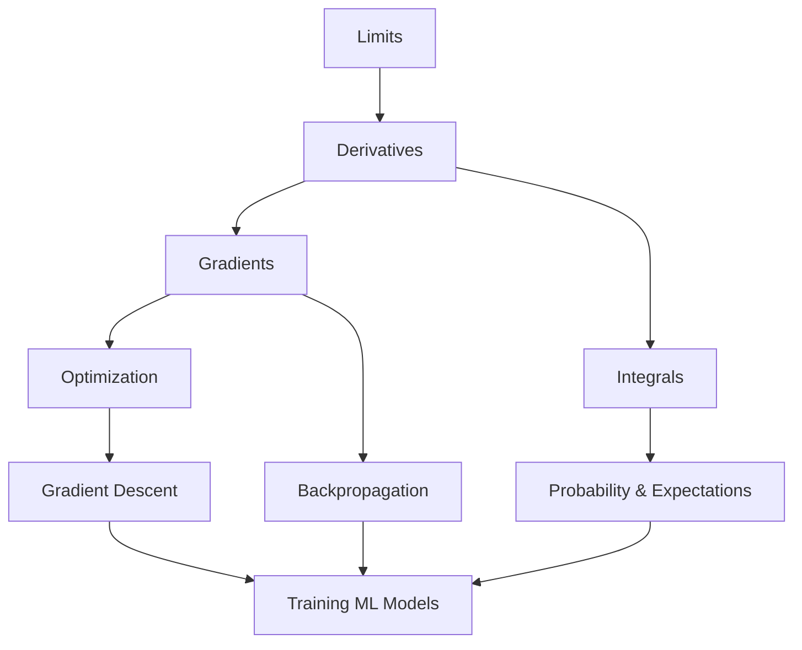

# Level 6: Calculus - The Optimization Engine

## Overview

Welcome to Level 6, where we explore **Calculus**—the mathematical framework that powers modern machine learning's ability to learn from data. If linear algebra provides the language of data transformation and probability gives us uncertainty quantification, calculus is the **optimization engine** that drives learning algorithms to find optimal solutions.

## Why Calculus for Machine Learning?

At its core, machine learning is an optimization problem: given data, find the model parameters that minimize prediction error. This optimization relies entirely on calculus:

- **Derivatives** tell us how to adjust parameters to reduce error
- **Gradients** point us toward the steepest improvement direction
- **The chain rule** enables backpropagation through deep networks
- **Integrals** help us compute expectations and probabilities

Without calculus, there would be no gradient descent, no backpropagation, and no practical way to train neural networks.

## The Core Insight

Imagine you're blindfolded on a hilly landscape and need to find the lowest point. Calculus gives you the ability to feel the slope beneath your feet (derivatives) and know which direction leads downhill fastest (gradients). This is exactly what optimization algorithms do when training ML models.

```
                    Loss Landscape

    Loss ↑
         |    *
         |   * *         *
         |  *   *       * *
         | *     *     *   *
         |*       *   *     *
         |         * *       *
         |          *         *  ← Global minimum
         +------------------------→ Parameters

    Gradient descent follows the slope downhill
```

## Chapter Structure

### Chapter 1: Limits
The foundation of calculus. Limits formalize the concept of "approaching" a value, which is essential for defining derivatives and understanding continuity.

### Chapter 2: Derivatives
The heart of optimization. Derivatives measure instantaneous rates of change and enable us to find function minima—the mathematical basis of training ML models.

### Chapter 3: Gradients
Derivatives generalized to multiple dimensions. Gradients, Jacobians, and Hessians tell us how functions change in multi-dimensional parameter spaces.

### Chapter 4: Optimization
Putting derivatives to work. Understanding local vs. global minima, critical points, and saddle points is crucial for training deep learning models.

### Chapter 5: Integral Calculus
The reverse of differentiation. Integrals compute accumulated quantities and are essential for probability distributions and expectations.

## Prerequisites

Before diving into this level, ensure you're comfortable with:

- **Level 1**: Basic arithmetic and algebraic manipulation
- **Level 2**: Functions and their properties
- **Level 5**: Linear algebra basics (vectors, matrices)

## Learning Objectives

By the end of this level, you will be able to:

1. **Explain** how limits form the foundation of calculus
2. **Compute** derivatives of common functions using rules and chain rule
3. **Calculate** gradients of multivariate functions
4. **Understand** the geometry of optimization landscapes
5. **Apply** numerical differentiation in Python
6. **Connect** calculus concepts to gradient descent and backpropagation

## The Big Picture



## Practical Relevance

| Calculus Concept | ML Application |
|------------------|----------------|
| Derivative | Measuring loss sensitivity to parameters |
| Chain Rule | Backpropagation in neural networks |
| Gradient | Direction for parameter updates |
| Hessian | Second-order optimization methods |
| Integral | Computing expectations, normalizing distributions |

## Mindset for This Level

Calculus might seem abstract at first, but remember: every concept here has a direct, practical application in machine learning. When you learn about derivatives, you're learning how neural networks determine which weights to adjust. When you study gradients, you're understanding how gradient descent navigates loss landscapes.

**Think geometrically**: Visualize functions as landscapes, derivatives as slopes, and optimization as finding valleys.

**Think computationally**: Every formula can be implemented in code and verified numerically.

**Think practically**: Connect each concept to its ML application.

Let's begin our journey into the mathematical engine that powers modern AI.

---

*"Calculus is the language God used to write the universe." — Richard Feynman*

*In machine learning, calculus is the language we use to teach machines.*
