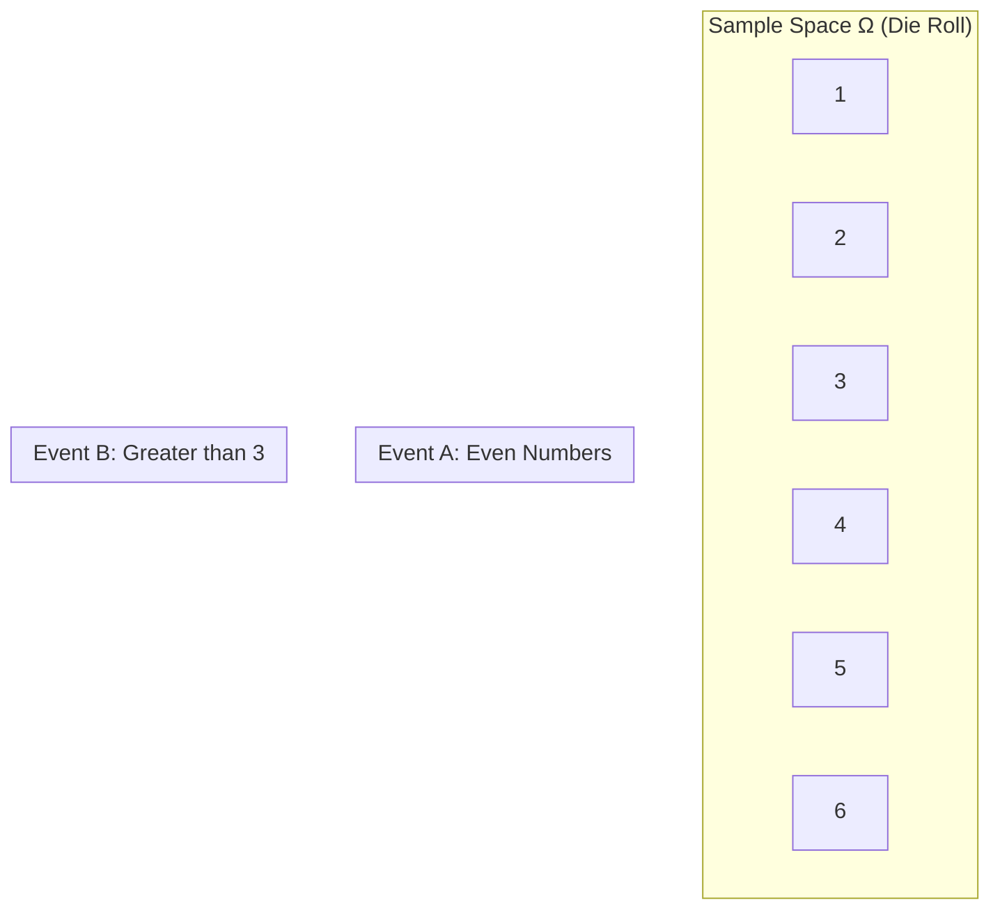
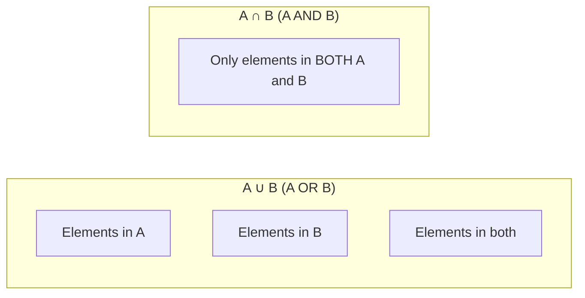

# Chapter 1: Probability Foundations

## Intuition

Imagine you're playing a game where you flip a fair coin. Before the flip, you don't know the outcome, but you have an intuitive sense that heads and tails are equally likely. Probability theory formalizes this intuition - it's a mathematical language for quantifying uncertainty.

**Real-world analogy**: Think of probability as a measure of your confidence. When a weather app says "70% chance of rain," it's expressing uncertainty quantitatively. The app isn't saying it will definitely rain or definitely won't - it's giving you a number that helps you decide whether to bring an umbrella.

**Why this matters for ML**: Every machine learning model deals with uncertainty. When a classifier says "this email is 95% likely to be spam," it's expressing a probability. Understanding probability foundations helps you:
- Interpret model outputs correctly
- Design appropriate loss functions
- Reason about model confidence and calibration

## Visual Explanation

### The Sample Space

The sample space $\Omega$ is the set of all possible outcomes. Events are subsets of this space.



### Set Operations on Events

$$A \cup B = \text{A or B (union)}$$
$$A \cap B = \text{A and B (intersection)}$$
$$A^c = \text{not A (complement)}$$



## Mathematical Foundation

### Definition: Sample Space

The **sample space** $\Omega$ is the set of all possible outcomes of a random experiment.

**Examples**:
- Coin flip: $\Omega = \{H, T\}$
- Die roll: $\Omega = \{1, 2, 3, 4, 5, 6\}$
- Real number between 0 and 1: $\Omega = [0, 1]$

### Definition: Event

An **event** $A$ is any subset of the sample space: $A \subseteq \Omega$

**Examples**:
- "Getting heads": $A = \{H\}$
- "Rolling an even number": $A = \{2, 4, 6\}$
- "Getting a number less than 0.5": $A = [0, 0.5)$

### The Three Axioms of Probability (Kolmogorov Axioms)

A probability function $P$ must satisfy:

**Axiom 1: Non-negativity**
$$P(A) \geq 0 \text{ for all events } A$$

Probabilities are never negative.

**Axiom 2: Normalization**
$$P(\Omega) = 1$$

Something must happen - the probability of the entire sample space is 1.

**Axiom 3: Additivity**
$$\text{If } A \cap B = \emptyset, \text{ then } P(A \cup B) = P(A) + P(B)$$

For mutually exclusive events (events that can't both happen), probabilities add.

### Key Formulas Derived from Axioms

**Complement Rule**:
$$P(A^c) = 1 - P(A)$$

**Inclusion-Exclusion** (for non-mutually-exclusive events):
$$P(A \cup B) = P(A) + P(B) - P(A \cap B)$$

**Bounds**:
$$0 \leq P(A) \leq 1$$

### Derivation: Complement Rule

Since $A$ and $A^c$ are mutually exclusive and $A \cup A^c = \Omega$:

$$P(\Omega) = P(A \cup A^c) = P(A) + P(A^c) = 1$$

Therefore: $P(A^c) = 1 - P(A)$

## Code Example

```python
import numpy as np
from scipy import stats
from itertools import product

# =============================================================================
# Example 1: Simulating probability with a die roll
# =============================================================================

def simulate_die_probability(n_rolls=100000):
    """Simulate die rolls to estimate probabilities."""
    np.random.seed(42)

    # Sample space for a fair die
    sample_space = [1, 2, 3, 4, 5, 6]

    # Simulate n_rolls
    rolls = np.random.choice(sample_space, size=n_rolls)

    # Event A: Rolling an even number
    event_A = rolls % 2 == 0
    prob_A = np.mean(event_A)

    # Event B: Rolling greater than 3
    event_B = rolls > 3
    prob_B = np.mean(event_B)

    # Event A AND B: Even AND greater than 3 (i.e., 4 or 6)
    event_A_and_B = event_A & event_B
    prob_A_and_B = np.mean(event_A_and_B)

    # Event A OR B: Even OR greater than 3 (i.e., 2, 4, 5, 6)
    event_A_or_B = event_A | event_B
    prob_A_or_B = np.mean(event_A_or_B)

    print("Die Roll Probability Simulation")
    print("=" * 40)
    print(f"Number of rolls: {n_rolls}")
    print(f"P(Even) = {prob_A:.4f} (theoretical: 0.5)")
    print(f"P(>3) = {prob_B:.4f} (theoretical: 0.5)")
    print(f"P(Even AND >3) = {prob_A_and_B:.4f} (theoretical: 0.333)")
    print(f"P(Even OR >3) = {prob_A_or_B:.4f} (theoretical: 0.667)")

    # Verify inclusion-exclusion
    inclusion_exclusion = prob_A + prob_B - prob_A_and_B
    print(f"\nInclusion-Exclusion verification:")
    print(f"P(A) + P(B) - P(A∩B) = {inclusion_exclusion:.4f}")
    print(f"P(A∪B) = {prob_A_or_B:.4f}")

simulate_die_probability()

# =============================================================================
# Example 2: Working with sample spaces programmatically
# =============================================================================

def analyze_two_dice():
    """Analyze the sample space of rolling two dice."""

    # Sample space: all possible outcomes of rolling two dice
    die = [1, 2, 3, 4, 5, 6]
    sample_space = list(product(die, die))  # Cartesian product

    print("\n\nTwo Dice Sample Space Analysis")
    print("=" * 40)
    print(f"Total outcomes (|Ω|): {len(sample_space)}")

    # Event: Sum equals 7
    sum_7 = [outcome for outcome in sample_space if sum(outcome) == 7]
    prob_sum_7 = len(sum_7) / len(sample_space)
    print(f"\nEvent: Sum = 7")
    print(f"Favorable outcomes: {sum_7}")
    print(f"P(Sum = 7) = {len(sum_7)}/{len(sample_space)} = {prob_sum_7:.4f}")

    # Event: Both dice show same number (doubles)
    doubles = [outcome for outcome in sample_space if outcome[0] == outcome[1]]
    prob_doubles = len(doubles) / len(sample_space)
    print(f"\nEvent: Doubles")
    print(f"Favorable outcomes: {doubles}")
    print(f"P(Doubles) = {len(doubles)}/{len(sample_space)} = {prob_doubles:.4f}")

    # Event: Sum greater than 10
    sum_gt_10 = [outcome for outcome in sample_space if sum(outcome) > 10]
    prob_sum_gt_10 = len(sum_gt_10) / len(sample_space)
    print(f"\nEvent: Sum > 10")
    print(f"Favorable outcomes: {sum_gt_10}")
    print(f"P(Sum > 10) = {len(sum_gt_10)}/{len(sample_space)} = {prob_sum_gt_10:.4f}")

analyze_two_dice()

# =============================================================================
# Example 3: Verifying probability axioms
# =============================================================================

def verify_axioms():
    """Demonstrate that our probability calculations satisfy the axioms."""

    print("\n\nVerifying Probability Axioms")
    print("=" * 40)

    # Sample space
    omega = {1, 2, 3, 4, 5, 6}

    # Define probability function (uniform distribution)
    def P(event):
        return len(event) / len(omega)

    # Axiom 1: Non-negativity
    event_A = {2, 4, 6}
    print(f"\nAxiom 1 (Non-negativity): P(A) = {P(event_A)} >= 0 ✓")

    # Axiom 2: Normalization
    print(f"Axiom 2 (Normalization): P(Ω) = {P(omega)} = 1 ✓")

    # Axiom 3: Additivity for mutually exclusive events
    event_B = {1, 2}  # Rolling 1 or 2
    event_C = {5, 6}  # Rolling 5 or 6
    # B and C are mutually exclusive (no overlap)
    assert event_B.intersection(event_C) == set()

    prob_B_union_C = P(event_B.union(event_C))
    prob_B_plus_C = P(event_B) + P(event_C)
    print(f"Axiom 3 (Additivity): P(B∪C) = {prob_B_union_C:.4f}, P(B) + P(C) = {prob_B_plus_C:.4f} ✓")

verify_axioms()
```

## ML Relevance

### Where Probability Foundations Appear in ML

1. **Classification Output**: When a neural network outputs [0.1, 0.7, 0.2] for three classes, these are probabilities. They must sum to 1 (normalization axiom).

2. **Softmax Function**: The softmax function ensures neural network outputs satisfy probability axioms:
   $$\text{softmax}(z_i) = \frac{e^{z_i}}{\sum_j e^{z_j}}$$

3. **Loss Functions**: Cross-entropy loss is derived from probability theory:
   $$L = -\sum_i y_i \log(\hat{y}_i)$$

4. **Data Augmentation**: Randomly applying transformations is based on probability - each augmentation has some probability of being applied.

5. **Dropout**: During training, each neuron has probability $p$ of being "dropped out" - this is a probabilistic regularization technique.

### Algorithms Using These Concepts

- **Naive Bayes Classifier**: Built entirely on probability axioms and Bayes' theorem
- **Logistic Regression**: Outputs are probabilities of class membership
- **Random Forests**: "Random" refers to probabilistic sampling of features and data
- **Monte Carlo Methods**: Estimate intractable quantities using random sampling

## When to Use / Ignore

### When to Use Probability Foundations

- **Designing model outputs**: Ensure your model outputs valid probabilities
- **Interpreting results**: Understand what confidence scores mean
- **Debugging**: Check if probabilities sum to 1, are non-negative
- **Theoretical analysis**: Proving properties of algorithms

### Common Pitfalls

1. **Probabilities that don't sum to 1**: If your multi-class classifier outputs don't sum to 1, something is wrong.

2. **Negative "probabilities"**: Some methods (like raw logits) can be negative - they're not probabilities until transformed.

3. **Confusing probability with frequency**: Probability is a model; frequency is observed data. They're related but not identical.

4. **Ignoring sample space definition**: Being unclear about $\Omega$ leads to confusing probability calculations.

## Exercises

### Exercise 1: Basic Probability Calculation

A deck of cards has 52 cards (4 suits, 13 ranks). Calculate:
- P(drawing a heart)
- P(drawing a face card: J, Q, or K)
- P(drawing a heart OR a face card)

**Solution**:
```python
# Sample space size
total_cards = 52

# P(heart)
hearts = 13
P_heart = hearts / total_cards
print(f"P(heart) = {P_heart:.4f}")  # 0.25

# P(face card)
face_cards = 12  # 4 suits × 3 face cards
P_face = face_cards / total_cards
print(f"P(face card) = {P_face:.4f}")  # 0.2308

# P(heart OR face card) using inclusion-exclusion
# P(heart AND face) = 3/52 (J, Q, K of hearts)
P_heart_and_face = 3 / total_cards
P_heart_or_face = P_heart + P_face - P_heart_and_face
print(f"P(heart OR face) = {P_heart_or_face:.4f}")  # 0.4231
```

### Exercise 2: Complement Rule

In a spam filter, 15% of emails are spam. What's the probability an email is NOT spam?

**Solution**:
```python
P_spam = 0.15
P_not_spam = 1 - P_spam
print(f"P(not spam) = {P_not_spam}")  # 0.85
```

### Exercise 3: Sample Space Construction

You flip a coin 3 times. Construct the sample space and calculate P(at least 2 heads).

**Solution**:
```python
from itertools import product

# Construct sample space
coin = ['H', 'T']
sample_space = list(product(coin, repeat=3))
print(f"Sample space: {sample_space}")
print(f"|Ω| = {len(sample_space)}")  # 8

# Event: at least 2 heads
at_least_2_heads = [outcome for outcome in sample_space
                    if outcome.count('H') >= 2]
print(f"At least 2 heads: {at_least_2_heads}")

P_at_least_2_heads = len(at_least_2_heads) / len(sample_space)
print(f"P(at least 2 heads) = {P_at_least_2_heads}")  # 0.5
```

## Summary

- **Sample space** ($\Omega$): The set of all possible outcomes of a random experiment
- **Event**: A subset of the sample space; something we want to calculate the probability of
- **Kolmogorov Axioms**: Three rules that any valid probability function must satisfy:
  1. Non-negativity: $P(A) \geq 0$
  2. Normalization: $P(\Omega) = 1$
  3. Additivity: $P(A \cup B) = P(A) + P(B)$ for mutually exclusive events
- **Complement Rule**: $P(A^c) = 1 - P(A)$
- **Inclusion-Exclusion**: $P(A \cup B) = P(A) + P(B) - P(A \cap B)$
- These foundations ensure ML model outputs are valid probabilities
- Always verify: probabilities must be between 0 and 1, and mutually exclusive exhaustive events must sum to 1

---

**Next**: [Chapter 2: Conditional Probability](02-conditional-probability.md) - Learn how to update probabilities with new information using Bayes' theorem.
