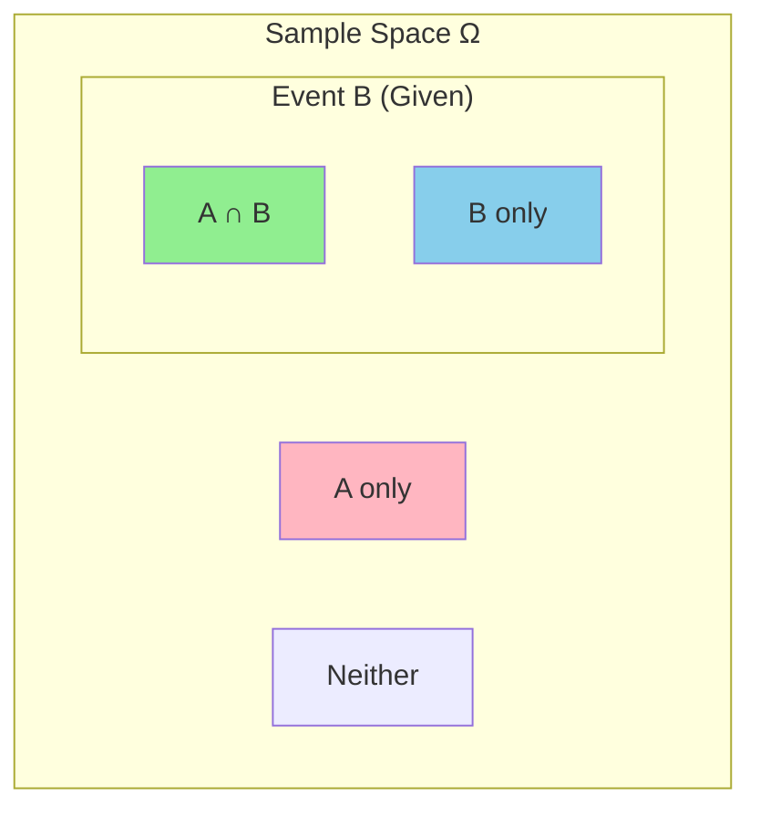

# Chapter 2: Conditional Probability

## Intuition

Imagine you're a doctor diagnosing a patient. Before any tests, you might estimate a 1% chance the patient has a rare disease. But then a test comes back positive. This new information changes everything - your estimate might jump to 50%. This process of updating beliefs with new evidence is what conditional probability captures.

**Real-world analogy**: Think of conditional probability as filtering. When you ask "What's the probability of rain tomorrow?" you get one answer. But when you ask "What's the probability of rain tomorrow, *given* that it's cloudy today?" you're filtering to only consider cloudy days - and that filtered probability is likely higher.

**Why this matters for ML**: Nearly everything in ML involves conditioning on data:
- "What's the probability this email is spam, *given* its words?"
- "What's the probability of the next word, *given* the previous words?"
- Bayes' theorem lets us flip conditional probabilities - crucial for inference

## Visual Explanation

### Conditional Probability as Filtering



$$P(A|B) = \frac{P(A \cap B)}{P(B)}$$

The conditional probability $P(A|B)$ is the probability of A within the "world" where B has occurred.

### Bayes' Theorem Visualized

```mermaid
flowchart LR
    subgraph Prior
        P1[P_Disease_]
    end

    subgraph Likelihood
        P2[P_Positive_Test_|_Disease_]
    end

    subgraph Evidence
        P3[P_Positive_Test_]
    end

    subgraph Posterior
        P4[P_Disease_|_Positive_Test_]
    end

    P1 --> P4
    P2 --> P4
    P3 --> P4

    style P4 fill:#90EE90
```

$$P(\text{Disease}|\text{Positive}) = \frac{P(\text{Positive}|\text{Disease}) \cdot P(\text{Disease})}{P(\text{Positive})}$$

## Mathematical Foundation

### Definition: Conditional Probability

The **conditional probability** of A given B is:

$$P(A|B) = \frac{P(A \cap B)}{P(B)}, \quad \text{provided } P(B) > 0$$

This measures the probability of A occurring when we know B has occurred.

### The Chain Rule (Product Rule)

Rearranging the definition:

$$P(A \cap B) = P(A|B) \cdot P(B) = P(B|A) \cdot P(A)$$

For multiple events:

$$P(A \cap B \cap C) = P(A) \cdot P(B|A) \cdot P(C|A \cap B)$$

### Bayes' Theorem

The crown jewel of conditional probability:

$$P(A|B) = \frac{P(B|A) \cdot P(A)}{P(B)}$$

**The terms have names**:
- $P(A|B)$: **Posterior** - what we want (probability of A after seeing B)
- $P(B|A)$: **Likelihood** - how likely is B if A is true
- $P(A)$: **Prior** - initial belief about A before seeing B
- $P(B)$: **Evidence** (or marginal likelihood) - total probability of B

### Law of Total Probability

If $\{B_1, B_2, ..., B_n\}$ partition the sample space (mutually exclusive and exhaustive):

$$P(A) = \sum_{i=1}^{n} P(A|B_i) \cdot P(B_i)$$

This is essential for computing the evidence term in Bayes' theorem.

### Independence

Events A and B are **independent** if knowing one tells you nothing about the other:

$$P(A|B) = P(A) \quad \text{or equivalently} \quad P(A \cap B) = P(A) \cdot P(B)$$

**Conditional Independence**: A and B are conditionally independent given C if:

$$P(A \cap B | C) = P(A|C) \cdot P(B|C)$$

### Marginalization

To "marginalize out" a variable is to sum (or integrate) over all its possible values:

**Discrete**:
$$P(A) = \sum_b P(A, B=b) = \sum_b P(A|B=b) \cdot P(B=b)$$

**Continuous**:
$$p(x) = \int p(x, y) \, dy = \int p(x|y) \cdot p(y) \, dy$$

## Code Example

```python
import numpy as np
from scipy import stats

# =============================================================================
# Example 1: Medical Diagnosis with Bayes' Theorem
# =============================================================================

def medical_diagnosis_example():
    """
    Classic example: A disease affects 1% of the population.
    A test has:
    - 99% sensitivity (true positive rate): P(positive|disease)
    - 95% specificity (true negative rate): P(negative|no disease)

    If someone tests positive, what's P(disease|positive)?
    """
    print("Medical Diagnosis with Bayes' Theorem")
    print("=" * 50)

    # Prior probabilities
    P_disease = 0.01          # 1% have the disease
    P_no_disease = 0.99       # 99% don't

    # Likelihoods (test characteristics)
    P_pos_given_disease = 0.99     # Sensitivity (true positive rate)
    P_neg_given_no_disease = 0.95  # Specificity (true negative rate)
    P_pos_given_no_disease = 0.05  # False positive rate

    # Evidence: P(positive) using law of total probability
    P_positive = (P_pos_given_disease * P_disease +
                  P_pos_given_no_disease * P_no_disease)

    # Posterior: P(disease|positive) using Bayes' theorem
    P_disease_given_positive = (P_pos_given_disease * P_disease) / P_positive

    print(f"Prior P(disease) = {P_disease:.2%}")
    print(f"P(positive|disease) = {P_pos_given_disease:.2%}")
    print(f"P(positive|no disease) = {P_pos_given_no_disease:.2%}")
    print(f"\nP(positive) = {P_positive:.4f}")
    print(f"\n>>> Posterior P(disease|positive) = {P_disease_given_positive:.2%}")
    print("\nSurprising! Even with a positive test, there's only ~17% chance of disease.")
    print("This is because the disease is rare (low prior).")

medical_diagnosis_example()

# =============================================================================
# Example 2: Naive Bayes Spam Filter
# =============================================================================

def naive_bayes_spam_example():
    """
    Simple spam filter using Bayes' theorem.
    Classify emails based on word frequencies.
    """
    print("\n\n" + "=" * 50)
    print("Naive Bayes Spam Filter")
    print("=" * 50)

    # Training data: word frequencies
    # P(word|spam) and P(word|not spam)
    word_given_spam = {
        'free': 0.8,
        'winner': 0.7,
        'click': 0.6,
        'meeting': 0.1,
        'project': 0.05
    }

    word_given_ham = {
        'free': 0.1,
        'winner': 0.02,
        'click': 0.1,
        'meeting': 0.5,
        'project': 0.6
    }

    # Prior: 30% of emails are spam
    P_spam = 0.3
    P_ham = 0.7

    def classify_email(words):
        """Classify email using Naive Bayes."""
        # Calculate P(spam|words) proportional to P(words|spam) * P(spam)
        # Using log probabilities for numerical stability

        log_prob_spam = np.log(P_spam)
        log_prob_ham = np.log(P_ham)

        for word in words:
            if word in word_given_spam:
                log_prob_spam += np.log(word_given_spam[word])
                log_prob_ham += np.log(word_given_ham[word])

        # Convert back from log space and normalize
        prob_spam = np.exp(log_prob_spam)
        prob_ham = np.exp(log_prob_ham)
        total = prob_spam + prob_ham

        return prob_spam / total, prob_ham / total

    # Test emails
    test_emails = [
        ['free', 'winner', 'click'],
        ['meeting', 'project'],
        ['free', 'meeting']
    ]

    for email in test_emails:
        p_spam, p_ham = classify_email(email)
        label = "SPAM" if p_spam > 0.5 else "HAM"
        print(f"\nEmail words: {email}")
        print(f"P(spam|words) = {p_spam:.4f}")
        print(f"P(ham|words) = {p_ham:.4f}")
        print(f"Classification: {label}")

naive_bayes_spam_example()

# =============================================================================
# Example 3: Independence Testing
# =============================================================================

def independence_example():
    """Demonstrate independence and conditional independence."""
    print("\n\n" + "=" * 50)
    print("Testing Independence")
    print("=" * 50)

    np.random.seed(42)
    n_samples = 100000

    # Generate independent events
    A = np.random.random(n_samples) < 0.3  # P(A) = 0.3
    B = np.random.random(n_samples) < 0.5  # P(B) = 0.5

    # Calculate probabilities
    P_A = np.mean(A)
    P_B = np.mean(B)
    P_A_and_B = np.mean(A & B)
    P_A_times_B = P_A * P_B

    print("\nIndependent Events A and B:")
    print(f"P(A) = {P_A:.4f}")
    print(f"P(B) = {P_B:.4f}")
    print(f"P(A ∩ B) = {P_A_and_B:.4f}")
    print(f"P(A) × P(B) = {P_A_times_B:.4f}")
    print(f"Independent? P(A∩B) ≈ P(A)×P(B): {np.isclose(P_A_and_B, P_A_times_B, atol=0.01)}")

    # Generate dependent events
    # C depends on A: if A is true, C is more likely
    C = np.where(A, np.random.random(n_samples) < 0.8,
                     np.random.random(n_samples) < 0.2)

    P_C = np.mean(C)
    P_A_and_C = np.mean(A & C)
    P_A_times_C = P_A * P_C

    print("\nDependent Events A and C:")
    print(f"P(A) = {P_A:.4f}")
    print(f"P(C) = {P_C:.4f}")
    print(f"P(A ∩ C) = {P_A_and_C:.4f}")
    print(f"P(A) × P(C) = {P_A_times_C:.4f}")
    print(f"Independent? P(A∩C) ≈ P(A)×P(C): {np.isclose(P_A_and_C, P_A_times_C, atol=0.01)}")

independence_example()

# =============================================================================
# Example 4: Marginalization
# =============================================================================

def marginalization_example():
    """Demonstrate marginalization over a discrete variable."""
    print("\n\n" + "=" * 50)
    print("Marginalization Example")
    print("=" * 50)

    # Joint distribution P(Weather, Mood)
    # Rows: Weather (Sunny, Rainy, Cloudy)
    # Cols: Mood (Happy, Neutral, Sad)

    joint_prob = np.array([
        [0.25, 0.10, 0.05],  # Sunny
        [0.05, 0.10, 0.15],  # Rainy
        [0.10, 0.12, 0.08]   # Cloudy
    ])

    weather_labels = ['Sunny', 'Rainy', 'Cloudy']
    mood_labels = ['Happy', 'Neutral', 'Sad']

    print("\nJoint Distribution P(Weather, Mood):")
    print("         Happy  Neutral  Sad")
    for i, w in enumerate(weather_labels):
        print(f"{w:8} {joint_prob[i, 0]:.2f}   {joint_prob[i, 1]:.2f}     {joint_prob[i, 2]:.2f}")

    # Marginalize over Mood to get P(Weather)
    P_weather = joint_prob.sum(axis=1)
    print("\nMarginal P(Weather) = sum over Mood:")
    for i, w in enumerate(weather_labels):
        print(f"P({w}) = {P_weather[i]:.2f}")

    # Marginalize over Weather to get P(Mood)
    P_mood = joint_prob.sum(axis=0)
    print("\nMarginal P(Mood) = sum over Weather:")
    for i, m in enumerate(mood_labels):
        print(f"P({m}) = {P_mood[i]:.2f}")

    # Calculate conditional P(Mood|Weather=Sunny)
    print("\nConditional P(Mood|Weather=Sunny):")
    P_mood_given_sunny = joint_prob[0, :] / P_weather[0]
    for i, m in enumerate(mood_labels):
        print(f"P({m}|Sunny) = {P_mood_given_sunny[i]:.2f}")

marginalization_example()
```

## ML Relevance

### Where Conditional Probability Appears in ML

1. **Naive Bayes Classifier**:
   $$P(y|x_1, ..., x_n) \propto P(y) \prod_{i=1}^n P(x_i|y)$$
   Assumes features are conditionally independent given the class.

2. **Language Models**:
   $$P(w_1, w_2, ..., w_n) = \prod_{i=1}^n P(w_i|w_1, ..., w_{i-1})$$
   Predicts next word given previous words.

3. **Hidden Markov Models**:
   $$P(x_t|x_1, ..., x_{t-1}) = P(x_t|x_{t-1})$$
   Markov property: future depends only on present, not past.

4. **Variational Autoencoders (VAEs)**:
   $$p(x) = \int p(x|z) p(z) dz$$
   Marginalizes over latent variables.

5. **Bayesian Neural Networks**:
   $$P(\theta|\mathcal{D}) = \frac{P(\mathcal{D}|\theta) P(\theta)}{P(\mathcal{D})}$$
   Posterior over network weights.

### Key Algorithms

- **Naive Bayes**: Direct application of Bayes' theorem with independence assumption
- **Bayesian Optimization**: Uses Bayes' theorem to update beliefs about objective function
- **Expectation-Maximization**: Alternates between computing posteriors and maximizing likelihood
- **Belief Propagation**: Message passing using conditional probabilities
- **MCMC Methods**: Sample from posterior distributions

## When to Use / Ignore

### When to Use Conditional Probability

- **Classification**: Computing P(class|features)
- **Inference**: Updating beliefs with new data
- **Generative models**: Modeling P(data|parameters)
- **Sequential data**: Modeling dependencies between time steps
- **Causal reasoning**: Understanding cause-effect relationships

### When to Use Independence Assumptions

- **High-dimensional data**: Full joint distribution is intractable
- **Limited training data**: Fewer parameters to estimate
- **Fast inference needed**: Independent factors multiply simply
- **Features are actually (approximately) independent**: Legitimate assumption

### Common Pitfalls

1. **Base Rate Neglect**: Ignoring priors (like in the medical example - a positive test doesn't mean certain disease).

2. **Assuming Independence When Correlated**: Naive Bayes assumes feature independence; violated correlations can hurt performance.

3. **Confusing P(A|B) with P(B|A)**: The prosecutor's fallacy - P(evidence|innocent) is not P(innocent|evidence).

4. **Forgetting to Normalize**: Posterior probabilities must sum to 1.

## Exercises

### Exercise 1: Bayes' Theorem Application

A factory has two machines. Machine A produces 60% of items, Machine B produces 40%. Machine A has a 2% defect rate, Machine B has a 5% defect rate. If an item is defective, what's the probability it came from Machine A?

**Solution**:
```python
# Prior probabilities
P_A = 0.6
P_B = 0.4

# Likelihoods
P_defect_given_A = 0.02
P_defect_given_B = 0.05

# Evidence: P(defect) using law of total probability
P_defect = P_defect_given_A * P_A + P_defect_given_B * P_B
print(f"P(defect) = {P_defect:.4f}")  # 0.032

# Posterior: P(A|defect)
P_A_given_defect = (P_defect_given_A * P_A) / P_defect
print(f"P(Machine A|defect) = {P_A_given_defect:.4f}")  # 0.375

# Despite A producing more items, defective items are more likely from B!
```

### Exercise 2: Testing Independence

Given P(A) = 0.4, P(B) = 0.5, P(A and B) = 0.2, are A and B independent?

**Solution**:
```python
P_A = 0.4
P_B = 0.5
P_A_and_B = 0.2

# Test: P(A ∩ B) = P(A) × P(B)?
P_A_times_B = P_A * P_B
print(f"P(A) × P(B) = {P_A_times_B}")  # 0.2
print(f"P(A ∩ B) = {P_A_and_B}")       # 0.2
print(f"Independent? {P_A_and_B == P_A_times_B}")  # True
```

### Exercise 3: Chain Rule

Three cards are drawn without replacement from a standard deck. What's the probability all three are hearts?

**Solution**:
```python
# P(all 3 hearts) = P(1st heart) × P(2nd heart|1st heart) × P(3rd heart|first 2 hearts)

P_first_heart = 13 / 52
P_second_heart_given_first = 12 / 51
P_third_heart_given_first_two = 11 / 50

P_all_hearts = P_first_heart * P_second_heart_given_first * P_third_heart_given_first_two
print(f"P(all 3 hearts) = {P_all_hearts:.6f}")  # 0.012941

# Verify with combinatorics: C(13,3) / C(52,3)
from math import comb
P_combinatorics = comb(13, 3) / comb(52, 3)
print(f"Verification: {P_combinatorics:.6f}")  # Same answer
```

## Summary

- **Conditional Probability**: $P(A|B) = \frac{P(A \cap B)}{P(B)}$ - probability of A given that B occurred
- **Bayes' Theorem**: $P(A|B) = \frac{P(B|A) P(A)}{P(B)}$ - inverts conditional probabilities
  - Prior: initial belief
  - Likelihood: probability of evidence given hypothesis
  - Posterior: updated belief after evidence
- **Independence**: $P(A \cap B) = P(A) P(B)$ - knowing one event doesn't help predict the other
- **Law of Total Probability**: Compute marginal probability by summing over conditioning variable
- **Marginalization**: Sum (or integrate) over unwanted variables to get marginal distribution
- **Naive Bayes**: Practical classifier using Bayes' theorem with conditional independence assumption
- **Base rate fallacy**: Always consider priors; rare events stay rare even with positive evidence

---

**Next**: [Chapter 3: Random Variables](03-random-variables.md) - Bridge the gap between events and numerical quantities.
