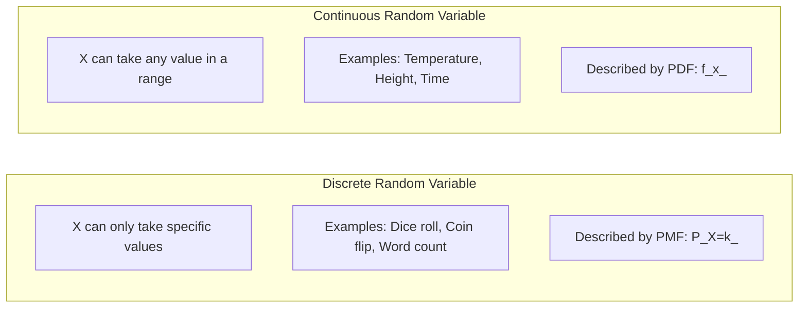
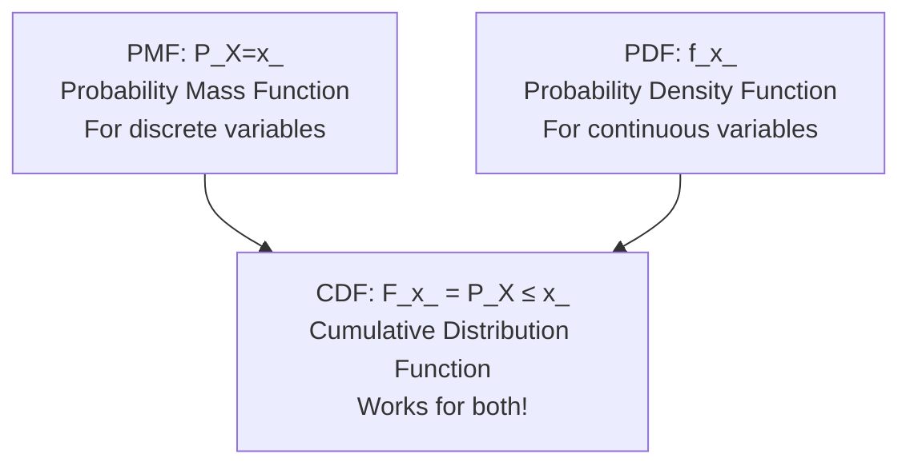

# Chapter 3: Random Variables

## Intuition

A random variable is a way to assign numbers to random outcomes. Instead of thinking about abstract events like "the coin lands heads," we can work with numbers like X = 1 for heads and X = 0 for tails. This numerical representation unlocks the power of mathematics - we can compute averages, measure spread, and perform calculations.

**Real-world analogy**: Think of a random variable as a measurement device. When you step on a scale, the outcome (your weight) varies slightly each time due to measurement noise, your stance, etc. The scale takes the complex physical situation and produces a number. A random variable does the same thing for probability - it takes random outcomes and produces numbers.

**Why this matters for ML**: Machine learning is fundamentally about learning functions that map inputs to outputs. Both inputs (features) and outputs (predictions) are often modeled as random variables. Understanding random variables lets you:
- Model uncertainty in predictions (not just point estimates)
- Design loss functions (which compare distributions)
- Work with probabilistic graphical models

## Visual Explanation

### Discrete vs Continuous Random Variables



### PMF, PDF, and CDF Relationship



### Visual Representation

For a discrete random variable (dice roll):
```
PMF: P(X=k)
     |
0.17 |  *   *   *   *   *   *
     |
     +--1---2---3---4---5---6--> x
```

For a continuous random variable (normal distribution):
```
PDF: f(x)
     |
     |      ***
     |    **   **
     |   *       *
     |  *         *
     +--*-----------*----------> x
        The area under the curve = 1
```

## Mathematical Foundation

### Definition: Random Variable

A **random variable** $X$ is a function that maps outcomes in a sample space $\Omega$ to real numbers:

$$X: \Omega \rightarrow \mathbb{R}$$

**Example**: For a coin flip with $\Omega = \{H, T\}$, we might define:
- $X(H) = 1$
- $X(T) = 0$

### Discrete Random Variables

A **discrete random variable** takes values from a countable set (finite or countably infinite).

**Probability Mass Function (PMF)**:
$$p_X(x) = P(X = x)$$

Properties of PMF:
1. $p_X(x) \geq 0$ for all $x$
2. $\sum_x p_X(x) = 1$
3. $P(X \in A) = \sum_{x \in A} p_X(x)$

### Continuous Random Variables

A **continuous random variable** takes values from an uncountable set (like an interval of real numbers).

**Probability Density Function (PDF)**:
$$P(a \leq X \leq b) = \int_a^b f_X(x) \, dx$$

Properties of PDF:
1. $f_X(x) \geq 0$ for all $x$
2. $\int_{-\infty}^{\infty} f_X(x) \, dx = 1$
3. **Important**: $f_X(x)$ is NOT a probability! It can be greater than 1.
4. $P(X = x) = 0$ for any specific value $x$

### Cumulative Distribution Function (CDF)

The **CDF** works for both discrete and continuous variables:

$$F_X(x) = P(X \leq x)$$

Properties of CDF:
1. $F_X(-\infty) = 0$ and $F_X(\infty) = 1$
2. $F_X$ is non-decreasing
3. $F_X$ is right-continuous
4. $P(a < X \leq b) = F_X(b) - F_X(a)$

### Relationships

**From PDF to CDF** (continuous):
$$F_X(x) = \int_{-\infty}^{x} f_X(t) \, dt$$

**From CDF to PDF** (continuous):
$$f_X(x) = \frac{d}{dx} F_X(x)$$

**From PMF to CDF** (discrete):
$$F_X(x) = \sum_{t \leq x} p_X(t)$$

## Code Example

```python
import numpy as np
from scipy import stats
import matplotlib.pyplot as plt

# =============================================================================
# Example 1: Discrete Random Variable - PMF
# =============================================================================

def discrete_pmf_example():
    """Demonstrate PMF with a biased die."""
    print("Discrete Random Variable: Biased Die")
    print("=" * 50)

    # Define a biased die: 6 is twice as likely as other numbers
    outcomes = [1, 2, 3, 4, 5, 6]
    weights = [1, 1, 1, 1, 1, 2]  # 6 is twice as likely
    probabilities = np.array(weights) / sum(weights)

    print("\nPMF: P(X = k)")
    for k, p in zip(outcomes, probabilities):
        print(f"P(X = {k}) = {p:.4f}")

    # Verify PMF properties
    print(f"\nSum of probabilities: {sum(probabilities):.4f} (should be 1)")
    print(f"All non-negative: {all(p >= 0 for p in probabilities)}")

    # Calculate P(X >= 5)
    P_X_geq_5 = sum(p for k, p in zip(outcomes, probabilities) if k >= 5)
    print(f"\nP(X >= 5) = {P_X_geq_5:.4f}")

    # Simulate to verify
    np.random.seed(42)
    samples = np.random.choice(outcomes, size=100000, p=probabilities)
    simulated_P_X_geq_5 = np.mean(samples >= 5)
    print(f"Simulated P(X >= 5) = {simulated_P_X_geq_5:.4f}")

discrete_pmf_example()

# =============================================================================
# Example 2: Continuous Random Variable - PDF
# =============================================================================

def continuous_pdf_example():
    """Demonstrate PDF with a normal distribution."""
    print("\n\n" + "=" * 50)
    print("Continuous Random Variable: Normal Distribution")
    print("=" * 50)

    # Create a normal distribution
    mu, sigma = 5, 2
    normal = stats.norm(loc=mu, scale=sigma)

    # PDF values at specific points
    x_values = [3, 4, 5, 6, 7]
    print("\nPDF values (these are NOT probabilities!):")
    for x in x_values:
        pdf_val = normal.pdf(x)
        print(f"f({x}) = {pdf_val:.4f}")

    # Probability for a range
    P_3_to_7 = normal.cdf(7) - normal.cdf(3)
    print(f"\nP(3 < X < 7) = {P_3_to_7:.4f}")

    # P(X = 5) = 0 for continuous variable
    print(f"\nP(X = 5) = 0 (for continuous variables)")

    # Verify via integration
    from scipy.integrate import quad
    integral_result, _ = quad(normal.pdf, 3, 7)
    print(f"Integral of PDF from 3 to 7: {integral_result:.4f}")

    # Verify total area = 1
    total_area, _ = quad(normal.pdf, -np.inf, np.inf)
    print(f"Total area under PDF: {total_area:.4f}")

continuous_pdf_example()

# =============================================================================
# Example 3: CDF - The Universal Descriptor
# =============================================================================

def cdf_example():
    """Demonstrate CDF for both discrete and continuous variables."""
    print("\n\n" + "=" * 50)
    print("Cumulative Distribution Function (CDF)")
    print("=" * 50)

    # Discrete: Poisson distribution
    poisson = stats.poisson(mu=3)

    print("\nDiscrete CDF (Poisson with lambda=3):")
    for k in range(8):
        print(f"F({k}) = P(X <= {k}) = {poisson.cdf(k):.4f}")

    # Using CDF to calculate P(2 < X <= 5)
    P_2_to_5 = poisson.cdf(5) - poisson.cdf(2)
    print(f"\nP(2 < X <= 5) = F(5) - F(2) = {P_2_to_5:.4f}")

    # Continuous: Exponential distribution
    exponential = stats.expon(scale=2)  # mean = 2

    print("\n\nContinuous CDF (Exponential with mean=2):")
    x_values = [0, 1, 2, 3, 4, 5]
    for x in x_values:
        print(f"F({x}) = P(X <= {x}) = {exponential.cdf(x):.4f}")

    # Using CDF to find probability in a range
    P_1_to_3 = exponential.cdf(3) - exponential.cdf(1)
    print(f"\nP(1 < X < 3) = F(3) - F(1) = {P_1_to_3:.4f}")

    # Inverse CDF (quantile function)
    print("\n\nInverse CDF / Quantile Function:")
    percentiles = [0.25, 0.50, 0.75, 0.95]
    for p in percentiles:
        x = exponential.ppf(p)  # ppf = percent point function = inverse CDF
        print(f"{p*100:.0f}th percentile: x = {x:.4f}")

cdf_example()

# =============================================================================
# Example 4: scipy.stats Unified Interface
# =============================================================================

def scipy_stats_interface():
    """Show the unified scipy.stats interface for random variables."""
    print("\n\n" + "=" * 50)
    print("scipy.stats Unified Interface")
    print("=" * 50)

    # Discrete distribution
    binomial = stats.binom(n=10, p=0.3)

    print("\nBinomial(n=10, p=0.3) Distribution:")
    print(f"PMF at k=3: P(X=3) = {binomial.pmf(3):.4f}")
    print(f"CDF at k=3: P(X<=3) = {binomial.cdf(3):.4f}")
    print(f"Mean: {binomial.mean():.4f}")
    print(f"Variance: {binomial.var():.4f}")
    print(f"Random samples: {binomial.rvs(size=5)}")

    # Continuous distribution
    normal = stats.norm(loc=0, scale=1)

    print("\nNormal(mu=0, sigma=1) Distribution:")
    print(f"PDF at x=0: f(0) = {normal.pdf(0):.4f}")
    print(f"CDF at x=0: P(X<=0) = {normal.cdf(0):.4f}")
    print(f"Mean: {normal.mean():.4f}")
    print(f"Variance: {normal.var():.4f}")
    print(f"Random samples: {normal.rvs(size=5).round(3)}")

    # Common methods for all distributions
    print("\n\nCommon scipy.stats methods:")
    print("- .pmf(k) or .pdf(x): probability mass/density function")
    print("- .cdf(x): cumulative distribution function")
    print("- .ppf(q): inverse CDF / quantile function")
    print("- .rvs(size): random variates (samples)")
    print("- .mean(), .var(), .std(): moments")
    print("- .interval(alpha): confidence interval")

scipy_stats_interface()

# =============================================================================
# Example 5: Practical - Modeling Sensor Readings
# =============================================================================

def sensor_modeling_example():
    """Model noisy sensor readings as a random variable."""
    print("\n\n" + "=" * 50)
    print("Practical Example: Modeling Sensor Readings")
    print("=" * 50)

    np.random.seed(42)

    # True temperature
    true_temp = 25.0

    # Sensor readings modeled as Normal(true_temp, sigma)
    sensor_noise_std = 0.5
    sensor = stats.norm(loc=true_temp, scale=sensor_noise_std)

    # Simulate 100 readings
    readings = sensor.rvs(size=100)

    print(f"\nTrue temperature: {true_temp}C")
    print(f"Sensor noise (std): {sensor_noise_std}C")
    print(f"\nSimulated readings statistics:")
    print(f"Mean: {np.mean(readings):.3f}C")
    print(f"Std: {np.std(readings):.3f}C")
    print(f"Min: {np.min(readings):.3f}C")
    print(f"Max: {np.max(readings):.3f}C")

    # Probability calculations using the model
    print("\nProbability calculations:")
    print(f"P(reading < 24) = {sensor.cdf(24):.4f}")
    print(f"P(24 < reading < 26) = {sensor.cdf(26) - sensor.cdf(24):.4f}")
    print(f"P(reading > 26) = {1 - sensor.cdf(26):.4f}")

    # What's the threshold for "unusually high" (95th percentile)?
    threshold_95 = sensor.ppf(0.95)
    print(f"\n95th percentile (unusually high): {threshold_95:.3f}C")

sensor_modeling_example()
```

## ML Relevance

### Where Random Variables Appear in ML

1. **Feature Vectors**: Each feature in your dataset can be modeled as a random variable. The feature matrix contains samples from these random variables.

2. **Model Predictions**: Probabilistic classifiers output $P(Y=k|X)$ - a probability distribution over classes.

3. **Loss Functions**: Cross-entropy loss is defined using PMFs:
   $$L = -\sum_k y_k \log \hat{p}_k$$

4. **Generative Models**:
   - VAEs model latent variables $Z$ with PDFs
   - GANs learn to sample from implicit distributions
   - Diffusion models define a chain of random variables

5. **Bayesian Deep Learning**: Model weights as random variables with priors and posteriors.

6. **Dropout**: Each neuron's activation is multiplied by a Bernoulli random variable.

### Specific Algorithms

- **Gaussian Naive Bayes**: Models each feature as a continuous random variable with Gaussian PDF
- **Logistic Regression**: Models class probability using a Bernoulli random variable
- **Mixture Models**: Uses weighted combinations of random variable distributions
- **Hidden Markov Models**: Chains of discrete random variables with transition probabilities
- **Gaussian Processes**: Infinite-dimensional Gaussian random variables

## When to Use / Ignore

### When to Model Something as a Random Variable

- **Inherent uncertainty**: Quantum effects, human behavior, market movements
- **Measurement noise**: Sensor readings, experimental error
- **Lack of complete information**: Hidden variables, unobserved confounders
- **Computational tractability**: Sometimes random models are simpler

### Discrete vs Continuous: How to Choose

| Use Discrete | Use Continuous |
|--------------|----------------|
| Countable outcomes | Measurements on a scale |
| Categories, labels | Physical quantities |
| Counts (0, 1, 2, ...) | Anything that can be fractional |
| Binary decisions | Time, distance, temperature |

### Common Pitfalls

1. **Confusing PDF value with probability**: PDF can exceed 1! Only areas under the curve are probabilities.

2. **Treating discrete as continuous**: Don't integrate a PMF or differentiate a step CDF.

3. **Ignoring the support**: Random variables have domains where they're defined. Normal is $(-\infty, \infty)$, exponential is $[0, \infty)$.

4. **Not normalizing**: Custom distributions must sum/integrate to 1.

## Exercises

### Exercise 1: PMF Verification

Given P(X=1) = 0.2, P(X=2) = 0.3, P(X=3) = 0.4, P(X=4) = 0.1. Verify this is a valid PMF and calculate P(X > 2).

**Solution**:
```python
pmf = {1: 0.2, 2: 0.3, 3: 0.4, 4: 0.1}

# Check validity
all_non_negative = all(p >= 0 for p in pmf.values())
sums_to_one = abs(sum(pmf.values()) - 1.0) < 1e-10

print(f"All non-negative: {all_non_negative}")  # True
print(f"Sums to 1: {sums_to_one}")  # True
print(f"Valid PMF: {all_non_negative and sums_to_one}")  # True

# P(X > 2) = P(X=3) + P(X=4)
P_X_gt_2 = pmf[3] + pmf[4]
print(f"P(X > 2) = {P_X_gt_2}")  # 0.5
```

### Exercise 2: CDF to PMF

Given CDF: F(1) = 0.1, F(2) = 0.4, F(3) = 0.7, F(4) = 1.0. Find the PMF.

**Solution**:
```python
cdf = {1: 0.1, 2: 0.4, 3: 0.7, 4: 1.0}

# PMF: P(X=k) = F(k) - F(k-1)
# For k=1, P(X=1) = F(1) - 0 = F(1)
pmf = {}
prev = 0
for k in sorted(cdf.keys()):
    pmf[k] = cdf[k] - prev
    prev = cdf[k]
    print(f"P(X = {k}) = {pmf[k]}")

# Output: P(X=1)=0.1, P(X=2)=0.3, P(X=3)=0.3, P(X=4)=0.3
```

### Exercise 3: PDF Integration

For a continuous RV with PDF f(x) = 2x for 0 <= x <= 1, find P(0.5 < X < 0.8).

**Solution**:
```python
from scipy.integrate import quad

def pdf(x):
    if 0 <= x <= 1:
        return 2 * x
    return 0

# Verify it integrates to 1
total, _ = quad(pdf, 0, 1)
print(f"Total area: {total}")  # 1.0

# P(0.5 < X < 0.8)
prob, _ = quad(pdf, 0.5, 0.8)
print(f"P(0.5 < X < 0.8) = {prob}")  # 0.39

# Analytical: integral of 2x from 0.5 to 0.8 = x^2 evaluated
# = 0.8^2 - 0.5^2 = 0.64 - 0.25 = 0.39
```

## Summary

- **Random Variable**: A function mapping outcomes to numbers, enabling mathematical manipulation
- **Discrete Random Variable**: Takes countable values; described by PMF $P(X=x)$
- **Continuous Random Variable**: Takes uncountable values; described by PDF $f(x)$
- **PMF Properties**: Non-negative, sums to 1
- **PDF Properties**: Non-negative, integrates to 1, $f(x)$ itself is NOT a probability
- **CDF**: $F(x) = P(X \leq x)$, works universally, always between 0 and 1
- **Relationships**:
  - CDF is integral of PDF (continuous) or cumulative sum of PMF (discrete)
  - PDF is derivative of CDF
- **scipy.stats**: Unified interface with `.pmf()/.pdf()`, `.cdf()`, `.ppf()`, `.rvs()`
- In ML, inputs, outputs, and model parameters can all be modeled as random variables

---

**Next**: [Chapter 4: Expectation and Moments](04-expectation-and-moments.md) - Summarize distributions with numbers like mean, variance, and beyond.
