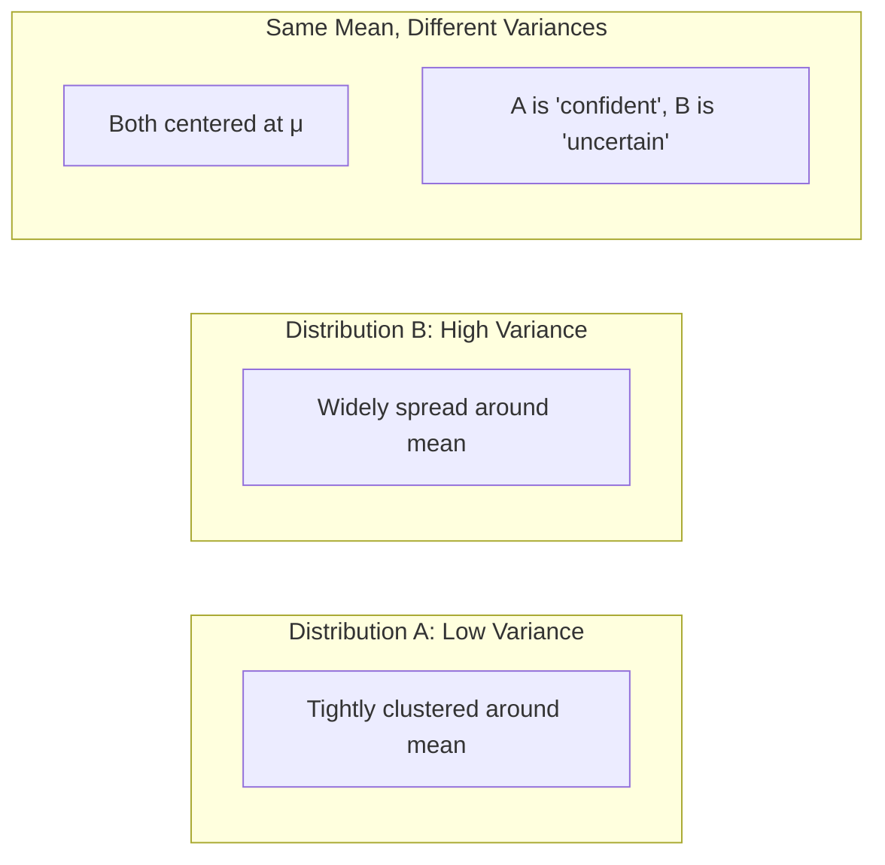

# Chapter 4: Expectation and Moments

## Intuition

Imagine you're trying to describe a city's income distribution using just a few numbers. You might say "the average income is $60,000" (mean) and "incomes vary by about $20,000 from the average" (standard deviation). These summary statistics capture essential information without listing every single income.

**Real-world analogy**: Think of moments as increasingly detailed descriptions of a photograph. The mean tells you where the "center of mass" is. The variance tells you how spread out the content is. Higher moments tell you about asymmetry (skewness) and whether there are extreme outliers (kurtosis). Each moment adds more detail.

**Why this matters for ML**: Machine learning is obsessed with expectations:
- Loss functions are expected values: $L = \mathbb{E}[\ell(y, \hat{y})]$
- Gradient descent uses expected gradients
- Regularization penalizes variance in predictions
- Model evaluation uses expected performance metrics

## Visual Explanation

### Mean and Variance Visualized



### The Four Main Moments

```
                        Moment Hierarchy
                              |
         +--------------------+--------------------+
         |                    |                    |
    1st Moment           2nd Moment          3rd+ Moments
       Mean               Variance        Skewness, Kurtosis
    (Location)            (Spread)        (Shape details)
         |                    |
         v                    v
    "Where is the        "How spread
     center?"             out is it?"
```

### Visual: Same Mean, Different Variances

```
Low Variance (σ = 1):          High Variance (σ = 3):
        |                              |
       ***                            ***
      *****                       ***********
     *******                   *****************
-----|-----|-----           --------|----------|--------
    μ-σ   μ+σ                      μ-σ       μ+σ
```

## Mathematical Foundation

### Definition: Expected Value (Mean)

The **expected value** or **mean** of a random variable X:

**Discrete**:
$$\mathbb{E}[X] = \sum_x x \cdot P(X = x) = \sum_x x \cdot p(x)$$

**Continuous**:
$$\mathbb{E}[X] = \int_{-\infty}^{\infty} x \cdot f(x) \, dx$$

**Notation**: $\mathbb{E}[X]$, $\mu$, $\mu_X$, or $\langle X \rangle$

### Properties of Expectation

**Linearity** (the most important property):
$$\mathbb{E}[aX + bY] = a\mathbb{E}[X] + b\mathbb{E}[Y]$$

This holds even if X and Y are dependent!

**Expectation of a function**:
$$\mathbb{E}[g(X)] = \sum_x g(x) \cdot p(x) \quad \text{(discrete)}$$
$$\mathbb{E}[g(X)] = \int g(x) \cdot f(x) \, dx \quad \text{(continuous)}$$

### Definition: Variance

The **variance** measures spread around the mean:

$$\text{Var}(X) = \mathbb{E}[(X - \mu)^2] = \mathbb{E}[X^2] - (\mathbb{E}[X])^2$$

**Notation**: $\text{Var}(X)$, $\sigma^2$, or $\sigma_X^2$

### Properties of Variance

$$\text{Var}(aX + b) = a^2 \text{Var}(X)$$

For independent X and Y:
$$\text{Var}(X + Y) = \text{Var}(X) + \text{Var}(Y)$$

Variance is always non-negative: $\text{Var}(X) \geq 0$

### Definition: Standard Deviation

The **standard deviation** is the square root of variance:

$$\sigma = \sqrt{\text{Var}(X)}$$

Standard deviation has the same units as X (variance has squared units).

### Definition: Covariance

For two random variables X and Y:

$$\text{Cov}(X, Y) = \mathbb{E}[(X - \mu_X)(Y - \mu_Y)] = \mathbb{E}[XY] - \mathbb{E}[X]\mathbb{E}[Y]$$

Properties:
- $\text{Cov}(X, X) = \text{Var}(X)$
- $\text{Cov}(X, Y) = \text{Cov}(Y, X)$
- If X and Y are independent: $\text{Cov}(X, Y) = 0$
- The converse is NOT true: zero covariance doesn't imply independence

### Definition: Correlation

**Correlation** is normalized covariance:

$$\rho_{XY} = \frac{\text{Cov}(X, Y)}{\sigma_X \sigma_Y}$$

Properties:
- $-1 \leq \rho \leq 1$
- $\rho = 1$: perfect positive linear relationship
- $\rho = -1$: perfect negative linear relationship
- $\rho = 0$: no linear relationship (but may have nonlinear!)

### Higher Moments

**Raw moments**: $\mathbb{E}[X^n]$

**Central moments**: $\mathbb{E}[(X - \mu)^n]$

**Skewness** (3rd standardized moment) - measures asymmetry:
$$\gamma_1 = \mathbb{E}\left[\left(\frac{X - \mu}{\sigma}\right)^3\right]$$

- $\gamma_1 > 0$: right-skewed (tail on right)
- $\gamma_1 < 0$: left-skewed (tail on left)
- $\gamma_1 = 0$: symmetric

**Kurtosis** (4th standardized moment) - measures "tailedness":
$$\gamma_2 = \mathbb{E}\left[\left(\frac{X - \mu}{\sigma}\right)^4\right]$$

Normal distribution has kurtosis = 3. "Excess kurtosis" subtracts 3.

## Code Example

```python
import numpy as np
from scipy import stats

# =============================================================================
# Example 1: Computing Expectation and Variance
# =============================================================================

def expectation_variance_example():
    """Compute mean and variance for discrete and continuous distributions."""
    print("Computing Expectation and Variance")
    print("=" * 50)

    # Discrete: Loaded die
    # X = outcome, probabilities favor 6
    outcomes = np.array([1, 2, 3, 4, 5, 6])
    probabilities = np.array([1, 1, 1, 1, 1, 2]) / 7

    # E[X] = sum(x * p(x))
    mean = np.sum(outcomes * probabilities)

    # E[X^2] = sum(x^2 * p(x))
    E_X_squared = np.sum(outcomes**2 * probabilities)

    # Var(X) = E[X^2] - (E[X])^2
    variance = E_X_squared - mean**2
    std = np.sqrt(variance)

    print("\nDiscrete: Loaded Die (6 is twice as likely)")
    print(f"E[X] = {mean:.4f}")
    print(f"E[X^2] = {E_X_squared:.4f}")
    print(f"Var(X) = {variance:.4f}")
    print(f"Std(X) = {std:.4f}")

    # Verify with simulation
    np.random.seed(42)
    samples = np.random.choice(outcomes, size=100000, p=probabilities)
    print(f"\nSimulation verification (n=100,000):")
    print(f"Sample mean: {np.mean(samples):.4f}")
    print(f"Sample variance: {np.var(samples):.4f}")

    # Continuous: Normal distribution
    print("\n\nContinuous: Normal(mu=5, sigma=2)")
    normal = stats.norm(loc=5, scale=2)
    print(f"E[X] = {normal.mean():.4f}")
    print(f"Var(X) = {normal.var():.4f}")
    print(f"Std(X) = {normal.std():.4f}")

expectation_variance_example()

# =============================================================================
# Example 2: Linearity of Expectation
# =============================================================================

def linearity_example():
    """Demonstrate linearity of expectation."""
    print("\n\n" + "=" * 50)
    print("Linearity of Expectation")
    print("=" * 50)

    np.random.seed(42)
    n = 100000

    # Two random variables (can be dependent or independent)
    X = np.random.normal(loc=3, scale=1, size=n)
    Y = np.random.normal(loc=5, scale=2, size=n)

    # E[X + Y] = E[X] + E[Y]
    print("\nE[X] = 3, E[Y] = 5")
    print(f"E[X + Y] should be 8")
    print(f"E[X + Y] (calculated) = {np.mean(X + Y):.4f}")

    # E[aX + b] = a*E[X] + b
    a, b = 2, 7
    print(f"\nE[{a}X + {b}] should be {a}*3 + {b} = {a*3 + b}")
    print(f"E[{a}X + {b}] (calculated) = {np.mean(a*X + b):.4f}")

    # This works even for DEPENDENT variables!
    Z = X + 0.5 * Y  # Z depends on both X and Y
    print(f"\nZ = X + 0.5*Y (dependent on both)")
    print(f"E[X + Z] should be E[X] + E[Z] = 3 + (3 + 0.5*5) = {3 + 3 + 2.5}")
    print(f"E[X + Z] (calculated) = {np.mean(X + Z):.4f}")

linearity_example()

# =============================================================================
# Example 3: Variance Properties
# =============================================================================

def variance_properties():
    """Demonstrate variance properties."""
    print("\n\n" + "=" * 50)
    print("Variance Properties")
    print("=" * 50)

    np.random.seed(42)
    n = 100000

    X = np.random.normal(loc=0, scale=3, size=n)  # Var(X) = 9
    Y = np.random.normal(loc=0, scale=2, size=n)  # Var(Y) = 4

    # Var(aX + b) = a^2 * Var(X)
    a, b = 2, 5
    print(f"\nVar(X) = 9, Var(Y) = 4")
    print(f"\nVar({a}X + {b}) should be {a}^2 * 9 = {a**2 * 9}")
    print(f"Var({a}X + {b}) (calculated) = {np.var(a*X + b):.4f}")
    print("Note: Adding constant b doesn't affect variance!")

    # For independent X and Y: Var(X + Y) = Var(X) + Var(Y)
    print(f"\nFor independent X, Y:")
    print(f"Var(X + Y) should be 9 + 4 = 13")
    print(f"Var(X + Y) (calculated) = {np.var(X + Y):.4f}")

    # For dependent variables, we need covariance
    Z = X + 0.5 * Y  # Z depends on X
    # Var(X + Z) = Var(X) + Var(Z) + 2*Cov(X,Z)
    cov_XZ = np.cov(X, Z)[0, 1]
    var_sum_formula = np.var(X) + np.var(Z) + 2 * cov_XZ
    print(f"\nFor dependent X, Z:")
    print(f"Var(X + Z) (direct) = {np.var(X + Z):.4f}")
    print(f"Var(X) + Var(Z) + 2*Cov(X,Z) = {var_sum_formula:.4f}")

variance_properties()

# =============================================================================
# Example 4: Covariance and Correlation
# =============================================================================

def covariance_correlation_example():
    """Demonstrate covariance and correlation."""
    print("\n\n" + "=" * 50)
    print("Covariance and Correlation")
    print("=" * 50)

    np.random.seed(42)
    n = 10000

    # Independent variables
    X = np.random.normal(0, 1, n)
    Y = np.random.normal(0, 1, n)

    print("\nIndependent X and Y:")
    print(f"Cov(X, Y) = {np.cov(X, Y)[0,1]:.4f} (should be ~0)")
    print(f"Corr(X, Y) = {np.corrcoef(X, Y)[0,1]:.4f} (should be ~0)")

    # Positively correlated
    Z = X + np.random.normal(0, 0.5, n)  # Z depends on X

    print("\nPositively correlated X and Z:")
    print(f"Cov(X, Z) = {np.cov(X, Z)[0,1]:.4f}")
    print(f"Corr(X, Z) = {np.corrcoef(X, Z)[0,1]:.4f}")

    # Negatively correlated
    W = -X + np.random.normal(0, 0.5, n)

    print("\nNegatively correlated X and W:")
    print(f"Cov(X, W) = {np.cov(X, W)[0,1]:.4f}")
    print(f"Corr(X, W) = {np.corrcoef(X, W)[0,1]:.4f}")

    # Zero covariance but NOT independent (nonlinear relationship)
    U = np.random.uniform(-1, 1, n)
    V = U**2  # V is a function of U, but symmetric

    print("\nZero covariance but DEPENDENT (V = U^2):")
    print(f"Cov(U, V) = {np.cov(U, V)[0,1]:.4f} (near 0)")
    print(f"Corr(U, V) = {np.corrcoef(U, V)[0,1]:.4f} (near 0)")
    print("But V is completely determined by U!")

covariance_correlation_example()

# =============================================================================
# Example 5: Higher Moments - Skewness and Kurtosis
# =============================================================================

def higher_moments_example():
    """Demonstrate skewness and kurtosis."""
    print("\n\n" + "=" * 50)
    print("Higher Moments: Skewness and Kurtosis")
    print("=" * 50)

    np.random.seed(42)
    n = 100000

    # Normal distribution (symmetric, "standard" tail weight)
    normal_samples = stats.norm.rvs(size=n)

    # Right-skewed distribution (exponential)
    right_skewed = stats.expon.rvs(size=n)

    # Left-skewed distribution (reflected exponential)
    left_skewed = -stats.expon.rvs(size=n)

    # Heavy-tailed distribution (t with low df)
    heavy_tailed = stats.t.rvs(df=3, size=n)

    distributions = [
        ("Normal", normal_samples),
        ("Right-skewed (Exp)", right_skewed),
        ("Left-skewed (-Exp)", left_skewed),
        ("Heavy-tailed (t, df=3)", heavy_tailed)
    ]

    print("\n{:<25} {:>10} {:>15}".format("Distribution", "Skewness", "Excess Kurtosis"))
    print("-" * 52)
    for name, samples in distributions:
        skew = stats.skew(samples)
        kurt = stats.kurtosis(samples)  # excess kurtosis (subtracts 3)
        print(f"{name:<25} {skew:>10.4f} {kurt:>15.4f}")

    print("\nInterpretation:")
    print("- Skewness > 0: right tail is longer")
    print("- Skewness < 0: left tail is longer")
    print("- Excess Kurtosis > 0: heavier tails than normal")
    print("- Excess Kurtosis < 0: lighter tails than normal")

higher_moments_example()

# =============================================================================
# Example 6: ML Application - Loss as Expected Value
# =============================================================================

def ml_loss_example():
    """Show that ML loss is an expected value."""
    print("\n\n" + "=" * 50)
    print("ML Application: Loss as Expected Value")
    print("=" * 50)

    np.random.seed(42)

    # True data generating process
    n_samples = 1000
    X = np.random.uniform(0, 10, n_samples)
    y_true = 2 * X + 1 + np.random.normal(0, 2, n_samples)

    # Two models with different predictions
    y_pred_good = 2.1 * X + 0.9  # Good model
    y_pred_bad = 1.5 * X + 3     # Bad model

    # MSE = E[(y - y_hat)^2]
    mse_good = np.mean((y_true - y_pred_good)**2)
    mse_bad = np.mean((y_true - y_pred_bad)**2)

    print("\nMean Squared Error = E[(y - y_hat)^2]")
    print(f"Good model MSE: {mse_good:.4f}")
    print(f"Bad model MSE: {mse_bad:.4f}")

    # Bias-Variance decomposition
    # MSE = Bias^2 + Variance + Irreducible Error
    print("\n\nBias-Variance Decomposition:")
    print("E[(y - y_hat)^2] = Bias^2 + Variance + sigma^2")

    # For the good model
    bias_good = np.mean(y_pred_good) - np.mean(y_true)
    var_pred_good = np.var(y_pred_good)

    print(f"\nGood model:")
    print(f"Bias = {bias_good:.4f}")
    print(f"Variance of predictions = {var_pred_good:.4f}")

ml_loss_example()
```

## ML Relevance

### Where Expectation Appears in ML

1. **Loss Functions**: All standard losses are expectations:
   - MSE: $\mathbb{E}[(y - \hat{y})^2]$
   - Cross-entropy: $\mathbb{E}[-\log p(\hat{y})]$
   - Hinge loss: $\mathbb{E}[\max(0, 1 - y \cdot \hat{y})]$

2. **Stochastic Gradient Descent**: We estimate $\mathbb{E}[\nabla L]$ with mini-batch averages.

3. **Regularization**: Weight decay penalizes $\mathbb{E}[\|\theta\|^2]$.

4. **Batch Normalization**: Uses batch estimates of $\mathbb{E}[X]$ and $\text{Var}(X)$.

5. **Reinforcement Learning**: Policy gradient methods optimize expected reward.

### Where Variance Appears in ML

1. **Model Uncertainty**: Bayesian models estimate prediction variance.

2. **Bias-Variance Tradeoff**: $\mathbb{E}[\text{Error}] = \text{Bias}^2 + \text{Variance} + \text{Noise}$

3. **Feature Scaling**: Standardization divides by standard deviation.

4. **PCA**: Principal components are ordered by variance explained.

5. **Dropout**: Acts as approximate variational inference by injecting variance.

### Specific Algorithms

- **Linear Regression**: Minimizes expected squared error
- **Gaussian Processes**: Provide mean and variance predictions
- **Variational Autoencoders**: Encode mean and variance of latent distribution
- **ADAM Optimizer**: Uses first and second moment estimates of gradients

## When to Use / Ignore

### When to Focus on Mean

- **Point predictions**: When you need a single best guess
- **Risk-neutral decisions**: When all errors cost the same per unit
- **Large sample scenarios**: Mean converges reliably with more data

### When to Focus on Variance

- **Uncertainty quantification**: When you need confidence intervals
- **Risk-averse decisions**: When large errors are disproportionately bad
- **Small sample scenarios**: High variance means unreliable estimates
- **Model selection**: Prefer lower variance models when bias is similar

### Common Pitfalls

1. **Confusing sample and population statistics**:
   - Population mean: $\mu = \mathbb{E}[X]$
   - Sample mean: $\bar{x} = \frac{1}{n}\sum x_i$

2. **Using variance for non-independent sums**: Must include covariance terms.

3. **Ignoring units**: Variance has squared units; use std for interpretability.

4. **Assuming zero covariance implies independence**: Only true for jointly normal.

## Exercises

### Exercise 1: Expected Value Calculation

A game costs $5 to play. You roll a die: if 6, you win $20; if 5, you win $10; otherwise you win nothing. What's the expected profit?

**Solution**:
```python
# Outcomes and probabilities
outcomes = [6, 5, 1, 2, 3, 4]
payouts = [20, 10, 0, 0, 0, 0]
prob = [1/6] * 6
cost = 5

# E[profit] = E[payout] - cost
E_payout = sum(p * payout for p, payout in zip(prob, payouts))
E_profit = E_payout - cost

print(f"E[payout] = {E_payout:.4f}")  # 5.0
print(f"E[profit] = {E_profit:.4f}")  # 0.0

# Fair game! Expected profit is zero.
```

### Exercise 2: Variance from Definition

For X with P(X=-1) = 0.25, P(X=0) = 0.5, P(X=1) = 0.25, calculate Var(X).

**Solution**:
```python
import numpy as np

values = np.array([-1, 0, 1])
probs = np.array([0.25, 0.5, 0.25])

# E[X]
mean = np.sum(values * probs)
print(f"E[X] = {mean}")  # 0

# E[X^2]
E_X_squared = np.sum(values**2 * probs)
print(f"E[X^2] = {E_X_squared}")  # 0.5

# Var(X) = E[X^2] - (E[X])^2
variance = E_X_squared - mean**2
print(f"Var(X) = {variance}")  # 0.5
```

### Exercise 3: Covariance Computation

Given joint distribution: P(X=0,Y=0)=0.2, P(X=0,Y=1)=0.3, P(X=1,Y=0)=0.4, P(X=1,Y=1)=0.1. Find Cov(X,Y).

**Solution**:
```python
import numpy as np

# Joint probabilities
# P(X=0, Y=0) = 0.2, P(X=0, Y=1) = 0.3
# P(X=1, Y=0) = 0.4, P(X=1, Y=1) = 0.1

joint = np.array([[0.2, 0.3],   # X=0
                  [0.4, 0.1]])  # X=1

# Marginal P(X)
P_X = joint.sum(axis=1)  # [0.5, 0.5]
# Marginal P(Y)
P_Y = joint.sum(axis=0)  # [0.6, 0.4]

# E[X], E[Y]
X_vals = np.array([0, 1])
Y_vals = np.array([0, 1])
E_X = np.sum(X_vals * P_X)  # 0.5
E_Y = np.sum(Y_vals * P_Y)  # 0.4

# E[XY]
E_XY = 0
for i, x in enumerate(X_vals):
    for j, y in enumerate(Y_vals):
        E_XY += x * y * joint[i, j]
# Only X=1, Y=1 contributes: 1*1*0.1 = 0.1

# Cov(X,Y) = E[XY] - E[X]E[Y]
cov = E_XY - E_X * E_Y
print(f"E[X] = {E_X}, E[Y] = {E_Y}")
print(f"E[XY] = {E_XY}")
print(f"Cov(X,Y) = {cov}")  # 0.1 - 0.5*0.4 = -0.1

# Negative covariance: when X is high, Y tends to be low
```

## Summary

- **Expected Value (Mean)**: $\mathbb{E}[X] = \sum x \cdot p(x)$ or $\int x \cdot f(x) dx$ - the "center" of a distribution
- **Linearity of Expectation**: $\mathbb{E}[aX + bY] = a\mathbb{E}[X] + b\mathbb{E}[Y]$ - works always, even for dependent variables
- **Variance**: $\text{Var}(X) = \mathbb{E}[(X-\mu)^2] = \mathbb{E}[X^2] - (\mathbb{E}[X])^2$ - measures spread
- **Standard Deviation**: $\sigma = \sqrt{\text{Var}(X)}$ - same units as X
- **Covariance**: $\text{Cov}(X,Y) = \mathbb{E}[XY] - \mathbb{E}[X]\mathbb{E}[Y]$ - measures linear relationship
- **Correlation**: $\rho = \frac{\text{Cov}(X,Y)}{\sigma_X \sigma_Y}$ - normalized to [-1, 1]
- **Skewness**: Measures asymmetry (positive = right tail longer)
- **Kurtosis**: Measures tail weight (higher = heavier tails)
- In ML: losses are expectations, regularization controls variance, SGD estimates expected gradients

---

**Next**: [Chapter 5: Common Distributions](05-common-distributions.md) - Learn the probability distributions you'll encounter throughout ML.
