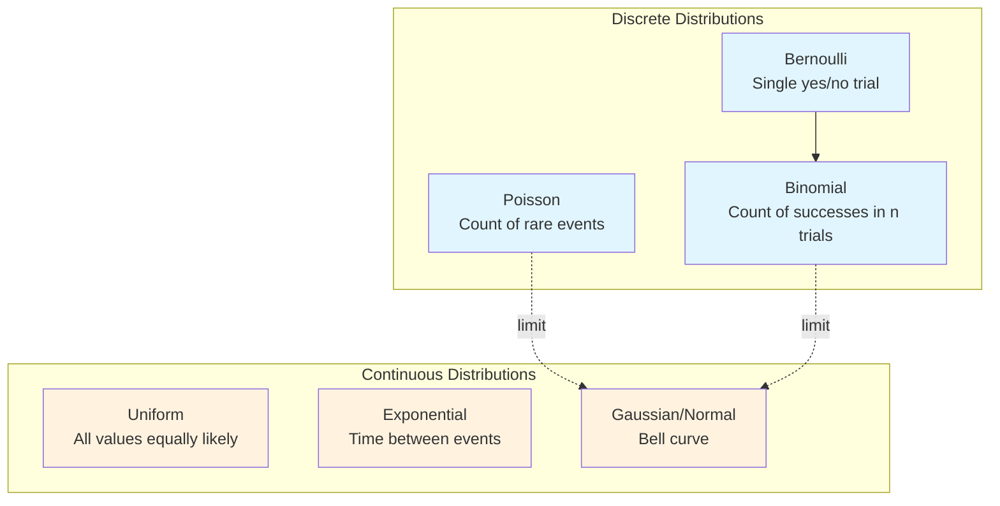

# Chapter 5: Common Probability Distributions

## Intuition

Probability distributions are like templates - patterns that show up repeatedly across different domains. Just as you might recognize that many real-world quantities follow similar shapes, mathematicians have cataloged these patterns and given them names. Knowing these distributions lets you quickly model and reason about uncertainty.

**Real-world analogy**: Think of distributions like weather patterns. Once you recognize "this looks like a typical summer thunderstorm pattern," you can make predictions based on what you know about thunderstorms in general. Similarly, once you recognize "this data follows a Poisson distribution," you can apply everything known about Poisson distributions.

**Why this matters for ML**: Almost every ML algorithm uses specific distributions:
- Classification uses Bernoulli and Categorical distributions
- Regression often assumes Gaussian noise
- Count data uses Poisson
- Time-to-event modeling uses Exponential
- Knowing the right distribution leads to better models and valid inferences

## Visual Explanation

### Distribution Family Tree



### Distribution Shapes at a Glance

```
Bernoulli(p=0.3):       Binomial(n=10, p=0.3):    Poisson(λ=3):
|                       |                          |
| *                     |    *                     |   *
| * *                   |   * *                    |  * *
+---0---1---            +--0-1-2-3-4-5-6-7-8-9-10  +--0-1-2-3-4-5-6-7-8-9

Uniform(0,1):           Exponential(λ=1):         Gaussian(μ=0,σ=1):
|*********|             |*                         |      *
|         |             | *                        |    *   *
|         |             |  **                      |   *     *
+---------+             +----***____               +--*---------*--
0         1             0                          -3  0   3
```

## Mathematical Foundation

---

### 1. Bernoulli Distribution

The simplest distribution: a single trial with two outcomes.

**PMF**:
$$P(X = k) = p^k (1-p)^{1-k}, \quad k \in \{0, 1\}$$

Or simply: $P(X=1) = p$, $P(X=0) = 1-p$

**Parameters**: $p \in [0, 1]$ (probability of success)

**Moments**:
- Mean: $\mathbb{E}[X] = p$
- Variance: $\text{Var}(X) = p(1-p)$

**Use cases**: Coin flips, binary classification labels, click/no-click events

---

### 2. Binomial Distribution

Count of successes in $n$ independent Bernoulli trials.

**PMF**:
$$P(X = k) = \binom{n}{k} p^k (1-p)^{n-k}, \quad k \in \{0, 1, ..., n\}$$

**Parameters**: $n$ (number of trials), $p$ (success probability)

**Moments**:
- Mean: $\mathbb{E}[X] = np$
- Variance: $\text{Var}(X) = np(1-p)$

**Relationship**: Sum of $n$ independent Bernoulli($p$) random variables.

**Use cases**: Number of heads in $n$ coin flips, number of defective items in a batch, A/B test conversions

---

### 3. Poisson Distribution

Count of events occurring in a fixed interval when events happen at a constant average rate.

**PMF**:
$$P(X = k) = \frac{\lambda^k e^{-\lambda}}{k!}, \quad k \in \{0, 1, 2, ...\}$$

**Parameters**: $\lambda > 0$ (rate parameter = average count)

**Moments**:
- Mean: $\mathbb{E}[X] = \lambda$
- Variance: $\text{Var}(X) = \lambda$

**Key property**: Mean equals variance!

**Use cases**: Website visits per hour, typos per page, mutations per genome, arrivals at a queue

---

### 4. Uniform Distribution

All values in a range are equally likely.

**PDF**:
$$f(x) = \frac{1}{b-a}, \quad x \in [a, b]$$

**CDF**:
$$F(x) = \frac{x-a}{b-a}, \quad x \in [a, b]$$

**Parameters**: $a$ (minimum), $b$ (maximum)

**Moments**:
- Mean: $\mathbb{E}[X] = \frac{a+b}{2}$
- Variance: $\text{Var}(X) = \frac{(b-a)^2}{12}$

**Use cases**: Random number generation, non-informative priors, random initialization

---

### 5. Exponential Distribution

Time between events in a Poisson process (memoryless waiting time).

**PDF**:
$$f(x) = \lambda e^{-\lambda x}, \quad x \geq 0$$

**CDF**:
$$F(x) = 1 - e^{-\lambda x}, \quad x \geq 0$$

**Parameters**: $\lambda > 0$ (rate parameter)

**Moments**:
- Mean: $\mathbb{E}[X] = \frac{1}{\lambda}$
- Variance: $\text{Var}(X) = \frac{1}{\lambda^2}$

**Key property**: Memoryless - $P(X > s + t | X > s) = P(X > t)$

**Use cases**: Time until next customer, radioactive decay, component failure time

---

### 6. Gaussian (Normal) Distribution

The "bell curve" - the most important distribution in statistics.

**PDF**:
$$f(x) = \frac{1}{\sigma\sqrt{2\pi}} \exp\left(-\frac{(x-\mu)^2}{2\sigma^2}\right)$$

**Parameters**: $\mu$ (mean), $\sigma > 0$ (standard deviation)

**Moments**:
- Mean: $\mathbb{E}[X] = \mu$
- Variance: $\text{Var}(X) = \sigma^2$

**Standard Normal**: $\mu = 0$, $\sigma = 1$, denoted $Z \sim \mathcal{N}(0, 1)$

**The 68-95-99.7 Rule**:
- 68% of data within $\mu \pm \sigma$
- 95% within $\mu \pm 2\sigma$
- 99.7% within $\mu \pm 3\sigma$

**Why so important**:
1. **Central Limit Theorem**: Sum of many independent random variables approaches normal
2. **Maximum Entropy**: Normal maximizes entropy for given mean and variance
3. **Mathematical Convenience**: Closed under linear transformations, marginalization

**Use cases**: Measurement errors, heights, IQ scores, noise in regression, prior distributions

## Code Example

```python
import numpy as np
from scipy import stats
import matplotlib.pyplot as plt

# =============================================================================
# Example 1: Bernoulli Distribution
# =============================================================================

def bernoulli_example():
    """Demonstrate the Bernoulli distribution."""
    print("Bernoulli Distribution")
    print("=" * 50)

    p = 0.7  # Probability of success
    bernoulli = stats.bernoulli(p)

    print(f"\nBernoulli(p={p})")
    print(f"P(X=0) = {bernoulli.pmf(0):.4f}")
    print(f"P(X=1) = {bernoulli.pmf(1):.4f}")
    print(f"Mean = {bernoulli.mean():.4f} (should be {p})")
    print(f"Variance = {bernoulli.var():.4f} (should be {p*(1-p):.4f})")

    # Simulate
    np.random.seed(42)
    samples = bernoulli.rvs(size=10000)
    print(f"\nSimulation (n=10000):")
    print(f"Proportion of 1s: {np.mean(samples):.4f}")

bernoulli_example()

# =============================================================================
# Example 2: Binomial Distribution
# =============================================================================

def binomial_example():
    """Demonstrate the Binomial distribution."""
    print("\n\n" + "=" * 50)
    print("Binomial Distribution")
    print("=" * 50)

    n, p = 20, 0.3
    binomial = stats.binom(n=n, p=p)

    print(f"\nBinomial(n={n}, p={p})")
    print(f"Mean = {binomial.mean():.4f} (should be {n*p})")
    print(f"Variance = {binomial.var():.4f} (should be {n*p*(1-p):.4f})")

    # PMF for various k
    print("\nPMF values:")
    for k in range(0, 11):
        print(f"P(X={k:2d}) = {binomial.pmf(k):.4f}")

    # Probability questions
    print(f"\nP(X <= 5) = {binomial.cdf(5):.4f}")
    print(f"P(X > 8) = {1 - binomial.cdf(8):.4f}")
    print(f"P(4 <= X <= 8) = {binomial.cdf(8) - binomial.cdf(3):.4f}")

    # Application: A/B Testing
    print("\n--- A/B Testing Application ---")
    print("100 visitors, baseline conversion rate 10%")
    print("We observe 15 conversions. How unlikely is this?")

    ab_test = stats.binom(n=100, p=0.10)
    p_value = 1 - ab_test.cdf(14)  # P(X >= 15)
    print(f"P(X >= 15 | p=0.10) = {p_value:.4f}")
    print(f"This is {'statistically significant' if p_value < 0.05 else 'not significant'} at alpha=0.05")

binomial_example()

# =============================================================================
# Example 3: Poisson Distribution
# =============================================================================

def poisson_example():
    """Demonstrate the Poisson distribution."""
    print("\n\n" + "=" * 50)
    print("Poisson Distribution")
    print("=" * 50)

    # Average 3 website errors per day
    lambda_param = 3
    poisson = stats.poisson(mu=lambda_param)

    print(f"\nPoisson(λ={lambda_param})")
    print(f"Mean = {poisson.mean():.4f}")
    print(f"Variance = {poisson.var():.4f}")
    print("Note: Mean equals Variance for Poisson!")

    print("\nPMF values:")
    for k in range(10):
        print(f"P(X={k}) = {poisson.pmf(k):.4f}")

    # Probability questions
    print(f"\nP(no errors) = P(X=0) = {poisson.pmf(0):.4f}")
    print(f"P(more than 5 errors) = {1 - poisson.cdf(5):.4f}")

    # Scaling property: If errors per day ~ Poisson(3),
    # then errors per week ~ Poisson(21)
    weekly_poisson = stats.poisson(mu=lambda_param * 7)
    print(f"\nWeekly errors: Poisson(λ={lambda_param * 7})")
    print(f"P(weekly errors > 25) = {1 - weekly_poisson.cdf(25):.4f}")

poisson_example()

# =============================================================================
# Example 4: Uniform Distribution
# =============================================================================

def uniform_example():
    """Demonstrate the Uniform distribution."""
    print("\n\n" + "=" * 50)
    print("Uniform Distribution")
    print("=" * 50)

    a, b = 2, 8
    uniform = stats.uniform(loc=a, scale=b-a)  # scipy parametrization

    print(f"\nUniform(a={a}, b={b})")
    print(f"Mean = {uniform.mean():.4f} (should be {(a+b)/2})")
    print(f"Variance = {uniform.var():.4f} (should be {(b-a)**2/12:.4f})")

    # PDF is constant
    print(f"\nPDF value (constant) = {uniform.pdf(5):.4f} = 1/(b-a) = {1/(b-a):.4f}")

    # Probability of being in a sub-interval
    print(f"\nP(3 < X < 6) = {uniform.cdf(6) - uniform.cdf(3):.4f}")
    print(f"This equals (6-3)/(8-2) = {(6-3)/(8-2):.4f}")

    # Quantiles
    print(f"\n25th percentile: {uniform.ppf(0.25):.4f}")
    print(f"50th percentile: {uniform.ppf(0.50):.4f}")
    print(f"75th percentile: {uniform.ppf(0.75):.4f}")

uniform_example()

# =============================================================================
# Example 5: Exponential Distribution
# =============================================================================

def exponential_example():
    """Demonstrate the Exponential distribution."""
    print("\n\n" + "=" * 50)
    print("Exponential Distribution")
    print("=" * 50)

    # Average time between customer arrivals: 5 minutes
    # Rate λ = 1/5 customers per minute
    mean_time = 5
    lambda_rate = 1 / mean_time
    exponential = stats.expon(scale=mean_time)  # scipy uses scale = 1/lambda

    print(f"\nExponential(λ={lambda_rate}, mean={mean_time})")
    print(f"Mean = {exponential.mean():.4f}")
    print(f"Variance = {exponential.var():.4f}")
    print(f"Std = {exponential.std():.4f}")

    # Probability questions
    print(f"\nP(wait < 3 minutes) = {exponential.cdf(3):.4f}")
    print(f"P(wait > 10 minutes) = {1 - exponential.cdf(10):.4f}")

    # Memoryless property
    print("\n--- Memoryless Property ---")
    print("If you've already waited 5 minutes, P(wait > 8 | waited > 5):")
    p_conditional = (1 - exponential.cdf(8)) / (1 - exponential.cdf(5))
    print(f"P(X > 8 | X > 5) = {p_conditional:.4f}")
    print(f"P(X > 3) = {1 - exponential.cdf(3):.4f}")
    print("They're equal! Past waiting doesn't affect future.")

    # Relationship to Poisson
    print("\n--- Relationship to Poisson ---")
    print(f"If arrivals are Poisson(λ={lambda_rate}/min),")
    print(f"then time between arrivals is Exponential(mean={mean_time} min)")

exponential_example()

# =============================================================================
# Example 6: Gaussian (Normal) Distribution
# =============================================================================

def gaussian_example():
    """Demonstrate the Gaussian/Normal distribution."""
    print("\n\n" + "=" * 50)
    print("Gaussian (Normal) Distribution")
    print("=" * 50)

    mu, sigma = 100, 15  # IQ scores
    normal = stats.norm(loc=mu, scale=sigma)

    print(f"\nNormal(μ={mu}, σ={sigma})")
    print(f"Mean = {normal.mean():.4f}")
    print(f"Variance = {normal.var():.4f}")
    print(f"Std = {normal.std():.4f}")

    # PDF at various points
    print("\nPDF values (note: NOT probabilities!):")
    for x in [70, 85, 100, 115, 130]:
        print(f"f({x}) = {normal.pdf(x):.6f}")

    # 68-95-99.7 rule
    print("\n--- 68-95-99.7 Rule ---")
    print(f"P(μ-σ < X < μ+σ) = P({mu-sigma} < X < {mu+sigma}) = {normal.cdf(mu+sigma) - normal.cdf(mu-sigma):.4f}")
    print(f"P(μ-2σ < X < μ+2σ) = P({mu-2*sigma} < X < {mu+2*sigma}) = {normal.cdf(mu+2*sigma) - normal.cdf(mu-2*sigma):.4f}")
    print(f"P(μ-3σ < X < μ+3σ) = P({mu-3*sigma} < X < {mu+3*sigma}) = {normal.cdf(mu+3*sigma) - normal.cdf(mu-3*sigma):.4f}")

    # Percentiles (often used for thresholds)
    print("\n--- Percentiles ---")
    percentiles = [0.01, 0.05, 0.10, 0.25, 0.50, 0.75, 0.90, 0.95, 0.99]
    for p in percentiles:
        print(f"{p*100:5.1f}th percentile: {normal.ppf(p):.2f}")

    # Z-scores
    print("\n--- Z-scores (Standardization) ---")
    print("Z = (X - μ) / σ transforms to Standard Normal")
    x_value = 130
    z_score = (x_value - mu) / sigma
    print(f"X = {x_value} corresponds to Z = {z_score:.2f}")
    print(f"P(X > {x_value}) = P(Z > {z_score:.2f}) = {1 - normal.cdf(x_value):.4f}")

gaussian_example()

# =============================================================================
# Example 7: Comparing Distributions - Central Limit Theorem
# =============================================================================

def clt_demonstration():
    """Demonstrate the Central Limit Theorem."""
    print("\n\n" + "=" * 50)
    print("Central Limit Theorem Demonstration")
    print("=" * 50)

    np.random.seed(42)

    # Start with a highly non-normal distribution (exponential)
    lambda_rate = 1
    original_mean = 1 / lambda_rate
    original_var = 1 / lambda_rate**2

    sample_sizes = [1, 2, 5, 10, 30]
    n_simulations = 10000

    print("\nDistribution of sample means from Exponential(λ=1):")
    print(f"Original distribution: mean={original_mean}, var={original_var}")
    print("\nAs n increases, sample mean distribution approaches Normal:")

    for n in sample_sizes:
        # Generate many samples of size n and compute their means
        sample_means = []
        for _ in range(n_simulations):
            sample = stats.expon(scale=1/lambda_rate).rvs(size=n)
            sample_means.append(np.mean(sample))

        sample_means = np.array(sample_means)

        # Theoretical values from CLT
        theoretical_mean = original_mean
        theoretical_std = np.sqrt(original_var / n)

        # Compare with simulation
        print(f"\nn = {n}:")
        print(f"  Simulated: mean={np.mean(sample_means):.4f}, std={np.std(sample_means):.4f}")
        print(f"  CLT says:  mean={theoretical_mean:.4f}, std={theoretical_std:.4f}")

        # Test for normality (Shapiro-Wilk test)
        if n >= 5:
            _, p_value = stats.shapiro(sample_means[:5000])  # limit for speed
            print(f"  Shapiro-Wilk p-value: {p_value:.4f} (>0.05 suggests normal)")

clt_demonstration()
```

## ML Relevance

### Distribution-Algorithm Mapping

| Distribution | ML Applications |
|--------------|-----------------|
| **Bernoulli** | Binary classification labels, dropout masks, binary features |
| **Binomial** | A/B testing, multi-trial experiments, ensemble voting |
| **Poisson** | Count regression, rare event modeling, text word counts |
| **Uniform** | Weight initialization (pre-Xavier), random search, non-informative priors |
| **Exponential** | Survival analysis, time-to-event, spacing in point processes |
| **Gaussian** | Regression noise, Gaussian processes, VAE latent space, batch norm |

### Specific Algorithms and Their Distributions

1. **Logistic Regression**: Models $P(Y=1|X)$ as Bernoulli with parameter $\sigma(w^T x)$

2. **Naive Bayes**:
   - Gaussian NB: Features are Gaussian given class
   - Multinomial NB: Word counts are Multinomial
   - Bernoulli NB: Features are binary

3. **Gaussian Mixture Models**: Data is a mixture of Gaussians

4. **Neural Network Initialization**:
   - Xavier: Uniform or Normal scaled by layer size
   - He: Normal scaled for ReLU activations

5. **Variational Autoencoders**: Latent space is Gaussian, decoder outputs distribution parameters

6. **Gaussian Processes**: Prior over functions defined by multivariate Gaussian

7. **Poisson Regression**: Model count data with Poisson distribution

## When to Use / Ignore

### Choosing the Right Distribution

| Data Characteristic | Consider Using |
|--------------------|----------------|
| Binary (0 or 1) | Bernoulli |
| Count of successes in fixed trials | Binomial |
| Count with no upper bound | Poisson |
| Any value equally likely in range | Uniform |
| Waiting time / duration | Exponential |
| Sum of many factors / measurements | Gaussian |

### Red Flags: When Your Assumed Distribution is Wrong

1. **Bernoulli/Binomial**: Data has more than two outcomes
2. **Poisson**: Variance is much different from mean
3. **Exponential**: Data has non-zero minimum or heavy tails
4. **Gaussian**: Data is bounded, skewed, or has outliers

### Common Pitfalls

1. **Assuming Gaussian when data is bounded**: Heights can't be negative, but Gaussian extends to $-\infty$.

2. **Using Poisson for highly variable counts**: If variance >> mean, consider Negative Binomial.

3. **Forgetting about parameters**: Exponential with rate $\lambda$ vs scale $1/\lambda$ - scipy uses scale!

4. **Applying CLT too early**: CLT needs "enough" independent samples; n=30 is a rough guideline.

## Exercises

### Exercise 1: Choosing the Right Distribution

For each scenario, identify the most appropriate distribution:
a) Number of customers arriving at a store per hour
b) Whether a user clicks on an ad
c) Test scores in a large population
d) Time until a light bulb fails
e) Number of heads in 50 coin flips

**Solution**:
```python
# a) Poisson - counts in a time interval
# b) Bernoulli - binary outcome
# c) Gaussian - sum of many factors (genetic, environmental, etc.)
# d) Exponential - time until event (memoryless)
# e) Binomial - fixed number of binary trials
```

### Exercise 2: Poisson Calculation

A call center receives an average of 4 calls per minute. What's the probability of receiving exactly 6 calls in a minute? More than 10 calls?

**Solution**:
```python
from scipy import stats

poisson = stats.poisson(mu=4)

# P(X = 6)
p_exactly_6 = poisson.pmf(6)
print(f"P(X = 6) = {p_exactly_6:.4f}")  # 0.1042

# P(X > 10)
p_more_than_10 = 1 - poisson.cdf(10)
print(f"P(X > 10) = {p_more_than_10:.4f}")  # 0.0028
```

### Exercise 3: Normal Distribution Application

SAT scores are approximately Normal with mean 1050 and standard deviation 200. What score is at the 90th percentile? What percentage of students score above 1300?

**Solution**:
```python
from scipy import stats

sat = stats.norm(loc=1050, scale=200)

# 90th percentile
percentile_90 = sat.ppf(0.90)
print(f"90th percentile: {percentile_90:.0f}")  # 1306

# Percentage above 1300
pct_above_1300 = (1 - sat.cdf(1300)) * 100
print(f"Percentage above 1300: {pct_above_1300:.1f}%")  # 10.6%
```

## Summary

### Quick Reference Table

| Distribution | Type | Parameters | Mean | Variance |
|--------------|------|------------|------|----------|
| Bernoulli | Discrete | $p$ | $p$ | $p(1-p)$ |
| Binomial | Discrete | $n, p$ | $np$ | $np(1-p)$ |
| Poisson | Discrete | $\lambda$ | $\lambda$ | $\lambda$ |
| Uniform | Continuous | $a, b$ | $\frac{a+b}{2}$ | $\frac{(b-a)^2}{12}$ |
| Exponential | Continuous | $\lambda$ | $\frac{1}{\lambda}$ | $\frac{1}{\lambda^2}$ |
| Gaussian | Continuous | $\mu, \sigma$ | $\mu$ | $\sigma^2$ |

### Key Takeaways

- **Bernoulli**: Single binary trial; building block for many other distributions
- **Binomial**: Sum of Bernoulli trials; use for counting successes
- **Poisson**: Counting rare events; mean equals variance
- **Uniform**: Maximum ignorance; all values equally likely
- **Exponential**: Memoryless waiting times; connected to Poisson process
- **Gaussian**: The "universal" distribution via Central Limit Theorem; mathematically convenient
- Choose distributions based on data characteristics, not convenience
- scipy.stats provides a unified interface for all distributions

---

**Congratulations!** You've completed Level 7: Probability Theory. You now have the mathematical foundation to understand uncertainty in machine learning models, interpret probabilistic predictions, and work with the most common probability distributions.

**Next Steps**: Level 8 will build on this foundation with Statistics for Machine Learning, covering estimation, hypothesis testing, and statistical inference.
