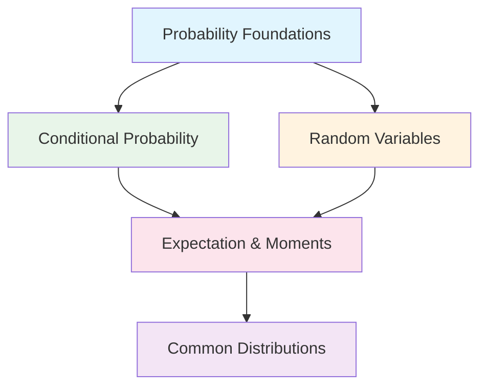

# Level 7: Probability Theory - Uncertainty Modeling

## Welcome to Probability Theory

Probability theory is the mathematical framework for reasoning about uncertainty. In the real world, we rarely have perfect information - sensor readings are noisy, user behavior is unpredictable, and data is incomplete. Probability gives us the tools to model, quantify, and reason about this uncertainty in a rigorous way.

## Why Probability Matters for Machine Learning

Machine learning is fundamentally about making predictions under uncertainty. Every ML system must grapple with:

- **Noisy Data**: Real-world measurements contain errors and noise
- **Limited Information**: We never observe all relevant variables
- **Generalization**: We must predict outcomes for data we haven't seen
- **Model Uncertainty**: We're never certain our model is correct

Probability theory provides the foundation for:

1. **Probabilistic Models**: Naive Bayes, Gaussian Mixture Models, Hidden Markov Models
2. **Bayesian Methods**: Bayesian neural networks, Gaussian processes, probabilistic programming
3. **Loss Functions**: Cross-entropy loss, likelihood-based training
4. **Regularization**: Understanding dropout as approximate Bayesian inference
5. **Generative Models**: VAEs, diffusion models, normalizing flows
6. **Evaluation Metrics**: ROC curves, calibration, probabilistic predictions

## Chapter Overview



### Chapter 1: Probability Foundations
The building blocks of probability - axioms, sample spaces, and events. Learn how to formally define and calculate probabilities.

### Chapter 2: Conditional Probability
How to update beliefs with new information. Covers Bayes' theorem (the foundation of Bayesian ML), independence, and marginalization.

### Chapter 3: Random Variables
The bridge between abstract probability and numerical computation. Understand discrete vs continuous variables and their probability functions.

### Chapter 4: Expectation and Moments
Summarizing distributions with numbers - mean, variance, and beyond. Essential for understanding loss functions and optimization.

### Chapter 5: Common Distributions
The probability distributions you'll encounter repeatedly in ML - from Bernoulli to Gaussian to Poisson.

## Prerequisites

Before diving into probability theory, you should be comfortable with:

- **Calculus**: Derivatives, integrals, multivariate calculus (Level 2)
- **Linear Algebra**: Vectors, matrices, basic operations (Level 3)
- **Set Theory**: Basic set operations (unions, intersections, complements)
- **Python**: NumPy, basic programming concepts

## Learning Objectives

By the end of this level, you will be able to:

1. **Define and calculate** probabilities using the axioms of probability
2. **Apply Bayes' theorem** to update beliefs given new evidence
3. **Work with random variables** and their probability functions (PMF, PDF, CDF)
4. **Calculate expectations** and moments of distributions
5. **Recognize and use** common probability distributions in ML contexts
6. **Implement** probabilistic concepts in Python using scipy.stats

## The Probability Mindset

Thinking probabilistically requires a shift in perspective:

| Deterministic Thinking | Probabilistic Thinking |
|------------------------|------------------------|
| "X will happen" | "X has probability p" |
| "The model predicts Y" | "The model assigns probability q to Y" |
| "This is an outlier" | "This has low probability under our model" |
| "The algorithm works" | "The algorithm succeeds with high probability" |

## Key Notation

| Symbol | Meaning |
|--------|---------|
| $P(A)$ | Probability of event A |
| $P(A \mid B)$ | Probability of A given B |
| $X$ | Random variable |
| $p(x)$ or $P(X=x)$ | Probability mass function (discrete) |
| $f(x)$ | Probability density function (continuous) |
| $F(x)$ | Cumulative distribution function |
| $\mathbb{E}[X]$ | Expected value of X |
| $\text{Var}(X)$ | Variance of X |
| $\sigma$ | Standard deviation |

## How to Study This Level

1. **Start with intuition**: Each chapter begins with real-world analogies
2. **Visualize**: Use the diagrams and code to build geometric intuition
3. **Compute by hand**: Work through the exercises manually first
4. **Then code**: Verify your understanding with Python implementations
5. **Connect to ML**: Always ask "where does this appear in machine learning?"

## Tools We'll Use

```python
import numpy as np
from scipy import stats
import matplotlib.pyplot as plt

# Example: Creating and sampling from a normal distribution
mu, sigma = 0, 1
normal_dist = stats.norm(mu, sigma)

# Sample from the distribution
samples = normal_dist.rvs(size=1000)

# Calculate probabilities
prob_less_than_1 = normal_dist.cdf(1)  # P(X < 1)
print(f"P(X < 1) = {prob_less_than_1:.4f}")
```

## Real-World Applications

Probability theory enables:

- **Medical Diagnosis**: Calculating disease probability given symptoms
- **Spam Filtering**: Estimating probability that an email is spam
- **Recommendation Systems**: Predicting probability a user likes an item
- **Risk Assessment**: Quantifying uncertainty in financial models
- **A/B Testing**: Determining statistical significance of experiments
- **Anomaly Detection**: Identifying events with unusually low probability

## Let's Begin!

Probability theory may seem abstract at first, but it's one of the most practical mathematical tools you'll learn. Every time you train a model, evaluate predictions, or reason about uncertainty, you're using probability.

Start with [Chapter 1: Probability Foundations](01-probability-foundations.md) to build your foundation.

---

*"Probability theory is nothing but common sense reduced to calculation."* - Pierre-Simon Laplace
