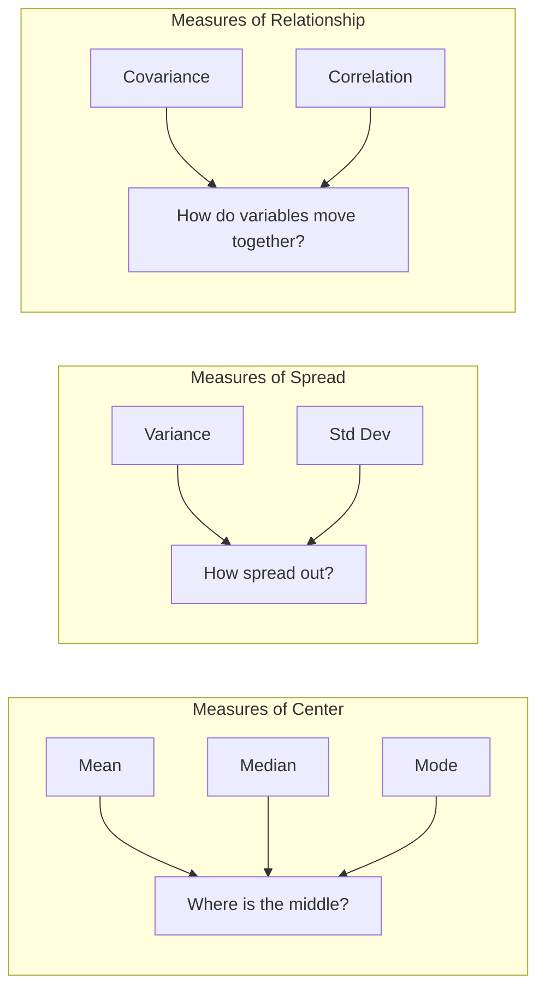

# Descriptive Statistics

## Intuition

Descriptive statistics answer a simple question: "What does my data look like?" Before building complex models, we need to understand our data's basic properties. Think of descriptive statistics as taking a photograph of your dataset - it captures the essential characteristics in a few key numbers.

Imagine you're a data scientist at an e-commerce company. Your manager asks, "How much do our customers typically spend?" You can't list all 1 million transactions, so you summarize: "The average order is $75, but most orders are around $50. There's a lot of variation - some orders are $5, others are $500." That's descriptive statistics in action.

**Real-world analogy**: Descriptive statistics are like vital signs in medicine. Just as temperature, blood pressure, and heart rate give doctors a quick health snapshot, mean, variance, and correlation give data scientists a quick data snapshot.

## Visual Explanation



### Distribution Visualization

Consider a dataset of exam scores:

```
Scores: [65, 70, 72, 75, 75, 78, 80, 82, 85, 95]

Mean (μ) = 77.7    ← "Balance point" of the data
Median = 76.5      ← Middle value when sorted
Mode = 75          ← Most frequent value

        ╔════════════════════════════════════╗
        ║  *                                 ║
        ║  *  *                              ║
        ║  *  *  *  *                        ║
    ────╫──*──*──*──*──*──*─────────*────────╫────
       60   70      80      90     100
                    ↑
                  Mean (77.7)
```

## Mathematical Foundation

### Mean (Average)

The **arithmetic mean** is the sum of all values divided by the count:

$$\bar{x} = \frac{1}{n} \sum_{i=1}^{n} x_i$$

For a probability distribution with PDF $f(x)$, the **expected value** (population mean) is:

$$\mu = E[X] = \int_{-\infty}^{\infty} x \cdot f(x) \, dx$$

**Properties**:
- Sensitive to outliers
- Minimizes sum of squared deviations: $\arg\min_c \sum_i (x_i - c)^2 = \bar{x}$

### Median

The **median** is the middle value when data is sorted. For $n$ observations:

$$\text{Median} = \begin{cases} x_{(n+1)/2} & \text{if } n \text{ is odd} \\ \frac{x_{n/2} + x_{n/2+1}}{2} & \text{if } n \text{ is even} \end{cases}$$

**Properties**:
- Robust to outliers
- Minimizes sum of absolute deviations: $\arg\min_c \sum_i |x_i - c| = \text{Median}$

### Mode

The **mode** is the most frequently occurring value. A distribution can be:
- **Unimodal**: One mode
- **Bimodal**: Two modes
- **Multimodal**: Multiple modes

### Variance

**Variance** measures the average squared deviation from the mean:

$$\sigma^2 = E[(X - \mu)^2] = E[X^2] - (E[X])^2$$

**Sample variance** (unbiased estimator):

$$s^2 = \frac{1}{n-1} \sum_{i=1}^{n} (x_i - \bar{x})^2$$

We divide by $n-1$ (Bessel's correction) because we use $\bar{x}$ instead of the true $\mu$, which costs us one degree of freedom.

**Standard deviation** is the square root of variance: $\sigma = \sqrt{\sigma^2}$

### Covariance

**Covariance** measures how two variables change together:

$$\text{Cov}(X, Y) = E[(X - \mu_X)(Y - \mu_Y)] = E[XY] - E[X]E[Y]$$

**Sample covariance**:

$$s_{xy} = \frac{1}{n-1} \sum_{i=1}^{n} (x_i - \bar{x})(y_i - \bar{y})$$

**Interpretation**:
- $\text{Cov}(X,Y) > 0$: X and Y increase together
- $\text{Cov}(X,Y) < 0$: X increases when Y decreases
- $\text{Cov}(X,Y) = 0$: No linear relationship

### Correlation (Pearson's r)

**Correlation** is normalized covariance, ranging from -1 to 1:

$$\rho_{X,Y} = \frac{\text{Cov}(X, Y)}{\sigma_X \sigma_Y}$$

**Sample correlation**:

$$r = \frac{\sum_{i=1}^{n} (x_i - \bar{x})(y_i - \bar{y})}{\sqrt{\sum_{i=1}^{n} (x_i - \bar{x})^2} \sqrt{\sum_{i=1}^{n} (y_i - \bar{y})^2}}$$

**Interpretation**:
- $r = 1$: Perfect positive linear relationship
- $r = -1$: Perfect negative linear relationship
- $r = 0$: No linear relationship (but could have nonlinear relationship!)

## Code Example

```python
import numpy as np
from scipy import stats

# Sample dataset: Daily sales at two stores
np.random.seed(42)
store_a = np.random.normal(loc=500, scale=100, size=100)  # Mean=$500, std=$100
store_b = 0.8 * store_a + np.random.normal(0, 50, 100)    # Correlated with A

# ============================================
# MEASURES OF CENTRAL TENDENCY
# ============================================

# Mean
mean_a = np.mean(store_a)
print(f"Mean of Store A: ${mean_a:.2f}")

# Median
median_a = np.median(store_a)
print(f"Median of Store A: ${median_a:.2f}")

# Mode (for continuous data, we typically bin first)
# For discrete data:
discrete_data = np.array([1, 2, 2, 3, 3, 3, 4, 4, 5])
mode_result = stats.mode(discrete_data, keepdims=True)
print(f"Mode of discrete data: {mode_result.mode[0]} (appears {mode_result.count[0]} times)")

# ============================================
# MEASURES OF SPREAD
# ============================================

# Variance (ddof=1 for sample variance with Bessel's correction)
variance_a = np.var(store_a, ddof=1)
print(f"\nSample Variance of Store A: ${variance_a:.2f}")

# Standard Deviation
std_a = np.std(store_a, ddof=1)
print(f"Sample Std Dev of Store A: ${std_a:.2f}")

# ============================================
# MEASURES OF RELATIONSHIP
# ============================================

# Covariance
covariance = np.cov(store_a, store_b, ddof=1)[0, 1]
print(f"\nCovariance between stores: {covariance:.2f}")

# Correlation
correlation = np.corrcoef(store_a, store_b)[0, 1]
print(f"Correlation between stores: {correlation:.3f}")

# Alternative: scipy.stats for correlation with p-value
r, p_value = stats.pearsonr(store_a, store_b)
print(f"Pearson r: {r:.3f}, p-value: {p_value:.2e}")

# ============================================
# PRACTICAL EXAMPLE: Feature Analysis
# ============================================

print("\n" + "="*50)
print("FEATURE ANALYSIS FOR ML")
print("="*50)

# Simulate a dataset with features and target
n_samples = 1000
feature1 = np.random.normal(0, 1, n_samples)
feature2 = np.random.exponential(2, n_samples)  # Skewed distribution
feature3 = feature1 * 0.5 + np.random.normal(0, 0.5, n_samples)  # Correlated with feature1
target = 2 * feature1 + 3 * feature2 + np.random.normal(0, 1, n_samples)

# Summary statistics
print("\nFeature Statistics:")
print("-" * 40)
for name, data in [("Feature1", feature1), ("Feature2", feature2), ("Feature3", feature3)]:
    print(f"{name}:")
    print(f"  Mean: {np.mean(data):.3f}")
    print(f"  Median: {np.median(data):.3f}")
    print(f"  Std: {np.std(data, ddof=1):.3f}")
    print(f"  Skewness: {stats.skew(data):.3f}")  # 0 = symmetric

# Correlation matrix
features = np.column_stack([feature1, feature2, feature3])
corr_matrix = np.corrcoef(features, rowvar=False)
print("\nCorrelation Matrix:")
print(corr_matrix.round(3))

# Identify highly correlated features (potential multicollinearity)
print("\nHighly correlated feature pairs (|r| > 0.5):")
for i in range(3):
    for j in range(i+1, 3):
        if abs(corr_matrix[i, j]) > 0.5:
            print(f"  Feature{i+1} - Feature{j+1}: r = {corr_matrix[i, j]:.3f}")
```

**Output**:
```
Mean of Store A: $496.46
Median of Store A: $493.97
Mode of discrete data: 3 (appears 3 times)

Sample Variance of Store A: $8494.53
Sample Std Dev of Store A: $92.17

Covariance between stores: 7282.78
Correlation between stores: 0.919
Pearson r: 0.919, p-value: 1.27e-42

==================================================
FEATURE ANALYSIS FOR ML
==================================================

Feature Statistics:
----------------------------------------
Feature1:
  Mean: 0.024
  Median: 0.032
  Std: 0.989
  Skewness: -0.045
Feature2:
  Mean: 1.991
  Median: 1.371
  Std: 2.021
  Skewness: 2.012
...
```

## ML Relevance

### Where Descriptive Statistics Appear in ML

1. **Data Preprocessing**
   - **Feature scaling**: Z-score normalization uses mean and std: $z = \frac{x - \mu}{\sigma}$
   - **Batch normalization**: Normalizes layer inputs using batch mean and variance

2. **Feature Selection**
   - **Variance threshold**: Remove features with low variance (near-constant)
   - **Correlation analysis**: Identify redundant features (high correlation)

3. **Model Diagnostics**
   - **Residual analysis**: Check if residuals have mean ≈ 0
   - **Loss tracking**: Monitor mean and variance of loss during training

4. **Specific Algorithms**
   - **Naive Bayes**: Uses mean and variance for Gaussian likelihood
   - **K-means**: Cluster centers are means of assigned points
   - **PCA**: Based on covariance matrix eigendecomposition

### Covariance Matrix in ML

The covariance matrix is central to many algorithms:

$$\Sigma = \begin{bmatrix} \text{Var}(X_1) & \text{Cov}(X_1, X_2) & \cdots \\ \text{Cov}(X_2, X_1) & \text{Var}(X_2) & \cdots \\ \vdots & \vdots & \ddots \end{bmatrix}$$

Used in: PCA, Linear Discriminant Analysis, Gaussian Mixture Models, Mahalanobis distance.

## When to Use / Ignore

### When to Use Each Measure

| Situation | Best Measure |
|-----------|--------------|
| Symmetric data, no outliers | Mean |
| Skewed data or outliers | Median |
| Categorical data | Mode |
| Need interpretable spread | Standard deviation |
| Mathematical convenience | Variance |
| Relationship between variables | Correlation (scaled), Covariance (raw) |

### Common Pitfalls

1. **Using mean with skewed data**: Median is more representative for income, house prices, etc.

2. **Assuming correlation = causation**: Two correlated variables might both be caused by a third variable.

3. **Ignoring nonlinear relationships**: Correlation only measures *linear* relationships. Variables can have strong nonlinear relationships with r ≈ 0.

4. **Forgetting Bessel's correction**: Use `ddof=1` in NumPy for sample statistics.

5. **Comparing variances across scales**: A variance of 100 means different things for variables measured in dollars vs. cents.

## Exercises

### Exercise 1: Outlier Impact

Given data: `[10, 12, 14, 15, 16, 18, 20, 100]`

Calculate the mean and median. Which is more robust to the outlier?

**Solution**:
```python
data = [10, 12, 14, 15, 16, 18, 20, 100]
print(f"Mean: {np.mean(data):.2f}")   # Mean: 25.62
print(f"Median: {np.median(data):.2f}")  # Median: 15.50
```
The mean (25.62) is pulled up by the outlier 100. The median (15.50) is unaffected and better represents the "typical" value.

### Exercise 2: Correlation Interpretation

Dataset shows correlation between ice cream sales and drowning deaths is r = 0.85. Does ice cream cause drowning?

**Solution**:
No! This is a classic example of **spurious correlation**. Both variables are caused by a confounding variable: summer weather. Hot weather increases both ice cream consumption and swimming (leading to more drownings). Correlation does not imply causation.

### Exercise 3: Covariance Calculation

Given: X = [1, 2, 3, 4, 5], Y = [2, 4, 5, 4, 5]

Calculate the sample covariance manually and verify with NumPy.

**Solution**:
```python
X = np.array([1, 2, 3, 4, 5])
Y = np.array([2, 4, 5, 4, 5])

# Manual calculation
mean_x, mean_y = np.mean(X), np.mean(Y)
cov_manual = np.sum((X - mean_x) * (Y - mean_y)) / (len(X) - 1)
print(f"Manual: {cov_manual:.2f}")  # 1.50

# NumPy verification
cov_numpy = np.cov(X, Y, ddof=1)[0, 1]
print(f"NumPy: {cov_numpy:.2f}")    # 1.50
```

## Summary

- **Mean**: Average value; sensitive to outliers; minimizes squared error
- **Median**: Middle value; robust to outliers; minimizes absolute error
- **Mode**: Most frequent value; useful for categorical data
- **Variance**: Average squared deviation from mean; units are squared
- **Standard deviation**: Square root of variance; same units as data
- **Covariance**: Measures how two variables change together; scale-dependent
- **Correlation**: Normalized covariance; ranges from -1 to 1; only captures linear relationships
- Always visualize your data - statistics can hide important patterns
- In ML, these concepts appear everywhere: normalization, feature selection, model diagnostics
