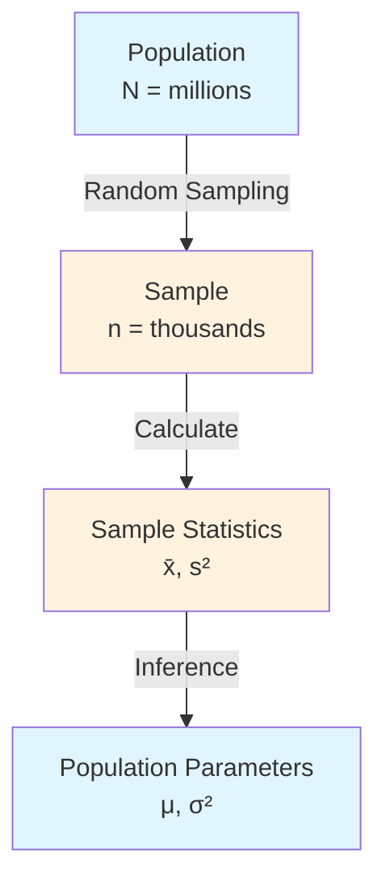

# Sampling Theory

## Intuition

Sampling theory addresses a fundamental question: **How can we learn about millions from studying thousands?** We rarely have access to entire populations - all customers, all possible inputs, all future events. Instead, we work with samples and make inferences about the larger whole.

Consider polling for an election. It's impossible to ask every voter their preference, but by carefully selecting 1,000 voters, pollsters can estimate the national outcome within a few percentage points. How is this possible? Sampling theory provides the mathematical foundation.

**Real-world analogy**: Imagine tasting soup. You don't need to drink the entire pot to know if it needs more salt - a single spoonful tells you about the whole pot. But this only works if the soup is well-stirred (random sampling). If all the salt settled at the bottom, tasting from the top would be misleading (sampling bias).

**Why this matters for ML**: Your training data is always a sample from some larger distribution of possible inputs. Understanding sampling theory helps you:
- Recognize when your training data might not represent deployment conditions
- Know how much data you need for reliable conclusions
- Understand why model performance varies between train/test splits

## Visual Explanation



### Sampling Distribution Concept

```
POPULATION (True μ = 100)
━━━━━━━━━━━━━━━━━━━━━━━━━━━━━

Sample 1: [98, 103, 97, 105, 102] → x̄₁ = 101
Sample 2: [95, 99, 101, 98, 97]  → x̄₂ = 98
Sample 3: [104, 102, 99, 101, 103] → x̄₃ = 101.8
...
Sample 1000: [...]               → x̄₁₀₀₀ = 99.5

Distribution of sample means:
                    ╭───────╮
                   ╱         ╲
                  ╱           ╲
                 ╱             ╲
────────────────╱───────────────╲────────────
              95    100    105
                     ↑
           Mean of sample means ≈ μ = 100
           (Central Limit Theorem)
```

## Mathematical Foundation

### Population vs Sample

| Concept | Population | Sample |
|---------|------------|--------|
| Size | $N$ (often infinite or very large) | $n$ (manageable) |
| Mean | $\mu$ (parameter) | $\bar{x}$ (statistic) |
| Variance | $\sigma^2$ (parameter) | $s^2$ (statistic) |
| Standard Deviation | $\sigma$ | $s$ |

**Key insight**: Parameters are fixed but unknown. Statistics are calculated from data and vary between samples.

### Sampling Bias

**Sampling bias** occurs when some members of the population are systematically more likely to be selected than others. Types include:

1. **Selection bias**: Non-random selection (e.g., online surveys exclude non-internet users)
2. **Survivorship bias**: Only observing "survivors" (e.g., studying successful companies ignores failed ones)
3. **Response bias**: Systematic differences in who responds (e.g., dissatisfied customers more likely to leave reviews)
4. **Temporal bias**: Data from one time period may not generalize (e.g., training on pre-pandemic data)

**In ML**: If training data isn't representative of deployment data, the model will perform poorly in production. This is called **distribution shift** or **covariate shift**.

### Law of Large Numbers (LLN)

The **Law of Large Numbers** states that as sample size increases, the sample mean converges to the population mean.

**Weak LLN**: For i.i.d. random variables $X_1, X_2, ..., X_n$ with mean $\mu$:

$$\bar{X}_n = \frac{1}{n}\sum_{i=1}^{n} X_i \xrightarrow{P} \mu \text{ as } n \to \infty$$

(Convergence in probability)

**Strong LLN**:

$$P\left(\lim_{n \to \infty} \bar{X}_n = \mu\right) = 1$$

(Almost sure convergence)

**Intuition**: More data = more accurate estimates. The "noise" in individual observations averages out.

**Convergence rate**: The standard error of the mean decreases as $\frac{\sigma}{\sqrt{n}}$:

$$SE(\bar{X}) = \frac{\sigma}{\sqrt{n}}$$

To halve the standard error, you need 4x the data.

### Central Limit Theorem (CLT)

The **Central Limit Theorem** is one of the most important results in statistics:

> For i.i.d. random variables $X_1, ..., X_n$ with mean $\mu$ and variance $\sigma^2$, the sampling distribution of the mean approaches a normal distribution as $n \to \infty$:

$$\frac{\bar{X}_n - \mu}{\sigma / \sqrt{n}} \xrightarrow{d} N(0, 1)$$

Or equivalently:

$$\bar{X}_n \sim N\left(\mu, \frac{\sigma^2}{n}\right) \text{ approximately, for large } n$$

**Key implications**:
1. The distribution of sample means is approximately normal, **regardless of the original population distribution**
2. The mean of sample means equals the population mean: $E[\bar{X}] = \mu$
3. The variance of sample means is $\frac{\sigma^2}{n}$ (shrinks with more data)

**Rule of thumb**: CLT works well for $n \geq 30$, but may require more for highly skewed distributions.

## Code Example

```python
import numpy as np
import matplotlib.pyplot as plt
from scipy import stats

np.random.seed(42)

# ============================================
# POPULATION VS SAMPLE
# ============================================

# Create a "population" (in practice, we rarely have this)
population_size = 1_000_000
population = np.random.exponential(scale=50, size=population_size)  # Skewed distribution
true_mean = np.mean(population)
true_std = np.std(population)

print("POPULATION VS SAMPLE")
print("=" * 50)
print(f"Population size: {population_size:,}")
print(f"True mean (μ): {true_mean:.2f}")
print(f"True std (σ): {true_std:.2f}")

# Take a sample
sample_size = 100
sample = np.random.choice(population, size=sample_size, replace=False)
sample_mean = np.mean(sample)
sample_std = np.std(sample, ddof=1)

print(f"\nSample size: {sample_size}")
print(f"Sample mean (x̄): {sample_mean:.2f}")
print(f"Sample std (s): {sample_std:.2f}")
print(f"Estimation error: {abs(sample_mean - true_mean):.2f}")

# ============================================
# LAW OF LARGE NUMBERS DEMONSTRATION
# ============================================

print("\n" + "=" * 50)
print("LAW OF LARGE NUMBERS")
print("=" * 50)

sample_sizes = [10, 50, 100, 500, 1000, 5000, 10000]
running_means = []

for n in sample_sizes:
    sample = np.random.choice(population, size=n, replace=False)
    running_means.append(np.mean(sample))
    error = abs(np.mean(sample) - true_mean)
    print(f"n = {n:5d}: x̄ = {np.mean(sample):.2f}, error = {error:.2f}")

print(f"\nTrue μ = {true_mean:.2f}")
print("Notice: Error decreases as sample size increases!")

# ============================================
# CENTRAL LIMIT THEOREM DEMONSTRATION
# ============================================

print("\n" + "=" * 50)
print("CENTRAL LIMIT THEOREM")
print("=" * 50)

# Take many samples and look at distribution of means
n_samples = 10000
sample_size = 50

sample_means = []
for _ in range(n_samples):
    sample = np.random.choice(population, size=sample_size, replace=False)
    sample_means.append(np.mean(sample))

sample_means = np.array(sample_means)

# Theoretical predictions from CLT
theoretical_mean = true_mean
theoretical_std = true_std / np.sqrt(sample_size)

print(f"Sample size per sample: {sample_size}")
print(f"Number of samples: {n_samples}")
print(f"\nEmpirical distribution of sample means:")
print(f"  Mean: {np.mean(sample_means):.2f} (theory: {theoretical_mean:.2f})")
print(f"  Std:  {np.std(sample_means):.2f} (theory: {theoretical_std:.2f})")

# Test for normality
_, p_value = stats.normaltest(sample_means)
print(f"\nNormality test p-value: {p_value:.4f}")
print("Sample means are approximately normally distributed!" if p_value > 0.05 else "")

# ============================================
# SAMPLING BIAS DEMONSTRATION
# ============================================

print("\n" + "=" * 50)
print("SAMPLING BIAS EXAMPLE")
print("=" * 50)

# Simulate customer satisfaction scores
# True population: mix of satisfied and dissatisfied customers
satisfied = np.random.normal(loc=8, scale=1, size=8000)    # 80% satisfied
dissatisfied = np.random.normal(loc=3, scale=1.5, size=2000)  # 20% dissatisfied
all_customers = np.concatenate([satisfied, dissatisfied])
true_satisfaction = np.mean(all_customers)

# Biased sample: only customers who respond to surveys
# Dissatisfied customers are 3x more likely to respond
response_prob_satisfied = 0.1
response_prob_dissatisfied = 0.3

responding_satisfied = satisfied[np.random.random(len(satisfied)) < response_prob_satisfied]
responding_dissatisfied = dissatisfied[np.random.random(len(dissatisfied)) < response_prob_dissatisfied]
biased_sample = np.concatenate([responding_satisfied, responding_dissatisfied])
biased_satisfaction = np.mean(biased_sample)

print(f"True satisfaction score: {true_satisfaction:.2f}")
print(f"Biased survey result:    {biased_satisfaction:.2f}")
print(f"Bias: {biased_satisfaction - true_satisfaction:.2f}")
print("\nThe biased sample underestimates satisfaction!")
print("Dissatisfied customers are over-represented in responses.")

# ============================================
# STANDARD ERROR AND SAMPLE SIZE
# ============================================

print("\n" + "=" * 50)
print("HOW MUCH DATA DO YOU NEED?")
print("=" * 50)

# Calculate standard error for different sample sizes
target_precision = 1.0  # Want SE < 1.0
current_sigma = 50  # Population std

print(f"Population std: {current_sigma}")
print(f"Target standard error: {target_precision}")

for n in [10, 25, 100, 400, 1000, 2500]:
    se = current_sigma / np.sqrt(n)
    print(f"n = {n:4d}: SE = {se:.2f}")

# Calculate required sample size for target precision
required_n = (current_sigma / target_precision) ** 2
print(f"\nTo achieve SE = {target_precision}, you need n >= {int(np.ceil(required_n)):,}")
```

**Output**:
```
POPULATION VS SAMPLE
==================================================
Population size: 1,000,000
True mean (μ): 50.01
True std (σ): 50.02

Sample size: 100
Sample mean (x̄): 47.52
Sample std (s): 48.23
Estimation error: 2.49

==================================================
LAW OF LARGE NUMBERS
==================================================
n =    10: x̄ = 45.23, error = 4.78
n =    50: x̄ = 51.89, error = 1.88
n =   100: x̄ = 49.12, error = 0.89
n =   500: x̄ = 50.34, error = 0.33
n =  1000: x̄ = 49.78, error = 0.23
n =  5000: x̄ = 50.08, error = 0.07
n = 10000: x̄ = 50.02, error = 0.01

True μ = 50.01
Notice: Error decreases as sample size increases!

==================================================
CENTRAL LIMIT THEOREM
==================================================
Sample size per sample: 50
Number of samples: 10000

Empirical distribution of sample means:
  Mean: 50.02 (theory: 50.01)
  Std:  7.05 (theory: 7.07)
...
```

## ML Relevance

### Where Sampling Theory Appears in ML

1. **Train/Test/Validation Splits**
   - Splits must be random to avoid bias
   - CLT explains why test accuracy approximates true accuracy
   - LLN justifies using finite test sets

2. **Mini-batch Gradient Descent**
   - Each mini-batch is a sample from the training set
   - LLN: Gradient estimate converges to true gradient as batch size increases
   - CLT: Gradient noise is approximately normal

3. **Bootstrap Methods**
   - Resample with replacement to estimate uncertainty
   - Used in Random Forests (bagging)
   - Relies on sampling theory foundations

4. **Cross-Validation**
   - Multiple train/test splits reduce variance of performance estimate
   - Averaging across folds leverages LLN

5. **A/B Testing**
   - CLT justifies using normal distribution for test statistics
   - Sample size calculations use standard error formula

### Distribution Shift in ML

Sampling theory helps us understand distribution shift:

$$P_{train}(X, Y) \neq P_{test}(X, Y)$$

Types of shift:
- **Covariate shift**: $P_{train}(X) \neq P_{test}(X)$
- **Label shift**: $P_{train}(Y) \neq P_{test}(Y)$
- **Concept drift**: $P_{train}(Y|X) \neq P_{test}(Y|X)$

## When to Use / Ignore

### Sample Size Guidelines

| Goal | Rule of Thumb |
|------|---------------|
| CLT to apply | n >= 30 (more for skewed data) |
| Reliable proportions | n >= 100, np >= 10, n(1-p) >= 10 |
| Detect small effects | Power analysis needed |
| Margin of error d | n >= (z * sigma / d)^2 |

### Common Pitfalls

1. **Assuming random sampling when it's not**: Convenience samples (e.g., social media data) are rarely representative.

2. **Ignoring sampling bias in ML datasets**: Many benchmark datasets have known biases (e.g., ImageNet demographics).

3. **Confusing sample size with population size**: Standard error depends on sample size n, not population size N (for large populations).

4. **Forgetting that CLT is asymptotic**: For small samples or highly skewed data, normal approximation may be poor.

5. **Not stratifying when needed**: For rare classes, stratified sampling ensures representation.

## Exercises

### Exercise 1: Sample Size Calculation

You want to estimate the average session duration on your website. Historical data suggests σ ≈ 5 minutes. How many sessions do you need to sample to estimate the mean within ± 0.5 minutes (standard error)?

**Solution**:
$$SE = \frac{\sigma}{\sqrt{n}} \leq 0.5$$
$$\sqrt{n} \geq \frac{5}{0.5} = 10$$
$$n \geq 100$$

You need at least 100 sessions.

```python
sigma = 5
target_se = 0.5
required_n = (sigma / target_se) ** 2
print(f"Required sample size: {int(required_n)}")  # 100
```

### Exercise 2: Identifying Sampling Bias

You train a facial recognition model on photos from your company's employee database. The model performs well on test data from the same database but poorly when deployed. What type of sampling bias might explain this?

**Solution**:
This is **selection bias**. Your employee database likely:
- Over-represents certain demographics (age, ethnicity, gender based on your company's workforce)
- Contains photos taken in similar lighting/backgrounds (office environment)
- May have different camera qualities than deployment environment

The training sample is not representative of the deployment population.

### Exercise 3: CLT Application

A company's order values have mean $80 and standard deviation $40 (highly skewed distribution). If you take a random sample of 100 orders:

a) What is the expected value of the sample mean?
b) What is the standard error of the sample mean?
c) What range contains approximately 95% of sample means?

**Solution**:
```python
mu = 80
sigma = 40
n = 100

# a) Expected value of sample mean
expected_mean = mu
print(f"a) E[x̄] = {expected_mean}")  # 80

# b) Standard error
se = sigma / np.sqrt(n)
print(f"b) SE = {se}")  # 4.0

# c) 95% interval (using z = 1.96 for 95%)
lower = mu - 1.96 * se
upper = mu + 1.96 * se
print(f"c) 95% interval: ({lower:.2f}, {upper:.2f})")  # (72.16, 87.84)
```

## Summary

- **Population vs Sample**: We use sample statistics to estimate population parameters
- **Sampling bias**: Non-random sampling leads to biased estimates; critical problem in ML data collection
- **Law of Large Numbers**: Sample mean converges to population mean as n increases; justifies using finite samples
- **Central Limit Theorem**: Sample means are approximately normal, regardless of population distribution; enables statistical inference
- **Standard Error**: Decreases as $\frac{1}{\sqrt{n}}$; quantifies estimation uncertainty
- **In ML**: Sampling theory underlies train/test splits, mini-batch SGD, cross-validation, and understanding distribution shift
- **Key insight**: More data generally helps, but biased data at any size gives biased results
