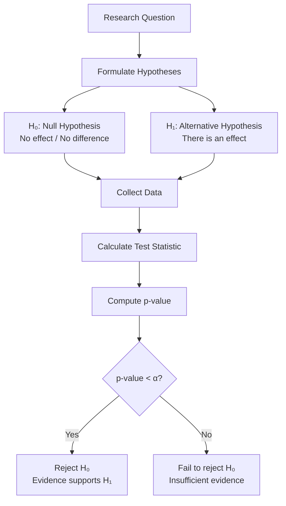
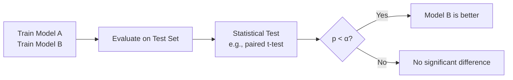

# Hypothesis Testing

## Intuition

Hypothesis testing is a framework for making decisions under uncertainty. It asks: "Could my observations be explained by random chance, or is there something real going on?"

Imagine you launch a new website design and conversion rates increase from 5% to 6%. Is this a genuine improvement, or just random fluctuation? Hypothesis testing provides a principled way to answer this question.

**Real-world analogy**: Hypothesis testing is like a criminal trial. The defendant is "innocent until proven guilty" (null hypothesis). We examine evidence (data) and ask: "If the defendant were truly innocent, how likely would this evidence be?" If the evidence would be very unlikely under innocence, we reject the null hypothesis and conclude guilt "beyond reasonable doubt."

**Why this matters for ML**:
- **A/B testing**: Determine if model A is truly better than model B
- **Feature selection**: Test if a feature has a statistically significant effect
- **Model validation**: Ensure performance differences aren't due to chance
- **Research**: Evaluate whether new techniques genuinely improve over baselines

## Visual Explanation



### Type I and Type II Errors

```
                        REALITY
                 ┌─────────────┬─────────────┐
                 │  H₀ True    │  H₀ False   │
                 │  (No effect)│  (Effect)   │
    ┌────────────┼─────────────┼─────────────┤
    │ Reject H₀  │  Type I     │  Correct!   │
D   │            │  Error (α)  │  (Power)    │
E   │            │  False      │  True       │
C   │            │  Positive   │  Positive   │
I   ├────────────┼─────────────┼─────────────┤
S   │ Fail to    │  Correct!   │  Type II    │
I   │ Reject H₀  │  True       │  Error (β)  │
O   │            │  Negative   │  False      │
N   │            │             │  Negative   │
    └────────────┴─────────────┴─────────────┘

α = P(Type I Error) = P(Reject H₀ | H₀ True)    [Significance level]
β = P(Type II Error) = P(Fail to reject H₀ | H₀ False)
Power = 1 - β = P(Reject H₀ | H₀ False)         [Probability of detecting real effect]
```

### P-Value Visualization

```
Distribution under H₀ (null hypothesis)

                     ╭───────────────────╮
                    ╱                     ╲
                   ╱                       ╲
                  ╱                         ╲
                 ╱                           ╲
   ─────────────╱─────────────────────────────╲───────────────
                           ↑               ▓▓▓▓▓
                          H₀           Observed statistic

                                      p-value = shaded area
                                      = P(statistic this extreme | H₀ true)

If p-value < α (e.g., 0.05), we reject H₀
```

## Mathematical Foundation

### Null and Alternative Hypotheses

**Null hypothesis ($H_0$)**: The default assumption, typically "no effect" or "no difference"
- Examples: $\mu = 0$, $\mu_A = \mu_B$, $\rho = 0$

**Alternative hypothesis ($H_1$ or $H_a$)**: What we want to show
- **Two-tailed**: $\mu \neq 0$
- **One-tailed**: $\mu > 0$ or $\mu < 0$

### P-Value

The **p-value** is the probability of observing data as extreme as (or more extreme than) what we observed, assuming $H_0$ is true:

$$p\text{-value} = P(\text{Test statistic} \geq \text{observed} \mid H_0)$$

**Common misinterpretations (AVOID these)**:
- P-value is NOT the probability that $H_0$ is true
- P-value is NOT the probability of the result being due to chance
- P-value does NOT measure effect size

**Correct interpretation**: "If there were truly no effect, there's a [p-value] probability of seeing results this extreme."

### Significance Level ($\alpha$)

The **significance level** $\alpha$ is our threshold for rejecting $H_0$:
- If $p < \alpha$: Reject $H_0$ ("statistically significant")
- If $p \geq \alpha$: Fail to reject $H_0$

Common values: $\alpha = 0.05$ (5%), $\alpha = 0.01$ (1%)

$\alpha$ = P(Type I Error) = P(False Positive)

### Confidence Intervals

A **$(1-\alpha)$ confidence interval** contains the true parameter with probability $1-\alpha$ over repeated sampling.

For a mean with known variance:
$$CI = \bar{x} \pm z_{\alpha/2} \cdot \frac{\sigma}{\sqrt{n}}$$

For unknown variance (t-distribution):
$$CI = \bar{x} \pm t_{\alpha/2, n-1} \cdot \frac{s}{\sqrt{n}}$$

**Connection to hypothesis testing**: If a 95% CI for $\mu - \mu_0$ doesn't contain 0, we can reject $H_0: \mu = \mu_0$ at $\alpha = 0.05$.

### Common Test Statistics

**Z-test** (known variance or large sample):
$$z = \frac{\bar{x} - \mu_0}{\sigma / \sqrt{n}}$$

**T-test** (unknown variance, small sample):
$$t = \frac{\bar{x} - \mu_0}{s / \sqrt{n}}$$

**Two-sample t-test** (comparing means):
$$t = \frac{\bar{x}_1 - \bar{x}_2}{\sqrt{\frac{s_1^2}{n_1} + \frac{s_2^2}{n_2}}}$$

**Chi-squared test** (categorical data):
$$\chi^2 = \sum \frac{(O_i - E_i)^2}{E_i}$$

### Type I and Type II Errors

| Error Type | Symbol | Description | Controlled by |
|------------|--------|-------------|---------------|
| Type I | $\alpha$ | False positive (reject true $H_0$) | Significance level |
| Type II | $\beta$ | False negative (fail to reject false $H_0$) | Sample size, effect size |

**Power** = $1 - \beta$ = Probability of correctly rejecting false $H_0$

Factors affecting power:
- **Sample size**: More data = more power
- **Effect size**: Larger effects are easier to detect
- **Significance level**: Higher $\alpha$ = more power (but more false positives)
- **Variance**: Less noise = more power

## Code Example

```python
import numpy as np
from scipy import stats
import warnings
warnings.filterwarnings('ignore')

np.random.seed(42)

# ============================================
# ONE-SAMPLE T-TEST
# ============================================

print("ONE-SAMPLE T-TEST")
print("=" * 50)
print("Question: Is the mean response time different from 200ms?")

# Sample data: response times (true mean = 215ms)
response_times = np.random.normal(loc=215, scale=50, size=30)

# Null hypothesis: μ = 200
mu_null = 200

# Perform one-sample t-test
t_statistic, p_value = stats.ttest_1samp(response_times, mu_null)

print(f"\nSample mean: {np.mean(response_times):.2f}ms")
print(f"Sample std:  {np.std(response_times, ddof=1):.2f}ms")
print(f"H₀: μ = {mu_null}ms")
print(f"")
print(f"t-statistic: {t_statistic:.3f}")
print(f"p-value:     {p_value:.4f}")
print(f"")
if p_value < 0.05:
    print("Result: Reject H₀ at α=0.05")
    print("Conclusion: Response time is significantly different from 200ms")
else:
    print("Result: Fail to reject H₀ at α=0.05")

# Confidence interval
confidence_level = 0.95
sem = stats.sem(response_times)
ci = stats.t.interval(confidence_level, len(response_times)-1,
                      loc=np.mean(response_times), scale=sem)
print(f"\n95% CI for mean: ({ci[0]:.2f}, {ci[1]:.2f})ms")

# ============================================
# TWO-SAMPLE T-TEST (A/B TEST)
# ============================================

print("\n" + "=" * 50)
print("TWO-SAMPLE T-TEST (A/B Testing)")
print("=" * 50)
print("Question: Does the new model (B) perform better than baseline (A)?")

# Model A: accuracy scores (baseline)
model_a_scores = np.random.normal(loc=0.82, scale=0.05, size=50)
# Model B: accuracy scores (new model, slightly better)
model_b_scores = np.random.normal(loc=0.85, scale=0.05, size=50)

# Two-sample t-test (two-tailed)
t_stat, p_val_two = stats.ttest_ind(model_a_scores, model_b_scores)

# One-tailed test (is B > A?)
p_val_one = p_val_two / 2 if t_stat < 0 else 1 - p_val_two / 2

print(f"\nModel A mean: {np.mean(model_a_scores):.4f}")
print(f"Model B mean: {np.mean(model_b_scores):.4f}")
print(f"Difference:   {np.mean(model_b_scores) - np.mean(model_a_scores):.4f}")
print(f"")
print(f"t-statistic:       {t_stat:.3f}")
print(f"p-value (two-tail): {p_val_two:.4f}")
print(f"p-value (one-tail): {p_val_one:.4f}")
print(f"")
if p_val_one < 0.05:
    print("Result: Model B is significantly better (α=0.05, one-tailed)")
else:
    print("Result: Insufficient evidence that B is better")

# ============================================
# MULTIPLE COMPARISONS PROBLEM
# ============================================

print("\n" + "=" * 50)
print("MULTIPLE COMPARISONS PROBLEM")
print("=" * 50)

# Run 20 tests on random data (all nulls are true)
n_tests = 20
p_values = []

for i in range(n_tests):
    # Both groups from same distribution (null is true)
    group1 = np.random.normal(0, 1, 30)
    group2 = np.random.normal(0, 1, 30)
    _, p = stats.ttest_ind(group1, group2)
    p_values.append(p)

significant_uncorrected = sum(p < 0.05 for p in p_values)
print(f"Tests run: {n_tests} (all nulls TRUE)")
print(f"Significant at α=0.05: {significant_uncorrected}")
print(f"Expected false positives: {n_tests * 0.05:.1f}")

# Bonferroni correction
alpha_corrected = 0.05 / n_tests
significant_bonferroni = sum(p < alpha_corrected for p in p_values)
print(f"\nWith Bonferroni correction (α={alpha_corrected:.4f}):")
print(f"Significant: {significant_bonferroni}")

# ============================================
# POWER ANALYSIS
# ============================================

print("\n" + "=" * 50)
print("POWER ANALYSIS")
print("=" * 50)
print("Question: How many samples do I need?")

from scipy.stats import norm

def calculate_power(n, effect_size, alpha=0.05):
    """Calculate power for two-sample t-test."""
    z_alpha = norm.ppf(1 - alpha/2)
    z_power = effect_size * np.sqrt(n/2) - z_alpha
    power = norm.cdf(z_power)
    return power

def required_sample_size(effect_size, power=0.8, alpha=0.05):
    """Calculate required sample size per group."""
    z_alpha = norm.ppf(1 - alpha/2)
    z_power = norm.ppf(power)
    n = 2 * ((z_alpha + z_power) / effect_size) ** 2
    return int(np.ceil(n))

# Effect sizes (Cohen's d)
effect_sizes = [0.2, 0.5, 0.8]  # small, medium, large
print("\nEffect Size | Required n per group (power=0.8)")
print("-" * 45)
for d in effect_sizes:
    n_required = required_sample_size(d)
    print(f"d = {d} ({['small', 'medium', 'large'][effect_sizes.index(d)]:6s}) | n = {n_required}")

# Power curve
print("\nPower vs Sample Size (effect_size = 0.5):")
print("n\tPower")
for n in [10, 20, 50, 100, 200]:
    power = calculate_power(n, effect_size=0.5)
    print(f"{n}\t{power:.3f}")

# ============================================
# CHI-SQUARED TEST
# ============================================

print("\n" + "=" * 50)
print("CHI-SQUARED TEST")
print("=" * 50)
print("Question: Is model choice independent of user segment?")

# Contingency table: rows = user segments, cols = chosen model
observed = np.array([
    [120, 80],   # Segment A: chose Model X vs Model Y
    [90, 110]    # Segment B: chose Model X vs Model Y
])

chi2, p_value, dof, expected = stats.chi2_contingency(observed)

print("\nObserved frequencies:")
print(f"          Model X  Model Y")
print(f"Segment A:  {observed[0,0]}      {observed[0,1]}")
print(f"Segment B:  {observed[1,0]}      {observed[1,1]}")

print(f"\nExpected frequencies (if independent):")
print(f"          Model X  Model Y")
print(f"Segment A:  {expected[0,0]:.1f}    {expected[0,1]:.1f}")
print(f"Segment B:  {expected[1,0]:.1f}    {expected[1,1]:.1f}")

print(f"\nχ² = {chi2:.3f}")
print(f"p-value = {p_value:.4f}")
print(f"df = {dof}")

if p_value < 0.05:
    print("\nResult: Model choice depends on user segment")
else:
    print("\nResult: No significant association")

# ============================================
# PRACTICAL A/B TESTING FRAMEWORK
# ============================================

print("\n" + "=" * 50)
print("PRACTICAL A/B TEST FRAMEWORK")
print("=" * 50)

def ab_test(control, treatment, alpha=0.05):
    """Perform A/B test with full reporting."""
    n_control = len(control)
    n_treatment = len(treatment)

    mean_control = np.mean(control)
    mean_treatment = np.mean(treatment)
    lift = (mean_treatment - mean_control) / mean_control * 100

    # Two-sample t-test
    t_stat, p_value = stats.ttest_ind(control, treatment)

    # Effect size (Cohen's d)
    pooled_std = np.sqrt(((n_control-1)*np.var(control, ddof=1) +
                          (n_treatment-1)*np.var(treatment, ddof=1)) /
                         (n_control + n_treatment - 2))
    cohens_d = (mean_treatment - mean_control) / pooled_std

    # Confidence interval for difference
    se_diff = np.sqrt(np.var(control, ddof=1)/n_control +
                      np.var(treatment, ddof=1)/n_treatment)
    ci_low = (mean_treatment - mean_control) - 1.96 * se_diff
    ci_high = (mean_treatment - mean_control) + 1.96 * se_diff

    return {
        'control_mean': mean_control,
        'treatment_mean': mean_treatment,
        'lift_percent': lift,
        'p_value': p_value,
        'cohens_d': cohens_d,
        'ci_95': (ci_low, ci_high),
        'significant': p_value < alpha
    }

# Example: Conversion rates
control_conversions = np.random.binomial(1, 0.10, 1000)  # 10% baseline
treatment_conversions = np.random.binomial(1, 0.12, 1000)  # 12% treatment

results = ab_test(control_conversions, treatment_conversions)

print("\nA/B Test Results:")
print(f"Control conversion rate:   {results['control_mean']:.2%}")
print(f"Treatment conversion rate: {results['treatment_mean']:.2%}")
print(f"Relative lift:             {results['lift_percent']:+.1f}%")
print(f"")
print(f"p-value:    {results['p_value']:.4f}")
print(f"Cohen's d:  {results['cohens_d']:.3f}")
print(f"95% CI for difference: ({results['ci_95'][0]:.4f}, {results['ci_95'][1]:.4f})")
print(f"")
print(f"Statistically significant: {'Yes' if results['significant'] else 'No'}")
```

## ML Relevance

### Where Hypothesis Testing Appears in ML

1. **A/B Testing for Models**
   - Is the new model significantly better than the baseline?
   - Does the new feature improve performance?
   - Are two model architectures different?

2. **Feature Selection**
   - Univariate tests (t-test, chi-squared) filter irrelevant features
   - ANOVA for features with multiple categories
   - F-tests for groups of features

3. **Model Diagnostics**
   - Test if residuals are normally distributed (Shapiro-Wilk)
   - Test for heteroscedasticity (Breusch-Pagan)
   - Test for autocorrelation (Durbin-Watson)

4. **Research and Publications**
   - Statistical significance is required for publishing new methods
   - Multiple dataset comparisons need correction (Bonferroni, Holm)
   - Effect sizes matter as much as p-values

### Statistical Testing in ML Pipelines



### Common Tests for ML

| Scenario | Recommended Test |
|----------|------------------|
| Compare 2 models on same test set | Paired t-test |
| Compare accuracy on multiple datasets | Wilcoxon signed-rank |
| Compare multiple models | ANOVA + post-hoc tests |
| Classification accuracy | McNemar's test |
| Feature importance | Permutation test |

## When to Use / Ignore

### When to Use Hypothesis Testing

- **A/B testing**: Before deploying a new model/feature
- **Research**: Claiming an improvement over baselines
- **Feature selection**: Filtering out noise features
- **Debugging**: Determining if performance drop is significant

### When to Be Cautious

- **Fishing expeditions**: Testing many hypotheses until one is significant (p-hacking)
- **Tiny effects**: Statistical significance $\neq$ practical significance
- **Violated assumptions**: Tests assume certain conditions (normality, independence)
- **Single metric focus**: Ignoring other important factors

### Common Pitfalls

1. **Confusing statistical and practical significance**:
   - With enough data, any tiny difference becomes "significant"
   - Always report effect sizes and confidence intervals

2. **P-hacking**: Testing multiple hypotheses without correction
   - Solution: Pre-register hypotheses, use Bonferroni correction

3. **Ignoring power**: Failing to find an effect doesn't mean it doesn't exist
   - Underpowered studies have high Type II error rates

4. **Misinterpreting p-values**: Remember, p-value is NOT P(H₀ is true)

5. **Multiple testing without correction**:
   - With 20 tests at $\alpha = 0.05$, expect ~1 false positive even if all nulls are true

## Exercises

### Exercise 1: Interpreting P-Values

You run an A/B test and get p = 0.03. Which interpretations are correct?

a) There's a 3% chance the null hypothesis is true
b) There's a 3% chance of seeing this difference if there's no real effect
c) 97% confident the treatment works
d) If we repeated the experiment many times and there's truly no effect, 3% would show differences this large or larger

**Solution**:
Only **(b)** and **(d)** are correct (they say the same thing).

(a) is wrong: p-value is not P(H₀ true)
(c) is wrong: This confuses p-value with confidence level

### Exercise 2: Sample Size Calculation

You want to detect a "small" effect (Cohen's d = 0.2) with 80% power at α = 0.05. Approximately how many subjects do you need per group?

**Solution**:
Using the formula: $n = 2 \cdot \left(\frac{z_{\alpha/2} + z_{power}}{d}\right)^2$

```python
from scipy.stats import norm

z_alpha = norm.ppf(0.975)  # 1.96
z_power = norm.ppf(0.8)    # 0.84
d = 0.2

n = 2 * ((z_alpha + z_power) / d) ** 2
print(f"Required n per group: {int(np.ceil(n))}")  # ~393
```

You need approximately **393 subjects per group** (786 total).

### Exercise 3: Type I vs Type II Error

A medical test for a disease has:
- α = 0.01 (1% false positive rate)
- Power = 0.95 (95% detection rate)

a) What is the Type II error rate?
b) If 1% of the population has the disease, and you test 10,000 people, how many false positives and false negatives do you expect?

**Solution**:
a) Type II error rate β = 1 - Power = 1 - 0.95 = **0.05 (5%)**

b) In 10,000 people:
- Diseased: 100 (1%)
- Healthy: 9,900 (99%)

False positives = 9,900 × 0.01 = **99**
False negatives = 100 × 0.05 = **5**

Note: Despite the low false positive rate (1%), we get more false positives (99) than false negatives (5) because there are many more healthy people!

## Summary

- **Null hypothesis ($H_0$)**: Default assumption (no effect); what we try to disprove
- **P-value**: Probability of observing data this extreme if $H_0$ is true; NOT the probability $H_0$ is true
- **Significance level ($\alpha$)**: Threshold for rejecting $H_0$; equals Type I error rate
- **Confidence interval**: Range of plausible parameter values; connected to hypothesis testing
- **Type I error (α)**: False positive - rejecting true $H_0$
- **Type II error (β)**: False negative - failing to reject false $H_0$
- **Power (1-β)**: Probability of detecting a real effect
- **In ML**: A/B testing, model comparison, feature selection, research validation
- **Key pitfalls**: P-hacking, confusing statistical/practical significance, ignoring effect sizes
- **Best practices**: Pre-register hypotheses, report effect sizes and CIs, correct for multiple comparisons
