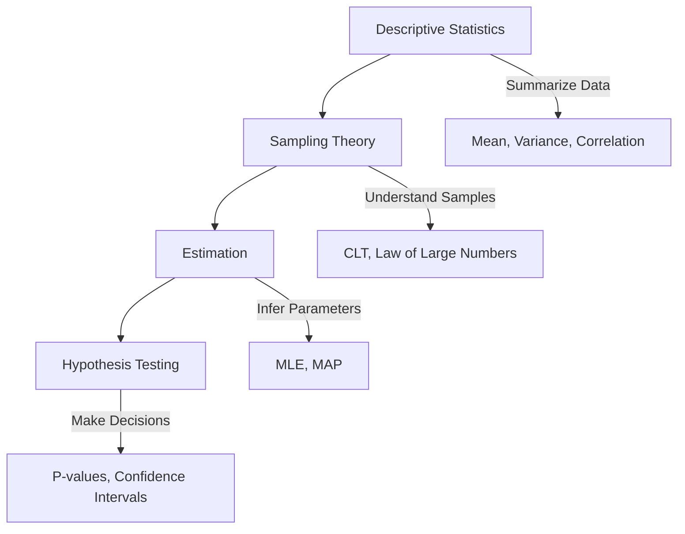

# Level 8: Statistics - Learning From Data

## Overview

Statistics is the science of learning from data. While probability theory (covered in previous levels) deals with predicting outcomes given known distributions, statistics works in reverse: inferring properties about unknown distributions from observed data. This distinction is fundamental to machine learning, where we rarely know the true data-generating process but must learn it from samples.

## Why Statistics Matters for Machine Learning

Machine learning is, at its core, applied statistics. Every ML algorithm makes statistical assumptions and uses statistical methods:

- **Model Training** relies on estimation techniques (MLE, MAP) to find optimal parameters
- **Model Evaluation** uses hypothesis testing and confidence intervals to assess performance
- **Feature Engineering** depends on understanding descriptive statistics and correlations
- **Data Collection** requires knowledge of sampling theory to avoid biased datasets

Without a solid foundation in statistics, practitioners often misinterpret results, draw incorrect conclusions, or build models that fail to generalize.

## Chapter Structure



### Chapter 1: Descriptive Statistics
Learn to summarize and describe datasets using measures of central tendency (mean, median, mode) and spread (variance, standard deviation). Understand relationships between variables through covariance and correlation.

### Chapter 2: Sampling Theory
Understand the relationship between populations and samples. Learn why samples can represent populations (Law of Large Numbers) and why sample means follow predictable distributions (Central Limit Theorem).

### Chapter 3: Estimation
Master techniques for estimating unknown parameters from data. Cover point estimation, Maximum Likelihood Estimation (MLE), and Maximum A Posteriori (MAP) estimation - the foundations of model training.

### Chapter 4: Hypothesis Testing
Learn to make rigorous decisions about data. Understand null hypotheses, p-values, confidence intervals, and the tradeoffs between Type I and Type II errors.

## Prerequisites

Before starting this level, you should be comfortable with:

- **Probability fundamentals**: Random variables, probability distributions
- **Calculus**: Derivatives and integrals (for optimization in estimation)
- **Linear algebra basics**: Vectors, matrices (for multivariate statistics)
- **Python programming**: NumPy, basic data manipulation

## Learning Outcomes

By completing this level, you will be able to:

1. **Summarize datasets** using appropriate statistical measures
2. **Understand sampling** and recognize potential biases in data collection
3. **Estimate parameters** using MLE and MAP for various distributions
4. **Design and interpret** hypothesis tests and confidence intervals
5. **Recognize statistical concepts** in ML algorithms and papers

## Practical Applications in ML

| Statistical Concept | ML Application |
|---------------------|----------------|
| Mean, Variance | Feature normalization, batch normalization |
| Correlation | Feature selection, multicollinearity detection |
| MLE | Logistic regression, neural network training |
| MAP | Regularization (L1, L2), Bayesian neural networks |
| Hypothesis Testing | A/B testing, model comparison |
| Confidence Intervals | Uncertainty quantification, error bars |

## Tools Used

Throughout this level, we'll use Python with:

```python
import numpy as np          # Numerical computations
import scipy.stats as stats # Statistical functions
import matplotlib.pyplot as plt  # Visualization
```

## Study Tips

1. **Work through examples**: Statistics is best learned by doing. Run all code examples and modify them.

2. **Connect to ML**: After each concept, think about where you've seen it in ML algorithms.

3. **Visualize**: Draw distributions, plot data, and create diagrams. Statistical intuition often comes from visualization.

4. **Question assumptions**: Every statistical method has assumptions. Understanding when they're violated is as important as knowing the methods.

## Time Estimate

- **Chapter 1**: 2-3 hours
- **Chapter 2**: 2-3 hours
- **Chapter 3**: 3-4 hours
- **Chapter 4**: 3-4 hours
- **Exercises and practice**: 4-6 hours

**Total**: 14-20 hours for thorough understanding

---

*"All models are wrong, but some are useful."* - George Box

This quote captures the essence of statistics in ML. We use statistical models not because they perfectly describe reality, but because they help us make better decisions from data.
