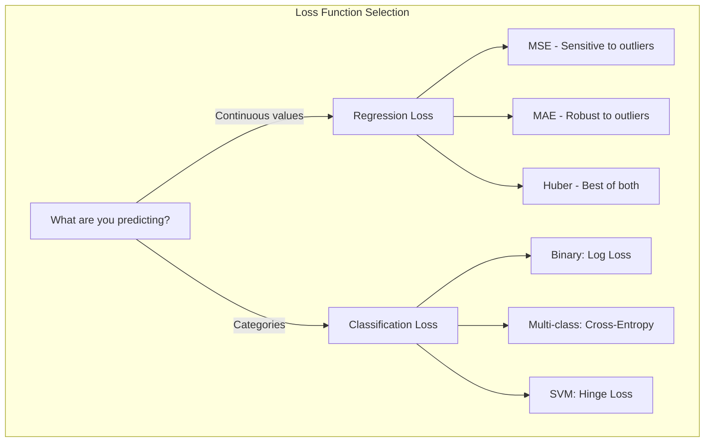

# Chapter 1: Loss Functions

## Intuition

Imagine you're an archer practicing at a target. After each shot, you need a way to measure how far off you were from the bullseye. This measurement tells you whether you're improving and guides your adjustments. In machine learning, **loss functions** serve exactly this purpose - they quantify how "wrong" your model's predictions are.

Different situations call for different measurement strategies. If hitting near the bullseye matters most (and big misses are catastrophic), you might square the distance from center - this is like **Mean Squared Error**. If you want to treat all misses equally regardless of magnitude, you'd use the absolute distance - this is **Mean Absolute Error**. For classification problems, where you're predicting categories rather than numbers, we need entirely different approaches like **Cross-Entropy**.

**Why this matters for ML**: The choice of loss function fundamentally shapes what your model learns. Choose MSE, and your model will be very sensitive to outliers. Choose MAE, and it will be more robust. Choose the wrong loss function for your problem type, and your model may not learn anything useful at all.

## Visual Explanation



### Loss Landscape Visualization

```
Loss Value
    │
  4 ┤                    MSE (squared)
    │                   ╱
  3 ┤                 ╱
    │               ╱
  2 ┤             ╱
    │           ╱      ╱ MAE (linear)
  1 ┤         ╱      ╱
    │       ╱      ╱
  0 ┼─────●──────────────► Error
   -2    -1    0    1    2

MSE: L = error²  (parabola - penalizes large errors heavily)
MAE: L = |error| (V-shape - treats all errors proportionally)
```

## Mathematical Foundation

### Mean Squared Error (MSE)

For $n$ samples with true values $y_i$ and predictions $\hat{y}_i$:

$$\text{MSE} = \frac{1}{n} \sum_{i=1}^{n} (y_i - \hat{y}_i)^2$$

**Properties:**
- Always non-negative
- Minimum value of 0 when predictions are perfect
- Differentiable everywhere (important for gradient descent)
- Heavily penalizes large errors due to squaring

**Gradient (for optimization):**
$$\frac{\partial \text{MSE}}{\partial \hat{y}_i} = \frac{2}{n}(\hat{y}_i - y_i)$$

### Mean Absolute Error (MAE)

$$\text{MAE} = \frac{1}{n} \sum_{i=1}^{n} |y_i - \hat{y}_i|$$

**Properties:**
- More robust to outliers than MSE
- Not differentiable at zero (use subgradient methods)
- Median-finding property: minimizing MAE finds the median

**Gradient:**
$$\frac{\partial \text{MAE}}{\partial \hat{y}_i} = \frac{1}{n} \cdot \text{sign}(\hat{y}_i - y_i)$$

### Log Loss (Binary Cross-Entropy)

For binary classification where $y \in \{0, 1\}$ and $\hat{p}$ is the predicted probability:

$$\text{Log Loss} = -\frac{1}{n} \sum_{i=1}^{n} \left[ y_i \log(\hat{p}_i) + (1 - y_i) \log(1 - \hat{p}_i) \right]$$

**Intuition:** Log loss heavily penalizes confident wrong predictions. Predicting 0.99 when the true label is 0 incurs a huge penalty.

**Properties:**
- Output must be probabilities in $(0, 1)$
- Encourages well-calibrated probabilities
- Convex function - guaranteed global minimum

### Cross-Entropy (Multi-class)

For $K$ classes with true labels as one-hot vectors $\mathbf{y}$ and predicted probabilities $\hat{\mathbf{p}}$:

$$\text{Cross-Entropy} = -\sum_{k=1}^{K} y_k \log(\hat{p}_k)$$

When combined with softmax output:
$$\hat{p}_k = \frac{e^{z_k}}{\sum_{j=1}^{K} e^{z_j}}$$

**Why Cross-Entropy + Softmax?** The gradient simplifies beautifully:
$$\frac{\partial L}{\partial z_k} = \hat{p}_k - y_k$$

### Hinge Loss

Used in Support Vector Machines for binary classification where $y \in \{-1, +1\}$:

$$\text{Hinge Loss} = \frac{1}{n} \sum_{i=1}^{n} \max(0, 1 - y_i \cdot f(\mathbf{x}_i))$$

**Properties:**
- Creates a margin of separation
- Loss is zero when prediction is correct AND confident (margin > 1)
- Sparse gradients - only misclassified or margin-violating points contribute

## Code Example

```python
import numpy as np

class LossFunctions:
    """Implementation of common loss functions from scratch."""

    @staticmethod
    def mse(y_true, y_pred):
        """
        Mean Squared Error

        Args:
            y_true: Ground truth values (n_samples,)
            y_pred: Predicted values (n_samples,)

        Returns:
            loss: Scalar MSE value
            gradient: Gradient w.r.t. predictions
        """
        n = len(y_true)
        error = y_pred - y_true
        loss = np.mean(error ** 2)
        gradient = (2 / n) * error
        return loss, gradient

    @staticmethod
    def mae(y_true, y_pred):
        """
        Mean Absolute Error

        Returns:
            loss: Scalar MAE value
            gradient: Subgradient w.r.t. predictions
        """
        n = len(y_true)
        error = y_pred - y_true
        loss = np.mean(np.abs(error))
        gradient = (1 / n) * np.sign(error)
        return loss, gradient

    @staticmethod
    def binary_cross_entropy(y_true, y_pred, epsilon=1e-15):
        """
        Binary Cross-Entropy (Log Loss)

        Args:
            y_true: Binary labels (0 or 1)
            y_pred: Predicted probabilities (0 to 1)
            epsilon: Small value to avoid log(0)

        Returns:
            loss: Scalar BCE value
            gradient: Gradient w.r.t. predictions
        """
        # Clip predictions to avoid log(0)
        y_pred = np.clip(y_pred, epsilon, 1 - epsilon)

        n = len(y_true)
        loss = -np.mean(
            y_true * np.log(y_pred) +
            (1 - y_true) * np.log(1 - y_pred)
        )

        gradient = (1 / n) * (-(y_true / y_pred) + (1 - y_true) / (1 - y_pred))
        return loss, gradient

    @staticmethod
    def categorical_cross_entropy(y_true, y_pred, epsilon=1e-15):
        """
        Categorical Cross-Entropy for multi-class classification

        Args:
            y_true: One-hot encoded labels (n_samples, n_classes)
            y_pred: Predicted probabilities (n_samples, n_classes)

        Returns:
            loss: Scalar CCE value
            gradient: Gradient w.r.t. predictions
        """
        y_pred = np.clip(y_pred, epsilon, 1 - epsilon)

        n = y_true.shape[0]
        loss = -np.sum(y_true * np.log(y_pred)) / n

        gradient = -y_true / y_pred / n
        return loss, gradient

    @staticmethod
    def hinge_loss(y_true, y_pred):
        """
        Hinge Loss for SVM-style classification

        Args:
            y_true: Labels in {-1, +1}
            y_pred: Raw model outputs (scores, not probabilities)

        Returns:
            loss: Scalar hinge loss value
            gradient: Subgradient w.r.t. predictions
        """
        n = len(y_true)
        margins = y_true * y_pred
        loss = np.mean(np.maximum(0, 1 - margins))

        # Gradient: -y_i if margin < 1, else 0
        gradient = np.where(margins < 1, -y_true, 0) / n
        return loss, gradient


# Demonstration
if __name__ == "__main__":
    np.random.seed(42)

    # Regression example
    y_true_reg = np.array([3.0, 5.0, 2.5, 7.0])
    y_pred_reg = np.array([2.8, 5.2, 2.0, 6.5])

    print("=== Regression Losses ===")
    mse_loss, mse_grad = LossFunctions.mse(y_true_reg, y_pred_reg)
    print(f"MSE Loss: {mse_loss:.4f}")
    print(f"MSE Gradient: {mse_grad}")

    mae_loss, mae_grad = LossFunctions.mae(y_true_reg, y_pred_reg)
    print(f"MAE Loss: {mae_loss:.4f}")
    print(f"MAE Gradient: {mae_grad}")

    # Binary classification example
    print("\n=== Binary Classification Loss ===")
    y_true_bin = np.array([1, 0, 1, 1, 0])
    y_pred_bin = np.array([0.9, 0.1, 0.8, 0.7, 0.3])

    bce_loss, bce_grad = LossFunctions.binary_cross_entropy(y_true_bin, y_pred_bin)
    print(f"Binary Cross-Entropy: {bce_loss:.4f}")

    # Multi-class example
    print("\n=== Multi-class Classification Loss ===")
    # 3 samples, 4 classes
    y_true_multi = np.array([
        [1, 0, 0, 0],  # Class 0
        [0, 1, 0, 0],  # Class 1
        [0, 0, 0, 1],  # Class 3
    ])
    y_pred_multi = np.array([
        [0.7, 0.1, 0.1, 0.1],
        [0.1, 0.6, 0.2, 0.1],
        [0.1, 0.1, 0.1, 0.7],
    ])

    cce_loss, _ = LossFunctions.categorical_cross_entropy(y_true_multi, y_pred_multi)
    print(f"Categorical Cross-Entropy: {cce_loss:.4f}")

    # Hinge loss example
    print("\n=== Hinge Loss ===")
    y_true_svm = np.array([1, -1, 1, -1])
    y_pred_svm = np.array([0.5, -0.8, 1.5, -2.0])  # Raw scores

    hinge, hinge_grad = LossFunctions.hinge_loss(y_true_svm, y_pred_svm)
    print(f"Hinge Loss: {hinge:.4f}")
    print(f"Margins: {y_true_svm * y_pred_svm}")
    print(f"Hinge Gradient: {hinge_grad}")
```

**Output:**
```
=== Regression Losses ===
MSE Loss: 0.1225
MSE Gradient: [-0.1   0.1  -0.25 -0.25]

MAE Loss: 0.3000
MAE Gradient: [-0.25  0.25 -0.25 -0.25]

=== Binary Classification Loss ===
Binary Cross-Entropy: 0.2529

=== Multi-class Classification Loss ===
Categorical Cross-Entropy: 0.4308

=== Hinge Loss ===
Hinge Loss: 0.2000
Margins: [ 0.5  0.8  1.5  2. ]
Hinge Gradient: [-0.25  0.    0.    0.  ]
```

## ML Relevance

### Where Each Loss Function Appears

| Loss Function | Common Uses |
|--------------|-------------|
| **MSE** | Linear regression, autoencoders, neural network regression |
| **MAE** | Robust regression, when outliers are present |
| **Log Loss** | Logistic regression, binary classifiers |
| **Cross-Entropy** | Neural network classifiers, softmax output layers |
| **Hinge Loss** | Support Vector Machines, maximum-margin classifiers |

### Deep Learning Specifics

- **Image Classification**: Cross-entropy with softmax
- **Object Detection**: Combination of cross-entropy (class) + MSE/Smooth L1 (bounding box)
- **Language Models**: Cross-entropy over vocabulary
- **Generative Models (VAE)**: Reconstruction loss (MSE) + KL divergence

## When to Use / Ignore

### MSE vs MAE Decision Guide

```
Use MSE when:
├── Large errors should be penalized heavily
├── Data is relatively clean (few outliers)
├── You want faster convergence (smooth gradient)
└── Example: Predicting house prices in a clean dataset

Use MAE when:
├── Outliers are present and shouldn't dominate
├── All errors should be treated equally
├── Median prediction is desired
└── Example: Demand forecasting with occasional spikes
```

### Classification Loss Selection

- **Binary Classification**: Always use log loss (binary cross-entropy)
- **Multi-class (mutually exclusive)**: Use categorical cross-entropy with softmax
- **Multi-label**: Use binary cross-entropy per label with sigmoid
- **SVM/Maximum Margin**: Use hinge loss

### Common Pitfalls

1. **Using MSE for classification**: Doesn't account for probability interpretation
2. **Forgetting to clip probabilities**: Log(0) = -infinity breaks training
3. **Wrong label format**: Cross-entropy expects one-hot, log loss expects 0/1
4. **Not normalizing hinge loss outputs**: Predictions should be scores, not probabilities

## Exercises

### Exercise 1: Outlier Sensitivity
**Problem**: Given y_true = [1, 2, 3, 100] and y_pred = [1, 2, 3, 4], calculate both MSE and MAE. Which is more affected by the outlier?

**Solution**:
```python
y_true = np.array([1, 2, 3, 100])
y_pred = np.array([1, 2, 3, 4])

mse = np.mean((y_true - y_pred) ** 2)
mae = np.mean(np.abs(y_true - y_pred))

print(f"MSE: {mse}")  # MSE: 2304.0
print(f"MAE: {mae}")  # MAE: 24.0
```
MSE (2304) is dominated by the single outlier (96^2 = 9216), while MAE (24) treats it as just 96/4 = 24 contribution.

### Exercise 2: Cross-Entropy Confidence Penalty
**Problem**: Compare the loss when a model predicts class 1 with probability 0.9 vs 0.99 vs 0.999 when the true label is 0 (class 0).

**Solution**:
```python
y_true = 0
for p in [0.9, 0.99, 0.999]:
    # Probability assigned to wrong class (class 1)
    loss = -(np.log(1 - p))  # We want probability of class 0
    print(f"P(class 1) = {p}, Loss = {loss:.4f}")

# Output:
# P(class 1) = 0.9, Loss = 2.3026
# P(class 1) = 0.99, Loss = 4.6052
# P(class 1) = 0.999, Loss = 6.9078
```
Loss increases dramatically with confident wrong predictions!

### Exercise 3: Hinge Loss Margin
**Problem**: For an SVM with y_true = +1, at what prediction value does the loss become zero?

**Solution**:
The hinge loss is max(0, 1 - y * f(x)). For y = +1:
- Loss = max(0, 1 - f(x))
- Loss becomes zero when 1 - f(x) <= 0
- Therefore, f(x) >= 1

The prediction must be at least 1 (not just positive, but confidently positive) for zero loss. This is the margin requirement of SVMs.

## Summary

- **MSE** squares errors, making it sensitive to outliers but providing smooth gradients
- **MAE** uses absolute errors, more robust to outliers but with discontinuous gradient at zero
- **Log Loss / Binary Cross-Entropy** measures probability calibration for binary classification
- **Categorical Cross-Entropy** extends log loss to multiple classes, pairs naturally with softmax
- **Hinge Loss** creates maximum-margin classifiers by penalizing predictions inside the margin
- Loss functions define what "good" means for your model - choose based on your problem type and data characteristics
- All loss functions must be differentiable (or have subgradients) for gradient-based optimization
- The gradient of the loss function drives the parameter updates during training
