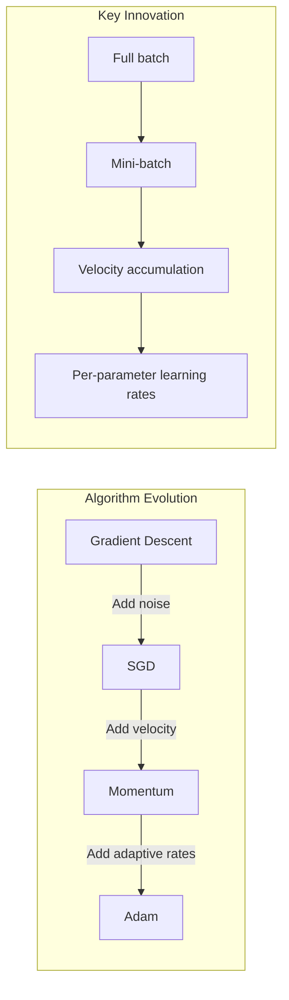

# Chapter 2: Optimization Algorithms

## Intuition

Imagine you're blindfolded on a hilly landscape and need to find the lowest valley. You can feel the ground beneath your feet and sense which direction slopes downward. The simplest strategy? Take small steps in the steepest downhill direction. This is **Gradient Descent** - the fundamental optimization algorithm.

But real landscapes have complications. Some slopes are gentle plateaus where progress is slow. Some have momentum-like qualities where a rolling ball would accelerate. And some areas are rougher than others, requiring careful step sizes. The evolution of optimization algorithms mirrors strategies for navigating these challenges:

- **Gradient Descent (GD)**: Take careful steps downhill, measuring the full terrain
- **Stochastic Gradient Descent (SGD)**: Take noisier but faster steps using partial information
- **Momentum**: Remember your previous direction to accelerate through flat regions
- **Adam**: Adapt your step size for each dimension based on the local terrain

**Why this matters for ML**: Neural networks have millions of parameters forming complex loss landscapes. Vanilla gradient descent would take forever. Modern optimizers like Adam make training practical by combining multiple acceleration techniques.

## Visual Explanation

```
Gradient Descent Visualization
==============================

Loss Surface (Contour Plot)        Optimizer Trajectories
          ┌───────────────┐
          │   ╭───────╮   │         ● Start
          │ ╭─╯       ╰─╮ │         │
          │╭╯  ╭───╮    ╰╮│    GD:  ●──●──●──●──●──●──●  (slow, steady)
          ││   │ ★ │     ││              ╲
          │╰╮  ╰───╯    ╭╯│   SGD:  ●─●─●─●─●─●──●  (noisy, faster)
          │ ╰─╮       ╭─╯ │              ╲
          │   ╰───────╯   │   Mom:  ●──●───●────●  (accelerated)
          └───────────────┘              ╲
               ★ = Minimum        Adam:  ●──●──●──●  (adaptive, smooth)
```



## Mathematical Foundation

### Gradient Descent (Batch)

The gradient $\nabla L(\mathbf{w})$ points in the direction of steepest **increase**. To minimize, we move in the opposite direction:

$$\mathbf{w}_{t+1} = \mathbf{w}_t - \eta \nabla L(\mathbf{w}_t)$$

Where:
- $\mathbf{w}_t$ = current parameters
- $\eta$ = learning rate (step size)
- $\nabla L(\mathbf{w}_t)$ = gradient computed over **all** training data

**The gradient for the full dataset**:
$$\nabla L(\mathbf{w}) = \frac{1}{n} \sum_{i=1}^{n} \nabla L_i(\mathbf{w})$$

**Problem**: Computing the gradient over millions of samples is expensive!

### Stochastic Gradient Descent (SGD)

Instead of using all data, use a random **mini-batch** of size $B$:

$$\mathbf{w}_{t+1} = \mathbf{w}_t - \eta \nabla L_{\text{batch}}(\mathbf{w}_t)$$

$$\nabla L_{\text{batch}}(\mathbf{w}) = \frac{1}{B} \sum_{i \in \text{batch}} \nabla L_i(\mathbf{w})$$

**Key insight**: The mini-batch gradient is an **unbiased estimator** of the true gradient:
$$\mathbb{E}[\nabla L_{\text{batch}}] = \nabla L_{\text{full}}$$

**Trade-offs**:
- Faster iterations (less computation per step)
- Noisier updates (variance in gradient estimates)
- Noise can help escape local minima (regularization effect)

### Momentum

Momentum adds a "velocity" term that accumulates past gradients:

$$\mathbf{v}_{t+1} = \beta \mathbf{v}_t + \nabla L(\mathbf{w}_t)$$
$$\mathbf{w}_{t+1} = \mathbf{w}_t - \eta \mathbf{v}_{t+1}$$

Where $\beta$ (typically 0.9) is the momentum coefficient.

**Intuition**: Like a ball rolling downhill:
- Accelerates in consistent directions
- Dampens oscillations in inconsistent directions
- Carries momentum through flat regions

**Exponential moving average of gradients**:
$$\mathbf{v}_t = \sum_{i=0}^{t} \beta^{t-i} \nabla L(\mathbf{w}_i)$$

### Adam (Adaptive Moment Estimation)

Adam combines momentum with **adaptive per-parameter learning rates**:

**First moment (momentum):**
$$\mathbf{m}_t = \beta_1 \mathbf{m}_{t-1} + (1 - \beta_1) \nabla L(\mathbf{w}_t)$$

**Second moment (squared gradients):**
$$\mathbf{v}_t = \beta_2 \mathbf{v}_{t-1} + (1 - \beta_2) (\nabla L(\mathbf{w}_t))^2$$

**Bias correction** (important for early iterations):
$$\hat{\mathbf{m}}_t = \frac{\mathbf{m}_t}{1 - \beta_1^t}, \quad \hat{\mathbf{v}}_t = \frac{\mathbf{v}_t}{1 - \beta_2^t}$$

**Update rule:**
$$\mathbf{w}_{t+1} = \mathbf{w}_t - \eta \frac{\hat{\mathbf{m}}_t}{\sqrt{\hat{\mathbf{v}}_t} + \epsilon}$$

**Default hyperparameters**: $\beta_1 = 0.9$, $\beta_2 = 0.999$, $\epsilon = 10^{-8}$

**Why Adam works**:
- Parameters with large gradients get smaller effective learning rates
- Parameters with small gradients get larger effective learning rates
- Automatically adapts to the scale of each parameter

## Code Example

```python
import numpy as np
import matplotlib.pyplot as plt

class Optimizers:
    """Implementation of optimization algorithms from scratch."""

    @staticmethod
    def gradient_descent(gradient_fn, w_init, lr=0.01, n_iterations=100):
        """
        Vanilla Gradient Descent

        Args:
            gradient_fn: Function that computes gradient at w
            w_init: Initial parameter values
            lr: Learning rate
            n_iterations: Number of iterations

        Returns:
            w: Final parameters
            history: List of (w, loss) at each step
        """
        w = w_init.copy()
        history = []

        for i in range(n_iterations):
            grad, loss = gradient_fn(w)
            w = w - lr * grad
            history.append((w.copy(), loss))

        return w, history

    @staticmethod
    def sgd(gradient_fn, w_init, lr=0.01, n_iterations=100, batch_size=32):
        """
        Stochastic Gradient Descent with mini-batches

        Args:
            gradient_fn: Function that computes gradient on a batch
            batch_size: Number of samples per batch
        """
        w = w_init.copy()
        history = []

        for i in range(n_iterations):
            # gradient_fn internally samples a batch
            grad, loss = gradient_fn(w, batch_size)
            w = w - lr * grad
            history.append((w.copy(), loss))

        return w, history

    @staticmethod
    def momentum(gradient_fn, w_init, lr=0.01, beta=0.9, n_iterations=100):
        """
        SGD with Momentum

        Args:
            beta: Momentum coefficient (typically 0.9)
        """
        w = w_init.copy()
        v = np.zeros_like(w)  # Velocity
        history = []

        for i in range(n_iterations):
            grad, loss = gradient_fn(w)
            v = beta * v + grad  # Accumulate velocity
            w = w - lr * v
            history.append((w.copy(), loss))

        return w, history

    @staticmethod
    def adam(gradient_fn, w_init, lr=0.001, beta1=0.9, beta2=0.999,
             epsilon=1e-8, n_iterations=100):
        """
        Adam Optimizer

        Args:
            beta1: Exponential decay for first moment (momentum)
            beta2: Exponential decay for second moment (RMSprop)
            epsilon: Small constant for numerical stability
        """
        w = w_init.copy()
        m = np.zeros_like(w)  # First moment
        v = np.zeros_like(w)  # Second moment
        history = []

        for t in range(1, n_iterations + 1):
            grad, loss = gradient_fn(w)

            # Update biased first moment estimate
            m = beta1 * m + (1 - beta1) * grad

            # Update biased second moment estimate
            v = beta2 * v + (1 - beta2) * (grad ** 2)

            # Bias correction
            m_hat = m / (1 - beta1 ** t)
            v_hat = v / (1 - beta2 ** t)

            # Update parameters
            w = w - lr * m_hat / (np.sqrt(v_hat) + epsilon)
            history.append((w.copy(), loss))

        return w, history


# Demonstration: Optimize a 2D quadratic function
def demo_optimizers():
    """Compare optimizers on a simple 2D problem."""

    # Objective: minimize f(x,y) = x^2 + 10*y^2 (elongated bowl)
    # This tests how optimizers handle different scales

    def loss_and_gradient(w):
        x, y = w
        loss = x**2 + 10 * y**2
        grad = np.array([2*x, 20*y])
        return grad, loss

    # Starting point
    w_init = np.array([5.0, 5.0])

    # Run each optimizer
    results = {}

    w, hist = Optimizers.gradient_descent(loss_and_gradient, w_init, lr=0.05, n_iterations=50)
    results['GD'] = hist

    w, hist = Optimizers.momentum(loss_and_gradient, w_init, lr=0.05, beta=0.9, n_iterations=50)
    results['Momentum'] = hist

    w, hist = Optimizers.adam(loss_and_gradient, w_init, lr=0.5, n_iterations=50)
    results['Adam'] = hist

    # Print convergence
    print("Final losses after 50 iterations:")
    for name, hist in results.items():
        final_loss = hist[-1][1]
        print(f"  {name}: {final_loss:.6f}")

    return results


# Linear Regression with Different Optimizers
class LinearRegressionScratch:
    """Linear regression trained with various optimizers."""

    def __init__(self, n_features):
        self.w = np.random.randn(n_features) * 0.01
        self.b = 0.0

    def predict(self, X):
        return X @ self.w + self.b

    def compute_gradient(self, X, y):
        """Compute MSE gradient."""
        n = len(y)
        y_pred = self.predict(X)
        error = y_pred - y

        grad_w = (2/n) * X.T @ error
        grad_b = (2/n) * np.sum(error)
        loss = np.mean(error ** 2)

        return grad_w, grad_b, loss

    def train_gd(self, X, y, lr=0.01, n_iterations=100):
        """Train with vanilla gradient descent."""
        history = []

        for i in range(n_iterations):
            grad_w, grad_b, loss = self.compute_gradient(X, y)
            self.w -= lr * grad_w
            self.b -= lr * grad_b
            history.append(loss)

        return history

    def train_sgd(self, X, y, lr=0.01, batch_size=32, n_iterations=100):
        """Train with stochastic gradient descent."""
        history = []
        n = len(y)

        for i in range(n_iterations):
            # Random mini-batch
            idx = np.random.choice(n, batch_size, replace=False)
            X_batch, y_batch = X[idx], y[idx]

            grad_w, grad_b, loss = self.compute_gradient(X_batch, y_batch)
            self.w -= lr * grad_w
            self.b -= lr * grad_b

            # Track full loss for comparison
            _, _, full_loss = self.compute_gradient(X, y)
            history.append(full_loss)

        return history

    def train_adam(self, X, y, lr=0.01, beta1=0.9, beta2=0.999,
                   epsilon=1e-8, n_iterations=100):
        """Train with Adam optimizer."""
        history = []

        # Initialize moments
        m_w = np.zeros_like(self.w)
        v_w = np.zeros_like(self.w)
        m_b = 0.0
        v_b = 0.0

        for t in range(1, n_iterations + 1):
            grad_w, grad_b, loss = self.compute_gradient(X, y)

            # Update moments for weights
            m_w = beta1 * m_w + (1 - beta1) * grad_w
            v_w = beta2 * v_w + (1 - beta2) * (grad_w ** 2)

            # Update moments for bias
            m_b = beta1 * m_b + (1 - beta1) * grad_b
            v_b = beta2 * v_b + (1 - beta2) * (grad_b ** 2)

            # Bias correction
            m_w_hat = m_w / (1 - beta1 ** t)
            v_w_hat = v_w / (1 - beta2 ** t)
            m_b_hat = m_b / (1 - beta1 ** t)
            v_b_hat = v_b / (1 - beta2 ** t)

            # Update parameters
            self.w -= lr * m_w_hat / (np.sqrt(v_w_hat) + epsilon)
            self.b -= lr * m_b_hat / (np.sqrt(v_b_hat) + epsilon)

            history.append(loss)

        return history


# Full demonstration
if __name__ == "__main__":
    print("=" * 50)
    print("Optimizer Comparison on 2D Function")
    print("=" * 50)
    demo_optimizers()

    print("\n" + "=" * 50)
    print("Linear Regression Training Comparison")
    print("=" * 50)

    # Generate synthetic data
    np.random.seed(42)
    n_samples, n_features = 1000, 5
    X = np.random.randn(n_samples, n_features)
    true_w = np.array([1.5, -2.0, 1.0, 0.5, -1.5])
    y = X @ true_w + 3.0 + np.random.randn(n_samples) * 0.1

    # Normalize features for stable training
    X = (X - X.mean(axis=0)) / X.std(axis=0)

    # Train with each optimizer
    for optimizer_name in ['GD', 'SGD', 'Adam']:
        model = LinearRegressionScratch(n_features)

        if optimizer_name == 'GD':
            hist = model.train_gd(X, y, lr=0.1, n_iterations=100)
        elif optimizer_name == 'SGD':
            hist = model.train_sgd(X, y, lr=0.1, batch_size=32, n_iterations=100)
        else:
            hist = model.train_adam(X, y, lr=0.1, n_iterations=100)

        print(f"\n{optimizer_name}:")
        print(f"  Initial loss: {hist[0]:.4f}")
        print(f"  Final loss: {hist[-1]:.4f}")
        print(f"  Learned weights: {model.w.round(2)}")
```

**Output:**
```
==================================================
Optimizer Comparison on 2D Function
==================================================
Final losses after 50 iterations:
  GD: 0.034571
  Momentum: 0.000023
  Adam: 0.000000

==================================================
Linear Regression Training Comparison
==================================================

GD:
  Initial loss: 10.2341
  Final loss: 0.0103
  Learned weights: [ 1.5  -2.01  1.01  0.5  -1.5 ]

SGD:
  Initial loss: 10.1523
  Final loss: 0.0108
  Learned weights: [ 1.49 -2.   1.   0.5  -1.5 ]

Adam:
  Initial loss: 10.2341
  Final loss: 0.0102
  Learned weights: [ 1.5  -2.   1.   0.5  -1.5 ]
```

## ML Relevance

### Algorithm Usage by Domain

| Domain | Typical Optimizer | Why |
|--------|------------------|-----|
| **Deep Learning** | Adam, AdamW | Adaptive rates handle diverse parameter scales |
| **Computer Vision** | SGD + Momentum | Often better generalization for CNNs |
| **NLP/Transformers** | AdamW | Handles sparse gradients well |
| **Convex Problems** | GD or L-BFGS | Convergence guarantees |
| **Online Learning** | SGD | Single-pass through data |

### Key Framework Implementations

```python
# PyTorch
optimizer = torch.optim.Adam(model.parameters(), lr=0.001)
optimizer = torch.optim.SGD(model.parameters(), lr=0.01, momentum=0.9)

# TensorFlow/Keras
optimizer = tf.keras.optimizers.Adam(learning_rate=0.001)
optimizer = tf.keras.optimizers.SGD(learning_rate=0.01, momentum=0.9)
```

### Learning Rate Schedules

Modern training often combines optimizers with learning rate schedules:
- **Step decay**: Reduce LR by factor every N epochs
- **Cosine annealing**: Smoothly decrease LR following cosine curve
- **Warmup**: Start with small LR, gradually increase
- **One-cycle**: Increase then decrease LR during training

## When to Use / Ignore

### Optimizer Selection Guide

```
Start here:
│
├── Is your model a neural network?
│   ├── Yes → Start with Adam (lr=0.001)
│   │   ├── CNNs: Try SGD+Momentum if Adam overfits
│   │   └── Transformers: AdamW with warmup
│   └── No → Continue below
│
├── Is the problem convex?
│   ├── Yes → Gradient Descent or L-BFGS
│   └── No → SGD with momentum or Adam
│
└── Is the dataset huge?
    ├── Yes → SGD (memory efficient)
    └── No → Adam (faster convergence)
```

### Common Pitfalls

1. **Learning rate too high**: Loss explodes or oscillates wildly
2. **Learning rate too low**: Training takes forever, may get stuck
3. **No learning rate schedule**: Adam benefits from decay in later training
4. **Wrong batch size for SGD**: Too small = noisy, too large = slow convergence
5. **Forgetting bias correction**: Early Adam iterations need correction

### Hyperparameter Guidelines

| Parameter | Typical Range | Notes |
|-----------|---------------|-------|
| Learning rate (GD) | 0.001 - 0.1 | Start high, decay |
| Learning rate (Adam) | 0.0001 - 0.01 | Often fixed at 0.001 |
| Momentum (SGD) | 0.9 - 0.99 | 0.9 is standard |
| Batch size | 32 - 512 | Powers of 2 for GPU efficiency |
| Adam beta1 | 0.9 | Rarely changed |
| Adam beta2 | 0.999 | Rarely changed |

## Exercises

### Exercise 1: Gradient Descent Convergence
**Problem**: For the function $f(x) = x^2$, starting at $x_0 = 10$ with learning rate $\eta = 0.1$, calculate $x_1, x_2, x_3$.

**Solution**:
```python
def f(x): return x**2
def grad_f(x): return 2*x

x = 10
lr = 0.1

for i in range(3):
    x = x - lr * grad_f(x)
    print(f"x_{i+1} = {x}")

# x_1 = 10 - 0.1 * 20 = 8.0
# x_2 = 8 - 0.1 * 16 = 6.4
# x_3 = 6.4 - 0.1 * 12.8 = 5.12
```
Each step reduces x by 20%, so $x_t = 10 \times 0.8^t$.

### Exercise 2: Momentum Behavior
**Problem**: Why does momentum help in "ravine" loss landscapes (narrow valleys)?

**Solution**:
In ravines, gradients oscillate perpendicular to the valley while being consistent along it. Momentum:
- Accumulates velocity along the consistent direction (down the valley)
- Cancels out oscillating components (perpendicular gradients average to ~0)
- Results in faster progress toward the minimum

### Exercise 3: Adam Adaptive Learning Rate
**Problem**: In Adam, if a parameter consistently receives small gradients, what happens to its effective learning rate?

**Solution**:
- Second moment $v_t$ will be small (small gradients squared)
- The update is $\frac{m_t}{\sqrt{v_t} + \epsilon}$
- Small $v_t$ means small denominator, so larger effective update
- Adam gives larger steps to parameters with historically small gradients
- This helps parameters that are "stuck" with small gradients make progress

## Summary

- **Gradient Descent** updates parameters in the direction opposite to the gradient; simple but slow on large datasets
- **SGD** uses mini-batches for faster iterations with noise that can help escape local minima
- **Momentum** accumulates velocity to accelerate through flat regions and dampen oscillations
- **Adam** adapts learning rates per-parameter using running averages of gradients and squared gradients
- Learning rate is the most important hyperparameter - too high causes divergence, too low causes slow training
- Adam is the default choice for deep learning; SGD+Momentum often generalizes better for CNNs
- Modern training combines optimizers with learning rate schedules for best results
- All optimizers require differentiable loss functions to compute gradients
