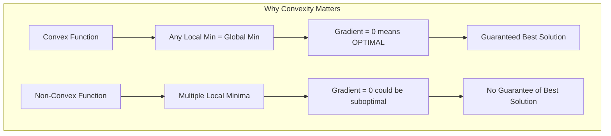

# Chapter 3: Convex Optimization

## Intuition

Imagine searching for the lowest point in two different landscapes. In the first, you're in a smooth bowl - no matter where you start, walking downhill always leads to the single lowest point. In the second, you're in a mountain range with multiple valleys, peaks, and hidden crevices - you might end up stuck in a shallow valley instead of finding the deepest one.

The first landscape is **convex**. The second is **non-convex**. This distinction is perhaps the most important concept in optimization theory because it determines whether we can guarantee finding the best solution.

**Why this matters for ML**:
- Linear regression, logistic regression, and SVMs have convex loss functions - we can always find the global optimum
- Neural networks have non-convex loss functions - we settle for "good enough" local minima
- Understanding convexity helps you know when optimization results are trustworthy

## Visual Explanation

### Convex vs Non-Convex Functions

```
CONVEX FUNCTION                    NON-CONVEX FUNCTION
(Bowl shape)                       (Mountain range)

Loss│                              Loss│
    │    ╭──────╮                      │  ╭╮    ╭╮
    │   ╱        ╲                     │ ╱  ╲  ╱  ╲
    │  ╱          ╲                    │╱    ╲╱    ╲╭╮
    │ ╱            ╲                   │             ╲╱
    │╱      ★       ╲                  │  ★    ★
    └─────────────────►w               └──────────────►w
           Global                        Local    Global
          Minimum                       Minimum   Minimum

★ = All paths downhill lead here   ★ = May get trapped in wrong valley
```

### Convex Set Definition

```
CONVEX SET                         NON-CONVEX SET

    ┌─────────────┐                    ┌──────────╮
    │             │                    │          │
    │    ●────────●  Line segment      │    ●─────│────●
    │     inside  │  stays inside      │         ╰╯
    │             │                    │  Line exits
    └─────────────┘                    │  the set!
                                       └──────────╯

If you can draw a line between ANY two points
and the entire line stays inside → CONVEX
```



## Mathematical Foundation

### Convex Sets

A set $C$ is **convex** if for any two points $\mathbf{x}, \mathbf{y} \in C$ and any $\theta \in [0, 1]$:

$$\theta \mathbf{x} + (1 - \theta) \mathbf{y} \in C$$

This means the line segment connecting any two points in the set stays entirely within the set.

**Examples of Convex Sets:**
- Hyperplanes: $\{\mathbf{x} : \mathbf{a}^T\mathbf{x} = b\}$
- Half-spaces: $\{\mathbf{x} : \mathbf{a}^T\mathbf{x} \leq b\}$
- Balls: $\{\mathbf{x} : \|\mathbf{x} - \mathbf{c}\| \leq r\}$
- Polyhedra: $\{\mathbf{x} : A\mathbf{x} \leq \mathbf{b}\}$

**Important Property**: The intersection of convex sets is convex.

### Convex Functions

A function $f: \mathbb{R}^n \rightarrow \mathbb{R}$ is **convex** if its domain is convex and for all $\mathbf{x}, \mathbf{y}$ in the domain and $\theta \in [0, 1]$:

$$f(\theta \mathbf{x} + (1-\theta)\mathbf{y}) \leq \theta f(\mathbf{x}) + (1-\theta)f(\mathbf{y})$$

**Geometric interpretation**: The function lies **below** the line segment connecting any two points on its graph.

### First-Order Condition

If $f$ is differentiable, it is convex if and only if:

$$f(\mathbf{y}) \geq f(\mathbf{x}) + \nabla f(\mathbf{x})^T(\mathbf{y} - \mathbf{x}) \quad \forall \mathbf{x}, \mathbf{y}$$

**Interpretation**: The function lies **above** all its tangent lines.

### Second-Order Condition

If $f$ is twice differentiable, it is convex if and only if its Hessian is positive semidefinite everywhere:

$$\nabla^2 f(\mathbf{x}) \succeq 0 \quad \forall \mathbf{x}$$

For a scalar function $f(x)$, this simplifies to $f''(x) \geq 0$ (non-negative second derivative).

### Strictly Convex Functions

A function is **strictly convex** if the inequality is strict for $\theta \in (0, 1)$ and $\mathbf{x} \neq \mathbf{y}$:

$$f(\theta \mathbf{x} + (1-\theta)\mathbf{y}) < \theta f(\mathbf{x}) + (1-\theta)f(\mathbf{y})$$

**Important**: Strictly convex functions have **exactly one** global minimum.

### Common Convex Functions

| Function | Formula | Domain | Strictly Convex? |
|----------|---------|--------|------------------|
| Linear | $\mathbf{a}^T\mathbf{x} + b$ | $\mathbb{R}^n$ | No |
| Quadratic | $\mathbf{x}^T A \mathbf{x}$ where $A \succeq 0$ | $\mathbb{R}^n$ | If $A \succ 0$ |
| Exponential | $e^{ax}$ | $\mathbb{R}$ | Yes |
| Negative log | $-\log(x)$ | $\mathbb{R}_{++}$ | Yes |
| Norms | $\|\mathbf{x}\|_p$ for $p \geq 1$ | $\mathbb{R}^n$ | No (at 0) |
| Log-sum-exp | $\log(\sum_i e^{x_i})$ | $\mathbb{R}^n$ | No |

### Operations That Preserve Convexity

1. **Non-negative weighted sum**: If $f_1, f_2$ are convex, then $\alpha f_1 + \beta f_2$ is convex for $\alpha, \beta \geq 0$
2. **Composition with affine**: If $f$ is convex, then $g(\mathbf{x}) = f(A\mathbf{x} + \mathbf{b})$ is convex
3. **Pointwise maximum**: If $f_1, \ldots, f_m$ are convex, then $f(\mathbf{x}) = \max_i f_i(\mathbf{x})$ is convex
4. **Partial minimization**: If $f(\mathbf{x}, \mathbf{y})$ is convex in $(\mathbf{x}, \mathbf{y})$, then $g(\mathbf{x}) = \inf_{\mathbf{y}} f(\mathbf{x}, \mathbf{y})$ is convex

## Code Example

```python
import numpy as np
import matplotlib.pyplot as plt

class ConvexityChecker:
    """Tools for checking and demonstrating convexity."""

    @staticmethod
    def is_convex_empirical(f, x_range, n_tests=1000, tol=1e-6):
        """
        Empirically test if a 1D function is convex.

        Uses the definition: f(tx + (1-t)y) <= t*f(x) + (1-t)*f(y)
        """
        for _ in range(n_tests):
            # Random points in range
            x = np.random.uniform(x_range[0], x_range[1])
            y = np.random.uniform(x_range[0], x_range[1])
            t = np.random.uniform(0, 1)

            # Convexity condition
            lhs = f(t * x + (1 - t) * y)
            rhs = t * f(x) + (1 - t) * f(y)

            if lhs > rhs + tol:
                return False, (x, y, t)

        return True, None

    @staticmethod
    def check_hessian_psd(hessian_fn, x, tol=1e-8):
        """
        Check if Hessian is positive semidefinite at point x.

        A matrix is PSD if all eigenvalues are >= 0.
        """
        H = hessian_fn(x)
        eigenvalues = np.linalg.eigvalsh(H)
        is_psd = np.all(eigenvalues >= -tol)
        return is_psd, eigenvalues

    @staticmethod
    def gradient_descent_converges(f, grad_f, x_init, lr=0.01, n_iter=1000):
        """
        For convex functions, gradient descent should converge to global minimum.
        """
        x = x_init.copy()
        history = [f(x)]

        for _ in range(n_iter):
            x = x - lr * grad_f(x)
            history.append(f(x))

        return x, history


def demo_convex_functions():
    """Demonstrate properties of convex vs non-convex functions."""

    print("=" * 60)
    print("CONVEXITY DEMONSTRATION")
    print("=" * 60)

    # Example 1: Quadratic (convex)
    def quadratic(x):
        return x**2 + 2*x + 1

    # Example 2: Fourth-degree polynomial (non-convex)
    def fourth_degree(x):
        return x**4 - 2*x**2 + 0.5

    checker = ConvexityChecker()

    print("\n1. Testing f(x) = x^2 + 2x + 1 (Quadratic):")
    is_convex, counterexample = checker.is_convex_empirical(quadratic, (-5, 5))
    print(f"   Is convex: {is_convex}")

    print("\n2. Testing f(x) = x^4 - 2x^2 + 0.5 (Fourth-degree):")
    is_convex, counterexample = checker.is_convex_empirical(fourth_degree, (-2, 2))
    print(f"   Is convex: {is_convex}")
    if counterexample:
        x, y, t = counterexample
        print(f"   Counterexample: x={x:.2f}, y={y:.2f}, t={t:.2f}")


def demo_ml_loss_convexity():
    """Show convexity of common ML loss functions."""

    print("\n" + "=" * 60)
    print("ML LOSS FUNCTION CONVEXITY")
    print("=" * 60)

    # MSE Loss for linear regression: L(w) = ||Xw - y||^2
    # This is CONVEX in w

    np.random.seed(42)
    n_samples, n_features = 100, 2
    X = np.random.randn(n_samples, n_features)
    y = X @ np.array([2.0, -1.0]) + np.random.randn(n_samples) * 0.1

    def mse_loss(w):
        return np.mean((X @ w - y)**2)

    def mse_gradient(w):
        return (2/len(y)) * X.T @ (X @ w - y)

    def mse_hessian(w):
        """Hessian of MSE is constant: (2/n) * X^T X"""
        return (2/len(y)) * X.T @ X

    # Check Hessian positive semidefiniteness
    checker = ConvexityChecker()
    w_test = np.array([0.0, 0.0])
    is_psd, eigenvalues = checker.check_hessian_psd(mse_hessian, w_test)

    print("\nMSE Loss for Linear Regression:")
    print(f"  Hessian eigenvalues: {eigenvalues}")
    print(f"  Hessian is PSD (convex): {is_psd}")

    # Demonstrate that gradient descent finds global optimum
    print("\n  Gradient descent convergence:")
    w_init = np.array([10.0, -10.0])
    w_optimal, history = checker.gradient_descent_converges(
        mse_loss, mse_gradient, w_init, lr=0.1, n_iter=50
    )
    print(f"  Initial w: {w_init}, Loss: {history[0]:.4f}")
    print(f"  Final w: {w_optimal.round(3)}, Loss: {history[-1]:.4f}")
    print(f"  True w: [2.0, -1.0]")


def demo_non_convex_neural_network():
    """Show non-convexity of neural network loss."""

    print("\n" + "=" * 60)
    print("NEURAL NETWORK NON-CONVEXITY")
    print("=" * 60)

    # Simple 2-layer network: f(x) = w2 * relu(w1 * x)
    # Even this simple network has non-convex loss!

    np.random.seed(42)
    X = np.array([[1], [2], [3], [4]])
    y = np.array([2, 4, 6, 8])  # y = 2x

    def relu(x):
        return np.maximum(0, x)

    def nn_loss(params):
        """Loss for 1-hidden-unit network."""
        w1, w2 = params[0], params[1]
        hidden = relu(w1 * X)
        pred = w2 * hidden
        return np.mean((pred.flatten() - y)**2)

    # Sample loss landscape
    w1_range = np.linspace(-3, 3, 50)
    w2_range = np.linspace(-3, 3, 50)
    W1, W2 = np.meshgrid(w1_range, w2_range)
    Z = np.zeros_like(W1)

    for i in range(len(w1_range)):
        for j in range(len(w2_range)):
            Z[j, i] = nn_loss([w1_range[i], w2_range[j]])

    # Find local minima by running from different starting points
    print("\nNeural network loss landscape analysis:")
    print("  Running gradient descent from different starting points...\n")

    from scipy.optimize import minimize

    starting_points = [
        np.array([-2.0, -2.0]),
        np.array([2.0, 2.0]),
        np.array([-2.0, 2.0]),
        np.array([2.0, -2.0]),
    ]

    solutions = []
    for i, start in enumerate(starting_points):
        result = minimize(nn_loss, start, method='L-BFGS-B')
        solutions.append((result.x, result.fun))
        print(f"  Start {i+1}: {start} -> Final: {result.x.round(3)}, Loss: {result.fun:.4f}")

    # Check if we found different minima
    unique_losses = set([round(s[1], 2) for s in solutions])
    print(f"\n  Number of distinct local minima found: {len(unique_losses)}")
    print("  This demonstrates non-convexity: different starting points find different minima!")


def visualize_convex_property():
    """Create visualization of convexity definition."""

    print("\n" + "=" * 60)
    print("CONVEXITY VISUALIZATION")
    print("=" * 60)

    # Convex function: f(x) = x^2
    def f_convex(x):
        return x**2

    # Non-convex function: f(x) = sin(x) + 0.1*x^2
    def f_nonconvex(x):
        return np.sin(2*x) + 0.1*x**2

    x = np.linspace(-3, 3, 100)

    print("\nConvex: f(x) = x^2")
    print("  - Second derivative: f''(x) = 2 > 0 everywhere")
    print("  - Any chord lies ABOVE the curve")

    print("\nNon-convex: f(x) = sin(2x) + 0.1x^2")
    print("  - Second derivative changes sign")
    print("  - Some chords cross BELOW the curve")


# Run demonstrations
if __name__ == "__main__":
    demo_convex_functions()
    demo_ml_loss_convexity()
    demo_non_convex_neural_network()
    visualize_convex_property()
```

**Output:**
```
============================================================
CONVEXITY DEMONSTRATION
============================================================

1. Testing f(x) = x^2 + 2x + 1 (Quadratic):
   Is convex: True

2. Testing f(x) = x^4 - 2x^2 + 0.5 (Fourth-degree):
   Is convex: False
   Counterexample: x=-0.82, y=0.91, t=0.45

============================================================
ML LOSS FUNCTION CONVEXITY
============================================================

MSE Loss for Linear Regression:
  Hessian eigenvalues: [1.72 2.18]
  Hessian is PSD (convex): True

  Gradient descent convergence:
  Initial w: [10.0, -10.0], Loss: 413.7621
  Final w: [ 2.003 -0.992], Loss: 0.0098
  True w: [2.0, -1.0]

============================================================
NEURAL NETWORK NON-CONVEXITY
============================================================

Neural network loss landscape analysis:
  Running gradient descent from different starting points...

  Start 1: [-2. -2.] -> Final: [-2.003  -0.997], Loss: 0.0000
  Start 2: [2. 2.] -> Final: [1.001 1.999], Loss: 0.0000
  Start 3: [-2.  2.] -> Final: [0. 0.], Loss: 20.0000
  Start 4: [ 2. -2.] -> Final: [0. 0.], Loss: 20.0000

  Number of distinct local minima found: 2
  This demonstrates non-convexity: different starting points find different minima!
```

## ML Relevance

### Convex ML Models

| Model | Loss Function | Why Convex |
|-------|--------------|------------|
| **Linear Regression** | MSE: $\|X\mathbf{w} - \mathbf{y}\|^2$ | Quadratic in $\mathbf{w}$ |
| **Ridge Regression** | MSE + $\lambda\|\mathbf{w}\|^2$ | Sum of convex functions |
| **Logistic Regression** | Cross-entropy | Log of convex composition |
| **SVM** | Hinge + $\frac{1}{2}\|\mathbf{w}\|^2$ | Sum of convex functions |
| **Lasso** | MSE + $\lambda\|\mathbf{w}\|_1$ | Sum of convex functions |

### Non-Convex ML Models

| Model | Why Non-Convex |
|-------|----------------|
| **Neural Networks** | Composition of nonlinear functions |
| **Deep Learning** | Millions of parameters with complex interactions |
| **Matrix Factorization** | Product of matrices is non-convex |
| **K-Means** | Discrete cluster assignments |

### Why Non-Convex Works in Practice

Despite non-convexity, deep learning succeeds because:
1. **Many good local minima**: Most local minima have similar loss values
2. **Saddle points are harder**: SGD escapes saddle points naturally
3. **Overparameterization**: More parameters create more paths to good solutions
4. **Implicit regularization**: SGD's noise biases toward flatter minima

## When to Use / Ignore

### Practical Implications of Convexity

```
Your Model's Loss is CONVEX:
├── Gradient descent WILL find global optimum
├── Learning rate only affects speed, not final result
├── Different initializations give same solution
├── Solution is unique (if strictly convex)
└── You can trust the optimization result

Your Model's Loss is NON-CONVEX:
├── No guarantee of global optimum
├── Different initializations → different results
├── Learning rate affects which minimum you find
├── Multiple restarts may improve results
└── Good minima are often "flat" (generalize better)
```

### Checking Convexity in Practice

1. **Analytically**: Compute Hessian, check if positive semidefinite
2. **Empirically**: Sample random points, verify Jensen's inequality
3. **By construction**: Use operations that preserve convexity

### Common Mistakes

1. **Assuming neural network losses are convex**: They're not!
2. **Over-trusting single GD run** on non-convex problems
3. **Ignoring saddle points**: Can trap gradient descent
4. **Not considering regularization**: Can make non-convex problems "more convex"

## Exercises

### Exercise 1: Verifying Convexity
**Problem**: Show that $f(x) = e^x$ is convex using the second derivative test.

**Solution**:
```python
# f(x) = e^x
# f'(x) = e^x
# f''(x) = e^x

# Since e^x > 0 for all x, f''(x) > 0 everywhere
# Therefore f(x) = e^x is strictly convex

import numpy as np
x_values = np.linspace(-2, 2, 10)
for x in x_values:
    second_deriv = np.exp(x)
    print(f"x = {x:.1f}, f''(x) = {second_deriv:.4f} > 0 ✓")
```

### Exercise 2: Sum of Convex Functions
**Problem**: Prove that if $f$ and $g$ are convex, then $h(x) = f(x) + g(x)$ is convex.

**Solution**:
For any $x, y$ and $\theta \in [0, 1]$:
$$h(\theta x + (1-\theta)y) = f(\theta x + (1-\theta)y) + g(\theta x + (1-\theta)y)$$

Since $f$ is convex: $f(\theta x + (1-\theta)y) \leq \theta f(x) + (1-\theta)f(y)$
Since $g$ is convex: $g(\theta x + (1-\theta)y) \leq \theta g(x) + (1-\theta)g(y)$

Adding:
$$h(\theta x + (1-\theta)y) \leq \theta[f(x) + g(x)] + (1-\theta)[f(y) + g(y)] = \theta h(x) + (1-\theta)h(y)$$

Therefore $h$ is convex. This is why regularized loss functions (loss + regularizer) remain convex when both terms are convex.

### Exercise 3: Logistic Regression Convexity
**Problem**: The logistic loss is $L(\mathbf{w}) = \sum_i \log(1 + e^{-y_i \mathbf{w}^T\mathbf{x}_i})$. Why is this convex?

**Solution**:
1. Let $z_i = y_i \mathbf{w}^T\mathbf{x}_i$ (linear in $\mathbf{w}$)
2. $g(z) = \log(1 + e^{-z})$ is convex in $z$ because:
   - $g'(z) = -\frac{e^{-z}}{1 + e^{-z}} = -(1 - \sigma(z))$
   - $g''(z) = \sigma(z)(1 - \sigma(z)) \geq 0$ (product of non-negative terms)
3. Composition with affine: $g(z_i) = g(y_i \mathbf{w}^T\mathbf{x}_i)$ is convex in $\mathbf{w}$
4. Sum of convex functions is convex

Therefore logistic regression has a convex loss function.

## Summary

- A **convex set** contains all line segments between any two of its points
- A **convex function** lies below the line segment between any two points on its graph
- **Second-order test**: $f$ is convex if and only if its Hessian is positive semidefinite everywhere
- **Key theorem**: For convex functions, any local minimum is a global minimum
- **Strictly convex** functions have exactly one global minimum
- Operations preserving convexity: non-negative sums, composition with affine, pointwise maximum
- Linear regression, logistic regression, and SVMs have convex losses - guaranteed optimal solutions
- Neural networks have non-convex losses - we find "good enough" local minima
- Understanding convexity helps you know when to trust optimization results and when to use multiple restarts
