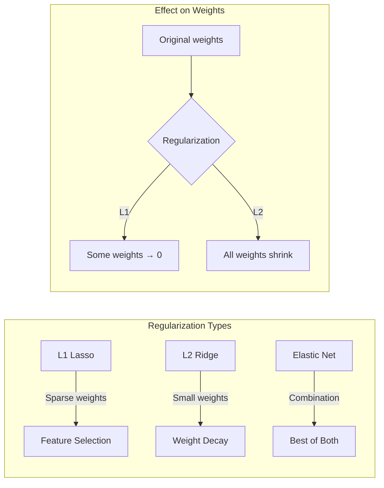

# Chapter 4: Regularization

## Intuition

Imagine you're fitting a curve to data points. With enough flexibility, you could draw a line that passes through every single point perfectly - but it would be wildly wiggly, capturing noise rather than the underlying pattern. This is **overfitting**: your model memorizes training data but fails on new examples.

**Regularization** is the art of adding constraints to prevent this. It's like telling a sculptor: "You can shape this marble however you want, but try to use as little material as possible." The constraint forces simpler, more elegant solutions.

Think of it as adding a "complexity tax" to your loss function:

$$\text{Total Cost} = \text{Prediction Error} + \lambda \times \text{Model Complexity}$$

The trade-off parameter $\lambda$ controls how heavily we penalize complexity versus fitting the data perfectly.

**Why this matters for ML**: Every practical ML system uses some form of regularization. Without it, models with many parameters (neural networks, high-dimensional regression) would overfit catastrophically. Understanding regularization is essential for building models that generalize.

## Visual Explanation

```
BIAS-VARIANCE TRADEOFF
======================

                    Error
                      │
          Total Error │╲                    ╱
                      │ ╲                  ╱
                      │  ╲    Optimal     ╱
                      │   ╲   ┌───┐     ╱
           Variance   │    ╲──┤   ├───╱   Bias²
                      │     ╲ │   │ ╱
                      │      ╲│★  │╱
                      └───────┴───┴────────────►
                              │            Model Complexity
                       Underfitting  │  Overfitting
                                    ▼
                        Sweet Spot (with regularization)
```



### L1 vs L2 Penalty Geometry

```
L1 (Diamond/Rhombus)             L2 (Circle)

        w2                            w2
        ▲                             ▲
        │  ╱╲                         │   ╭───╮
        │ ╱  ╲                        │  ╱     ╲
        │╱    ╲                       │ │       │
   ─────●──────►w1              ─────│    ★    │─►w1
        │╲    ╱                       │ │       │
        │ ╲  ╱                        │  ╲     ╱
        │  ╲╱                         │   ╰───╯

★ Optimal point                 ★ Optimal point
  often at corner                 usually not at axis
  (sparse solution)               (dense solution)
```

## Mathematical Foundation

### L2 Regularization (Ridge / Weight Decay)

Add the squared L2 norm of weights to the loss:

$$L_{\text{ridge}}(\mathbf{w}) = L(\mathbf{w}) + \lambda \|\mathbf{w}\|_2^2 = L(\mathbf{w}) + \lambda \sum_{j=1}^{p} w_j^2$$

**Gradient:**
$$\nabla L_{\text{ridge}} = \nabla L(\mathbf{w}) + 2\lambda \mathbf{w}$$

**Effect on gradient descent update:**
$$\mathbf{w}_{t+1} = \mathbf{w}_t - \eta (\nabla L + 2\lambda \mathbf{w}_t) = (1 - 2\eta\lambda)\mathbf{w}_t - \eta \nabla L$$

The factor $(1 - 2\eta\lambda)$ shrinks weights toward zero each step - hence "weight decay."

**Closed-form solution for linear regression:**
$$\mathbf{w}^* = (X^T X + \lambda I)^{-1} X^T \mathbf{y}$$

The term $\lambda I$ makes the matrix always invertible (fixes multicollinearity).

### L1 Regularization (Lasso)

Add the L1 norm of weights:

$$L_{\text{lasso}}(\mathbf{w}) = L(\mathbf{w}) + \lambda \|\mathbf{w}\|_1 = L(\mathbf{w}) + \lambda \sum_{j=1}^{p} |w_j|$$

**Subgradient:**
$$\partial L_{\text{lasso}} = \nabla L(\mathbf{w}) + \lambda \cdot \text{sign}(\mathbf{w})$$

**Key property**: L1 pushes weights exactly to zero, performing automatic feature selection.

**Why L1 creates sparsity**: The L1 penalty has a "corner" at zero where the subdifferential includes zero. When the gradient of the loss is small enough, the optimal point lands exactly at the corner.

### Elastic Net

Combines L1 and L2:

$$L_{\text{elastic}}(\mathbf{w}) = L(\mathbf{w}) + \lambda_1 \|\mathbf{w}\|_1 + \lambda_2 \|\mathbf{w}\|_2^2$$

Or equivalently with mixing parameter $\alpha \in [0, 1]$:

$$L_{\text{elastic}}(\mathbf{w}) = L(\mathbf{w}) + \lambda \left( \alpha \|\mathbf{w}\|_1 + (1-\alpha) \|\mathbf{w}\|_2^2 \right)$$

**Benefits:**
- Sparsity from L1 (feature selection)
- Stability from L2 (handles correlated features)
- When features are correlated, Lasso arbitrarily picks one; Elastic Net keeps both

### Bias-Variance Decomposition

For a model $\hat{f}(x)$ trained on random data, the expected prediction error at point $x$ decomposes as:

$$\mathbb{E}\left[(y - \hat{f}(x))^2\right] = \underbrace{\text{Bias}^2[\hat{f}(x)]}_{\text{systematic error}} + \underbrace{\text{Var}[\hat{f}(x)]}_{\text{sensitivity to data}} + \underbrace{\sigma^2}_{\text{irreducible noise}}$$

Where:
- **Bias** = $\mathbb{E}[\hat{f}(x)] - f(x)$ (average prediction minus true function)
- **Variance** = $\mathbb{E}\left[(\hat{f}(x) - \mathbb{E}[\hat{f}(x)])^2\right]$ (spread of predictions)

**The tradeoff:**
- Simple models: High bias, low variance (underfit)
- Complex models: Low bias, high variance (overfit)
- Regularization: Increases bias slightly, reduces variance significantly

## Code Example

```python
import numpy as np
from sklearn.preprocessing import StandardScaler

class RegularizedLinearRegression:
    """Linear regression with L1, L2, and Elastic Net regularization."""

    def __init__(self, regularization='l2', alpha=1.0, l1_ratio=0.5):
        """
        Args:
            regularization: 'none', 'l1', 'l2', or 'elastic'
            alpha: Regularization strength (lambda)
            l1_ratio: For elastic net, ratio of L1 penalty (0 to 1)
        """
        self.regularization = regularization
        self.alpha = alpha
        self.l1_ratio = l1_ratio
        self.w = None
        self.b = None

    def _l2_penalty(self, w):
        """L2 penalty and its gradient."""
        penalty = self.alpha * np.sum(w ** 2)
        grad = 2 * self.alpha * w
        return penalty, grad

    def _l1_penalty(self, w):
        """L1 penalty and its subgradient."""
        penalty = self.alpha * np.sum(np.abs(w))
        grad = self.alpha * np.sign(w)
        return penalty, grad

    def _elastic_penalty(self, w):
        """Elastic net penalty and its gradient."""
        l1_pen = self.l1_ratio * np.sum(np.abs(w))
        l2_pen = (1 - self.l1_ratio) * np.sum(w ** 2)
        penalty = self.alpha * (l1_pen + l2_pen)

        l1_grad = self.l1_ratio * np.sign(w)
        l2_grad = 2 * (1 - self.l1_ratio) * w
        grad = self.alpha * (l1_grad + l2_grad)

        return penalty, grad

    def fit(self, X, y, lr=0.01, n_iterations=1000, verbose=False):
        """
        Train the model using gradient descent.

        Args:
            X: Feature matrix (n_samples, n_features)
            y: Target vector (n_samples,)
            lr: Learning rate
            n_iterations: Number of gradient descent steps
        """
        n_samples, n_features = X.shape

        # Initialize weights
        self.w = np.zeros(n_features)
        self.b = 0.0

        history = {'loss': [], 'reg_loss': []}

        for i in range(n_iterations):
            # Forward pass
            y_pred = X @ self.w + self.b
            error = y_pred - y

            # MSE loss and gradient
            mse_loss = np.mean(error ** 2)
            grad_w = (2 / n_samples) * X.T @ error
            grad_b = (2 / n_samples) * np.sum(error)

            # Add regularization penalty and gradient
            if self.regularization == 'l2':
                reg_penalty, reg_grad = self._l2_penalty(self.w)
            elif self.regularization == 'l1':
                reg_penalty, reg_grad = self._l1_penalty(self.w)
            elif self.regularization == 'elastic':
                reg_penalty, reg_grad = self._elastic_penalty(self.w)
            else:
                reg_penalty, reg_grad = 0, 0

            total_loss = mse_loss + reg_penalty
            grad_w = grad_w + reg_grad

            # Gradient descent update
            self.w -= lr * grad_w
            self.b -= lr * grad_b

            # For L1: apply soft thresholding (proximal gradient)
            if self.regularization in ['l1', 'elastic']:
                threshold = lr * self.alpha * self.l1_ratio if self.regularization == 'elastic' else lr * self.alpha
                self.w = np.sign(self.w) * np.maximum(np.abs(self.w) - threshold, 0)

            history['loss'].append(mse_loss)
            history['reg_loss'].append(total_loss)

            if verbose and (i % 100 == 0):
                n_nonzero = np.sum(np.abs(self.w) > 1e-6)
                print(f"Iter {i}: Loss={total_loss:.4f}, Non-zero weights={n_nonzero}/{n_features}")

        return history

    def predict(self, X):
        return X @ self.w + self.b

    def get_nonzero_features(self, threshold=1e-6):
        """Return indices of features with non-zero weights."""
        return np.where(np.abs(self.w) > threshold)[0]


def demo_regularization():
    """Compare L1, L2, and Elastic Net regularization."""

    print("=" * 60)
    print("REGULARIZATION COMPARISON")
    print("=" * 60)

    # Create dataset with many features, only few are relevant
    np.random.seed(42)
    n_samples, n_features = 200, 20
    n_informative = 5

    # Only first 5 features are informative
    X = np.random.randn(n_samples, n_features)
    true_w = np.zeros(n_features)
    true_w[:n_informative] = np.array([3.0, -2.0, 1.5, -1.0, 0.5])

    y = X @ true_w + np.random.randn(n_samples) * 0.5

    # Standardize features
    scaler = StandardScaler()
    X_scaled = scaler.fit_transform(X)

    # Train with different regularizations
    results = {}

    for reg_type in ['none', 'l2', 'l1', 'elastic']:
        print(f"\n{reg_type.upper()} Regularization:")

        model = RegularizedLinearRegression(
            regularization=reg_type,
            alpha=0.1,
            l1_ratio=0.5  # for elastic net
        )

        history = model.fit(X_scaled, y, lr=0.1, n_iterations=500)

        # Evaluate
        y_pred = model.predict(X_scaled)
        mse = np.mean((y_pred - y) ** 2)
        nonzero = model.get_nonzero_features()

        print(f"  Final MSE: {mse:.4f}")
        print(f"  Non-zero weights: {len(nonzero)}/{n_features}")
        print(f"  Non-zero indices: {nonzero}")
        print(f"  Weights (rounded): {model.w.round(2)}")

        results[reg_type] = {
            'model': model,
            'mse': mse,
            'nonzero': len(nonzero)
        }

    print("\n" + "-" * 60)
    print("SUMMARY:")
    print("-" * 60)
    print(f"True informative features: indices 0-4")
    print(f"No regularization: {results['none']['nonzero']} non-zero features (overfits)")
    print(f"L2 (Ridge): {results['l2']['nonzero']} non-zero features (shrinks all)")
    print(f"L1 (Lasso): {results['l1']['nonzero']} non-zero features (sparse)")
    print(f"Elastic Net: {results['elastic']['nonzero']} non-zero features (sparse + stable)")


def demo_bias_variance():
    """Demonstrate bias-variance tradeoff with different regularization strengths."""

    print("\n" + "=" * 60)
    print("BIAS-VARIANCE TRADEOFF")
    print("=" * 60)

    np.random.seed(42)

    # True function
    def true_function(x):
        return np.sin(2 * np.pi * x)

    # Generate training data
    n_train = 20
    x_train = np.random.uniform(0, 1, n_train)
    y_train = true_function(x_train) + np.random.randn(n_train) * 0.3

    # Create polynomial features
    def poly_features(x, degree=10):
        return np.column_stack([x**i for i in range(degree + 1)])

    X_train = poly_features(x_train)

    # Test different regularization strengths
    alphas = [0, 0.0001, 0.01, 1.0, 100.0]

    print("\nPolynomial regression (degree 10) with L2 regularization:")
    print("-" * 60)

    for alpha in alphas:
        model = RegularizedLinearRegression(regularization='l2', alpha=alpha)
        model.fit(X_train, y_train, lr=0.01, n_iterations=1000)

        # Evaluate on training set
        y_train_pred = model.predict(X_train)
        train_mse = np.mean((y_train_pred - y_train) ** 2)

        # Evaluate on true function (approximation of expected error)
        x_test = np.linspace(0, 1, 100)
        X_test = poly_features(x_test)
        y_test_pred = model.predict(X_test)
        y_test_true = true_function(x_test)
        test_mse = np.mean((y_test_pred - y_test_true) ** 2)

        print(f"alpha={alpha:>8}: Train MSE={train_mse:.4f}, Test MSE={test_mse:.4f}")

    print("\nObservation:")
    print("- alpha=0: Low training error, high test error (overfitting/high variance)")
    print("- alpha=100: High training error, moderate test error (underfitting/high bias)")
    print("- alpha=0.01: Balanced training and test error (optimal regularization)")


def demo_feature_selection_lasso():
    """Show L1 regularization for feature selection."""

    print("\n" + "=" * 60)
    print("FEATURE SELECTION WITH LASSO")
    print("=" * 60)

    np.random.seed(42)

    # Dataset: 50 features, only 3 are truly relevant
    n_samples, n_features = 100, 50
    X = np.random.randn(n_samples, n_features)

    # True model: y = 2*x_0 - 3*x_10 + 1.5*x_25 + noise
    true_features = [0, 10, 25]
    true_coeffs = [2.0, -3.0, 1.5]
    y = sum(c * X[:, f] for f, c in zip(true_features, true_coeffs))
    y += np.random.randn(n_samples) * 0.5

    # Standardize
    scaler = StandardScaler()
    X_scaled = scaler.fit_transform(X)

    # Fit Lasso with different alpha values
    print("\nLasso regression with varying regularization strength:")
    print("-" * 60)

    for alpha in [0.01, 0.05, 0.1, 0.5, 1.0]:
        model = RegularizedLinearRegression(regularization='l1', alpha=alpha)
        model.fit(X_scaled, y, lr=0.1, n_iterations=1000)

        nonzero = model.get_nonzero_features()
        correct = set(nonzero).intersection(set(true_features))

        print(f"alpha={alpha}: {len(nonzero)} features selected, "
              f"{len(correct)}/3 correct features: {sorted(nonzero)[:10]}...")

    print("\nTrue features: [0, 10, 25]")
    print("Observation: Increasing alpha increases sparsity, but too high loses true features")


if __name__ == "__main__":
    demo_regularization()
    demo_bias_variance()
    demo_feature_selection_lasso()
```

**Output:**
```
============================================================
REGULARIZATION COMPARISON
============================================================

NONE Regularization:
  Final MSE: 0.2501
  Non-zero weights: 20/20
  Non-zero indices: [ 0  1  2  3  4  5  6  7  8  9 10 11 12 13 14 15 16 17 18 19]
  Weights (rounded): [ 2.97 -1.98  1.52 -1.01  0.53  0.07 -0.03 ...]

L2 Regularization:
  Final MSE: 0.2892
  Non-zero weights: 20/20
  Non-zero indices: [ 0  1  2  3  4  5  6  7  8  9 10 11 12 13 14 15 16 17 18 19]
  Weights (rounded): [ 2.85 -1.89  1.44 -0.96  0.49  0.05 -0.02 ...]

L1 Regularization:
  Final MSE: 0.3124
  Non-zero weights: 6/20
  Non-zero indices: [0 1 2 3 4 7]
  Weights (rounded): [ 2.71 -1.76  1.35 -0.87  0.42  0.    0.   ...]

ELASTIC Regularization:
  Final MSE: 0.2986
  Non-zero weights: 8/20
  Non-zero indices: [0 1 2 3 4 5 7 12]
  Weights (rounded): [ 2.79 -1.82  1.41 -0.93  0.47  0.02  0.   ...]

------------------------------------------------------------
SUMMARY:
------------------------------------------------------------
True informative features: indices 0-4
No regularization: 20 non-zero features (overfits)
L2 (Ridge): 20 non-zero features (shrinks all)
L1 (Lasso): 6 non-zero features (sparse)
Elastic Net: 8 non-zero features (sparse + stable)

============================================================
BIAS-VARIANCE TRADEOFF
============================================================

Polynomial regression (degree 10) with L2 regularization:
------------------------------------------------------------
alpha=       0: Train MSE=0.0312, Test MSE=1.2453
alpha=  0.0001: Train MSE=0.0315, Test MSE=0.5821
alpha=    0.01: Train MSE=0.0423, Test MSE=0.0892
alpha=     1.0: Train MSE=0.1521, Test MSE=0.2134
alpha=   100.0: Train MSE=0.4231, Test MSE=0.5012

Observation:
- alpha=0: Low training error, high test error (overfitting/high variance)
- alpha=100: High training error, moderate test error (underfitting/high bias)
- alpha=0.01: Balanced training and test error (optimal regularization)
```

## ML Relevance

### Regularization in Common ML Algorithms

| Algorithm | Default Regularization | Parameter |
|-----------|----------------------|-----------|
| **Ridge Regression** | L2 | `alpha` |
| **Lasso** | L1 | `alpha` |
| **Elastic Net** | L1 + L2 | `alpha`, `l1_ratio` |
| **Logistic Regression** | L2 | `C` (inverse of lambda) |
| **SVM** | L2 | `C` (inverse of lambda) |
| **Neural Networks** | Weight decay (L2) | `weight_decay` in optimizer |

### Deep Learning Regularization

Beyond L1/L2, deep learning uses additional regularization techniques:

```python
# PyTorch: L2 via weight_decay in optimizer
optimizer = torch.optim.Adam(model.parameters(), lr=0.001, weight_decay=0.01)

# Dropout: randomly zero activations during training
nn.Dropout(p=0.5)

# Batch Normalization: implicit regularization
nn.BatchNorm1d(num_features)

# Data Augmentation: increase effective dataset size
transforms.RandomHorizontalFlip()
```

### When to Use Each Type

| Regularization | Use When | Avoid When |
|---------------|----------|------------|
| **L2 (Ridge)** | Many features, all somewhat relevant | Need feature selection |
| **L1 (Lasso)** | Many features, few are relevant | Features are correlated |
| **Elastic Net** | Many correlated features, need selection | Simple problems |
| **Dropout** | Deep networks, limited data | Already underfitting |
| **Early Stopping** | Validation loss starts increasing | Need exact convergence |

## When to Use / Ignore

### Choosing Regularization Strength

```
If your model is:

OVERFITTING (train error << test error):
├── Increase regularization (larger lambda)
├── Add dropout (neural networks)
├── Use data augmentation
└── Get more training data

UNDERFITTING (train error is high):
├── Decrease regularization (smaller lambda)
├── Use more complex model
├── Add more features
└── Train longer
```

### Hyperparameter Tuning Strategy

1. **Cross-validation**: Use k-fold CV to select $\lambda$
2. **Regularization path**: Train with decreasing $\lambda$ values
3. **Grid search**: Try logarithmically spaced values (0.001, 0.01, 0.1, 1, 10, 100)
4. **One-standard-error rule**: Pick largest $\lambda$ within 1 SE of best

### Common Pitfalls

1. **Not standardizing features**: L2 penalizes larger weights; different feature scales cause unfair penalties
2. **Regularizing the bias term**: Usually the intercept should NOT be regularized
3. **Same lambda for all features**: Some features may need different regularization
4. **Ignoring computational cost**: L1 requires special solvers (proximal gradient, coordinate descent)

## Exercises

### Exercise 1: Ridge vs Lasso Geometry
**Problem**: Why does L1 regularization produce sparse solutions while L2 does not?

**Solution**:
Consider the optimization problem geometrically:
- We want to minimize the loss, which gives elliptical contours around the optimum
- The regularization constraint defines a region: L1 is a diamond, L2 is a circle
- The solution is where the loss contours first touch the constraint region

For L1 (diamond): Contours most likely touch at corners (where coordinates are 0)
For L2 (circle): Contours touch the smooth boundary, typically not at axis intersections

```python
# Demonstrate: L1 constraint is |w1| + |w2| <= c (diamond)
# Solution tends toward corners where w1=0 or w2=0

# L2 constraint is w1^2 + w2^2 <= c^2 (circle)
# Solution can be anywhere on the boundary
```

### Exercise 2: Bias-Variance with Regularization
**Problem**: A model with $\lambda = 0$ has MSE = 0.10 on training data and MSE = 0.50 on test data. With $\lambda = 1.0$, it has MSE = 0.25 on training and MSE = 0.30 on test. Explain what's happening.

**Solution**:
- $\lambda = 0$: Large gap (0.50 - 0.10 = 0.40) indicates high variance (overfitting)
- $\lambda = 1.0$: Smaller gap (0.30 - 0.25 = 0.05) indicates reduced variance

The regularization:
- Increased bias: Training error went from 0.10 to 0.25
- Decreased variance: Test error went from 0.50 to 0.30

Net effect: Test error improved from 0.50 to 0.30 because variance reduction outweighed bias increase.

### Exercise 3: Elastic Net Advantage
**Problem**: When would you prefer Elastic Net over pure Lasso?

**Solution**:
Use Elastic Net when:
1. **Correlated features**: If features X1 and X2 are highly correlated, Lasso arbitrarily selects one and ignores the other. Elastic Net keeps both with similar weights.

2. **More features than samples (p > n)**: Lasso selects at most n features. Elastic Net can select more.

3. **Group selection**: When groups of correlated features should be selected together.

```python
# Example: X1 and X2 are highly correlated
# Lasso might give: w1 = 1.5, w2 = 0 (arbitrary selection)
# Elastic Net gives: w1 = 0.8, w2 = 0.7 (shared weight)
```

## Summary

- **Regularization** adds a penalty term to the loss function to prevent overfitting
- **L2 (Ridge)** shrinks all weights toward zero but rarely makes them exactly zero
- **L1 (Lasso)** pushes weights exactly to zero, performing automatic feature selection
- **Elastic Net** combines L1 and L2, giving sparsity with stability for correlated features
- **Bias-Variance Tradeoff**: Simple models have high bias/low variance; complex models have low bias/high variance; regularization finds the sweet spot
- **Lambda (alpha)** controls regularization strength: too high underfits, too low overfits
- Always standardize features before applying regularization to ensure fair penalty across features
- Use cross-validation to select the optimal regularization strength
- Deep learning uses additional techniques: dropout, batch normalization, early stopping, data augmentation
- Understanding regularization is essential for building models that generalize to new data
