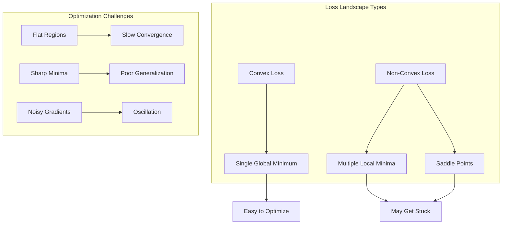

# Level 9: Optimization Theory - Training Models

## Overview

Welcome to Level 9, where we explore the mathematical heart of machine learning: **Optimization Theory**. Every time you train a neural network, fit a regression model, or tune a classifier, you are solving an optimization problem. Understanding this mathematics transforms you from someone who uses ML libraries to someone who truly understands what happens under the hood.

## Why Optimization Matters

Machine learning is fundamentally about finding the best parameters for a model. But what does "best" mean? And how do we find these optimal parameters efficiently? These questions lie at the core of optimization theory.

Consider training a simple linear regression model. You have data points, and you want to find a line that best fits them. "Best" means minimizing some measure of error - the **loss function**. Finding this minimum requires an **optimization algorithm**. The shape of the loss landscape determines whether finding the minimum is easy or hard - this is where **convexity** matters. And to ensure our model generalizes well, we add **regularization**.

```
Training Loop Anatomy
=====================

┌─────────────────────────────────────────────────────────────────┐
│                     MACHINE LEARNING TRAINING                    │
├─────────────────────────────────────────────────────────────────┤
│                                                                  │
│    Data ──► Model ──► Predictions ──► Loss Function             │
│              ▲                              │                    │
│              │                              ▼                    │
│              │                        Calculate Error            │
│              │                              │                    │
│              │                              ▼                    │
│         Update Weights ◄── Optimization Algorithm                │
│              │                              │                    │
│              │                              ▼                    │
│              └────────── Regularization ◄──┘                    │
│                                                                  │
└─────────────────────────────────────────────────────────────────┘
```

## What You'll Learn

### Chapter 1: Loss Functions
The loss function quantifies how wrong your model's predictions are. Different problems require different loss functions:
- **MSE (Mean Squared Error)** - For regression, penalizes large errors heavily
- **MAE (Mean Absolute Error)** - For regression, robust to outliers
- **Log Loss** - For binary classification, measures probability calibration
- **Cross-Entropy** - For multi-class classification, the workhorse of deep learning
- **Hinge Loss** - For SVMs, creates maximum margin classifiers

### Chapter 2: Optimization Algorithms
Once you have a loss function, you need algorithms to minimize it:
- **Gradient Descent** - The fundamental algorithm, follows the steepest downhill path
- **Stochastic Gradient Descent (SGD)** - Uses mini-batches for efficiency and noise
- **Momentum** - Accelerates convergence by remembering past gradients
- **Adam** - Adaptive learning rates, the default choice for deep learning

### Chapter 3: Convex Optimization
Not all optimization problems are equally easy to solve:
- **Convex Sets** - Regions with no "dents" that simplify optimization
- **Convex Functions** - Functions with a single global minimum
- **Why Convexity Matters** - Guarantees about finding optimal solutions

### Chapter 4: Regularization
Optimization alone isn't enough; we need to prevent overfitting:
- **L1 Regularization (Lasso)** - Encourages sparse models
- **L2 Regularization (Ridge)** - Encourages small weights
- **Elastic Net** - Combines L1 and L2 benefits
- **Bias-Variance Tradeoff** - The fundamental tension in model complexity

## The Optimization Landscape



## Prerequisites

Before diving into optimization theory, ensure you're comfortable with:
- **Calculus**: Derivatives, partial derivatives, chain rule (Level 4)
- **Linear Algebra**: Vectors, matrices, gradients (Levels 1-3)
- **Probability**: Basic probability concepts for loss functions (Level 6)
- **Basic Python**: NumPy operations for code examples

## Learning Path

| Chapter | Topic | Key Concepts | Estimated Time |
|---------|-------|--------------|----------------|
| 1 | Loss Functions | MSE, Cross-Entropy, Hinge | 2-3 hours |
| 2 | Optimization Algorithms | GD, SGD, Adam | 3-4 hours |
| 3 | Convex Optimization | Convexity, Global Optima | 2-3 hours |
| 4 | Regularization | L1, L2, Bias-Variance | 2-3 hours |

## Mathematical Notation

Throughout this level, we'll use consistent notation:

| Symbol | Meaning |
|--------|---------|
| $\mathbf{w}$ | Weight vector (parameters to optimize) |
| $\mathbf{x}$ | Input feature vector |
| $y$ | True label/target |
| $\hat{y}$ | Predicted value |
| $L(\mathbf{w})$ | Loss function |
| $\nabla L$ | Gradient of loss |
| $\eta$ | Learning rate |
| $\lambda$ | Regularization strength |

## The Big Picture

$$\text{ML Training} = \min_{\mathbf{w}} \left[ \underbrace{L(\mathbf{w})}_{\text{Loss}} + \underbrace{\lambda R(\mathbf{w})}_{\text{Regularization}} \right]$$

This single equation captures the essence of what we'll learn:
1. Choose a loss function $L(\mathbf{w})$ appropriate for your problem
2. Add regularization $R(\mathbf{w})$ to prevent overfitting
3. Use an optimization algorithm to find the weights $\mathbf{w}$ that minimize this objective

## Practical Applications

By the end of this level, you'll understand:

- **Why neural networks use cross-entropy loss** instead of MSE for classification
- **How Adam optimizer adapts** its learning rate for different parameters
- **Why convexity guarantees** that linear regression always finds the global optimum
- **When to use L1 vs L2 regularization** based on your feature selection needs
- **How to implement gradient descent** from scratch in Python

## Let's Begin

Start with [Chapter 1: Loss Functions](./01-loss-functions.md) to understand how we measure model performance. Each chapter builds on the previous, so follow them in order for the best learning experience.

Remember: optimization is not just about finding any solution, but finding the **best** solution efficiently while ensuring it **generalizes** to new data. This balance between optimization and generalization is what makes machine learning both challenging and fascinating.

---

*"The essence of mathematics is not to make simple things complicated, but to make complicated things simple."* - Stan Gudder

Let's make optimization simple.
