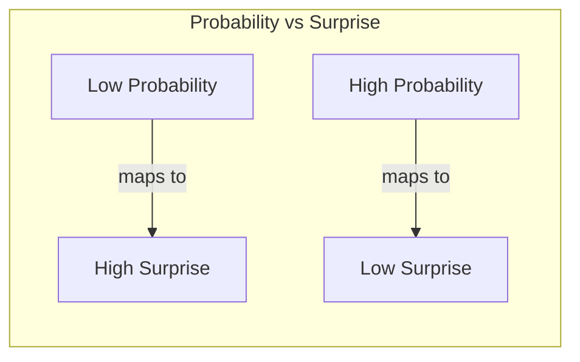

# Chapter 1: Information and Surprise

## Intuition

Imagine you're watching a weather forecast. If the meteorologist says "Tomorrow will be sunny" in the middle of a desert summer, you barely blink—this is expected. But if they announce "Tomorrow will snow in the Sahara," you're shocked. This shock, this unexpectedness, is precisely what information theory quantifies as **information** or **surprise**.

The key insight: **rare events carry more information than common events**.

When something unlikely happens, we learn more. When something expected happens, we learn little. Information theory formalizes this intuition into a rigorous mathematical framework.

### Real-World Analogies

- **News headlines**: "Sun rises in the east" isn't news. "Earthquake strikes" is.
- **Debugging**: A test that always passes tells you nothing. A failing test is informative.
- **Medical diagnosis**: A positive test for a rare disease is more informative than a negative one for the same disease.

### Why This Matters for ML

In machine learning, we're constantly asking: "How surprised should the model be by this observation?" When training a classifier:
- Correctly predicting a class with 99% confidence? Low surprise, small gradient.
- Assigning 1% probability to the true class? High surprise, large gradient update.

This is why loss functions based on information theory (like cross-entropy) work so well—they naturally weight learning based on how surprising the outcome is.

## Visual Explanation

### The Surprise Function



The relationship between probability and self-information:

$$I(x) = -\log P(x)$$

As probability approaches 0, surprise approaches infinity. As probability approaches 1, surprise approaches 0.

### Visual: Self-Information Curve

```
Surprise
    ^
  8 |*
    |
  6 | *
    |
  4 |  *
    |   *
  2 |    *
    |      *  *   *
  0 +--------*---*---*---> Probability
    0   0.2  0.4  0.6  0.8  1.0
```

This curve shows why:
- Events with P=0.01 have high information (~4.6 nats or ~6.6 bits)
- Events with P=0.5 have moderate information (~0.69 nats or 1 bit)
- Events with P=1.0 have zero information (completely certain)

## Mathematical Foundation

### Definition: Self-Information

The **self-information** (also called **surprisal** or **information content**) of an event $x$ with probability $P(x)$ is:

$$I(x) = -\log P(x) = \log \frac{1}{P(x)}$$

**Units depend on the logarithm base:**
- Base 2: bits (binary digits)
- Base $e$: nats (natural units)
- Base 10: hartleys (rarely used)

### Properties of Self-Information

1. **Non-negativity**: $I(x) \geq 0$ for all events
   - Since $0 \leq P(x) \leq 1$, we have $-\log P(x) \geq 0$

2. **Certainty yields zero information**: If $P(x) = 1$, then $I(x) = 0$
   - A certain event tells us nothing new

3. **Impossible events yield infinite information**: As $P(x) \to 0$, $I(x) \to \infty$
   - Observing the impossible would be infinitely surprising

4. **Additivity for independent events**: $I(x, y) = I(x) + I(y)$ when $x$ and $y$ are independent
   - Since $P(x,y) = P(x)P(y)$, we get $-\log P(x)P(y) = -\log P(x) - \log P(y)$

### Why Logarithm?

The logarithm is the unique function that satisfies additivity for independent events. If we want:
- Information to be additive for independent events
- More information for rarer events
- Zero information for certain events

Then the logarithm is mathematically required.

### Example Calculations

**Fair coin flip (heads):**
$$I(\text{heads}) = -\log_2(0.5) = 1 \text{ bit}$$

**Rolling a 6 on a fair die:**
$$I(\text{six}) = -\log_2(1/6) \approx 2.58 \text{ bits}$$

**Drawing the Ace of Spades:**
$$I(\text{ace of spades}) = -\log_2(1/52) \approx 5.7 \text{ bits}$$

## Code Example

```python
import numpy as np
import matplotlib.pyplot as plt

def self_information(probability, base='e'):
    """
    Calculate self-information (surprise) of an event.

    Parameters:
    -----------
    probability : float or array
        Probability of the event(s), must be in (0, 1]
    base : str
        'e' for nats, '2' for bits, '10' for hartleys

    Returns:
    --------
    float or array : Self-information value(s)
    """
    probability = np.asarray(probability)

    if np.any(probability <= 0) or np.any(probability > 1):
        raise ValueError("Probability must be in (0, 1]")

    if base == 'e':
        return -np.log(probability)
    elif base == '2':
        return -np.log2(probability)
    elif base == '10':
        return -np.log10(probability)
    else:
        raise ValueError("Base must be 'e', '2', or '10'")

# Example 1: Compare surprise for different events
print("=== Self-Information Examples ===\n")

events = [
    ("Fair coin (heads)", 0.5),
    ("Fair die (roll 6)", 1/6),
    ("Deck of cards (Ace of Spades)", 1/52),
    ("Rare disease (1 in 10,000)", 0.0001),
    ("Almost certain event", 0.99),
]

for name, prob in events:
    info_bits = self_information(prob, base='2')
    info_nats = self_information(prob, base='e')
    print(f"{name}:")
    print(f"  Probability: {prob:.6f}")
    print(f"  Surprise: {info_bits:.3f} bits = {info_nats:.3f} nats\n")

# Example 2: Visualize the self-information curve
probabilities = np.linspace(0.001, 1.0, 1000)
surprises = self_information(probabilities, base='2')

plt.figure(figsize=(10, 6))
plt.plot(probabilities, surprises, 'b-', linewidth=2)
plt.xlabel('Probability P(x)', fontsize=12)
plt.ylabel('Self-Information I(x) [bits]', fontsize=12)
plt.title('Self-Information: How Surprise Relates to Probability', fontsize=14)
plt.grid(True, alpha=0.3)
plt.xlim(0, 1)
plt.ylim(0, 10)

# Mark some reference points
reference_points = [(0.5, "Coin flip"), (1/6, "Die roll"), (0.01, "1% event")]
for prob, label in reference_points:
    info = self_information(prob, base='2')
    plt.plot(prob, info, 'ro', markersize=8)
    plt.annotate(f'{label}\n{info:.2f} bits',
                 xy=(prob, info),
                 xytext=(prob + 0.1, info + 0.5),
                 fontsize=9)

plt.tight_layout()
plt.savefig('self_information_curve.png', dpi=150)
plt.show()

# Example 3: Verify additivity for independent events
print("=== Additivity Property ===\n")

p_coin = 0.5  # P(heads)
p_die = 1/6   # P(roll 6)

# Joint probability (independent events)
p_joint = p_coin * p_die

# Individual surprises
I_coin = self_information(p_coin, base='2')
I_die = self_information(p_die, base='2')
I_joint = self_information(p_joint, base='2')

print(f"I(heads) = {I_coin:.4f} bits")
print(f"I(roll 6) = {I_die:.4f} bits")
print(f"I(heads) + I(roll 6) = {I_coin + I_die:.4f} bits")
print(f"I(heads AND roll 6) = {I_joint:.4f} bits")
print(f"\nAdditivity verified: {np.isclose(I_coin + I_die, I_joint)}")
```

**Output:**
```
=== Self-Information Examples ===

Fair coin (heads):
  Probability: 0.500000
  Surprise: 1.000 bits = 0.693 nats

Fair die (roll 6):
  Probability: 0.166667
  Surprise: 2.585 bits = 1.792 nats

Deck of cards (Ace of Spades):
  Probability: 0.019231
  Surprise: 5.700 bits = 3.951 nats

Rare disease (1 in 10,000):
  Probability: 0.000100
  Surprise: 13.288 bits = 9.210 nats

Almost certain event:
  Probability: 0.990000
  Surprise: 0.014 bits = 0.010 nats

=== Additivity Property ===

I(heads) = 1.0000 bits
I(roll 6) = 2.5850 bits
I(heads) + I(roll 6) = 3.5850 bits
I(heads AND roll 6) = 3.5850 bits

Additivity verified: True
```

## ML Relevance

### Loss Function Foundation

The negative log-likelihood loss used throughout ML is directly based on self-information:

$$\mathcal{L} = -\log P(y | x; \theta)$$

This is literally the surprise of the model when observing the true label $y$.

### Applications in ML Systems

1. **Classification Loss**: Cross-entropy sums self-information over the training set
2. **Language Models**: Perplexity is $2^{\text{average surprise in bits}}$
3. **Anomaly Detection**: High self-information indicates anomalies
4. **Compression**: Optimal codes assign $-\log P(x)$ bits to event $x$

### The Gradient Connection

When training with log-loss, the gradient with respect to the predicted probability $q$ is:

$$\frac{\partial (-\log q)}{\partial q} = -\frac{1}{q}$$

This means:
- When $q$ is small (model surprised), gradient is large → big update
- When $q$ is close to 1 (model confident and correct), gradient is small → small update

This is exactly what we want: learn more from mistakes.

## When to Use / Ignore

### When to Use Self-Information

- **Measuring how surprising a single event is** to a model
- **Debugging predictions**: Check which samples have highest surprise
- **Anomaly detection**: Flag samples with unusually high self-information
- **Understanding loss landscape**: Each training sample contributes its surprise

### When to Look Beyond

- **Comparing distributions**: Use KL divergence instead
- **Average-case analysis**: Use entropy (expected self-information)
- **When probability is 0**: Self-information is undefined; use smoothing

### Common Pitfalls

1. **Forgetting the negative sign**: $I(x) = -\log P(x)$, not $\log P(x)$
2. **Base confusion**: Be consistent with log base; bits vs nats
3. **Zero probability**: Always add small epsilon or use smoothing
4. **Confusing information with meaning**: High information ≠ meaningful content

## Exercises

### Exercise 1: Computing Surprise
**Problem**: A spam filter assigns P(spam) = 0.001 to an email that turns out to be spam. What is the self-information in bits?

**Solution**:
$$I(\text{spam}) = -\log_2(0.001) = -\log_2(10^{-3}) = 3 \cdot \log_2(10) \approx 9.97 \text{ bits}$$

The filter was very surprised—nearly 10 bits of information. This suggests the email had unusual characteristics for spam.

### Exercise 2: Comparing Events
**Problem**: Which carries more information: rolling a 1 on a fair 6-sided die, or drawing a heart from a standard deck?

**Solution**:
- Die roll: $I(1) = -\log_2(1/6) \approx 2.58$ bits
- Drawing heart: $I(\text{heart}) = -\log_2(13/52) = -\log_2(1/4) = 2$ bits

Rolling a specific number carries more information because it's less likely (1/6 < 1/4).

### Exercise 3: Additivity Verification
**Problem**: Verify that for two independent fair coin flips, the information in "both heads" equals the sum of individual informations.

**Solution**:
```python
import numpy as np

# Individual flips
p_single = 0.5
I_single = -np.log2(p_single)  # 1 bit

# Both heads (independent)
p_both = 0.5 * 0.5  # = 0.25
I_both = -np.log2(p_both)  # 2 bits

print(f"I(head) = {I_single} bit")
print(f"I(head) + I(head) = {2 * I_single} bits")
print(f"I(both heads) = {I_both} bits")
# Output: All equal 2 bits, confirming additivity
```

## Summary

- **Self-information** quantifies surprise: $I(x) = -\log P(x)$
- **Rare events** carry more information than common events
- **Units** depend on log base: bits (base 2) or nats (base e)
- **Key properties**: non-negative, additive for independent events, zero for certain events
- **ML connection**: Log-loss is literally the surprise of observing the true outcome
- **Foundation**: This is the building block for entropy, cross-entropy, and KL divergence

Self-information answers the question: "How surprised am I by this specific event?" In the next chapter, we'll extend this to ask: "On average, how surprised will I be?"—that's entropy.
