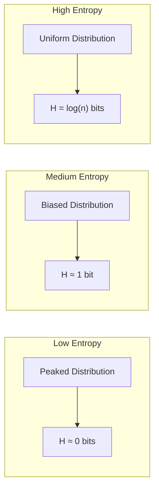

# Chapter 2: Shannon Entropy

## Intuition

If self-information tells us the surprise of a single event, **entropy** tells us the *average surprise* we expect from a probability distribution. It measures the inherent uncertainty or randomness in a system.

Think of entropy as answering: "Before I observe an outcome, how uncertain am I about what will happen?"

### Real-World Analogies

**Weather Forecasting:**
- A city with consistent sunny weather has low entropy—you can predict tomorrow confidently
- A city with highly variable weather has high entropy—tomorrow is genuinely uncertain

**Password Strength:**
- A password from {a, b, c} has less entropy than one from {a-z, A-Z, 0-9}
- More possibilities = more uncertainty = higher entropy = better security

**Multiple Choice Tests:**
- If you know a subject well, your answer distribution is peaked (low entropy)
- If you're guessing randomly, your distribution is uniform (maximum entropy)

### Why This Matters for ML

Entropy appears everywhere in machine learning:
- **Model confidence**: Low entropy predictions = confident model
- **Decision trees**: Split on features that reduce entropy most
- **Exploration vs exploitation**: High entropy policies explore more
- **Feature selection**: Prefer features that reduce target entropy
- **Maximum entropy models**: When uncertain, be maximally uncertain

## Visual Explanation

### Entropy for Different Distributions



### Visual: Binary Entropy Function

For a binary distribution with $P(1) = p$ and $P(0) = 1-p$:

```
Entropy H(p)
    ^
  1 |        ****
    |      **    **
0.8 |     *        *
    |    *          *
0.6 |   *            *
    |  *              *
0.4 | *                *
    |*                  *
0.2 |
    |
  0 +--------------------> p
    0   0.2  0.4  0.6  0.8  1.0
```

Key observations:
- **Maximum at p = 0.5**: Fair coin has maximum uncertainty
- **Zero at p = 0 or p = 1**: Certain outcomes have no uncertainty
- **Symmetric**: H(p) = H(1-p)

## Mathematical Foundation

### Definition: Shannon Entropy

For a discrete random variable $X$ with probability distribution $P$, the **Shannon entropy** is:

$$H(X) = H(P) = -\sum_{x} P(x) \log P(x) = \mathbb{E}[-\log P(X)]$$

This is simply the **expected self-information**—the average surprise.

### Convention

When $P(x) = 0$, we define $0 \cdot \log(0) = 0$ using the limit:
$$\lim_{p \to 0^+} p \log p = 0$$

### Properties of Entropy

1. **Non-negativity**: $H(X) \geq 0$
   - Entropy is always non-negative

2. **Maximum for uniform distribution**: $H(X) \leq \log |X|$
   - Achieved when all outcomes are equally likely

3. **Zero for deterministic distributions**: $H(X) = 0$ iff $X$ is constant
   - No uncertainty = no entropy

4. **Additivity for independent variables**: $H(X, Y) = H(X) + H(Y)$
   - When $X$ and $Y$ are independent

5. **Chain rule**: $H(X, Y) = H(X) + H(Y|X)$
   - Joint entropy equals marginal plus conditional

### Binary Entropy Function

For a Bernoulli random variable with $P(X=1) = p$:

$$H_b(p) = -p \log p - (1-p) \log(1-p)$$

This function peaks at $p = 0.5$ with $H_b(0.5) = 1$ bit.

### Conditional Entropy

The entropy of $Y$ given $X$ is:

$$H(Y|X) = \sum_x P(x) H(Y|X=x) = -\sum_{x,y} P(x,y) \log P(y|x)$$

This measures remaining uncertainty in $Y$ after observing $X$.

### Mutual Information (Preview)

The reduction in entropy from knowing another variable:

$$I(X; Y) = H(Y) - H(Y|X) = H(X) - H(X|Y)$$

This quantifies how much information $X$ and $Y$ share.

## Code Example

```python
import numpy as np
import matplotlib.pyplot as plt
from scipy.stats import entropy as scipy_entropy

def entropy(probabilities, base='e'):
    """
    Calculate Shannon entropy of a probability distribution.

    Parameters:
    -----------
    probabilities : array-like
        Probability distribution (must sum to 1)
    base : str
        'e' for nats, '2' for bits

    Returns:
    --------
    float : Entropy value
    """
    p = np.asarray(probabilities, dtype=float)

    # Validate distribution
    if not np.isclose(p.sum(), 1.0):
        raise ValueError(f"Probabilities must sum to 1, got {p.sum()}")
    if np.any(p < 0):
        raise ValueError("Probabilities must be non-negative")

    # Filter out zeros (0 * log(0) = 0 by convention)
    p_nonzero = p[p > 0]

    if base == 'e':
        return -np.sum(p_nonzero * np.log(p_nonzero))
    elif base == '2':
        return -np.sum(p_nonzero * np.log2(p_nonzero))
    else:
        raise ValueError("Base must be 'e' or '2'")

def binary_entropy(p, base='2'):
    """Calculate entropy of a Bernoulli(p) distribution."""
    if p == 0 or p == 1:
        return 0.0
    return entropy([p, 1-p], base=base)

# Example 1: Entropy of various distributions
print("=== Entropy Examples ===\n")

distributions = {
    "Fair coin": [0.5, 0.5],
    "Biased coin (90/10)": [0.9, 0.1],
    "Fair 6-sided die": [1/6] * 6,
    "Loaded die": [0.5, 0.1, 0.1, 0.1, 0.1, 0.1],
    "Certain outcome": [1.0, 0.0, 0.0],
    "Uniform over 8": [1/8] * 8,
}

for name, dist in distributions.items():
    H_bits = entropy(dist, base='2')
    H_nats = entropy(dist, base='e')
    max_entropy = np.log2(len(dist))
    efficiency = H_bits / max_entropy if max_entropy > 0 else 0

    print(f"{name}:")
    print(f"  Distribution: {[f'{p:.2f}' for p in dist]}")
    print(f"  Entropy: {H_bits:.3f} bits = {H_nats:.3f} nats")
    print(f"  Max possible: {max_entropy:.3f} bits")
    print(f"  Efficiency: {efficiency:.1%}\n")

# Example 2: Binary entropy curve
print("=== Binary Entropy Function ===\n")

p_values = np.linspace(0.001, 0.999, 1000)
H_values = [binary_entropy(p) for p in p_values]

plt.figure(figsize=(10, 6))
plt.plot(p_values, H_values, 'b-', linewidth=2)
plt.xlabel('Probability p', fontsize=12)
plt.ylabel('Binary Entropy H(p) [bits]', fontsize=12)
plt.title('Binary Entropy Function: Uncertainty of a Coin Flip', fontsize=14)
plt.grid(True, alpha=0.3)
plt.xlim(0, 1)
plt.ylim(0, 1.1)

# Mark key points
plt.axhline(y=1, color='r', linestyle='--', alpha=0.5, label='Maximum entropy')
plt.axvline(x=0.5, color='g', linestyle='--', alpha=0.5, label='Fair coin')
plt.plot(0.5, 1, 'go', markersize=10)
plt.annotate('Maximum uncertainty\nat p=0.5', xy=(0.5, 1), xytext=(0.6, 0.85),
             fontsize=10, arrowprops=dict(arrowstyle='->', color='gray'))

plt.legend()
plt.tight_layout()
plt.savefig('binary_entropy.png', dpi=150)
plt.show()

# Example 3: Entropy as measure of model confidence
print("=== Model Confidence via Entropy ===\n")

# Simulated softmax outputs for a 3-class classifier
predictions = {
    "Confident correct": [0.95, 0.03, 0.02],
    "Somewhat confident": [0.7, 0.2, 0.1],
    "Uncertain": [0.4, 0.35, 0.25],
    "Random guessing": [1/3, 1/3, 1/3],
}

for name, probs in predictions.items():
    H = entropy(probs, base='2')
    max_H = np.log2(3)
    confidence = 1 - (H / max_H)  # Normalized confidence

    print(f"{name}:")
    print(f"  Softmax output: {probs}")
    print(f"  Entropy: {H:.3f} bits (max: {max_H:.3f})")
    print(f"  Confidence score: {confidence:.1%}\n")

# Example 4: Entropy reduction in decision trees
print("=== Entropy in Decision Trees ===\n")

# Simulated: predicting "play tennis" based on weather
# Before split
p_play = 9/14
H_before = binary_entropy(p_play)
print(f"Before split: P(play) = {p_play:.3f}, H = {H_before:.3f} bits")

# After split on "Outlook"
# Sunny: 2/5 play, Overcast: 4/4 play, Rain: 3/5 play
splits = [
    ("Sunny", 5/14, 2/5),
    ("Overcast", 4/14, 4/4),
    ("Rain", 5/14, 3/5),
]

H_after = 0
for outlook, weight, p_play_given in splits:
    H_conditional = binary_entropy(p_play_given)
    H_after += weight * H_conditional
    print(f"  {outlook}: weight={weight:.3f}, P(play|{outlook})={p_play_given:.2f}, H={H_conditional:.3f}")

print(f"\nAfter split: H(Play|Outlook) = {H_after:.3f} bits")
print(f"Information gain: {H_before - H_after:.3f} bits")

# Example 5: Verify with scipy
print("\n=== Verification with SciPy ===")
test_dist = [0.25, 0.25, 0.5]
our_entropy = entropy(test_dist, base='2')
scipy_ent = scipy_entropy(test_dist, base=2)
print(f"Our implementation: {our_entropy:.6f}")
print(f"SciPy entropy: {scipy_ent:.6f}")
print(f"Match: {np.isclose(our_entropy, scipy_ent)}")
```

**Output:**
```
=== Entropy Examples ===

Fair coin:
  Distribution: ['0.50', '0.50']
  Entropy: 1.000 bits = 0.693 nats
  Max possible: 1.000 bits
  Efficiency: 100.0%

Biased coin (90/10):
  Distribution: ['0.90', '0.10']
  Entropy: 0.469 bits = 0.325 nats
  Max possible: 1.000 bits
  Efficiency: 46.9%

Fair 6-sided die:
  Distribution: ['0.17', '0.17', '0.17', '0.17', '0.17', '0.17']
  Entropy: 2.585 bits = 1.792 nats
  Max possible: 2.585 bits
  Efficiency: 100.0%

=== Model Confidence via Entropy ===

Confident correct:
  Softmax output: [0.95, 0.03, 0.02]
  Entropy: 0.335 bits (max: 1.585)
  Confidence score: 78.9%

Random guessing:
  Softmax output: [0.3333333333333333, 0.3333333333333333, 0.3333333333333333]
  Entropy: 1.585 bits (max: 1.585)
  Confidence score: 0.0%
```

## ML Relevance

### Decision Trees and Random Forests

Entropy is central to tree-based algorithms:

$$\text{Information Gain} = H(Y) - H(Y|X) = H(\text{parent}) - \sum_{\text{children}} \frac{N_{\text{child}}}{N_{\text{parent}}} H(\text{child})$$

Trees split on features that maximize information gain (minimize conditional entropy).

### Neural Network Confidence

Entropy of softmax outputs measures prediction confidence:
- **Low entropy**: Model is confident (peaked distribution)
- **High entropy**: Model is uncertain (flat distribution)

This is used in:
- Active learning: Query samples with highest entropy
- Uncertainty quantification: Flag uncertain predictions
- Out-of-distribution detection: OOD samples often have higher entropy

### Maximum Entropy Principle

When you have partial information, the least biased distribution is the one with maximum entropy subject to constraints. This principle underlies:
- Maximum entropy classifiers (logistic regression)
- Exponential family distributions
- Statistical physics connections

### Reinforcement Learning

Policy entropy encourages exploration:

$$\mathcal{L} = \mathbb{E}[R] + \alpha H(\pi)$$

Higher entropy policies try more actions, avoiding premature convergence.

## Interpretation Guide

| Entropy (bits) | Interpretation |
|----------------|----------------|
| 0 | Complete certainty |
| 0.5 | Low uncertainty |
| 1 | Binary choice uncertainty |
| 2-3 | Moderate uncertainty |
| $\log_2(n)$ | Maximum uncertainty (uniform over n) |

### Comparing Entropies

- Same number of outcomes: Higher entropy = more uncertainty
- Different outcomes: Compare to maximum possible ($\log n$)
- Use **normalized entropy** $H/H_{max}$ for fair comparison

## When to Use / Ignore

### When to Use Entropy

- **Measuring uncertainty** in model predictions
- **Feature selection** in decision trees
- **Encouraging exploration** in RL
- **Comparing distribution** "spreadness"
- **Password/key strength** analysis

### When to Look Beyond

- **Comparing two distributions**: Use KL divergence or cross-entropy
- **Continuous distributions**: Use differential entropy (but interpret carefully)
- **When direction matters**: KL divergence is asymmetric

### Common Pitfalls

1. **Forgetting base**: Always specify bits or nats
2. **Comparing entropies with different support sizes**: Normalize first
3. **Interpreting high entropy as "bad"**: Depends on context (exploration needs high entropy)
4. **Differential entropy can be negative**: Unlike discrete entropy

## Exercises

### Exercise 1: Maximum Entropy
**Problem**: Prove that for a discrete distribution over $n$ outcomes, entropy is maximized when the distribution is uniform.

**Solution**:
Using Lagrange multipliers with constraint $\sum p_i = 1$:

$$\mathcal{L} = -\sum p_i \log p_i - \lambda(\sum p_i - 1)$$

Taking derivative and setting to zero:
$$\frac{\partial \mathcal{L}}{\partial p_i} = -\log p_i - 1 - \lambda = 0$$

This gives $p_i = e^{-1-\lambda}$ for all $i$, meaning all probabilities are equal.
With $\sum p_i = 1$, we get $p_i = 1/n$, so $H_{max} = \log n$.

### Exercise 2: Entropy of English
**Problem**: If English letters appeared uniformly, what would the entropy per letter be? Given that actual English has about 1.5 bits per letter, what does this tell us?

**Solution**:
```python
# Uniform distribution over 26 letters
H_uniform = np.log2(26)  # ≈ 4.7 bits

# Actual English
H_english = 1.5  # bits (approximately)

# Redundancy
redundancy = 1 - (H_english / H_uniform)

print(f"Maximum entropy: {H_uniform:.2f} bits")
print(f"Actual entropy: {H_english:.2f} bits")
print(f"Redundancy: {redundancy:.1%}")
# Redundancy ≈ 68% - English is highly predictable!
```

### Exercise 3: Conditional Entropy
**Problem**: You have a dataset with class balance [0.7, 0.3]. After splitting on a feature, the two groups have class balances [0.9, 0.1] and [0.3, 0.7] with equal size. Calculate the information gain.

**Solution**:
```python
# Before split
H_before = binary_entropy(0.7)  # ≈ 0.881 bits

# After split (equal-sized groups)
H_group1 = binary_entropy(0.9)  # ≈ 0.469 bits
H_group2 = binary_entropy(0.3)  # ≈ 0.881 bits
H_after = 0.5 * H_group1 + 0.5 * H_group2  # ≈ 0.675 bits

info_gain = H_before - H_after  # ≈ 0.206 bits
print(f"Information gain: {info_gain:.3f} bits")
```

## Summary

- **Shannon entropy** is the expected self-information: $H(X) = -\sum P(x) \log P(x)$
- **Interpretation**: Average uncertainty or average surprise
- **Maximum entropy** is achieved by uniform distributions
- **Zero entropy** means complete certainty
- **Binary entropy** peaks at $p=0.5$ with $H=1$ bit
- **ML applications**: Decision trees, confidence estimation, exploration in RL
- **Units**: Bits (log base 2) or nats (natural log)

Entropy tells us about the inherent uncertainty in a single distribution. But in ML, we often want to compare our model's distribution to the true distribution. That's where cross-entropy comes in—our next topic.
