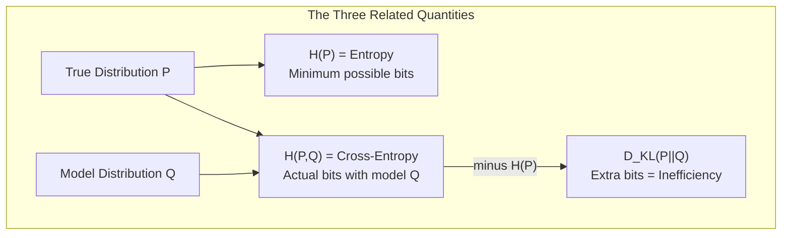

# Chapter 3: Cross-Entropy

## Intuition

Imagine you're packing for a trip. If you pack exactly what you need based on accurate weather predictions, your suitcase is optimally sized. But if you use outdated or incorrect predictions, you might overpack (just in case) or underpack (getting caught unprepared).

**Cross-entropy** measures this "packing inefficiency" when you use one distribution (your model Q) to prepare for events that actually follow a different distribution (the true data P).

More formally: cross-entropy is the average number of bits needed to encode data from distribution P when using a code optimized for distribution Q.

### Real-World Analogies

**Umbrella Problem:**
- True rain probability: 80% (P)
- Your belief: 20% (Q)
- You'll frequently be caught without an umbrella—high "cross-entropy" between your belief and reality

**Spell Checker:**
- Your vocabulary model expects formal English (Q)
- User types informal text with slang (P)
- The spell checker will flag many "surprising" (but actually common) words

**Stock Trading:**
- Your model predicts tech stocks go up (Q)
- Market actually favors value stocks (P)
- Your predictions consistently miss, costing you money

### Why This Matters for ML

Cross-entropy is *the* standard loss function for classification:
- It directly measures how well your model's predicted probabilities match the true labels
- It's mathematically equivalent to negative log-likelihood
- It naturally handles the probabilistic nature of predictions
- Gradients are well-behaved, leading to stable training

When you call `loss='categorical_crossentropy'` in Keras or `nn.CrossEntropyLoss()` in PyTorch, you're using this concept.

## Visual Explanation

### The Cross-Entropy Relationship



**Key relationship:**
$$H(P, Q) = H(P) + D_{KL}(P \| Q)$$

Cross-entropy = Entropy + KL Divergence

### Visual: Cross-Entropy vs Entropy

```
Bits needed
    ^
    |  +-----------------+
    |  |   D_KL(P||Q)    |  <- Extra bits (inefficiency)
    |  |   (wasted)      |
    |  +-----------------+
    |  |                 |
    |  |     H(P)        |  <- Minimum bits (entropy)
    |  |   (optimal)     |
    |  +-----------------+
    |
    +----------------------->

    Cross-entropy H(P,Q) = H(P) + D_KL(P||Q)
```

Since $D_{KL}(P\|Q) \geq 0$, we always have $H(P, Q) \geq H(P)$.

**The only way to achieve minimum cross-entropy is when $Q = P$.**

## Mathematical Foundation

### Definition: Cross-Entropy

For discrete distributions P (true) and Q (model):

$$H(P, Q) = -\sum_{x} P(x) \log Q(x) = \mathbb{E}_{x \sim P}[-\log Q(x)]$$

In words: the expected surprise of the model Q when data comes from P.

### Cross-Entropy for Classification

For a single sample with true label $y$ and predicted probabilities $\hat{y}$:

**Binary classification:**
$$H(y, \hat{y}) = -[y \log(\hat{y}) + (1-y) \log(1-\hat{y})]$$

**Multi-class classification (one-hot encoded):**
$$H(\mathbf{y}, \hat{\mathbf{y}}) = -\sum_{c=1}^{C} y_c \log(\hat{y}_c)$$

Since $y$ is one-hot, this simplifies to:
$$H(\mathbf{y}, \hat{\mathbf{y}}) = -\log(\hat{y}_{true})$$

This is just the negative log probability of the true class!

### Properties of Cross-Entropy

1. **Non-negativity**: $H(P, Q) \geq 0$

2. **Minimum at P = Q**: $H(P, Q) \geq H(P)$, with equality iff Q = P

3. **Not symmetric**: $H(P, Q) \neq H(Q, P)$ in general

4. **Decomposition**: $H(P, Q) = H(P) + D_{KL}(P \| Q)$

### Connection to Maximum Likelihood

Minimizing cross-entropy over a dataset is equivalent to maximum likelihood estimation:

$$\min_\theta H(P_{data}, Q_\theta) = \min_\theta \mathbb{E}_{x \sim P_{data}}[-\log Q_\theta(x)] = \max_\theta \mathbb{E}_{x \sim P_{data}}[\log Q_\theta(x)]$$

The last term is the log-likelihood. This is why cross-entropy loss is so fundamental—it directly optimizes likelihood.

### Batch Cross-Entropy Loss

For a dataset with $N$ samples:

$$\mathcal{L} = \frac{1}{N} \sum_{i=1}^{N} H(y^{(i)}, \hat{y}^{(i)}) = -\frac{1}{N} \sum_{i=1}^{N} \sum_{c=1}^{C} y_c^{(i)} \log(\hat{y}_c^{(i)})$$

## Code Example

```python
import numpy as np
import matplotlib.pyplot as plt

def cross_entropy(p_true, q_pred, epsilon=1e-15):
    """
    Calculate cross-entropy between true distribution p and predicted q.

    Parameters:
    -----------
    p_true : array-like
        True probability distribution (or one-hot labels)
    q_pred : array-like
        Predicted probability distribution
    epsilon : float
        Small value to prevent log(0)

    Returns:
    --------
    float : Cross-entropy value
    """
    p_true = np.asarray(p_true, dtype=float)
    q_pred = np.asarray(q_pred, dtype=float)

    # Clip predictions to prevent log(0)
    q_pred = np.clip(q_pred, epsilon, 1 - epsilon)

    # Cross-entropy: -sum(p * log(q))
    return -np.sum(p_true * np.log(q_pred))

def binary_cross_entropy(y_true, y_pred, epsilon=1e-15):
    """
    Binary cross-entropy loss.

    Parameters:
    -----------
    y_true : float or array
        True labels (0 or 1)
    y_pred : float or array
        Predicted probabilities
    """
    y_pred = np.clip(y_pred, epsilon, 1 - epsilon)
    return -(y_true * np.log(y_pred) + (1 - y_true) * np.log(1 - y_pred))

def categorical_cross_entropy_loss(y_true, y_pred, epsilon=1e-15):
    """
    Categorical cross-entropy loss for batches.

    Parameters:
    -----------
    y_true : array (N, C)
        One-hot encoded true labels
    y_pred : array (N, C)
        Predicted probabilities (softmax outputs)
    """
    y_pred = np.clip(y_pred, epsilon, 1 - epsilon)
    return -np.mean(np.sum(y_true * np.log(y_pred), axis=1))

# Example 1: Basic cross-entropy calculation
print("=== Cross-Entropy Basics ===\n")

# True distribution (e.g., actual class is class 2)
p_true = np.array([0, 0, 1])  # One-hot: class 2

# Various model predictions
predictions = {
    "Perfect prediction": [0.0, 0.0, 1.0],
    "Good prediction": [0.05, 0.05, 0.90],
    "Uncertain prediction": [0.20, 0.30, 0.50],
    "Poor prediction": [0.40, 0.35, 0.25],
    "Wrong prediction": [0.70, 0.20, 0.10],
    "Completely wrong": [0.98, 0.01, 0.01],
}

print("True label: Class 2 (one-hot: [0, 0, 1])\n")
for name, q_pred in predictions.items():
    ce = cross_entropy(p_true, q_pred)
    print(f"{name}:")
    print(f"  Prediction: {q_pred}")
    print(f"  Cross-entropy: {ce:.4f} nats")
    print(f"  Equivalent to: -log({q_pred[2]:.2f}) = {ce:.4f}\n")

# Example 2: Binary classification
print("=== Binary Cross-Entropy ===\n")

# True label is positive (1)
y_true = 1

probs = [0.99, 0.9, 0.7, 0.5, 0.3, 0.1, 0.01]
print("True label: 1 (positive class)\n")
print("Predicted Prob | BCE Loss")
print("-" * 30)
for p in probs:
    loss = binary_cross_entropy(y_true, p)
    print(f"     {p:.2f}       | {loss:.4f}")

# Example 3: Visualize BCE loss landscape
print("\n=== BCE Loss Landscape ===\n")

fig, axes = plt.subplots(1, 2, figsize=(14, 5))

# Left plot: BCE for true label = 1
pred_range = np.linspace(0.001, 0.999, 1000)
loss_y1 = binary_cross_entropy(1, pred_range)
loss_y0 = binary_cross_entropy(0, pred_range)

axes[0].plot(pred_range, loss_y1, 'b-', linewidth=2, label='True label = 1')
axes[0].plot(pred_range, loss_y0, 'r-', linewidth=2, label='True label = 0')
axes[0].set_xlabel('Predicted Probability', fontsize=12)
axes[0].set_ylabel('Binary Cross-Entropy Loss', fontsize=12)
axes[0].set_title('BCE Loss vs Predicted Probability', fontsize=14)
axes[0].legend()
axes[0].grid(True, alpha=0.3)
axes[0].set_xlim(0, 1)
axes[0].set_ylim(0, 5)

# Right plot: Gradient of BCE
# d/dp BCE = -y/p + (1-y)/(1-p)
# For y=1: gradient = -1/p
gradient_y1 = -1 / pred_range
axes[1].plot(pred_range, gradient_y1, 'b-', linewidth=2)
axes[1].set_xlabel('Predicted Probability', fontsize=12)
axes[1].set_ylabel('Gradient of BCE (y=1)', fontsize=12)
axes[1].set_title('BCE Gradient: Larger for Worse Predictions', fontsize=14)
axes[1].grid(True, alpha=0.3)
axes[1].set_xlim(0, 1)
axes[1].set_ylim(-20, 0)
axes[1].axhline(y=0, color='k', linestyle='-', linewidth=0.5)

plt.tight_layout()
plt.savefig('bce_loss_landscape.png', dpi=150)
plt.show()

# Example 4: Batch cross-entropy loss
print("=== Batch Categorical Cross-Entropy ===\n")

# Simulated batch of 5 samples, 3 classes
y_true_batch = np.array([
    [1, 0, 0],  # Class 0
    [0, 1, 0],  # Class 1
    [0, 0, 1],  # Class 2
    [1, 0, 0],  # Class 0
    [0, 1, 0],  # Class 1
])

y_pred_batch = np.array([
    [0.7, 0.2, 0.1],  # Correct, somewhat confident
    [0.1, 0.8, 0.1],  # Correct, confident
    [0.1, 0.2, 0.7],  # Correct, somewhat confident
    [0.4, 0.3, 0.3],  # Correct, uncertain
    [0.3, 0.3, 0.4],  # Wrong! Predicts class 2
])

batch_loss = categorical_cross_entropy_loss(y_true_batch, y_pred_batch)
individual_losses = -np.sum(y_true_batch * np.log(np.clip(y_pred_batch, 1e-15, 1)), axis=1)

print("Sample | True | Predicted | Loss")
print("-" * 45)
for i in range(5):
    true_class = np.argmax(y_true_batch[i])
    pred_probs = y_pred_batch[i]
    loss = individual_losses[i]
    print(f"   {i}   |  {true_class}   | {pred_probs} | {loss:.4f}")

print(f"\nMean batch loss: {batch_loss:.4f}")

# Example 5: Cross-entropy vs entropy relationship
print("\n=== Cross-Entropy Decomposition ===\n")

# True distribution
p = np.array([0.7, 0.2, 0.1])
# Model distributions
q_close = np.array([0.65, 0.25, 0.10])
q_far = np.array([0.33, 0.33, 0.34])

def entropy(p):
    p_nonzero = p[p > 0]
    return -np.sum(p_nonzero * np.log(p_nonzero))

def kl_divergence(p, q, epsilon=1e-15):
    q = np.clip(q, epsilon, 1)
    return np.sum(p * np.log(p / q))

H_p = entropy(p)
print(f"True distribution P: {p}")
print(f"Entropy H(P): {H_p:.4f} nats\n")

for name, q in [("Close model", q_close), ("Far model", q_far)]:
    ce = cross_entropy(p, q)
    kl = kl_divergence(p, q)
    print(f"{name} Q: {q}")
    print(f"  Cross-entropy H(P,Q): {ce:.4f}")
    print(f"  KL divergence D_KL(P||Q): {kl:.4f}")
    print(f"  H(P) + D_KL: {H_p + kl:.4f}")
    print(f"  Verification: H(P,Q) = H(P) + D_KL? {np.isclose(ce, H_p + kl)}\n")

# Example 6: Compare with PyTorch/sklearn implementations
print("=== Verification with Libraries ===\n")

try:
    from sklearn.metrics import log_loss
    from scipy.special import softmax

    # Test data
    y_true_labels = [0, 1, 2, 0, 1]
    y_pred_probs = y_pred_batch

    sklearn_loss = log_loss(y_true_labels, y_pred_probs)
    our_loss = batch_loss

    print(f"Our implementation: {our_loss:.6f}")
    print(f"sklearn log_loss:   {sklearn_loss:.6f}")
    print(f"Match: {np.isclose(our_loss, sklearn_loss)}")
except ImportError:
    print("sklearn not available for verification")
```

**Output:**
```
=== Cross-Entropy Basics ===

True label: Class 2 (one-hot: [0, 0, 1])

Perfect prediction:
  Prediction: [0.0, 0.0, 1.0]
  Cross-entropy: 0.0000 nats
  Equivalent to: -log(1.00) = 0.0000

Good prediction:
  Prediction: [0.05, 0.05, 0.9]
  Cross-entropy: 0.1054 nats
  Equivalent to: -log(0.90) = 0.1054

Wrong prediction:
  Prediction: [0.7, 0.2, 0.1]
  Cross-entropy: 2.3026 nats
  Equivalent to: -log(0.10) = 2.3026

=== Binary Cross-Entropy ===

True label: 1 (positive class)

Predicted Prob | BCE Loss
------------------------------
     0.99       | 0.0101
     0.90       | 0.1054
     0.70       | 0.3567
     0.50       | 0.6931
     0.30       | 1.2040
     0.10       | 2.3026
     0.01       | 4.6052
```

## ML Relevance

### The Default Classification Loss

Cross-entropy is the standard for:
- **Neural network classification**: `tf.keras.losses.CategoricalCrossentropy`
- **Logistic regression**: Equivalent to log-loss
- **Multi-label classification**: Binary cross-entropy per label

### Why Cross-Entropy Works Better Than MSE for Classification

| Aspect | Cross-Entropy | MSE |
|--------|--------------|-----|
| Gradient near 0/1 | Strong | Vanishing |
| Probabilistic interpretation | Yes (log-likelihood) | No |
| Handles class imbalance | Better (log penalty) | Worse |
| Convex | Yes (for log-linear models) | Yes |

### Connection to Other Concepts

- **Softmax + Cross-entropy**: Combined in `nn.CrossEntropyLoss` for numerical stability
- **Focal loss**: Modified cross-entropy for class imbalance: $(1-p_t)^\gamma \cdot CE$
- **Label smoothing**: Uses soft targets instead of one-hot, reduces overconfidence

### Information-Theoretic Interpretation

When training with cross-entropy:
- You're minimizing the KL divergence from your model to the data (plus a constant)
- You're maximizing the likelihood of the data under your model
- You're learning to compress data efficiently using your model

## When to Use / Ignore

### When to Use Cross-Entropy

- **Classification tasks**: The default choice
- **Probabilistic outputs**: When you need calibrated probabilities
- **Imbalanced data**: Better than MSE (consider focal loss for extreme imbalance)
- **Neural networks**: Well-behaved gradients

### When to Consider Alternatives

- **Regression**: Use MSE, MAE, or Huber loss
- **Ranking**: Use pairwise losses, hinge loss
- **Extreme class imbalance**: Focal loss, weighted cross-entropy
- **Noisy labels**: Consider label smoothing, confidence penalty

### Common Pitfalls

1. **Numerical instability**: Always clip predictions away from 0 and 1
2. **Forgetting softmax**: `nn.CrossEntropyLoss` expects logits, not probabilities
3. **Label encoding**: Match one-hot vs integer labels with your implementation
4. **Base of logarithm**: Usually natural log; be consistent

```python
# WRONG: Softmax then CrossEntropyLoss
probs = torch.softmax(logits, dim=1)
loss = nn.CrossEntropyLoss()(probs, labels)  # Double softmax!

# RIGHT: Logits directly to CrossEntropyLoss
loss = nn.CrossEntropyLoss()(logits, labels)  # Correct
```

## Exercises

### Exercise 1: Computing Cross-Entropy
**Problem**: A 4-class classifier outputs probabilities [0.1, 0.2, 0.3, 0.4] for a sample. If the true class is class 2 (0-indexed), what is the cross-entropy loss?

**Solution**:
```python
import numpy as np

y_true = [0, 0, 1, 0]  # One-hot for class 2
y_pred = [0.1, 0.2, 0.3, 0.4]

# Cross-entropy simplifies to -log(prob of true class)
ce_loss = -np.log(0.3)
print(f"Cross-entropy: {ce_loss:.4f} nats")  # ≈ 1.204 nats
```

### Exercise 2: Cross-Entropy Decomposition
**Problem**: Given P = [0.5, 0.5] and Q = [0.9, 0.1], verify that H(P,Q) = H(P) + D_KL(P||Q).

**Solution**:
```python
import numpy as np

P = np.array([0.5, 0.5])
Q = np.array([0.9, 0.1])

# Entropy of P
H_P = -np.sum(P * np.log(P))  # = 0.693

# KL divergence
D_KL = np.sum(P * np.log(P / Q))  # = 0.5 * log(0.5/0.9) + 0.5 * log(0.5/0.1)

# Cross-entropy
H_PQ = -np.sum(P * np.log(Q))

print(f"H(P) = {H_P:.4f}")
print(f"D_KL(P||Q) = {D_KL:.4f}")
print(f"H(P,Q) = {H_PQ:.4f}")
print(f"H(P) + D_KL = {H_P + D_KL:.4f}")
print(f"Equal? {np.isclose(H_PQ, H_P + D_KL)}")
```

### Exercise 3: Gradient Analysis
**Problem**: For binary cross-entropy with true label y=1, derive the gradient with respect to the predicted probability p and explain why it's large when p is small.

**Solution**:
Binary cross-entropy: $L = -\log(p)$ when $y=1$

Gradient: $\frac{\partial L}{\partial p} = -\frac{1}{p}$

When $p$ is small (model assigns low probability to true class):
- $p = 0.1 \Rightarrow$ gradient $= -10$
- $p = 0.01 \Rightarrow$ gradient $= -100$

Large gradient means large update, pushing the model to increase probability for the true class. This is exactly what we want: learn more from mistakes.

## Summary

- **Cross-entropy** measures how well model Q predicts data from P: $H(P,Q) = -\sum P(x) \log Q(x)$
- **For classification**: Simplifies to $-\log(\text{probability of true class})$
- **Decomposition**: $H(P,Q) = H(P) + D_{KL}(P\|Q)$—entropy plus inefficiency
- **Minimum at Q = P**: Cross-entropy equals entropy only when model matches data
- **Equivalent to negative log-likelihood**: Minimizing cross-entropy = maximizing likelihood
- **Standard loss for classification**: Used in virtually all modern classifiers
- **Gradient property**: Larger gradients for worse predictions (self-correcting)

Cross-entropy tells us how surprised our model is by the data. But sometimes we want to directly measure how different two distributions are—that's KL divergence, which we'll explore next.
