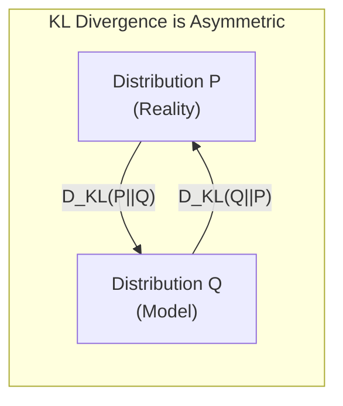

# Chapter 4: KL Divergence

## Intuition

Imagine you're a detective comparing two suspects' alibis. One claims to be at home (their story, Q), but evidence suggests they were at the crime scene (the truth, P). **KL divergence** measures how much the evidence contradicts the alibi—how "wrong" the suspect's story is compared to reality.

Formally, **Kullback-Leibler divergence** (also called relative entropy) measures the information lost when we use distribution Q to approximate distribution P. It quantifies the "distance" between two probability distributions—though, as we'll see, it's not a true distance metric.

### Real-World Analogies

**Compression Inefficiency:**
- Optimal code for English text uses word frequencies from English (P)
- Using frequencies from French (Q) to encode English wastes bits
- KL divergence = extra bits wasted

**Map vs Territory:**
- P is the actual terrain
- Q is your map
- KL divergence measures how much your map misleads you

**Model vs Reality:**
- P is how customers actually behave
- Q is what your recommendation model predicts
- High KL divergence = model doesn't understand customers

### Why This Matters for ML

KL divergence is everywhere in modern ML:
- **VAEs**: The regularization term is KL divergence to a prior
- **Knowledge distillation**: Match student distribution to teacher
- **Policy gradient**: Constrain policy updates (PPO, TRPO)
- **Bayesian inference**: Variational inference minimizes KL to posterior
- **Information bottleneck**: Trade-off between compression and prediction

Understanding KL divergence helps you grasp what these algorithms are really optimizing.

## Visual Explanation

### Asymmetry of KL Divergence



**Important**: $D_{KL}(P\|Q) \neq D_{KL}(Q\|P)$ in general!

### Visual: Forward vs Reverse KL

Consider fitting a single Gaussian Q to a mixture of two Gaussians P:

```
Forward KL: D_KL(P||Q) - "Mean-seeking"
        P (bimodal)          Q (fitted)
         __   __              ___
        /  \ /  \     →      /   \
       /    X    \          /     \
      /           \        /       \
    Fitted Q covers both modes (may be too wide)

Reverse KL: D_KL(Q||P) - "Mode-seeking"
        P (bimodal)          Q (fitted)
         __   __              __
        /  \ /  \     →      /  \
       /    X    \          /    \
      /           \
    Fitted Q locks onto one mode (ignores the other)
```

This asymmetry has profound implications for how different algorithms behave.

## Mathematical Foundation

### Definition: KL Divergence

For discrete distributions P and Q over the same support:

$$D_{KL}(P \| Q) = \sum_{x} P(x) \log \frac{P(x)}{Q(x)} = \mathbb{E}_{x \sim P}\left[\log \frac{P(x)}{Q(x)}\right]$$

Equivalently:
$$D_{KL}(P \| Q) = H(P, Q) - H(P)$$

KL divergence is cross-entropy minus entropy—the "extra bits" beyond the minimum.

### Properties of KL Divergence

1. **Non-negativity (Gibbs' inequality)**: $D_{KL}(P \| Q) \geq 0$
   - Zero if and only if P = Q almost everywhere

2. **Not symmetric**: $D_{KL}(P \| Q) \neq D_{KL}(Q \| P)$
   - Therefore, not a true distance metric

3. **Not satisfying triangle inequality**: Can have $D_{KL}(P \| R) > D_{KL}(P \| Q) + D_{KL}(Q \| R)$
   - Another reason it's not a metric

4. **Convexity**: $D_{KL}(P \| Q)$ is convex in the pair (P, Q)

5. **Invariance**: Under invertible transformations of the random variable

### Forward vs Reverse KL

**Forward KL**: $D_{KL}(P \| Q)$ — used when P is the data, Q is the model
- Penalizes Q heavily when Q(x) is small but P(x) is large
- "Zero-avoiding" or "mean-seeking"
- Q tries to cover all of P's support

**Reverse KL**: $D_{KL}(Q \| P)$ — used in variational inference
- Penalizes Q heavily when Q(x) is large but P(x) is small
- "Zero-forcing" or "mode-seeking"
- Q collapses onto high-probability regions of P

### KL Divergence for Gaussians

For two univariate Gaussians $P = \mathcal{N}(\mu_1, \sigma_1^2)$ and $Q = \mathcal{N}(\mu_2, \sigma_2^2)$:

$$D_{KL}(P \| Q) = \log \frac{\sigma_2}{\sigma_1} + \frac{\sigma_1^2 + (\mu_1 - \mu_2)^2}{2\sigma_2^2} - \frac{1}{2}$$

For multivariate Gaussians $P = \mathcal{N}(\boldsymbol{\mu}_1, \boldsymbol{\Sigma}_1)$ and $Q = \mathcal{N}(\boldsymbol{\mu}_2, \boldsymbol{\Sigma}_2)$:

$$D_{KL}(P \| Q) = \frac{1}{2}\left[\log \frac{|\boldsymbol{\Sigma}_2|}{|\boldsymbol{\Sigma}_1|} - d + \text{tr}(\boldsymbol{\Sigma}_2^{-1}\boldsymbol{\Sigma}_1) + (\boldsymbol{\mu}_2 - \boldsymbol{\mu}_1)^T \boldsymbol{\Sigma}_2^{-1}(\boldsymbol{\mu}_2 - \boldsymbol{\mu}_1)\right]$$

### VAE Loss: The ELBO

The VAE objective (Evidence Lower BOund):

$$\mathcal{L}_{ELBO} = \mathbb{E}_{q(z|x)}[\log p(x|z)] - D_{KL}(q(z|x) \| p(z))$$

- First term: Reconstruction quality
- Second term: KL divergence between approximate posterior and prior (usually $\mathcal{N}(0, I)$)

## Code Example

```python
import numpy as np
import matplotlib.pyplot as plt
from scipy.stats import entropy, norm
from scipy.special import kl_div

def kl_divergence(p, q, epsilon=1e-15):
    """
    Calculate KL divergence D_KL(P || Q) for discrete distributions.

    Parameters:
    -----------
    p : array-like
        True/reference distribution
    q : array-like
        Approximate/model distribution
    epsilon : float
        Small value to prevent division by zero

    Returns:
    --------
    float : KL divergence value
    """
    p = np.asarray(p, dtype=float)
    q = np.asarray(q, dtype=float)

    # Ensure proper distributions
    p = p / p.sum()
    q = q / q.sum()

    # Add epsilon to prevent log(0)
    q = np.clip(q, epsilon, 1)

    # Only sum where p > 0 (0 * log(0/q) = 0 by convention)
    mask = p > 0
    return np.sum(p[mask] * np.log(p[mask] / q[mask]))

def kl_divergence_gaussians(mu1, sigma1, mu2, sigma2):
    """
    KL divergence between two univariate Gaussians.
    D_KL(N(mu1, sigma1^2) || N(mu2, sigma2^2))
    """
    return (np.log(sigma2 / sigma1) +
            (sigma1**2 + (mu1 - mu2)**2) / (2 * sigma2**2) -
            0.5)

# Example 1: Basic KL divergence
print("=== KL Divergence Basics ===\n")

# True distribution (e.g., fair die)
p_fair = np.array([1/6] * 6)

# Various model distributions
models = {
    "Perfect match": [1/6] * 6,
    "Slightly biased": [0.2, 0.2, 0.15, 0.15, 0.15, 0.15],
    "Heavily biased": [0.4, 0.3, 0.15, 0.1, 0.03, 0.02],
    "Uniform over 3": [1/3, 1/3, 1/3, 0, 0, 0],  # Missing support!
}

print("True distribution (fair die): [1/6, 1/6, 1/6, 1/6, 1/6, 1/6]\n")
for name, q in models.items():
    q = np.array(q)
    kl_pq = kl_divergence(p_fair, q)
    kl_qp = kl_divergence(q, p_fair) if not np.any(q == 0) else float('inf')

    print(f"{name}:")
    print(f"  Q = {[f'{x:.3f}' for x in q]}")
    print(f"  D_KL(P || Q) = {kl_pq:.4f} nats")
    if kl_qp != float('inf'):
        print(f"  D_KL(Q || P) = {kl_qp:.4f} nats")
        print(f"  Asymmetry: {abs(kl_pq - kl_qp):.4f}")
    else:
        print(f"  D_KL(Q || P) = inf (Q has zeros where P > 0)")
    print()

# Example 2: Demonstrate asymmetry
print("=== KL Divergence Asymmetry ===\n")

p = np.array([0.9, 0.1])
q = np.array([0.1, 0.9])

kl_pq = kl_divergence(p, q)
kl_qp = kl_divergence(q, p)

print(f"P = [0.9, 0.1]")
print(f"Q = [0.1, 0.9]")
print(f"D_KL(P || Q) = {kl_pq:.4f} nats")
print(f"D_KL(Q || P) = {kl_qp:.4f} nats")
print(f"They're equal here because the distributions are 'mirror images'")

p2 = np.array([0.7, 0.3])
q2 = np.array([0.3, 0.5, 0.2])  # Different support size

# For demonstration, let's use same support
p3 = np.array([0.6, 0.3, 0.1])
q3 = np.array([0.1, 0.3, 0.6])

kl_p3q3 = kl_divergence(p3, q3)
kl_q3p3 = kl_divergence(q3, p3)

print(f"\nP = [0.6, 0.3, 0.1]")
print(f"Q = [0.1, 0.3, 0.6]")
print(f"D_KL(P || Q) = {kl_p3q3:.4f} nats")
print(f"D_KL(Q || P) = {kl_q3p3:.4f} nats")
print(f"Asymmetry demonstrated: difference = {abs(kl_p3q3 - kl_q3p3):.4f}")

# Example 3: KL between Gaussians
print("\n=== KL Divergence: Gaussians ===\n")

gaussian_pairs = [
    ((0, 1), (0, 1), "Same distributions"),
    ((0, 1), (1, 1), "Different means"),
    ((0, 1), (0, 2), "Different variances"),
    ((0, 1), (2, 0.5), "Both different"),
]

for (mu1, s1), (mu2, s2), description in gaussian_pairs:
    kl = kl_divergence_gaussians(mu1, s1, mu2, s2)
    kl_rev = kl_divergence_gaussians(mu2, s2, mu1, s1)
    print(f"{description}:")
    print(f"  N({mu1}, {s1}^2) vs N({mu2}, {s2}^2)")
    print(f"  D_KL(P || Q) = {kl:.4f}")
    print(f"  D_KL(Q || P) = {kl_rev:.4f}\n")

# Example 4: Visualize forward vs reverse KL
print("=== Forward vs Reverse KL Visualization ===\n")

fig, axes = plt.subplots(1, 3, figsize=(15, 4))

x = np.linspace(-5, 5, 1000)

# True distribution: mixture of two Gaussians
p_mixture = 0.5 * norm.pdf(x, -2, 0.7) + 0.5 * norm.pdf(x, 2, 0.7)
p_mixture = p_mixture / np.trapz(p_mixture, x)  # Normalize

# Approximations
q_forward = norm.pdf(x, 0, 2.5)  # Wide Gaussian (mean-seeking)
q_forward = q_forward / np.trapz(q_forward, x)

q_reverse = norm.pdf(x, -2, 0.7)  # Narrow, at one mode (mode-seeking)
q_reverse = q_reverse / np.trapz(q_reverse, x)

# Plot 1: True distribution
axes[0].fill_between(x, p_mixture, alpha=0.5, color='blue', label='True P (bimodal)')
axes[0].set_title('True Distribution P', fontsize=12)
axes[0].set_xlabel('x')
axes[0].set_ylabel('Density')
axes[0].legend()
axes[0].grid(True, alpha=0.3)

# Plot 2: Forward KL (mean-seeking)
axes[1].fill_between(x, p_mixture, alpha=0.3, color='blue', label='True P')
axes[1].plot(x, q_forward, 'r-', linewidth=2, label='Fitted Q')
axes[1].set_title('Forward KL: Mean-Seeking\nQ covers both modes', fontsize=12)
axes[1].set_xlabel('x')
axes[1].legend()
axes[1].grid(True, alpha=0.3)

# Plot 3: Reverse KL (mode-seeking)
axes[2].fill_between(x, p_mixture, alpha=0.3, color='blue', label='True P')
axes[2].plot(x, q_reverse, 'r-', linewidth=2, label='Fitted Q')
axes[2].set_title('Reverse KL: Mode-Seeking\nQ locks onto one mode', fontsize=12)
axes[2].set_xlabel('x')
axes[2].legend()
axes[2].grid(True, alpha=0.3)

plt.tight_layout()
plt.savefig('forward_vs_reverse_kl.png', dpi=150)
plt.show()

# Example 5: VAE loss components
print("=== VAE Loss: KL Term ===\n")

def kl_divergence_vae(mu, log_var):
    """
    KL divergence between N(mu, exp(log_var)) and N(0, 1).
    Used as regularization in VAEs.

    Returns per-sample KL divergence.
    """
    # D_KL(N(mu, sigma^2) || N(0, 1))
    # = 0.5 * (sigma^2 + mu^2 - 1 - log(sigma^2))
    return 0.5 * (np.exp(log_var) + mu**2 - 1 - log_var)

# Simulated encoder outputs
latent_samples = [
    (0.0, 0.0, "Perfect match to prior"),
    (1.0, 0.0, "Shifted mean"),
    (0.0, 1.0, "Larger variance"),
    (2.0, -0.5, "Shifted mean, smaller variance"),
]

print("KL divergence from encoder q(z|x) to prior N(0,1):\n")
for mu, log_var, description in latent_samples:
    kl = kl_divergence_vae(mu, log_var)
    sigma = np.exp(0.5 * log_var)
    print(f"{description}:")
    print(f"  mu = {mu:.2f}, sigma = {sigma:.2f}")
    print(f"  KL = {kl:.4f} nats\n")

# Example 6: KL in knowledge distillation
print("=== Knowledge Distillation: KL Between Softmax Outputs ===\n")

def softmax(logits, temperature=1.0):
    """Softmax with temperature."""
    logits = logits / temperature
    exp_logits = np.exp(logits - np.max(logits))
    return exp_logits / exp_logits.sum()

# Teacher model outputs (well-trained, confident)
teacher_logits = np.array([5.0, 2.0, 0.5])
teacher_probs = softmax(teacher_logits)

# Student model outputs (learning)
student_logits = np.array([2.0, 1.5, 1.0])
student_probs = softmax(student_logits)

# Temperature-scaled versions
T = 3.0
teacher_soft = softmax(teacher_logits, T)
student_soft = softmax(student_logits, T)

print("Hard targets (T=1):")
print(f"  Teacher: {[f'{p:.3f}' for p in teacher_probs]}")
print(f"  Student: {[f'{p:.3f}' for p in student_probs]}")
print(f"  KL(Teacher || Student) = {kl_divergence(teacher_probs, student_probs):.4f}")

print(f"\nSoft targets (T={T}):")
print(f"  Teacher: {[f'{p:.3f}' for p in teacher_soft]}")
print(f"  Student: {[f'{p:.3f}' for p in student_soft]}")
print(f"  KL(Teacher || Student) = {kl_divergence(teacher_soft, student_soft):.4f}")
print("\nSofter targets reveal more information about class relationships!")

# Example 7: Verify with scipy
print("\n=== Verification with SciPy ===")
p_test = np.array([0.3, 0.5, 0.2])
q_test = np.array([0.25, 0.5, 0.25])

our_kl = kl_divergence(p_test, q_test)
scipy_kl = entropy(p_test, q_test)  # scipy.stats.entropy computes KL when given two args

print(f"Our implementation: {our_kl:.6f}")
print(f"SciPy entropy (KL): {scipy_kl:.6f}")
print(f"Match: {np.isclose(our_kl, scipy_kl)}")
```

**Output:**
```
=== KL Divergence Basics ===

True distribution (fair die): [1/6, 1/6, 1/6, 1/6, 1/6, 1/6]

Perfect match:
  Q = ['0.167', '0.167', '0.167', '0.167', '0.167', '0.167']
  D_KL(P || Q) = 0.0000 nats

Slightly biased:
  Q = ['0.200', '0.200', '0.150', '0.150', '0.150', '0.150']
  D_KL(P || Q) = 0.0139 nats
  D_KL(Q || P) = 0.0141 nats
  Asymmetry: 0.0002

Heavily biased:
  Q = ['0.400', '0.300', '0.150', '0.100', '0.030', '0.020']
  D_KL(P || Q) = 0.4389 nats

=== VAE Loss: KL Term ===

KL divergence from encoder q(z|x) to prior N(0,1):

Perfect match to prior:
  mu = 0.00, sigma = 1.00
  KL = 0.0000 nats

Shifted mean:
  mu = 1.00, sigma = 1.00
  KL = 0.5000 nats

Larger variance:
  mu = 0.00, sigma = 1.65
  KL = 0.6065 nats
```

## ML Relevance

### Variational Autoencoders (VAEs)

The VAE loss explicitly includes KL divergence:

$$\mathcal{L} = \underbrace{-\mathbb{E}_{q(z|x)}[\log p(x|z)]}_{\text{Reconstruction loss}} + \underbrace{D_{KL}(q(z|x) \| p(z))}_{\text{KL regularization}}$$

The KL term pushes the learned latent distribution toward the prior, enabling generation.

### Variational Inference

In Bayesian ML, we approximate intractable posteriors:

$$q^*(z) = \arg\min_q D_{KL}(q(z) \| p(z|x))$$

This is equivalent to maximizing the ELBO.

### Policy Optimization (PPO, TRPO)

Constrain policy updates using KL divergence:

$$\max_\theta \mathbb{E}\left[\frac{\pi_\theta(a|s)}{\pi_{\theta_{old}}(a|s)} A(s, a)\right] \quad \text{s.t.} \quad D_{KL}(\pi_{\theta_{old}} \| \pi_\theta) \leq \delta$$

This prevents catastrophically large policy changes.

### Knowledge Distillation

Transfer knowledge from teacher to student:

$$\mathcal{L} = (1-\alpha) \cdot CE(y, p_s) + \alpha \cdot T^2 \cdot D_{KL}(p_t^{(T)} \| p_s^{(T)})$$

Where $p^{(T)}$ are temperature-softened probabilities.

### Information Bottleneck

Trade off compression and prediction:

$$\min_{q(z|x)} D_{KL}(q(z|x) \| r(z)) - \beta \cdot I(Z; Y)$$

## When to Use / Ignore

### When to Use KL Divergence

- **VAE training**: The standard regularization term
- **Distribution matching**: When you need to compare probability distributions
- **Variational inference**: Approximating posteriors
- **Policy constraints**: Limiting update sizes in RL
- **Model comparison**: Which model better fits the data?

### When to Consider Alternatives

- **Need a true metric?** Use Jensen-Shannon divergence (symmetric) or Wasserstein distance
- **Distributions have disjoint support?** KL can be infinite; use JS divergence or optimal transport
- **Mode collapse issues?** Consider reverse KL or other divergences
- **Training GANs?** Original GAN uses JS divergence; Wasserstein GAN uses optimal transport

### Common Pitfalls

1. **Infinite KL**: Occurs when Q(x) = 0 but P(x) > 0. Always smooth or clip.
2. **Direction confusion**: $D_{KL}(P\|Q)$ vs $D_{KL}(Q\|P)$ have very different behaviors
3. **Not a metric**: Can't use triangle inequality reasoning
4. **Numerical issues**: Log of small numbers; use log-sum-exp tricks

```python
# WRONG: Can produce inf
kl = np.sum(p * np.log(p / q))  # q might be 0!

# RIGHT: Clip or smooth
q_safe = np.clip(q, 1e-10, 1)
kl = np.sum(p * np.log(p / q_safe))
```

## Exercises

### Exercise 1: KL Divergence Calculation
**Problem**: Calculate $D_{KL}(P \| Q)$ for P = [0.25, 0.25, 0.5] and Q = [0.5, 0.25, 0.25].

**Solution**:
```python
import numpy as np

P = np.array([0.25, 0.25, 0.5])
Q = np.array([0.5, 0.25, 0.25])

kl = np.sum(P * np.log(P / Q))
print(f"D_KL(P || Q) = {kl:.4f} nats")
# = 0.25 * log(0.5) + 0.25 * log(1) + 0.5 * log(2)
# = 0.25 * (-0.693) + 0 + 0.5 * (0.693)
# = -0.173 + 0.347 = 0.173 nats
```

### Exercise 2: VAE KL Term
**Problem**: In a VAE, your encoder outputs mu=0.5 and log_var=-0.5 for a sample. Calculate the KL divergence to the standard normal prior.

**Solution**:
```python
mu = 0.5
log_var = -0.5
sigma_sq = np.exp(log_var)

# D_KL(N(mu, sigma^2) || N(0, 1)) = 0.5 * (sigma^2 + mu^2 - 1 - log(sigma^2))
kl = 0.5 * (sigma_sq + mu**2 - 1 - log_var)
print(f"KL = {kl:.4f} nats")  # ≈ 0.178 nats
```

### Exercise 3: Forward vs Reverse KL
**Problem**: You're fitting a unimodal Gaussian to a bimodal mixture. Explain qualitatively what happens with forward KL vs reverse KL minimization.

**Solution**:
- **Forward KL** $D_{KL}(P_{bimodal} \| Q_{unimodal})$: Penalizes Q when it assigns low probability to regions where P is high. Result: Q becomes wide to cover both modes. The fitted Gaussian will have mean between the modes and large variance.

- **Reverse KL** $D_{KL}(Q_{unimodal} \| P_{bimodal})$: Penalizes Q when it assigns high probability to regions where P is low. Result: Q collapses onto one mode to avoid the valley. The fitted Gaussian will match one mode closely.

Forward KL is "inclusive" (tries to cover everything), while reverse KL is "exclusive" (focuses on what it can model well).

## Summary

- **KL divergence** measures information lost when using Q to approximate P: $D_{KL}(P\|Q) = \sum P(x) \log \frac{P(x)}{Q(x)}$
- **Non-negative**: Always $\geq 0$, equals 0 only when P = Q
- **Asymmetric**: $D_{KL}(P\|Q) \neq D_{KL}(Q\|P)$ — this has major practical implications
- **Forward KL** (mean-seeking): Q tries to cover all of P's support
- **Reverse KL** (mode-seeking): Q collapses onto high-probability regions of P
- **ML applications**: VAE regularization, variational inference, policy gradients, knowledge distillation
- **Relationship**: $D_{KL}(P\|Q) = H(P, Q) - H(P)$ — the extra bits beyond entropy
- **Caution**: Can be infinite when supports don't match

KL divergence completes our information theory toolkit. Together with entropy and cross-entropy, these concepts form the mathematical backbone of modern machine learning—from the loss functions you use daily to the cutting-edge generative models pushing the boundaries of AI.

---

## Conclusion: The Information Theory Toolkit

You now have four fundamental tools:

| Concept | Formula | Measures | ML Use |
|---------|---------|----------|--------|
| Self-Information | $-\log P(x)$ | Surprise of event | Per-sample loss |
| Entropy | $-\sum P(x) \log P(x)$ | Average uncertainty | Confidence, exploration |
| Cross-Entropy | $-\sum P(x) \log Q(x)$ | Model fit to data | Classification loss |
| KL Divergence | $\sum P(x) \log \frac{P(x)}{Q(x)}$ | Distribution distance | VAE, distillation, RL |

These build on each other:
- Entropy = Expected self-information
- Cross-entropy = Entropy + KL divergence
- KL divergence = Cross-entropy - Entropy

Master these, and you'll have deep insight into what your ML models are really optimizing.
