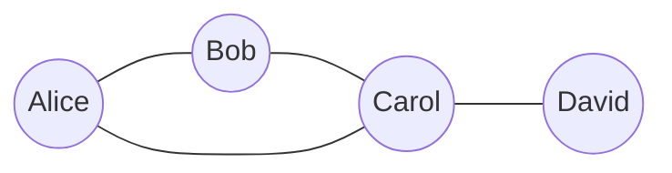
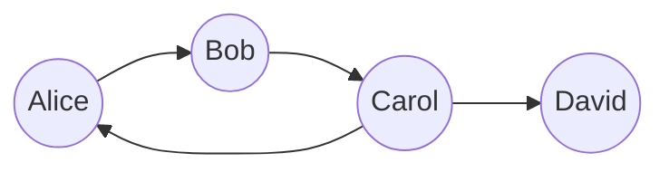

# Chapter 1: Graph Basics

## Intuition

### What is a Graph?

Imagine a social network like LinkedIn. Every person is a point, and every connection between two people is a line linking those points. That's a graph! More formally, a graph is a collection of **nodes** (also called vertices) connected by **edges** (also called links).

Graphs are everywhere:
- **Road networks**: Intersections are nodes, roads are edges
- **The Internet**: Websites are nodes, hyperlinks are edges
- **Your brain**: Neurons are nodes, synapses are edges
- **Molecules**: Atoms are nodes, chemical bonds are edges

### Why Graphs Matter for ML

Traditional machine learning treats each data point independently. But what if the *relationships* between data points contain valuable information?

Consider recommending movies to users. Instead of just looking at individual user preferences, we can model the entire user-movie interaction as a graph. Users who watch similar movies are implicitly connected, and this graph structure helps us make better predictions.

**Key insight**: Graphs let us model relationships, and relationships often contain more signal than individual features.

## Visual Explanation

### A Simple Graph



This graph has:
- **4 nodes**: Alice, Bob, Carol, David
- **4 edges**: Alice-Bob, Bob-Carol, Alice-Carol, Carol-David

### Directed Graph (Digraph)



In a directed graph, edges have direction. Alice follows Bob, but Bob doesn't necessarily follow Alice back. This is like Twitter follows versus Facebook friendships.

### Graph as a Matrix

We can represent a graph as an **adjacency matrix** $A$:

$$A_{ij} = \begin{cases} 1 & \text{if there's an edge from node } i \text{ to node } j \\ 0 & \text{otherwise} \end{cases}$$

For our undirected example with nodes Alice(0), Bob(1), Carol(2), David(3):

$$A = \begin{bmatrix} 0 & 1 & 1 & 0 \\ 1 & 0 & 1 & 0 \\ 1 & 1 & 0 & 1 \\ 0 & 0 & 1 & 0 \end{bmatrix}$$

Notice that for undirected graphs, the matrix is **symmetric**: $A_{ij} = A_{ji}$.

## Mathematical Foundation

### Formal Definitions

**Definition (Graph)**: A graph $G$ is an ordered pair $G = (V, E)$ where:
- $V$ is a set of **vertices** (nodes)
- $E$ is a set of **edges**, where each edge connects two vertices

**Definition (Undirected Graph)**: An edge $e \in E$ is an unordered pair $\{u, v\}$ where $u, v \in V$. The edge $\{u, v\}$ is the same as $\{v, u\}$.

**Definition (Directed Graph)**: An edge $e \in E$ is an ordered pair $(u, v)$ where $u, v \in V$. The edge $(u, v)$ goes *from* $u$ *to* $v$, and is different from $(v, u)$.

**Definition (Weighted Graph)**: Each edge has an associated weight $w(e) \in \mathbb{R}$. Represented as $G = (V, E, W)$.

### Graph Representations

#### 1. Adjacency Matrix

For a graph with $n$ nodes, the adjacency matrix $A$ is an $n \times n$ matrix:

**Undirected graph**:
$$A_{ij} = A_{ji} = \begin{cases} 1 & \text{if } \{i, j\} \in E \\ 0 & \text{otherwise} \end{cases}$$

**Directed graph**:
$$A_{ij} = \begin{cases} 1 & \text{if } (i, j) \in E \\ 0 & \text{otherwise} \end{cases}$$

**Weighted graph**:
$$A_{ij} = \begin{cases} w(i, j) & \text{if } (i, j) \in E \\ 0 & \text{otherwise} \end{cases}$$

**Properties**:
- Space complexity: $O(n^2)$
- Edge lookup: $O(1)$
- Finding all neighbors: $O(n)$
- Best for: Dense graphs, matrix operations (GNNs!)

#### 2. Adjacency List

Each node maintains a list of its neighbors:

$$\text{adj}[v] = \{u \in V : (v, u) \in E\}$$

**Properties**:
- Space complexity: $O(n + m)$ where $m = |E|$
- Edge lookup: $O(\text{degree}(v))$
- Finding all neighbors: $O(\text{degree}(v))$
- Best for: Sparse graphs, graph traversal

### Edge List

Simply a list of all edges:

$$E = [(u_1, v_1), (u_2, v_2), \ldots, (u_m, v_m)]$$

This is often the most compact representation and is commonly used for storing graphs in files.

## Code Example

```python
import numpy as np
from collections import defaultdict

class Graph:
    """
    A graph implementation supporting both adjacency matrix and adjacency list.
    """

    def __init__(self, num_nodes, directed=False):
        """
        Initialize a graph.

        Args:
            num_nodes: Number of nodes in the graph
            directed: If True, creates a directed graph
        """
        self.num_nodes = num_nodes
        self.directed = directed

        # Adjacency matrix representation
        self.adj_matrix = np.zeros((num_nodes, num_nodes), dtype=int)

        # Adjacency list representation
        self.adj_list = defaultdict(list)

        # Edge list
        self.edges = []

    def add_edge(self, u, v, weight=1):
        """Add an edge from node u to node v."""
        # Update adjacency matrix
        self.adj_matrix[u][v] = weight

        # Update adjacency list
        self.adj_list[u].append(v)

        # Add to edge list
        self.edges.append((u, v, weight))

        # For undirected graphs, add the reverse edge
        if not self.directed:
            self.adj_matrix[v][u] = weight
            self.adj_list[v].append(u)

    def has_edge(self, u, v):
        """Check if an edge exists from u to v."""
        return self.adj_matrix[u][v] != 0

    def get_neighbors(self, v):
        """Get all neighbors of node v."""
        return self.adj_list[v]

    def get_adjacency_matrix(self):
        """Return the adjacency matrix."""
        return self.adj_matrix

    def __str__(self):
        """String representation of the graph."""
        graph_type = "Directed" if self.directed else "Undirected"
        return f"{graph_type} Graph with {self.num_nodes} nodes and {len(self.edges)} edges"


# Example: Create a social network graph
def create_social_network():
    """
    Create a simple social network:
    Alice(0) -- Bob(1) -- Carol(2) -- David(3)
         \      /
          \----/
    """
    # Undirected graph with 4 nodes
    g = Graph(num_nodes=4, directed=False)

    # Node mapping for readability
    ALICE, BOB, CAROL, DAVID = 0, 1, 2, 3
    names = {0: "Alice", 1: "Bob", 2: "Carol", 3: "David"}

    # Add friendships
    g.add_edge(ALICE, BOB)    # Alice is friends with Bob
    g.add_edge(BOB, CAROL)    # Bob is friends with Carol
    g.add_edge(ALICE, CAROL)  # Alice is friends with Carol
    g.add_edge(CAROL, DAVID)  # Carol is friends with David

    print(g)
    print("\nAdjacency Matrix:")
    print(g.get_adjacency_matrix())

    print("\nNeighbors:")
    for node in range(4):
        neighbors = [names[n] for n in g.get_neighbors(node)]
        print(f"  {names[node]}'s friends: {neighbors}")

    return g


# Example: Create a directed graph (like Twitter follows)
def create_twitter_follows():
    """
    Create a Twitter-like follow graph:
    Alice --> Bob --> Carol --> David
               ^        |
               |--------|
    """
    g = Graph(num_nodes=4, directed=True)

    ALICE, BOB, CAROL, DAVID = 0, 1, 2, 3
    names = {0: "Alice", 1: "Bob", 2: "Carol", 3: "David"}

    g.add_edge(ALICE, BOB)    # Alice follows Bob
    g.add_edge(BOB, CAROL)    # Bob follows Carol
    g.add_edge(CAROL, BOB)    # Carol follows Bob (mutual)
    g.add_edge(CAROL, DAVID)  # Carol follows David

    print(g)
    print("\nAdjacency Matrix:")
    print(g.get_adjacency_matrix())

    # Note the asymmetry for directed graphs
    print(f"\nDoes Alice follow Bob? {g.has_edge(ALICE, BOB)}")
    print(f"Does Bob follow Alice? {g.has_edge(BOB, ALICE)}")

    return g


# Example: Weighted graph (distances between cities)
def create_city_network():
    """
    Create a weighted graph representing distances between cities.
    """
    g = Graph(num_nodes=4, directed=False)

    NYC, LA, CHI, HOU = 0, 1, 2, 3
    cities = {0: "NYC", 1: "LA", 2: "Chicago", 3: "Houston"}

    # Approximate distances in hundreds of miles
    g.add_edge(NYC, CHI, weight=8)    # NYC to Chicago: ~800 miles
    g.add_edge(NYC, HOU, weight=16)   # NYC to Houston: ~1600 miles
    g.add_edge(CHI, LA, weight=20)    # Chicago to LA: ~2000 miles
    g.add_edge(CHI, HOU, weight=10)   # Chicago to Houston: ~1000 miles
    g.add_edge(LA, HOU, weight=15)    # LA to Houston: ~1500 miles

    print("City Network (weights = distance in 100s of miles):")
    print(g.get_adjacency_matrix())

    return g


if __name__ == "__main__":
    print("=" * 50)
    print("SOCIAL NETWORK (Undirected Graph)")
    print("=" * 50)
    create_social_network()

    print("\n" + "=" * 50)
    print("TWITTER FOLLOWS (Directed Graph)")
    print("=" * 50)
    create_twitter_follows()

    print("\n" + "=" * 50)
    print("CITY DISTANCES (Weighted Graph)")
    print("=" * 50)
    create_city_network()
```

**Output:**
```
==================================================
SOCIAL NETWORK (Undirected Graph)
==================================================
Undirected Graph with 4 nodes and 4 edges

Adjacency Matrix:
[[0 1 1 0]
 [1 0 1 0]
 [1 1 0 1]
 [0 0 1 0]]

Neighbors:
  Alice's friends: ['Bob', 'Carol']
  Bob's friends: ['Alice', 'Carol']
  Carol's friends: ['Bob', 'Alice', 'David']
  David's friends: ['Carol']

==================================================
TWITTER FOLLOWS (Directed Graph)
==================================================
Directed Graph with 4 nodes and 4 edges

Adjacency Matrix:
[[0 1 0 0]
 [0 0 1 0]
 [0 1 0 1]
 [0 0 0 0]]

Does Alice follow Bob? True
Does Bob follow Alice? False
```

## ML Relevance

### Graph Neural Networks (GNNs)

The adjacency matrix is central to GNNs. The core operation in most GNNs is **message passing**, which can be written as matrix multiplication:

$$H^{(l+1)} = \sigma(\tilde{A} H^{(l)} W^{(l)})$$

Where:
- $\tilde{A}$ is a normalized adjacency matrix
- $H^{(l)}$ is the node feature matrix at layer $l$
- $W^{(l)}$ is a learnable weight matrix
- $\sigma$ is a nonlinear activation function

### Knowledge Graphs

Knowledge graphs store facts as directed edges:
```
(Albert_Einstein, born_in, Germany)
(Albert_Einstein, field, Physics)
```

These are used in:
- Google's Knowledge Graph
- Amazon's product graph
- Medical ontologies

### Recommendation Systems

User-item interactions form a bipartite graph:
- Users and items are two types of nodes
- Edges represent interactions (purchases, views, ratings)

Graph-based collaborative filtering leverages this structure for better recommendations.

## When to Use / Ignore

### Use Graphs When:
- **Data has natural relationships**: Social networks, molecules, citations
- **Relationships matter more than features**: Link prediction, community detection
- **Data is non-Euclidean**: Cannot be easily represented as vectors
- **You need to propagate information**: Influence, infection, information spread

### Avoid Graphs When:
- **Data is truly independent**: Standard tabular data with no relationships
- **Relationships are fully captured by features**: No additional structure needed
- **Computational constraints**: Dense graphs can be expensive
- **Simpler methods work**: Don't add complexity unnecessarily

### Common Pitfalls

1. **Memory explosion**: Adjacency matrices scale as $O(n^2)$. For a million nodes, that's a trillion entries!

2. **Ignoring directionality**: Using an undirected representation when direction matters (e.g., follower vs following)

3. **Self-loops**: Some algorithms require self-loops (diagonal of adjacency matrix = 1), others don't

4. **Disconnected components**: Your algorithm might not reach all nodes if the graph is disconnected

## Exercises

### Exercise 1: Building an Adjacency Matrix

**Problem**: Given the following edge list for a directed graph with 5 nodes, construct the adjacency matrix:
```
edges = [(0,1), (0,2), (1,2), (2,3), (3,4), (4,0)]
```

**Solution**:
```python
import numpy as np

def edge_list_to_adj_matrix(edges, num_nodes):
    adj_matrix = np.zeros((num_nodes, num_nodes), dtype=int)
    for u, v in edges:
        adj_matrix[u][v] = 1
    return adj_matrix

edges = [(0,1), (0,2), (1,2), (2,3), (3,4), (4,0)]
A = edge_list_to_adj_matrix(edges, 5)
print(A)
# Output:
# [[0 1 1 0 0]
#  [0 0 1 0 0]
#  [0 0 0 1 0]
#  [0 0 0 0 1]
#  [1 0 0 0 0]]
```

### Exercise 2: Symmetric Check

**Problem**: Write a function to check if a graph is undirected by verifying matrix symmetry.

**Solution**:
```python
def is_undirected(adj_matrix):
    """Check if a graph is undirected (symmetric adjacency matrix)."""
    return np.allclose(adj_matrix, adj_matrix.T)

# Test with undirected graph
undirected = np.array([[0, 1, 1], [1, 0, 1], [1, 1, 0]])
print(f"Undirected check: {is_undirected(undirected)}")  # True

# Test with directed graph
directed = np.array([[0, 1, 0], [0, 0, 1], [1, 0, 0]])
print(f"Directed check: {is_undirected(directed)}")  # False
```

### Exercise 3: Convert Representations

**Problem**: Convert an adjacency list to an adjacency matrix.

**Solution**:
```python
def adj_list_to_matrix(adj_list, num_nodes):
    """Convert adjacency list to adjacency matrix."""
    matrix = np.zeros((num_nodes, num_nodes), dtype=int)
    for node, neighbors in adj_list.items():
        for neighbor in neighbors:
            matrix[node][neighbor] = 1
    return matrix

# Example adjacency list
adj_list = {
    0: [1, 2],
    1: [0, 2],
    2: [0, 1, 3],
    3: [2]
}

matrix = adj_list_to_matrix(adj_list, 4)
print(matrix)
# Output:
# [[0 1 1 0]
#  [1 0 1 0]
#  [1 1 0 1]
#  [0 0 1 0]]
```

## Summary

### Key Takeaways

- **Graphs consist of nodes and edges** that represent entities and their relationships

- **Undirected graphs** have symmetric relationships (friendships), while **directed graphs** have asymmetric ones (follows)

- **Adjacency matrices** are ideal for dense graphs and matrix operations (GNNs), with $O(n^2)$ space

- **Adjacency lists** are ideal for sparse graphs and traversals, with $O(n + m)$ space

- **The adjacency matrix is the foundation of Graph Neural Networks**, enabling efficient message passing through matrix multiplication

- **Choose your representation wisely**: The right choice depends on your graph's density and the operations you need

### Looking Ahead

In the next chapter, we'll explore **graph properties** like degree, paths, cycles, and connectivity. These concepts are essential for understanding graph structure and form the basis for more advanced algorithms.
