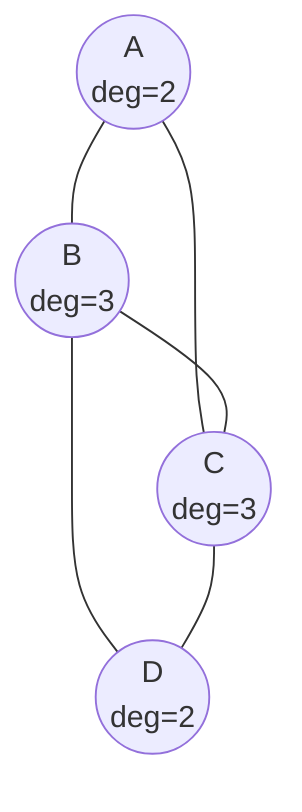
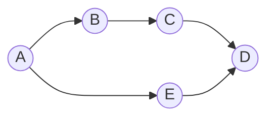
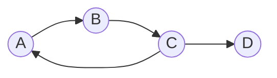
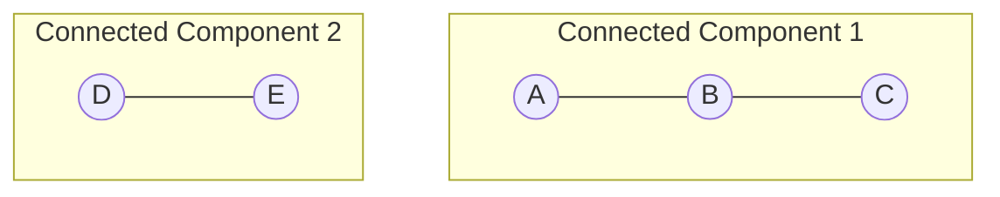

# Chapter 2: Graph Properties

## Intuition

### Understanding Graph Structure

Imagine you're analyzing a social network. You might ask questions like:
- Who has the most friends? (Degree)
- How can Alice reach David through mutual friends? (Paths)
- Are there groups that only talk to each other? (Connectivity)
- Can information spread in circles? (Cycles)

These structural properties help us understand and analyze graphs. In machine learning, they become features, constraints, or objectives that guide our algorithms.

### Real-World Analogies

**Degree** is like popularity—how many connections someone has. In a citation network, highly cited papers have high in-degree.

**Paths** are like directions from point A to B. The shortest path is the minimum number of hops needed.

**Cycles** are circular dependencies. In a web graph, cycles let you browse in circles. In a dependency graph, cycles can cause infinite loops.

**Connectivity** tells us if everyone can reach everyone else. A disconnected social network means some people are completely isolated from others.

## Visual Explanation

### Degree Visualization



Node B and C have the highest degree (3 connections each), making them potential "hubs" or influencers.

### Paths and Shortest Paths



Two paths from A to D:
- A → B → C → D (length 3)
- A → E → D (length 2) ← **Shortest path**

### Cycles



The sequence A → B → C → A forms a **cycle** of length 3.

### Connected vs Disconnected Graphs



This graph has two **connected components**. Nodes in different components cannot reach each other.

## Mathematical Foundation

### Degree

**Definition (Degree)**: The degree of a vertex $v$, denoted $\deg(v)$, is the number of edges incident to $v$.

For undirected graphs using adjacency matrix $A$:
$$\deg(v) = \sum_{u \in V} A_{vu} = \sum_{u \in V} A_{uv}$$

For directed graphs, we distinguish:
- **In-degree**: $\deg^{-}(v) = \sum_{u \in V} A_{uv}$ (edges coming in)
- **Out-degree**: $\deg^{+}(v) = \sum_{u \in V} A_{vu}$ (edges going out)

**Handshaking Lemma**: In any undirected graph:
$$\sum_{v \in V} \deg(v) = 2|E|$$

This is because each edge contributes to the degree of exactly two vertices.

**Degree Matrix**: A diagonal matrix $D$ where $D_{ii} = \deg(v_i)$:

$$D = \begin{bmatrix} \deg(v_1) & 0 & \cdots & 0 \\ 0 & \deg(v_2) & \cdots & 0 \\ \vdots & \vdots & \ddots & \vdots \\ 0 & 0 & \cdots & \deg(v_n) \end{bmatrix}$$

### Paths

**Definition (Path)**: A path from $v_0$ to $v_k$ is a sequence of vertices $v_0, v_1, \ldots, v_k$ such that $(v_{i-1}, v_i) \in E$ for all $i \in \{1, \ldots, k\}$.

**Definition (Path Length)**: The number of edges in a path. For unweighted graphs, this equals the number of hops.

**Definition (Shortest Path)**: A path with minimum length between two vertices. Denoted $d(u, v)$ for distance from $u$ to $v$.

**Path Counting with Matrices**: The number of paths of length $k$ from vertex $i$ to vertex $j$ equals $(A^k)_{ij}$.

$$\text{paths of length } k \text{ from } i \text{ to } j = (A^k)_{ij}$$

This is a powerful result used in GNNs, where $k$ layers of message passing aggregate information from $k$-hop neighbors.

### Cycles

**Definition (Cycle)**: A path where the first and last vertices are the same: $v_0 = v_k$.

**Definition (Acyclic Graph)**: A graph with no cycles. Directed acyclic graphs (DAGs) are especially important.

**Cycle Detection**: A graph has a cycle if and only if DFS encounters a back edge (an edge to an already-visited vertex in the current path).

**Girth**: The length of the shortest cycle in a graph. Trees have infinite girth (no cycles).

### Connectivity

**Definition (Connected Graph)**: An undirected graph is connected if there exists a path between every pair of vertices.

**Definition (Connected Component)**: A maximal connected subgraph. Every vertex belongs to exactly one connected component.

**Definition (Strongly Connected)**: A directed graph is strongly connected if there's a directed path from every vertex to every other vertex.

**Definition (Weakly Connected)**: A directed graph is weakly connected if the underlying undirected graph (ignoring edge directions) is connected.

**Graph Laplacian**: Defined as $L = D - A$, where $D$ is the degree matrix. Properties:
- $L$ is symmetric positive semi-definite
- The number of zero eigenvalues equals the number of connected components
- Used in spectral clustering and GNNs

$$L = D - A$$

## Code Example

```python
import numpy as np
from collections import defaultdict, deque

class GraphAnalyzer:
    """
    Analyze structural properties of graphs.
    """

    def __init__(self, adj_matrix, directed=False):
        """
        Initialize with an adjacency matrix.

        Args:
            adj_matrix: numpy array representing the graph
            directed: whether the graph is directed
        """
        self.adj_matrix = np.array(adj_matrix)
        self.num_nodes = len(adj_matrix)
        self.directed = directed

        # Build adjacency list for efficient traversal
        self.adj_list = defaultdict(list)
        for i in range(self.num_nodes):
            for j in range(self.num_nodes):
                if self.adj_matrix[i][j] != 0:
                    self.adj_list[i].append(j)

    # ==================== DEGREE ====================

    def degree(self, node):
        """Calculate degree of a node (undirected graph)."""
        return np.sum(self.adj_matrix[node])

    def in_degree(self, node):
        """Calculate in-degree of a node (directed graph)."""
        return np.sum(self.adj_matrix[:, node])

    def out_degree(self, node):
        """Calculate out-degree of a node (directed graph)."""
        return np.sum(self.adj_matrix[node, :])

    def degree_matrix(self):
        """Return the degree matrix D."""
        degrees = [self.degree(i) for i in range(self.num_nodes)]
        return np.diag(degrees)

    def degree_distribution(self):
        """Return the degree of each node."""
        return [self.degree(i) for i in range(self.num_nodes)]

    # ==================== PATHS ====================

    def shortest_path_length(self, start, end):
        """
        Find shortest path length using BFS.
        Returns -1 if no path exists.
        """
        if start == end:
            return 0

        visited = set([start])
        queue = deque([(start, 0)])

        while queue:
            node, dist = queue.popleft()

            for neighbor in self.adj_list[node]:
                if neighbor == end:
                    return dist + 1
                if neighbor not in visited:
                    visited.add(neighbor)
                    queue.append((neighbor, dist + 1))

        return -1  # No path exists

    def shortest_path(self, start, end):
        """
        Find the actual shortest path using BFS.
        Returns the path as a list of nodes, or empty list if no path.
        """
        if start == end:
            return [start]

        visited = {start: None}  # Maps node to its predecessor
        queue = deque([start])

        while queue:
            node = queue.popleft()

            for neighbor in self.adj_list[node]:
                if neighbor not in visited:
                    visited[neighbor] = node
                    queue.append(neighbor)

                    if neighbor == end:
                        # Reconstruct path
                        path = []
                        current = end
                        while current is not None:
                            path.append(current)
                            current = visited[current]
                        return path[::-1]

        return []  # No path exists

    def path_count(self, length):
        """
        Count paths of a given length between all pairs.
        Uses the matrix power property: A^k[i][j] = number of paths of length k.
        """
        return np.linalg.matrix_power(self.adj_matrix, length)

    # ==================== CYCLES ====================

    def has_cycle(self):
        """
        Detect if the graph has a cycle using DFS.
        """
        visited = set()
        rec_stack = set()  # Recursion stack for current path

        def dfs(node):
            visited.add(node)
            rec_stack.add(node)

            for neighbor in self.adj_list[node]:
                if neighbor not in visited:
                    if dfs(neighbor):
                        return True
                elif neighbor in rec_stack:
                    return True  # Back edge found - cycle exists

            rec_stack.remove(node)
            return False

        # Check all nodes (handles disconnected graphs)
        for node in range(self.num_nodes):
            if node not in visited:
                if dfs(node):
                    return True

        return False

    def find_cycle(self):
        """
        Find and return a cycle if one exists.
        Returns the cycle as a list of nodes, or empty list if no cycle.
        """
        visited = set()
        rec_stack = []
        parent = {}

        def dfs(node):
            visited.add(node)
            rec_stack.append(node)

            for neighbor in self.adj_list[node]:
                if neighbor not in visited:
                    parent[neighbor] = node
                    result = dfs(neighbor)
                    if result:
                        return result
                elif neighbor in rec_stack:
                    # Found cycle - extract it
                    cycle_start = rec_stack.index(neighbor)
                    return rec_stack[cycle_start:] + [neighbor]

            rec_stack.pop()
            return None

        for node in range(self.num_nodes):
            if node not in visited:
                cycle = dfs(node)
                if cycle:
                    return cycle

        return []

    # ==================== CONNECTIVITY ====================

    def is_connected(self):
        """
        Check if undirected graph is connected using BFS.
        """
        if self.num_nodes == 0:
            return True

        visited = set([0])
        queue = deque([0])

        while queue:
            node = queue.popleft()
            for neighbor in self.adj_list[node]:
                if neighbor not in visited:
                    visited.add(neighbor)
                    queue.append(neighbor)

        return len(visited) == self.num_nodes

    def connected_components(self):
        """
        Find all connected components.
        Returns a list of sets, each containing nodes in a component.
        """
        visited = set()
        components = []

        def bfs(start):
            component = set()
            queue = deque([start])

            while queue:
                node = queue.popleft()
                if node not in visited:
                    visited.add(node)
                    component.add(node)
                    for neighbor in self.adj_list[node]:
                        if neighbor not in visited:
                            queue.append(neighbor)

            return component

        for node in range(self.num_nodes):
            if node not in visited:
                component = bfs(node)
                components.append(component)

        return components

    def num_connected_components(self):
        """Return the number of connected components."""
        return len(self.connected_components())

    # ==================== LAPLACIAN ====================

    def laplacian_matrix(self):
        """
        Compute the graph Laplacian L = D - A.
        Used in spectral graph theory and GNNs.
        """
        D = self.degree_matrix()
        return D - self.adj_matrix

    def normalized_laplacian(self):
        """
        Compute the normalized Laplacian: L_norm = I - D^(-1/2) A D^(-1/2)
        Used in spectral clustering and GCN.
        """
        D = self.degree_matrix()
        # Handle zero degrees
        D_inv_sqrt = np.diag([1/np.sqrt(d) if d > 0 else 0 for d in np.diag(D)])
        I = np.eye(self.num_nodes)
        return I - D_inv_sqrt @ self.adj_matrix @ D_inv_sqrt


# Demonstration
def demonstrate_graph_properties():
    """Demonstrate all graph properties with examples."""

    print("=" * 60)
    print("GRAPH PROPERTIES DEMONSTRATION")
    print("=" * 60)

    # Create a sample graph
    #     0 --- 1
    #     |     |
    #     3 --- 2 --- 4
    adj_matrix = np.array([
        [0, 1, 0, 1, 0],
        [1, 0, 1, 0, 0],
        [0, 1, 0, 1, 1],
        [1, 0, 1, 0, 0],
        [0, 0, 1, 0, 0]
    ])

    g = GraphAnalyzer(adj_matrix, directed=False)

    # Degree analysis
    print("\n--- DEGREE ---")
    print(f"Degrees: {g.degree_distribution()}")
    print(f"Node 2 has highest degree: {g.degree(2)}")
    print(f"\nDegree Matrix D:\n{g.degree_matrix()}")

    # Path analysis
    print("\n--- PATHS ---")
    print(f"Shortest path 0 to 4: {g.shortest_path(0, 4)}")
    print(f"Shortest path length 0 to 4: {g.shortest_path_length(0, 4)}")
    print(f"\nPaths of length 2 (A^2):\n{g.path_count(2)}")

    # Cycle detection
    print("\n--- CYCLES ---")
    print(f"Has cycle: {g.has_cycle()}")
    cycle = g.find_cycle()
    if cycle:
        print(f"Found cycle: {cycle}")

    # Connectivity
    print("\n--- CONNECTIVITY ---")
    print(f"Is connected: {g.is_connected()}")
    print(f"Connected components: {g.connected_components()}")

    # Laplacian
    print("\n--- LAPLACIAN ---")
    print(f"Laplacian L = D - A:\n{g.laplacian_matrix()}")

    # Disconnected graph example
    print("\n" + "=" * 60)
    print("DISCONNECTED GRAPH EXAMPLE")
    print("=" * 60)

    #     0 --- 1       3 --- 4
    #           |
    #           2
    disconnected = np.array([
        [0, 1, 0, 0, 0],
        [1, 0, 1, 0, 0],
        [0, 1, 0, 0, 0],
        [0, 0, 0, 0, 1],
        [0, 0, 0, 1, 0]
    ])

    g2 = GraphAnalyzer(disconnected)
    print(f"Is connected: {g2.is_connected()}")
    print(f"Number of components: {g2.num_connected_components()}")
    print(f"Components: {g2.connected_components()}")
    print(f"Path from 0 to 4: {g2.shortest_path(0, 4)}")  # Empty - no path


if __name__ == "__main__":
    demonstrate_graph_properties()
```

**Output:**
```
============================================================
GRAPH PROPERTIES DEMONSTRATION
============================================================

--- DEGREE ---
Degrees: [2, 2, 3, 2, 1]
Node 2 has highest degree: 3

Degree Matrix D:
[[2 0 0 0 0]
 [0 2 0 0 0]
 [0 0 3 0 0]
 [0 0 0 2 0]
 [0 0 0 0 1]]

--- PATHS ---
Shortest path 0 to 4: [0, 3, 2, 4]
Shortest path length 0 to 4: 3

Paths of length 2 (A^2):
[[2 0 2 0 1]
 [0 2 0 2 1]
 [2 0 3 0 0]
 [0 2 0 2 1]
 [1 1 0 1 1]]

--- CYCLES ---
Has cycle: True
Found cycle: [0, 1, 2, 3, 0]

--- CONNECTIVITY ---
Is connected: True
Connected components: [{0, 1, 2, 3, 4}]

--- LAPLACIAN ---
Laplacian L = D - A:
[[ 2 -1  0 -1  0]
 [-1  2 -1  0  0]
 [ 0 -1  3 -1 -1]
 [-1  0 -1  2  0]
 [ 0  0 -1  0  1]]
```

## ML Relevance

### Degree in Machine Learning

**Node Feature**: Degree is often used as a node feature in GNNs. High-degree nodes might be influencers or hubs.

**Degree Normalization**: GNNs like GCN use degree-normalized aggregation to prevent high-degree nodes from dominating:

$$h_v^{(l+1)} = \sigma\left(\sum_{u \in N(v)} \frac{1}{\sqrt{\deg(u)\deg(v)}} h_u^{(l)} W^{(l)}\right)$$

**Power-law Degree Distribution**: Many real networks (social, web, biological) have power-law degree distributions. This affects how we design and train graph models.

### Paths and Distance

**Neighborhood Aggregation**: In GNNs, $k$ layers of message passing aggregate information from nodes up to $k$ hops away.

**Shortest Path Features**: Distance between nodes can be used as edge features or for positional encodings.

**Random Walk Embeddings**: Algorithms like Node2Vec use random paths to learn node embeddings.

### Cycles and DAGs

**Computational Graphs**: Neural network architectures are DAGs (no cycles). Cycles would cause infinite computation.

**Recurrent Connections**: RNNs can be viewed as having "virtual cycles" when unrolled over time.

**Knowledge Graph Completion**: Cycles in knowledge graphs indicate transitive relationships.

### Connectivity and Components

**Graph Partitioning**: Spectral clustering uses the Laplacian eigenvectors to partition graphs.

**Mini-batching**: GNN training often samples connected subgraphs for mini-batches.

**Anomaly Detection**: Disconnected components or unusual connectivity patterns can indicate anomalies.

## When to Use / Ignore

### Use These Properties When:
- **Degree**: Need to identify important nodes, normalize aggregation, or as features
- **Paths**: Need routing, distance-based features, or understand information flow
- **Cycles**: Need to detect dependencies, verify DAG structure, or find loops
- **Connectivity**: Need to partition graphs, find communities, or handle disconnected data

### Ignore These Properties When:
- The graph structure is fixed and you only need node/edge features
- Computing properties is too expensive for your graph size
- Simpler heuristics work well enough for your task

### Common Pitfalls

1. **Expensive path computation**: All-pairs shortest paths is $O(n^3)$. Don't compute unless needed.

2. **Ignoring disconnected components**: Algorithms might not visit all nodes. Always check connectivity first.

3. **Self-loops**: Some properties (like degree) count self-loops differently. Be consistent.

4. **Directed vs undirected**: Connectivity has different meanings. Strongly connected is much stricter.

## Exercises

### Exercise 1: Degree Analysis

**Problem**: Given the adjacency matrix below, find: (a) the node with maximum degree, (b) the average degree, (c) verify the handshaking lemma.

```python
A = np.array([
    [0, 1, 1, 0, 0],
    [1, 0, 1, 1, 0],
    [1, 1, 0, 1, 1],
    [0, 1, 1, 0, 1],
    [0, 0, 1, 1, 0]
])
```

**Solution**:
```python
import numpy as np

A = np.array([
    [0, 1, 1, 0, 0],
    [1, 0, 1, 1, 0],
    [1, 1, 0, 1, 1],
    [0, 1, 1, 0, 1],
    [0, 0, 1, 1, 0]
])

# (a) Node with maximum degree
degrees = np.sum(A, axis=1)
max_degree_node = np.argmax(degrees)
print(f"Degrees: {degrees}")
print(f"Max degree node: {max_degree_node} with degree {degrees[max_degree_node]}")
# Output: Node 2 with degree 4

# (b) Average degree
avg_degree = np.mean(degrees)
print(f"Average degree: {avg_degree}")
# Output: 2.4

# (c) Handshaking lemma: sum of degrees = 2 * number of edges
num_edges = np.sum(A) // 2  # Divide by 2 for undirected
sum_degrees = np.sum(degrees)
print(f"Sum of degrees: {sum_degrees}, 2 * edges: {2 * num_edges}")
print(f"Handshaking lemma verified: {sum_degrees == 2 * num_edges}")
# Output: True
```

### Exercise 2: Path Counting

**Problem**: Using the matrix power property, count how many paths of length 3 exist from node 0 to node 4 in the graph above.

**Solution**:
```python
# A^3[i][j] gives the number of paths of length 3 from i to j
A_cubed = np.linalg.matrix_power(A, 3)
paths_0_to_4 = A_cubed[0][4]
print(f"Paths of length 3 from node 0 to node 4: {paths_0_to_4}")
# Output: 4

# To understand why, we can enumerate:
# Path 1: 0 -> 1 -> 2 -> 4
# Path 2: 0 -> 1 -> 3 -> 4
# Path 3: 0 -> 2 -> 1 -> 3 (doesn't reach 4) - actually need to verify
# Let's trace A^3 calculation manually or trust the matrix
```

### Exercise 3: Connected Components

**Problem**: Write a function to find if two nodes are in the same connected component without computing all components.

**Solution**:
```python
from collections import deque

def same_component(adj_matrix, node1, node2):
    """Check if two nodes are in the same connected component using BFS."""
    if node1 == node2:
        return True

    n = len(adj_matrix)
    visited = set([node1])
    queue = deque([node1])

    while queue:
        node = queue.popleft()
        for neighbor in range(n):
            if adj_matrix[node][neighbor] != 0 and neighbor not in visited:
                if neighbor == node2:
                    return True
                visited.add(neighbor)
                queue.append(neighbor)

    return False

# Test
print(same_component(A, 0, 4))  # True - all connected
```

## Summary

### Key Takeaways

- **Degree** measures node connectivity. The degree matrix $D$ and handshaking lemma ($\sum \deg(v) = 2|E|$) are fundamental.

- **Paths** represent routes between nodes. Matrix powers $A^k$ count paths of length $k$ - crucial for understanding GNN receptive fields.

- **Cycles** indicate circular dependencies. DAGs (no cycles) are essential for computation graphs and causal reasoning.

- **Connectivity** determines if all nodes can reach each other. The Laplacian matrix $L = D - A$ encodes connectivity information.

- **These properties become features, constraints, and objectives** in machine learning on graphs.

- **The graph Laplacian** is central to spectral methods, including spectral clustering and spectral GNNs.

### Looking Ahead

In the next chapter, we'll explore **graph algorithms** including BFS, DFS, PageRank, and the intuition behind Graph Neural Networks. These algorithms leverage the properties we've learned to solve practical problems.
