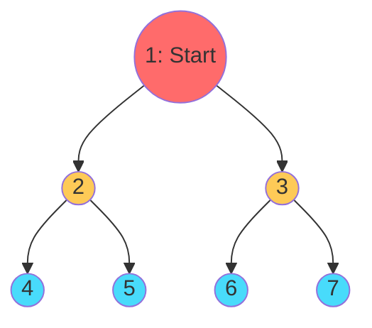
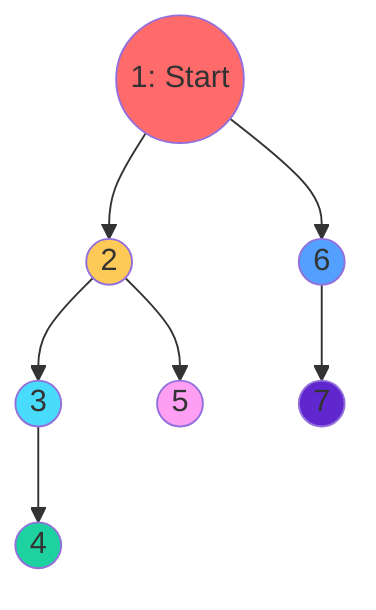
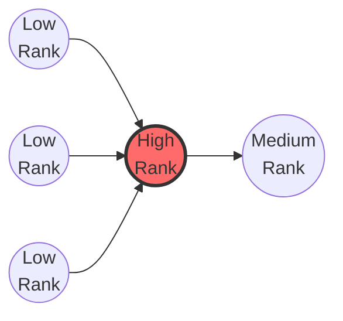
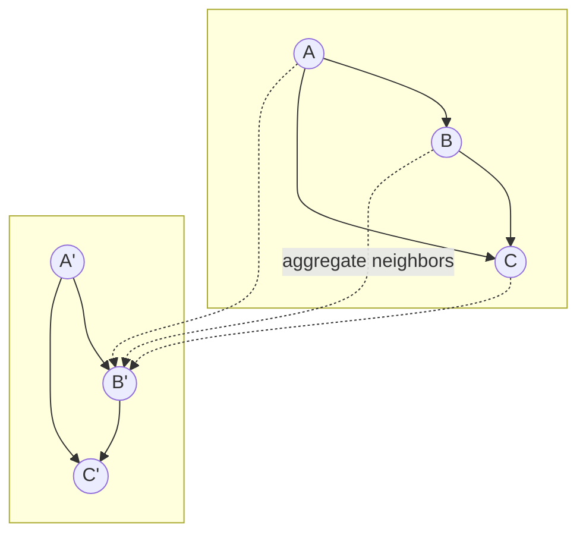

# Chapter 3: Graph Algorithms

## Intuition

### Why Graph Algorithms Matter

Graphs encode structure, but to extract value from that structure, we need algorithms. Graph algorithms answer questions like:
- How do I explore all nodes systematically? (BFS, DFS)
- Which nodes are most important? (PageRank)
- How can a neural network learn from graph structure? (GNNs)

These algorithms form the computational backbone of graph-based machine learning.

### The Exploration Metaphor

Imagine you're exploring a maze (a graph where rooms are nodes and hallways are edges):

**BFS (Breadth-First Search)**: You explore all rooms one step away first, then two steps away, then three. Like ripples spreading from a stone dropped in water.

**DFS (Depth-First Search)**: You go as deep as possible down one path, then backtrack and try another. Like following a single path until you hit a dead end.

Both strategies visit every room, but in different orders. The right choice depends on what you're looking for.

## Visual Explanation

### BFS Exploration Order



BFS visits nodes level by level: First the start node (1), then its neighbors (2,3), then their neighbors (4,5,6,7).

### DFS Exploration Order



DFS goes deep first: 1 -> 2 -> 3 -> 4 (dead end, backtrack) -> 5 (backtrack) -> 6 -> 7.

### PageRank Intuition



Pages linked by many others get high rank. PageRank models a "random surfer" clicking links randomly - where do they end up most often?

### GNN Message Passing



GNNs update each node's representation by aggregating information from neighbors. After $k$ layers, each node "knows" about nodes up to $k$ hops away.

## Mathematical Foundation

### Breadth-First Search (BFS)

BFS explores nodes in order of their distance from the source.

**Algorithm**:
1. Start at source node $s$, mark as visited
2. Add $s$ to a queue
3. While queue is not empty:
   - Dequeue node $u$
   - For each unvisited neighbor $v$ of $u$:
     - Mark $v$ as visited
     - Set $\text{dist}[v] = \text{dist}[u] + 1$
     - Enqueue $v$

**Complexity**: $O(V + E)$ where $V$ = nodes, $E$ = edges

**Key Property**: BFS finds the shortest path (in terms of hops) in unweighted graphs.

### Depth-First Search (DFS)

DFS explores as far as possible along each branch before backtracking.

**Algorithm** (recursive):
```
DFS(node u):
    mark u as visited
    for each neighbor v of u:
        if v is not visited:
            DFS(v)
```

**Algorithm** (iterative with stack):
1. Push source node onto stack
2. While stack is not empty:
   - Pop node $u$
   - If $u$ not visited:
     - Mark $u$ as visited
     - Push all unvisited neighbors onto stack

**Complexity**: $O(V + E)$

**Key Property**: DFS naturally detects cycles (back edges) and computes topological orderings for DAGs.

### PageRank

PageRank computes the "importance" of each node based on the link structure.

**Intuition**: A random surfer starts at a random page. At each step, they either:
- Follow a random outgoing link (probability $d$, typically 0.85)
- Jump to a random page (probability $1-d$)

The PageRank of a page is the probability the surfer ends up there.

**Formula**:
$$PR(v) = \frac{1-d}{N} + d \sum_{u \in B(v)} \frac{PR(u)}{L(u)}$$

Where:
- $d$ = damping factor (typically 0.85)
- $N$ = total number of nodes
- $B(v)$ = set of nodes linking to $v$
- $L(u)$ = number of outgoing links from $u$

**Matrix Form**:
$$\mathbf{r} = (1-d)\frac{\mathbf{1}}{N} + d \cdot M^T \mathbf{r}$$

Where $M$ is the column-stochastic transition matrix: $M_{ij} = \frac{A_{ij}}{\sum_k A_{ik}}$ if node $i$ has outgoing edges.

**Power Iteration**: Start with uniform $\mathbf{r}$, repeatedly apply the formula until convergence.

### Graph Neural Networks (GNN) Intuition

GNNs learn node representations by aggregating information from neighbors.

**Message Passing Framework**:
$$h_v^{(k+1)} = \text{UPDATE}\left(h_v^{(k)}, \text{AGGREGATE}\left(\{h_u^{(k)} : u \in N(v)\}\right)\right)$$

**Graph Convolutional Network (GCN)** simplified:
$$H^{(l+1)} = \sigma\left(\tilde{D}^{-1/2}\tilde{A}\tilde{D}^{-1/2}H^{(l)}W^{(l)}\right)$$

Where:
- $\tilde{A} = A + I$ (adjacency with self-loops)
- $\tilde{D}$ = degree matrix of $\tilde{A}$
- $H^{(l)}$ = node features at layer $l$
- $W^{(l)}$ = learnable weights

**Key Insight**: This is weighted averaging of neighbor features, followed by a linear transformation and nonlinearity. Stacking $k$ layers aggregates $k$-hop neighborhoods.

## Code Example

```python
import numpy as np
from collections import deque, defaultdict

class GraphAlgorithms:
    """
    Implementation of fundamental graph algorithms.
    """

    def __init__(self, adj_matrix):
        """Initialize with adjacency matrix."""
        self.adj_matrix = np.array(adj_matrix)
        self.num_nodes = len(adj_matrix)

        # Build adjacency list
        self.adj_list = defaultdict(list)
        for i in range(self.num_nodes):
            for j in range(self.num_nodes):
                if self.adj_matrix[i][j] != 0:
                    self.adj_list[i].append(j)

    # ==================== BFS ====================

    def bfs(self, start):
        """
        Breadth-First Search from a starting node.

        Returns:
            visited_order: List of nodes in order visited
            distances: Dict mapping node to distance from start
            parent: Dict mapping node to its parent in BFS tree
        """
        visited_order = []
        distances = {start: 0}
        parent = {start: None}

        queue = deque([start])
        visited = set([start])

        while queue:
            node = queue.popleft()
            visited_order.append(node)

            for neighbor in self.adj_list[node]:
                if neighbor not in visited:
                    visited.add(neighbor)
                    distances[neighbor] = distances[node] + 1
                    parent[neighbor] = node
                    queue.append(neighbor)

        return visited_order, distances, parent

    def bfs_shortest_path(self, start, end):
        """Find shortest path using BFS."""
        _, _, parent = self.bfs(start)

        if end not in parent:
            return []  # No path exists

        # Reconstruct path
        path = []
        current = end
        while current is not None:
            path.append(current)
            current = parent[current]

        return path[::-1]

    def bfs_all_distances(self, start):
        """Get distances from start to all reachable nodes."""
        _, distances, _ = self.bfs(start)
        return distances

    # ==================== DFS ====================

    def dfs_recursive(self, start):
        """
        Depth-First Search using recursion.

        Returns:
            visited_order: List of nodes in order visited
        """
        visited = set()
        visited_order = []

        def dfs_visit(node):
            visited.add(node)
            visited_order.append(node)

            for neighbor in self.adj_list[node]:
                if neighbor not in visited:
                    dfs_visit(neighbor)

        dfs_visit(start)
        return visited_order

    def dfs_iterative(self, start):
        """
        Depth-First Search using explicit stack.

        Returns:
            visited_order: List of nodes in order visited
        """
        visited = set()
        visited_order = []
        stack = [start]

        while stack:
            node = stack.pop()

            if node not in visited:
                visited.add(node)
                visited_order.append(node)

                # Add neighbors in reverse order to process them in original order
                for neighbor in reversed(self.adj_list[node]):
                    if neighbor not in visited:
                        stack.append(neighbor)

        return visited_order

    def topological_sort(self):
        """
        Topological sort for directed acyclic graphs (DAGs).
        Returns None if graph has a cycle.
        """
        in_degree = [0] * self.num_nodes

        # Calculate in-degrees
        for i in range(self.num_nodes):
            for j in self.adj_list[i]:
                in_degree[j] += 1

        # Start with nodes that have no incoming edges
        queue = deque([i for i in range(self.num_nodes) if in_degree[i] == 0])
        result = []

        while queue:
            node = queue.popleft()
            result.append(node)

            for neighbor in self.adj_list[node]:
                in_degree[neighbor] -= 1
                if in_degree[neighbor] == 0:
                    queue.append(neighbor)

        # If we couldn't process all nodes, there's a cycle
        if len(result) != self.num_nodes:
            return None

        return result

    # ==================== PAGERANK ====================

    def pagerank(self, damping=0.85, max_iterations=100, tolerance=1e-6):
        """
        Compute PageRank scores using power iteration.

        Args:
            damping: Damping factor (probability of following a link)
            max_iterations: Maximum number of iterations
            tolerance: Convergence threshold

        Returns:
            ranks: Array of PageRank scores for each node
        """
        n = self.num_nodes

        # Build transition matrix
        # M[i][j] = probability of going from j to i
        out_degree = np.sum(self.adj_matrix, axis=1)

        # Handle dangling nodes (no outgoing edges) - distribute uniformly
        transition = np.zeros((n, n))
        for j in range(n):
            if out_degree[j] == 0:
                # Dangling node: distribute probability uniformly
                transition[:, j] = 1.0 / n
            else:
                # Regular node: follow links
                transition[:, j] = self.adj_matrix[j, :] / out_degree[j]

        # Initialize PageRank uniformly
        ranks = np.ones(n) / n

        # Power iteration
        for iteration in range(max_iterations):
            new_ranks = (1 - damping) / n + damping * transition @ ranks

            # Check convergence
            if np.sum(np.abs(new_ranks - ranks)) < tolerance:
                print(f"PageRank converged after {iteration + 1} iterations")
                return new_ranks

            ranks = new_ranks

        print(f"PageRank did not converge after {max_iterations} iterations")
        return ranks

    def pagerank_simple(self, damping=0.85, max_iterations=100):
        """
        Simplified PageRank implementation for understanding.
        """
        n = self.num_nodes
        ranks = {i: 1.0 / n for i in range(n)}

        for _ in range(max_iterations):
            new_ranks = {}

            for node in range(n):
                # Find all nodes that link to this node
                incoming = [j for j in range(n) if self.adj_matrix[j][node] != 0]

                # Sum up PageRank contributions
                rank_sum = 0
                for source in incoming:
                    out_links = np.sum(self.adj_matrix[source])
                    if out_links > 0:
                        rank_sum += ranks[source] / out_links

                new_ranks[node] = (1 - damping) / n + damping * rank_sum

            ranks = new_ranks

        return np.array([ranks[i] for i in range(n)])

    # ==================== GNN SIMULATION ====================

    def gnn_layer(self, node_features, weights, aggregation='mean'):
        """
        Simulate one layer of a Graph Neural Network.

        Args:
            node_features: (n, feature_dim) array of node features
            weights: (feature_dim, output_dim) weight matrix
            aggregation: 'mean', 'sum', or 'max'

        Returns:
            new_features: (n, output_dim) updated node features
        """
        n = self.num_nodes
        feature_dim = node_features.shape[1]

        # Add self-loops to adjacency matrix
        adj_with_self_loops = self.adj_matrix + np.eye(n)

        # Aggregate neighbor features
        aggregated = np.zeros_like(node_features)

        for node in range(n):
            # Get neighbors (including self)
            neighbors = np.where(adj_with_self_loops[node] > 0)[0]
            neighbor_features = node_features[neighbors]

            if aggregation == 'mean':
                aggregated[node] = np.mean(neighbor_features, axis=0)
            elif aggregation == 'sum':
                aggregated[node] = np.sum(neighbor_features, axis=0)
            elif aggregation == 'max':
                aggregated[node] = np.max(neighbor_features, axis=0)

        # Linear transformation
        transformed = aggregated @ weights

        # Apply ReLU activation
        output = np.maximum(0, transformed)

        return output

    def multi_layer_gnn(self, node_features, layer_weights, aggregation='mean'):
        """
        Apply multiple GNN layers.

        Args:
            node_features: Initial node features
            layer_weights: List of weight matrices for each layer
            aggregation: Aggregation method

        Returns:
            Final node representations
        """
        current_features = node_features

        for i, weights in enumerate(layer_weights):
            current_features = self.gnn_layer(current_features, weights, aggregation)
            print(f"Layer {i+1} output shape: {current_features.shape}")

        return current_features


# Demonstration
def demonstrate_algorithms():
    """Demonstrate all graph algorithms."""

    print("=" * 60)
    print("GRAPH ALGORITHMS DEMONSTRATION")
    print("=" * 60)

    # Create a sample graph
    #     0 --> 1 --> 2
    #     |     |     |
    #     v     v     v
    #     3 --> 4 --> 5
    adj_matrix = np.array([
        [0, 1, 0, 1, 0, 0],
        [0, 0, 1, 0, 1, 0],
        [0, 0, 0, 0, 0, 1],
        [0, 0, 0, 0, 1, 0],
        [0, 0, 0, 0, 0, 1],
        [0, 0, 0, 0, 0, 0]
    ])

    g = GraphAlgorithms(adj_matrix)

    # BFS
    print("\n--- BFS from node 0 ---")
    visited, distances, _ = g.bfs(0)
    print(f"Visit order: {visited}")
    print(f"Distances: {distances}")
    print(f"Shortest path 0 to 5: {g.bfs_shortest_path(0, 5)}")

    # DFS
    print("\n--- DFS from node 0 ---")
    print(f"Recursive DFS: {g.dfs_recursive(0)}")
    print(f"Iterative DFS: {g.dfs_iterative(0)}")

    # Topological Sort
    print("\n--- Topological Sort ---")
    topo_order = g.topological_sort()
    print(f"Topological order: {topo_order}")

    # PageRank
    print("\n--- PageRank ---")
    # Create a more interesting graph for PageRank
    #     0 <-- 1 <-- 2
    #     |     ^     ^
    #     v     |     |
    #     3 --> 4 --> 5
    pagerank_adj = np.array([
        [0, 0, 0, 1, 0, 0],  # 0 -> 3
        [1, 0, 0, 0, 0, 0],  # 1 -> 0
        [0, 1, 0, 0, 0, 0],  # 2 -> 1
        [0, 0, 0, 0, 1, 0],  # 3 -> 4
        [0, 1, 0, 0, 0, 1],  # 4 -> 1, 5
        [0, 0, 1, 0, 0, 0],  # 5 -> 2
    ])
    g2 = GraphAlgorithms(pagerank_adj)
    ranks = g2.pagerank(damping=0.85)
    print("PageRank scores:")
    for i, rank in enumerate(ranks):
        print(f"  Node {i}: {rank:.4f}")

    # GNN Simulation
    print("\n--- GNN Layer Simulation ---")
    # Simple graph
    gnn_adj = np.array([
        [0, 1, 1, 0],
        [1, 0, 1, 0],
        [1, 1, 0, 1],
        [0, 0, 1, 0]
    ])
    g3 = GraphAlgorithms(gnn_adj)

    # Initial node features (4 nodes, 3 features each)
    np.random.seed(42)
    node_features = np.random.randn(4, 3)
    print(f"Initial features shape: {node_features.shape}")
    print(f"Initial features:\n{node_features}")

    # Weight matrix (3 input features -> 2 output features)
    weights = np.random.randn(3, 2) * 0.5

    # Apply one GNN layer
    output = g3.gnn_layer(node_features, weights, aggregation='mean')
    print(f"\nAfter GNN layer (mean aggregation):")
    print(f"Output shape: {output.shape}")
    print(f"Output:\n{output}")

    # Multi-layer GNN
    print("\n--- Multi-layer GNN ---")
    layer_weights = [
        np.random.randn(3, 4) * 0.5,  # Layer 1: 3 -> 4 features
        np.random.randn(4, 2) * 0.5,  # Layer 2: 4 -> 2 features
    ]
    final_output = g3.multi_layer_gnn(node_features, layer_weights, 'mean')
    print(f"Final representations:\n{final_output}")


def visualize_bfs_dfs_difference():
    """Show how BFS and DFS explore differently."""

    print("\n" + "=" * 60)
    print("BFS vs DFS EXPLORATION PATTERNS")
    print("=" * 60)

    # Binary tree structure
    #        0
    #       / \
    #      1   2
    #     / \ / \
    #    3  4 5  6
    tree_adj = np.array([
        [0, 1, 1, 0, 0, 0, 0],  # 0 -> 1, 2
        [0, 0, 0, 1, 1, 0, 0],  # 1 -> 3, 4
        [0, 0, 0, 0, 0, 1, 1],  # 2 -> 5, 6
        [0, 0, 0, 0, 0, 0, 0],  # 3 (leaf)
        [0, 0, 0, 0, 0, 0, 0],  # 4 (leaf)
        [0, 0, 0, 0, 0, 0, 0],  # 5 (leaf)
        [0, 0, 0, 0, 0, 0, 0],  # 6 (leaf)
    ])

    g = GraphAlgorithms(tree_adj)

    print("Tree structure:")
    print("       0")
    print("      / \\")
    print("     1   2")
    print("    /\\ /\\")
    print("   3 4 5 6")

    print(f"\nBFS order: {g.bfs(0)[0]}")
    print("  (Level by level: root -> children -> grandchildren)")

    print(f"\nDFS order: {g.dfs_iterative(0)}")
    print("  (Deep first: follows one branch to the end)")


if __name__ == "__main__":
    demonstrate_algorithms()
    visualize_bfs_dfs_difference()
```

**Output:**
```
============================================================
GRAPH ALGORITHMS DEMONSTRATION
============================================================

--- BFS from node 0 ---
Visit order: [0, 1, 3, 2, 4, 5]
Distances: {0: 0, 1: 1, 3: 1, 2: 2, 4: 2, 5: 3}
Shortest path 0 to 5: [0, 1, 2, 5]

--- DFS from node 0 ---
Recursive DFS: [0, 1, 2, 5, 4, 3]
Iterative DFS: [0, 1, 2, 5, 4, 3]

--- Topological Sort ---
Topological order: [0, 1, 2, 3, 4, 5]

--- PageRank ---
PageRank converged after 28 iterations
PageRank scores:
  Node 0: 0.1198
  Node 1: 0.2400
  Node 2: 0.1697
  Node 3: 0.1018
  Node 4: 0.1494
  Node 5: 0.2193

--- GNN Layer Simulation ---
Initial features shape: (4, 3)
After GNN layer (mean aggregation):
Output shape: (4, 2)
```

## ML Relevance

### BFS in Machine Learning

**Neighborhood Sampling**: Many GNN training methods (GraphSAGE, PinSage) use BFS to sample $k$-hop neighborhoods.

**Shortest Path Features**: BFS-computed distances become node pair features in link prediction.

**Level-wise Propagation**: Some GNN implementations explicitly use BFS-like layer-wise computation.

### DFS in Machine Learning

**Graph Embedding**: Random walks (used in Node2Vec, DeepWalk) are related to randomized DFS.

**Subgraph Sampling**: DFS can extract connected subgraphs for mini-batch training.

**Dependency Analysis**: Finding strongly connected components (via DFS) identifies tightly coupled node groups.

### PageRank Applications

**Web Search**: Google's original ranking algorithm.

**Recommendation Systems**: Personalized PageRank for item recommendation.

**Node Importance**: Pre-computing PageRank as node features for GNNs.

**Citation Analysis**: Ranking paper importance in academic networks.

### GNN Applications

**Node Classification**: Predict labels for unlabeled nodes (semi-supervised learning).

**Link Prediction**: Predict whether two nodes should be connected.

**Graph Classification**: Classify entire graphs (e.g., molecule toxicity prediction).

**Recommendation**: User-item graphs for collaborative filtering.

## When to Use / Ignore

### BFS - Use When:
- Finding shortest paths in unweighted graphs
- Level-order traversal needed
- Exploring nodes by distance from source
- Sampling fixed-depth neighborhoods

### DFS - Use When:
- Detecting cycles
- Topological sorting
- Finding connected components
- Maze solving, puzzle problems
- Memory is limited (iterative DFS uses less memory than BFS)

### PageRank - Use When:
- Ranking node importance globally
- Modeling random walk behavior
- Need interpretable importance scores
- Graph has link/citation structure

### GNNs - Use When:
- Data has natural graph structure
- Node features AND structure both matter
- Semi-supervised learning with few labels
- Relational reasoning is important

### Avoid When:
- **BFS/DFS**: Graph is implicit or infinite (use heuristic search instead)
- **PageRank**: Edges don't represent "endorsement" or importance transfer
- **GNNs**: Data is not relational, or simpler methods work well

## Exercises

### Exercise 1: BFS Shortest Path

**Problem**: Given the graph below, use BFS to find the shortest path from node A to node F.

```
A -- B -- C
|    |    |
D -- E -- F
```

**Solution**:
```python
import numpy as np
from collections import deque

# Adjacency matrix (A=0, B=1, C=2, D=3, E=4, F=5)
adj = np.array([
    [0, 1, 0, 1, 0, 0],  # A
    [1, 0, 1, 0, 1, 0],  # B
    [0, 1, 0, 0, 0, 1],  # C
    [1, 0, 0, 0, 1, 0],  # D
    [0, 1, 0, 1, 0, 1],  # E
    [0, 0, 1, 0, 1, 0],  # F
])

def bfs_path(adj, start, end):
    n = len(adj)
    visited = {start: None}
    queue = deque([start])

    while queue:
        node = queue.popleft()
        if node == end:
            break
        for neighbor in range(n):
            if adj[node][neighbor] and neighbor not in visited:
                visited[neighbor] = node
                queue.append(neighbor)

    # Reconstruct path
    path = []
    current = end
    while current is not None:
        path.append(current)
        current = visited.get(current)
    return path[::-1]

labels = {0: 'A', 1: 'B', 2: 'C', 3: 'D', 4: 'E', 5: 'F'}
path = bfs_path(adj, 0, 5)
print("Shortest path:", [labels[n] for n in path])
# Output: Shortest path: ['A', 'B', 'C', 'F'] or ['A', 'B', 'E', 'F'] or ['A', 'D', 'E', 'F']
# All have length 3
```

### Exercise 2: PageRank by Hand

**Problem**: Calculate one iteration of PageRank (with d=0.85) for this simple graph:

```
A --> B --> C
      ^     |
      |-----|
```

Initial ranks: A=0.33, B=0.33, C=0.33

**Solution**:
```python
# PageRank formula: PR(v) = (1-d)/N + d * sum(PR(u)/L(u))
# where L(u) = out-degree of u

d = 0.85
N = 3
initial_pr = {'A': 0.33, 'B': 0.33, 'C': 0.33}

# After one iteration:
# PR(A) = (1-0.85)/3 + 0.85 * 0 = 0.05  (nothing links to A)
# PR(B) = (1-0.85)/3 + 0.85 * (PR(A)/1 + PR(C)/1) = 0.05 + 0.85 * (0.33 + 0.33) = 0.611
# PR(C) = (1-0.85)/3 + 0.85 * (PR(B)/1) = 0.05 + 0.85 * 0.33 = 0.3305

new_pr = {
    'A': (1-d)/N + d * 0,
    'B': (1-d)/N + d * (initial_pr['A']/1 + initial_pr['C']/1),
    'C': (1-d)/N + d * (initial_pr['B']/1)
}

print("After iteration 1:")
for node, rank in new_pr.items():
    print(f"  PR({node}) = {rank:.4f}")
# Output:
# PR(A) = 0.0500
# PR(B) = 0.6110
# PR(C) = 0.3305
```

### Exercise 3: GNN Aggregation

**Problem**: Given node features and a graph, compute the output of one GNN layer with sum aggregation (no weights, no activation - just aggregation).

```
Graph: A -- B -- C (A=0, B=1, C=2)
Features: A=[1,0], B=[0,1], C=[1,1]
```

**Solution**:
```python
import numpy as np

# Adjacency (with self-loops for typical GNN)
adj_with_self = np.array([
    [1, 1, 0],  # A connected to A, B
    [1, 1, 1],  # B connected to A, B, C
    [0, 1, 1],  # C connected to B, C
])

features = np.array([
    [1, 0],  # A
    [0, 1],  # B
    [1, 1],  # C
])

# Sum aggregation: new_h[v] = sum of features of neighbors (including self)
new_features = np.zeros_like(features)

for node in range(3):
    neighbors = np.where(adj_with_self[node] > 0)[0]
    new_features[node] = np.sum(features[neighbors], axis=0)

print("After sum aggregation:")
print(f"  A: {new_features[0]}")  # A+B = [1,0]+[0,1] = [1,1]
print(f"  B: {new_features[1]}")  # A+B+C = [1,0]+[0,1]+[1,1] = [2,2]
print(f"  C: {new_features[2]}")  # B+C = [0,1]+[1,1] = [1,2]
```

## Summary

### Key Takeaways

- **BFS** explores level-by-level, finding shortest paths in $O(V+E)$ time. Essential for neighborhood sampling in GNNs.

- **DFS** explores depth-first, detecting cycles and computing topological orderings. Used for graph embedding and connected component analysis.

- **PageRank** computes global node importance through random walk simulation. The formula involves damping factor $d$ and iterative power method convergence.

- **GNNs** learn node representations through message passing: aggregate neighbor features, transform, and apply nonlinearity. Stacking $k$ layers captures $k$-hop neighborhoods.

- **The connection**: BFS defines GNN neighborhoods, DFS helps with graph sampling, and PageRank-like attention weights appear in Graph Attention Networks (GATs).

### The Big Picture

Graph algorithms are the computational tools that make graph-based ML possible:
- **BFS/DFS** give us systematic ways to explore structure
- **PageRank** quantifies node importance globally
- **GNNs** learn representations that combine features with structure

These foundations enable powerful applications: social network analysis, drug discovery, recommendation systems, and more.

### Next Steps

To go deeper into graph ML:
1. **Study Graph Attention Networks (GATs)**: Learnable aggregation weights
2. **Explore GraphSAGE**: Scalable inductive learning
3. **Learn spectral methods**: Eigenvalues of Laplacian for clustering
4. **Practice with PyTorch Geometric or DGL**: Production-ready GNN frameworks

Graph theory is one of the most exciting frontiers in modern ML. The concepts you've learned here provide the foundation for understanding and building cutting-edge graph learning systems.
