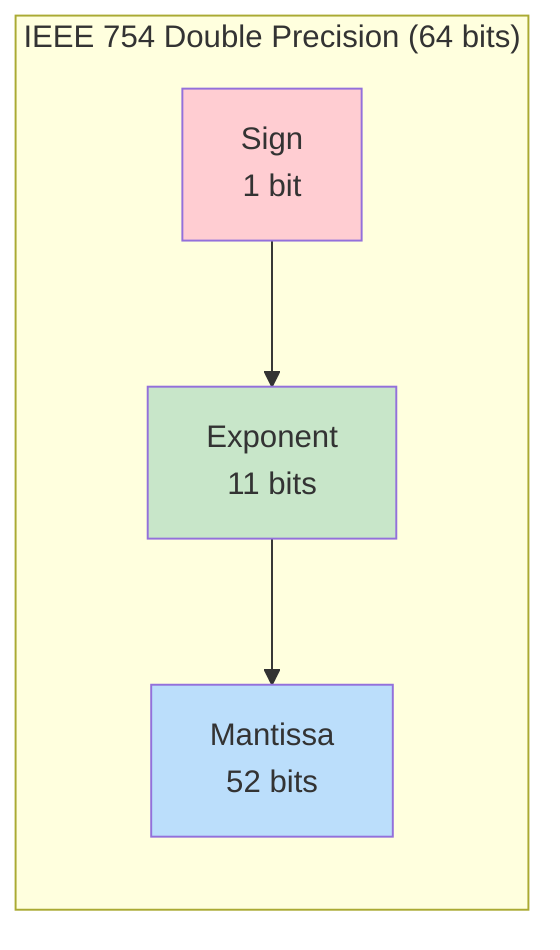
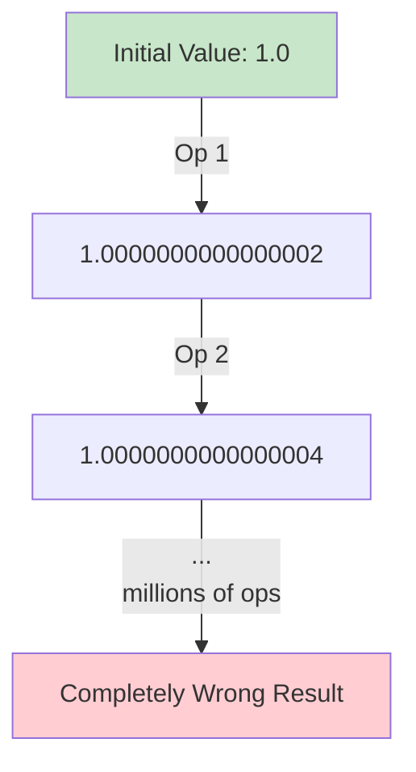

# Numerical Stability

## Intuition

Imagine you're measuring the length of a room with a ruler that only shows whole centimeters. You measure 3.7 meters, but your ruler says "4 meters" or "3 meters." This approximation error might seem small, but if you're calculating the area of a building with thousands of rooms, these tiny errors compound into significant discrepancies.

This is exactly what happens in computers. Despite their impressive speed, computers can only store numbers with finite precision. Every calculation introduces tiny rounding errors, and in machine learning where we perform billions of operations, these errors can accumulate catastrophically.

**Why this matters for ML:**
- A neural network might perform trillions of floating-point operations during training
- Gradients that should be small positive numbers might become exactly zero (underflow)
- Logits in a softmax might become so large they overflow to infinity
- Matrix computations can amplify small errors into completely wrong results

## Visual Explanation

### Floating-Point Number Representation



A floating-point number is stored as:
$$x = (-1)^{\text{sign}} \times (1 + \text{mantissa}) \times 2^{\text{exponent} - \text{bias}}$$

### Error Accumulation



## Mathematical Foundation

### Machine Epsilon

Machine epsilon ($\epsilon_{\text{machine}}$) is the smallest number such that $1 + \epsilon_{\text{machine}} \neq 1$ in floating-point arithmetic.

For IEEE 754 double precision (float64):
$$\epsilon_{\text{machine}} = 2^{-52} \approx 2.22 \times 10^{-16}$$

For IEEE 754 single precision (float32):
$$\epsilon_{\text{machine}} = 2^{-23} \approx 1.19 \times 10^{-7}$$

### Relative Error

When we represent a real number $x$ as a floating-point number $\text{fl}(x)$, the relative error is bounded by:
$$\left|\frac{\text{fl}(x) - x}{x}\right| \leq \frac{\epsilon_{\text{machine}}}{2}$$

### Catastrophic Cancellation

When subtracting two nearly equal numbers, relative error explodes:
$$a = 1.0000001, \quad b = 1.0000000$$
$$a - b = 0.0000001$$

If both $a$ and $b$ have relative error $\epsilon$, then $a - b$ has relative error approximately:
$$\frac{|a| + |b|}{|a - b|} \cdot \epsilon \approx 10^7 \cdot \epsilon$$

### Overflow and Underflow Boundaries

For float64:
- **Maximum value:** $\approx 1.8 \times 10^{308}$
- **Minimum positive normal:** $\approx 2.2 \times 10^{-308}$
- **Overflow:** Numbers larger than max become `inf`
- **Underflow:** Numbers smaller than min become `0`

## Code Example

```python
import numpy as np

# ============================================
# Part 1: Demonstrating Floating-Point Errors
# ============================================

print("=== Floating-Point Basics ===")
print(f"0.1 + 0.2 = {0.1 + 0.2}")
print(f"0.1 + 0.2 == 0.3: {0.1 + 0.2 == 0.3}")

# Machine epsilon
print(f"\nMachine epsilon (float64): {np.finfo(np.float64).eps}")
print(f"Machine epsilon (float32): {np.finfo(np.float32).eps}")

# Catastrophic cancellation
print("\n=== Catastrophic Cancellation ===")
a = 1.0000000000000001
b = 1.0000000000000000
print(f"a = {a}")
print(f"b = {b}")
print(f"a - b = {a - b}")  # Should be 1e-16, but precision lost

# Better example
x = 1e-15
a = (1 + x)
b = 1
print(f"\nWith x = 1e-15:")
print(f"(1 + x) - 1 = {a - b}")  # Lost precision


# ============================================
# Part 2: Overflow and Underflow
# ============================================

print("\n=== Overflow ===")
large_val = np.float64(1e308)
print(f"1e308 = {large_val}")
print(f"1e308 * 10 = {large_val * 10}")  # Overflow to inf

print("\n=== Underflow ===")
small_val = np.float64(1e-308)
print(f"1e-308 = {small_val}")
print(f"1e-308 / 1e10 = {small_val / 1e10}")  # Underflow to 0


# ============================================
# Part 3: Unstable Softmax Implementation
# ============================================

print("\n=== Unstable Softmax ===")

def unstable_softmax(x):
    """Naive softmax - prone to overflow"""
    exp_x = np.exp(x)
    return exp_x / np.sum(exp_x)

def stable_softmax(x):
    """Numerically stable softmax"""
    x_max = np.max(x)
    exp_x = np.exp(x - x_max)  # Subtract max to prevent overflow
    return exp_x / np.sum(exp_x)

# Small values - both work
small_logits = np.array([1.0, 2.0, 3.0])
print(f"Small logits: {small_logits}")
print(f"Unstable: {unstable_softmax(small_logits)}")
print(f"Stable:   {stable_softmax(small_logits)}")

# Large values - unstable fails
large_logits = np.array([1000.0, 1001.0, 1002.0])
print(f"\nLarge logits: {large_logits}")
print(f"Unstable: {unstable_softmax(large_logits)}")  # nan due to inf/inf
print(f"Stable:   {stable_softmax(large_logits)}")    # Works correctly


# ============================================
# Part 4: Log-Sum-Exp Trick
# ============================================

print("\n=== Log-Sum-Exp Trick ===")

def unstable_logsumexp(x):
    """Naive implementation - prone to overflow"""
    return np.log(np.sum(np.exp(x)))

def stable_logsumexp(x):
    """Numerically stable log-sum-exp"""
    x_max = np.max(x)
    return x_max + np.log(np.sum(np.exp(x - x_max)))

x = np.array([1000.0, 1000.5, 1001.0])
print(f"x = {x}")
print(f"Unstable logsumexp: {unstable_logsumexp(x)}")  # inf
print(f"Stable logsumexp:   {stable_logsumexp(x)}")    # Correct


# ============================================
# Part 5: Safe Log and Division
# ============================================

print("\n=== Safe Operations ===")

def safe_log(x, eps=1e-10):
    """Avoid log(0) = -inf"""
    return np.log(np.maximum(x, eps))

def safe_divide(a, b, eps=1e-10):
    """Avoid division by zero"""
    return a / np.maximum(b, eps)

print(f"log(0) = {np.log(0)}")  # -inf
print(f"safe_log(0) = {safe_log(0)}")  # Large negative but finite

print(f"1/0 = {1.0/np.float64(0)}")  # inf
print(f"safe_divide(1, 0) = {safe_divide(1, 0)}")  # Large but finite


# ============================================
# Part 6: Accumulation Error in Summation
# ============================================

print("\n=== Summation Error ===")

# Naive summation
def naive_sum(arr):
    total = 0.0
    for x in arr:
        total += x
    return total

# Kahan summation (compensated)
def kahan_sum(arr):
    total = 0.0
    compensation = 0.0
    for x in arr:
        y = x - compensation
        t = total + y
        compensation = (t - total) - y
        total = t
    return total

# Create array with one large and many small values
n = 10000000
arr = np.array([1.0] + [1e-10] * n, dtype=np.float64)
true_sum = 1.0 + n * 1e-10

print(f"True sum: {true_sum}")
print(f"Naive sum: {naive_sum(arr)}")
print(f"Kahan sum: {kahan_sum(arr)}")
print(f"NumPy sum: {np.sum(arr)}")


# ============================================
# Part 7: Matrix Condition Number
# ============================================

print("\n=== Matrix Conditioning ===")

# Well-conditioned matrix
A_good = np.array([[4, 1], [1, 3]], dtype=np.float64)
cond_good = np.linalg.cond(A_good)
print(f"Well-conditioned matrix condition number: {cond_good:.2f}")

# Ill-conditioned matrix (nearly singular)
epsilon = 1e-10
A_bad = np.array([[1, 1], [1, 1 + epsilon]], dtype=np.float64)
cond_bad = np.linalg.cond(A_bad)
print(f"Ill-conditioned matrix condition number: {cond_bad:.2e}")

# Solving linear system
b = np.array([1, 1])
print(f"\nSolving Ax = b where b = {b}")
x_good = np.linalg.solve(A_good, b)
x_bad = np.linalg.solve(A_bad, b)
print(f"Solution (well-conditioned): {x_good}")
print(f"Solution (ill-conditioned): {x_bad}")
```

## ML Relevance

### Where Numerical Stability Appears

1. **Softmax Function**: Used in attention mechanisms and classification
   - Logits can become very large, causing overflow in naive implementations
   - The stable version subtracts the maximum value before exponentiating

2. **Cross-Entropy Loss**: Combines softmax with log
   - `log(softmax(x))` needs special handling
   - PyTorch's `F.cross_entropy` uses log-softmax for stability

3. **Batch Normalization**: Division by standard deviation
   - Small variance can cause division instability
   - Add epsilon: $\frac{x - \mu}{\sqrt{\sigma^2 + \epsilon}}$

4. **Gradient Computation**: Automatic differentiation
   - Long chains of multiplications can overflow or underflow
   - Gradient checkpointing helps manage this

5. **Attention Mechanisms**: Scaled dot-product attention
   - Division by $\sqrt{d_k}$ prevents softmax saturation
   - Large dot products would make attention weights nearly one-hot

### Framework Implementations

Modern ML frameworks handle many stability issues automatically:

```python
import torch
import torch.nn.functional as F

# PyTorch's stable implementations
logits = torch.tensor([1000.0, 1001.0, 1002.0])

# Stable softmax
probs = F.softmax(logits, dim=0)

# Stable cross-entropy (uses log-softmax internally)
targets = torch.tensor([2])  # Class index
loss = F.cross_entropy(logits.unsqueeze(0), targets)

print(f"Stable softmax: {probs}")
print(f"Cross-entropy loss: {loss.item()}")
```

## When to Use / Ignore

### When to Worry About Numerical Stability

- **Deep networks**: More layers = more operations = more error accumulation
- **Large logits/activations**: Pre-softmax values > 100 are warning signs
- **Very small values**: Probabilities < 1e-30 will underflow
- **Mixed precision training**: float16 has much smaller range than float32
- **Custom loss functions**: Any time you implement your own math

### When You Can Relax

- **Using standard framework functions**: PyTorch, TensorFlow handle stability internally
- **Shallow networks with bounded activations**: Less room for error accumulation
- **Well-scaled inputs**: Normalized data stays in safe numerical range
- **Using float64**: More precision, though slower

### Common Pitfalls

1. **Implementing softmax from scratch** without the max-subtraction trick
2. **Taking log of probabilities** without adding epsilon
3. **Ignoring condition numbers** when solving linear systems
4. **Comparing floats with ==** instead of `np.isclose()`
5. **Iterative algorithms without convergence checks** that might overflow

## Exercises

### Exercise 1: Implement Stable Binary Cross-Entropy

**Problem**: Implement a numerically stable binary cross-entropy loss function.

The unstable formula is:
$$L = -[y \log(p) + (1-y) \log(1-p)]$$

**Solution**:
```python
def stable_binary_cross_entropy(y_true, y_pred, eps=1e-15):
    """
    Numerically stable binary cross-entropy.

    Args:
        y_true: Ground truth labels (0 or 1)
        y_pred: Predicted probabilities
        eps: Small constant to prevent log(0)

    Returns:
        Binary cross-entropy loss
    """
    # Clip predictions to prevent log(0) and log(1)
    y_pred = np.clip(y_pred, eps, 1 - eps)

    # Compute stable BCE
    loss = -y_true * np.log(y_pred) - (1 - y_true) * np.log(1 - y_pred)
    return np.mean(loss)

# Test
y_true = np.array([1, 0, 1, 0])
y_pred = np.array([0.9999999999, 0.0000000001, 0.7, 0.3])
print(f"Stable BCE: {stable_binary_cross_entropy(y_true, y_pred)}")
```

### Exercise 2: Debug Numerical Instability

**Problem**: The following code produces NaN values. Fix it.

```python
def buggy_normalize(x):
    return x / np.sum(x)

x = np.array([1e-300, 2e-300, 3e-300])
result = buggy_normalize(x)  # Returns [nan, nan, nan]
```

**Solution**:
```python
def stable_normalize(x, eps=1e-10):
    """
    The problem: when x values are very small, sum(x) can underflow.
    Solution: Scale up before normalizing, or use log-space computation.
    """
    # Method 1: Scale up
    x_max = np.max(np.abs(x))
    if x_max > 0:
        x_scaled = x / x_max
        return x_scaled / np.sum(x_scaled)
    return np.ones_like(x) / len(x)

# Alternative: Work in log space
def log_normalize(log_x):
    """Normalize values given in log space"""
    log_sum = stable_logsumexp(log_x)
    return np.exp(log_x - log_sum)

x = np.array([1e-300, 2e-300, 3e-300])
print(f"Stable normalize: {stable_normalize(x)}")
print(f"Log normalize: {log_normalize(np.log(x))}")
```

### Exercise 3: Detect Ill-Conditioned Systems

**Problem**: Write a function that warns when solving an ill-conditioned linear system.

**Solution**:
```python
def safe_solve(A, b, condition_threshold=1e10):
    """
    Solve Ax = b with condition number warning.

    Args:
        A: Coefficient matrix
        b: Right-hand side vector
        condition_threshold: Warn if condition number exceeds this

    Returns:
        Solution x, or None if system is too ill-conditioned
    """
    cond = np.linalg.cond(A)

    if cond > condition_threshold:
        print(f"WARNING: Matrix is ill-conditioned (cond={cond:.2e})")
        print("Solution may be inaccurate. Consider regularization.")

        # Try regularization
        A_reg = A + np.eye(A.shape[0]) * 1e-6
        cond_reg = np.linalg.cond(A_reg)
        print(f"Regularized condition number: {cond_reg:.2e}")

        return np.linalg.solve(A_reg, b), False

    return np.linalg.solve(A, b), True

# Test with ill-conditioned matrix
A = np.array([[1, 1], [1, 1 + 1e-12]])
b = np.array([2, 2])
x, is_stable = safe_solve(A, b)
print(f"Solution: {x}")
```

## Summary

- **Machine epsilon** defines the fundamental limit of floating-point precision ($\approx 10^{-16}$ for float64)
- **Overflow** occurs when numbers exceed $\approx 10^{308}$; **underflow** when below $\approx 10^{-308}$
- **Catastrophic cancellation** amplifies errors when subtracting nearly equal numbers
- **Stable softmax** subtracts the maximum value before exponentiating: $\text{softmax}(x) = \text{softmax}(x - x_{\max})$
- **Log-sum-exp trick** prevents overflow: $\log\sum e^{x_i} = x_{\max} + \log\sum e^{x_i - x_{\max}}$
- **Condition number** measures how sensitive a matrix computation is to input errors
- **Always add epsilon** when dividing or taking logarithms of quantities that might be zero
- **Modern frameworks** handle most stability issues, but custom code requires careful attention
- **Float32 vs Float64**: Less precision means tighter stability constraints; mixed-precision training requires extra care
